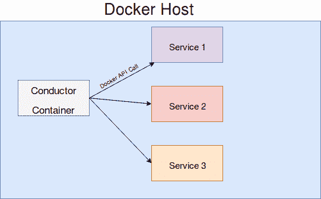

# 使用 Ansible Container

正如我们在第一章*《使用 Docker 构建容器》*中所见，容器化正在改变关键 IT 基础设施的维护和部署方式。随着 DevOps 方法论和思维方式在各组织中不断发展，开发与运维角色之间的界限越来越模糊。尽管 Docker 等工具持续发展和进化，但仍然需要开发新的工具，以应对不断增长的容器化应用部署和扩展需求。

Ansible 是一个独特的自动化框架，正如我们在第一章*《使用 Docker 构建容器》*中所见，它依赖于无代理架构，通过 SSH 协议从集中位置将服务器和虚拟化应用程序带入所需状态。与其他核心自动化工具相比，Ansible 提供了一种不同的方法，它与其他配置管理工具（如 Chef 和 Puppet）有所不同，后者依赖于代理和集中式服务器来存储和维护配置状态。

Ansible Container 项目旨在解决将关键的配置管理技术引入当前手动构建和部署 Docker 容器镜像的过程中的需求。当前，Docker 和 Docker 工具更侧重于使用 Swarm 和 Docker Compose 部署容器到 Docker 原生环境中。Ansible Container 是许多标准 Docker 工具的封装器，提供了将项目部署到各种云提供商、Kubernetes 和 OpenShift 的功能。撰写本文时，其他容器编排工具，如 Docker Swarm 和 Apache Mesos，尚不被支持。如果说 Dockerfile 在单体应用部署时代类似于 Shell 脚本，那么 Ansible Container 就是将自动化和可重复性带入容器生态系统的解决方案。由于 Ansible Core 使用 playbook 和 SSH 作为接口来实现期望的状态，Ansible Container 可以使用相同的 playbook 和原生容器 API 来构建和部署容器。

如果你或你的组织已经在使用 Ansible 角色来定制化部署应用程序和服务，那么这些相同的角色可以被用来将这些应用程序和服务转化为容器，帮助简化你的容器构建流程。在从裸机和虚拟化部署转向容器化时，你可以放心，定制的配置和设置将在构建容器时得到保留。

本章我们将学习：

+   Ansible Container 和微服务架构简介

+   Docker Compose 快速入门

+   Ansible Container 工作流

+   Ansible Container 快速入门

# Ansible Container 和微服务架构简介

虽然使用 Ansible Container 在重用现有 Ansible 工件、模块和剧本方面具有大量的优势，但必须仔细考虑将现有服务移植过来所需的任何更改。Ansible 给予您在编写剧本和角色时极大的自由度，以适应您组织架构和资源限制的独特性。例如，一个典型的网页应用程序可能具有三层不同的功能：一个网页服务器，为您的最终用户提供网站；一个数据库用于存储数据；以及一个缓存，提供从数据库中常访问的数据给网页服务器。根据架构和资源限制，这些服务可能以多种方式实现。您可能将网页服务器、缓存层和数据库部署在三组独立的服务器集群上。您也可以选择将网页服务器和缓存层部署在同一集群上，而数据库则部署在第二集群上。或者，所有三层可能部署在同一裸机或虚拟化的服务器集群上，并由负载均衡器在必要时提供冗余。您的基础设施是一个独特的“雪花”，Ansible 让您可以自由地编写并以几乎任何适合您需求的配置部署剧本角色。

*微服务架构* 是用来描述将应用服务独立且模块化地拆分为独立且可部署单元的术语。在容器的世界里，您希望每个容器都符合微服务架构，将每个服务作为一个独立的容器进行创建，这样可以独立于其他服务进行部署和扩展。虽然在同一个容器中部署多个服务是可能的，但通常这是一个不好的做法，因为每增加一个服务，容器就会增加额外的层，导致构建和部署新容器时产生不必要的开销。

在前面的示例中，每个核心服务（网页服务器、缓存和数据库）都将是一个独立的微服务，您希望将其隔离并封装到容器中。如果您的网页应用程序进入生产环境后，您发现预计的流量比原先预期的要高得多，且数据库查询成为瓶颈，那么根据需求动态部署更多的缓存或数据库容器将带来巨大的优势。采用以微服务为导向的容器设计将使您的基础设施更加简化、易于部署，并且能够更快地扩展，以满足需求较大的用户。

在考虑将现有的 Ansible 角色迁移到 Ansible Container 项目时，关键是要考虑你的角色目前有多紧密集成。理想情况下，Ansible 角色应该能够独立运行，几乎不依赖于其他环境特性。是不是感觉这听起来像我们之前描述的容器化微服务？这正是 Ansible Container 在其他配置管理工具中独树一帜的原因。Ansible 的原语已经设计得很好地适应容器化生态系统。即使你当前没有使用 Ansible 作为你的配置管理工具，Ansible Container 仍然是一个非常出色的工具，适用于从开发到生产的整个容器构建、维护和部署过程。

# Docker Compose 简介

Docker Compose 是 Docker 工作流工具之一，允许你轻松地同时构建和运行多个容器。在开始使用 Ansible Container 之前，了解 Docker Compose 的基本原理非常重要，因为 Ansible Container 的许多核心功能都围绕 Docker Compose 构建。

在上一章中，我举了一个例子，展示了如何创建三个 Apache Web 服务器容器，以演示如何利用相同的容器基础镜像同时运行多个容器。使用 Docker Compose，你可以通过提供一个 `YAML` 定义文件来描述你想要运行的容器、容器运行时所需的任何 docker `run` 参数（如端口、卷等）以及运行容器之前要创建的任何链接或依赖，而无需提供三个单独的 docker `run` 命令。当执行 Docker Compose 时，它将自动尝试启动 `YAML` 文件中描述的容器。如果镜像尚未在本地缓存，它将尝试从互联网上下载，或者如果提供了 Dockerfile，它将构建容器镜像。让我们做一个快速练习，了解 Docker Compose 的工作原理。

如果你没有使用提供的 Vagrant 实验环境，如在第一章 *构建 Docker 容器* 中讨论的那样，你需要首先使用以下命令下载 Docker Compose。所提供的步骤假设你已经在 Linux 或 macOS 机器上安装并运行了 Docker Engine。确保安装与现有 Docker Engine 版本相同的 Docker Compose，以确保最大兼容性。执行以下命令下载 Docker Compose 可执行文件，并将其复制到 `/usr/local/bin` 目录，并赋予 `execute` 权限。

```
sudo curl -L https://github.com/docker/compose/releases/download/1.17.0/docker-compose-`uname -s`-`uname -m` -o /usr/local/bin/docker-compose

sudo chmod +x /usr/local/bin/docker-compose
```

最新的安装文档可以在 [`docs.docker.com/compose/install`](https://docs.docker.com/compose/install) 找到。

默认情况下，Docker Compose 会在您当前工作目录中查找名为 `docker-compose.yml` 的文件。我提供了一个示例 `docker-compose.yml` 文件作为参考。在您的工作站上，创建一个名为 `docker-compose` 的目录，并在该目录下创建一个空白的 `docker-compose.yml` 文件。然后粘贴以下内容：

```
version: '2'
services:
  Cache_Server:
    image: memcached:1.4.36
    ports:
      - 11211:11211
    volumes:
      - .:/var/lib/MyVolume
```

让我们逐行分析这个文件：

+   `version`：这一行表示要使用哪个版本的 Docker Compose API。在本例中，我们使用的是版本 2。写作时，API 还有版本 3，提供了一些新特性。然而，对于我们的目的，使用版本 2 就足够了。`version` 参数通常是 Docker Compose 文件的开头，并且没有缩进。

+   `services`：`services` 行启动了您的 `docker-compose.yml` 文件中列出要创建的每个服务容器的部分。在这个特定的 Docker Compose 文件中，我们将创建一个名为 `Cache_Server` 的服务，它启动一个 `memcached` 容器。您指定的每个服务都应该在 `services` 声明下缩进两个空格。还应注意，服务名称是用户定义的，并用于生成容器名称。在创建多容器的 Docker Compose 文件时，Docker 提供了基于服务名称的简单 DNS 解析。更多内容请参考第八章，*构建和部署多容器项目*。

+   `image`：`image` 用于指定您希望容器基于的容器镜像。在本例中，我们使用的是来自 Docker Hub 的官方 `memcached` 镜像，指定版本为 1.4.36。如果我们希望始终使用最新版本的镜像，也可以使用 `latest` 关键字来代替版本号。

+   `ports`：`ports` 参数指示要转发到容器的主机端口。在本例中，我们将端口 `11211` 转发到暴露的容器端口 `11211`。类似于 `docker run`，端口必须按 `host:container` 的格式指定。这是一个 `YAML` 列表，因此每个端口必须缩进并以连字符（`-`）作为前缀。

+   `volumes`：该参数指定您希望使 Docker 主机上的任何目录或存储卷可供容器访问。如果容器中有您可能想要备份、导出或以其他方式与容器共享的数据，这将非常有用。这个卷挂载仅作为语法示例。与 `ports` 参数类似，`volumes` 以 `hostDirectory:containerDirectory` 的格式接收一个列表。

要使用 Docker Compose 启动我们的容器，只需执行命令`docker-compose up`。默认情况下，这将按顺序启动 Docker Compose 文件中的所有容器，除非指定了容器依赖。使用`docker-compose`启动的容器将以`attached`模式启动，这意味着容器进程会运行，并接管您使用的终端。与`docker run`类似，我们可以提供`-d`标志，以`detached`模式运行容器，这样我们就可以在同一个终端中进行一些验证：

```
docker-compose up -d 
```

您将看到，类似于`docker run`，Docker Compose 会自动判断 Docker 主机上没有容器镜像，并成功从互联网下载镜像及相应的层。

```
ubuntu@node01:/vagrant/Docker_Compose/test$ docker-compose up -d
Creating network "test_default" with the default driver
Pulling Cache_Server (memcached:1.4.36)...
1.4.36: Pulling from library/memcached
56c7afbcb0f1: Pull complete
49acdc7c75c9: Pull complete
152590a2a704: Pull complete
4dc7b8165378: Pull complete
4cb74c11bcdd: Pull complete
Digest: sha256:a2dfef5700944ec8bb2d2c0d6f5b2819324b1b91647dc09847ce81e7a91e3fe4n
Status: Downloaded newer image for memcached:1.4.36
Creating test_Cache_Server_1 ...
Creating test_Cache_Server_1 ... done
```

运行`docker ps -a`将显示 Docker Compose 成功创建了具有正确暴露端口和挂载卷的运行容器，这些信息列在我们的`docker-compose.yml`文件中：

```
ubuntu@node01:/vagrant/Docker_Compose/test$ docker ps -a
CONTAINER ID        IMAGE               COMMAND                  CREATED             STATUS              PORTS                      NAMES
cacf58b455f3        memcached:1.4.36    "docker-entrypoint.sh"   7 minutes ago       Up 7 minutes        0.0.0.0:11211->11211/tcp   test_Cache_Server_1
```

我们可以使用`telnet`来确保`memcached`应用程序正常运行，并通过主机网络进行转发。使用`telnet`，我们可以直接从`Memcached`存储和检索数据：

```
ubuntu@node01:/vagrant/Docker_Compose/test$ telnet localhost 11211
Trying 127.0.0.1...
Connected to localhost.
Escape character is '^]'.
STAT active_slabs 0
STAT total_malloced 0
END 
```

运行`stats slabs`命令可以让我们知道`memcached`已经部署并按预期运行。

现在我们对 Docker 和 Docker Compose 有了简要的介绍，已经掌握了开始使用 Ansible Container 所需的基本技能。

# Ansible Container 工作流

与其他编排和自动化工具类似，Ansible Container 包含一组构成容器化工作流的实用工具。使用 Ansible Container，您可以创建、构建、运行和部署容器，从开发到生产，利用 Ansible Container 自带的工具套件。Ansible Core 的*开箱即用*方法论也被应用到 Ansible Container 中，为开发人员和系统管理员提供完整的容器化工作流解决方案。以下是 Ansible Container 的主要功能概述，以及它们如何与容器化应用程序的典型生命周期相对应：

+   `ansible-container init`：用于初始化启动一个 Ansible Container 项目。`init`会构建并创建启动 Ansible Container 项目所需的目录框架和基础文件。

+   `ansible-container build`：顾名思义，`build`将解析项目中的主要文件，并尝试构建描述的容器。Ansible Container 通过首先创建一个被称为`conductor`容器来实现这一点。`conductor`容器是在项目的构建阶段创建的主容器，里面运行着 Ansible 的副本。一旦其他容器启动，`conductor`容器负责对它们运行 Ansible 角色和剧本，以使容器进入预期状态。

+   `ansible-container run`：`run`的工作方式与`docker run`非常相似，执行时，`run`会将构建好的容器尝试在主机的容器引擎中运行。默认情况下，`run`命令会考虑在`container.yml`文件中列出的任何开发选项，除非在运行时传入`-- production`标志。

+   `ansible-container destroy`：停止所有运行中的容器，并移除已构建的镜像文件。此命令在从头测试端到端部署时非常有用。

+   `ansible-container push`：此命令将你用 Ansible Container 构建的容器镜像推送到你选择的容器注册表中，如 Docker Hub、Quay 或 GCR。此命令类似于`docker push`。

+   `ansible-container deploy`：`deploy`（以前叫做`ShipIt`）会生成一个自定义的 Ansible playbook 和角色，将你的容器部署到云服务提供商。写这篇文章时，`deploy`仅支持 OpenShift 和 Kubernetes。使用`ansible-playbook`命令运行这个 playbook，将把容器部署到指定的提供商。

如你所见，Ansible Container 自带一个端到端生命周期管理系统，允许你从开发到生产管理容器。Ansible Container 利用强大且可定制的 Ansible 配置管理系统，使容器的创建和部署类似于裸金属或虚拟节点。

所有 Ansible Container 的子命令可以通过运行`ansible-container --help`来查看。

# Ansible Container 快速入门

本章的这一部分将重点介绍如何开始使用 Ansible Container，初始化一个基础项目，并重新创建之前的`memcached`示例。如果你没有跟随 GitHub 上提供的 Vagrant 实验，第一步是使用`python-pip`包管理器安装 Ansible Container。以下步骤将介绍如何在基于 Debian 的 Linux 发行版上安装支持 Docker 的 Ansible Container：

```
sudo apt-get update
sudo apt-get install python-pip
sudo pip install ansible-container docker
```

# Ansible Container 初始化

现在，你应该已经在你的环境中安装并准备好运行 Ansible Container。启动一个新的 Ansible Container 项目所需的第一个命令是`ansible-container init`。登录到你的 Vagrant 虚拟机后，在`/vagrant`目录下创建一个空目录并输入：

```
ubuntu@node01:~$ mkdir /vagrant/demo
ubuntu@node01:~$ cd /vagrant/demo
ubuntu@node01:/vagrant/demo$ ansible-container init 
Ansible Container initialized.
```

需要注意的是，最终的实验练习可以在官方书籍的 GitHub 仓库中找到，目录路径为：`AnsibleContainer/demo`。

当 Ansible Container 成功创建新项目时，它将返回响应`Ansible Container initialized`。

如前所述，`init`命令创建了构建 Ansible Container 项目所需的基本目录结构和布局。导航到该目录并查看目录列表，可以让你了解 Ansible Container 项目的样子：

```
demo
├── ansible.cfg
├── ansible-requirements.txt
├── container.yml
├── meta.yml
└── requirements.yml
```

让我们逐一查看这些文件，以便了解它们在 Ansible Container 项目中的作用：

+   `ansible.cfg`：Ansible 引擎的主要配置文件。任何希望 Ansible `conductor`容器利用的设置都应该放在此文件中。如果你已经熟悉使用 Ansible 进行配置管理任务，那么你应该对`ansible.cfg`文件有所了解。大多数情况下，除非在容器构建过程中需要以特定方式运行 Ansible，否则可以安全地忽略此文件。有关 Ansible 配置选项的更多信息，可以参考 Ansible 文档：[`docs.ansible.com.`](https://docs.ansible.com)

+   `ansible-requirements.txt`：`ansible-requirements.txt`文件用于指定你的剧本成功运行所需的任何 Python pip 依赖项。Ansible 引擎是由一系列模块构建的，这些模块执行剧本中描述的任务。任何运行 Ansible 角色所需的额外 Python 包都列在此文件中。

+   `container.yml`：描述容器的状态，包括基础镜像、暴露的端口和卷挂载。`container.yml`的语法类似于 Docker Compose 格式，但有一些差异，我们将在本书中逐步介绍。

+   `meta.yml`：`meta.yml`文件包含有关容器项目的元数据，包括作者名称、版本信息、软件许可详情和标签等。这些信息使得其他用户在你选择将项目分享到 Ansible Galaxy 时，能够轻松找到你的项目。

+   `requirements.yml`：定义容器项目将使用的任何 Ansible Galaxy 角色和版本信息。在此文件中，你可以描述项目所需的具体角色和角色版本。Ansible Container 将在构建容器项目之前从 Ansible Galaxy 下载这些角色。通过在`requirements.yml`文件中指定角色，可以确保项目始终使用相同的角色来构建基础容器镜像。需要注意的是，`ansible-requirements.yml`与`requirements.yml`之间的区别。`requirements.yml`用于管理项目所依赖的 Ansible 角色，而`ansible-requirements.yml`用于管理这些角色可能需要的 Python pip 包。

现在我们已经了解了 Ansible Container 项目的基本结构，接下来可以深入探索并开始创建一个简单的 Ansible Container 项目。还记得我们之前创建的 Docker Compose 项目吗？我们可以以此为起点，通过编辑`container.yml`文件将该项目迁移到 Ansible Container。在文本编辑器中打开`container.yml`文件。默认情况下，`container.yml`文件带有预填充的结构，这在很多方面类似于 Docker Compose 文件。你的`container.yml`文件应该类似于以下内容。为了节省空间，我已经删除了许多注释和示例数据：

```
version: "2"
settings:
  conductor_base: centos:7

services: {}

registries: {}
```

每个部分都有其特定目的，用于构建你的 Ansible Container 项目。理解每个 `YAML` 定义的作用非常重要。文件中默认的注释提供了各个部分所使用的设置示例。以下是 `container.yml` 文件的关键部分及如何在 Ansible Container 项目中使用这些部分的列表：

+   `version`：`version` 部分标明了使用哪个版本的 Docker Compose API。如前所述，Ansible Container 是许多 Docker Compose 服务的封装器。在这里，我们可以指定要使用哪个版本的 Docker Compose API 来运行我们的容器。

+   `settings`：`settings` 部分用于指定附加集成或修改我们 Ansible Container 项目的任何默认行为。默认情况下，有一个设置已启用。

+   `conductor_base`：这表示我们希望项目使用哪个基础镜像。`conductor` 容器负责创建用于运行 Ansible playbooks 和 roles 的 Python 环境。`conductor` 镜像将连接到它创建的其他容器，在构建过程中提供访问其自身 Python 环境的权限。因此，使用与计划构建的容器镜像相同的基础容器操作系统非常重要，这样可以确保 Python 和 Ansible 方面的完全兼容性。可以把 conductor 镜像看作是一个类似于标准 Ansible 实现中 Ansible 控制节点的容器。这个容器将通过 Docker API 直接与其他节点（容器）进行交互，以将其他容器带入期望的状态。构建完容器后，`conductor` 容器会默认自我删除，除非你指示 Ansible Container 保留该镜像以便进行调试。除了指定我们的 conductor 镜像外，我们还可以在设置部分指定其他集成项，如 Kubernetes 凭证或 OpenShift 端点。我们将在后续章节中深入探讨这些内容。

+   `services`：`services` 部分几乎与我们 Docker Compose 文件中的 `services` 部分相同。在该部分中，我们将提供 `YAML` 定义，描述容器的运行状态：我们将使用的基础镜像、容器名称、暴露的端口、卷等。`services` 部分中描述的每个容器都是一个由我们的 conductor 镜像通过 Ansible 配置的 *节点*。默认情况下，`services` 部分被禁用，`YAML` 定义旁边有两个大括号：`{}`。在添加容器定义之前，删除大括号，以便 Ansible Container 可以访问子数据。

+   `registries`：我们 `container.yml` 文件的最后一部分是 `registries` 部分。在这里，您可以指定容器注册表，Ansible Container 将从中拉取镜像。默认情况下，Ansible Container 使用 Docker Hub，但您也可以指定其他注册表，例如 Quay、`gcr.io` 或本地托管的容器注册表。此部分还与 `ansible-container` push 命令一起使用，将您构建的容器推送到您选择的注册表服务。

# Ansible Container 构建

我们的 Ansible Container 工作流的第二部分是构建过程。现在我们已经初始化了第一个项目，即使没有定义任何服务或角色，我们仍然可以探索 `ansible-container build` 功能的工作原理。从 `demo` 目录中运行 `ansible-container build` 命令。您应该会看到类似于以下的输出：

```
ubuntu@node01:/vagrant/AnsibleContainer/demo$ ansible-container build
Building Docker Engine context...
Starting Docker build of Ansible Container Conductor image (please be patient)...
Parsing conductor CLI args.
Docker™ daemon integration engine loaded. Build starting.       project=demo
All images successfully built.
Conductor terminated. Cleaning up.      command_rc=0 conductor_id=c4f7806f8afb0910e4f7d25e5c37be32800ed8b41618d246f70da0508322c479 save_container=False
```

在本地工作站上第一次运行 Ansible Container 构建可能需要几分钟时间才能完成，因为在开始之前需要先构建 `conductor` 容器。需要记住的是，`conductor` 容器负责通过 Docker API 连接到服务容器，并在其上执行 Ansible 剧本和角色。由于这是一个基本的 `ansible-container build` 命令示例，所以我们正在创建的容器上没有要运行的 Ansible 剧本。稍后在书中，我们将编写自己的角色，真正探讨 `conductor` 容器的功能。下图演示了 `conductor` 容器如何连接到服务容器：



图 1：Conductor 容器将服务容器带入所需状态

然而，在此示例中，Ansible Container 将首先连接到本地主机上的 Docker API 以确定构建上下文，下载所需的镜像依赖项，并执行 `conductor` 容器的构建。您可以从前面的输出中看到，我们的 `conductor` 容器已成功为我们的项目 `demo` 构建。它还列出了返回码，确认我们的镜像已成功构建，以及一个内部的 conductor ID，这是 Ansible Container 生成的。

如果我们执行命令 `docker ps -a`，我们会看到当前没有正在运行或退出的容器。这是预期的，因为我们还没有在 `container.yml` 文件的 `services` 部分定义任何容器。您还会看到，由于我们没有传递任何参数或配置来指示 Ansible Container 保存我们的 `conductor` 容器，Ansible Container 在运行完成后删除了该容器。

```
ubuntu@node01:demo$ docker ps -a
CONTAINER ID  IMAGE  COMMAND  CREATED  STATUS  PORTS  NAMES
```

然而，如果我们查看 `docker images` 输出，你会发现我们构建的 `conductor` 镜像被缓存了，以及用于创建它的基础镜像。请注意，指挥官镜像的前缀是 `demo-*`。Ansible Container 会根据 `project-service` 命名规则自动命名容器镜像。这确保了，如果你同时构建和运行多个容器项目，能够轻松辨别哪个容器属于哪个项目。

在这种情况下，我们的项目名为 `demo`，而我们正在构建的服务是 `conductor`。

```
ubuntu@node01:demo$ docker images
REPOSITORY  TAG  IMAGE ID  CREATED  SIZE
demo-conductor  latest  a24fbeee16e2  38 seconds ago  574.5 MB
centos  7  3bee3060bfc8  3 weeks ago  192.6 MB
```

我们还可以通过传递 `--save-conductor-container` 标志来构建我们的项目，以在 `ansible-container build` 过程结束后保留我们的 `conductor` 容器。这对于调试失败的构建非常有用，因为它让我们能够从 Ansible 运行的上下文中查看容器。让我们尝试重新构建 `demo` 项目，这次保存 `conductor` 容器：

```
ubuntu@node01:demo$ ansible-container build --save-conductor-container
Building Docker Engine context...
Starting Docker build of Ansible Container Conductor image (please be patient)...
Parsing conductor CLI args.
Docker™ daemon integration engine loaded. Build starting.       project=demo
All images successfully built.
Conductor terminated. Preserving as requested.  command_rc=0 conductor_id=ff84fa95d5908b076ce432d1076533679d945104e506ad5599e417cece7c3a5d save_container=True
```

这一次，你会看到输出显示出一个细微的差异：`Conductor terminated. Preserving as requested`，除此之外还有我们之前观察到的输出。这表示，尽管指挥官由于完成任务而停止了，但容器 `demo_conductor` 仍然存在，可以通过 `docker ps -a` 查看：

```
ubuntu@node01:/vagrant/AnsibleContainer/demo$ docker ps -a
CONTAINER ID  IMAGE  COMMAND  CREATED  STATUS  PORTS  NAMES
c3c7dc04d251  a24fbeee16e2  "conductor build –pr"  3 minutes ago Exited (0) 3 minutes ago  demo_conductor
```

通过深入理解 Ansible Container 构建过程的工作原理，以及 Ansible Container 如何构建指挥官镜像，我们可以利用这些知识重新创建本章开始时介绍的 Docker Compose 项目。我们可以使用 Ansible Container 启动之前创建的 `memcached` 服务器容器。

在文本编辑器中，打开我们之前查看过的 `conductor.yml` 文档。删除 `services: {}` 声明后的花括号，并按照 `YAML` 语法在其下方添加以下内容，缩进两个空格：

```
services:
  AC_Cache_Server:
    from: memcached:1.4.36
    ports:
      - "11211:11211"
    volumes:
      - ".:/var/lib/MyVolume"
```

你可以看到，我们用于指定服务的语法与之前创建的 Docker Compose 语法非常相似。为了演示的目的，我们将使用与之前 Docker Compose 相同的 `ports` 和 `volume` 参数，这样读者可以轻松看到语法中的细微差别。你会注意到，`container.yml` 语法和 Docker Compose 语法有许多相似之处，但主要的区别在于，Ansible Container 允许在构建和部署容器服务时更具灵活性。

保存并关闭文件。如果你再次执行 `ansible-container build` 命令，你应该会看到以下输出：

```
ubuntu@node01:demo$ ansible-container build
Building Docker Engine context...
Starting Docker build of Ansible Container Conductor image (please be patient)...
Parsing conductor CLI args.
Docker™ daemon integration engine loaded. Build starting.       project=demo
Building service...     project=demo service=AC_Cache_Server
Service had no roles specified. Nothing to do.  service=AC_Cache_Server
All images successfully built.
Conductor terminated. Cleaning up.      command_rc=0 conductor_id=22126436967e7810aff44c83fb75d2276bb9a66352ddbd44a68d44219fe97344 save_container=False
```

在 Ansible Container 构建了我们的 conductor 镜像后，我们可以从输出中观察到，Ansible Container 现在识别出我们启用了名为`AC_Cache_Server`的服务，并且它正在尝试构建该服务。然而，我们并没有为此服务定义任何 Ansible 角色，因此它返回了消息`Nothing to do`。通常情况下，这将是执行我们的 playbook 以构建我们创建的服务的步骤。由于我们没有定义任何角色，Ansible Container 将跳过此步骤，并像往常一样终止`conductor`容器。

# Ansible Container 运行

现在我们已经定义了一个服务，可以使用`ansible-container run`命令来启动该服务。该命令快速生成一个小型的 Ansible playbook，负责启动`container.yml`文件中指定的容器。这个 playbook 利用了 `docker_service` Ansible 模块来启动、停止、重启和销毁容器。`docker_service` 模块还可用于与主机操作系统上安装的 Docker 守护进程进行交互，拉取和删除 Docker 镜像缓存中的镜像。虽然目前理解该模块的实现细节并不是特别重要，但了解 Ansible Container 如何在幕后运行容器是很有帮助的。执行 `ansible-container run` 命令将显示 playbook 执行的各个阶段，以及 `play recap`，其输出类似于以下内容：

```
ubuntu@node01:demo$ ansible-container run
Parsing conductor CLI args.
Engine integration loaded. Preparing run.       engine=Docker™ daemon
WARNING Image memcached:1.4.36 for service AC_Cache_Server not found. An attempt will be made to pull it.

PLAY [localhost] ***************************************************************

TASK [docker_service] **********************************************************
changed: [localhost]

PLAY RECAP *********************************************************************
localhost                  : ok=1    changed=1    unreachable=0    failed=0

All services running.   playbook_rc=0
Conductor terminated. Cleaning up.      command_rc=0 conductor_id=17aaa7aac99ff12427a7f4fb2671b24cc1ec33b774c701723dabb27eb6d75b07 save_container=False
```

正如您通过阅读 playbook 运行的输出可以看到的，您可以轻松地跟踪我们项目的关键亮点，随着我们将其带入运行状态：

+   我们的项目无法找到我们指定的`memcached`镜像，因此 Ansible Container 从默认仓库（Docker Hub）中拉取它。

+   我们的主机上做出了一个更改，以使容器进入运行状态。

+   我们的任何操作都没有失败；有一个任务成功了（启动我们的容器），而这个成功的任务在我们的主机上进行了更改，以便启动容器。

+   conductor 服务已终止。

理解 Ansible Container 剧本中的亮点对于理解 Ansible 编排如何部署和维护我们的应用程序至关重要。正如我们之前讨论的那样，Ansible 团队非常努力地确保 Ansible 剧本的执行非常简单易懂，并且容易调试。通过展示启动容器项目所需的所有步骤，调试失败问题非常容易，也能看到潜在的改进点，帮助我们在开发更复杂项目时不断前进。刚刚执行的剧本是在执行 `ansible-container run` 时动态生成的，位于 `ansible-deployment` 目录中。利用 Ansible Container 运行项目，消除了部署和维护项目的许多复杂性，因为所有部署的复杂性都被抽象化。从用户的角度来看，你关注的是确保容器能够正常运行并正确构建。Ansible Container 成为一个端到端的生命周期管理工具，使得容器能够始终如一地构建，并每次都在预期的状态下运行。正如我们将在本书后面看到的那样，借助 Ansible Container 简化部署的复杂性，在使用 Kubernetes 或 OpenShift 的环境中尤为有用。

现在我们的容器运行已经完成，让我们使用 `docker ps -a` 命令查看一下主机上正在运行哪些容器：

```
ubuntu@node01:/vagrant/AnsibleContainer/demo$ docker ps -a
CONTAINER ID IMAGE COMMAND CREATED STATUS PORTS NAMES
c4a7792fb1fb memcached:1.4.36 "docker-entrypoint.sh" 14 seconds ago Up 13 seconds 0.0.0.0:11211->11211/tcp demo_AC_Cache_Server_1
```

正如预期的那样，很容易看到我们的 `memcached` 容器（版本 1.4.36）处于运行状态。同时，注意到 `conductor` 容器没有在我们的 `docker ps` 输出中显示出来。Ansible Container 仅运行在 `container.yml` 文件中定义的容器作为*期望状态*，除非你选择保留 `conductor` 容器用于调试目的。正如我们在 `container.yml` 文件中指定的那样，容器的名称是 `demo_AC_Cache_Server_1`。你可能会问，为什么会这样？因为我们在创建 `container.yml` 文件时明确地将容器命名为 `AC_Cache_Server`。Ansible Container 的一个重要特点是它能够理解，作为开发者，我们可能会在同一台主机或一组主机上同时运行和测试多个版本的项目。默认情况下，当 Ansible Container 启动容器时，它会自动将我们的项目名称（在本例中是 `demo`）附加到正在运行的容器名称的前面，并加上一个表示实例 ID 的数字。

在这种情况下，由于我们已经有一个容器实例在运行，Ansible Container 自动将 `demo_` 和 `_1` 分别附加到容器名称的开头和结尾，这样可以避免如果我们在同一主机上测试多个版本的容器时发生冲突。

由于我们正在重新创建章节开始时在此主机上的练习，让我们使用之前执行过的`telnet`命令来测试`stats slabs`，以查看我们的`memcached`容器是否正常运行并按预期响应：

```
ubuntu@node01:/vagrant/AnsibleContainer/demo$ telnet localhost 11211
Trying 127.0.0.1...
Connected to localhost.
Escape character is '^]'.
STAT active_slabs 0
STAT total_malloced 0
END
```

看起来我们的容器化服务正在运行，并且正确地接受请求，监听 Docker 主机的网络接口。请记住，我们在`container.yml`文件中指定了本地主机端口（`11211`）应该转发到容器的监听端口（也是`11211`）。

让我们快速查看 Docker 主机上的镜像缓存。我们可以通过执行`docker images`命令来完成：

```
ubuntu@node01:/vagrant/AnsibleContainer/demo$ docker images
REPOSITORY  TAG  IMAGE ID  CREATED  SIZE
demo-conductor  latest  a24fbeee16e2  48 minutes ago  574.5 MB
centos  7  3bee3060bfc8  3 weeks ago  192.6 MB
memcached  1.4.36  6c32c12d9101  6 weeks ago  83.88 MB
```

根据这个输出，我们可以更清楚地了解 Ansible Container 在后台是如何工作的。为了启动我们的`demo`项目，Ansible Container 不得不利用三个镜像：`CentOS 7`、`memcached`和`demo-conductor`。名为`demo-conductor`的容器镜像是构建过程中创建的指挥镜像。为了构建指挥镜像，Ansible Container 不得不下载并缓存这个输出中看到的`CentOS 7`基础镜像。最后，`memcached`是 Ansible 需要从镜像库拉取的容器，因为它在我们的`container.yml`文件的`services`部分中被指定。读者还可能注意到，指挥镜像的名称以我们的项目名`demo`为前缀，这与前面输出中的服务容器运行状态类似。这是为了避免名称冲突，并且能够在同一主机上同时运行多个容器项目。

# Ansible Container 销毁

完成`demo`项目的实验后，我们可以使用`ansible-container destroy`命令停止所有正在运行的容器实例，并从系统中移除它的所有痕迹。`destroy`对于清理现有部署以及通过从头重建容器来测试我们的容器非常有用。要销毁容器，只需在项目目录中运行`ansible-container destroy`命令。

```
ubuntu@node01:/vagrant/AnsibleContainer/demo$ ansible-container destroy
Parsing conductor CLI args.
Engine integration loaded. Preparing to stop+delete all containers and built images.    engine=Docker™ daemon

PLAY [localhost] ***************************************************************

TASK [docker_service] **********************************************************
changed: [localhost]

TASK [docker_image] ************************************************************
changed: [localhost]

TASK [docker_image] ************************************************************
changed: [localhost]

PLAY RECAP *********************************************************************
localhost                  : ok=3    changed=3    unreachable=0    failed=0

All services destroyed. playbook_rc=0
Conductor terminated. Cleaning up.      command_rc=0 conductor_id=1dc36baefde06235a8c7c18733479501bfd48f7c8da0915f4bde1b196e3eff65 save_container=False
```

类似于之前看到的`run`命令，`destroy`执行的是由`run`过程自动生成的相同的剧本。然而，这次，它会停止并删除`container.yml`文件中指定的容器。你可能会发现，运行`docker ps -a`命令后，我们主机上不再显示任何正在运行的容器：

同样，`destroy`功能已经清除了`conductor`容器镜像以及 Docker 主机上的服务容器镜像。我们可以通过`docker images`命令来验证这一点：

```
ubuntu@node01:/vagrant/AnsibleContainer/demo$ docker images
REPOSITORY  TAG  IMAGE ID  CREATED  SIZE
<none>  <none>  e23c420b896a  43 minutes ago  576.3 MB
centos  3bee3060bfc8  4 weeks ago  192.6 MB
```

请注意，系统上唯一剩下的容器是基础`CentOS`容器。它可以手动删除，但默认情况下，Ansible Container 会将其保留在系统中，以加快销毁和重建项目的过程。

# 摘要

在本章中，我们学习了一些关于 Ansible Container 如何工作的基本概念，了解了它如何利用 Docker Compose API，以及 Ansible Container 内置的一些基本生命周期管理工具，包括 `init`、`build`、`run` 和 `destroy`。深入掌握这些功能的作用和工作原理，对于今后深入探讨我们将在 Ansible Container 中创建的更复杂项目具有基础性意义。虽然这个示例包含在本书的官方 Git 仓库中，但你可以随意重新创建并调整这些示例，以进一步实验 Ansible Container 的工作方式。在下一章，我们将学习如何将 Ansible Container 与现有角色结合使用，利用这些角色创建可复用的容器工件。
