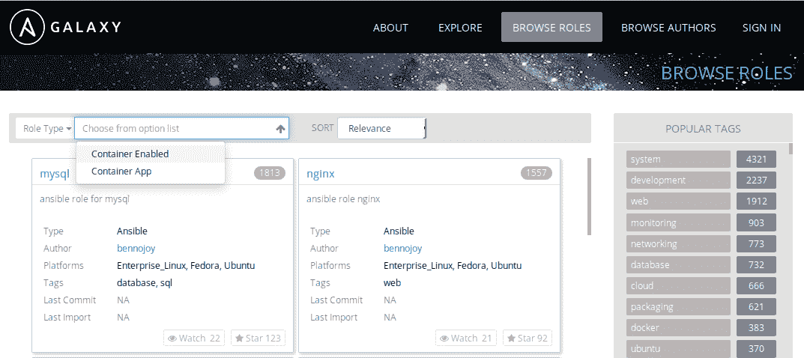
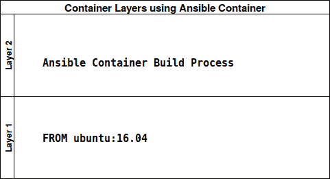

# 第三章：你的第一个 Ansible Container 项目

正如我们在第二章《与 Ansible Container 一起工作》中了解到的，*Ansible Container* 是一个强大的工具，用于在生产环境中编排、部署和管理容器。通过一套独特的多功能工具，Ansible Container 可以启动、构建、运行和部署容器，使开发人员能够构建容器化应用程序，并将其部署到本地环境或云托管服务提供商。使用 Ansible Container，我们可以确保容器能够准确构建、可靠运行，并为用户提供一致的体验，无论容器部署到哪个应用程序或平台。

在本章中，我们将专注于构建我们的第一个 Ansible Container 项目，方法是构建一个应用程序容器，在本地环境中测试它，并将我们的容器工件推送到容器镜像仓库。这将为用户提供 Ansible Container 的实际使用案例，并提供利用容器启用角色的经验。在本章中，你将学到：

+   什么是 Ansible 角色和容器启用角色？

+   Ansible Galaxy 中的角色

+   Ansible Container NGINX 角色

# 什么是 Ansible 角色和容器启用角色？

Ansible 中的角色是一种将 playbook 组织成可重用、可共享且独立单元的方式，这些单元通常按应用程序进行划分。一个角色内部通常包含一系列 playbook、配置文件模板、静态文件和其他元数据，这些都是将目标主机（或容器）带入所需状态所必需的。在典型的三层应用堆栈中，包括 Web 服务器、数据库服务器和负载均衡器，这些组件可能被包含在三个独立的 Ansible 角色中。这提供了跨基础架构重用的好处，并且为共享 playbook 提供了一种简单的方式，无论是在互联网上还是与同事共享。例如，如果你为一个项目编写了负载均衡器角色，并且需要为另一个完全不同的项目配置另一个负载均衡器，你只需下载该角色并将其分配给另一个主机清单集。在 Ansible Core 中，角色通过父 playbook 分配给服务器或虚拟机，父 playbook 描述了基础架构的样子以及 Ansible 如何将该基础架构带入所需的状态。角色的主要好处是，它们为用户提供了一个简单的界面，用于访问常用的 playbook 任务和资源，从而确保用户的基础架构按预期精确配置并正常运行。

在 Ansible Container 中，角色的工作方式与 Ansible Core 非常相似。在 Ansible Container 中，角色不是基于基础设施组件分配的，而是分配给单个容器，然后通过 conductor 容器使用 Ansible playbooks 中描述的配置来构建这些容器。Ansible Container 的一个主要优点是，它大大简化了在基础设施中启用容器化资源的过程。如果你当前正在使用 Ansible Core 进行配置管理，许多 Ansible Core 角色可以重用，以构建与基础设施运行方式非常相似的容器。不幸的是，由于容器和完整的基础设施服务器在本质上是不同的，并不是所有任务都可以直接移植到 Ansible Container 角色中，仍需要进行一些修改。例如，由于容器比完整的操作系统更轻量，因此容器通常缺少大多数操作系统发行版中自带的工具和组件，如初始化系统和资源管理器。

为了解决这种差异，Ansible Container 项目创建了一种不同子集的角色，称为 *容器启用角色*。这些角色是专门为容器设计的，通常比常规的 Ansible 角色更简约。这些角色用于创建具有尽可能小的占用空间，同时最大化功能和灵活性的最终容器镜像。容器启用角色包含与常规 Ansible 角色相同的许多构造，如模板、任务、处理程序和元数据。这使得如果你熟悉 Ansible 语法和语言构造，开始为 Ansible Container 编写角色变得非常容易。

# Ansible Galaxy 中的角色

Ansible Galaxy，位于 [`galaxy.ansible.com`](https://galaxy.ansible.com/)，是由 Ansible 社区创建的网站，用于共享、下载和鼓励重用 Ansible 角色。在 Ansible Galaxy 中，你可以搜索并下载几乎任何你希望自动化的应用程序或平台的角色。如果你有 Ansible Core 的经验，你无疑已经使用过 Ansible Galaxy 来下载、共享和探索由其他 Ansible 用户编写和维护的角色。如果你是 Ansible 新手，Galaxy 让你可以轻松地通过 web 浏览器或 Ansible 命令行查找并利用新的角色。随着 Ansible Container 的发布，你可以浏览 Ansible Galaxy 查找核心角色以及容器启用角色。从主网站 ([`galaxy.ansible.com`](https://galaxy.ansible.com/)) 上，你可以选择 BROWSE ROLES | Role Type | Container Enabled，来搜索适合你特定需求的角色：

****

图 1：在 Ansible Galaxy 网站上浏览容器启用角色

最近，Ansible Container 社区创建了*容器应用程序*的概念，这些应用程序（有时）用于部署构成应用堆栈的多个容器。我们将在本书后面讨论*容器应用程序*。

# Ansible Container NGINX 角色

在本章中，我们将学习如何利用在 Ansible Galaxy 上预写的 Ansible Container 角色，快速通过角色来部署基于容器的服务。Ansible Galaxy 的一个主要优点是，它使用户能够利用其他选择共享项目并将其以角色形式发布的用户的集体知识库。像许多 DevOps 工程师一样，你可能并不熟悉如何为每个可能的应用程序、框架或服务配置最佳的性能。像 Ansible Galaxy 这样的在线仓库有助于简化部署许多新应用程序的学习曲线，因为这些应用程序基本上可以开箱即用，用户几乎不需要任何输入。使用 Ansible Galaxy 角色的用户也可以选择自定义已有的角色，以适应他们的特定需求。在本章中，我们将使用官方的 Ansible Container NGINX 角色来构建并部署一个功能完整的 NGINX web 服务器容器。我们使用的角色链接如下：[`galaxy.ansible.com/ansible/nginx-container/`](https://galaxy.ansible.com/ansible/nginx-container/)。

在开始安装和使用 NGINX 角色之前，让我们回顾一下 Ansible Container 的工作流程，以及它如何应用于预写角色：

+   `ansible-container init`：用于初始化一个新项目，以便使用我们的角色。

+   `ansible-container build`：生成我们将用于安装 NGINX 角色的指挥容器。`build`也用于在安装角色后构建容器镜像。

+   `ansible-container install`：利用指挥容器下载并在项目中安装我们的角色。

+   `ansible-container run`：在本地运行项目，以测试并验证 NGINX 服务器是否按预期运行。

+   `ansible-container push`：将构建的容器镜像推送到你的 Docker Hub 仓库。

在本章的任何时候，你都可以在 GitHub 仓库中查看完成的实验：[`github.com/aric49/ansible_container_lab/tree/master/AnsibleContainer/nginx_demo`](https://github.com/aric49/ansible_container_lab/tree/master/AnsibleContainer/nginx_demo)。

在开始进行本实验之前，最好创建一个免费的 Docker Hub 账户，这样你就可以上传和分享你创建的容器。前往[`hub.docker.com`](https://hub.docker.com/)创建一个免费账户。

# 启动新项目

到现在为止，你可能已经相当熟悉如何初始化一个新的 Ansible Container 项目，并使用 `ansible-container init` 命令自动生成文件和目录结构。从 Vagrant 主机上的一个新目录，运行 `ansible-container init` 来开始你的新项目，并确保所需的文件被自动生成：

```
ubuntu@node01:$ ansible-container init 
Ansible Container initialized.
```

一旦验证了新项目文件和目录框架已创建，我们需要运行一个初始的空构建以创建一个指挥容器。在 Ansible Container 安装角色或构建更复杂的项目之前，必须先在工作站上存在指挥容器，以便 Ansible Container 可以本地修改文件并下载允许容器角色正常工作的所需依赖项。现在我们已经初始化了项目，接下来让我们进行一次空构建，以便创建一个指挥容器：

```
ubuntu@node01:/vagrant/AnsibleContainer/nginx_webserver$ ansible-container build
Building Docker Engine context...
Starting Docker build of Ansible Container Conductor image (please be patient)...
Parsing conductor CLI args.
Docker™ daemon integration engine loaded. Build starting.       project=nginx_webserver
All images successfully built.
Conductor terminated. Cleaning up.      command_rc=0 conductor_id=1e8a3e0164cf617ad121c27b41dfcc782c0a2990eab54b70b687555726874e27 save_container=False
```

最佳实践是，始终使用与你构建项目容器时相同的基础镜像来构建指挥容器，以确保兼容性。如果你选择使用与默认的`centos:7`不同的基础镜像，你可能需要在构建项目之前修改`container.yml`文件。更多内容将在后续章节中介绍。

一旦项目构建完成，你应该看到`All Images Successfully Built`和`command_rc=0`的返回信息，表示 Ansible Container 指挥容器已成功构建。你可以使用`docker images`命令检查以确保指挥容器镜像已经构建并且存在于本地主机上。

更新版的 Ansible Container（1.0+）带有预构建的指挥容器镜像，使用这些镜像时无需在安装角色之前构建项目。然而，为了充分发挥 Ansible Container 工作流的优势，最好为你的项目构建专属的指挥容器镜像。

# 安装 NGINX 角色

现在我们已经初始化了一个新项目并构建了一个指挥容器，我们可以使用 `ansible-container install` 命令从 Ansible Galaxy 安装 NGINX 角色。这个命令的语法很简单：执行 `ansible-container install`，然后是项目所有者的用户名，在本例中为 `ansible`，接着是一个点号 `.` 和项目名称 `nginx-container`。你应该看到类似以下的输出：

```
ubuntu@node01:$ ansible-container install ansible.nginx-container
Parsing conductor CLI args.
- downloading role 'nginx-container', owned by ansible
- downloading role from https://github.com/ansible/nginx-container/archive/master.tar.gz
- extracting ansible.nginx-container to /tmp/tmpip0YiN/ansible.nginx-container
- ansible.nginx-container (master) was installed successfully
Conductor terminated. Cleaning up.      command_rc=0 conductor_id=a9e6723de6f3a236dd7823dbd999b97a5e1917bcb6794f3b0e9cd4b6bb54433b save_container=False
```

完成后，你应该看到以下消息：

```
- ansible.nginx-container (master) was installed successfully
```

这表示角色已经成功从 Ansible Galaxy 和父 GitHub 仓库下载并安装。`install` 命令还对你项目目录中已经存在的 `container.yml` 和 `requirements.yml` 文件进行了修改。如果你在文本编辑器中打开这些文件，你会发现角色已经被添加到了这些文件中：

`requirements.yml`：

```
- src: ansible.nginx-container
```

`container.yml`：

```
services:
  ansible.nginx-container:
    roles:
    - ansible.nginx-container
```

需要注意的是，容器角色已经将其自身添加到了 `container.yml` 中，并包含了角色作者希望我们使用的任何预填充信息。默认情况下，Ansible Container 会查看角色内部，使用 `meta/main.yml` 和 `meta/container.yml` 文件中提供的默认信息，并将这些信息传递到构建过程中，除非在 `container.yml` 文件中进行了覆盖。稍后在本章中，我们将看到当我们稍微自定义 NGINX 角色的工作方式时，这一过程是如何运作的。

安装过程还将角色名 `ansible.nginx-container` 添加到了 `requirements.yml` 文件中。此文件用于跟踪项目中使用的 Ansible Galaxy 角色和其他依赖项。如果你将项目与其他开发者共享，而他们希望在本地构建项目，Ansible Container 会利用 `requirements.yml` 文件一次性安装所有依赖的角色。如果你在项目中使用了多个支持容器的角色，这将大大加速开发过程。

现在我们已经安装了支持容器的角色，让我们重新运行构建过程并构建我们的新容器镜像：

```
ubuntu@node01:$ ansible-container build
Building Docker Engine context...                                              
Starting Docker build of Ansible Container Conductor image (please be patient)...    
Parsing conductor CLI args.                                      
Docker™ daemon integration engine loaded. Build starting.       project=nginx_webserver   
Building service… project=nginx_webserver service=ansible.nginx-container                                                

PLAY [ansible.nginx-container] *************************************************                                  
TASK [Gathering Facts] *********************************************************                       ok:[ansible.nginx-container]                                                                                                                                     
TASK [ansible.nginx-container : Install epel-release] **************************                    
changed:[ansible.nginx-container]                                               

TASK [ansible.nginx-container : Install nginx] *********************************
changed: [ansible.nginx-container] => (item=[u'nginx', u'rsync'])                                                                      

TASK [ansible.nginx-container : Install dumb init]
*****************************
changed:[ansible.nginx-container]                                                       
TASK [ansible.nginx-container : Update nginx user]
*****************************                            
changed:[ansible.nginx-container]

TASK [ansible.nginx-container : Put nginx config]
******************************
changed: [ansible.nginx-container]

TASK [ansible.nginx-container : Create directories, if they don't exist]
******************************
changed: [ansible.nginx-container] => (item=/static)   
changed: [ansible.nginx-container] => (item=/run/nginx)
changed: [ansible.nginx-container] => (item=/var/log/nginx)  
changed: [ansible.nginx-container] => (item=/var/lib/nginx)  

TASK [ansible.nginx-container : Clear log files]
*******************************
ok: [ansible.nginx-container] => (item=access.log)
ok: [ansible.nginx-container] => (item=error.log)
................

PLAY RECAP *********************************************************************
ansible.nginx-container    : ok=18   changed=14   unreachable=0    failed=0

Applied role to service role=ansible.nginx-container service=ansible.nginx-container
Committed layer as image        image=sha256:e4416fbb0ba74f4d39a5b6522466f8c0087582de64298ac63bc43a73f577d85a service=ansible.nginx-container
Build complete. service=ansible.nginx-container
All images successfully built.
Conductor terminated. Cleaning up.      command_rc=0 conductor_id=86b437e5e4ebca2d29ef89193be1bd7184b5bc9e8566305dbf470a8cd188ac7e save_container=False
```

看起来，我们的构建输出比之前的示例更有趣了。你可以看到，Ansible Container 已经识别出我们的项目现在有一个名为 `ansible.nginx-container` 的服务，并且在 `container.yml` 文件中执行了与之关联的 `ansible.nginx-container` 角色。在构建过程中，指挥者镜像会运行 Ansible Core，并传入位于角色中的 playbook 任务，以便将容器镜像带入所需的状态。从角色中执行的每个任务都会显示在构建输出中，这使得开发者能够准确看到容器内正在执行哪些操作。在检查 Ansible Container 构建输出时，以下是一些需要记住的关键点：

+   **已执行的任务**：在 Ansible 中，每个任务都有一个唯一的名称，帮助使构建输出对于几乎任何人来说都易于阅读和理解。有时，逻辑条件未能正确触发，这可能会导致某些任务被跳过。阅读任务列表，确保你期待执行的任务确实被执行。

+   **已更改的任务与 OK 任务**：由于 Ansible 本质上是一个配置管理工具，它紧密遵循幂等性原则。换句话说，如果 Ansible 发现某个任务不需要执行（因为容器已经处于期望的状态），它将把该任务标记为`OK`。当 Ansible 进行更改时，它会将任务标记为`CHANGED`，表示 Ansible 在基础容器镜像中修改了某些内容。需要注意的是，所有任务，无论是`SKIPPED`、`CHANGED`还是`OK`，都会在构建过程结束时被计为`OK`，表示在任务执行过程中没有发生失败。

+   **PLAY RECAP**：在每次 Ansible 容器构建结束时，你将看到一个`PLAY RECAP`部分，突出显示 Ansible 容器构建的状态。这提供了一个便捷的参考，快速显示 Ansible 容器执行的每个任务及其状态：`OK`、`Changed`、`Unreachable`或`Failed`。失败的任务会导致构建过程在失败的任务处立即停止，除非在角色中另有覆盖。

一旦构建过程完成，Ansible 容器将这些更改作为一个单独的层提交到基础镜像中，创建一个全新的容器镜像供你的项目使用。记住，在第一章中，*使用 Docker 构建容器*时，我们是如何利用 Dockerfile 来构建容器镜像的？如果你还记得，Dockerfile 中的每一行都代表着容器镜像中的一层。使用 Dockerfile 构建复杂的容器镜像会很快产生大且难以管理的容器，这些容器的文件大小也可能很大。

使用 Ansible 容器时，我们可以通过在角色中添加任务进行任意更改，并且我们的最终容器镜像依然保持精简，因为它只创建了一个容器层：



图 2：通过 Ansible 容器构建的容器镜像中的层

然而，请记住，你仍然应该尽量通过仅添加最必要的文件、包和服务，保持 Ansible 容器构建的容器镜像尽可能小。如果容器镜像的单一层大小达到了 2GB，那么 Ansible 容器创建的这一层的优势很快就会被抵消！

# 运行 NGINX 角色

现在，既然我们的项目已经构建完成且角色已成功应用，我们可以使用`ansible-container run`命令来运行我们的容器。`run`将利用在构建过程中创建的本地 Ansible 部署剧本来启动容器，以便我们测试它并确保它按预期运行：

```
ubuntu@node01:$ ansible-container run
Parsing conductor CLI args.
Engine integration loaded. Preparing run.       engine=Docker™ daemon
Verifying service image service=ansible.nginx-container

PLAY [localhost] ***************************************************************

TASK [docker_service] **********************************************************
changed: [localhost]

PLAY RECAP *********************************************************************
localhost                  : ok=1    changed=1    unreachable=0    failed=0

All services running.   playbook_rc=0
Conductor terminated. Cleaning up.      command_rc=0 conductor_id=e62dc0e401d3d76bf771c6e8db74fb0970e9d5e57be9ad6642cff92592248215 save_container=False
```

根据提供的`PLAY RECAP`，我们可以轻松地识别出，在我们的本地虚拟机上执行的任务使得容器的状态发生了变化，从而使容器进入了运行状态。`docker ps -a`的输出也显示我们的容器正在运行：

```
ubuntu@node01:~$ docker ps -a
CONTAINER ID  IMAGE  COMMAND  CREATED  STATUS  PORTS  NAMES
f213412bd485  nginx_webserver.. "/usr/bin/dumb-ini..." 2 minutes ago Up 2 minutes  0.0.0.0:8000->8000/tcp  nginxwebserver_ansible..
```

默认情况下，此容器使用角色默认配置的主机和容器 TCP 端口：`8000`。让我们使用 `curl` 工具看看是否可以在 `8000` 端口访问 NGINX 默认网站：

```
ubuntu@node01:$ curl localhost:8000
.....(output truncated)
<title>Test Page for the Nginx HTTP Server on Fedora</title>
```

根据 `curl` 的输出，看来我们已经成功地在工作站上部署了 NGINX 角色，并且有一个功能正常的 NGINX 服务器容器在运行。如果你希望一个 Web 服务器在 `8000` 端口运行，并且只使用绝对默认配置，那么这非常棒。不幸的是，这对于任何人来说可能都不太理想。让我们通过覆盖一些默认值来修改我们的角色，看看能否获得一个运行环境中实际功能更接近的容器。

# 修改 NGINX 角色

Ansible 的功能和行为与许多配置管理平台（如 Chef、Puppet 或 Salt）有很大不同。角色被视为服务抽象，用户可以根据需要进行调整和修改，以便以几乎任何方式运行。Ansible 提供了变量和变量优先级的概念，这些变量可以来自多个来源，并且根据优先级的顺序，修改角色，使其根据角色本身的设计以不同方式运行。需要注意的是，角色变量优先级在 Ansible Core 中更为常见，用户可能会有需要在开发、预发布、QA 和生产环境中运行的 playbook，并且这些 playbook 根据部署的环境需要不同的配置。

理解如何在 Ansible Container 中重写角色变量和参数，以构建具有韧性和定制化的基础设施组件，仍然是非常重要的。Ansible 角色的设计方式使得可以在不修改角色本身的情况下覆盖角色变量。通过变量优先级的概念，Ansible Container 会自动识别 `container.yml` 文件中的角色变量值，并将这些值传递给角色，供 playbook 访问。这允许用户编写便于移植和可重复使用的代码，只需从 Ansible Galaxy 下载正确的角色，并使用包含所有自定义项的正确 `container.yml` 文件构建项目。当然，并非角色的每一部分都可以在 `container.yml` 文件中被覆盖，但我们将在本节中学习如何进行基本修改，并将我们的自定义容器镜像推送到 Docker Hub。

在使用 Ansible Galaxy 上由其他用户编写的角色时，一位优秀的 Ansible Container 工程师应该首先阅读 README 文件，通常该文件位于角色的根目录中。README 文件通常会提供有关如何以最基本的方式运行该角色的指南，并列出可以被重写的常用变量。深入理解 README 对于了解角色在更复杂项目中的整体功能至关重要。你可以在这里查看 NGINX 角色的 README：[`github.com/ansible/nginx-container/blob/master/README.md`](https://github.com/ansible/nginx-container/blob/master/README.md)。

随着你编写自己的 Ansible Container 角色和容器启用应用程序，拥有一个更新且准确的 README 文件将对其他用户尝试使用你的项目非常有帮助。务必更新你的 README！

在本次练习中，我们将自定义 `container.yml` 文件，使其暴露在主机端口 `80` 上，而不是默认的 `8000`，并且还传递一个新的路径作为文档根目录，用于提供网站服务。还应该注意，我们将服务名称从角色的名称更改为更常见的名称：`webserver`。最终的 `container.yml` 文件可以在书籍的 GitHub 仓库中的 `AnsibleContainer/nginx_demo` 目录中找到。

首先，修改 `container.yml` 文件，使其类似于以下内容，记住，我们传递的是重写变量 `STATIC_ROOT`，并将其作为我们为服务指定的角色的子参数。我们根据开发人员提供的角色 README 文件中的信息，确定 `STATIC_ROOT` 是一个可以重写的有效变量。本质上，这告诉 Ansible Container 使用用户提供的值，而不是角色中硬编码的默认值：

```
version: '2'
settings:
  conductor_base: centos:7

services:
  webserver:
    roles:
      - role: ansible.nginx-container
        STATIC_ROOT: /MySite
    ports:
      - "80:8000"

registries: {}
```

在重新构建我们的项目后，Ansible Container 会识别 `container.yml` 文件中的变化。这将提示 Ansible Container 重新运行该角色，使用更新后的 `STATIC_ROOT` 值。你会注意到，这一次，构建过程所需的时间会更短，并且与第一次执行构建时相比，变更的任务也会更少。你应该看到类似以下的输出，记住这个示例是经过截断的：

```
ubuntu@node01:$ ansible-container build
Building Docker Engine context...
Starting Docker build of Ansible Container Conductor image (please be patient)...
Parsing conductor CLI args.
Docker™ daemon integration engine loaded. Build starting.       project=nginx_webserver
Building service...     project=nginx_webserver service=WebServer                                                               

PLAY [WebServer] ***************************************************************
```

# 运行修改后的角色

一旦构建完成，你可以执行 `ansible-container run` 命令，以确保我们的 NGINX 容器仍按预期运行：

```
buntu@node01:$ ansible-container run
Parsing conductor CLI args.
Engine integration loaded. Preparing run.       engine=Docker™ daemon
Verifying service image service=WebServer

PLAY [localhost] ***************************************************************

TASK [docker_service] **********************************************************
changed: [localhost]

PLAY RECAP *********************************************************************
localhost                  : ok=1    changed=1    unreachable=0    failed=0

All services running.   playbook_rc=0
Conductor terminated. Cleaning up.      command_rc=0 conductor_id=b97bbb161e1a735891cacbbf1eae263c8947cf16d55480568aee8debe7763e17 save_container=False
```

从前面的示例中可以看出，运行过程如预期完成，显示消息`All services running. Conductor Terminated. Cleaning Up`，并且返回的相关零值代码。这表示我们的容器正在按预期运行。我们可以在本地 Docker 环境中验证这一点，再次使用`docker ps -a`命令。在此示例中，我们可以看到容器的端口`8000`映射到主机的端口`80`，这表明我们在`container.yml`文件中的更改已正确构建到项目的新迭代中：

```
ubuntu@node01:$ docker ps -a
CONTAINER ID  IMAGE  COMMAND  CREATED  STATUS  PORTS  NAMES
5d979fc13cad  nginx_webserver-webserver:20170802144124 "/usr/bin/dumb-ini…"  3 minutes ago  Up 3 minutes 0.0.0.0:80 -> 8000/tcp  nginxwebserver_WebServer_1
```

为了确保我们的 NGINX 服务器按预期工作，我们可以使用可靠的`curl`命令，确保我们在虚拟机本地主机端口`80`上收到预期的响应：

```
ubuntu@node01:/vagrant/AnsibleContainer/nginx_webserver$ curl localhost:80
.....
<title>Test Page for the Nginx HTTP Server on Fedora</title>
```

恭喜！通过利用 Ansible Galaxy 中的社区角色，你已经成功构建了一个功能正常的 NGINX 服务器容器！我们甚至通过向角色中传递自己的参数来稍微定制了该角色，从而微调了角色的功能和生成的容器。不幸的是，我们在容器中所做的工作对在本地工作站上运行的容器没有太大帮助。构建容器的一个主要好处是，我们可以将构建的容器上传到镜像仓库，供其他用户部署和使用。为此，我们将学习使用`ansible-container push`命令，将我们的 NGINX 镜像推送到我们在本章开头创建的免费 Docker Hub 仓库，以供他人使用和下载。

# 将项目推送到 Docker Hub

为了启用此功能，我们将通过移除`registries`部分后的花括号来激活`container.yml`文件的最后部分。在`registries`部分下，我们将创建一个名为 docker 的子部分，该子部分有两个主要参数：URL 和 namespace。对于此示例，由于我们使用的是 Docker Hub 注册表，我们将提供 Docker Hub 的公共 API URL（截至写作时）和我们在本章开头创建的用户名作为 namespace 参数。你`container.yml`文件中的 registries 部分应该如下所示：

```
registries:
  docker:
    url: https://index.docker.io/v1/
    namespace: username
```

还需要注意的是，你可以在`container.yml`文件中为你的注册表命名任何你想要的名字。在这个示例中，由于我们使用的是 Docker Hub，我使用的名字是：`docker`。如果你使用的是内部或私有注册表，你可以提供任何合适的名称。例如，`My_Corporate_Registry`可能是一个合适的名称，用于你公司托管的内部镜像注册表。你甚至可以列出多个注册表，只要它们的名字不重复即可。

还需要注意的是，`registries`部分是`container.yml`文件中的完全可选部分。默认情况下，如果在`container.yml`的`registries`部分没有写入任何条目，`ansible-container push`命令将推送到 Docker Hub。所需的唯一操作是用户在`ansible-container push`命令中提供`--username`标志。

以下示例演示了我将项目上传到个人镜像仓库，并提供了我的用户名：`aric49`。接着，Ansible Container 会提示你输入 Docker Hub 的密码，并将容器镜像推送到你的免费仓库，如图所示。Ansible Container 将自动根据`container.yml`文件中的服务名称为你的容器命名。

```
ubuntu@node01:$ ansible-container push --username aric49 --tag 1.0
Enter password for aric49 at Docker Hub:
Parsing conductor CLI args.
Engine integration loaded. Preparing push.      engine=Docker™ daemon
Tagging aric49/nginx_webserver-webserver
Pushing aric49/nginx_webserver-webserver:1.0...
The push refers to a repository [docker.io/aric49/nginx_webserver-webserver]
Preparing
Layer already exists
1.0: digest: sha256:e0d93e16fd1ec9432ab0024653e3781ded3b1ac32ed6386677447637fcd2d3ea size: 741
Conductor terminated. Cleaning up.      command_rc=0 conductor_id=6685c1596e1da31b90b2553a84c23e112c84eeb27573e33a6c5ef7389df58f56 save_container=False
```

在`push`命令中始终提供`--tag`标志非常重要。这可以确保你在未来对不同版本的容器镜像进行版本控制。在这个示例中，我们正在上传版本 1.0 的容器镜像。如果你将来对项目做出更改，可以上传版本 2.0 标签，镜像仓库将自动保持旧版本 1.0，以防你需要回滚或升级到项目的另一个版本。

在本次演示中，我们不会使用默认的推送行为将镜像上传到 Docker Hub，而是将容器镜像上传到我们在`container.yml`文件中指定的镜像仓库，而这个镜像仓库恰好也是 Docker Hub。我们可以使用`--push-to`标志来指定我们在项目中配置的镜像仓库名称，提供用户名和镜像标签信息，正如之前的示例所示：

```
ansible-container push --username username --push-to docker --tag 1.0
```

一旦容器上传到我们选择的镜像仓库，我们可以手动执行`docker pull`命令从镜像仓库下载容器。默认情况下，`docker pull`要求用户提供容器镜像仓库的名称、镜像的名称以及你想要拉取的标签版本。在使用 Docker Hub 时，我们将使用你的用户名作为镜像仓库，因为我们使用的是个人的 Docker Hub 账户。例如，你可以使用`docker pull`命令拉取我的 NGINX 网页服务器镜像：

```
ubuntu@node01:~$ docker -D pull aric49/nginx_demo-webserver:1.0
1.0: Pulling from aric49/nginx_demo-webserver
e6e5bfbc38e5: Pull complete
51c9be88e17b: Pull complete
Digest: sha256:e0d93e16fd1ec9432ab0024653e3781ded3b1ac32ed6386677447637fcd2d3ea
Status: Downloaded newer image for aric49/nginx_demo-webserver:1.0
```

使用`-D`标志来启用调试模式。这样可以让你看到更多关于 Docker 镜像拉取过程的详细信息。

从前面的输出中可以看到，我们拉取的镜像只有两层。这是因为 Ansible Container 将所有的 playbook 运行作为容器镜像中的单层进行提交。这使得开发者能够构建一个相当复杂的容器，同时最大限度地减少生成镜像的大小。只要记住保持 playbook 小巧高效，否则你将失去容器化微服务架构的优势。

现在，由于我们的镜像已被缓存到本地，我们可以使用 Docker 手动运行容器。当然，我们也可以直接使用 Ansible Container 运行项目，但本例的目的是演示如何直接在 Docker 中运行容器，这可能模拟一些你不能或不愿意安装 Ansible Container 的环境。这个方法的唯一注意事项是，你需要手动指定端口转发，因为这个配置是我们`container.yml`文件的一部分，并没有内嵌到镜像本身。在本例中，我们将以`Ansible_Nginx`为容器名称，并按照以下格式指定容器镜像：`username/containername:tag`

```
docker run -d -p 80:8000 --name Ansible_Nginx aric49/nginx_demo-webserver:1.0
```

`docker ps -a`的输出应该显示容器正在运行并且功能正常：

```
ubuntu@node01:$ sudo docker ps -a
CONTAINER ID  IMAGE  COMMAND  CREATED  STATUS  PORTS  NAMES
6061f0249930 aric49/nginx_demo-webserver:1.0 "/usr/bin/dumb-init n" 8 seconds ago Up 7 seconds 0.0.0.0:80->8000/tcp Ansible_Nginx
```

在通过 Docker 手动运行容器之前，你可能需要先运行 Ansible Container 的`destroy`命令，因为端口`80`可能已被你正在运行的项目容器占用。

# 总结

在本章节中，你已经学习了 Ansible Container 核心概念之一：使用角色构建容器镜像。通过利用 Ansible 角色来创建容器镜像，你可以确保构建出的容器镜像具备生产级、可靠的容器服务所需的精确配置。此外，这也确保容器镜像是通过与你的基础设施已经在使用的几乎相同的 playbook 角色构建的，这使得容器服务的构建可以确保当前在生产环境中运行的服务能够轻松复制，并且通常几乎不需要重新工作。Ansible Container 为裸机或虚拟化的应用部署与容器化服务之间提供了一个出色的适配层。通过利用 Ansible Galaxy，你甚至可以下载并分享你自己或其他 Ansible Container 社区成员构建的自定义容器启用角色。

然而，正如本章节前面提到的那样，现有的 Ansible 角色不能直接 1:1 地移植到容器启用的角色，因为容器与传统基础设施的工作方式非常不同。在下一章中，我们将学习如何编写自定义的 Ansible 容器启用角色，以及将现有角色迁移到 Ansible Container 的一些最佳实践。准备好你的文本编辑器，我们即将开始写代码！
