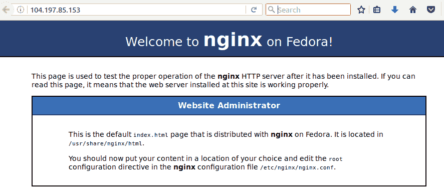

# 使用 Kubernetes 扩展容器规模

Kubernetes 无疑是迄今为止最受欢迎的开源项目之一，它席卷了整个 IT 世界。似乎无论你走到哪里，阅读的每一篇博客或遇到的每一篇新闻文章，都在讲述 Kubernetes 如何彻底改变了 DevOps 和 IT 基础设施的管理方式。 Kubernetes 确实牢牢抓住了 IT 领域的主导地位，并引入了全新的概念和看待基础设施的方式，这些是其他平台所无法比拟的。你可能属于那些听说过 Kubernetes 但对它是什么以及如何真正为你的基础设施带来益处一无所知的 IT 专业人员。或者，你可能正像我们大多数人一样，正在进行应用程序和工作负载的容器化，但暂时不想涉及 Kubernetes 额外的复杂性和模糊的领域。最后，你可能是那些幸运的 DevOps 工程师或 IT 管理员中的一员，已经成功采用了容器和 Kubernetes，并能够真正享受到 Kubernetes 所提供的可靠性和灵活性。

本章的目的是提供一个关于 Kubernetes 的概述，介绍它是什么，它是如何工作的（从高层次看），以及如何使用 Ansible Container 将你的容器化应用部署到 Kubernetes 集群。在我们深入之前，你可能会问，Kubernetes 到底是什么？Kubernetes 是由 Google 开发的平台，用于在小规模和大规模上部署、管理、配置和编排容器。Kubernetes 最初是 Google 的一个内部项目，名为 **Borg**，用于管理跨 Google 广泛基础设施的容器的自动部署和扩展。基于在 Borg 上获得的一些现实世界的经验，Google 将 Kubernetes 作为开源项目发布，让其他用户和组织能够利用同样的灵活性来大规模部署容器。通过 Kubernetes，用户可以轻松地在多个集群节点之间运行容器化应用程序，自动维护所需数量的副本、服务端点以及在集群中的负载均衡。

在本书中，我们详细探讨了如何使用 Ansible 容器平台，通过 Ansible Playbooks 快速且可靠地构建容器镜像，并在本地工作站上运行这些容器。由于我们现在已经很好地理解了如何在容器内构建版本控制和配置管理，接下来的步骤是使用配置管理声明我们的应用程序应该如何在容器外部运行。这就是 Kubernetes 填补的空白。没错，它确实像听起来那样令人惊叹。准备好了吗？让我们开始吧。

本章中，我们将涵盖：

+   Kubernetes 简介

+   使用 Google Cloud Engine 入门

+   使用 kubectl 在 Kubernetes 中部署应用程序

+   编写 Kubernetes 清单

+   在 Kubernetes 中部署和更新容器

# Kubernetes 简介

诚然，当人们想到 Kubernetes 时，可能立刻会想到与 Kubernetes 相关的复杂性和多层次的概念体系，并迅速认为本章内容可能会让读者感到困惑，难以理解和应用这些概念。大多数曾经尝试进入 Kubernetes 却未成功的用户，可能仍然心有余悸，对继续学习 Kubernetes 持谨慎态度。使用 Kubernetes 进行容器自动化可能会迅速变得相当复杂，但学习和使用 Kubernetes 的回报是巨大的。在继续之前，我必须强调，Kubernetes 是一个相当复杂的平台。尝试详细解释 Kubernetes 的每个特性和功能，可能需要一本完整的书，甚至更长的时间。事实上，已有许多关于使用 Kubernetes 进行容器编排的书籍，我建议读者可以参考这些书籍，以便深入理解这些概念。本章的重点是让读者对 Kubernetes 有一个基本的了解，掌握其主要功能，并能够快速入门，利用 Kubernetes 优化容器的部署。本书的篇幅无法涵盖关于 Kubernetes 的所有内容，因此如果读者想要进一步学习 Kubernetes，我强烈建议访问 Kubernetes 官网的文档：[`kubernetes.io/docs`](https://kubernetes.io/docs)。

到目前为止，本书中我们已经介绍了如何使用 Ansible Container 来构建在本地工作站或安装并运行 Docker 的远程服务器上运行的 Docker 容器。Docker 为我们提供了一个可用的容器运行时环境，具备启动容器、暴露端口、挂载系统卷并通过桥接接口和 IP 网络地址转换（NAT）提供基本网络连接的功能。Docker 在运行容器方面做得非常好，但未能为用户提供太多其他功能。那么当你的容器崩溃时怎么办？当你需要将应用程序扩展到更多节点、机架或数据中心时该怎么办？当一个主机上的容器需要访问另一个主机上运行的容器的资源时又该怎么办？这正是像 Kubernetes 这样的工具所解决的实际问题。可以把 Kubernetes 看作是一个使用调度器和 API 来主动监控在 Docker（或其他容器运行时）中运行的容器当前状态，并持续努力将其引导到操作员指定的期望状态的服务。例如，假设你有一个 4 节点的 Kubernetes 集群，运行着 3 个应用容器实例。如果操作员（你）指示 Kubernetes API 启动应用容器的第四个实例，Kubernetes 会识别到你当前只有三个正在运行的实例，并立即调度创建第四个容器。Kubernetes 本质上通过使用 bin-packing 算法来理解，容器应当调度在不同主机上运行，以提供高可用性并最大限度地利用集群资源。在上面的例子中，调度的第四个容器很可能会被调度到第四个集群主机上，前提是没有任何阻止新容器工作负载在该主机上运行的配置被应用。此外，如果集群中的某个主机出现故障，Kubernetes 足够智能，能够识别这种差异，并重新调度这些工作负载到不同的主机上，直到故障节点被恢复。

除了 Kubernetes 提供的灵活配置管理功能外，它还以其独特的能力而闻名，能够为容器提供弹性的网络资源，如服务发现、DNS 解析和容器间的负载均衡。换句话说，Kubernetes 具有基于集群中运行的服务提供内部 DNS 解析的天生能力。当新 pod 被添加到服务中时，Kubernetes 会自动识别新的容器并更新 DNS 端点，以便新容器可以通过调用集群内的内部服务域名来提供服务。这确保了其他容器可以通过调用 Kubernetes 覆盖网络内的内部域名和集群 IP 地址，直接与其他容器化服务进行通信。

Kubernetes 引入了许多新概念，如果你来自静态容器部署的背景，这些概念可能会有些陌生。在本章中，我们会不断提及这些概念，因此理解这些术语的含义对于我们继续学习 Kubernetes 非常重要：

+   **Pod**：Pod 表示 Kubernetes 集群中运行的一个或多个应用容器。默认情况下，pod 定义至少会指定一个用户希望在集群中运行的容器，包括用户希望容器运行时的额外环境变量、命令或入口点配置。如果 pod 包含多个容器定义，那么 pod 中运行的所有容器共享 pod 的网络和存储资源。例如，你可以运行一个包含 Web 服务器容器和缓存服务器容器的 pod。从 pod 的角度来看，Web 服务器可能运行在 localhost 的 80 端口，而缓存也运行在 localhost 的 `11211` 端口。从 Kubernetes 的角度来看，pod 本身会有一个在集群内部的单一 IP 地址，服务会通过这个 IP 地址进行暴露，但实际上，这个 pod 会包含两个完全独立的容器。

+   **部署**：部署是 Kubernetes 中定义将运行在集群中的 pod 的对象。部署包含各种参数，例如容器镜像的名称、卷挂载以及要运行的副本数。为了从 Kubernetes 集群中删除 pod，必须删除该部署。如果你只是尝试删除 pod，你会发现 Kubernetes 会尝试重新创建这些 pod。这是因为部署对象会告知集群这些 pod 应该运行，控制器管理器（稍后会介绍）会尝试将集群恢复到期望的状态。

+   **标签**：标签是可以分配给 Kubernetes 中几乎任何对象的键值对。标签可以用来组织集群中资源的子集。例如，如果你有一个运行多个相同 pod 的集群，可以通过不同的标签来指示它们的不同用途。标签甚至可以被调度器利用，来确定在哪些时间和位置运行这些 pod。

+   **服务**：服务定义了 pod 的逻辑子分组（通常通过标签选择器），以及它们应该如何被集群中其他资源访问。例如，你可以创建一个服务，将一组 pod 暴露给外部世界。可以使用标签选择器来确定哪些 pod 应该被暴露。如果之后有 pod 被添加或移除，Kubernetes 会自动扩展该服务，只要新 pod 使用相同的选择器运行。

要使此功能透明化，Kubernetes 在集群中提供多个服务，这些服务协同工作，确保集群和应用程序持续处于所需状态。总称为 Kubernetes 控制平面。控制平面允许功能操作、管理运行的容器，并在集群中跟踪节点和资源的状态。现在让我们快速看一下这些服务：

+   **KubeCTL**:`kubectl`（发音为 kube-control），是与 Kubernetes 交互的命令行工具。`kubectl` 直接访问 Kubernetes API，用于调度新的部署、与 Pod 交互、暴露部署等。`kubectl` 工具需要一组凭据来访问 Kubernetes API。

+   **Kubernetes API 服务器**：Kubernetes API 服务器负责接受来自操作者的输入，可以是来自 `kubectl` 命令行工具，也可以是直接访问 API 本身。Kubernetes API 负责协调信息到集群的其余部分，以执行期望的状态。需要注意的是，Kubernetes API 服务器依赖 ETCD 服务来存储和检索有关集群节点和运行中服务的信息。

+   **Kubernetes 调度器**：Kubernetes 调度器负责在集群节点上调度新的工作负载。其核心责任是监控集群，以确保集群中有足够的可用资源来运行 Pod，同时确保服务器可用且可达。

+   **Kubernetes 控制器管理器**：控制器管理器主要关注集群中期望的状态合规性。控制器管理器服务与 ETCD 服务交互，并监视通过 API 服务器进入的新作业和请求。当接收到新请求并存储在 ETCD 中时，控制器管理器与调度器协作启动新作业，以确保集群处于操作者定义的期望状态。控制器管理器通过使用控制循环持续监视集群状态，并立即纠正当前状态与期望状态之间的任何差异。当您删除 Kubernetes Pod 并自动创建新 Pod 时，感谢控制器管理器。

+   **ETCD**：ETCD 是由 CoreOS 创建的分布式键值存储，用于跨 Kubernetes 集群存储配置信息。如前所述，ETCD 主要由 Kubernetes API 服务器写入。

+   **容器网络接口**：容器网络接口项目（CNI）旨在提供比 Kubernetes 自带的网络功能更多的附加功能。CNI 提供接口和插件支持，允许各种网络插件在 Kubernetes 集群中部署。这使得 Kubernetes 能够为分布在不同主机上的容器提供覆盖网络连接，避免容器依赖 Kubernetes 主机上提供的相对有限的网络空间。常见的第三方插件，遵循 CNI 标准的有 Flannel、Weave 和 Calico。

+   **Kubelet**：Kubelet 是运行在 Kubernetes 集群中每个主机上的服务。Kubelet 的主要责任是利用底层的容器运行时（Docker 或 rkt）根据 API、调度器和控制器管理器接收到的指令，在集群节点上创建和管理 Pod。Kubelet 服务不会管理在主机上运行的、非 Kubernetes 创建的容器或 Pod。可以将 Kubelet 看作是 Docker 和 Kubernetes 之间的翻译层。

现在我们已经了解了 Kubernetes 平台及其工作原理，我们可以开始使用 Kubernetes 运行本书中早些时候构建的一些容器。

# 开始使用 Google Cloud 平台

在本书的多个章节中，我们主要在一个单节点的 Vagrant 实验环境中进行操作，该环境预加载了你开始使用 Docker 和 Ansible Container 所需的大部分工具和实用程序，帮助你通过各种示例和实验来初始化、构建、运行和销毁容器。不幸的是，由于 Kubernetes 的复杂性，目前我们使用的 Vagrant 实验环境很难运行 Kubernetes 环境。虽然有一些方法可以实现，但它们需要更多的计算资源，并且涉及的内容超出了本书的范围。为了解决这个问题，我建议读者注册一个免费的 Google Cloud Platform 账户，在几分钟内快速启动一个三节点 Kubernetes 集群，并可以通过`kubectl`命令行工具从单节点 Vagrant 实验环境中使用。撰写本文时，Google 为注册 Google Cloud 免费账户的用户提供$300.00 的免费信用额度。信用额度用完后，Google 不会在未明确授权的情况下收费。这个额度足以运行我们简单的集群，并涵盖许多 Kubernetes 的核心概念。

如果你无法注册 Google Cloud Platform 账户，你可以使用 Minikube 项目在本地工作站上免费启动一个 Kubernetes 节点。使用 Virtualbox 虚拟化管理程序时，将 Minikube 配置为在你的笔记本上正常运行，并确保 `kubectl` 命令能正常工作相对简单。如果你有兴趣，可以在 [`github.com/kubernetes/minikube`](https://github.com/kubernetes/minikube) 上找到更多关于 Minikube 的信息。

在我们继续创建 Google Cloud Kubernetes 集群之前，我们需要先在 [`cloud.google.com/free/`](https://cloud.google.com/free/) 注册一个账户。

一旦你创建了一个免费账户，它会提示你创建一个新项目。你可以为你的项目命名任何你喜欢的名字，因为 Google Cloud 会在控制台内为其分配一个唯一的标识符。我把我的命名为 `AC-Kubernetes-Demo`。如果注册过程中没有提示你创建新项目，你可以从主控制台选择“项目”并点击 + 按钮创建一个新项目：


创建项目后，我们可以使用 Google Container Engine 创建 Kubernetes 集群。在主控制台窗口的左侧菜单中，选择“容器引擎 | 容器集群”：


为了示范的目的，同时也为了最大程度地利用 Google Container Engine 提供的免费配额，我们将使用最小规格创建一个三节点容器集群。为此，在容器集群仪表盘上，点击“创建集群”按钮。这将引导你进入一个表单，允许你选择集群的规格。我按照以下规格创建了我的集群：

+   名称：Cluster-1

+   集群版本：1.6.9

+   每个节点 1 vCPU（总共 3 个 vCPU）

+   容器优化操作系统

+   禁用自动升级

一旦集群创建完成，你应该能够看到一个类似下面截图的集群：


自本文编写时，Google Cloud 界面的最新版本可能已经有所变化。你可能需要使用稍有不同的步骤或自定义选项来设置你的 Kubernetes 集群。默认设置应该足以创建一个不会迅速消耗掉你 $300.00 配额的集群。记住，你分配给集群的资源越多，你的信用额度消耗得就越快！

一旦我们的集群完全部署完成，我们就可以从 Vagrant 开发实验室连接到它。为此，我们需要先使用 `Gcloud` 界面初始化 `kubectl` 工具。默认情况下，这些包并未安装在 Vagrant 实验室中，以节省创建虚拟机时的时间和复杂性。要启用此功能，我们需要修改位于本书官方 Git 仓库 `root` 目录中的 Vagrantfile。在 Vagrantfile 的底部，你会看到一个标题为 `#Un-Comment this section to Install the Google Cloud SDK` 的部分。取消注释此部分应导致 Vagrantfile 中以下更改：

```
##Un-Comment this to Install the Google Cloud SDK:
export CLOUD_SDK_REPO="cloud-sdk-$(lsb_release -c -s)"
echo "deb http://packages.cloud.google.com/apt $CLOUD_SDK_REPO main" |     sudo tee -a /etc/apt/sources.list.d/google-cloud-sdk.list
curl https://packages.cloud.google.com/apt/doc/apt-key.gpg | sudo apt-key add -
apt-get update && sudo apt-get install -y google-cloud-sdk
apt-get install kubectl
SHELL
end
```

进行这些更改后，保存文件，并使用 `vagrant up` 命令启动实验室虚拟机。如果实验室虚拟机已经在运行，你可以使用 `vagrant provision` 命令重新配置正在运行的虚拟机，或者按照以下步骤摧毁并重新创建虚拟机：

```
user@localhost:~/$ vagrant destroy -f
==> node01: Forcing shutdown of VM...
==> node01: Destroying VM and associated drives...

user@localhost:~/$ vagrant up
Bringing machine 'node01' up with 'virtualbox' provider...
==> node01: Checking if box 'ubuntu/xenial64' is up to date..
```

一旦 Vagrant 实验室虚拟机安装了 `Google Cloud SDK` 和 `kubectl`，执行命令 `gcloud init`，并在提示登录时，输入 `Y` 以确认并继续登录。

```
ubuntu@node01:~$ gcloud init
Welcome! This command will take you through the configuration of gcloud.

Your current configuration has been set to: [default]

You can skip diagnostics next time by using the following flag:
  gcloud init --skip-diagnostics

Network diagnostic detects and fixes local network connection issues.
Checking network connection...done.
Reachability Check passed.
Network diagnostic (1/1 checks) passed.

You must log in to continue. Would you like to log in (Y/n)? Y
```

然后，`Gcloud` CLI 工具会返回一个超链接，允许你使用 Google Cloud 帐户授权你的 Vagrant 实验室。授权使用 Google Cloud 帐户后，你的 web 浏览器应会返回一个代码，你可以在命令行中输入该代码以完成授权过程。

接下来，CLI 向导会提示你选择一个项目。你刚刚创建的项目应该会显示在一系列选项中。请选择我们刚刚创建的项目：

```
Pick cloud project to use: 
 [1] ac-kubernetes-demo
 [2] api-project-815655054520
 [3] Create a new project
Please enter numeric choice or text value (must exactly match list 
item): 1
```

然后，它会提示你是否希望配置 Google Compute Engine。这不是必须的步骤，但如果你选择执行此操作，你将看到一个地理区域列表供你选择。请选择离你最近的区域。最后，你的 Google Cloud 帐户应已成功连接到你的 Vagrant 实验室。

现在，我们可以使用 `kubectl` 工具设置与 Kubernetes 集群的连接。可以通过在容器引擎仪表盘上选择连接按钮，位于我们集群旁边来完成此操作。屏幕应会弹出，显示如何从初始化的 Vagrant 实验室连接到集群的详细信息：


将该命令复制并粘贴到你的 Vagrant 环境中：

```
ubuntu@node01:~$ gcloud container clusters get-credentials cluster-1 --zone us-central1-a --project ac-kubernetes-demo

WARNING: Accessing a Container Engine cluster requires the kubernetes commandline
client [kubectl]. To install, run
  $ gcloud components install kubectl

Fetching cluster endpoint and auth data.
kubeconfig entry generated for cluster-1.
```

这应该会缓存访问我们集群所需的默认 Kubernetes 凭证，以便从 `kubectl` 命令行工具访问。由于本章早些时候对 Vagrantfile 所做的更改，`kubectl` 将已经安装在 Vagrant 实验室虚拟机中。

由于 `kubectl` 已经安装，我们可以通过执行 `kubectl cluster-info` 来验证与 Kubernetes 集群的连接，并查看正在运行的集群的详细信息。我已经对我的集群环境中的 IP 细节进行了屏蔽。不过，你的输出会显示核心服务的所有相关地址：

```
ubuntu@node01:~$ kubectl cluster-info
Kubernetes master is running at https://IPADDRESS
GLBCDefaultBackend is running at https://IPADDRESS/api/v1/namespaces/kube-system/services/default-http-backend/proxy
Heapster is running at https://IPADDRESS/api/v1/namespaces/kube-system/services/heapster/proxy
KubeDNS is running at https://IPADDRESS/api/v1/namespaces/kube-system/services/kube-dns/proxy
kubernetes-dashboard is running at https://IPADDRESS/api/v1/namespaces/kube-system/services/kubernetes-dashboard/proxy
```

你还可以运行 `kubectl get nodes` 来查看集群中的节点输出：

```
ubuntu@node01:~$ kubectl get nodes
NAME                                       STATUS    AGE       VERSION
gke-cluster-1-default-pool-ca63b897-7pwx   Ready     2d       v1.6.9
gke-cluster-1-default-pool-ca63b897-d9cf   Ready     2d       v1.6.9
gke-cluster-1-default-pool-ca63b897-fnnt   Ready     2d       v1.6.9
```

# 在 Kubernetes 中使用 kubectl 部署应用程序

KubeCTL 或 Kube Control 是进入 Kubernetes API Server 和其他 Kubernetes 控制平面的官方命令行接口。通过使用 `kubectl` 工具，你可以查看 pods 的状态、访问集群资源，甚至进入运行中的 pods 进行故障排除。在本章的这一部分，我们将了解如何使用 `kubectl` 手动描述部署、扩展 pods 并创建服务以访问这些 pods。这对于理解 Kubernetes 的基本概念非常有益，有助于理解 Ansible Container 如何利用可用的本地 Kubernetes 模块自动化这些任务。

让我们来看一些在使用 Kubernetes 时最常见的 `kubectl` 选项和语法：

+   `kubectl get`：`kubectl get` 用于返回当前在 Kubernetes 集群中存在的资源。通常，该命令用于获取当前正在运行的 pods 或集群中的节点列表。可以将此命令视为类似于 docker ps 命令。`get` 命令的示例包括：`kubectl get pods` 和 `kubectl get deployments`。

+   `kubectl describe`：`describe` 用于查看特定集群资源的详细信息。如果你想知道某个资源的最新状态或当前如何运行，可以使用 describe 命令。`describe` 非常有用，因为你可以指定某个集群资源，例如 pod、service、deployment 或 replication controller，来查看直接与该实例相关的详细信息。`describe` 也非常适用于在 Kubernetes 环境中进行故障排除。`describe` 的示例包括：`kubectl describe pod` 和 `kubectl describe node`。

+   `kubectl run`：`kubectl run` 的功能与我们之前在本书中探讨过的 `docker run` 命令非常相似。Run 主要用于启动新的部署并快速启动 pods。在 Kubernetes 集群中运行。Run 的使用场景比较有限，因为更复杂的部署更适合使用 `create` 和 `apply` 命令。然而，对于测试或快速高效地启动容器，`run` 是一个非常棒的工具。

+   `kubectl create`：Create 用于创建新的集群资源，如 pods、deployments、namespaces 或 services。Create 的功能与 apply 和 run 非常相似，区别在于它仅用于启动新对象。使用 create 时，可以使用 `-f` 标志传入清单文件或直接的 URL，以启动比使用 `kubectl` `run` 更复杂的资源。

+   `kubectl apply`：`apply` 常常与 `create` 混淆，因为它们的语法和功能非常相似。`apply` 用于更新 Kubernetes 集群中已经存在的资源，而 `create` 用于创建新的资源。例如，如果你通过 `kubectl create` 创建了一系列基于 Kubernetes 清单的 pod，你可以使用 `kubectl apply` 来更新你可能对清单所做的任何更改。Kubernetes 控制平面将分析清单并尝试进行必要的更改，以使集群资源达到所需的状态。

+   `kubectl delete`：`delete` 的功能非常直观，主要用于从 Kubernetes 集群中删除对象。与 `create` 和 `apply` 类似，你可以使用 `-f` 标志传入之前创建或更新的 Kubernetes 清单文件，并用它作为标识符来从集群中删除这些资源。

正如你会注意到的，`kubectl` 使用的动词/名词语法相当容易记住。你使用 `kubectl` 执行的每个操作都将带有一个动词参数（如 get、describe、create、apply），后面跟着你希望操作的 Kubernetes 对象（如 pod、命名空间、节点和其他特定资源）。使用 `kubectl` 工具有许多其他命令选项，但这些无疑是你在刚开始使用 Kubernetes 时最常用的一些选项。

要查看 Kubectl 支持的所有参数，可以使用 `kubectl --help` 或 `kubectl` 子命令 `--help` 来获取特定功能或子命令的帮助。

既然我们现在可以通过 Vagrant 实验室访问 Kubernetes 集群，我们可以使用 `kubectl` 工具来探索集群中的资源和对象。我们首先要查看的命令是 `kubectl get pods` 命令。我们将使用这个命令返回集群中所有命名空间下的 pod 列表。仅仅输入 `kubectl get pods` 将不会返回任何内容，因为 Kubernetes 资源是按命名空间隔离的。命名空间为 Kubernetes 资源提供了基于 DNS 和网络规则的逻辑分隔，使用户能够对同时存在于同一集群中的多个部署进行精细化控制。目前，Kubernetes 集群中存在的所有内容都作为运行中的进程，且对于 Kubernetes 控制平面的功能至关重要，位于 `kube-system` 命名空间中。要查看所有命名空间中正在运行的所有内容，我们可以使用 `kubectl get pods` 命令，并传入 `--all-namespaces` 标志：

```
ubuntu@node01:~$ kubectl get pods --all-namespaces
NAME                                                  READY     STATUS    RESTARTS   AGE
fluentd-gcp-v2.0-k8nrl                                2/2       Running   0          17m
fluentd-gcp-v2.0-l05dw                                2/2       Running   0          17m
fluentd-gcp-v2.0-svnfw                                2/2       Running   0          17m
heapster-v1.3.0-1288166888-cqpd3                      2/2       Running   0          16m
kube-dns-3664836949-sl69q                             3/3       Running   0          17m
kube-dns-3664836949-tbmvl                             3/3       Running   0          17m
kube-dns-autoscaler-2667913178-vdjc5                  1/1       Running   0          17m
kube-proxy-gke-cluster-1-default-pool-ca63b897-7pwx   1/1       Running   0          17m
kube-proxy-gke-cluster-1-default-pool-ca63b897-d9cf   1/1       Running   0          17m
kube-proxy-gke-cluster-1-default-pool-ca63b897-fnnt   1/1       Running   0          17m
kubernetes-dashboard-2917854236-sctqd                 1/1       Running   0          17m
l7-default-backend-1044750973-68fx0                   1/1 Running   0          17m
```

你的列表可能与我这里提供的输出略有不同，具体取决于你的集群运行的 Kubernetes 版本，以及 Google 容器引擎平台自写作时以来可能引入的任何变化。然而，你会看到一列正在运行的容器，它们支持 Kubernetes 控制平面，如`kube-proxy`、`kube-dns`和使用`fluentd`的日志机制。默认输出将显示 Pod 的名称、运行时长（age）、运行副本的数量以及 Pod 重启的次数。

你可以使用`-o wide`标志来查看更多细节，例如 Pod 的命名空间和分配给 Pod 的覆盖网络 IP 地址。例如，`kubectl get pods -o wide --all-namespaces`。

现在我们已经牢固掌握了列出 Pod 的方法，我们可以使用`kubectl run`命令来启动我们的第一个部署。在第三章，*你的第一个 Ansible 容器项目*中，我们学习了如何使用社区开发的容器角色构建一个 NGINX 容器，并将其上传到我们的个人 Docker Hub 仓库。我们可以使用`kubectl run`命令来下载我们的容器，快速创建一个名为`nginx-web`的新 Kubernetes 部署，并让该 Pod 在我们的集群中运行。为了从我们的仓库拉取 Pod，我们需要提供完整的容器名称，格式为：`image-repository/username/containername`。此外，我们需要将端口映射到端口`8000`，因为社区开发的角色默认使用了该端口。最后，我们将在`default`命名空间中启动这个部署，因此无需应用额外的命名空间配置：

```
kubectl run nginx-web --image=docker.io/username/nginx_demo-webserver  --port=8000
```

现在，如果我们尝试运行`kubectl get pods`，我们将看到在默认命名空间下运行的单个 NGINX Pod：

```
ubuntu@node01:~$ kubectl get pods -o wide
NAME                         READY     STATUS    RESTARTS   AGE
nginx-web-1202329523-qjkwp   1/1       Running   0          3m  
```

类似地，我们可以使用`kubectl get deployments`功能来查看默认命名空间中当前部署的状态：

```
ubuntu@node01:~$ kubectl get deployments
NAME        DESIRED   CURRENT   UP-TO-DATE   AVAILABLE   AGE
nginx-web   1         1         1            1           12m
```

如你从 `get pods` 和 `get deployments` 的输出中看到的，我们有一个名为`nginx-web`的单一部署，它由一个单独的 Pod 和该 Pod 内的一个单独容器组成。这与我们通过`kubectl run`命令提供给 Kubernetes API 服务器的输入完全一致。如果我们尝试删除这个 Pod，部署的期望状态和当前状态之间会出现差异。Kubernetes 将尝试通过重新创建被删除的集群资源来使集群恢复到期望状态。让我们尝试删除我们创建的 NGINX Pod，看看会发生什么。通常，这个过程发生得非常迅速，你需要注意 Pod 的名称以及运行时长（age），才能看到变化是否已经发生：

```
ubuntu@node01:~$ kubectl delete pod nginx-web-1202329523-qjkwp
pod "nginx-web-498735019-6llvp" deleted
ubuntu@node01:~$ kubectl get pods
NAME                        READY     STATUS    RESTARTS   AGE
nginx-web-498735019-xcp21   1/1       Running   0          15s
```

如果我们想要永久删除集群中的 pod，我们可以在部署本身上使用删除命令，语法为：`kubectl delete deployment nginx-web`。这将声明一个新的期望状态，即我们不再希望部署`nginx-web`存在，且该部署中的所有 pod 也应被删除。

# 描述 Kubernetes 资源

Kubernetes 也可以用来查看有关我们在集群中实例化的 pod 或其他对象的详细信息。我们可以使用 `kubectl describe` 命令来做到这一点。Describe 可以用来查看我们集群中几乎任何资源的详细视图。

让我们花点时间描述一下我们的 NGINX pod，并确保它按预期运行：

```
ubuntu@node01:~$ kubectl describe deployment nginx-web
Name:                   nginx-web
Namespace:              default
CreationTimestamp:      Wed, 13 Sep 2017 19:36:48 +0000
Labels:                 run=nginx-web
Annotations:            deployment.kubernetes.io/revision=1
Selector:               run=nginx-web
Replicas:               1 desired | 1 updated | 1 total | 1 available | 0 unavailable
StrategyType:           RollingUpdate
MinReadySeconds:        0
RollingUpdateStrategy:  1 max unavailable, 1 max surge
Pod Template:
  Labels:       run=nginx-web
  Containers:
   nginx-web:
    Image:              docker.io/aric49/nginx_demo-webserver
    Port:               8000/TCP
    Environment:        <none>
    Mounts:             <none>
  Volumes:              <none>
Conditions:
  Type          Status  Reason
  ----          ------  ------
  Available     True    MinimumReplicasAvailable
OldReplicaSets: <none>
NewReplicaSet:  nginx-web-498735019 (1/1 replicas created)
Events:
  FirstSeen     LastSeen        Count   From                    SubObjectPath   Type            Reason                  Message
  ---------     --------        -----   ----                    -------------   --------        ------                  -------
  59s           59s             1       deployment-controller Normal          ScalingReplicaSet       Scaled up replica set nginx-web-498735019 to 1
```

如你所见，describe 命令显示了有关我们集群的许多相关信息，包括 pod 运行的命名空间、pod 配置的标签、正在运行的容器镜像的名称和位置，以及 pod 上发生的最新事件。describe 输出提供了丰富的信息，有助于我们排查故障或优化集群中的部署和容器。

# 暴露 Kubernetes 服务

既然我们现在在集群中运行着一个功能正常的 NGINX Web 服务器，我们可以将此服务暴露给外部世界，以便他人可以使用我们崭新的服务。为此，我们可以创建一个 Kubernetes 抽象对象，称为服务（service），来控制我们的 pod 如何获得外部访问权限。默认情况下，Kubernetes pod 会通过覆盖网络分配一个集群 IP 地址，该地址仅能在集群内部的其他容器和节点间访问。如果你有一个不应该直接暴露给外部世界的部署，这非常有用。然而，Kubernetes 也支持使用服务抽象来暴露部署。服务可以通过多种方式暴露 pod，从为服务分配可公开路由的 IP 地址、跨集群进行负载均衡，到在主节点上开放一个简单的节点端口，从中监听服务。Google 容器引擎原生支持 `LoadBalancer` 服务类型，可以为我们的部署分配一个公共虚拟 IP 地址，极大地简化了服务的暴露过程。为了让我们的服务能够连接到外部世界，我们可以使用 `kubectl expose deployment` 命令，并将服务类型指定为 `LoadBalancer`。成功执行后，你应该会看到信息 `nginx-web` 服务已暴露。

```
ubuntu@node01:~$ kubectl expose deployment nginx-web –type=LoadBalancer
service "nginx-web" exposed
```

我们可以通过运行 `kubectl get services` 命令来查看我们新创建的服务。你可能会注意到，`EXTERNAL IP` 列在 Kubernetes 为集群分配公共 IP 时，可能会处于挂起状态一两分钟。如果你在几分钟后再次执行 `kubectl get services` 命令，你应该会看到它已经有了外部 IP，并且可以访问了：

```
ubuntu@node01:~$ kubectl get services
NAME         CLUSTER-IP      EXTERNAL-IP   PORT(S)          AGE
kubernetes   10.11.240.1     <none>        443/TCP          31m
nginx-web    10.11.255.240   <pending>     8000:32567/TCP   6s
```

一两分钟后：

```
ubuntu@node01:~$ kubectl get services
NAME         CLUSTER-IP      EXTERNAL-IP     PORT(S)          AGE
kubernetes   10.11.240.1     <none>          443/TCP          1h
nginx-web    10.11.241.144   35.202.165.54   8000:32567/TCP   1m
```

在这个例子中，外部 IP 地址 `35.202.165.54` 已经分配给我们的部署。你可以在网页浏览器中访问这个 IP 地址，实际看到 NGINX 默认的网页效果。记住，你必须通过 TCP 端口 `8000` 来访问这个服务，因为容器启用角色的默认配置就是这样。如果你愿意，可以额外加分，返回并重新配置你的 NGINX 容器使其在端口 `80` 上运行！

Google Cloud Platform 与 Google Cloud 虚拟负载均衡资源有原生集成，允许 Kubernetes 为服务分配外部 IP 地址。在裸金属环境或运行在其他云上的集群中，需额外配置以便让 Kubernetes 无缝分配公有路由的 IP 地址。

# 扩展 Kubernetes Pod

现在我们已经在集群中运行了 Pod，我们可以利用强大的 Kubernetes 原语来扩展容器和服务的规模，跨节点运行以实现高可用性。如前所述，一旦声明了希望运行多个副本的期望状态，Kubernetes 会应用 bin-packing 算法来确定服务应该在哪些节点上运行。如果你声明的副本数与集群中的节点数相同，Kubernetes 默认会在每个节点上运行一个副本。如果声明的副本数多于节点数，Kubernetes 会在一些节点上运行多个副本，而在其他节点上运行单个副本。这为我们提供了开箱即用的原生高可用性。使用 Kubernetes 的一个好处是，通过利用这些特性和功能，操作员不再需要像以前那样过于担心容器所运行的底层基础设施，而更专注于集群抽象本身。

注意：Kubernetes 也可以使用标签来控制某些部署应该运行的位置。例如，如果你有一个高计算能力的节点，你可以将该节点标记为计算节点。你可以自定义部署，使得这些 Pod 只会在具有该特定标签的节点上运行。

为了展示这一功能的强大，我们使用 `kubectl` 来扩展我们现有的 web 服务器部署。由于我们目前运行的是一个三节点集群，因此我们将 NGINX 部署扩展到四个副本。这样，我们可以更好地展示 Kubernetes 在决定将容器放置在哪些节点时所做的决策。为了扩展当前的部署，我们可以使用 `kubectl scale deployment` 命令将副本数从 1 增加到 4：

```
ubuntu@node01:~$ kubectl scale deployment nginx-web --replicas=4
deployment "nginx-web" scaled
```

使用`kubectl get deployments`命令，我们可以看到 Kubernetes 正在积极地重新配置我们的集群以达到期望的状态。根据你为集群选择的配置，Kubernetes 可能需要几秒钟才能运行所有四个 Pod。接下来我们可以看到期望的 Pod 数量、当前在集群中运行的 Pod 数量、正在更新的 Pod 数量，以及准备好并可接收流量的 Pod。看起来我们的集群已经达到了预期的状态：

```
ubuntu@node01:~$ kubectl get deployments
NAME        DESIRED   CURRENT   UP-TO-DATE   AVAILABLE   AGE
nginx-web   4         4         4            4           14m
```

运行`kubectl get pods`并加上`-o wide`标志后，我们可以看到所有四个 NGINX Pod 都在不同的 IP 地址和不同的集群节点上运行。需要注意的是，由于我们指定了四个副本而只有三个节点，Kubernetes 决定将两个 Pod 副本运行在同一主机上。请记住，这两个 Pod 是独立的，拥有不同的 IP 地址，即使它们运行在同一主机上。

```
ubuntu@node01:~$ kubectl get pods -o wide
NAME   READY     STATUS    RESTARTS   AGE       IP          NODE
nginx  1/1       Running   0          2m        10.8.2.5    7pwx
nginx  1/1       Running   0          2m        10.8.1.10   fnnt
nginx  1/1       Running   0          15m       10.8.1.9    fnnt
nginx  1/1       Running   0          2m        10.8.0.5    d9cf
```

上述输出略有截断，因为`-o` wide 输出格式在书籍页面的上下文中较难阅读。你的输出将比我的稍微冗长一些。

再次访问公共 IP 地址将导致服务开始在集群中的 Pod 之间进行负载均衡。由于我们将服务类型指定为`LoadBalancer`，Kubernetes 将使用轮询算法将流量分配给我们的 Pod，确保高可用性。不幸的是，读者可能看不到明显的效果，因为每个 Pod 都在运行相同的 NGINX 测试网页。Kubernetes 的一个主要优势是，服务通常与部署关联。当你扩展一个部署时，服务将自动扩展并开始将流量分配到新的 Pod！

在我们进行下一个练习之前，让我们删除刚刚创建的部署以及公开的服务。这将使我们的集群恢复到一个干净的状态：

```

ubuntu@node01:~$ kubectl delete deployment nginx-web
deployment "nginx-web" deleted

ubuntu@node01:~$ kubectl delete services nginx-web
service "nginx-web" deleted
```

# 使用 Kubernetes 清单创建部署

除了能够直接从命令行创建服务和其他对象外，Kubernetes 还允许你通过清单文档来描述期望的状态。Kubernetes 清单让你能够在更易于阅读、理解和重复的格式中提供更多自定义选项，而不像命令行那样格式较为有限。由于本章并不是对 Kubernetes 进行深度探讨，我们不会花太多时间介绍 Kubernetes 清单中可以使用的各种配置选项。我的目的是向读者展示清单的样子以及它们如何在基本层面上工作。

由于你已经熟悉使用 `kubectl` 命令行工具创建部署，接下来我们将展示如何通过 Kubernetes 清单来描述我们的 `nginx-web` 部署。这些示例可以在本书的官方 Git 仓库中找到，位于 `Kubernetes/nginx-demo` 目录下。打开你的文本编辑器并创建一个文件：`webserver-deployment.yml`。这个文件的内容应该类似于以下内容。在这个示例中，我们将继续使用之前创建的 NGINX 容器。然而，如果你想尝试使用其他类型的服务和端口，可以自由选择其他容器 URL。

```
---
apiVersion: apps/v1beta1
kind: Deployment
metadata:
  name: webserver-deployment
spec:
  replicas: 4
  template:
    metadata:
      labels:
        app: http-webserver

    spec:
      containers:
        - name: webserver-container
          image: docker.io/USERNAME/nginx_demo-webserver
          ports:
            - containerPort: 8000
```

和我们到目前为止看到的所有 YAML 文档一样，Kubernetes 清单文档以三个短横线开始，表示 YAML 文件的开始。Kubernetes 清单总是先指定 API 版本、对象类型和元数据。这通常被称为头部数据，用于告诉 Kubernetes API 文档将要创建哪些类型的对象。由于我们正在创建一个部署，我们将 `kind` 参数指定为 `Deployment`，并提供部署的名称作为元数据名称。`spec` 部分下列出的一切都提供了特定于文档所创建的 pod 对象的配置参数。由于我们基本上是在逆向工程我们之前的部署，所以我们将副本数指定为 `4`。接下来的几行指定了我们将配置 pod 的元数据，具体是一个键值对标签，叫做 `app:http-webserver`。请记住这个标签，因为我们接下来在创建服务资源时会使用它。

最后，我们还有另一个 `spec` 部分，列出了将在 pod 内运行的容器。在本章前面我提到过，pod 可以是一个或多个容器，使用共享的网络和集群资源。pod 内的容器共享 pod IP 地址和本地主机命名空间。Kubernetes 部署允许你在 `containers:` 部分指定多个容器，并将它们作为键值对项目传入。然而，在这个示例中，我们将创建一个单容器 pod，命名为 `webserver-container`。在这里，我们将指定容器镜像版本以及容器端口（`80`）。

这个清单可以使用 `kubectl create` 命令应用，并传入 `-f` 参数，指明这是一个清单对象，并提供清单的路径：

```
kubectl create -f webserver-deployment.yml
```

完成成功后，你应该能通过 `kubectl get pods` 查看创建的 pod：

# 使用 Kubernetes 清单创建服务

类似于我们使用 Kubernetes 清单创建部署的方式，我们还可以使用清单创建其他 Kubernetes 对象。我们之前创建的服务可以通过以下 Kubernetes 清单描述：

```
---
apiVersion: v1
kind: Service
metadata:
  name: webserver-service
spec:
  type: LoadBalancer
  selector:
    app: http-webserver
  ports:
    - protocol: TCP
      port: 80
      targetPort: 8000
```

注意，在此示例中，我们指定了不同的 `kind` 参数为 `Service`，而不是我们之前示例中使用的 `Deployment`。这告诉 Kubernetes API，接下来的文档内容将包含描述服务而非其他类型 Kubernetes 对象的规格。在元数据部分，我们将服务命名为 `webserver-service`（有创意吧？）。在规格部分，我们将提供我们暴露的服务类型，`LoadBalancer`，并提供我们为部署指定的标签：`app: http-webserver`。当使用 `kubectl` 暴露部署时，您创建的服务与您暴露的部署紧密关联。当该部署扩展时，服务会自动感知并根据后端 Pod 的数量进行调整。然而，使用 Kubernetes 清单文件创建服务时，我们可以更加灵活地将服务与它们所暴露的服务关联。在这个示例中，我们创建了一个与任何具有标签 `app: http-webserver` 的 Pod 关联的服务。从理论上讲，这可以是跨不同命名空间和部署的任意数量的 Pod。这为围绕 Kubernetes 架构设计应用程序提供了很大的灵活性。

清单的最后部分描述了我们将执行负载均衡的端口。还记得我们 NGINX 容器使用固定端口 `8000` 吗？这是因为我们使用社区编写的角色构建了这个容器。通过负载均衡器服务，我们可以在前端暴露任何端口，将流量转发到后端 Pod 的任意端口。我们将使用的协议是 TCP。我们希望在虚拟 IP 地址上暴露的端口是 `80`，用于标准的 HTTP 请求。最后，我们将列出 NGINX 在 Pod 内部监听的端口，以将流量转发到此端口。在这种情况下是 `8000`。

使用 `kubectl create` 命令，我们可以像创建初始部署一样创建我们的服务：

```
ubuntu@node01:/vagrant/Kubernetes/nginx-demo$ kubectl create -f webserver-service.yml
service "webserver-service" created
```

使用 `kubectl get services`，我们可以看到哪个外部虚拟 IP 地址分配给了我们的集群：

```
ubuntu@node01:$ kubectl get services
NAME                CLUSTER-IP      EXTERNAL-IP      PORT(S)
webserver-service   10.11.251.238   104.197.85.153   80:30600/TCP
```

查看 `PORTS` 列，我们可以看到 TCP 端口 `80` 在我们的集群中被暴露。再次使用浏览器，我们可以访问新的公共 IP 地址的端口 `80`，查看是否正常工作：



使用 Kubernetes 清单文件，我们可以更详细地描述我们希望容器化应用程序的功能。清单文件也可以轻松修改，并通过 `kubectl apply -f manifest.yml` 命令重新应用。如果我们在任何时候想要将应用程序更新为不同版本的容器镜像，或修改服务上的暴露端口，`kubectl apply` 只会做出必要的更改，以使应用程序达到所需的状态。您可以自由调整这些清单文件并重新应用，查看如何配置服务运行。

接下来，我们将了解如何使用 Ansible Container 将容器部署到 Kubernetes。在继续之前，让我们使用 `kubectl delete` 命令删除 Kubernetes 集群中的 pod，并指定我们用于创建或修改部署和服务的 Kubernetes 清单：

```
ubuntu@node01:$ kubectl delete -f webserver-deployment.yml
deployment "webserver-deployment" deleted

ubuntu@node01:$ kubectl delete -f webserver-service.yml
service "webserver-service" deleted
```

至此，我们已经完成了 Kubernetes 集群的工作。如果你希望从 Google Cloud 中删除集群，可以现在执行此操作。然而，需要注意的是，第七章，《*部署你的第一个项目*》涵盖了如何将项目部署到 Kubernetes。我建议你在完成 第七章，《*部署你的第一个项目*》的内容之前，保持集群处于活动状态。

# 参考资料

+   **Kubernetes 文档**: [`kubernetes.io/docs/home/`](https://kubernetes.io/docs/home/)

+   **Google Cloud Platform**: [`cloud.google.com`](https://cloud.google.com)

+   **使用 Minikube 本地运行 Kubernetes**: [`kubernetes.io/docs/getting-started-guides/minikube/`](https://kubernetes.io/docs/getting-started-guides/minikube/)

# 总结

Kubernetes 正迅速成为最强大、灵活且流行的容器部署与编排平台，正在席卷 IT 行业。在本章中，我们深入了解了 Kubernetes，学习了它作为平台的工作原理以及使其如此有用和多功能的关键特性。如果你曾在容器领域工作过，你会很清楚，Kubernetes 正因其部署和管理容器的极其复杂机制，迅速被全球各地的组织所采用。

由于 Ansible Container 对 Kubernetes 的原生支持，我们可以使用相同的工作流程来构建、运行、测试和销毁容器化应用程序，这些应用程序可以部署到如 Kubernetes 这样的强大服务中。Ansible Container 真正提供了合适的工具，帮助我们使用统一且可靠的框架推动复杂的部署。

然而，Google Cloud 和 Kubernetes 框架并不是当前市场上唯一的基于云的容器编排解决方案。OpenShift 是由 Red Hat 构建的快速增长的托管解决方案，基于 Kubernetes 平台之上。接下来，我们将应用本章中学到的 Kubernetes 概念，将应用程序部署到 OpenShift 软件堆栈，利用 Ansible Container 平台为我们提供的强大工具，推动大规模应用工作负载。
