# 使用 OpenShift 管理容器

使用一套综合工具，涵盖了市面上最优秀、最具韧性的开源工具之一，Kubernetes 正在迅速改变软件应用的构建和部署方式，无论是在组织内部还是在云端。Kubernetes 带来了从部署容器化基础设施中获得的经验教训，而这一基础设施出自拥有全球最大且最强大基础设施之一的公司：Google。正如我们在上一章所看到的，Kubernetes 是一个极其灵活且可靠的平台，可以在非常大规模下部署容器，并带有一系列特性和功能，能够在集群服务器上部署高可用性应用，通过运行在原生容器引擎如 `Docker`、`rkt` 和 `Runc` 上实现。然而，Kubernetes 所带来的强大功能和灵活性，也伴随着极大的复杂性。可以说，使用 Kubernetes 部署容器化基础设施的最大缺点之一，就是需要在迁移工作负载到 Kubernetes 之前，掌握大量关于 Kubernetes 架构的知识。

针对 Kubernetes 当前面临的高开销和技术复杂性，Red Hat 提供了一个解决方案，使其能够被更多组织所使用。近年来，Red Hat 开发了一个简化 Kubernetes 概念并使其更加易于访问的解决方案，从而使软件开发人员和 DevOps 工程师能够快速部署并快速构建。OpenShift 是 Red Hat 开发的一套工具，它基于 Red Hat 版本的 Kubernetes，提供一个既复杂又易于理解的平台，用于自动化和简化容器化应用程序的部署。OpenShift 的目标是提供一个可靠、安全的 Kubernetes 环境，向用户提供一个流畅的 web 界面和命令行工具，用于部署、扩展和监控运行在 Kubernetes 中的应用程序。此外，OpenShift 是目前由 Ansible 容器项目支持的第二大云平台（Kubernetes 和 OpenShift）。

本章我们将涵盖以下主题：

+   什么是 OpenShift？

+   在本地安装 Minishift

+   从 web 界面部署容器

+   OpenShift web 界面提示

+   OpenShift CLI 介绍

+   OpenShift 和 Ansible 容器

# 什么是 OpenShift？

OpenShift 是由 Red Hat 提供的一套产品，用于构建生产就绪、可靠且安全的 Kubernetes 平台。使用 OpenShift，开发人员在使用 OpenShift API 部署容器化应用程序或访问 Kubernetes API 调整功能和特性时，拥有极大的自由度。由于 OpenShift 使用相同的底层容器运行时环境，因此可以在本地开发 Docker 容器并将其部署到 OpenShift，后者利用 Kubernetes 的所有基本元素，如命名空间、Pod 和部署，将服务暴露给外部世界。撰写本文时，Red Hat 提供了具有以下配置选项的 OpenShift 平台：

+   **OpenShift Origin**：一个完全免费的开源版本的 OpenShift，由社区支持。OpenShift Origin 可以通过一个名为 **Minishift** 的项目在本地部署。

+   **OpenShift Online**：OpenShift Online 是 Red Hat 提供的一个完全托管的公共云服务，允许个人和组织在不投入硬件资源的情况下，利用 OpenShift Origin。用户可以注册 OpenShift Online 免费账户，允许最多 1GB 的内存和两个 vCPU 的应用程序部署。

+   **OpenShift Dedicated/Container Platform**：OpenShift Dedicated 和 OpenShift Container Platform 提供由 Red Hat 管理并支持的 OpenShift 部署，可以部署在本地或通过 Google Cloud、Azure 或 AWS 等公共云服务提供商进行部署。

在本章以及接下来的章节中，我们将使用完全免费的开源 OpenShift Origin 来部署本地 Minishift 集群。与上一章不同，OpenShift 的免费版由于限制较多，无法涵盖本章将要介绍的广泛示例。为了全面展示 OpenShift 的功能，我选择引导用户完成 Minishift 的本地安装，只有运行在本地工作站的硬件资源限制了其能力。如果你一直跟进到这里，Minishift 在 VirtualBox 上的设置并不比我们之前使用的本地 Vagrant 实验环境复杂。然而，如果你想使用 OpenShift Online 的免费版，大部分示例仍然可以在其中复制，尽管它的功能有限，无法像在本地环境中运行 Minishift 那样灵活。

# 本地安装 Minishift

Minishift 是一个本地 OpenShift 集群，可以在您的本地 PC 上下载并运行，作为开发环境使用。Minishift 的主要用途是提供一个沙盒环境，为开发人员提供一个功能齐全的开发环境，该环境可以在您的笔记本电脑上启动。Minishift 还与 **OpenShift 客户端** (**OC**) CLI 完全兼容，您可以使用命令行界面与 OpenShift 集群进行交互。在本章的这一部分，我们将学习如何安装 Minishift 和 OC，以便在您的本地环境中运行它。在继续之前，您需要确保您的 PC 上安装了 VirtualBox，它将作为启动 Minishift 虚拟机的虚拟化程序。为了演示目的，我们将使用 Minishift 版本 1.7.0。由于本文撰写时，Minishift 已发布了更新的版本，建议您下载 1.7.0 版本，尽管更新版本很可能也能同样良好地工作。

此外，Minishift 和 OC 可跨平台支持 Windows、Linux 和 macOS。此示例将演示如何在 Linux 上下载并安装 Minishift。如需了解在其他平台上安装 Minishift 的更多信息，您可以访问以下链接：[`docs.openshift.org/latest/minishift/getting-started/installing.html`](https://docs.openshift.org/latest/minishift/getting-started/installing.html)。

# 安装 Minishift 二进制文件

以下步骤应在您的本地工作站上执行（而非 Vagrant 实验室虚拟机）以在本地安装 Minishift：

1.  **下载 Minishift 二进制文件**：Minishift 1.7.0 二进制文件可以从以下 GitHub URL 下载，适用于所有平台（[`github.com/minishift/minishift/releases/tag/v1.7.0`](https://github.com/minishift/minishift/releases/tag/v1.7.0)）。您可以使用网页浏览器下载该二进制文件，或者使用 `wget`，例如在本示例中的做法：

```
aric@local:~/minishift$ wget https://github.com/minishift/minishift/releases/download/v1.7.0/minishift-1.7.0-linux-amd64.tgz
--2017-10-09 19:41:08--  https://github.com/minishift/minishift/releases/download/v1.7.0/minishift-1.7.0-linux-amd64.tgz
Resolving github.com (github.com)... 192.30.253.113, 192.30.253.112
Connecting to github.com (github.com)|192.30.253.113|:443... connected.
 'minishift-1.7.0-linux-amd64.tgz' saved [3980931/3980931]
```

1.  **解压 Minishift 压缩包**：Minishift 以与您的操作系统兼容的归档格式打包。对于 Linux 和 OSX，这是一个压缩的 tarball 文件。对于 Windows，则是一个压缩归档文件：

```
aric@local:~/Development/minishift$ tar -xvf minishift-1.7.0-linux-amd64.tgz
minishift-1.7.0-linux-amd64/
minishift-1.7.0-linux-amd64/LICENSE
minishift-1.7.0-linux-amd64/README.adoc
minishift-1.7.0-linux-amd64/minishift 
```

1.  **将 Minishift 二进制文件复制到可执行路径**：将 Minishift 二进制文件复制到您的本地可执行路径将确保可以在任何上下文中从命令行执行 `minishift` 命令。在 Linux 中，常见的路径位置是 `/usr/local/bin`：

```
aric@local:~minishift/minishift-1.7.0-linux-amd64$ sudo cp minishift /usr/local/bin
```

您可能需要检查二进制文件的权限，以确保它们设置为可执行，例如，`chmod +x /usr/local/bin/minishift`。

1.  **验证安装**：执行 `minishift version` 命令应该返回相关的 Minishift 版本信息，在此例中为 1.7.0：

```
aric@local:~minishift$ minishift version
minishift v1.7.0+1549135
```

1.  **下载 OC 二进制文件**：OC 可以在以下网址下载适用于 Windows、macOS 或 Linux 的版本：[`mirror.openshift.com/pub/openshift-v3/clients/3.6.173.0.5/`](https://mirror.openshift.com/pub/openshift-v3/clients/3.6.173.0.5/)。在本示例中，我们将使用版本 3.6 的 OC 客户端。与 MiniShift 类似，可能自编写时以来已经发布了更新版本。为了与示例最大兼容，建议您使用版本 3.6：

```
aric@local:~/minishift$ wget https://mirror.openshift.com/pub/openshift-v3/clients/3.6.173.0.5/linux/oc.tar.gz
--2017-10-09 20:03:57--  https://mirror.openshift.com/pub/openshift-v3/clients/3.6.173.0.5/linux/oc.tar.gz
Resolving mirror.openshift.com (mirror.openshift.com)... 54.173.18.88, 54.172.163.83, 54.172.173.155
'oc.tar.gz' saved [36147137/36147137]
```

1.  **解压 OC 客户端归档**：解压此归档后，会提取出一个二进制文件`oc`。这是 OC 的可执行二进制文件：

```
aric@local:~/minishift$ tar -xvf oc.tar.gz
oc
```

1.  **将 OC 复制到可执行路径**：与 Minishift 安装类似，我们将 OC 二进制文件复制到可执行路径位置：

```
aric@local~/minishift$ sudo cp oc /usr/local/bin
```

1.  **验证安装**：执行`oc version`命令以确保 OC 已成功安装并返回相关版本信息：

```
aric@local:~/minishift$ oc version
oc v3.6.173.0.5
```

1.  **启动 Minishift 集群**：现在 Minishift 和 OC 已经安装完成，我们通过`minishift start`命令启动 Minishift 集群。默认情况下，Minishift 将期望使用 KVM 虚拟化程序，并分配大约 2 GB 的内存。我们将稍作修改，改为使用 VirtualBox 虚拟化程序、8 GB 的 RAM 和 50 GB 的存储。一旦 Minishift 集群启动，它将返回一个 URL，您可以通过这个 URL 访问 OpenShift 控制台：

```
aric@local:~$ minishift start --vm-driver=virtualbox --disk-size=50GB --memory=8GB
-- Starting local OpenShift cluster using 'virtualbox' hypervisor ...
-- Minishift VM will be configured with ...
   Memory:    8 GB
   vCPUs :    2
   Disk size: 50 GB

   Downloading ISO 'https://github.com/minishift/minishift-b2d-iso/releases/download/v1.2.0/minishift-b2d.iso'
 40.00 MiB / 40.00 MiB [=========================================================================================================================================================================] 100.00% 0s
-- Starting Minishift VM ................................. OK
-- Checking for IP address ... OK
-- Checking if external host is reachable from the Minishift VM ...
   Pinging 8.8.8.8 ... OK
-- Checking HTTP connectivity from the VM ...
   Retrieving http://minishift.io/index.html ... OK
-- Checking if persistent storage volume is mounted ... OK
-- Checking available disk space ... 0% used OK
-- Downloading OpenShift binary 'oc' version 'v3.6.0'
 34.72 MiB / 34.72 MiB [=========================================================================================================================================================================] 100.00% 0s-- Downloading OpenShift v3.6.0 checksums ... OK
-- OpenShift cluster will be configured with ...
   Version: v3.6.0
-- Checking `oc` support for startup flags ...
   host-config-dir ... OK
   host-data-dir ... OK
   host-pv-dir ... OK
   host-volumes-dir ... OK
   routing-suffix ... OK
Starting OpenShift using openshift/origin:v3.6.0 ...
Pulling image openshift/origin:v3.6.0
Pulled 1/4 layers, 26% complete
Pulled 2/4 layers, 71% complete
Pulled 3/4 layers, 90% complete
Pulled 4/4 layers, 100% complete
Extracting
Image pull complete
OpenShift server started.

The server is accessible via web console at:
    https://192.168.99.100:8443

You are logged in as:
    User:     developer
    Password: <any value>

To login as administrator:
    oc login -u system:admin
```

如果您的资源不足以为 Minishift 部署分配 8 GB 的 RAM，大多数示例可以使用默认的 2 GB RAM 运行。

1.  **放宽默认安全权限**：在后台，OpenShift 是一个高度安全的 Kubernetes 集群，不允许容器运行本地 root 用户。在我们深入了解新的 Minishift 安装之前，我们需要首先放宽默认的安全上下文约束，以便我们可以运行任何 Docker 镜像。由于这是一个开发环境，这将为我们提供更多的自由来探索平台并运行不同的工作负载。为此，我们将使用 OC 以系统管理员身份登录。从那里，我们可以使用`oc adm`命令将`anyuid`安全上下文约束添加到所有经过身份验证的 OpenShift 用户：

```
aric@local:~/minishift$ oc login -u system:admin
Logged into "https://192.168.99.100:8443" as "system:admin" using existing credentials.

You have access to the following projects and can switch between them with 'oc project <projectname>':

    default
    kube-public
    kube-system
  * myproject
    openshift
    openshift-infra

Using project "myproject".

aric@local:~minishift$ oc adm policy add-scc-to-group anyuid system:authenticated
```

在生产部署中，最好不要修改 OpenShift 安全上下文约束。容器镜像应始终以自己的用户身份在 Docker 容器内运行。遗憾的事实是，许多开发人员使用默认的 root 用户来构建和部署应用程序。我们放宽安全权限仅仅是为了让我们可以更自由地探索平台，而不受仅能运行由专用用户构建和运行的容器的限制。

当您完成在 Minishift 环境中的工作时，请确保使用`minishift stop`命令停止 Minishift 虚拟机，如下所示。与销毁本地 Vagrant 实验室不同，Minishift 实例将在下次启动虚拟机时保留运行中的部署和服务工件：

```
aric@local:~/minishift$ minishift stop
Stopping local OpenShift cluster...
Cluster stopped.
```

# 使用网页界面部署容器

如你所见，当 `minishift start` 命令完成后，它提供了一个可以用来访问网页用户界面的 IP 地址。使用 OpenShift 相较于标准 Kubernetes 的最大优势之一是，OpenShift 通过直观的网页界面暴露了 Kubernetes 几乎所有的核心功能。OpenShift 控制台的工作方式类似于你过去使用过的其他云或服务仪表板。你可以一眼看出哪些部署正在运行、由于 pod 失败而触发的警报，甚至是其他用户在项目中触发的新部署。要访问网页界面，只需将 `minishift start` 命令输出中的 IP 地址复制并粘贴到你本地机器上任何现代网页浏览器中。然后，你可能需要接受 Minishift 默认提供的自签名 SSL 证书，之后你将看到类似以下截图的登录界面：

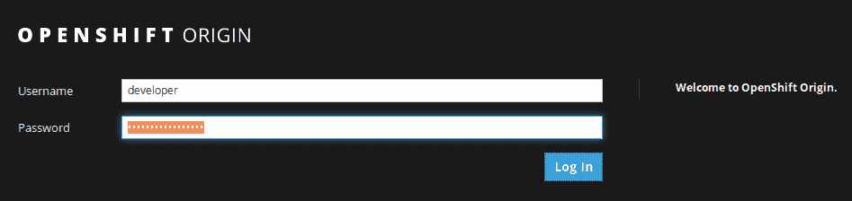

图 1：OpenShift 登录页面

访问 Minishift 的默认凭据是用户名 `developer` 和你选择的任何密码。你输入的密码并不重要，因为每次以开发者用户身份进行身份验证时，你都可以随便输入任何密码。成功登录后，你将被要求访问一个项目。Minishift 为你提供的默认项目名为 My Project。为了简单起见，我们将在接下来的实验示例中使用这个项目，你可以跟着一起操作。

网页界面由屏幕左侧和顶部的两个主要导航栏布局，而界面的中央部分则保留用于显示你当前访问的环境的详细信息、修改设置或删除资源：

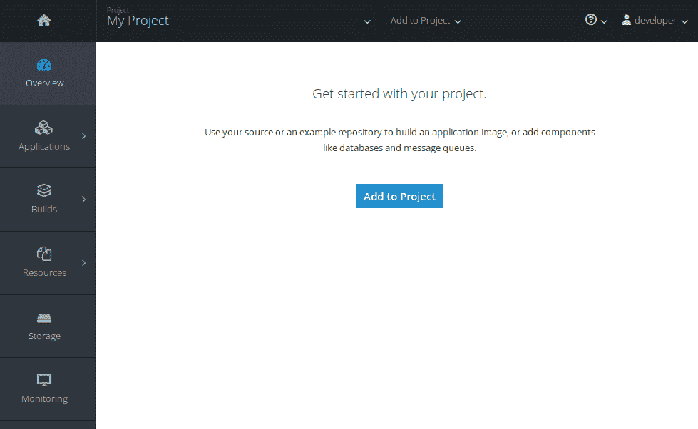

图 2：初始 OpenShift 项目

现在你已经熟悉了 OpenShift 用户界面，让我们创建一个部署，并查看当 pod 在集群中运行时的样子。创建新 pod 和部署的功能可以在屏幕顶部通过选择“添加到项目”下拉框找到：

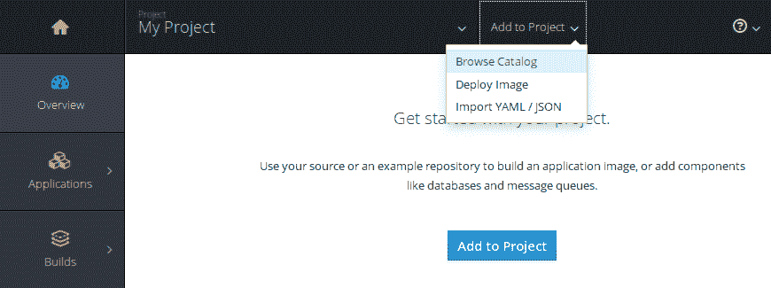

图 3：向项目添加服务

我们可以通过多种不同方式创建新的部署。OpenShift 提供的默认选项是浏览预构建的镜像和服务目录、基于容器注册表 URL 部署镜像，或导入描述我们构建的服务的 YAML 或 JSON 清单。我们可以在 Web 界面中部署一个目录中的服务。选择“添加到项目”下拉菜单中的“浏览目录”选项，将打开 OpenShift 目录的界面。目录中找到的任何 OpenShift 示例都能在 OpenShift 中良好运行，但为了演示，我们部署一个简单 Python 应用程序的框架。为此，点击 Python 选项卡，然后选择 Python 3.5 源代码应用程序：

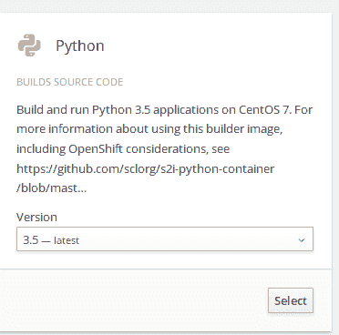

图 4：从 OpenShift 目录创建一个简单的 Python 服务

在下一个屏幕上，OpenShift 会提示你选择部署应用程序的选项，包括一个包含 Python 源代码的源代码仓库和一个应用程序名称。你可以为 Python 应用程序选择任何名称。在这个示例中，我将它命名为 `oc-test-deployment`。由于我们没有预先开发好的 Python 应用程序，可以点击 Git 仓库 URL 文本框下方的“尝试它”链接，使用 OpenShift 提供的示例应用程序：

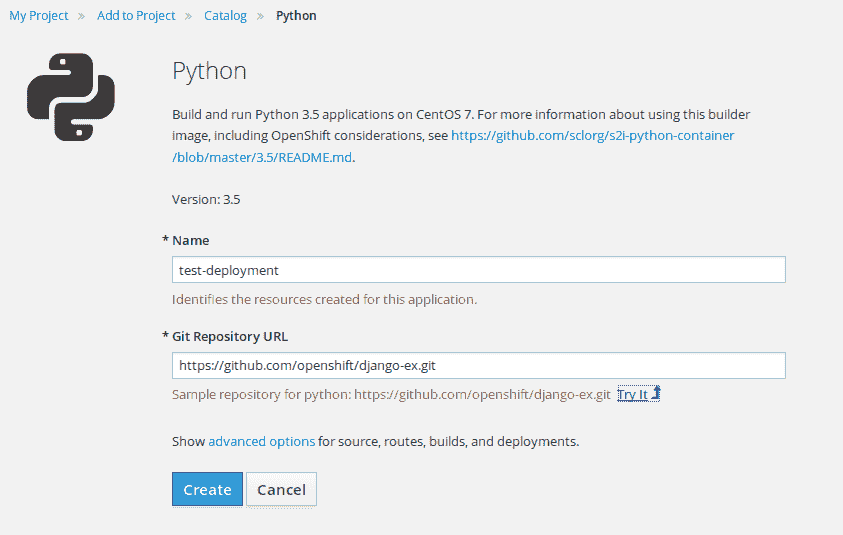

图 5：修改 Python 应用程序的属性

如果你是 Python 开发者，且希望部署一个 Django 应用程序，可以随意使用另一个 Git 仓库来替代示例仓库！

点击蓝色的“创建”按钮将启动部署并启动容器。根据你工作站的规格，服务完全部署可能需要一段时间。在部署过程中，你可以通过点击用户界面的各个页面来观察部署的不同阶段。例如，点击侧边栏中的 Pods，将显示 Pods 在创建过程中所经历的各个阶段，直到它们在 Kubernetes 中可用。OpenShift 会显示描述正在运行的资源状态的圆形图。健康、响应请求并按预期运行的 Pods 会以蓝色圆圈显示。而其他可能没有按预期运行、抛出错误或警告的 Kubernetes 资源，则会用黄色或红色圆圈表示。这提供了一种直观的方式，让你一目了然地了解服务的运行状态：

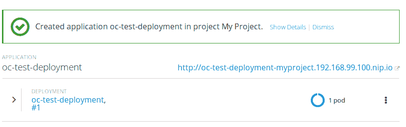

图 6：成功创建的测试 Python 应用程序

一旦服务完全部署，OpenShift 会提供一个链接以访问该服务。在 OpenShift 术语中，这被称为 **路由**。路由的功能类似于 Kubernetes 中暴露的服务，不同之处在于，它们默认使用 `nip.io` DNS 转发。你可能会注意到，指向我们刚刚创建的服务的路由，其完全限定的域名是 `servicename.ipaddress.nip.io`。这为用户提供了可路由的访问路径，以便在不需要配置外部负载均衡器或服务代理的情况下访问 Kubernetes 集群。通过 Web 浏览器访问该 URL 应该会打开一个类似于以下内容的页面：

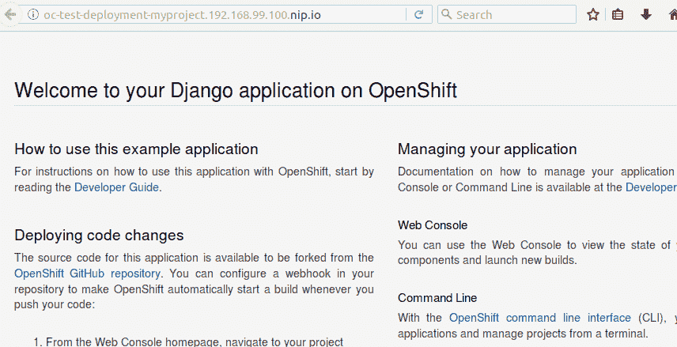

图 7：Python 应用程序测试页面

这是此简单示例应用程序的默认 Python-Django 索引页面。如果我们点击返回 OpenShift 控制台，我们可以更详细地了解在此部署中运行的 pod。与 kubectl 类似，OpenShift 可以为我们提供有关部署的详细信息，包括运行中的 pod、日志事件，甚至允许我们从 Web 用户界面自定义部署。要查看这些详细信息，选择应用程序 | 部署并点击你希望查看的部署。在此案例中，我们将查看我们唯一运行的部署 `oc-test-deployment` 的详细信息：

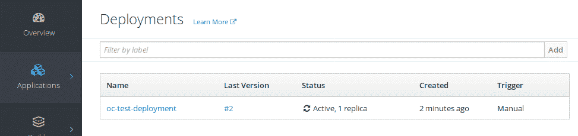

图 8：OpenShift 部署页面

从此页面，我们可以查看容器历史、修改配置、检查或更改环境变量，并查看来自部署的最新事件日志。在屏幕的右上角，操作下拉框为我们提供了更多选项，可以添加存储、自动扩展规则，甚至修改用于部署该服务的 Kubernetes 清单：

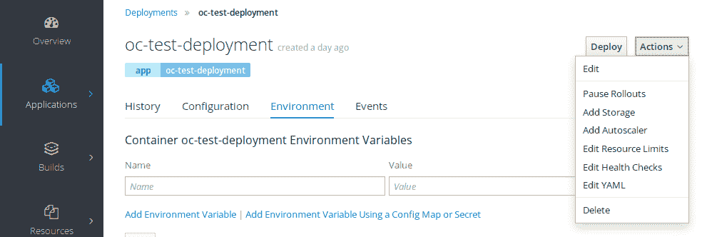

图 9：管理 OpenShift 应用程序和部署

OpenShift 提供了一个非常好的界面，用于实时调整清单并实验更改。OpenShift 用户界面会反馈你所做的更改，并在出现潜在问题时提醒你。

有关运行中 pod 的信息也可以通过 Web 用户界面访问。从应用程序菜单中选择 Pods，并点击你希望查看的 pod。在这种情况下，我们有一个正在运行的 pod，`oc-test-deployment-1-l18l8`：

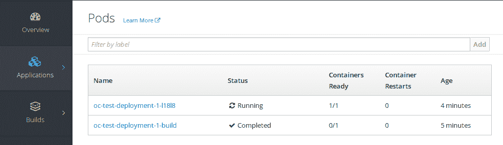

图 10：查看应用程序部署中的 pod

在此页面上，我们可以查看关于运行在任何部署中的 pod 的几乎所有相关细节。从此界面，你可以查看环境配置、实时访问容器日志，甚至通过一个完全功能的终端模拟器登录到容器：

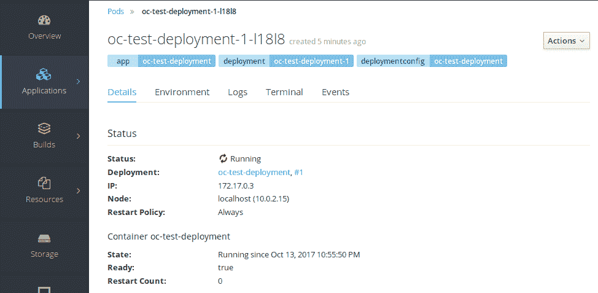

图 11：在 OpenShift 中查看 pod 特定的详细信息

类似于部署菜单，我们也可以从这个页面的操作下拉菜单中选择，修改 YAML 编辑器中的容器设置，或将存储卷挂载到容器内。

最后，通过使用 OpenShift 的 Web 界面，我们可以删除部署和 Pod。由于 OpenShift 本质上是运行在 Kubernetes 之上的一层，我们需要应用许多相同的概念。为了删除 Pod，我们必须首先删除部署，以便在 Kubernetes API 中设置新的期望状态。在 OpenShift 中，这可以通过选择应用程序 | 部署 | 你的部署（oc-test-deployment）来完成。从操作下拉菜单中，选择删除部署。OpenShift 会提示你确认是否真想执行此操作；点击删除以最终确定操作：

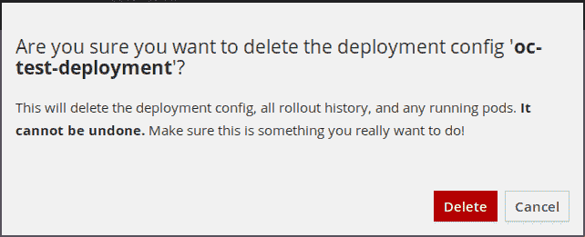

图 12：在 OpenShift 中删除部署

以类似的方式，你需要前往应用程序 | 服务，然后前往应用程序 | 路由，以删除 OpenShift 为该服务创建的服务和路由。完成后，点击左侧菜单栏中的概览按钮所产生的屏幕将再次为空，显示当前在 OpenShift 集群中没有任何运行的内容。

# OpenShift Web 用户界面 提示

上述示例引导用户完成了一些主要的 OpenShift 和 Kubernetes 工作流步骤，包括创建新部署、管理部署，最终删除部署和其他资源。OpenShift 通过 Web 用户界面暴露了比本书所能深入探讨的更多功能；我建议你花时间自己探索 Web 界面，真正熟悉 OpenShift 提供的功能。为了避免单调，我提供了一些关键功能，供你在 OpenShift Web 界面中留意：

+   **概览仪表板**：概览仪表板可以通过屏幕左侧的导航栏访问。概览仪表板显示关于 OpenShift 集群内最近活动的信息。它对于访问最新的部署并能单击访问各种集群资源非常有用。

+   **应用程序菜单**：应用程序菜单是查看或修改 OpenShift 集群中运行的任何部署或 Pod 的单一位置。在应用程序中，你可以访问与部署、Pod、有状态集合、服务和路由相关的信息。可以将应用程序菜单视为与集群中运行的容器配置相关的一站式入口。

+   **构建仪表板**：构建仪表板展示了一个轻量的 **持续集成** **持续交付** (**CICD**) 工作流，用于 Kubernetes。这对于触发镜像构建、建立 Jenkins 启用的工作流管道以及将自动化集成到 OpenShift 项目中非常有用。

+   **资源菜单**：资源菜单主要用于定义配额和用户帐户权限，管理 OpenShift 集群内用户和项目的访问权限及限制。此处还定义了一个轻量级的机密存储界面，以及配置映射选项，用于定义 OpenShift 项目内容器的配置。

+   **存储仪表盘**：存储仪表盘用于显示有关容器和部署所使用的持久卷声明的信息，卷声明存储在 OpenShift 所运行的底层硬件或虚拟机上。可以通过该网页界面部分创建或删除卷声明，也可以根据新的或变化的需求进行管理或修改。

+   **监控仪表盘**：最后，监控仪表盘为用户提供有关运行中 Pods 的详细信息、触发的事件，以及与事件相关的环境变化的历史背景。监控可以轻松与构建管道结合使用，甚至用于报告已配置的服务健康检查。

利用 OpenShift 提供的强大工具套件，有助于抽象和简化我们在第五章《使用 Kubernetes 进行大规模容器管理》中学到的许多 Kubernetes 概念。

# OpenShift CLI 简介

用户与 OpenShift 平台交互的第二种主要方式是通过 OpenShift 命令行接口，简称 OC（OpenShift 客户端）。OpenShift 命令行接口使用了我们在第五章《使用 Kubernetes 进行大规模容器管理》中探索的许多相同概念，利用`kubectl`命令行接口来管理 pods、部署和暴露服务。然而，OpenShift 客户端还支持许多特定于 OpenShift 的功能，例如创建路由以暴露部署和使用集成的安全上下文约束进行访问控制。在本节中，我们将展示如何使用 OC 完成一些基本的工作流概念，这些概念在通过网页用户界面时已经有所探索，例如创建部署、创建路由以及操作运行中的容器。最后，我们将探讨一些 OC 的深入使用技巧以及一些可用的高级功能。在继续之前，请确保已安装 OC（有关安装详情，请参阅本章开头部分）：

1.  **登录到 OpenShift**：与 Web 用户界面类似，我们可以使用 CLI 通过 `oc login` 命令登录到本地 OpenShift 集群。此命令的基本语法为 `oc login URL:PORT`，其中用户需要将 URL 和端口替换为他们登录的 OpenShift 环境的 URL 和端口号。登录成功后，提示符将返回 `Login Successful`，并授予你访问默认项目的权限。在此情况下，我们将使用 `developer` 用户名和任意密码登录到 `192.168.99.100` 本地环境：

```
aric@local:~$ oc login https://192.168.99.100:8443
Authentication required for https://192.168.99.100:8443 (openshift)
Username: developer
Password:
Login successful.

You have one project on this server: "myproject"

Using project "myproject".
```

1.  **使用 OC status 检查状态**：`oc status` 命令的使用方式与 Web 用户界面中的概览仪表盘相似，用于显示环境中部署的关键服务、正在运行的 pod 或集群中可能触发警报的任何内容。仅输入 `oc status` 不会返回任何内容，因为我们删除了通过 Web 用户界面创建的部署、路由和服务：

```
aric@local:~$ oc status
In project My Project (myproject) on server https://192.168.99.100:8443

You have no services, deployment configs, or build configs.
Run 'oc new-app' to create an application.
```

1.  **创建 OpenShift 部署**：可以使用 `oc create` 命令轻松创建部署和其他集群资源。与 `kubectl` 类似，你可以通过使用 `oc create deployment` 命令并引用你希望使用的容器镜像名称来创建部署。需要注意的是，部署名称对于使用下划线和连字符等特殊字符非常敏感。为了简化操作，让我们重新创建第五章中的示例，*大规模容器与 Kubernetes*，并使用官方 NGINX Docker 镜像通过 `oc create` 命令创建一个简单的 NGINX pod，并指定对象为 `deployment`：

```
aric@local:~$ oc create deployment webserver --image=nginx
deployment "webserver" created
```

另一个与 kubectl 相似之处是，OpenShift 支持使用 `-f` 选项基于 Kubernetes 清单文件创建部署。

1.  **列出 pod 并查看 OC 状态**：现在我们在 OpenShift 集群中有一个正在运行的部署和 pod，我们可以使用 `oc get pods` 命令查看正在运行的 pod，并检查 `oc status` 命令的输出，以查看集群中正在运行的 pod 概览：

```
aric@local:~/Development/minishift$ oc get pods
NAME                         READY     STATUS    RESTARTS   AGE
webserver-1266346274-m2jvd   1/1       Running   0          9m

aric@local:~/Development/minishift$ oc status
In project My Project (myproject) on server https://192.168.99.100:8443

pod/webserver-1266346274-m2jvd runs nginx

You have no services, deployment configs, or build configs.
Run 'oc new-app' to create an application.
```

1.  **使用 `oc describe` 查看详细输出**：除了简单列出在 OpenShift 集群中创建并可用的对象外，还可以使用 `oc describe` 命令查看有关特定对象的详细信息。与 `kubectl describe` 类似，`oc describe` 允许我们查看集群中几乎所有定义对象的相关详细信息。例如，我们可以使用 `oc describe deployment` 命令查看刚才创建的 Web 服务器部署的详细信息：

```
aric@local:~/Development/minishift$ oc describe deployment webserver
Name:                   webserver
Namespace:              myproject
CreationTimestamp:      Sun, 15 Oct 2017 15:17:30 -0400
Labels:                 app=webserver
Annotations:            deployment.kubernetes.io/revision=1
Selector:               app=webserver
Replicas:               1 desired | 1 updated | 1 total | 1 available | 0 unavailable
StrategyType:           RollingUpdate
MinReadySeconds:        0
RollingUpdateStrategy:  1 max unavailable, 1 max surge
Pod Template:
  Labels:       app=webserver
  Containers:
   nginx:
    Image:              nginx
    Port:
    Environment:        <none>
    Mounts:             <none>
  Volumes:              <none>
Conditions:
  Type          Status  Reason
  ----          ------  ------
  Available     True    MinimumReplicasAvailable
OldReplicaSets: <none>
NewReplicaSet:  webserver-1266346274 (1/1 replicas created)
Events:
  FirstSeen     LastSeen        Count   From                    SubObjectPath   Type            Reason                  Message
  ---------     --------        -----   ----                    -------------   --------        ------                  -------
  11m           11m             1       deployment-controller Normal ScalingReplicaSet       Scaled up replica set webserver-1266346274 to 1
```

1.  **创建一个 OpenShift 服务**：为了暴露正在 OpenShift 集群中运行的 pods，我们必须首先创建一个服务。你可能还记得在第五章中提到的*使用 Kubernetes 扩展容器*，Kubernetes 服务是一种抽象，它的工作方式类似于 Kubernetes 集群内的内部负载均衡器。基本上，我们是创建一个单一的内部（或外部）IP 地址，其他 pods 或服务可以通过该 IP 地址访问任何符合给定选择器的 pod。在 OpenShift 中，我们将创建一个名为 `webserver` 的服务，它将使用内部路由的集群 IP 地址来拦截 Web 服务器流量并将其转发到我们在部署过程中创建的 Web 服务器 pod。通过将服务命名为 `webserver`，它将默认使用匹配标签 `app=webserver` 的选择器标准。这个标签是在我们创建 OpenShift 部署时默认创建的。可以创建任意数量的标签或选择器标准，这使得 Kubernetes 和 OpenShift 可以选择 pod 来进行流量负载均衡。为了这个示例，我们将使用内部集群 IP，并基于命名我们的服务与我们命名部署相同的名称来映射选择器标准。最后，我们将选择从外部转发到服务的端口，并映射到容器内服务监听的端口。为了简化操作，我们将把目标端口 `80` 的流量转发到 pod 的 `80` 端口：

```
aric@local:~$ oc create service clusterip webserver --tcp=80:80
service "webserver" created
```

我们可以使用 `oc get services` 命令检查服务配置。我们可以看到我们的服务已经创建，内部路由的集群地址是 `172.30.136.131`。你的地址很可能会不同，因为这些地址是从 Kubernetes 中的 CNI 子网中获取的：

```
aric@lemur:~$ oc get services
NAME        CLUSTER-IP       EXTERNAL-IP   PORT(S)   AGE
webserver   172.30.136.131   <none>        80/TCP    18m
```

1.  **创建一个路由以启用访问**：最后，我们可以使用 `oc expose` 命令创建一个路由，以便访问我们的服务，后面跟上我们要暴露的服务名称（`webserver`）。为了使其能够从我们的工作站进行路由，OpenShift 使用基于虚拟机 IP 地址的 `nip.io` DNS 转发。我们可以通过指定 `--hostname` 参数来启用此功能，该参数后跟我们希望服务被访问时的名称，最后加上虚拟机的 IP 地址，并以后缀 `nip.io` 结尾：

```
aric@local:~$ oc expose service webserver --hostname="awesomewebapp.192.168.99.100.nip.io"
route "webserver" exposed
```

执行 `oc get routes` 命令将显示我们刚刚创建的路由：

```
aric@local:~$ oc get routes
NAME        HOST/PORT                            PATH      SERVICES    PORT      TERMINATION   WILDCARD
webserver   awesomewebapp.192.168.99.100.nip.io             webserver   80-80 None
```

为了确保路由正常工作，我们可以使用 Web 浏览器并导航到我们为路由分配的转发 DNS 地址。如果一切正常，我们将能够看到 NGINX 欢迎屏幕：

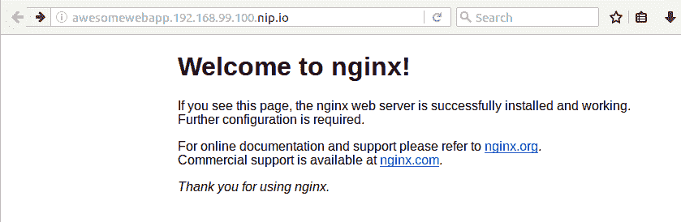

随时可以继续使用本地 Minishift 集群部署更复杂的容器化应用程序。当你完成后，确保使用 `minishift stop` 命令停止 Minishift 实例。

# OpenShift 和 Ansible 容器

正如我们在本章中所看到的，OpenShift 是一个丰富的平台，提供了 Kubernetes 之上的有价值的抽象。因此，Ansible Container 提供了充足的支持，可以通过 OpenShift 部署和运行容器化应用程序的生命周期。由于 OpenShift 和 Ansible Container 都是同一母公司 Red Hat 的产品，因此显然 OpenShift 和 Ansible Container 具有出色的兼容性。到目前为止，我们主要讨论了如何使用 Ansible Container 构建容器，并在 Docker 主机上本地运行它们。

现在，我们已经拥有了理解 Kubernetes 和 OpenShift 的坚实基础，可以将迄今为止获得的知识与 Ansible Container 相结合，学习如何将 Ansible Container 作为一个真正的端到端生产就绪部署和生命周期管理解决方案来使用。接下来的内容将变得更加有趣！

# 参考文献

+   **OpenShift 项目**: [`www.openshift.com/`](https://www.openshift.com/)

+   **MiniShift 项目**: [`www.openshift.org/minishift/`](https://www.openshift.org/minishift/)

+   **安装 MiniShift**: [`docs.openshift.org/latest/minishift/getting-started/installing.html`](https://docs.openshift.org/latest/minishift/getting-started/installing.html)

# 摘要

像 Kubernetes 和 OpenShift 这样的容器编排平台正在被组织迅速采用，以简化扩展应用程序、部署更新并确保最大可靠性的复杂过程。随着这些平台的日益流行，我们更需要理解采用这些技术的影响，以支持这些技术带来的组织和文化思维转变。

OpenShift 是建立在 Red Hat 分发版 Kubernetes 之上的平台，旨在提供最佳的 Kubernetes 使用体验。在本章开始时，我们了解了 OpenShift 是什么，以及 Red Hat 正在通过 OpenShift 平台交付的各种功能。接下来，我们学习了如何安装 Minishift 项目，这是一个面向开发者的解决方案，用于在本地部署 OpenShift。

一旦我们安装并本地运行了 Minishift，我们就学会了如何通过 Minishift 的 Web 用户界面运行 pods、deployments、services 和 routes。最后，我们了解了 OpenShift 命令行界面 OC，并学习了它如何类似于 kubectl，提供对 OpenShift 的 CLI 访问以及 OpenShift 在 Kubernetes 之上构建的创新功能。

在下一章中，我的目标是将我们对 OpenShift 和 Kubernetes 的知识与 Ansible Container 相结合，学习 Ansible Container 工作流中的最后一步——部署。部署功能使 Ansible Container 成为一个真正强大的工具，不仅可以构建和测试容器镜像，还可以将它们部署到运行 Kubernetes 和 OpenShift 的容器化生产环境中。
