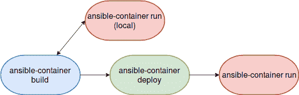
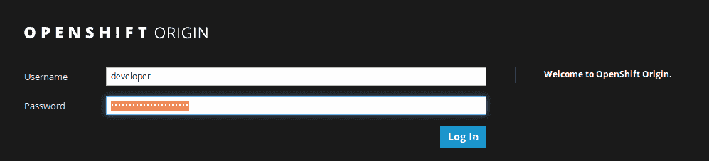
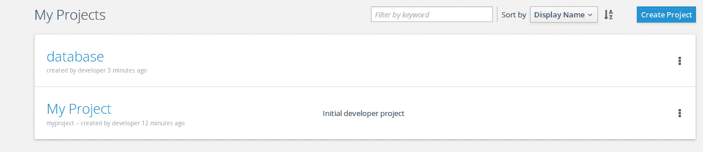
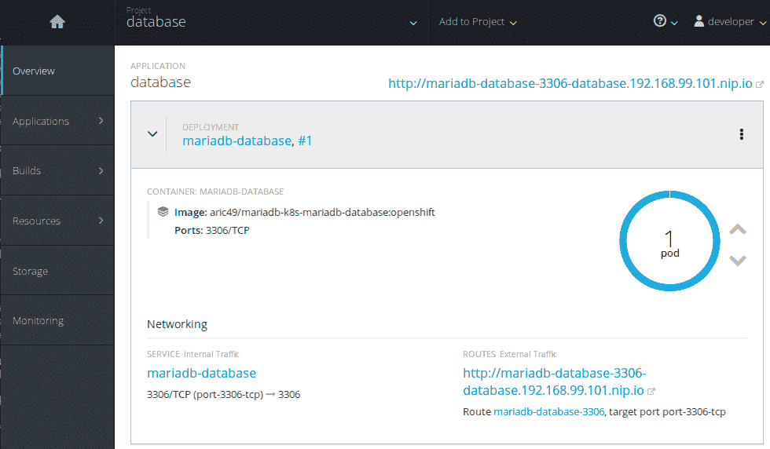

# 部署你的第一个项目

迄今为止，在本书中，我们已经研究了如何使用 Ansible Container 工作流运行构建和容器的各种方式。我们了解了如何在本地 Docker 守护进程中运行容器，将构建的容器推送到远程 Docker 镜像仓库，管理容器镜像，甚至使用 Kubernetes 和 OpenShift 等容器编排工具在大规模上运行容器。我们几乎已经展示了 Ansible Container 的全部功能，并演示了如何将其作为一个完整的工具，用于在应用程序生命周期中构建、运行和测试容器镜像。

然而，Ansible Container 工作流中有一个方面我们还没有深入研究。在之前的章节中，我们提到了 `deploy` 命令，以及如何利用 `deploy` 在生产环境或远程系统中运行容器。现在，我们已经涵盖了 Docker、Kubernetes 和 OpenShift 的许多基础知识，是时候将注意力转向 Ansible Container 工作流的最后一个组件：`ansible-container deploy`。我的目标是，通过阅读本章并跟随示例，读者将清楚地意识到 Ansible Container 不仅仅是一个用来本地构建和运行容器镜像的工具。它是一个强大的工具，可以在各种流行的容器平台上进行复杂的容器化应用部署。

本章将涵盖以下主题：

+   ansible-container deploy 概述

+   将容器部署到 Kubernetes

+   将容器部署到 OpenShift

# ansible-container deploy 概述

`ansible-container deploy` 命令是 Ansible Container 工作流的一个组件，负责，如你所猜测的那样，将容器部署到远程容器服务引擎。在写本文时，这些引擎包括 Docker、Kubernetes 和 OpenShift。通过利用 `container.yml` 文件中的配置，Ansible Container 能够验证这些服务并通过 API 调用启动容器，按照用户指定的配置进行部署。使用 Ansible Container 进行部署是一个两步过程。首先，Ansible Container 将构建好的容器镜像推送到远程镜像仓库，类似于 Docker Hub 或 `Quay.io`。这使得远程容器运行时服务能够在部署过程中访问容器。第二，Ansible Container 生成可以在本地执行的部署剧本，并使用 `ansible-container run` 命令执行部署。刚开始时，部署过程可能会有些混乱。下面的流程图展示了在本地构建并运行项目后的部署过程：



图 1：ansible-container deploy 工作流

我们将从使用简单的 NGINX 容器项目的示例开始。稍后，我们将查看使用我们在第四章中构建的 MariaDB 项目将其部署到 Kubernetes 和 OpenShift 的示例，*角色中有什么？*

# ansible-container deploy

在我们开始查看`ansible-container deploy`之前，首先让我们重新构建之前创建的 NGINX 项目。在您的 Ubuntu Vagrant 实验室虚拟机中，导航到`/vagrant/AnsibleContainer/nginx_demo`目录；或者，如果您在其他目录中自行构建了这个示例，请导航到该目录并运行`ansible-container build`命令。这将确保实验室虚拟机有一个项目的全新构建：

```
ubuntu@node01:/vagrant/AnsibleContainer/nginx_demo$ ansible-container build 
 Building Docker Engine context...                                                                                                              
Starting Docker build of Ansible Container Conductor image (please be patient)...                                                              
Parsing conductor CLI args.                                                                                                                    
Docker™ daemon integration engine loaded. Build starting.       project=nginx_demo                                                             
Building service...     project=nginx_demo service=webserver                                                                                   

PLAY [webserver] ***************************************************************                                                               

TASK [Gathering Facts] *********************************************************                                                               
ok: [webserver]                                                                                                                                

TASK [ansible.nginx-container : Install epel-release] **************************                                                               
changed: [webserver]

TASK [ansible.nginx-container : Install nginx] *********************************
changed: [webserver] => (item=[u'nginx', u'rsync'])

TASK [ansible.nginx-container : Install dumb init] *****************************
changed: [webserver]

TASK [ansible.nginx-container : Update nginx user] *****************************
changed: [webserver]

TASK [ansible.nginx-container : Put nginx config] ******************************
changed: [webserver]
```

您可以通过运行`docker images`命令来验证项目是否已成功构建并且容器镜像已被缓存：

```
ubuntu@node01:/vagrant/AnsibleContainer/nginx_demo$ docker images 
REPOSITORY  TAG   IMAGE ID  CREATED  SIZE
aric49/nginx_demo-webserver 20171022202358 09f7b7cc3e3e 10 minutes ago  268MB
```

现在，我们已经在本地缓存了容器，我们可以使用`ansible-container deploy`命令来模拟项目部署。如果不提供关于将容器部署到哪个引擎的任何参数，`ansible-container deploy`将生成可用于将我们的项目部署到运行 Docker 的本地或远程主机上的剧本。它还会将我们的项目推送到在项目`root`目录中找到的`container.yml`文件中配置的注册表。由于`deploy`与`ansible-container push`使用了许多相同的功能，我们将向`deploy`提供与`push`命令相同的标志，关于容器镜像注册表。在这种情况下，我们将告诉它将容器推送到我们的 Docker Hub 注册表，因为我们将提供帐户的用户名以及任何我们希望用来区分该版本容器与以前版本的标签。为了演示目的，我们将使用`deploy`标签：

```
ubuntu@node01:/vagrant/AnsibleContainer/nginx_demo$ ansible-container deploy --push-to docker --username aric49 --tag deploy 
Enter password for aric49 at Docker Hub:                                                                                                       
Parsing conductor CLI args.                                                                                                                    
Engine integration loaded. Preparing push.      engine=Docker™ daemon                                                                          
Tagging aric49/nginx_demo-webserver                                                                                                            
Pushing aric49/nginx_demo-webserver:deploy...                                                                                          
The push refers to a repository [docker.io/aric49/nginx_demo-webserver]                                                                        
Preparing                                                                                                                                      
Pushing                                                                                                                                        
Pushed                                                                                                                                         
Pushing                                                                                                                                        
Pushed                                                                                                                                         
20171022202358: digest: sha256:74948d56b3289009a6329c0c2035e3217d0e83479dfaee3da3d8ae6444b04165 size: 741                                      
Conductor terminated. Cleaning up.      command_rc=0 conductor_id=4c7c43d090654e62869185458434941cb7718e257eeed80f03e846d460eae24f save_contain
er=False                                                                                                                                       
Parsing conductor CLI args.                                                                                                                    
Engine integration loaded. Preparing deploy.    engine=Docker™ daemon                                                                          
Verifying image for webserver                                                                                                                  
Conductor terminated. Cleaning up.      command_rc=0 conductor_id=acf8f1ec2adc821c33b2a341bc1404346b6d41f6ef18de5fb8dce7f98ddaea3f save_container=False                                                                                                                         
```

部署过程与推送过程类似，会提示您输入 Docker Hub 帐户的密码。在成功认证后，它将把您的容器镜像层推送到容器镜像注册表。到目前为止，这看起来与推送过程完全相同。然而，您可能会注意到，在项目的`root`目录中，现在存在一个名为`ansible-deployment`的新目录。在这个目录中，您将找到一个与您的项目同名的 Ansible 剧本，名为`nginx_demo`。以下是该剧本的示例：

```
  - name: Deploy nginx_demo
    hosts: localhost
    gather_facts: false
    tasks:
      - docker_service:
            definition:
                services: &id001
                    webserver:
                        image: docker.io/aric49/nginx_demo-webserver:deploy
                        command: [/usr/bin/dumb-init, nginx, -c, /etc/nginx/nginx.conf]
                        ports:
                          - 80:8000
                        user: nginx
                version: '2'
            state: present
            project_name: nginx_demo
        tags:
          - start
      - docker_service:
            definition:
                services: *id001
                version: '2'
            state: present
            project_name: nginx_demo
            restarted: true
        tags:
          - restart
TRUNCATED
```

您可能需要确保`image`行反映了以下格式的镜像路径，`docker.io/username/containername:tag`，因为某些版本的 Ansible Container 会在剧本中提供错误的路径。如果是这种情况，只需在文本编辑器中修改剧本。

部署 playbook 通过调用运行在目标主机上的 `docker_service` 模块来工作。默认情况下，容器使用 `localhost` 作为部署的目标主机。然而，你可以轻松地提供一个标准的 Ansible 清单文件，让这个项目在远程主机上运行。部署 playbook 支持完整的 Docker 生命周期应用管理，例如启动容器、重启容器，最终通过提供一系列 playbook 标签有条件地执行所需功能来销毁项目。你会发现 playbook 继承了我们在 `container.yml` 文件中配置的许多设置。Ansible Container 使用这些设置，使得 playbooks 可以独立于项目本身执行。

由于我们已经在本书中通过使用 `ansible-container run` 运行本地容器，接下来让我们尝试直接执行 playbook 启动容器。这模拟了如果你希望手动运行部署而不依赖 Ansible Container 工作流时的相同过程。可以通过使用 `ansible-playbook` 命令并传递 `start` 标签来在本地主机上部署项目。你会发现这个过程和运行 `ansible-container run` 命令的过程完全相同。需要注意的是，任何核心的 Ansible Container 功能（如 run、restart、stop 和 destroy）都可以通过直接运行 playbooks，并根据你想要实现的功能传递相应的标签来独立执行，而不依赖 Ansible Container：

```
ubuntu@node01:$ ansible-playbook nginx_demo.yml --tags start 
[WARNING]: Host file not found: /etc/ansible/hosts

 [WARNING]: provided hosts list is empty, only localhost is available

PLAY [Deploy nginx_demo] ************************************************

TASK [docker_service] ************************************************
changed: [localhost]

PLAY RECAP *************************************
localhost                  : ok=1    changed=1    unreachable=0    failed=0
```

一旦 playbook 执行完成，`PLAY RECAP` 会显示一个任务已在你的本地主机上执行了更改。你可以执行 `docker ps -a` 命令确认项目已成功部署：

```
ubuntu@node01:$ docker ps -a 
CONTAINER ID  IMAGE   COMMAND  CREATED   STATUS  PORTS  NAMES
4b4b3b032c61        aric49/nginx_demo-webserver:deploy   "/usr/bin/dumb-ini..."   5 minutes ago       Up 5 minutes        0.0.0.0:80->8000/tcp   nginxdemo_webserver_1
```

以类似的方式，我们可以再次运行此 playbook，传递 `--restart` 标签以重新启动 Docker 主机上的容器。执行 playbook 第二次后，你应该会看到一个任务再次发生了变化，表示容器已被重新启动。这模拟了 `ansible-container restart` 命令的功能。`docker ps -a` 中的 `status` 列将显示容器在执行重启后只运行了几秒钟：

```
ubuntu@node01:$ docker ps -a 
CONTAINER ID  IMAGE  COMMAND  CREATED  STATUS  PORTS  NAMES
4b4b3b032c61        aric49/nginx_demo-webserver:deploy "/usr/bin/dumb-ini..."   7 minutes ago       Up 2 seconds 0.0.0.0:80->8000/tcp   nginxdemo_webserver_1
```

`stop` 标签可以传递给 `ansible-playbook` 命令，以暂时停止正在运行的容器。与 `restart` 类似，`docker ps -a` 输出将显示容器处于 `exit` 状态：

```
ubuntu@node01:$ ansible-playbook nginx_demo.yml --tags stop 
[WARNING]: Host file not found: /etc/ansible/hosts

 [WARNING]: provided hosts list is empty, only localhost is available

PLAY [Deploy nginx_demo] *************************************

TASK [docker_service] **************************************************************
changed: [localhost]

TRUNCATED

PLAY RECAP **************************************************
localhost: ok=4    changed=2    unreachable=0    failed=0 
```

现在我们可以使用 `docker ps -a` 命令检查状态：

```
ubuntu@node01:$ docker ps -a 
CONTAINER ID  IMAGE  COMMAND  CREATED  STATUS  PORTS  NAMES
4b4b3b032c61        aric49/nginx_demo-webserver:deploy   "/usr/bin/dumb-ini..."   11 minutes ago      Exited (0) 2 minutes ago                       nginxdemo_webserver_1
```

最后，可以通过传递 `destroy` 标签将项目从 Docker 主机上完全移除。运行这个 `playbook` 标签会在 playbook 中执行更多的步骤，但最终会将项目的所有痕迹从主机上删除：

```
ubuntu@node01:$ ansible-playbook nginx_demo.yml --tags destroy 
[WARNING]: Host file not found: /etc/ansible/hosts

 [WARNING]: provided hosts list is empty, only localhost is available

PLAY [Deploy nginx_demo] *************************************

TASK [docker_service] **************************************************************
changed: [localhost]

TASK [docker_image] **************************************************************
ok: [localhost]

TASK [docker_image] **************************************************************

TASK [docker_image] **************************************************************
ok: [localhost]

TRUNCATED

PLAY RECAP **************************************************
localhost: ok=7    changed=2    unreachable=0    failed=0
```

在幕后，当执行任何核心 Ansible Container 命令时，它们本质上是围绕生成的项目中的相同 playbook 的包装器。本章这一部分的目的是向读者展示如何使用 Ansible Container 在本地部署项目的整体流程，并在课程中更深入地讲解这些技能。部署真正变得有趣的是当使用 Kubernetes 和 OpenShift 作为目标部署引擎时。通过使用 Ansible Container 工作流命令与相应的容器平台引擎，我们可以直接使用 Ansible Container 工作流命令管理容器化部署，而不是直接执行 playbooks。

# 部署容器到 Kubernetes

使 Ansible Container 工作流如此灵活且吸引组织和个人采用 Ansible 作为使用 Kubernetes 和 OpenShift 进行远程部署的原生支持的一大原因之一。在本节中，我们将使用`ansible-container deploy`命令将容器部署到我们在第五章中创建的 Google Cloud Kubernetes 集群，*Kubernetes 下的容器规模管理*。

正如我们在上一节中讨论的那样，单独运行`ansible-container deploy`将默认将容器推送到你在`container.yml`文件中配置的任何镜像仓库，并在项目的`root`目录下生成一个名为`ansible-deployment`的新目录。在该目录中，将存在一个以项目名称命名的单个 YAML playbook 文件。这个 playbook 用于将容器部署到任何 Docker 主机，类似于`ansible-container run`命令。为了这个示例，我们将使用 Kubernetes 引擎运行`ansible-container deploy`，这样我们就可以利用 Ansible Container 作为 Kubernetes 的部署工具，自动创建服务定义和部署抽象。

为了使 Kubernetes 能够在 Ansible Container 中部署功能，我们将在项目的`container.yml`文件中添加几个新参数。具体来说，我们需要将项目指向 Kubernetes 认证配置文件，并定义容器在 Kubernetes 中的命名空间。作为示例，我将使用我们之前使用的 MariaDB 项目，但对`container.yml`文件做一些修改以支持 Kubernetes。作为参考，该项目可以在本书的官方 Git 仓库中找到，位于`Kubernetes/mariadb_demo_k8s`目录下。欢迎跟随示例，也可以修改现有的 MariaDB 项目以支持 Kubernetes。在设置部分，我们将添加`k8s_namespace`和`k8s_auth`。

Kubernetes `namespace` 将包含我们希望部署项目的集群中的命名空间名称，而 `auth` 部分将提供 Kubernetes 认证配置文件的路径。Kubernetes 认证配置的默认位置是 `/home/user/.kube/config`。如果你正在使用 Vagrant 实验室，Google Cloud SDK 会将该配置文件放置在 `/home/ubuntu/.kube/config`。

然而，在开始之前，我们需要设置一个默认的访问令牌，以便 Ansible Container 可以访问 Google Cloud API。我们可以通过执行 `gcloud auth application-default login` 命令来做到这一点。执行此命令将为你提供一个超链接，允许你使用 Google 登录凭证授予对 Google Cloud API 的权限，类似于我们在第五章中做的，*使用 Kubernetes 扩展容器*。Google Cloud API 将为你提供一个令牌，你可以在命令行输入该令牌，从而生成一个位于 `/home/ubuntu/.config/gcloud/application_default_credentials.json` 的应用程序默认凭证文件：

```
ubuntu@node01:$ gcloud auth application-default login
Go to the following link in your browser:

    https://accounts.google.com/o/oauth2/TRUNCATED

Enter verification code: XXXXXXXXXXXXXXX

Credentials saved to file: [/home/ubuntu/.config/gcloud/application_default_credentials.json]
```

这些凭证将被任何请求访问 Google Cloud 资源的库使用，包括 Ansible Container。

仅在你使用 Google Cloud Kubernetes 集群时，才需要进行 Google Container Engineer 特定的步骤。如果你使用的是像 Minikube 这样的本地 Kubernetes 环境，可以跳过这些步骤。

现在我们已在 Google Cloud API 中设置了适当的权限，我们可以修改 MariaDB 项目的 `container.yml` 文件，以支持 Kubernetes 部署引擎：

```
version: "2"
settings:
  conductor_base: ubuntu:16.04
  project_name: mariadb-k8s
  roles_path:
    - ./roles/
  k8s_namespace:
    name: database
  k8s_auth:
    config_file: /home/ubuntu/.kube/config
services:
  mariadb-database:
    roles:
      - role: mariadb_role

registries:
  docker:
    url: https://index.docker.io/v1/
    namespace: username
```

你将注意到我们已做出以下更改以支持 Kubernetes 部署：

+   `project_name`：在这个示例中，我们在 `settings` 块中添加了一个名为 `project_name` 的字段。在本书中，我们允许我们的项目使用其构建目录的默认名称。由于 Kubernetes 对于定义服务和 Pod 使用的字符有限制，我们希望通过在 `container.yml` 文件中覆盖它们来确保项目名称中不包含非法字符。

+   `k8s_namespace`：这定义了我们将部署 Pod 的 Kubernetes 命名空间。如果将此部分留空，Ansible Container 将使用我们在本章早些时候的 NGINX 部署中使用的默认命名空间。在此示例中，我们将使用一个名为 `database` 的不同命名空间。

+   `k8s_auth`：这是我们指定 Kubernetes 认证配置文件位置的地方。在该文件中，Ansible Container 能够提取我们的 API 服务器的 IP 地址、用于在集群中创建资源的访问凭证，以及连接 Kubernetes 所需的 SSL 证书。

一旦这些更改被放入你的 `container.yml` 文件中，让我们开始构建项目：

```
ubuntu@node01:$ ansible-container build                                                                                                                                  
Building Docker Engine context...                                                                                                                                                                            
Starting Docker build of Ansible Container Conductor image (please be patient)...                                                                                                                            
Parsing conductor CLI args.                                                                                                                                                                                  
Docker™ daemon integration engine loaded. Build starting.       project=mariadb-k8s                                                                                                                          
Building service...     project=mariadb-k8s service=mariadb-database                                                                                                                                                                                                                                                                        

PLAY [mariadb-database] ********************************************************                                                                                                                             

TASK [Gathering Facts] *********************************************************                                                                                                                             
ok: [mariadb-database]                                                                                                                                                                                       

TASK [mariadb_role : Install Base Packages] ************************************                                                                                                                             
changed: [mariadb-database] => (item=[u'ca-certificates', u'apt-utils'])                                                                                                                                     

TASK [mariadb_role : Install dumb-init for Container Init System] 
```

一旦项目构建完成，我们可以使用`ansible-container deploy`命令，指定`--engine`标志来使用`k8s`，并提供我们在`container.yml`文件中配置的 Docker 镜像仓库的详细信息。为了实现版本分离，我们还可以使用`kubernetes`标签标记镜像版本，这样我们可以在仓库中将此版本区分开来。然后，Ansible Container 会将我们的镜像推送到 Docker Hub 仓库，并生成特定于 Kubernetes 的部署剧本：

K8s 是 Kubernetes 的简写，Kubernetes 由字母 K 和后面 8 个字母组成。在社区中，这通常被发音为**凯-艾特斯**。

```
ubuntu@node01:$ ansible-container --engine k8s deploy --push-to docker --tag kubernetes
Parsing conductor CLI args.
Engine integration loaded. Preparing push.      engine=K8s
Tagging aric49/mariadb-k8s-mariadb-database
Pushing aric49/mariadb-k8s-mariadb-database:kubernetes...
The push refers to a repository [docker.io/aric49/mariadb-k8s-mariadb-database]
Preparing
Waiting
Layer already exists
Pushing
Pushed
Pushing
Pushed
kubernetes: digest: sha256:563ec4593945b13b481c03ab7813bb64c0dc1b7a1d1ae8c4b61b744574df2926 size: 1569
Conductor terminated. Cleaning up.      command_rc=0 conductor_id=27fd42d3920deb12f8c81802f151e95931315f516e04307a3a682bd9638fdf49 save_container=False
Parsing conductor CLI args.
Engine integration loaded. Preparing deploy.    engine=K8s
Verifying image for mariadb-database
ansible-galaxy 2.5.0
  config file = /etc/ansible/ansible.cfg
  configured module search path = [u'/root/.ansible/plugins/modules', u'/usr/share/ansible/plugins/modules']
  ansible python module location = /usr/local/lib/python2.7/dist-packages/ansible
  executable location = /usr/local/bin/ansible-galaxy
  python version = 2.7.12 (default, Nov 19 2016, 06:48:10) [GCC 5.4.0 20160609]
Using /etc/ansible/ansible.cfg as config file
Opened /root/.ansible_galaxy
Processing role ansible.kubernetes-modules
Opened /root/.ansible_galaxy
- downloading role 'kubernetes-modules', owned by ansible
https://galaxy.ansible.com/api/v1/roles/?owner__username=ansible&name=kubernetes-modules
https://galaxy.ansible.com/api/v1/roles/16501/versions/?page_size=50
- downloading role from https://github.com/ansible/ansible-kubernetes-modules/archive/master.tar.gz
- extracting ansible.kubernetes-modules to /vagrant/Kubernetes/mariadb_demo_k8s/ansible-deployment/roles/ansible.kubernetes-modules
- ansible.kubernetes-modules (master) was installed successfully
Conductor terminated. Cleaning up.      command_rc=0 conductor_id=d66eb0a142190022fee50de4e2560c11260bd69ec3cc634be2a389425e6bf477 save_container=False
```

一旦这个过程完成，您会注意到，类似于上一个示例，项目中出现了一个新的目录，名为`ansible-deployment`。在这个目录内，您会找到一个剧本和一个`roles`目录，后者负责将我们的服务部署到 Kubernetes 中。与我们之前的本地主机示例一样，这个剧本同样根据标签进行划分，控制在集群中启动、停止和重启服务。由于我们尚未部署我们的服务，因此我们可以使用带有`--engine k8s`标志的`ansible-container run`命令来启动部署，以指示进行 Kubernetes 部署。如果我们已经正确配置了`container.yml`文件，您应该看到剧本成功运行，表示容器已经部署到 Kubernetes 集群中：

```
ubuntu@node01:/vagrant/Kubernetes/mariadb_demo_k8s$ ansible-container --engine k8s run
Parsing conductor CLI args.
Engine integration loaded. Preparing run.       engine=k8s
Verifying service image service=mariadb-database
PLAY [Manage the lifecycle of mariadb-k8s on K8s] **************************************************

TASK [Create namespace database] ***************************************************
ok: [localhost]

TASK [Create service] ******************************************************
ok: [localhost]

TASK [Create deployment, and scale replicas up] *******************************************************
changed: [localhost]

PLAY RECAP ********************************************
localhost: ok=3    changed=1    unreachable=0    failed=0
```

使用之前的`kubectl get pods`命令，我们可以验证我们的 Kubernetes pod 已经部署并成功运行。由于我们将这个 pod 部署在自己的命名空间中，因此我们需要使用`--namespace`标志来查看运行在其他命名空间中的 pods：

```
ubuntu@node01:$ kubectl get pods --namespace database
NAME                                READY     STATUS    RESTARTS   AGE
mariadb-database-1880651791-979zd   1/1       Running   0          3m
```

使用带有 Kubernetes 引擎的`ansible-container run`命令是创建在 Kubernetes 集群上运行的云原生服务的强大工具。通过使用 Ansible Container，您可以灵活地选择部署应用程序的方式，可以直接执行剧本，也可以通过 Ansible Container 工作流自动执行。如果您希望从 Kubernetes 集群中删除当前部署，您可以简单地运行`ansible-container --engine k8s destroy`命令，以完全从集群中删除 pods 和部署工件。需要注意的是，其他 Ansible Container 工作流命令（start、stop 和 restart）完全适用于 Kubernetes 部署引擎。为了减少冗余，我们来看一下`ansible-container deploy`和工作流命令在 OpenShift 部署引擎下的工作方式。从功能上讲，Ansible Container 的工作流命令对于 Kubernetes 和 OpenShift 是相同的。

# 将容器部署到 OpenShift

`ansible-container deploy`命令还支持使用原生 OpenShift API 直接部署到 OpenShift。由于 OpenShift 是基于 Kubernetes 构建的，您会发现将容器部署到 OpenShift 的过程与 Kubernetes 的部署非常相似，因为 OpenShift 的身份验证与 Kubernetes 在后台的工作方式非常相似。在开始之前，这些示例将使用与我们在第六章中创建的 Minishift 虚拟机同时运行的 Vagrant 实验室虚拟机，*使用 OpenShift 管理容器*。这可能会消耗大量的 CPU 和内存。如果您尝试在 8 GB 或更高的内存下运行这些示例，您应该能够获得良好的性能。

然而，如果您的资源有限，这些示例仍然可以在 OpenShift 的免费云账户上运行得相当顺利，尽管您可能会遇到提供的配额有限的问题。

在开始之前，我们首先需要确保 Vagrant 实验室环境以及我们的 Minishift 虚拟机正在运行，并且可以从 VirtualBox 网络中访问。由于用于创建我们 Vagrant 实验室环境和 Minishift 集群的虚拟化管理程序都使用 VirtualBox，我们默认情况下应该能够在两个虚拟机之间建立网络连接。我们可以通过尝试从 Vagrant 实验室虚拟机 ping Minishift 虚拟机来验证这一点。首先，我们需要使用适合您本地工作站的规格启动 Minishift 虚拟机。在这个示例中，我将启动 Minishift 虚拟机，分配 8 GB 内存和 50 GB 虚拟硬盘存储。如果您同时运行两个虚拟机，您可能只能为 Minishift 分配最小的 2 GB 内存：

```
aric@lemur:~/Development/minishift$ minishift start --vm-driver=virtualbox --disk-size=50GB --memory=8GB 
-- Starting local OpenShift cluster using 'virtualbox' hypervisor ...                                                                                           
-- Starting Minishift VM .................... OK                                                                                                                       
-- Checking for IP address ... OK                                                                                                                                          
-- Checking if external host is reachable from the Minishift VM ...                                 
   Pinging 8.8.8.8 ... OK                                                                                      
-- Checking HTTP connectivity from the VM ...                                 
   Retrieving http://minishift.io/index.html ... OK
-- Checking if persistent storage volume is mounted ... OK
-- Checking available disk space ... 7% used OK                                                             
-- OpenShift cluster will be configured with ...                                                            
   Version: v3.6.0                               
-- Checking `oc` support for startup flags ...             
   host-config-dir ... OK                       
   host-data-dir ... OK                                                                                   
   host-pv-dir ... OK                                                                               
   host-volumes-dir ... OK                                                                                  
   routing-suffix ... OK                                                                               
Starting OpenShift using openshift/origin:v3.6.0 ...     
OpenShift server started.                            

The server is accessible via web console at:                                                                                                                                                            
    https://192.168.99.100:8443                          
```

启动过程结束时，您应该会收到一个 IP 地址，通过这个地址可以访问 OpenShift Web UI。我们需要确保这个 IP 地址可以从我们的 Vagrant 实验室节点访问：

```
ubuntu@node01:~$ ping 192.168.99.100
PING 192.168.99.100 (192.168.99.100) 56(84) bytes of data.
64 bytes from 192.168.99.100: icmp_seq=1 ttl=63 time=0.642 ms
64 bytes from 192.168.99.100: icmp_seq=2 ttl=63 time=0.602 ms
64 bytes from 192.168.99.100: icmp_seq=3 ttl=63 time=0.929 ms
^C
--- 192.168.99.100 ping statistics ---
3 packets transmitted, 3 received, 0% packet loss, time 2003ms
rtt min/avg/max/mdev = 0.602/0.724/0.929/0.147 ms
```

如果这个 IP 地址无法 ping 通，您可能需要配置您的 VirtualBox 网络，使网络连接可用。了解如何配置和调试 VirtualBox 网络的一个很好的资源是官方的 VirtualBox 文档：[`www.virtualbox.org/manual/ch06.html`](https://www.virtualbox.org/manual/ch06.html)。

一旦 Minishift 虚拟机和 Vagrant 实验室虚拟机之间的网络连接已经建立并验证，接下来我们需要在 Vagrant 实验室虚拟机上安装 OC，以便我们可以进行 OpenShift 身份验证。这将是我们在第六章中完成的相同过程，*使用 OpenShift 管理容器*：

1.  使用`wget`下载 OC 二进制包：

```
ubuntu@node01:~$ wget https://mirror.openshift.com/pub/openshift-v3/clients/3.6.173.0.5/linux/oc.tar.gz                                                                                                                                                                                 

Resolving mirror.openshift.com (mirror.openshift.com)... 54.173.18.88, 54.172.163.83, 54.172.173.155                                                                                                         
Connecting to mirror.openshift.com (mirror.openshift.com)|54.173.18.88|:443... connected.                                                                                                                    
HTTP request sent, awaiting response... 200 OK                                                                                                                                                               
Length: 36147137 (34M) [application/x-gzip]                                                                                                                                                                  
Saving to: ‘oc.tar.gz' 
2017-10-28 15:21:24 (6.79 MB/s) - ‘oc.tar.gz' saved [36147137/36147137]
```

1.  使用`tar -xf`命令提取 TAR 归档文件：

```
ubuntu@node01:~$ tar -xf oc.tar.gz
oc    oc.tar.gz
```

1.  将二进制文件复制到`$PATH`位置：

```
ubuntu@node01:~$ sudo cp oc /usr/local/bin
```

如果您在`/home/ubuntu/.kube/config`中有现有的 Kubernetes 凭证，您需要将其备份到其他位置，以防 OC 覆盖它们（或者如果您不再需要它，只需删除配置文件：`rm -rf ~/.kube/config`）。

接下来，我们需要使用`oc login`命令对本地 OpenShift 集群进行认证，以便生成 Kubernetes 凭证文件，该文件将由 Ansible Container 使用。`oc login`命令需要 OpenShift 集群的 URL 作为参数。默认情况下，OC 将把 Kubernetes 配置文件写入`/home/ubuntu/.kube/config`。此文件将作为我们认证 OpenShift Kubernetes 以执行自动化部署的凭证。记得以 `developer` 用户身份登录，该用户使用任何用户提供的密码进行登录：

```
ubuntu@node01:$ oc login https://192.168.99.100:8443 
The server uses a certificate signed by an unknown authority.                                                                                                                                                
You can bypass the certificate check, but any data you send to the server could be intercepted by others.                                                                                                    
Use insecure connections? (y/n): y                                                                                                                                                                           

Authentication required for https://192.168.99.100:8443 (openshift)                                                                                                                                          
Username: developer                                                                                                                                                                                          
Password:                                                                                                                                                                                                    
Login successful.                                                                                                                                                                                            

You have one project on this server: "myproject"                                                                                                                                                             

Using project "myproject".                                                                                                                                                                                   
Welcome! See 'oc help' to get started.
```

一旦您成功认证，您应该会注意到现在有一个新的 Kubernetes 配置文件被写入到路径`/home/ubuntu/.kube/config`。这是 Ansible Container 用于访问 OpenShift 的配置文件：

```
ubuntu@node01:~$ cat .kube/config
apiVersion: v1
clusters:
- cluster:
    insecure-skip-tls-verify: true
    server: https://192.168.99.100:8443
  name: 192-168-99-100:8443
contexts:
- context:
    cluster: 192-168-99-100:8443
    namespace: myproject
    user: developer/192-168-99-100:8443
  name: myproject/192-168-99-100:8443/developer
current-context: myproject/192-168-99-100:8443/developer
kind: Config
preferences: {}
users:
- name: developer/192-168-99-100:8443
  user:
    token: TOKEN-CENSORED
```

让我们通过使用`oc get all`命令测试对本地 OpenShift 实例的认证。如果认证成功，您应该会看到当前在本地 OpenShift 环境中运行的 pod、部署、服务和路由的列表：

```
ubuntu@node01:~$ oc get all
NAME   DOCKER REPO   TAGS    UPDATED
is/oc-test-deployment   172.30.1.1:5000/myproject/oc-test-deployment   latest    13 days ago
is/test-deployment      172.30.1.1:5000/myproject/test-deployment      latest    2 weeks ago

NAME               DESIRED   CURRENT   UP-TO-DATE   AVAILABLE   AGE
deploy/webserver   1         1         1            1           12d

NAME               HOST/PORT                            PATH      SERVICES    PORT      TERMINATION   WILDCARD
routes/webserver   awesomwebapp.192.168.99.100.nip.io             webserver   80-80                   None

NAME            CLUSTER-IP       EXTERNAL-IP   PORT(S)   AGE
svc/webserver   172.30.136.131   <none>        80/TCP    12d

NAME                      DESIRED   CURRENT   READY     AGE
rs/webserver-1266346274   1         1         1         12d

NAME                            READY     STATUS    RESTARTS   AGE
po/webserver-1266346274-m2jvd   1/1       Running   3          12d
```

默认情况下，OpenShift 使用与 Kubernetes 相同的认证机制，在我们的`container.yml`文件中。我们需要提供的唯一信息是 Kubernetes 配置文件的路径，以及项目将要部署到的 Kubernetes 命名空间。由于我们之前在上一部分的 MariaDB 项目中已经配置过这些内容，所以我们可以重用这些配置，将我们的项目部署到 OpenShift。回顾一下，我们来看一下 Vagrant Lab 虚拟机（`/vagrant/Kubernetes/mariadb_demo_k8s`）中 MariaDB 项目的内容，并查看`container.yml`文件的内容：

```
version: "2"
settings:
  conductor_base: ubuntu:16.04
  project_name: mariadb-k8s
  roles_path:
    - ./roles/
  k8s_namespace:
    name: database
  k8s_auth:
    config_file: /home/ubuntu/.kube/config
services:
  mariadb-database:
    roles:
      - role: mariadb_role

registries:
  docker:
    url: https://index.docker.io/v1/
    namespace: aric49
```

唯一的区别是，`k8s_namespace`参数将定义您希望将容器部署到的 OpenShift 项目。在 OpenShift 术语中，`project`和`namespace`本质上是相同的。目前，让我们保持配置不变，来看一下如何使用 OpenShift 引擎部署我们的项目。使用 OpenShift 部署项目与我们使用 Kubernetes 部署的方式非常相似，唯一的区别是我们需要在 Ansible Container 命令前添加`--engine openshift`标志，以便我们的项目知道要直接与 OpenShift API 进行交互。这里也适用相同的语法规则。我们将为`deploy`命令提供在`container.yml`文件中定义的仓库名称，用于推送我们的容器镜像，并为其指定一个唯一的标签，方便后续引用：

```
ubuntu@node01:/vagrant/Kubernetes/mariadb_demo_k8s$ ansible-container --engine openshift deploy --push-to docker --tag openshift

Parsing conductor CLI args.                                                                                                                                                                                  
Engine integration loaded. Preparing push.      engine=OpenShift™
Tagging aric49/mariadb-k8s-mariadb-database
Pushing aric49/mariadb-k8s-mariadb-database:openshift...
The push refers to a repository [docker.io/aric49/mariadb-k8s-mariadb-database]
Preparing
Waiting
Layer already exists
openshift: digest: sha256:99139cdd73b80ed29cedf8df4399b368f22e747f18e66e2529daf2e7fcf82c41 size: 1569
Conductor terminated. Cleaning up.      command_rc=0 conductor_id=9b1bdcabd9399757c54a7218b8db2233503dacc4ecdde95d8a358a965bac954e save_container=False
Parsing conductor CLI args.
Engine integration loaded. Preparing deploy.    engine=OpenShift™
Verifying image for mariadb-database
Conductor terminated. Cleaning up.      command_rc=0 conductor_id=76e86c54e5545328a6806bb3315d604c8e7cdb59d4484a2c32f78ba35787716b save_container=False
```

一旦我们的容器镜像推送完成，我们可以验证部署的 playbooks 是否已经在`ansible-deployment`目录下生成（`Kubernetes/mariadb_demo_k8s/ansible-deployment/mariadb-k8s.yml`）：

```
  - name: Manage the lifecycle of mariadb-k8s on OpenShift™
    hosts: localhost
    gather_facts: no
    connection: local
    # Include Ansible Kubernetes and OpenShift modules
    roles:
      - role: ansible.kubernetes-modules
    vars_files: []
    # Tasks for setting the application state. Valid tags include: start, stop, restart, destroy
    tasks:
      - name: Create project myproject
        openshift_v1_project:
            name: myproject
            state: present
        tags:
          - start
      - name: Destroy the application by removing project myproject
        openshift_v1_project:
            name: myproject
            state: absent
        tags:
          - destroy
TRUNCATED
```

类似于 Docker 和 Kubernetes 部署引擎，这些 playbooks 可以独立执行，使用`ansible-playbook`命令，或者使用`ansible-container run`命令。让我们运行我们的项目，并通过`ansible-container run`命令将其部署到 OpenShift：

```
ubuntu@node01:/vagrant/Kubernetes/mariadb_demo_k8s$ ansible-container --engine openshift run 
Parsing conductor CLI args.
Engine integration loaded. Preparing run.       engine=OpenShift™
Verifying service image service=mariadb-database

PLAY [Manage the lifecycle of mariadb-k8s on OpenShift?] ***********************

TASK [Create project database] *************************************************
changed: [localhost]

TASK [Create service] **********************************************************
changed: [localhost]

TASK [Create deployment, and scale replicas up] ********************************
changed: [localhost]

TASK [Create route] ************************************************************
changed: [localhost]

PLAY RECAP *********************************************************************
localhost                  : ok=4    changed=4    unreachable=0    failed=0

All services running.   playbook_rc=0
Conductor terminated. Cleaning up.      command_rc=0 conductor_id=ac5ead07a0bb145cc507b5cf815290597d1c1a8ee77a894c60916d2c0d543f18 save_container=False
```

在 playbook 运行成功完成后，我们可以登录到 OpenShift 网页用户界面，查看刚才执行的部署。在网页浏览器中，导航到`minishift start`命令输出中提供的 URL（在我的例子中是`192.168.99.100`），接受自签名证书，并以`developer`用户身份登录：



图 2：登录到 OpenShift 控制台

登录后，您应该看到一个新项目已创建，名为`database`。在此项目中，您可以看到 Ansible Container 部署默认生成的所有内容：



图 3：数据库项目已在 OpenShift 控制台的“我的项目”下创建

点击项目，`database`将带你进入一个仪表盘，显示与部署相关的详细信息：



图 4：MariaDB 数据库部署

如您所见，默认情况下，用于部署 OpenShift 的 Ansible Container playbooks 运行时具有一组非常实用的默认配置选项。我们可以立刻看到，Ansible Container 为我们的项目创建了一个名为`database`的新项目。在此项目中，存在一个默认部署，其中包含我们创建并正在运行的 MariaDB pod。它甚至为我们采取了创建一个默认服务的步骤，预先配置了标签，并使用`nip.io` DNS 服务创建了一个路由来访问该服务。实际上，我们的新服务已经部署并准备好随时使用。为了使用 OpenShift 部署引擎，我们实际上不需要更改任何`container.yml`配置；我们使用的配置与部署到 Kubernetes 时完全相同，唯一的区别是使用了不同的 Kubernetes 配置文件，并在`run`命令中指定了 OpenShift 引擎。正如您所看到的，能够透明地部署到 OpenShift 或 Kubernetes 是极其强大的。这使得 Ansible Container 能够无缝地工作，无论您的服务配置使用的是哪种目标架构。

我们还可以通过使用 OC 命令行界面客户端来验证部署。在 Vagrant 实验室虚拟机中，您可以使用`oc project`命令切换到`database`项目：

```
ubuntu@node01:/vagrant/Kubernetes/mariadb_demo_k8s$ oc project database
Now using project "database" on server "https://192.168.99.100:8443".
```

一旦我们切换到新的项目上下文，就可以使用`oc get all`命令来显示在该项目中配置的所有内容，包括由 Ansible Container 生成的 pods、服务和路由配置：

```
ubuntu@node01:/vagrant/Kubernetes/mariadb_demo_k8s$ oc get all
NAME                  REVISION   DESIRED   CURRENT   TRIGGERED BY
dc/mariadb-database   1          1         1         config

NAME                    DESIRED   CURRENT   READY     AGE
rc/mariadb-database-1   1         1         1         27s

NAME                           HOST/PORT                                              PATH      SERVICES           PORT            TERMINATION   WILDCARD
routes/mariadb-database-3306   mariadb-database-3306-database.192.168.99.100.nip.io             mariadb-database   port-3306-tcp                 None

NAME                   CLUSTER-IP      EXTERNAL-IP   PORT(S)    AGE
svc/mariadb-database   172.30.154.77   <none>        3306/TCP   28s

NAME                          READY     STATUS    RESTARTS   AGE
po/mariadb-database-1-bj19h   1/1       Running   0          26s
```

除了`ansible-container run`之外，我们还可以使用标准的 Ansible Container 工作流命令来管理我们的部署，比如`stop`、`restart`和`destroy`。正如我们之前讨论的，这些工作流命令在 Kubernetes 引擎中也能以相同的方式工作。让我们首先启动`ansible-container stop`命令。`stop`将优雅地停止部署中所有正在运行的 Pods，同时保持其他已部署的资源活跃。让我们尝试停止部署并重新执行`get all`命令，了解会发生什么：

```
ubuntu@node01:$ ansible-container --engine openshift stop
Parsing conductor CLI args.
Engine integration loaded. Preparing to stop all containers.    engine=OpenShift™

PLAY [Manage the lifecycle of mariadb-k8s on OpenShift?] ***********************

TASK [Stop running containers by scaling replicas down to 0] *******************
changed: [localhost]

PLAY RECAP *********************************************************************
localhost                  : ok=1    changed=1    unreachable=0    failed=0

All services stopped.   playbook_rc=0
Conductor terminated. Cleaning up.      command_rc=0 conductor_id=8374839c00e2d92c02351905bd6dd463ba5592783430bc08c5b18ba068fece77 save_container=False
```

一旦`stop`命令成功完成，请重新执行`oc get all`命令：

```
ubuntu@node01:/vagrant/Kubernetes/mariadb_demo_k8s$ oc get all
NAME                  REVISION   DESIRED   CURRENT   TRIGGERED BY
dc/mariadb-database   2          0         0         config

NAME                    DESIRED   CURRENT   READY     AGE
rc/mariadb-database-1   0         0         0         7m
rc/mariadb-database-2   0         0         0         1m

NAME                           HOST/PORT                                              PATH      SERVICES           PORT            TERMINATION   WILDCARD
routes/mariadb-database-3306   mariadb-database-3306-database.192.168.99.100.nip.io             mariadb-database   port-3306-tcp                 None

NAME                   CLUSTER-IP      EXTERNAL-IP   PORT(S)    AGE
svc/mariadb-database   172.30.154.77   <none>        3306/TCP   7m
```

从前面的输出中，我们可以看到 OpenShift 为我们部署的配置更改创建了一个新修订版本（`REVISION 2`），它描述了该部署没有正在运行的 Pod 副本，表明部署处于停止状态（`Current 0`，`Desired 0`，`Ready 0`）。然而，路由和服务仍然存在，并且在集群中运行。OpenShift 的一个主要优点是，它能够跟踪在各种修订定义下对项目所做的更改。这使得在变更失败或需要回滚时，能够轻松地回退到先前的部署。`stop`命令的补充命令是`restart`，它确保在首先停止服务后，当前修订版本处于运行状态。

与`stop`不同，`restart`不会创建新的修订版本，因为我们当前的修订版本已经缩减为零副本，但会将当前修订版本扩展，以确保在项目中运行所需数量的 Pods。让我们执行`ansible-container restart`命令，查看它如何影响我们的部署：

```
ubuntu@node01:/vagrant/Kubernetes/mariadb_demo_k8s$ ansible-container --engine openshift restart
Parsing conductor CLI args.
Engine integration loaded. Preparing to restart containers.     engine=OpenShift™

PLAY [Manage the lifecycle of mariadb-k8s on OpenShift?] ***********************

TASK [Stop running containers by scaling replicas down to 0] *******************
ok: [localhost]

TASK [Create deployment, and scale replicas up] ********************************
changed: [localhost]

PLAY RECAP *********************************************************************
localhost                  : ok=2    changed=1    unreachable=0    failed=0

All services restarted. playbook_rc=0
Conductor terminated. Cleaning up.      command_rc=0 conductor_id=d54f160a64f5f57cfe88e6b824dfe609a9000355bc2e29584509ec3d97eee82f save_container=False
```

再次执行`oc get all`命令，我们将看到当前的修订版本（#2）已经按所需的 Pod 数量运行：

```
ubuntu@node01:/vagrant/Kubernetes/mariadb_demo_k8s$ oc get all
NAME                  REVISION   DESIRED   CURRENT   TRIGGERED BY
dc/mariadb-database   2          1         1         config

NAME                    DESIRED   CURRENT   READY     AGE
rc/mariadb-database-1   0         0         0         31m
rc/mariadb-database-2   1         1         1         26m

NAME                           HOST/PORT                                              PATH      SERVICES           PORT            TERMINATION   WILDCARD
routes/mariadb-database-3306   mariadb-database-3306-database.192.168.99.101.nip.io             mariadb-database   port-3306-tcp                 None

NAME                   CLUSTER-IP      EXTERNAL-IP   PORT(S)    AGE
svc/mariadb-database   172.30.154.77   <none>        3306/TCP   31m

NAME                          READY     STATUS    RESTARTS   AGE
po/mariadb-database-2-g7r7f   1/1       Running   0          6m
```

最后，我们可以使用`ansible-container destroy`命令彻底删除 OpenShift（或 Kubernetes）集群中所有与我们服务相关的痕迹。请记住，这还将删除项目以及任何其他在项目中运行的容器，无论这些容器是通过 Ansible Container 手动部署还是通过其他方式部署的。这就是为什么在运行诸如`ansible-container destroy`等命令时，将应用程序部署按 OpenShift 项目和 Kubernetes 命名空间进行区分非常重要的原因：

```
ubuntu@node01:/vagrant/Kubernetes/mariadb_demo_k8s$ ansible-container --engine openshift destroy
Parsing conductor CLI args.
Engine integration loaded. Preparing to stop+delete all containers and built images.    engine=OpenShift™

PLAY [Manage the lifecycle of mariadb-k8s on OpenShift?] ***********************

TASK [Destroy the application by removing project database] ********************
changed: [localhost]

PLAY RECAP *********************************************************************
localhost                  : ok=1    changed=1    unreachable=0    failed=0

All services destroyed. playbook_rc=0
Conductor terminated. Cleaning up.      command_rc=0 conductor_id=dde59aed5fb90b1e46df4fa9e4558a46ff043f89189cc101f25a01004878f472 save_container=False
```

根据任务执行情况，似乎有一个任务执行时删除了整个 OpenShift 项目。如果我们最后一次执行`oc get all`命令，这一点会显现出来：

```
ubuntu@node01:/vagrant/Kubernetes/mariadb_demo_k8s$ oc get all 
Error from server (Forbidden): User "developer" cannot list buildconfigs in project "database"
Error from server (Forbidden): User "developer" cannot list builds in project "database"
Error from server (Forbidden): User "developer" cannot list imagestreams in project "database"
Error from server (Forbidden): User "developer" cannot list deploymentconfigs in project "database"
Error from server (Forbidden): User "developer" cannot list deployments.extensions in project "database"
Error from server (Forbidden): User "developer" cannot list horizontalpodautoscalers.autoscaling in project "database"
Error from server (Forbidden): User "developer" cannot list replicationcontrollers in project "database"
Error from server (Forbidden): User "developer" cannot list routes in project "database"
Error from server (Forbidden): User "developer" cannot list services in project "database"
Error from server (Forbidden): User "developer" cannot list statefulsets.apps in project "database"
Error from server (Forbidden): User "developer" cannot list jobs.batch in project "database"
Error from server (Forbidden): User "developer" cannot list replicasets.extensions in project "database"
Error from server (Forbidden): User "developer" cannot list pods in project "database"
```

这些错误表明我们的用户已经无法列出 `database` 项目中存在的任何内容，因为该项目不再存在。该项目的所有痕迹，包括部署、服务、Pod 和路由，都已从集群中删除。从 Web 界面上也可以明显看出这一点，因为刷新网页后会显示该项目已经不存在。

# 参考文献

+   **Ansible Container 部署指南**: [`docs.ansible.com/ansible-container/reference/deploy.html`](https://docs.ansible.com/ansible-container/reference/deploy.html)

+   **VirtualBox 网络指南**: [`www.virtualbox.org/manual/ch06.html`](https://www.virtualbox.org/manual/ch06.html)

# 总结

在本章中，我们研究了最后一个 Ansible Container 工作流命令：`ansible-container deploy`。`deploy` 是 Ansible Container 中最通用的命令之一，因为它允许我们在生产级的 Kubernetes 和 OpenShift 环境中运行和管理容器。`deploy` 为我们的旅程开辟了一条新路，能够实现容器赋予我们基础设施的灵活性和敏捷性。现在，我们可以真正地使用一个工具，不仅在本地构建和调试容器化应用，还可以在生产环境中部署和管理这些应用。能够使用相同的表达式 Ansible Playbook 语言来真正构建可靠且可扩展的应用程序，意味着部署可以从第一天起围绕 DevOps 和自动化最佳实践构建，而不是事后重新设计部署以使其自动化的艰难任务。

仅仅因为我们已经完成了关于主要的 Ansible Container 工作流组件的学习，并不意味着我们的旅程已经结束。到目前为止，在本书中，我们已经研究了如何使用 Ansible Container 部署不依赖于其他服务的单功能微服务。Ansible Container 的强大之处在于，它还具有通过表达与其他服务的链接和依赖关系来构建和部署多个容器化应用的内在能力。在下一章，我们将研究如何构建和部署多容器应用。
