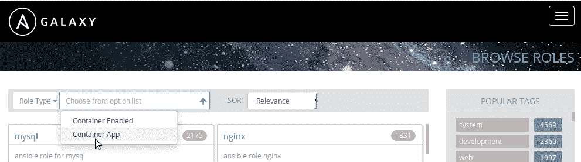
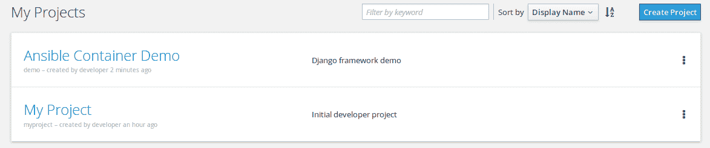
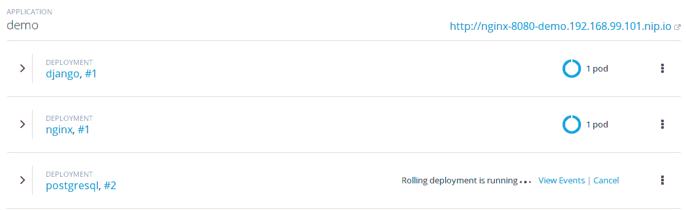
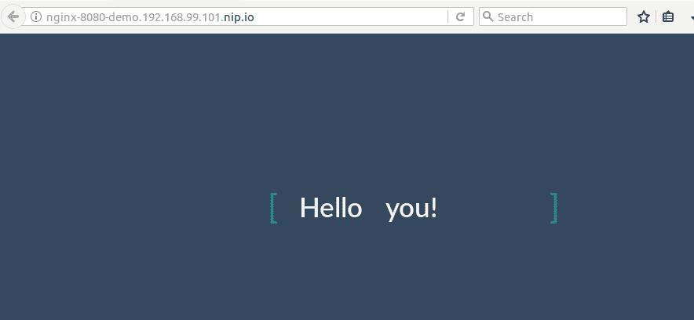
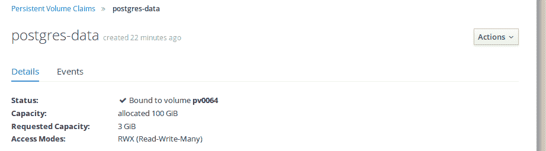

# 第八章：构建和部署多容器项目

到目前为止，在本书的过程中，我们已经探索了 Ansible 容器和容器化应用程序部署的多个方面。我们已经学习了如何从基本的 Dockerfile 构建 Docker 容器，使用 Ansible 容器安装角色、构建容器，甚至将应用程序部署到像 Kubernetes 和 OpenShift 这样的云解决方案中。然而，你可能已经注意到，我们到目前为止的讨论主要集中在部署单一微服务应用程序，例如 Apache2、Memcached、NGINX 和 MariaDB。这些应用程序可以独立部署，不依赖于除了基本 Docker 守护进程以外的其他服务或应用程序。虽然通过构建单容器微服务来学习容器化是学习容器化核心概念的好方法，但它并不能准确反映现实世界中的应用程序基础设施。

正如你可能已经知道的，应用程序通常由一堆互相连接的软件组成，它们共同工作，为最终用户提供服务。一个典型的应用程序栈可能涉及一个接收用户输入的 Web 前端。Web 界面可能需要知道如何联系数据库后端来存储用户提供的数据，并且能够检索之前存储的数据。大数据应用程序可能会定期分析数据库中的数据，试图找出数据趋势、分析使用情况或执行其他功能，帮助数据科学家了解用户如何使用应用程序。这些应用程序依赖于网络连接、DNS 解析和服务发现来进行相互通信并执行它们的整体功能。

容器的世界在最开始时并没有太大不同。毕竟，容器化的软件仍然依赖于其他容器化和非容器化的应用程序来存储、检索和处理数据，并执行不同的功能。正如我们在第五章《*使用 Kubernetes 扩展容器*》和第六章《*使用 OpenShift 管理容器*》中提到的那样，容器为部署和扩展多层次应用程序问题带来了更多的灵活性，并且显著降低了管理复杂性。

在本章中，我们将涵盖以下主题：

+   使用 Docker 网络定义复杂应用程序

+   探索 Ansible 容器 django-gulp-nginx 项目

+   构建 django-gulp-nginx 项目

+   开发和生产配置

+   将项目部署到 OpenShift

# 使用 Docker 网络定义复杂应用程序

容器化环境是动态的，容易快速改变状态。与传统基础设施不同，容器在不断地扩展和缩减，甚至可能在主机之间迁移。容器能够快速高效地发现其他容器、建立网络连接并共享资源至关重要。

如我们在前几章中提到的，Docker、Kubernetes 和 OpenShift 具有原生功能，可以使用各种网络协议和 DNS 解析自动发现并访问其他容器，这与裸机或虚拟化服务器并无太大不同。当在单个 Docker 主机上部署容器时，Docker 会为每个容器分配一个 IP 地址，该地址位于一个虚拟子网中，可以用于与同一子网中的其他容器 IP 地址进行通信。同样，Docker 还会提供简单的 DNS 解析，可以用来解析容器名称。当通过容器编排系统如 Kubernetes、OpenShift 或 Docker Swarm 在多个主机上扩展时，容器使用覆盖网络在主机之间建立网络连接，并像在同一主机上一样运行。正如我们在第五章《*使用 Kubernetes 扩展容器*》中看到的，Kubernetes 提供了一个复杂的内部 DNS 系统，可以根据更大的 Kubernetes DNS 域中的命名空间解析容器。关于容器网络的内容很多，因此本章将重点讨论 Docker 网络以实现服务发现。在本节中，我们将创建一个专用的 Docker 网络子网，并创建利用 DNS 建立与其他运行中容器的网络连接的容器。

为了演示 Docker 容器之间的基本网络连接性，我们将在 Vagrant 实验室主机的 Docker 环境中使用桥接网络驱动程序创建一个新的虚拟容器网络。桥接网络是最基本的容器网络类型之一，它仅限于单个 Docker 主机。我们可以使用 `docker network create` 命令创建此网络。在本例中，我们将使用 `172.100.0.0/16` CIDR 块和 `bridge` 网络驱动程序创建一个名为 `SkyNet` 的网络：

```
ubuntu@node01:~$ docker network create -d bridge --subnet 172.100.0.0/16 SkyNet

2679e6a7009912fbe5b8203c83011f5b3f3a5fa7c154deebb4a9aac7af80a6aa
```

我们可以使用 `docker network ls` 命令验证该网络是否已成功创建：

```
ubuntu@node01:~$ docker network ls
NETWORK ID          NAME                DRIVER              SCOPE
2679e6a70099        SkyNet              bridge              local
truncated..
```

我们可以使用 `docker network inspect` 命令，以 JSON 格式查看关于此网络的详细信息：

```
ubuntu@node01:~$ docker network inspect SkyNet
[
    {
        "Name": "SkyNet",
        "Id": "2679e6a7009912fbe5b8203c83011f5b3f3a5fa7c154deebb4a9aac7af80a6aa",
        "Created": "2017-11-05T02:26:22.790958921Z",
        "Scope": "local",
        "Driver": "bridge",
        "EnableIPv6": false,
        "IPAM": {
            "Driver": "default",
            "Options": {},
            "Config": [
                {
                    "Subnet": "172.100.0.0/16"
                }
            ]
        },
```

现在我们已经在 Docker 主机上建立了一个网络，我们可以创建容器连接到此网络以测试其功能。让我们创建两个 Alpine Linux 容器，连接到该网络，并用它们测试 DNS 解析和可达性。Alpine Linux Docker 镜像是一个极其轻量的容器镜像，可用于快速启动容器进行测试。在此示例中，我们将创建两个名为`service1`和`service2`的 Alpine Linux 容器，并使用`--network`标志将它们连接到 SkyNet Docker 网络：

```
ubuntu@node01:~$ docker run --network=SkyNet -itd --name=service1 alpine
Unable to find image 'alpine:latest' locally
latest: Pulling from library/alpine
b56ae66c2937: Pull complete
Digest: sha256:d6bfc3baf615dc9618209a8d607ba2a8103d9c8a405b3bd8741d88b4bef36478
Status: Downloaded newer image for alpine:latest
5f1fba3964fae85e90cc1b3854fc443de0b479f94af68c14d9d666999962e25a 
```

以类似的方式，我们可以启动`service2`容器，使用`SkyNet`网络：

```
ubuntu@node01:~$ docker run --network=SkyNet -itd --name=service2 alpine
8f6ad6b88b52e446cee44df44d8eaa65a9fe0d76a2aecb156fac704c71b34e27
```

尽管这些容器没有运行服务，但它们通过使用`-t`标志分配一个伪终端（pseudo-tty）实例给它们，从而使容器能够运行。分配伪终端给容器将防止容器立即退出，但如果终端会话终止，容器将退出。在本书中，我们探讨了通过命令和入口点参数来运行容器，这是推荐的方法。通过分配伪终端来运行容器非常适合快速启动容器进行测试，但这并不是运行传统应用容器的推荐方式。应用容器应该始终根据其中运行的**进程 ID**（**PID**）的状态来运行。

在第一个示例中，我们可以看到我们的本地 Docker 主机拉取了最新的 Alpine 容器镜像，并使用我们传递给`docker run`命令的参数运行它。同样，第二个`docker run`命令使用相同的参数创建了该容器镜像的第二个实例。使用`docker inspect`命令，我们可以查看 Docker 守护进程为我们的容器分配了哪些 IP 地址：

```
ubuntu@node01:~$ docker inspect service1
TRUNCATED..
"NetworkID": "2679e6a7009912fbe5b8203c83011f5b3f3a5fa7c154deebb4a9aac7af80a6aa",
"EndpointID": "47e16d352111007b9f19caf8c10a388e768cc20e5114a3b346d08c64f1934e1f",
"Gateway": "172.100.0.1",
"IPAddress": "172.100.0.2",
"IPPrefixLen": 16,
"IPv6Gateway": "",
"GlobalIPv6Address": "",
"GlobalIPv6PrefixLen": 0,
"MacAddress": "02:42:ac:64:00:02",
"DriverOpts": null
```

我们也可以对`service2`执行相同的操作：

```
ubuntu@node01:~$ docker inspect service2
TRUNCATED..
"NetworkID": "2679e6a7009912fbe5b8203c83011f5b3f3a5fa7c154deebb4a9aac7af80a6aa",
"EndpointID": "3ca5485aa27bd1baffa826b539f905b50005c9157d5a4b8ba0907d15a3ae7a21",
"Gateway": "172.100.0.1",
"IPAddress": "172.100.0.3",
"IPPrefixLen": 16,
"IPv6Gateway": "",
"GlobalIPv6Address": "",
"GlobalIPv6PrefixLen": 0,
"MacAddress": "02:42:ac:64:00:03",
"DriverOpts": null
```

如你所见，Docker 将 IP 地址`172.100.0.2`分配给了我们的`service1`容器，将 IP 地址`172.100.0.3`分配给了我们的`service2`容器。这些 IP 地址提供了正如你所期望的，在同一网络段上连接的两个主机之间的网络连接。如果我们使用`docker exec`登录到`service1`容器，我们可以检查`service1`是否能够通过 Docker 分配的 IP 地址 ping 通`service2`：

```
ubuntu@node01:~$ docker exec -it service1 /bin/sh
/ # ping 172.100.0.3
PING 172.100.0.3 (172.100.0.3): 56 data bytes
64 bytes from 172.100.0.3: seq=0 ttl=64 time=0.347 ms
64 bytes from 172.100.0.3: seq=1 ttl=64 time=0.160 ms
64 bytes from 172.100.0.3: seq=2 ttl=64 time=0.159 ms
```

由于这些容器是通过伪终端而不是命令或入口点运行的，只需在容器的 Shell 中键入`exit`即可终止 TTY 会话并停止容器。要在退出 Shell 时保持容器运行，请使用键盘上的 Docker 逃逸序列：*Ctrl* + *P* *Ctrl* + *Q*。

我们也可以从`service2`容器执行此测试：

```
ubuntu@node01:~$ docker exec -it service2 /bin/sh
/ # ping 172.100.0.2
PING 172.100.0.2 (172.100.0.2): 56 data bytes
64 bytes from 172.100.0.2: seq=0 ttl=64 time=0.175 ms
64 bytes from 172.100.0.2: seq=1 ttl=64 time=0.157 ms
```

很容易看出，基于 IP 的网络通信在建立运行中的容器之间的网络连接时效果良好。该方法的缺点是，我们不能总是提前知道容器运行环境会分配给容器的 IP 地址。例如，某个容器可能需要在配置文件中添加一个条目，以指向它所依赖的服务。虽然你可能会想直接将一个 IP 地址插入容器角色并进行构建，但每次在不同的环境中部署时，这个容器角色都必须重新构建。此外，当容器停止并重新启动时，它们可能会获得不同的 IP 地址，这将导致应用程序崩溃。幸运的是，作为解决这一问题的方案，Docker 提供了基于容器名称的 DNS 解析，这将主动跟踪运行中的容器，并在容器的 IP 地址发生变化时解析出正确的 IP 地址。与 IP 地址不同，容器名称可以提前知道，并且可以用于在配置文件中指向正确的服务，或作为环境变量存储在内存中。我们可以通过重新登录`service1`容器，并使用`ping`命令 ping `service2`的名称来看到这一点的实际应用：

```
ubuntu@node01:~$ docker exec -it service1 /bin/sh
/ # ping service2
PING service2 (172.100.0.3): 56 data bytes
64 bytes from 172.100.0.3: seq=0 ttl=64 time=0.233 ms
64 bytes from 172.100.0.3: seq=1 ttl=64 time=0.142 ms
64 bytes from 172.100.0.3: seq=2 ttl=64 time=0.184 ms
64 bytes from 172.100.0.3: seq=3 ttl=64 time=0.263 ms
```

此外，我们可以创建一个第三个服务容器，并检查新容器是否能够分别解析`service1`和`service2`的名称：

```
ubuntu@node01:~$ docker run --network=SkyNet -itd --name=service3 alpine
8db62ae30457c351474d909f0600db7f744fb339e06e3c9a29b87760ad6364ff 
ubuntu@node01:~$ docker exec -it service3 /bin/sh
/ # ping service1
PING service1 (172.100.0.2): 56 data bytes
64 bytes from 172.100.0.2: seq=0 ttl=64 time=0.207 ms
64 bytes from 172.100.0.2: seq=1 ttl=64 time=0.165 ms
64 bytes from 172.100.0.2: seq=2 ttl=64 time=0.159 ms
^C
--- service1 ping statistics ---
3 packets transmitted, 3 packets received, 0% packet loss
round-trip min/avg/max = 0.159/0.177/0.207 ms
/ #
/ # ping service2
PING service2 (172.100.0.3): 56 data bytes
64 bytes from 172.100.0.3: seq=0 ttl=64 time=0.224 ms
64 bytes from 172.100.0.3: seq=1 ttl=64 time=0.162 ms
64 bytes from 172.100.0.3: seq=2 ttl=64 time=0.146 ms
```

最后，如果我们登录到`service2`容器，我们可以使用`nslookup`命令解析新创建的`service3`容器的 IP 地址：

```
ubuntu@node01:~$ docker exec -it service2 /bin/sh
/ # nslookup service3

Name:      service3
Address 1: 172.100.0.4 service3.SkyNet
```

Docker 通过将 Docker 网络的名称作为域名来创建 DNS 解析。因此，`nslookup` 结果显示了 `service3` 的完全限定域名 `service3.SkyNet`。然而，正如你所想象的那样，为容器提供 DNS 解析是构建可靠且强大的容器化基础设施的一个非常强大的工具。仅仅通过知道容器的名称，你就可以在容器之间建立链接和依赖关系，这些关系会随着基础设施的扩展而扩展。这个概念远远超出了学习容器的单独 IP 地址。例如，正如我们在第五章《*Kubernetes 下的容器规模化*》和第六章《*使用 OpenShift 管理应用程序*》中所见，Kubernetes 和 OpenShift 允许创建与后端 Pod 使用标签或其他标识符进行逻辑连接的服务。当其他 Pod 向服务 DNS 条目传递流量时，Kubernetes 会根据服务条目中配置的标签规则负载均衡流量到与之匹配的正在运行的 Pod。依赖该服务的容器只需要知道如何解析服务的 FQDN，容器编排器会处理其余的部分。后端 Pod 可以扩展或缩减，但只要容器编排器的 DNS 服务能够解析服务条目，调用该服务的其他容器就不会察觉到任何变化。

# 探索 Ansible Container django-gulp-nginx 项目

现在我们已经对容器网络概念和 Docker DNS 解析有了基本的理解，接下来我们可以构建具有多容器依赖的项目。Ansible Container 提出了创建完全可重用的全栈容器化应用程序的概念，恰当地称为容器应用（Container Apps）。容器应用可以像容器启用角色一样，从 Ansible Galaxy 快速下载并部署。容器应用的好处在于，用户可以迅速开始开发，开发的对象是完全功能的多层应用，这些应用作为独立的微服务容器运行。在本例中，我们将使用一个社区开发的 web 应用项目，该项目启动一个基于 Python 的 Django、Gulp 和 NGINX 环境，我们可以将其部署到本地以及像 OpenShift 或 Kubernetes 这样的容器编排环境。

你可以通过访问 Ansible Galaxy 网站 [`galaxy.ansible.com`](https://galaxy.ansible.com/)，选择“浏览角色”（BROWSE ROLES），点击关键字下拉框中的“角色类型”（Role Type），并从搜索对话框中选择“容器应用”（Container App），来探索各种容器应用：



图 1：在 Ansible Galaxy 中搜索容器应用

在这个例子中，我们将利用预构建的 Ansible `django-gulp-nginx` 容器应用程序，这是一个官方的 Ansible 容器项目。这个容器应用程序创建了一个容器化的 Django 框架 Web 应用，使用 NGINX 作为 Web 服务器，Django 和 Gulp 作为框架，PostgreSQL 作为数据库服务器。这个项目是一个完全自包含的演示环境，我们可以利用它来探索 Ansible 容器如何与其他服务和依赖项一起工作。

为了开始使用这个项目，我们需要先在 Vagrant 实验室虚拟机上的一个干净目录中安装它。首先，创建一个新目录（我将它命名为 `demo`），然后运行 `ansible-container init` 命令，后跟我们想要安装的容器应用程序名称 `ansible.django-gulp-nginx`。你可以在 Ansible Galaxy 上找到该项目的完整名称，使用之前的步骤来搜索容器应用程序。以下代码演示了如何创建新目录并初始化 Django-Gulp-NGINX 项目：

```
ubuntu@node01:~$ mkdir demo/
ubuntu@node01:~$ cd demo/
ubuntu@node01:~$ ansible-container init ansible.django-gulp-nginx
Ansible Container initialized from Galaxy container app 'ansible.django-gulp-nginx'
```

在成功初始化项目后，你应该会看到来自 Galaxy 容器应用程序 `ansible.django-gulp-nginx` 的 Ansible 容器初始化信息。这表明容器应用程序已成功从 Ansible Galaxy 安装。执行 `ls` 命令查看 `demo/` 目录时，应该会显示类似如下的项目文件：

```
ubuntu@node01:~/demo$ ls
bower.json     dist         Makefile   meta.yml      package.json       project    requirements.txt  roles    src         test
AUTHORS             container.yml  gulpfile.js  manage.py  node_modules  package-lock.json  README.md  requirements.yml  scripts  temp-space  update-authors.py
```

列出的许多文件是配置文件，支持我们将要创建的 Gulp/Django 框架应用程序。我们在此次演示中关心的主要文件是所有 Ansible 容器项目中的核心文件：`container.yml`。如果你用文本编辑器打开 `container.yml` 文件，它应该类似如下内容：

```
version: '2'
settings:
  conductor:
    base: 'centos:7'
    volumes:
    - temp-space:/tmp   # Used to copy static content between containers
  k8s_namespace:
    name: demo
    display_name: Ansible Container Demo 
    description: Django framework demo 
defaults:
  POSTGRES_USER: django
  POSTGRES_PASSWORD: sesame
  POSTGRES_DB: django
  DJANGO_ROOT: /django
  DJANGO_USER: django
  DJANGO_PORT: 8080
  DJANGO_VENV: /venv
  NODE_USER: node
  NODE_HOME: /node
  NODE_ROOT: ''
  GULP_DEV_PORT: 8080
services:
  django:
    from: 'centos:7'
    roles:
    - role: django-gunicorn
    environment:
      DATABASE_URL: 'pgsql://{{ POSTGRES_USER }}:{{ POSTGRES_PASSWORD }}@postgresql:5432/{{ POSTGRES_DB }}'
      DJANGO_ROOT: '{{ DJANGO_ROOT }}'
      DJANGO_VENV: '{{ DJANGO_VENV }}'
    expose:
    - '{{ DJANGO_PORT }}'
    working_dir: '{{ DJANGO_ROOT }}'
    links:
    - postgresql
    user: '{{ DJANGO_USER }}'
    command: ['/usr/bin/dumb-init', '{{ DJANGO_VENV }}/bin/gunicorn', -w, '2', -b, '0.0.0.0:{{ DJANGO_PORT }}', 'project.wsgi:application']
    entrypoint: [/usr/bin/entrypoint.sh]
    dev_overrides:
      volumes:
      - '$PWD:{{ DJANGO_ROOT }}'
      command: [/usr/bin/dumb-init, '{{ DJANGO_VENV }}/bin/python', manage.py, runserver, '0.0.0.0:{{ DJANGO_PORT }}']
      depends_on:
      - postgresql

  gulp:
    from: 'centos:7'
    roles:
    - role: gulp-static 
    working_dir: '{{ NODE_HOME }}'
    command: ['/bin/false']
    environment:
      NODE_HOME: '{{ NODE_HOME }}'
    dev_overrides:
      entrypoint: [/entrypoint.sh]
      command: [/usr/bin/dumb-init, /usr/local/bin/gulp]
      ports:
      - '8080:{{ GULP_DEV_PORT }}'
      - 3001:3001
      links:
      - django
      volumes:
      - '$PWD:{{ NODE_HOME }}'
    openshift:
      state: absent

  nginx:
    from: 'centos:7'
    roles:
    - role: ansible.nginx-container
      ASSET_PATHS:
      - /tmp/dist
      PROXY: yes
      PROXY_PASS: 'http://django:8080'
      PROXY_LOCATION: "~* /(admin|api)"
    ports:
    - '{{ DJANGO_PORT }}:8000'
    links:
    - django
    dev_overrides:
      ports: []
      command: /bin/false

  postgresql:
    # Uses a pre-built postgresql image from Docker Hub 
    from: ansible/postgresql:latest
    environment:
    - 'POSTGRES_DB={{ POSTGRES_DB }}'
    - 'POSTGRES_USER={{ POSTGRES_USER }}'
    - 'POSTGRES_PASS={{ POSTGRES_PASSWORD }}'
    - 'PGDATA=/var/lib/pgsql/data/userdata'
    volumes:
    - postgres-data:/var/lib/pgsql/data
    expose:
    - 5432

volumes:
  postgres-data:
    docker: {}
    openshift:
      access_modes:
      - ReadWriteMany
      requested_storage: 3Gi 

  temp-space: 
    docker: {}
    openshift:
      state: absent

registries:
   local_openshift:
     url: https://local.openshift
     namespace: demo
     pull_from_url: 172.30.1.1:5000
```

这里显示的输出反映了在写作时 `container.yml` 文件的内容。如果自写作以来该项目有更新，可能会与这里显示的内容略有不同。

如你所见，这个 `container.yml` 文件包含了我们在本书前几章已经讨论过的许多相同规格。开箱即用，这个项目包含了构建 Gulp、Django、NGINX 和 Postgres 容器的服务声明，完整的角色路径和各种角色变量被定义以确保项目能够以完全自包含的方式运行。此项目还内建了对将项目部署到 OpenShift 的支持。这个项目的一个优点是，它几乎暴露了 Ansible 容器项目中可用的所有配置选项，以及激活这些功能所需的正确语法。就我个人而言，我喜欢将这个项目作为参考指南，以防我忘记在我的项目 `container.yml` 文件中使用的正确语法。以下是 `container.yml` 文件中一些对用户理解有帮助的部分，从顶部开始，逐渐往下查看：

+   `conductor`：正如我们在本书中所看到的，这一部分定义了指挥容器及其基础容器镜像的构建方式。在这种情况下，指挥容器镜像将是一个 CentOS 7 容器，它利用`root`目录下`temp-space`目录的卷挂载，将数据挂载到容器内的`/tmp`目录。值得注意的是，指挥容器镜像可以利用卷挂载来在构建过程中存储数据。

+   `defaults`：这一部分被称为顶级默认值部分，用于实例化可以在整个项目中使用的变量。在这里，您可以定义变量，这些变量可以用作项目中服务部分的角色变量重写，或者简单地代替在`container.yml`文件中反复硬编码的相同值。值得注意的是，在 Ansible Container 评估变量优先级的顺序中，顶级默认值部分的优先级最低。

+   `services`：在`services`部分，我们可以看到在此堆栈中运行的核心服务条目（`django`、`gulp`、`nginx`和`postgresql`）。大部分情况下，该部分应该根据我们之前章节所讲解的内容进行审核。然而，您会注意到，在`django`容器的定义中，有一行`link`，它指定了`postgresql`容器的名称。您在其他容器定义中也会注意到这一点，这些定义列出了`django`容器的名称。在 Docker 的早期版本中，`link`是用来为单独的容器建立网络连接和容器名称解析的方式。然而，Docker 的最新版本已废弃了`link`语法，转而使用内建的容器名称解析功能，结合 Docker 的网络堆栈。值得注意的是，尽管许多项目仍然使用`link`来建立网络依赖关系和容器名称解析，但它们很可能在未来的 Docker 版本中被移除。像 Kubernetes 和 OpenShift 这样的容器编排工具也会忽略`link`语法，因为它们仅使用本地 DNS 服务来解析其他容器和服务。在`services`部分，我还想特别提一下，`nginx`、`gulp`和`django`容器有一个新子部分，名为`dev-overrides`。该部分用于指定仅在本地构建测试容器时才会存在的容器配置。通常，开发人员使用`dev-overrides`来运行容器，开启详细的调试输出，或使用其他类似的日志机制来排查潜在的问题。当使用`--production`标志执行`ansible-container run`时，`dev-override`配置将被忽略。

+   `volumes`：顶级 volumes 部分用于指定 **持久卷声明**（**PVCs**），即使容器被停止或销毁，这些声明仍然存在。此部分通常会将已在 `container.yml` 文件中容器特定服务部分创建的卷映射到该部分，提供更详细的配置，以说明容器编排器应该如何处理持久卷声明。在此情况下，已在 PostgreSQL 容器中映射的 `postgres-data` 卷被赋予了 OpenShift 特定的 `ReadWriteMany` 访问模式，并且分配了 3 GB 的存储空间。PVC 通常用于依赖存储和检索数据的应用程序，例如数据库或存储 API。PVC 的整体目标是，如果需要重新部署、升级或将容器迁移到另一个主机时，我们不希望丢失数据。

# 构建 django-gulp-nginx 项目

现在我们已经对一些在容器应用程序中常见的更高级的 Ansible Container 语法有了深入了解，我们可以将目前学到的 Ansible Container 工作流知识应用于构建和运行容器应用程序。由于容器应用程序是完整的 Ansible Container 项目，包含角色、`container.yml` 文件和其他支持的项目数据，因此我们之前使用的相同的 Ansible Container 工作流命令也可以在这里无修改地使用。当你准备好时，请在项目的 `root` 目录下执行 `ansible-container build` 命令：

```
ubuntu@node01:~/demo$ ansible-container build
Building Docker Engine context...       
Starting Docker build of Ansible Container Conductor image (please be patient)...       
Parsing conductor CLI args.
Docker™ daemon integration engine loaded. Build starting. project=demo
Building service...     project=demo service=django

PLAY [django] ******************************************************************

TASK [Gathering Facts] *********************************************************
ok: [django]

TASK [django-gunicorn : Install dumb init] *************************************
changed: [django]

TASK [django-gunicorn : Install epel] ******************************************
changed: [django]

TASK [django-gunicorn : Install python deps] ***********************************
changed: [django] => (item=[u'postgresql-devel', u'python-devel', u'gcc', u'python-virtualenv', u'nc', u'rsync'])

TASK [django-gunicorn : Make Django user] **************************************
changed: [django]

TASK [django-gunicorn : Create /django] ****************************************
changed: [django]

TASK [django-gunicorn : Make virtualenv dir] ***********************************
changed: [django]

TASK [django-gunicorn : Setup virtualenv] **************************************
changed: [django]

TASK [django-gunicorn : Copy core source items] ********************************
changed: [django] => (item=manage.py)
changed: [django] => (item=package.json)
changed: [django] => (item=project)
changed: [django] => (item=requirements.txt)
changed: [django] => (item=requirements.yml)
TRUNCATED...
```

由于容器应用程序正在构建四个服务容器，因此构建过程可能比平常稍长一些。如果你在跟随操作，你会看到 Ansible Container 逐个处理每个 playbook 角色，创建容器并努力使其达到 playbooks 中描述的目标状态。当构建成功完成后，我们可以执行 `ansible-container run` 命令来启动容器并使我们的新网页服务上线：

```
ubuntu@node01:~/demo$ ansible-container run
Parsing conductor CLI args.
Engine integration loaded. Preparing run.       engine=Docker™ daemon
Verifying service image service=django
Verifying service image service=gulp
Verifying service image service=nginx

PLAY [Deploy demo] *************************************************************

TASK [docker_service] **********************************************************
changed: [localhost]

PLAY RECAP *********************************************************************
localhost                  : ok=1    changed=1    unreachable=0    failed=0

All services running.   playbook_rc=0
Conductor terminated. Cleaning up.      command_rc=0 conductor_id=3109066bdb82a46e0b44fdbbbeaaa02fe8daf7bc18600c0c8466e19346e57b39 save_container=False
```

当运行的 playbooks 执行完毕后，服务容器应当在开发者模式下运行在 Vagrant 虚拟机上，因为 `container.yml` 文件为许多服务指定了 `dev-overrides`。需要注意的是，`ansible-container run` 默认会根据 `container.yml` 文件中列出的任何 `dev-override` 配置来运行服务容器。例如，其中一个开发者重载配置是当处于开发者模式时不运行 NGINX 容器。这是通过为 NGINX 容器设置开发者重载选项实现的，使其执行 `/bin/false` 作为初始容器命令，立即将其终止。执行 `docker ps -a` 命令会显示 `postgresql`、`django` 和 `gulp` 容器正在运行，而 NGINX 容器处于停止状态。通过开发者重载，NGINX 被停止，而 `gulp` 负责提供 HTML 页面：

```
ubuntu@node01:~/demo$ docker ps -a
CONTAINER ID  IMAGE  COMMAND  CREATED  STATUS  PORTS  NAMES
c3e3c2e07427  demo-gulp:20171107030355     "/entrypoint.sh /u..."   56 seconds
0e14b6468ad4  demo-nginx:20171107031508    "/bin/false"             Exited (1)
987345cf6460  demo-django:20171107031311   "/usr/bin/en"            57 seconds ago9660b816e86f  ansible/postgresql:latest "/usr/bin/entrypoi..."   58 seconds 
```

一旦容器启动，`django-gulp-nginx` 容器应用程序将会在 Vagrant 实验室虚拟机的本地地址 `8080` 端口监听。我们可以使用 `curl` 命令来测试应用程序，确保我们能够得到该服务设计提供的默认 Hello World 简单 HTML 页面响应：

```
ubuntu@node01:~/demo$ curl http://localhost:8080
<!DOCTYPE html><html lang="en-US"><head><title></title><meta charset="UTF-8"><meta http-equiv="X-UA-Compatible" content="IE=edge"><meta name="viewport" content="width=device-width,initial-scale=1"><link rel="stylesheet" href="style.css"></head><body><div class="content"><div class="visible"><p>Hello</p><ul><li>world !</li><li>users !</li><li>you!</li><li>everybody !</li></ul></div></div><script src="img/bundle.min.js"></script></body></html>
```

# 开发与生产配置

默认情况下，在为某个服务指定了开发者覆盖配置的项目上执行 `ansible-container run` 命令时，服务会在开发者覆盖配置激活的状态下运行。通常，开发者覆盖配置会暴露应用程序的详细日志或调试选项，而这些选项一般不应让普通终端用户看到，更不用说在日志堆栈追踪始终运行的情况下，运行应用程序会消耗大量资源了。`ansible-container run` 命令可以使用 `--production` 标志来指定何时以模拟生产部署的模式运行服务。使用 `--production` 标志会忽略 `container.yml` 文件中的 `dev_overrides` 部分，按文件中明确指定的方式运行服务。现在我们已经验证了网页服务能够在开发模式下运行并正常工作，我们可以尝试在生产模式下运行该服务，以模拟在本地工作站上的完整生产部署。

首先，我们需要运行 `ansible-container stop` 以停止所有以开发模式运行的容器实例：

```
ubuntu@node01:~/demo$ ansible-container stop
Parsing conductor CLI args.
Engine integration loaded. Preparing to stop all containers.    engine=Docker™ daemon

PLAY [Deploy demo] *************************************************************

TASK [docker_service] **********************************************************
changed: [localhost]

PLAY RECAP *********************************************************************
localhost                  : ok=1    changed=1    unreachable=0    failed=0

All services stopped.   playbook_rc=0
Conductor terminated. Cleaning up.      command_rc=0 conductor_id=8ab40a594ec72012afdf0abc31ff527925fc5960e4ecbb40eeb16763a12e973a save_container=False
```

接下来，让我们重新运行 `ansible-container run` 命令，这次添加 `--production` 标志，表示我们希望忽略开发者的覆盖配置，并以生产模式运行该服务：

```
ubuntu@node01:~/demo$ ansible-container run --production
Parsing conductor CLI args.
Engine integration loaded. Preparing run.       engine=Docker™ daemon
Verifying service image service=django
Verifying service image service=gulp
Verifying service image service=nginx

PLAY [Deploy demo] *************************************************************

TASK [docker_service] **********************************************************
changed: [localhost]

PLAY RECAP *********************************************************************
localhost                  : ok=1    changed=1    unreachable=0    failed=0

All services running.   playbook_rc=0
Conductor terminated. Cleaning up.      command_rc=0 conductor_id=1916f63a843d490ec936672528e507332ef408363f65387256fe8a75a1ed7a2f save_container=False
```

如果现在查看正在运行的服务，你会注意到 NGINX 服务器容器现在正在运行，并作为网页流量的前端服务在 `8080` 端口上运行，而不再是 Gulp 容器。同时，Gulp 容器已经使用默认命令 `/bin/false` 启动，该命令会立即终止容器。在这个例子中，我们引入了一种生产配置，终止了开发环境中的 HTTP 网页服务器，转而使用一个适合生产的 NGINX 网页服务器：

```
ubuntu@node01:~/demo$ docker ps -a
CONTAINER ID  IMAGE  COMMAND  CREATED  STATUS  PORTS  NAMES
1aabc9745942  demo-nginx:20171107031508    "/usr/bin/dumb-ini..."   7 seconds ago
16154bbfae54  demo-django:20171107031311   "/usr/bin/entrypoi..."   14 seconds ago      
ea2ec92e9c50  demo-gulp:20171107030355     "/bin/false"             Exited (1) 15
9660b816e86f  ansible/postgresql:latest    "/usr/bin/entrypoi..."   20 minutes ago
```

我们可以再次测试网页服务，确保该服务可访问并在本地 Vagrant Lab 虚拟机的 `8080` 端口上运行：

```
ubuntu@node01:~/demo$ curl http://localhost:8080
<!DOCTYPE html><html lang="en-US"><head><title></title><meta charset="UTF-8"><meta http-equiv="X-UA-Compatible" content="IE=edge"><meta name="viewport" content="width=device-width,initial-scale=1"><link rel="stylesheet" href="style.css"></head><body><div class="content"><div class="visible"><p>Hello</p><ul><li>world !</li><li>users !</li><li>you!</li><li>everybody !</li></ul></div></div><script src="img/bundle.min.js"></script></body></html>
```

# 将项目部署到 OpenShift

到目前为止，我们已经学习了如何使用`dev_override`语法提供的生产和开发配置在本地运行演示 Web 应用程序。现在，我们已经了解了 Web 应用程序的功能以及如何利用其他服务，我们可以开始了解如何在生产级容器编排环境中部署该应用程序，例如 OpenShift 或 Kubernetes。在本书的这一部分，我们将使用生产配置将该项目部署到我们在第六章中创建的本地 Minishift 集群中，*使用 OpenShift 管理应用程序*。在开始此示例之前，请确保你有一个有效的 OpenShift 凭证文件，并且它可以与本地集群一起使用，文件位置在`/home/ubuntu/.kube/config`目录。如果需要创建新的 OpenShift 凭证，请务必返回第七章，*部署你的第一个项目*，以获取更多详细信息。

为了确保我们的应用程序可以部署到 OpenShift，我们需要修改容器应用程序的`container.yml`文件，使其指向我们的 Kubernetes 配置文件，并指向 Docker Hub 注册表以便推送我们的容器镜像。

OpenShift 自带一个集成的容器注册表，您可以在`ansible-container deploy`过程中用它来推送容器镜像。但是，它需要一些额外的配置，超出了本书的范围。现在，使用我们到目前为止在本书中使用的 Docker Hub 注册表就足够了。

在`container.yml`文件的`settings`部分，我们将添加一个`k8s_auth`段落，指向 OC 生成的 Kubernetes 配置文件：

```
 k8s_namespace:
   name: demo
   display_name: Ansible Container Demo
   description: Django framework demo
 k8s_auth:
   config_file: /home/ubuntu/.kube/config
```

接下来，在`registries`部分，我们将为 Docker Hub 容器注册表添加一项条目，使用我们的用户凭证：

```
registries:  
   docker:
     url: https://index.docker.io/v1/
     namespace: aric49
```

现在，我们已经在项目中配置了 OpenShift 和 Docker Hub，我们可以使用`ansible-container deploy`命令并加上`--engine openshift`标志，来生成 OpenShift 部署并将镜像文件推送到 Docker Hub。为了区分这些镜像，我们可以使用`containerapp`标签将它们推送到 Docker Hub。由于我们需要推送多个镜像到 Docker Hub，具体时间取决于你的网络连接速度，这个过程可能需要几分钟才能完成：

```
ubuntu@node01:~/demo$ ansible-container --engine openshift deploy --push-to docker --username aric49 --tag containerapp
Enter password for aric49 at Docker Hub: 
Parsing conductor CLI args.
Engine integration loaded. Preparing push.      engine=OpenShift™
Tagging aric49/demo-django
Pushing aric49/demo-django:containerapp...
The push refers to a repository [docker.io/aric49/demo-django]
Preparing
Pushing
Mounted from library/centos
Pushing
Pushed
containerapp: digest: sha256:983afc3cb7c0f393d20047d0a1aa75a94a9ab30a2f3503147c09b55a81e007a9 size: 741
Tagging aric49/demo-gulp
Pushing aric49/demo-gulp:containerapp...
The push refers to a repository [docker.io/aric49/demo-gul
TRUNCATED...
```

一旦部署过程成功完成，我们可以使用`ansible-container run`命令并加上`--engine openshift`标志，来启动我们的应用程序并在模拟的 OpenShift 生产环境中运行它。别忘了指定`--production`标志，这样我们的服务将使用生产配置而不是开发者覆盖配置进行部署：

```
ubuntu@node01:~/demo$ ansible-container --engine openshift run --production
Parsing conductor CLI args.
Engine integration loaded. Preparing run.       engine=OpenShift™
Verifying service image service=django
Verifying service image service=gulp
Verifying service image service=nginx

PLAY [Manage the lifecycle of demo on OpenShift?] ******************************

TASK [Create project demo] *****************************************************
changed: [localhost]

TASK [Create service] **********************************************************
changed: [localhost]

TASK [Create service] **********************************************************
changed: [localhost]

TASK [Create service] **********************************************************
changed: [localhost]

TASK [Remove service] **********************************************************
ok: [localhost]

TASK [Create deployment, and scale replicas up] ********************************
changed: [localhost]

TASK [Create deployment, and scale replicas up] ********************************
changed: [localhost]
TRUNCATED..
```

一旦该过程成功完成，我们可以登录到 OpenShift Web 控制台，验证服务是否按预期运行。除非有其他更改，否则容器应用程序已部署到名为 `demo` 的新项目中，但在 Web 界面中将显示为 `Ansible Container Demo`，这与我们的 `container.yml` 配置一致：



图 2：部署到 OpenShift 的 Ansible Container Demo 项目

点击 Ansible Container Demo 项目的显示名称，将显示标准的 OpenShift 仪表盘，演示根据生产配置运行的 Pods。你应该能看到运行中的 `django`、`ngnix` 和 `postgresql` Pods，并且可以在控制台显示的右上角看到访问 Web 应用程序的路由链接：



图 3：演示项目中的运行中的 Pod

我们可以通过点击在 OpenShift 中创建的 `nip.io` 路由来测试应用程序是否正在运行，并确保 NGINX Web 服务器容器是可以访问的。点击该链接应该会显示完整的简单 `Hello you!` Django 应用程序：



图 4：在 OpenShift 中运行的 Hello World 页面

这看起来比我们在本地 Vagrant 实验室中进行的 `curl` 测试要好看多了，不是吗？恭喜你，你已经成功将一个多容器应用程序部署到模拟的生产环境中！

从 OpenShift 控制台中，我们可以验证部署的各个方面是否已存在并按预期功能运行。例如，你可以点击左侧导航栏中的 `Storage` 链接，验证在 OpenShift 中是否已创建并功能正常的 PVC Postgres 数据。点击 postgres-data 会显示 PVC 对象的详细信息，包括分配的存储（3 GiB）以及在 `container.yml` 文件中配置的访问模式，`Read-Write-Many`：



图 5：PostgreSQL PVC

# 参考文献

+   **Ansible django-gulp-nginx 项目**： [`github.com/ansible/django-gulp-nginx/`](https://github.com/ansible/django-gulp-nginx/)

+   **Docker 网络文档**： [`docs.docker.com/engine/userguide/networking/`](https://docs.docker.com/engine/userguide/networking/)

# 总结

随着我们即将结束与 Ansible Container 的旅程，我们已经覆盖了在学习使用 Ansible Container 项目自动化容器的过程中，可能是最后一个难关：处理多容器项目。由于几乎所有容器运行时环境（如 Docker、Kubernetes 和 OpenShift）都具备固有的网络功能，因此构建简化的微服务软件栈变得轻而易举。正如本章所示，微服务容器可以像拼积木一样高效地连接在一起，从而在生产环境中构建和部署强大的应用程序。

在这一部分中，我们探讨了容器运行时环境如何通过容器网络架构建立对其他容器的依赖关系，以及如何创建链接依赖。我们观察了这些概念如何协同工作，通过 Gulp、Django、NGINX 和 Postgres 容器构建一个相当复杂的多容器应用程序。我们在开发模式下使用`dev_overrides`进行了测试，并根据项目配置在生产模式下进行测试。最后，我们将该应用程序部署到本地 OpenShift 集群中，以模拟真实世界的生产部署，完整地包含容器网络和持久化卷声明。

本书的最后一章将介绍你如何扩展对 Ansible Container 的知识，并提供一些关于如何在 Ansible Container 知识上继续深入的实用技巧，帮助你将迄今为止在本书中获得的知识付诸实践。
