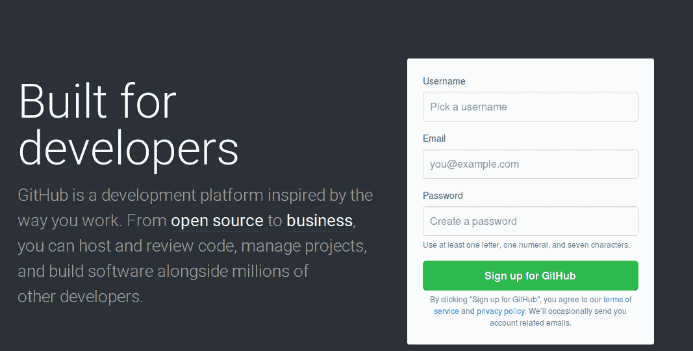
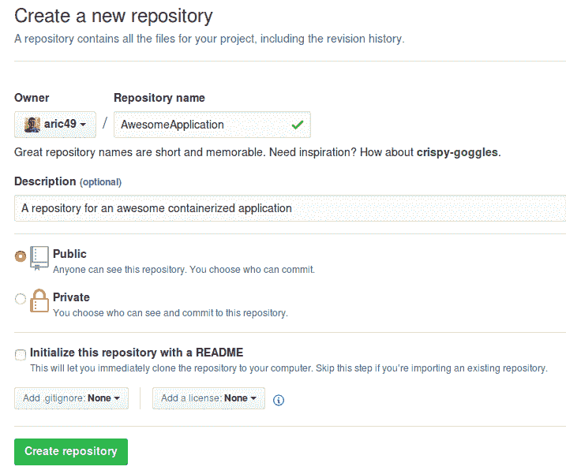

# 第九章：深入探索 Ansible Container

在本书的引言章节中，我们了解了信息技术（IT）行业的趋势如何发生根本性的变化，并塑造了应用程序和服务的设计与部署方式。随着高 CPU 和带宽密集型服务的消费需求上升，消费者经常要求更多功能，容忍不了故障，并且希望有更多选项来消费服务和应用程序。为了应对这种变化，单体应用程序部署和静态服务器不再能作为这一老化基础设施的支柱。即便是配置管理和自动化工具，尽管它们非常动态，也无法满足组织在各种平台上不断扩展现有基础设施的需求。

为应对这一趋势，像 Docker 这样的容器化平台迎接挑战，解决了需要一致且可靠地部署和管理应用程序的问题。Docker 容器使得企业和组织能够采用模块化的基础设施，使得应用程序可以完全自包含地构建，并保证能够在任何使用兼容容器运行时环境的系统上运行。这使得软件开发人员和 DevOps 工程师能够快速构建微服务应用程序，类似于许多方面的乐高积木，可以将它们组合在一起设计出大型且复杂的软件堆栈。

虽然微服务应用程序似乎解决了许多当今行业中的问题，但构建和部署微服务应用程序的传统方法正证明不足以满足需求，并且使这些服务的运营人员在真正构建和配置满足组织需求的容器镜像时面临更少的选择。Ansible Container 项目旨在填补传统配置管理与容器构建和部署流水线之间的空白。正如我们在本书中所看到的，Ansible Container 不仅可以利用 Ansible 的强大功能来构建真正定制的容器镜像，还可以管理容器化软件的生命周期，从开发一直到生产。

在本书的最后一章，我想为读者提供一些资源，帮助他们在使用 Ansible Container 构建和部署容器化项目时，走得更远，超越本书的范围。尽管我们已经涵盖了使用和操作 Ansible Container 的所有功能方面，微服务架构是一个快速发展的领域，它不断随着开源社区的变化和发展而变化。本章旨在为读者指引一些有用的方向，作为扩展容器化软件知识的起点，提供管理大规模容器的有用提示，并运用你新获得的知识，帮助推动围绕这些项目的开源社区的发展。

在本章的最后，我们将涵盖以下主题：

+   编写角色和容器应用的技巧

+   使用 Ansible Container 构建强大的部署 playbook

+   排除应用容器故障的技巧

+   使用 Jenkins 或 Travis CI 进行 CICD 部署

+   在 GitHub 和 Ansible Galaxy 上共享角色和应用

+   容器化一切

# 编写角色和容器应用的技巧

如果你是第一次接触 Ansible 和 playbook 语法，在编写 playbook 时很容易感到困惑。尽管 Ansible 本身是一种非常易读且对非程序员友好的语言，但在编写角色或容器应用时，仍有一些*陷阱*需要记住，以便最大限度地提高可用性。

# 使用完整的 YAML 语法

当我在使用 Ansible 代码时，一个个人的恼怒点是作者使用我所称之为*简化方法*来编写 playbook。实际上，功能性的 Ansible 代码可以通过将模块调用和属性写在同一行上，使用等号（`=`）来分隔属性和值，就像下面的代码所示。

**简化方法示例代码**：

```
- name: Deploy configuration file
  template: src=ConfigFile.j2 dest=/etc/myApp/myConfig.yml mode=0644

- name: Install Package
  apt: name=myApp state=present update_cache=true
```

**正确的 YAML 语法示例代码**：

```
- name: Deploy configuration file
  template:
    src: ConfigFile.j2
    dest: /etc/myApp/myConfig.j2
    mode: 0644

- name: Install Package
  apt:
    name: myApp
    state: present
    update_cache: true
```

如你所见，简化方法和正确的 YAML 语法在功能上是相同的，但它们在视觉上有所不同。使用正确的 YAML 语法会将模块调用分布在多行上，并要求用户将模块属性缩进到模块调用的定义下方。这使得 playbook 更容易一眼看懂，也更容易在查找错误时进行调试。使用正确的 YAML 语法还能确保你的文本编辑器可以对代码进行正确的语法高亮显示，因为它符合标准的 YAML 规范。然而，使用简化方法虽然可以*更快速*地编写 Ansible 代码，但却牺牲了可读性和可用性，尤其是对于未来可能使用你 playbook 的其他人而言。这不仅在视觉上不吸引人，而且使得阅读代码和理解功能变得困难。最佳实践是养成使用完整的 YAML 语法和缩进来编写 Ansible playbook 和角色的习惯。其他使用你代码并为其贡献的人会感谢你。

# 使用 Ansible 模块

在刚开始编写 Ansible playbook 和角色时，人们很容易对几乎所有任务都使用 `shell` 或 `command` 模块。如果你对 BASH 以及大多数 Linux 操作系统中原生提供的 GNU/Linux 工具和实用程序有扎实的理解，那么使用 shell 或 command 模块来构建 playbook 是合乎逻辑的。但这种方法的问题在于，它忽视了 Ansible 自带的超过千个独特模块。

虽然`shell`和`command`在某些情况下确实有其作用，但你应该首先检查是否有 Ansible 模块可以编程地完成你想要实现的目标。使用 Ansible 模块而不是直接在 shell 上运行命令的好处在于，Ansible 模块具有评估幂等性的能力，并且只有在目标不处于所需状态时才会采取行动。虽然使用命令行模块也能实现幂等性，但这要难得多。此外，Ansible 模块具有独特的能力，可以在内存中存储和检索任务的元数据。例如，你可以在任务定义中添加 `register` 行，将任务元数据存储到名为 `task_output` 的变量中。在 playbook 中，你可以通过检查 `task_output.changed == true` 来查看该任务是否对系统进行了更改，并据此采取相应的行动。同样，这一逻辑也可以用于检查任务的返回代码、搜索元数据或在任务失败时采取行动。使用模块使你能够自由地利用 Ansible 按照你想要的方式工作。

# 使用 Ansible Core 构建强大的部署 playbook

正如我们在本章中所看到的，Ansible Core 本质上是在部署执行过程中后台工作的引擎。我们查看了如何从 `ansible-deployment` 目录中提取这些 playbook 并手动运行它们，传入相应的标签手动执行运行、停止、重启和销毁功能。然而，这些 playbook 一般都是有限的，形式和功能都很基础。不要以为在部署项目时，你只能局限于运行 `ansible-container deploy` 命令，或者手动执行部署 playbook。如果你查看自动生成的部署 playbook，你会注意到它们调用了 `docker_service` 模块，这是 Ansible Core 中的一个模块。使用类似的方法，你可以编写自己的 playbook 来构建完全自定义的部署，超出 Ansible Container 的范围。

一个很好的使用案例可能是你有其他服务，这些服务依赖于你使用 Ansible Container 构建的容器化项目的状态。这些服务可以是监控服务、数据库集群，甚至是你希望在启动过程中让容器拉取数据的外部基础设施 API。通过使用单独的 Ansible Core playbook，你可以完全控制启动容器并与依赖服务交互的过程。这里有一个示例代码片段，帮助你获得一些灵感。请注意，我们将项目名称定义为一个变量，并将其传递到 REST API 调用中，以注册服务：

```
- name:Deploy New Service
  hosts: localhost
  connection: local
  gather_facts: no
  vars:
    ProjectName: "MyAwesomeApp"

  tasks:

    #Start the Container Service using the variable defined above
    - docker_service:
        project_name:"{{ ProjectName }}"
        definition:
            App:
              image: MyContainer:tag
              command: /usr/bin/dumb-init AwesomeApp
      register: ServiceStarted

#Register the service only when the container is updated (changed)
- name: Register Service in API
  uri:
    url: https://your.service.example.com/api/v2/
    method: POST
    body: "service: {{ ProjectName }}, state: deployed"
    body_format: yaml
  when: ServiceStarted.changed
```

如你所见，使用 Ansible Core playbooks 部署容器化基础设施是一个非常强大的工具。当使用 Ansible Core playbook 模块来抽象化你的部署时，你的想象力将是唯一的限制。

# 故障排除应用容器

在构建容器化服务和应用程序的过程中，您不可避免地会遇到需要排查异常容器的情况。有时，容器由于配置错误的 `container start` 命令或入口点而无法启动。其他时候，容器本身会开始抛出错误，需进行调试或诊断。大多数情况下，可以通过查看容器日志或在 OpenShift、Docker 或 Kubernetes 中查看容器运行时详细信息来排查这些问题。以下是我多年来在不同容器化运行时环境中找到的最有帮助的命令列表：

+   **Docker**：

    +   `docker logs`：使用 `docker logs` 命令查看任何已停止、正在运行或退出的容器的标准输出日志。通常情况下，当容器停止时，它们最后一条记录的标准输出消息会确认容器停止的原因。Docker 日志也有助于实时调试容器中的错误。此命令的完整语法是 `docker logs [容器名称或 ID]`。

    +   `docker inspect`：此命令可用于查看几乎所有 Docker 资源的所有属性和配置细节，如容器、网络或存储卷，以 JSON 格式显示。`inspect` 命令对于理解 Docker 如何查看相应的资源以及它是否获取了某些配置参数非常有用。`inspect` 的完整语法是 `docker inspect [docker 资源名称或 ID]`。

+   **Kubernetes**：

    +   `kubectl logs`：`kubectl logs` 用于查看 Kubernetes 中运行的 Pod 的日志。如果 Kubernetes 使用 Docker 作为底层容器运行时环境，则 `kubectl logs` 输出通常与 `docker logs` 输出类似。然而，使用 Kubernetes 原生转发日志输出可以让用户通过 Kubernetes 原生抽象检索日志，这可能有助于指示问题所在。结合查看容器运行时日志和 Kubernetes 日志也是非常有帮助的。`kubectl logs` 的完整语法是 `kubectl logs [完整 Pod 名称] --namespace [命名空间名称]`。

    +   `kubectl describe`：`describe` 用于查看几乎任何 Kubernetes 资源的详细输出和配置参数。可以在集群节点、Pod、命名空间、副本集和服务等资源上使用。使用 `describe`，可以查看资源标签、事件消息以及其他配置选项。`kubectl describe` 的主要好处是能够描述几乎任何集群资源，帮助排查问题，无论是集群节点还是行为异常的 Pod。`describe` 的完整语法是 `kubectl describe [资源类型] [资源名称] --namespace [命名空间名称（如适用）]`。

+   **OpenShift**:

    +   `oc logs`：`oc logs` 与 `kubectl logs` 和 `docker logs` 非常相似，它允许用户查看特定运行或重启中的 Pod 的日志。与 Kubernetes 类似，比较 `oc logs` 的输出和 `docker logs` 的输出通常非常有助于定位问题的根源。`oc logs` 的完整语法是 `oc logs [pod 或资源名称]`。

    +   `oc debug`：`debug` 用于创建问题 Pod 或部署的精确副本，以便在不干扰运行服务的情况下进行检查。使用 `debug`，可以向复制的 Pod 中传入命令，进行调试操作，如打开 shell 或转储环境变量。`debug` 的完整语法是 `oc debug [pod、deployment 或资源名称] -- [要执行的命令]`。

# 使用 Jenkins 或 TravisCI 创建构建流水线

近年来，**持续集成持续部署**（**CICD**）的概念已经在软件开发社区掀起了热潮。像 Jenkins、TeamCity 和 TravisCI 这样的丰富项目为开发人员提供了自动化框架，代码更改可以自动构建、测试，并在通过后部署到基础设施上。通过使用 CICD 工具，采用敏捷等快速软件开发方法的开发人员可以比以往更快、更可靠地部署软件。

大多数 CICD 工具和工作流通过定义具有特定触发条件的任务来运行。这些触发条件可以是 Git 仓库中的代码提交、用户手动启动构建，或是直接调用 CICD API 的自动化过程。这些任务执行非常具体和自动化的功能，如构建代码、对新构建的代码进行测试，甚至处理代码变更的部署。CICD 任务甚至可以在构建、测试或部署步骤失败时向聊天室或电子邮件发送通知。有些甚至足够智能，能够通知提交代码的用户，如果某个特定的变更导致了构建失败。CICD 的主要好处在于它为软件开发人员提供的自动化，确保这些任务能够可靠、一致和定期地执行。

想象一下，CICD 工具为 Ansible 容器项目带来的巨大好处：

+   在检查代码到某个 Git 仓库分支时自动执行 `ansible-container build`

+   在 CICD 主机上执行 `ansible-container run`，以在本地启动容器并触发烟雾测试，以确保容器按预期运行

+   如果构建和测试步骤通过，可以在镜像上执行 `ansible-container push`，它会用特定的构建号标记这些镜像，并将它们推送到容器镜像注册中心，如 Docker Hub

+   自动触发 `ansible-container deploy` 和 `ansible-container run`，将项目部署到特定环境（甚至是生产环境！）

使用自动化的 CICD 工具，你可以朝着完全自动化的构建和部署流水线迈进，这个过程完全不需要人工干预。如果你对 CICD 工具如何帮助你和你的工作流程感到好奇，我建议你注册一个免费的 Travis CI 账户：[`travisci.org`](https://travisci.org)。如果你对一个完全免费的开源解决方案，用于在自己的基础设施中部署，我推荐 Jenkins：[`jenkins.io`](https://jenkins.io)。

此外，你可以查看 Travis CI 构建流水线，这些流水线构建了我们在本书中涉及的一些 Ansible 容器项目。例如，你可以在这里找到 `django-gulp-nginx` 项目：[`travis-ci.org/ansible/django-gulp-nginx`](https://travis-ci.org/ansible/django-gulp-nginx)。

# 在 GitHub 和 Ansible Galaxy 上共享角色和应用程序

Ansible Galaxy 是一个绝对棒的资源，可以用来复用社区开发的最佳 playbooks 和角色。如我们在本书中所见，Ansible Galaxy 主持了数百个 Ansible 核心角色、容器角色和容器应用。这些项目是由社区开发并分享的，得益于组成庞大 Ansible 生态系统的那些杰出且聪明的人的友好与无私的精神。然而，分享 Ansible 角色到 Galaxy 并不仅仅是为了一些 Ansible 老手准备的。任何人都可以在 [`galaxy.ansible.com`](https://galaxy.ansible.com) 注册一个账户，并分享已经托管在 GitHub 仓库中的项目。在我与 Ansible 社区合作的经验中，如果你开发了一个非常酷的角色或应用，能够解决某个问题，几乎可以保证会有其他人也在为解决相同的问题而挣扎。通过将你的代码贡献到 Ansible Galaxy，你不仅是在帮助他人，还在为他人帮助你打开大门。很多时候，别人会直接为你的代码贡献，或通过留下反馈，提出改进或修复的意见和建议。新的、更好的版本也可以由社区成员贡献，并被重新使用，从而让你的生活更加轻松。这正是我如此喜爱开源软件的原因之一：我们作为一个社区，可以实现那些通常很难单独完成的目标。

至少，你应该将代码提交到 GitHub 仓库中，以便分享你的项目，并让其他用户在未来能够访问到你的代码。GitHub 仓库也有助于你对项目进行版本控制和跟踪变更。要使用 GitHub，可以在 [`github.com`](https://github.com) 注册一个账户：



图 1：github.com 首页

在 [`github.com/`](https://github.com/) 首页，你可以通过提供用户名、密码和有效的电子邮件地址来注册一个免费账户。创建账户并首次登录后，你可以通过点击屏幕右上角的 `+`（加号）下拉菜单，选择“新建仓库”来创建一个 GitHub 仓库。这将引导你进入一个表单页面，在这里你可以提供有关新项目的详细信息：



图 2：创建一个新的 GitHub 仓库

一旦新的 GitHub 仓库创建完成，你可以使用 SSH 或 HTTPS 链接克隆该仓库并开始贡献代码。每个 GitHub 仓库都有一个唯一的公共 URL，可以用来分享该仓库的链接。这个链接是将你的代码分享至 Ansible Galaxy 所必需的：


图 3：克隆一个空的 Git 仓库

以下示例演示了一个典型的 Git 工作流程：克隆存储库，创建初始文件，并将它们提交到存储库中。

```
aric@local:$ git clone https://github.com/aric49/AwesomeApplication.git
Cloning into 'AwesomeApplication'...
warning: You appear to have cloned an empty repository.

aric@local:$ git status
fatal: Not a git repository (or any of the parent directories): .git
aric@local:$ cd AwesomeApplication/
aric@local:AwesomeApplication$ touch file.txt
aric@local:AwesomeApplication$ git status
On branch master

Initial commit

Untracked files:
 (use "git add <file>..." to include in what will be committed)

 file.txt

nothing added to commit but untracked files present (use "git add" to track)

aric@local:AwesomeApplication$ git add file.txt
 aric@local:AwesomeApplication$ git commit -m "Adding code to my git repo"
[master (root-commit) 8bfd103] Adding code to my git repo
 1 file changed, 0 insertions(+), 0 deletions(-)
 create mode 100644 file.txt

```

有关 Ansible Galaxy 和在线共享角色或应用程序的更多信息，请阅读位于 [`galaxy.ansible.com/intro`](https://galaxy.ansible.com/intro) 的 Ansible Galaxy 文档。

# 容器化一切！

在您迈向完全模块化的容器化基础设施的旅程中，这是一个令人兴奋的过程。我相信，当您逐步学习本书中包含的示例时，无疑会感染上容器热情。希望您已经看到了容器的强大之处，特别是在诸如 Kubernetes 和 OpenShift 等容器编排解决方案中运行时。在我们的旅程结束之前，我给您的最后建议是坚持下去！现在您已经完全理解了整个 Ansible 容器工作流程，请继续构建项目并尽可能容器化。在过去几年中，如果 DevOps 和基础设施领域有什么可以证明的，那就是容器是我们所知软件的未来。随着越来越多的企业和组织采用容器化解决方案，对具有构建和部署容器的坚实理解的合格开发人员的需求也在不断增长。

我个人的经验法则是尽可能频繁地和尽可能多地进行容器化。为我正在开发的应用程序创建可重用的 Docker 容器使我能够在需要的时候快速构建、销毁、部署和重新部署整个项目。使用 Ansible Container 允许我作为一名 DevOps 工程师构建能够与我的基础设施说同一种语言的容器：Ansible。使用 Ansible，当我在进行基础设施自动化和构建容器化项目时，我不再需要在脑海中切换模式。我能够像开发任何其他 Ansible 项目一样快速开发容器。这让我非常有动力和动力，以适应以前编写的 Ansible 角色来构建和部署可以在任何容器化环境中运行的 Ansible 容器。随后，这也让我思考我目前正在进行的项目以及如何最好地调整我的自动化策略以适应容器化环境。

观察目前的一些项目，例如 CoreOS 的 Container Linux ([`coreos.com/why/`](https://coreos.com/why/)) 和其他完全容器化的操作系统平台，可以明显看出，所有的东西，甚至整个操作系统，最终都会容器化。现在就开始吧！通过容器化你正在处理的所有内容，你将使工作更加高效、可重复，并且可以在本地进行测试。不仅如此，你还在确保你的平台、应用程序和基础设施是面向未来的。即使你的团队目前还没有考虑容器化，你也应该考虑。云基础设施和容器化的世界发展迅速，如果不拥抱真正的模块化软件开发方法论，你肯定会被抛在后头。

# 参考文献

+   **Travis CI**: [`travis-ci.org/`](https://travis-ci.org/)

+   **Jenkins**: [`jenkins.io/`](https://jenkins.io/)

+   **Ansible Container Freenode IRC**: [`docs.ansible.com/ansible-container/`](http://docs.ansible.com/ansible-container/)

+   **Container Linux**: [`coreos.com/why/`](https://coreos.com/why/)

# 总结

当我大约两年前开始使用 Docker 容器时，最初我认为构建和管理容器是一项非常麻烦的工作，因为我可以通过编写 Ansible playbooks 快速高效地完成相同的事情。最终，我掌握了 Dockerfile 语法，并开始真正理解将应用程序部署到容器中有多么强大。最终让我彻底信服容器的强大，是当我使用 Kolla 项目构建了一个完整的 OpenStack 云时 ([`docs.openstack.org/kolla/latest/`](https://docs.openstack.org/kolla/latest/))。Kolla 项目旨在通过使用 Ansible Playbooks 在 Docker 容器中部署 OpenStack 服务，从而部署一个完整的 OpenStack 云解决方案。使用 Kolla，我可以在大约 30 分钟内部署一个完整的多节点 OpenStack 集群。作为曾经使用 Chef 和 Ansible 自动化各种 OpenStack 组件的背景下，我完全惊讶于这个速度和简便性。

大约一年前，我开始关注 Ansible Container 项目，作为我当时从事 Docker、OpenStack 和 Kubernetes 工作的补充。当时，我认为 Ansible Container 是我所需的拼图缺失部分，它可以让我将 Ansible 作为一个完整的端到端开发和部署解决方案来处理我的容器工作。到目前为止，这一旅程绝对令人惊叹。在社区的支持下，我在过去一年多的时间里，个人和职业上都使用 Ansible Container 自动化和部署了许多项目。作为一名 DevOps 工程师，Ansible Container 给我的灵活性远远超过了构建标准 Dockerfiles，让我惊叹不已。

我希望你能带着热情完成这本书的阅读，无论你从事哪个行业或领域，都能继续推动你的工作和职业发展。开源软件让我惊叹不已的一点是，来自各个行业、各种背景的人都在积极采用这些技术。我希望，当你在使用 Ansible Container 逐步深入时，能时刻关注未来并保持敏锐的洞察力。随着越来越多的人采纳这些技术，越来越聪明的人会继续为这些平台贡献新功能，使它们变得更加完善。感谢你抽出时间阅读本书。同时，我也要感谢那些撰写 Ansible Container 的了不起的团队成员：Chris Houseknecht（`@chouseknecht`）和 Joshua Ginsberg（`@j00bar`），他们在很多示例中给予了我极大的支持，修复了 bug，并为这个显然充满激情的项目提供了出色的支持。如果本书对你有帮助，请在 Twitter 或 Freenode IRC 上给我留言：`@aric49`。
