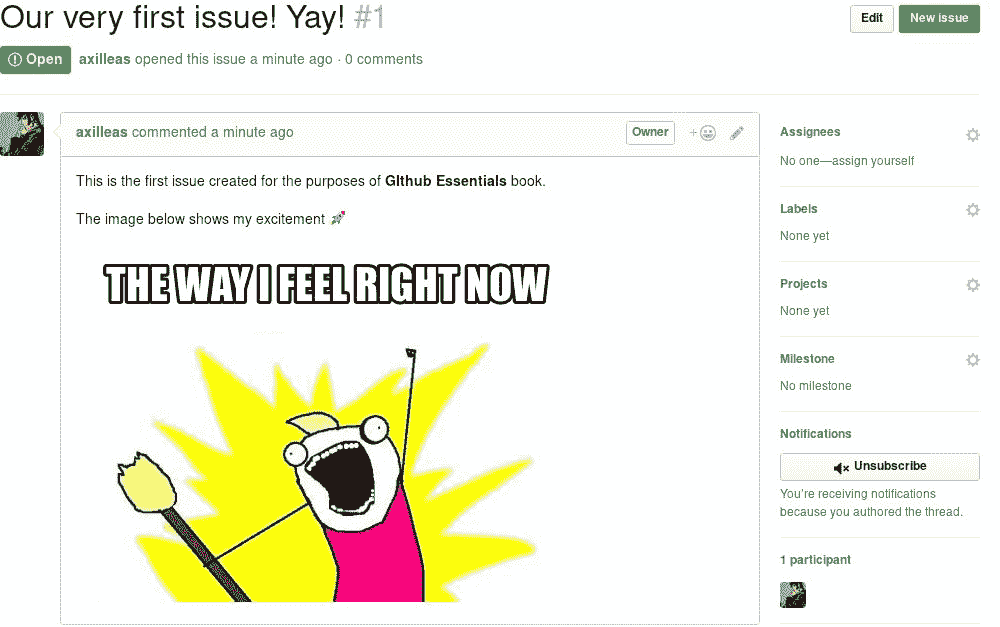
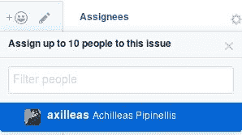

# 简要介绍仓库概述和问题追踪器的使用

几乎所有在 GitHub 上发生的事情都与仓库有关。仓库就像一个包含您项目所有文件的文件夹。

GitHub 上仓库的登陆页面展示了一个人的本地 Git 仓库的内容。除了文件的树状结构外，GitHub 还提供了一些附加功能，将最著名和最常用的 Git 命令带到您的浏览器中。其他功能包括仓库的分支、提交和标签。

除了这些功能，GitHub 还为每个仓库提供了问题追踪器。这是讨论发生的地方，跟踪和报告错误，提出功能请求，以及几乎所有与项目相关的内容都会在这里讨论。

GitHub 还实现了许多其他功能，位于问题追踪器之上，例如标签和里程碑，这些功能提供了更好的可视化和问题的分类。我们将广泛地探索所有这些功能，所以即使您还不熟悉这些术语，也不用担心。以下是我们将在本章中介绍的内容：

+   探索仓库的主页

+   学习如何使用强大的问题追踪器功能

**项目** 和 **仓库** 这两个术语，尽管不完全相同，但在本书中会被视为同义词并交替使用。

# 探索仓库的主页

仓库的主页是访问项目时大多数人停留的地方。在本节中，您将学习如何创建一个仓库，接着我们将探索 GitHub 的广泛功能，这些功能将 Git 的命令行带入您的浏览器。

# 创建一个新仓库

假设您已经通过 [`github.com/join`](https://github.com/join) 注册了 GitHub，我们现在将探索仓库的主页，并学习如何创建一个新的仓库来托管您的代码。

导航到页面的右上角，点击您用户名旁的小十字，选择“新建仓库”，如以下截图所示：


然后，您将进入一个页面，您需要提供一些关于新仓库的信息：


在“仓库名称”下填写一个名称，该名称最终将形成您的仓库注册的 URL。这是您创建仓库时需要执行的最基本操作。

GitHub 上的所有仓库都具有以下 URL 结构：`https://github.com/<username>/<repository_name>`

提供仓库描述是可选的，但建议您这样做。这样，其他用户可以一目了然地了解您的项目内容。

接下来的设置是选择您的仓库是公开还是私有。通常，您可以选择公开，除非您不希望所有人看到您的文件。但是，私有仓库是需要付费的。

GitHub 提供的下一个功能是创建一个包含 `README` 文件的仓库。README 文件通常包含关于你托管在仓库中的项目的全面信息，如安装指南、构建和使用说明，以及如何贡献的指南。你可以随时添加 `README` 文件，所以暂时可以不选这个选项。

另一个不错的功能是可以在创建时选择并包含一个 `gitignore` 文件。你可以从[`github.com/github/gitignore`](https://github.com/github/gitignore)提供的一系列有用的`.gitignore`模板中选择。

最终，你在 GitHub 上托管的代码将能够被第三方派生和重用。如果你是从一个全新的仓库开始，可以选择在创建时包含一个许可证。这是可选的，你也可以稍后手动添加许可证文件。

让我们点击“创建仓库”按钮并完成仓库的创建。到目前为止，它看起来是这样的：


你可以看到 GitHub 提供了关于下一步该做什么的有用信息。如果你本地计算机上已经有一个现有的 Git 仓库，你可以将其代码推送到 GitHub，或者按照屏幕上的指示从头开始创建。

由于我们稍后将从命令行工作，强烈建议你生成一个 SSH 密钥并将其与 GitHub 账户关联。请参阅[`help.github.com/articles/generating-ssh-keys/`](https://help.github.com/articles/generating-ssh-keys/)上的指南。此外，请确保正确配置你的 Git 用户名和电子邮件设置。更多信息，请参见[`help.github.com/articles/setting-your-username-in-git/`](https://help.github.com/articles/setting-your-username-in-git/)和[`help.github.com/articles/setting-your-email-in-git/`](https://help.github.com/articles/setting-your-email-in-git/)。

恭喜你创建了第一个仓库！

下一个目标是浏览仓库的主页。当你访问 `https://github.com/<username>/<repository>` 时，你应该能看到以下内容：

+   `<username>`：这是你注册时使用的用户名（在右上角可以找到）。

+   `<repository>`：这是你在前面步骤中输入的仓库名称

# 提交页面与 git log 命令的比较

GitHub 有一个很不错的 Web 用户界面，许多常见的 `git` 命令都可以在其中输入。

让我们首先创建一个 `README.md` 文件并将其推送到 GitHub，以便浏览提交页面：

1.  创建一个目录来存放你的代码并 `cd` 进入该目录：

```
 mkdir -p ~/github-essentials
      cd $_
```

1.  然后，按照 GitHub 提供的指示创建一个新项目：

```
 echo "# github-essentials-v2" >> README.md
      git init
      git add README.md
      git commit -m "first commit"
      git remote add origin git@github.com:<username>/<repository>.git
      git push -u origin master
```

注意，我使用的是 Git 协议（[`github.com/`](https://github.com/)），它在底层使用 SSH，这样我就不需要每次输入用户名和密码（请参阅前面关于如何实现这一点的说明）。

目录名（在我们的例子中是`github-essentials`）可能与创建时输入的仓库名称完全不同。必须与你通过`git remote add`设置的远程 URL 匹配 GitHub 提供的仓库 URL。

每次你添加更多提交时，它们的总数也会出现在项目的主页上。在之前的步骤中，我们进行了第一次提交，因此提交计数为 1，所以截图中显示了 1 个提交选项：


点击前面截图中显示的 1 个提交链接，进入提交页面。

在这里，你可以浏览提交列表（目前我们只有一个提交），并可视化`git log`的输出。让我们对比这两个提交。在本地仓库中输入`git log`；输出应该类似于以下内容：

```
commit b77a7ff22653ca74b10e99efdbc45f6f54ef10f4
Author: Achilleas Pipinellis <mail@example.com>
Date:   Sun Apr 15 23:26:32 2018 +0200

 first commit
```

现在，前往 GitHub 的提交页面。在这里，你可以看到以一种友好的界面呈现的相同信息：


我们可以看到提交信息、提交的日期和时间，以及该提交的 SHA。注意，SHA 被简化为 40 个字符中的前 7 个。点击 SHA 或提交信息会显示该提交所做的更改。我们来尝试一下，并对比 GitHub 显示的`git show <commit>`命令的结果：

```
commit b77a7ff22653ca74b10e99efdbc45f6f54ef10f4
Author: Achilleas Pipinellis <mail@example.com>
Date:   Sun Apr 15 23:26:32 2018 +0200

 first commit

diff --git a/README.md b/README.md
new file mode 100644
index 0000000..54a8290
--- /dev/null
+++ b/README.md
@@ -0,0 +1 @@
+# github-essentials-v2

```

前面代码的结果如下面截图所示：


提交信息以大号粗体字显示，因为它传达了一个重要信息。在它下面，是包含该提交的分支（目前只有 master 分支）。

你可以看到提交的 SHA、作者名以及日期，显示在蓝色区域的下方。GitHub 还会告诉你，在上次提交中，有多少文件发生了变化，并且做了多少次添加或删除。

最后，我们可以看到以绿色标示的新增内容。如果你删除了某些内容，它将以粉红色显示，稍后我们会看到这一点。

# 分支页面和与 git branch 命令的对比

我们来创建一个名为`add_description`的分支，并切换到该分支：

```
git checkout -b add_description
```

接下来，编辑`README.md`，添加一些文本，进行新的提交，并将其推送到 GitHub：

```
echo "\n## Description\n\nGitHub for dummies" >> README.md
git add README.md
git commit -m "Add second level header to README file"
git push origin add_description
```

现在，让我们从 master 分支创建一个名为`new_feature`的第二个分支，并将其推送到 GitHub：

```
git checkout master
git branch new_feature
git push origin new_feature
```

现在是时候切换到 GitHub，查看所有这些信息是如何呈现的。

在主仓库页面，你现在可以看到有三个分支。点击分支链接以获取更多信息。

概览页面正如其标题所示，是你在其旁边看到的其他标签的概览。它告诉我们默认分支是什么，你从你的账户推送了哪些分支（与“你的”标签相同），以及过去三个月中最活跃的分支（按日期排序，与“活跃”标签相同）。而“过时”标签代表的是那些超过三个月未更新的分支。

你可以在项目的设置中更改默认分支，它会出现在项目首页。这在第六章《探索用户和仓库设置》中有详细讲解。

你可能会注意到，尽管我们在推送 `add_description` 后推送了 `new_feature` 分支，但它的更新时间似乎出现在 `add_description` 之前。这是正常现象，因为 `new_feature` 的提交日期与我们的 master 分支相同，而该日期早于 `add_description` 分支。

现在，如果你仔细观察显示分支的标签，你会看到，在小字体中，显示了各个分支相对于默认分支的提交数——在我们的例子中，默认分支是 master。

在分支页面，你可以删除所有分支，除了你设置为默认的分支。我们来试着删除 `new_feature` 分支。点击红色的垃圾桶图标，看看会发生什么。GitHub 会给你恢复最近删除分支的机会：


如果你刷新页面或浏览删除分支的页面其他部分，Restore 按钮会消失。

新建拉取请求按钮将在后续章节中讲解。

# Raw、Blame 和 History 按钮

现在我们已经了解了 GitHub 如何看待分支，让我们来看看 GitHub 提供的其他 Git 功能。

Raw、Blame 和 History 按钮会出现在查看仓库的单个文件时。例如，我们可以通过点击来查看 `README.md` 文件：


Raw 按钮顾名思义，会以原始形式打开文件，这意味着任何 HTML 格式都会消失。当你想下载单个文件时，这特别有用。你会注意到，互联网上的许多指南都会告诉你使用命令行工具（例如 `wget` 或 `curl`）下载文件时，使用的就是这种原始文件格式。如果你曾尝试从 GitHub 下载文件，而得到的只是一个 HTML 文件，请记得使用 raw 格式。

Blame 按钮利用了 Git 的 blame 功能。基本上，对于文件的每一行，Git 会告诉你是谁修改了该行以及修改的时间。如果你想了解更多信息，可以访问 [`git-scm.com/docs/git-blame`](https://git-scm.com/docs/git-blame)。

为了正确查看该功能的使用，我不会使用我们之前创建的 `README.md` 文件，因为其中没有太多信息可以展示 GitHub 如何使用这个 Git 功能。相反，我将使用另一个仓库中的文件，这个文件有更多的提交。例如，可以查看 [`github.com/gitlabhq/gitlabhq/blame/master/app/models/ability.rb`](https://github.com/gitlabhq/gitlabhq/blame/master/app/models/ability.rb)，如下所示：


下载示例代码

你可以从你在[`www.packtpub.com`](http://www.packtpub.com)的账户中下载所有已购买的 Packt 书籍的示例代码文件。如果你在其他地方购买了本书，可以访问[`www.packtpub.com/support`](http://www.packtpub.com/support)，注册后将文件直接发送到你的邮箱。

相比在终端中调用`git blame`，你可以感受到 GitHub 功能的优越性。每一行代码都有注释，你可以看到哪一行文件在什么提交下被修改，谁修改的。还有一个很棒的小功能——热度：较旧的提交会显示为棕色线条，而较新的则显示为黄色。

最后，History 按钮不过就是`git log`在特定文件中的作用。

# Watch、Star 和 Fork 按钮

你可能已经注意到，位于仓库页面右上角的三个按钮。这些按钮在每个公共仓库中都会出现，不仅仅是你自己的仓库。

Watch 按钮管理仓库中订阅的级别。每当你关注的仓库发生操作时，GitHub 会通过邮件通知你，同时将这些操作列出在通知区域（[`github.com/notifications`](https://github.com/notifications)），你可以稍后将它们标记为已读，如下图所示：


订阅有三个级别，从“永不通知”到“大哥”不等。你可以选择仅在你明确参与对话或某人提到你时才收到通知（不关注）。这是你可以得到的中级通知，也是创建新仓库时的默认行为。下一个级别是始终收到通知，例如每当开始对话，或创建新问题，或某人在代码行中留下评论，或某人提到你时（关注）。最后，第三个选项是永不接收通知（忽略）。

你可以通过在用户名之前加上*at*符号（`@`）来提到某人。这是 GitHub 理解你需要某人注意的特殊方式。开始输入用户名时，GitHub 会智能地自动完成它。

Star 按钮是向仓库及其创作者表示感谢的一种方式。它表示项目的受欢迎程度。每当你给一个仓库加星，它会被添加到你的星标仓库列表中。你可以在[`github.com/stars`](https://github.com/stars)查看你所有的星标仓库。

在 GitHub 上，你可以在[`github.com/search?utf8=%E2%9C%93&q=stars%3A%3E1&type=Repositories`](https://github.com/search?utf8=%E2%9C%93&q=stars%3A%3E1&type=Repositories)找到按星标数排序的项目列表。

你可以通过点击 Star/Unstar 按钮旁边的数字，查看谁给仓库加过星。对于我刚创建的仓库，你可以看到我就是唯一的“星标者”：


Fork 按钮及其作用是 GitHub 能够脱颖而出的原因。正如我们在本书后面会看到的，它的主要用途是当你想要为某个项目做贡献时。当你 Fork 一个仓库时，它会复制到你自己的命名空间中，这样你就完全拥有了该副本；因此，你可以修改任何你想要的内容。试试看吧，前往 [`github.com/axilleas/github-essentials`](https://github.com/axilleas/github-essentials)，点击 Fork 按钮。稍等片刻（根据仓库大小不同），你将被重定向到你完全拥有的该仓库副本。

# 修改描述和网址

之前，我们学习了如何为我们的项目添加描述。这在创建新仓库时是可选的，如果你选择跳过创建，我们来看一下现在如何添加它。

前往主仓库页面，你会看到两个空白表单。在描述字段中，写下你项目的描述性注释；在网站字段中，填写你的项目可能拥有的网址。这也可以是你的 GitHub 仓库网址。如下所示：


点击保存后，你会立即看到更改。

# 学习如何利用问题追踪器的强大功能

GitHub 提供了一个功能全面的问题追踪器，紧密关联到每个仓库。

它的主要用途是作为一个错误追踪器，因为报告和讨论错误在你项目的成长中起着至关重要的作用。它也可以用来提交功能请求，作为博客或项目的讨论板，甚至可以作为修理房屋的记事本！有关这方面的更多内容，请参阅以下链接：

+   [`github.com/andreareginato/betterspecs/issues`](http://github.com/andreareginato/betterspecs/issues)

+   [`github.com/frabcus/house/issues`](https://github.com/frabcus/house/issues)

# 创建新问题

访问 `https://github.com/<用户名>/<仓库>/issues`，可以查看所有问题的活动概览。如果没有人曾在你的项目中打开过问题，你将看到一个空白页面，GitHub 会提示你打开一个新问题。我们现在来做这个操作。点击那个写着“新建问题”的大绿色按钮。

当你只提供最少的标题时，可能会创建一个问题。仔细查看以下截图，提交新问题按钮被禁用，无法点击。标题应尽可能详细地描述你在创建问题时想要传达的内容。

在下方的“写”标签下，你可以提供详细信息，并且基本上开始与所有希望参与的人进行讨论（前提是仓库是公开的）。这就是为什么 GitHub 聪明地建议你“留下评论”。

除了写文字外，你还可以通过简单的拖放，或者通过文件夹导航选择图片，来附加图片。以下是这个仓库的第一个问题的样子：


“写作”标签旁边是“预览”标签。为了理解它的作用，你首先需要了解 Markdown。

简而言之，Markdown 是一个文本转 HTML 的工具，允许你编写包含结构信息的文本，并将其自动转换为有效的 HTML。由 John Gruber 编写，并被 GitHub（以及其他许多平台）采纳，Markdown 因其易用性而成为最著名的文本转 HTML 工具。

你可以在[`guides.github.com/features/mastering-markdown/`](https://guides.github.com/features/mastering-markdown/)的指南中阅读关于 GitHub 如何扩展 Markdown 功能的所有信息。

回到我们的新问题。顾名思义，预览（Preview）会显示提交问题时的结果。它会根据“写作”标签中的常规文本，将其格式化为有意义的文本，URL 会被正确格式化，图片会显示，表情符号也会展示等。

正如我们在本书后面会看到的，GitHub 风格的 Markdown 包含了许多小功能，充分利用了问题跟踪器的使用。这些只是冰山一角。

感觉准备好提交了吗？点击页面底部的“提交新问题”。恭喜你创建了第一个问题！结果将如下所示：



每个创建的问题都会分配一个唯一的编号，之后我们可以在其他问题中引用它。在我们的例子中，由于这是第一个问题，它被分配了编号`#1`。标题区域提供了一些有用的信息。你可以看到该问题标记为“开放状态”，问题创建者的用户名，创建时间以及评论数量。

如果你后来发现自己犯了错误，不要慌张——你可以随时编辑已创建的问题。编辑按钮允许你编辑标题，铅笔图标用于编辑描述。通过点击“关闭问题”按钮来关闭问题。

如果你希望在关闭问题时同时发表评论，例如说明问题为何关闭，可以在输入评论时，按钮会从“关闭问题”变为“关闭并评论”。

# 将问题分配给用户

一个仓库可以有多个协作者。协作者是指具有推送权限的人，在我们的例子中，协作者还可以编辑和关闭问题。

用户分配在流量大的仓库中效果很好，特别是当有一个团队负责处理错误修复、功能增强等任务时。

有两种方法可以将问题分配给某人。首先，正如你在前面的图片中看到的，每个问题中都有一个受分配人（Assignee）部分，如下图所示：



在这个特定阶段，只有一个协作者——我——所以列表中只会显示我的名字。好的，我们已经学会了如何从问题内部分配一个问题给协作者，但如果你有几十个问题要分配给某人怎么办？逐个分配会有点繁琐且费时。你会高兴地知道，你可以批量分配问题给某人。

为此，让我们再创建两个问题。前往问题页面，勾选你想要分配的多个问题框，并选择一个受理人，如下截图所示：


选择受理人后，问题将立即更新为新的信息。你可以看到，受理人的头像出现在分配给他们的每个问题上：


你可以选择最多 10 个受理人来分配给一个问题。

# 标签

如果你使用过 WordPress，标签类似于标签（Tags）。不过，这与 Git 标签不同。接下来我们将探讨如何创建标签，并有效使用它们来轻松分类一批问题。

# 为什么标签对用户体验（UX）是一个宝贵的资产

标签提供了一种简便的方式来根据描述性标题对问题进行分类，比如“bug”，“功能”，以及你想使用的其他任何词汇。它们是有颜色的，并且在问题跟踪器中或每个问题内部都可以看到。

通过标签，你可以导航到问题跟踪器，过滤掉冗余的信息，只显示你感兴趣的问题。让我们看看它是如何工作的。

# 创建新标签名称并设置不同的颜色

前往问题跟踪器，并通过点击“标签”导航到标签页面。正如你所看到的，GitHub 已经设置了一些预定义的标签，可以直接使用。新标签和现有标签的名称、颜色和描述都可以完全自定义。

创建新标签非常简单，只需点击“新建标签”按钮，填写名称，选择颜色，并可选择性地输入描述。事实上，系统会自动选择一个随机颜色，所以唯一的前提是输入名称。我已经创建了一个新的黄色标签，命名为 `needs testing`，如以下截图所示：


点击“创建标签”按钮后，标签将被创建并显示在列表中。回到问题页面——让我们进入第一个问题，并给它添加刚刚创建的标签。点击齿轮图标，菜单将会出现。开始输入以缩小搜索范围。现在我们只有 9 个标签，但假设有 42 个以上，你将不得不一直滚动，直到找到你想要的标签。

如你所料，你可以在一个问题中选择多个标签。选择完标签后，只需点击标签窗口外的任意位置即可保存操作。你会立刻看到变更：


请注意，GitHub 会记录对问题所做的任何更改。这样，你就能知道是谁进行了某个特定操作，以及操作发生的时间。没有什么能逃得过 GitHub 的眼睛！尝试删除“enhancement”标签，看看会发生什么。

和受指派者一样，你也可以批量为问题分配标签。我们可以通过进入主问题页面，选择一些问题，然后选择“bug”标签来尝试这一操作：


问题跟踪器将被更新，现在你可以查看分配给每个问题的标签概况：


# 使用标签来分组问题

假设你有 100 个打开的问题，其中许多被标记为“bug”。如果通过某种方式，这些问题仅出现在问题主页面上，那不是很酷吗？嗯，猜猜看——当你点击“bug”标签时，GitHub 基本上会进行查询，结果是只有 bug 类型的问题会显示出来。分组功能来救场！

返回标签页面，你会看到你可以概览每个标签下分配的所有问题数量。

# 里程碑

里程碑，类似于标签，主要用于将问题分组，但目的是不同的。考虑一个里程碑，它就像一个特殊的标签，具有标题、描述和可选的截止日期。

# 为什么里程碑在代码版本控制中起着重要作用

众所周知，应用程序是以版本发布的。从你笔记本电脑的 BIOS 到你用来浏览互联网的网页浏览器，所有应用程序都使用版本控制。

许多公司，甚至是社区驱动的开源项目，通常都会有一张路线图，规定何时将新产品发布给公众。

GitHub 将此功能与问题跟踪器进行了整合。让我们深入了解，学习如何创建一个新里程碑，将一些问题分配给它，并使用概览查看哪些问题已经解决或未解决。

# 创建一个新的里程碑

在问题跟踪器的主页面上，点击“里程碑”链接，位于“标签”链接旁边。如果还没有创建任何里程碑，你将看到两个按钮可以创建一个里程碑。通常，“新建里程碑”按钮将是主要使用的按钮。

现在，让我们创建第一个里程碑。唯一的要求是标题；描述和截止日期是可选的。但是，为了看看效果如何，我们来填入所有信息：


点击“创建里程碑”，它将出现在“里程碑”页面上，显示我们之前输入的所有信息：


在左侧，你可以看到名称、截止日期、描述以及里程碑上次更新的时间。右侧则展示了完成百分比以及开放和关闭问题的数量。当然，你也可以编辑、关闭或完全删除它。

# 将问题添加到里程碑

现在我们至少有一个里程碑了，让我们将它分配给一个问题。

同样，有两种方法可以为问题添加里程碑。就像分配人和标签一样，你可以在每个问题内进行操作，或者在问题主页面上批量添加。这里，我将尝试第二种方法；你可以自己尝试第一种方法：


选择里程碑后，页面将刷新，问题将被添加到选定的里程碑中。如果你仔细观察，你会看到一个小图标和旁边的里程碑名称：


# 使用里程碑查看哪些问题已解决或尚未解决

当处理成百上千个问题、bug 报告和改进建议时，能够一目了然地查看哪些已经解决，哪些尚未解决是非常方便的。

让我们再为里程碑添加一个问题，然后立即关闭它，就像我们在 *创建问题* 部分中学到的那样。在里程碑的上下文中，这将被视为已完成。前往里程碑页面。你会看到条形图现在已填充一半（50%）：


# 提示与技巧

`README` 文件对于你的项目至关重要，因为它们在首页提供有用的信息。让我们简要探索一下这个功能，然后再学习键盘快捷键。

# 了解 `README` 文件

`README` 文件用于提供关于你项目的信息。其内容会自动显示在你仓库的首页，因此提供一个 `README` 文件始终是个好主意。

GitHub 会检查 `README` 文件是否带有扩展名；如果扩展名被支持进行渲染，它会根据其实现自动进行格式化。

例如，`README` 文件可以有一个 `.md` 扩展名，代表 markdown；一个 `.rst` 扩展名，代表重构文本；以及一个 `.adoc` 扩展名，代表 AsciiDoc。

如果扩展名不被支持，GitHub 会将其视为普通文本文件，并且不会进行任何格式化。

有关支持的标记语言列表，请访问 [`github.com/github/markup#markups`](https://github.com/github/markup#markups)。

# 使用键盘快捷键轻松导航

GitHub 有一个很好的功能，支持键盘快捷键。你可以通过在任何页面上按下 ? 键查看支持哪些快捷键。一个对话框将弹出，显示该页面支持的所有快捷键。要查看所有快捷键，请点击“显示所有”链接。

# 总结

在本章中，你学习了如何创建第一个仓库，并浏览了其主页面。你还学习了如何有效使用问题追踪器来追踪项目的 bug、功能请求等。此外，你还学会了如何使用标签和里程碑来更好地分组问题。

在下一章中，我们将学习维基（wikis），以及 GitHub 关于代码发布的功能。
