# 使用维基和管理代码版本控制

在上一章中，我们探索了存储库的主页，并介绍了其问题跟踪器的基础知识。

GitHub 还提供了一个类似维基风格的地方来添加项目的文档。您可以创建任意数量的页面，并公开访问以便每个人都可以编辑。

此外，当您是产品的创建者并有依赖于它的用户时，您希望它尽可能稳定。版本控制有助于实现这一目标。GitHub 提供了适合发布代码版本的正确工具，实际上这些只是时间快照。每当您认为项目准备好进入世界时，无论是修复了错误还是添加了新功能，您都可以使用发布功能并向世界提供版本化的 tarball 文件。

完成本章后，您将学会如何通过为文档提供一个家园来创建、编辑和维护维基。

您还将学会如何从现有分支或标签创建新版本发布，并提供可选的发布说明。这样，最终用户可以了解与任何先前版本的变化。

我们将覆盖以下内容：

+   使用维基：

    +   为何维基是记录项目的好地方

    +   创建新的维基页面

    +   删除页面

    +   Markdown 简介

    +   如何为维基添加侧边栏和页脚

    +   观察维基页面的提交历史并根据需要恢复到之前的状态

+   管理代码版本控制：

    +   创建发布

    +   编辑发布

    +   从命令行推送标签

    +   标记为预发布

    +   制作发布的草稿

    +   上传您自己的文件

+   小贴士：

    +   通过 Atom feed 订阅新发布内容

    +   本地编辑维基

# 使用维基

当您首次创建新存储库时，与此项目关联的维基也会随之创建。默认情况下启用，每个人都可以添加新内容或修改现有页面。如果您想更改此行为，可以参考第六章，*探索用户和存储库设置*，其中详细说明了如何完成此操作。

# 为何维基是记录项目的好地方

文档工作绝不可小觑。引用一句名言，伴随伟大的项目而来的是优秀的文档。

尽管有许多工具可以转换标记文件，比如将 Markdown 转换为 HTML，但您可能不希望使用外部页面来托管您的文档。进入 GitHub 维基。

# 创建新的维基页面

选择维基标签（带有书籍图标的标签），前往维基。由于我们的维基目前没有内容，页面并不存在。在这种情况下，GitHub 会提示您创建第一个页面。请继续点击绿色按钮。

每次添加新页面到维基时，过程都是相同的。页面顶部是标题。这是唯一强制填写的字段，用于创建维基页面，同时也用于形成您将访问页面的 URL：

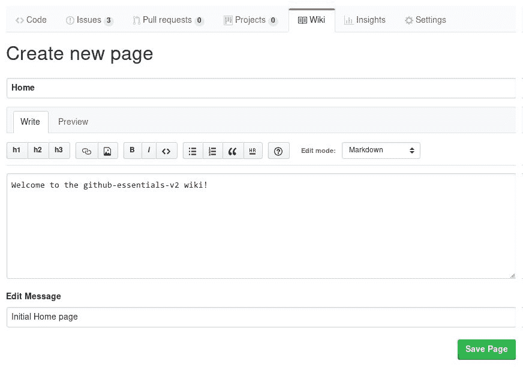

当第一个 Wiki 页面创建时，GitHub 默认使用 `Home` 作为标题。即使你选择了其他名称，Home 页面仍会自动创建，并作为 Wiki 的首页。`Home` 的作用类似于仓库中的 `README`，它无法被删除。

在标题区域下方，有两个标签。当“写作”标签处于活动状态时，你可以开始在下方的空白区域进行写作。如果选择使用标记语言写作，预览标签将渲染文本，并向你展示保存页面后的展示效果。

在标题下方，有一个不错的工具栏，包含了最常见的操作，如标题、粗体文本、斜体和列表。在编写本书时，GitHub 支持九种标记语言供选择。从编辑模式下拉列表中选择一种，文本将根据所选语言进行渲染。对于你从菜单中选择的每种语言，都会有一个小帮助页面，列出最常用的操作。点击问号图标即可查看帮助区域。

最后，当你准备保存页面时，可以提供一个简短的消息，描述所做的修改内容。可以将其看作是一个 Git 提交消息。稍后，当我们浏览页面的历史记录时，编辑消息将派上用场。

当你准备好时，点击保存页面按钮，页面将如下所示：

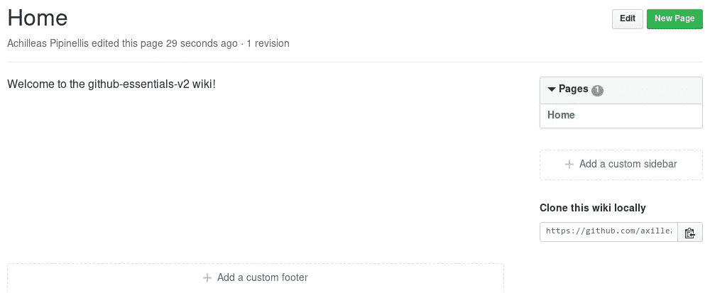

# 删除页面

除了 Home 页面外，其他页面都可以删除。为了删除页面，进入你想删除的页面并点击右上角的编辑按钮。如你所见，删除页面并不一定意味着它被永久清除。继续阅读，了解如何撤销操作。

# 一个基于 Markdown 的 Wiki —— Markdown 简介

虽然 GitHub 支持多种标记语言，但我们将探索 Markdown，因为它是最知名的一种。

让我们创建另一个页面，名为`Installation`，并添加以下内容：

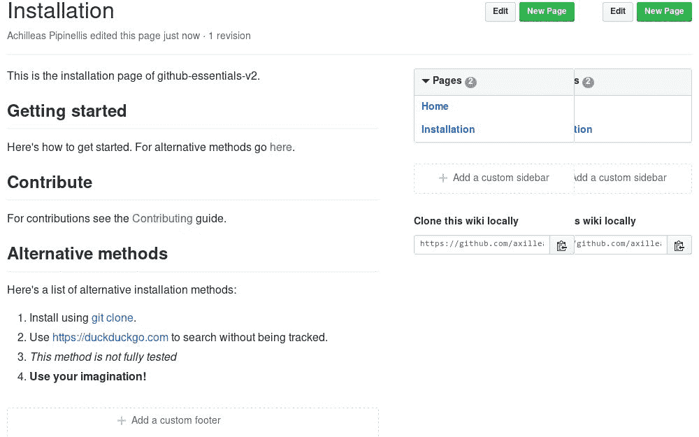

我使用了几个 Markdown 元素，点击预览将显示保存后页面的渲染效果。点击保存页面按钮后，新创建的 Installation 页面将如下所示：


有一些值得提到的元素是链接。有两种类型的链接：外部链接和内部链接。外部链接通过给出完整的 URL，包括 FQDN 来编写，而内部链接只需使用页面名称即可。

你可以创建外部链接，并通过将其用`<>`包围来显示实际的 URL，例如 `<https://duckduckgo.com>`，你还可以包含一些随机文本，如 `[git clone](https://git-scm.com/docs/git-clone)`。在方括号内，你可以添加任何文本，后跟实际链接，括号内是链接的内容。注意不要在第二个方括号和第一个括号之间留空格。

内部链接在你想链接到 wiki 的另一页时非常有用。假设你有 42 页，当你想引用另一个页面时，每次都需要输入完整的网址。GitHub 在这种情况下实现了 MediaWiki 的标记。使用双括号（`[[]]`），并在其中放入你要链接的 wiki 页面的名称。在我们的示例中，我使用了`[[Contributing]]`，这将创建一个指向另一个页面的链接。请注意，如果链接不存在，它会以红色显示。如果点击它，你将被重定向到创建页面的界面。

创建标题时，你需要在文本前面加上`#`。`#`的数量定义了将使用的标题样式。每个标题都有一个单独的锚点链接，你可以在保存页面时将鼠标悬停在标题上查看这个锚点链接。然后，你可以使用这个锚点链接来引用内部链接。

在我们的示例中，你可以看到我创建了三个标题，即`Getting started`、`Contribute`和`Alternative methods`。在`Getting started`中，我放置了一个指向`Alternative methods`的互联链接。实现这一点的 Markdown 代码是`[[here|Installation#alternative-methods]]`。这种风格引入了两个新的探索领域。

首先，你可以看到，备用文本可以像外部链接一样使用。唯一的区别是，备用文本和链接都放在双括号内，用管道符号（`|`）分隔。其次，你可以看到如何调用内部引用链接。页面标题放在最前面，后跟井号符号（`#`），最后是标题。理解这一点很重要，因为作为互联链接的一部分，标题会被转换，而空格会被替换为连字符（`-`），所有特殊字符（如`?,'!`等）都会丢失。

你可以随时使用预览来测试锚点链接是否会正确渲染。

内部链接仅在同一 wiki 内支持。你不能使用内部链接链接到另一个 wiki。在这种情况下，你必须使用外部链接。

我们只触及了 Markdown 的表面。你可以在[`github.com/adam-p/markdown-here/wiki/Markdown-Cheatsheet`](https://github.com/adam-p/markdown-here/wiki/Markdown-Cheatsheet)的优秀备忘单中阅读更多相关内容。

# 如何为你的 wiki 添加侧边栏和页脚

如果你有 wiki 的写入权限，你应该能够看到“添加自定义侧边栏”和“添加自定义页脚”按钮。

GitHub 有一个默认的侧边栏，用于放置所有的 wiki 页面。由于它按名称顺序显示页面，这可能并不总是有用，有时你可能希望用户能够方便地访问重要信息，而无需进行过多的搜索。

和其他 wiki 页面一样，侧边栏也可以使用 GitHub 支持的标记语言编写。在下面的示例中，我使用了`Markdown`：

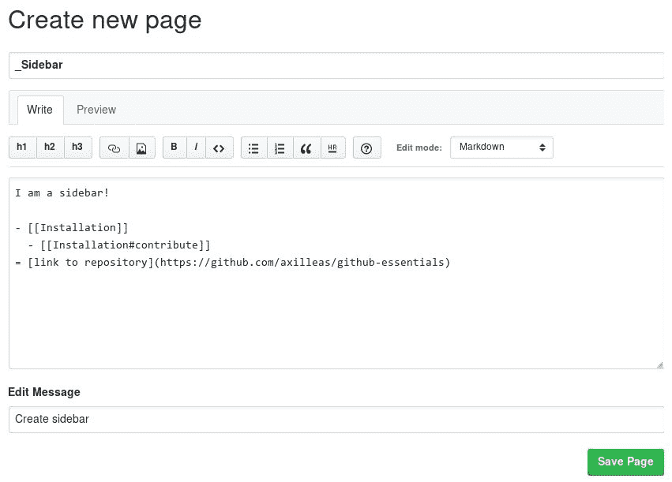

如你所见，我使用了一个项目符号列表，并在每个项目上放置了链接。缩进项目（一个或多个空格）将得到以下结果：

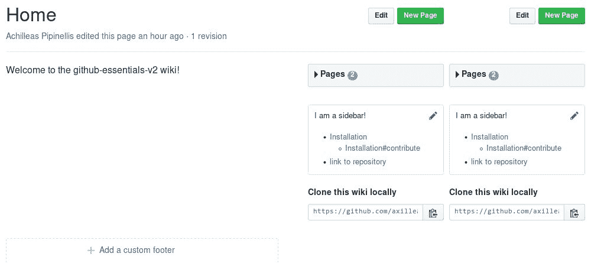

就像侧边栏一样，你还可以创建自己的自定义页脚。例如，我使用了两个带有自定义文本的外部链接，正如下面的截图所示：

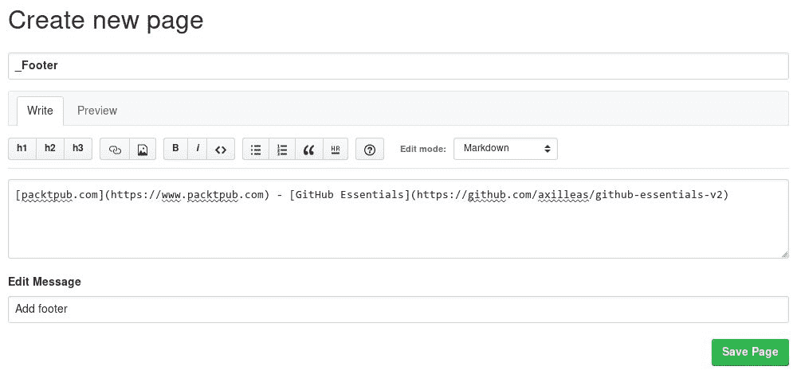

所有修改完成后，我们得到了一个漂亮的 Wiki 页面，包含自定义的侧边栏和页脚：

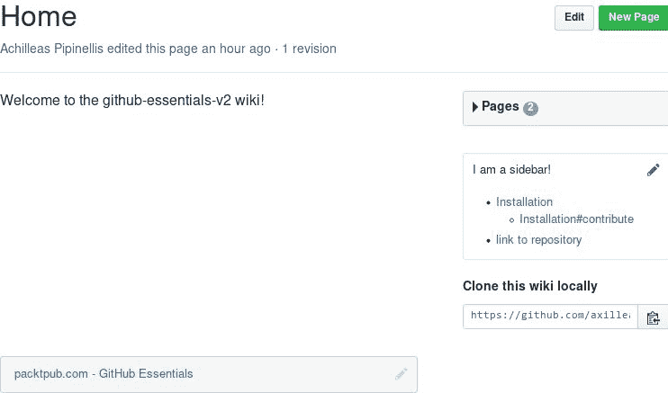

# 查看 Wiki 页面提交历史，并在需要时恢复到之前的状态

如果告诉你 Wiki 本质上是一个独立的 Git 仓库，你会感到惊讶吗？在*技巧和窍门*部分，我们将看到如何将 Wiki 克隆到本地，进行更改并推送回 GitHub。

与所有 Git 仓库一样，这里有提交记录和历史日志。每个页面都有其过滤后的提交日志，记录了页面所经历的所有更改。一种快速访问历史日志的方法是点击每个页面上的修订链接。这个链接可以在每个页面标题下找到。例如，首页有三个修订版本：

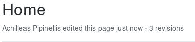

查看页面历史的另一种方式是使用“页面历史”按钮，这个按钮可以在编辑页面时找到。

查看历史日志的另一种方法是将`/_history`附加到你的页面。例如，[`github.com/axilleas/github-essentials-v2/wiki/Home`](https://github.com/axilleas/github-essentials-v2/wiki/Home) 变成 [`github.com/axilleas/github-essentials-v2/wiki/Home/_history`](https://github.com/axilleas/github-essentials-v2/wiki/Home/_history)。

这是我的首页日志的样子：

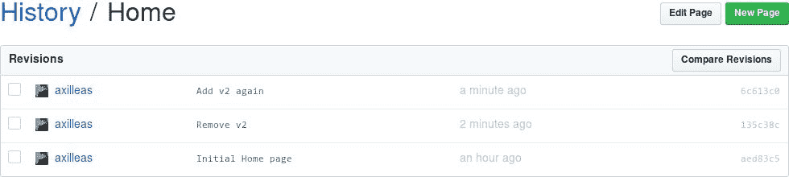

从前面的截图中，你可以获得很多有用的信息。你可以看到，进行更改的人的用户名首先出现在历史表格中。在这个例子中，只有我的用户名，但在有许多协作者的 Wiki 中，你可以很容易地看出是谁做了什么更改。接下来，你会看到提交信息，这非常有用，因为你可以一眼看出更改的内容。第三列是关于更改时间的，最后还有更改的提交 SHA。

现在，让我们利用恢复功能，当事情变得不顺利时。首先，创建一个新页面，保存它，然后删除它。我们无法查看该特定页面的历史记录，因为它已经不再存在，所以我们需要前往主历史页面，它是所有页面的母体。由于此页面是隐藏的，你需要手动将`/_history`添加到你的主 Wiki 页面后面。

为了恢复更改，你需要使用“比较修订”按钮。你可以选择恢复一个或两个修订版本：

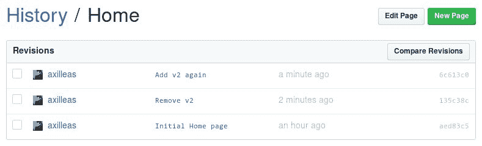

你可以通过默认的 GitHub 提交信息与自定义提交信息进行区分，因为默认信息遵循`Created/Updated/Destroyed Title of page (language)`的格式，其中`language`是用于创建该页面的标记语言。

在这里，我们选择了两个提交，但由于它们在提交历史中是连续的，因此只选择最后一个也一样。就像是在比较`git show HEAD`和`git diff sha2 sha1`之间的更改，其中`sha2`是最后一次提交的`SHA`，`sha1`是之前的那个。`diff`是相同的。

点击`比较修订`按钮后，我们将看到此次提交所引入的更改：

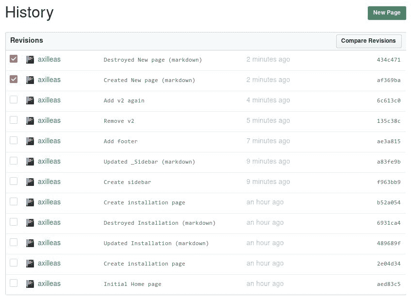

让我们通过点击回退更改按钮恢复被删除的页面。在写这本书的时候，每次我尝试回退删除页面时，都会出现 500 内部服务器错误。尽管出现了错误，但回到历史页面，你会看到回退操作实际上已经执行，并且被删除的页面被从“死而复生”：

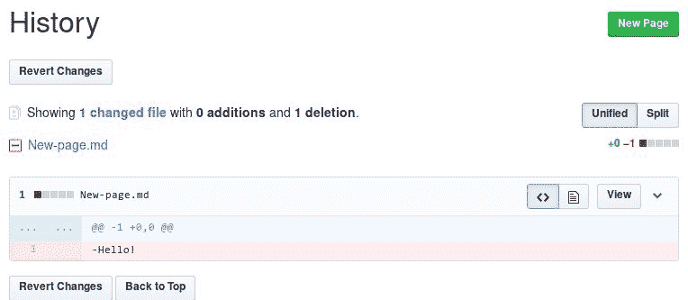

你可以看到，回退的提交消息引用了分别创建和删除该页面的两个提交。

有时，由于冲突，你将无法比较两个修订版本并回退。在这种情况下，GitHub 会用一条消息警告你：此补丁无法回退。

这就是关于 GitHub 维基的所有知识。接下来，我们将重点关注如何使用 GitHub 提供的工具来管理代码发布。

# 管理代码版本

在软件管理的世界中，几乎每一款软件都有一个版本号。这是一个宣告软件随时间演化的方式，通常包括功能增强或 bug 修复。GitHub 利用 Git 的强大功能，提供了一个简单的界面来发布你版本化的软件。

# 创建发布

在 GitHub 中，发布的概念与 Git 标签紧密相关。你可以在更改分支的相同菜单中查看现有的标签（如果有的话），如下图所示：

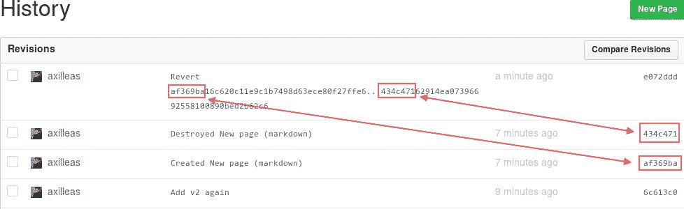

如果你访问发布页面并且还没有创建标签，你将被提示创建一个。创建发布将自动创建一个标签。

让我们点击创建新发布按钮。接下来将出现以下页面：

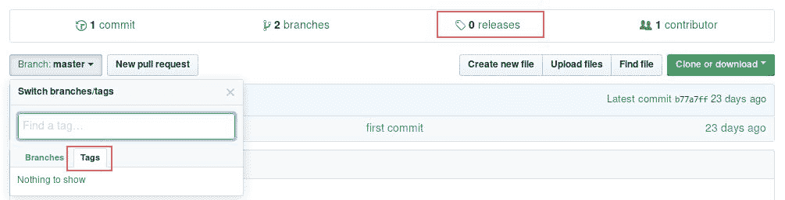

你只需填写标签版本名称框中的内容，其他的都是可选的。如果你提供的标签名称已经存在，你将看到标签名称重复的提示。

你的标签名称可以是任何自定义值，但强烈推荐遵循语义版本控制方案。简要介绍一下语义版本控制：发布号由三个数字组成，数字之间用点分隔，形式为`MAJOR.MINOR.PATCH`。你应当依此进行递增：

+   `MAJOR`版本用于进行不兼容的 API 更改

+   `MINOR`版本用于以向后兼容的方式添加功能

+   `PATCH`版本用于进行向后兼容的 bug 修复

你可以在[`semver.org/`](http://semver.org/)查看更多内容。

一个很好的命名标签的方式是匹配现有的里程碑。从上一章中我们已经有了一个`v0.5`的里程碑，因此让我们也将新标签命名为`v0.5`。开始输入标签名，如果该标签不存在，你会看到“Excellent! This tag will be created from the target when you publish this release message”。

你可以从下拉菜单中选择目标分支或提交，正如以下截图所示：

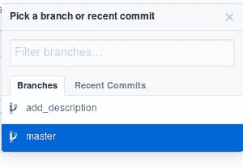

如果选择了某个分支，将会创建一个指向该分支最新提交的标签。如果你选择进入“最近提交”标签页，可以从多个最近的提交中选择来创建标签。

为了方便我们的示例，选择`master`分支并输入版本标题。你可以选择性地（但推荐）添加一个描述，说明这个版本的内容。我喜欢把描述当作写一篇博客文章，解释该版本发生了哪些变化。

当然，你可以像在 GitHub 中的几乎任何地方一样使用 Markdown，并使用预览按钮查看渲染效果：

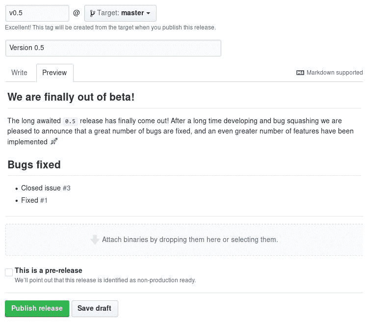

如果你认为一切都已准备好，点击发布版本按钮。你随时都可以编辑任何版本，因此不用担心错过什么。以下截图解释了关于发布的所有信息：

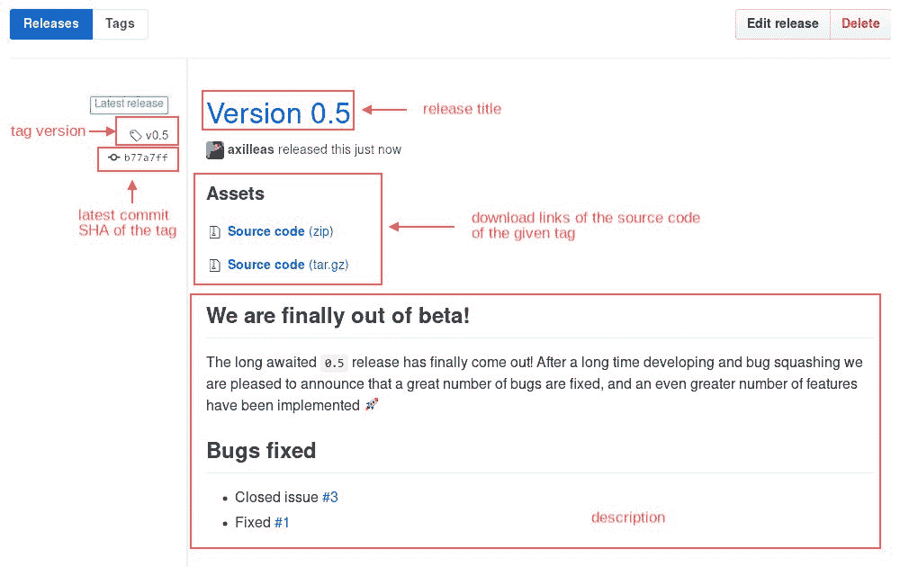

如果没有提供版本标题，标签名将会显示出来。同样，如果没有提供描述，标签的最新提交信息将会显示出来。

# 编辑版本

要编辑版本，你可以点击版本页面中发布旁边的“编辑发布”按钮，或者直接访问该版本并点击“编辑”。

# 从命令行推送标签

现在，让我们看看当标签已经存在时，GitHub 会如何反应。我对文件做了一些更改，并从命令行创建了一个新标签。最后，我将这个标签推送到 GitHub，如下所示：

```
git checkout master
echo "0.5.1" > version.txt
git add version.txt
git commit -m "Release 0.5.1"
git push origin master
```

如果你现在访问标签页面，将会看到新标签位于我们之前创建的标签上方。在版本页面中，点击“草稿新版本”。我们将选择一个已有的标签，因此在标签版本字段中输入`v0.5.1`。GitHub 发现该标签已存在，因此通知我们这是一个已有标签：

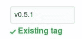

为其添加一个标题和简短描述，然后发布它。由于`v0.5.1`标签指向的是最新提交而非之前的发布，因此它现在被标记为“最新发布”。

# 标记为预发布

一个不错的小装饰功能是，你可以将版本标记为预发布，这意味着你可以告知用户该版本尚未准备好用于生产环境，但他们仍然可以下载并测试它。我们将创建一个`develop`分支的预发布版本，其中包含`master`分支尚不存在的新提交：

```
git checkout master
git checkout -b develop
echo "0.6rc1" > version.txt
git add version.txt
git commit -m "0.6 pre-release"
git push origin develop
```

从`develop`分支创建一个新版本，并命名为`v0.6rc1`。这次，通过勾选相关选项将其标记为预发布：

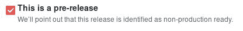

发布后，版本页面将如下所示：

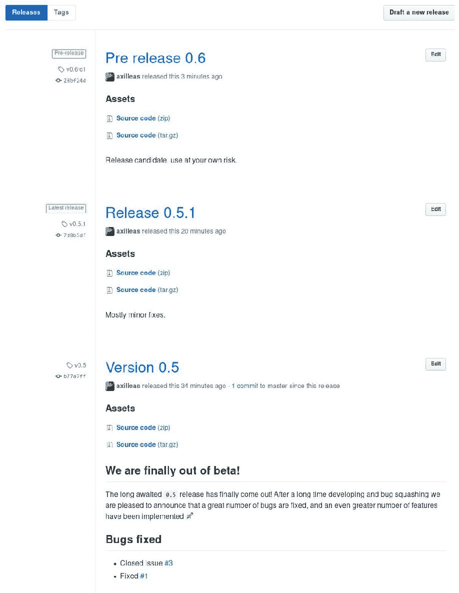

# 创建发布草稿

如果你在每次发布时提供详细描述，可能会发现草稿功能非常有用。你可以在反复编辑发布内容并添加所需信息后，将其保存为草稿。这样，在需要发布时，你就可以节省更多时间。

若要制作发布草稿，不要点击“发布版本”，而是点击“保存草稿”按钮。返回到发布页面，你可以看到你刚刚创建的草稿版本：

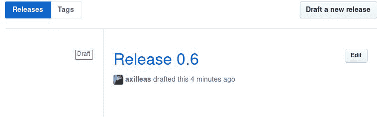

你可以随时编辑它，当你准备好发布时，只需点击“公开发布”。若要删除草稿，点击“丢弃草稿”按钮。

由于你正在处理草稿，因此不必担心更改版本标签或其他信息。草稿只能由具有写权限的用户查看，因此在发布之前，它不会向公众显示。

# 上传你自己的文件

有时你可能需要为各种操作系统提供预编译的二进制文件。对于你的 Android 应用程序，它可能是 `apk` 文件；对于 Windows，是 `msi` 或 `exe`；对于 Debian，是 `deb`；对于 RedHat，是 `rpm`，等等。

创建发布时，底部会出现一个窗口，提示你附加任何二进制文件。在这里，我上传了一个测试文件 `github-essentials.zip`，如以下截图所示：

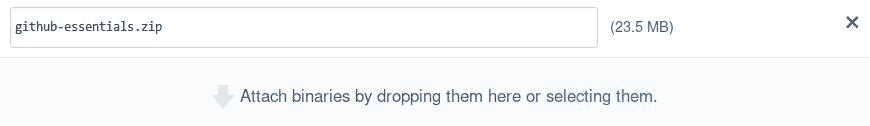

你可以上传多个文件，但请注意，GitHub 对每个文件的上传大小限制为 2 GB。成功上传新的二进制文件并发布版本后，你可以看到你手动附加的文件以及 GitHub 为你发布的源代码：

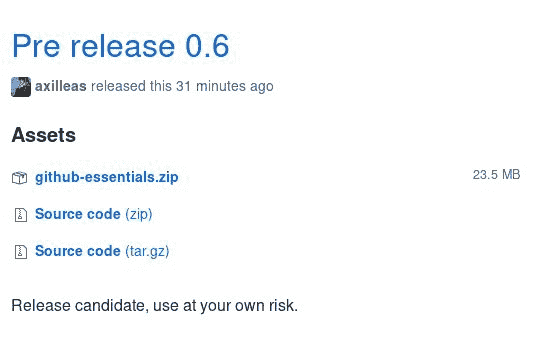

# 提示和技巧

这里有个小提示，可以通过 atom feed 获取新版本发布的通知。同时，在你熟悉 Git 的过程中，你会很高兴知道，你可以在本地编辑项目的 wiki。

# 通过 atom feed 订阅新版本发布

如果你习惯于订阅博客的动态以获取最新的新闻，那么你会很高兴知道你可以订阅以接收 GitHub 上新版本发布的通知。

只需访问发布页面，并在 URL 后面添加 `.atom`。例如，[`github.com/diaspora/diaspora/releases`](https://github.com/diaspora/diaspora/releases) 变为 [`github.com/diaspora/diaspora/releases.atom`](https://github.com/diaspora/diaspora/releases.atom)。酷吧？

# 本地编辑 wiki

如 wiki 提交历史部分所述，每个 wiki 都是一个独立的 git 仓库。因此，你可以克隆它，在本地进行更改，并推送回 GitHub。

它由 `gollum` Ruby 库提供支持，我们将安装并使用它在本地预览 wiki。

# 安装 gollum

`gollum` 库被打包为 Ruby gem，安装它的最简单和最快方法是按照官方 wiki 条目 [`github.com/gollum/gollum/wiki/Installation`](https://github.com/gollum/gollum/wiki/Installation) 进行操作。你可能能够避免全局安装它，但这不在本指南的范围之内。

# 克隆 wiki 并在浏览器中查看预览

回到我们的 wiki 页面，你应该注意到下载链接。每个 wiki 仓库都有一个被绿色标记的远程 URL，如下图所示；它本质上是主 Git 仓库的 URL，后面加上 `.wiki`：

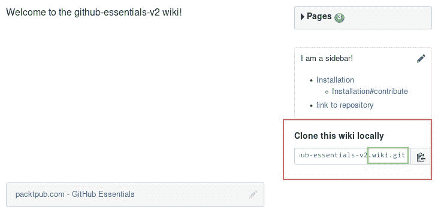

使用这个 URL 克隆 wiki；然后，在该仓库中运行 `gollum` 命令：

```
git clone https://github.com/axilleas/github-essentials-v2.wiki.git
cd github-essentials-v2.wiki
gollum
```

尽管没有明确说明，你也可以使用 Git 协议而不是 HTTP 克隆 wiki。

如果你看到类似以下的输出，那么 `gollum` 将成功运行，并且你可以在 `0.0.0.0:4567` 上预览 wiki：

```
[2015-07-26 01:09:34] INFO  WEBrick 1.3.1
[2015-07-26 01:09:34] INFO  ruby 2.1.6 (2015-04-13) [x86_64-linux]
== Sinatra (v1.4.6) has taken the stage on 4567 for development with backup from WEBrick
[2015-07-26 01:09:34] INFO  WEBrick::HTTPServer#start: pid=20826 port=4567
```

界面应该与你熟悉的 GitHub wiki 相似。让我们做一些修改。

# 本地修改并推送到 GitHub

现在你已经有了一个运行中的 wiki 实例，你可以像在 GitHub 上一样在浏览器中进行修改，或者使用 `vim` 或 `emacs` 等编辑器直接编辑文件。

既然你已经知道如何在浏览器中编辑 wiki，我们就用一个编辑器来修改 `Installation.md` 文件。编辑完成后，保存文件并提交到 Git。花一点时间使用 `git log` 查看日志，并与 GitHub 上的提交历史进行对比（在 `https://github.com/<username>/<repository>/wiki/_history`）。

现在将更改推送回 GitHub，然后再次访问历史页面。新提交应该在那里，并显示新的更改。

如果你想使用其他标记语言编写，而不是 Markdown，请参阅 [`github.com/gollum/gollum#installation`](https://github.com/gollum/gollum#installation) 中的说明，了解如何安装所需的 gems。

# 总结

在这一章中，你了解了文档的重要性，以及 GitHub 如何允许你为每个项目托管一个基于 Markdown 的 wiki。创建、删除、编辑和恢复页面应该已经是你熟悉的术语了。

你问发布版和标签之间的关系是什么？好吧，如果你读了本章的第二部分，你应该已经知道它们之间的联系以及如何创建发布版并将其分发给公众。

在下一章，你将看到如何管理组织和团队。继续阅读，了解如何利用协作的力量。
