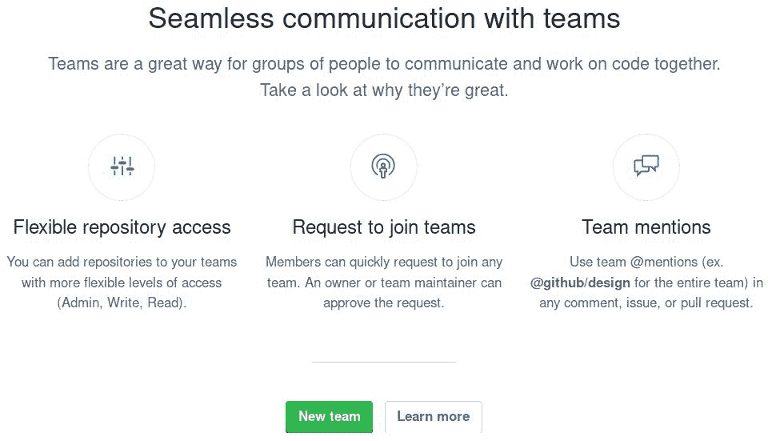

# 管理组织和团队

在第二章，*使用 Wiki 和管理代码版本控制*中，我们探讨了如何使用 GitHub 提供的内置 Wiki 为你的项目编写文档，并了解了如何通过 GitHub 发布来管理代码版本。

了解何时在你的命名空间下托管项目，何时在组织下托管项目非常重要。通过组织，你可以创建团队，并为在其下托管的不同仓库中的人提供不同的访问级别。

在本章中，我们将讲解如何创建一个组织、邀请成员并授予他们访问组织下托管的仓库的权限。你将学会如何创建团队并将组织成员与团队以及仓库关联起来。

我们将涵盖以下内容：

+   用户和组织之间的区别

+   组织角色和仓库权限级别

+   创建组织

+   全局成员权限

+   仓库

+   团队

+   人员标签

+   组织设置

# 用户和组织之间的区别

除了只能由你自己使用的用户帐户外，GitHub 还提供了创建由多个用户管理的组织的功能，正如我们稍后将看到的，你还可以在组织内创建团队。

GitHub 是一个协作平台，因此，流量较大的项目需要一些人来帮助维护。

当然，创建组织的理由可能不止这些。撇开实际原因不谈，当有多个人时，通常会创建组织，这些人每个人在组织托管的项目中都有平等的权利。

例如，你可以看到像 Twitter、Google，甚至是 GitHub 自己这样的知名公司，它们都有组织，在这些组织下托管着多个项目。

# 组织角色和仓库权限级别

GitHub 允许你为组织中的每个成员选择三种角色之一：所有者、成员和账单管理员。我们不会涉及后者；如果你想了解更多信息，请参考[`help.github.com/articles/adding-a-billing-manager-to-your-organization/`](https://help.github.com/articles/adding-a-billing-manager-to-your-organization/)。

所有者拥有对组织的完全访问权限，并处于权限链的最高级别。在组织方面，他们可以邀请和移除成员，创建和移除团队，创建和移除仓库，以及管理所有人员和仓库的权限级别。他们还可以编辑组织设置。

成员通常是新加入组织的默认角色。成员能够做的最少事情是创建新团队，并将现有的团队成员和仓库添加到其中。

仓库的成员访问级别只能由所有者设置。

会员也可以被提升为某个特定团队的“维护者”。拥有此访问权限，他们可以添加和删除团队成员。可以将其视为比作为成员的角色之外的额外隐藏角色。任何创建新团队的人都会被授予该团队的“维护者”角色。

现在，请注意不要将组织权限与仓库权限混淆。仓库可以拥有四种权限：拥有者、管理员、写入和读取。

拥有者是授予组织所有者的最高权限级别。拥有管理员访问权限的人具备拥有者权限，但仅限于特定仓库；您可以对其进行推送、删除、添加或移除团队、更改团队权限级别、添加外部协作者等。这就像在您的个人命名空间下创建一个新仓库。拥有写入权限，您可以向仓库推送；读取权限仅授予读取权限，这意味着只能克隆和拉取。

要查看各个级别权限的完整列表，请访问 GitHub 的文档：[`help.github.com/articles/repository-permission-levels-for-an-organization/`](https://help.github.com/articles/repository-permission-levels-for-an-organization/)。

现在我们已经讨论了不同的访问级别和权限，让我们来创建我们的第一个组织。

# 创建组织

为了创建组织，找到顶部标题中头像旁的加号按钮，或直接访问 [`github.com/organizations/new`](https://github.com/organizations/new)。

在下一屏幕上，选择一个组织名称并填写账单电子邮件。出于测试目的，您可以填写个人电子邮件，之后如果需要可以更改。对于开源项目，创建组织是免费的，这是默认计划。如果组织将由公司拥有，您需要接受公司服务条款。所有这些选项在下图中进行了总结：

当您输入名称时，GitHub 会在后台检查该名称是否已被占用，如果已被占用，将显示一条消息，提示用户名已被占用。

正如您所注意到的，用户名和组织名不能相同。命名空间必须唯一。

在下一步中，您可以选择邀请一些人加入组织。通过他们的用户名、全名或电子邮件搜索，然后选择他们并点击**邀请**将他们邀请到您的组织中。完成后，点击完成：

创建后，您首先看到的将是您组织的仪表盘，如下图所示：

在我们深入了解团队、人员和仓库之前，让我们先通过在组织设置中全局设置成员权限来查看一些默认设置。

# 全局成员权限

在邀请人员和创建仓库之前，让我们先查看两个重要的设置并设置一些默认值。进入**设置**页面并选择成员权限标签：

如您所见，关于仓库有各种设置。第一个是关于仓库创建的，如果启用，组织中的任何成员都可以在组织命名空间下创建仓库。

如果您希望更加开放，可以启用此选项；如果希望更加严格，可以禁用它。禁用后，只有拥有者能够创建仓库。外部合作者（见*成员与外部合作者的区别*部分）无论此选项如何，都不能创建任何仓库。

接下来的两个选项是针对具有管理员权限的仓库成员。您可以启用或禁用仓库删除及其可见性状态，以允许他们对拥有管理员权限的仓库执行这些操作。

下一个选项是关于组织内部任何私有仓库的分叉行为。默认情况下，它是禁用的，组织成员将无法分叉私有仓库。

最后的选项是关于组织成员在所有仓库（无论新旧）上的默认仓库权限。您可以选择四个选项：管理员、写入、读取和无权限。无权限是最低的权限，意味着成员只能克隆和拉取公共仓库。拥有读取权限的成员可以克隆和拉取所有仓库，无论是公共还是私有。写入权限意味着除了读取权限，成员还可以向仓库推送内容。最后，管理员权限将赋予每个成员拉取和推送仓库内容的能力，同时还能更改仓库设置。

在本章的其余部分，示例将基于成员能够创建仓库，且默认仓库权限级别为读取，除非另有说明。

我们将在本章稍后探讨其余的设置。

# 仓库

因此，您新仪表板上的第一个标签是“仓库”，由于当时没有仓库，GitHub 会提示您创建一个。

一旦点击**创建新仓库**按钮，您将进入一个熟悉的页面。如果您阅读了第一章，*简要仓库概述及问题追踪器使用*，您会注意到创建仓库时唯一变化的是命名空间。如果我愿意，我也可以通过从下拉菜单中选择，将仓库创建在我的用户名下。

在您填写信息并创建仓库后，您可以从您的计算机上传代码并开始工作。您可能已经注意到，在仓库创建后的登陆页面，GitHub 有一条消息提示您添加团队和合作者：

如果你希望立即授予某些人访问权限，那么你应该选择这个路径。对于我们来说，由于这是一个新组织，我们必须首先了解团队以及它们与外部协作者的区别，并了解在仓库中的不同权限。

# 团队——一种为你的组织项目提供选择性访问权限的好方法

团队是你控制不同访问级别的方式。接下来，我们将看到如何创建团队并将成员添加到其中。

# 创建团队

与 GitHub 中的大多数操作一样，你可以通过不同的方式创建团队。最直观的方法是进入“团队”标签，点击“新建团队”按钮：

另一种创建团队的方法是进入组织仓库的设置，在“协作者与团队”标签下，点击“创建新团队”按钮。请注意，只有属于组织命名空间下的仓库才会显示“团队”选项。如果你编辑个人项目，则只能看到“协作者”框。

当你首次创建新团队时，将显示以下表单：

团队名称是必填项，且操作有两个方面。你可以输入可读的文本，包括标点符号和大小写，但请注意，出现在 URL 中的名称将被转换为小写。例如，`GitHub Core` 会变成 `github-core`。任何特殊字符都会被去除并转换为短横线（`-`）。

你可以添加一个可选的描述，并选择该团队是公开可见还是保密。保密团队只对成员和所有者可见。

由于 GitHub 支持嵌套团队，你还可以选择该团队应该隶属于哪个父团队。如果这是你创建的第一个团队，将没有父团队，因此该选项将不可用。

创建团队后，你将进入该团队的页面，查看团队成员以及该团队可以访问的仓库。你可以与团队成员开始讨论，也可以编辑团队设置，例如更改团队名称或删除团队：

# 邀请成员

创建团队的目的就是让人加入其中。到目前为止，你是该组织唯一的成员；现在，让我们邀请其他人加入团队。

你只能邀请已注册的 GitHub 用户加入团队。

转到“团队”标签，选择你想邀请成员加入的团队。然后转到**成员**标签，点击“添加成员”。开始输入用户名，GitHub 会自动排序，直到找到正确的用户名：

在选择完成员后，你会看到 GitHub 提示有一个待处理的邀请。如果你点击待处理邀请的链接，会弹出一个对话框，你可以在其中编辑邀请：

默认情况下，您被邀请加入团队时的角色是成员。如果您想将角色改为所有者，您可以编辑邀请，修改角色，并可以选择分配不同的团队。您还可以取消邀请：

只有所有者才能邀请新成员加入团队或组织。一个人必须是组织成员，团队维护者才能将其添加到团队中。

# 接受邀请

GitHub 会发送一封电子邮件通知被邀请的人关于邀请的事宜。在邮件中，包含了一个链接，点击后会跳转到组织页面，在那里您可以接受邀请，或者您也可以忽略邮件，直接访问组织页面。

这里我作为被邀请的人访问了组织页面，正如您所见，我看到了一个加入组织的提示：

无论如何，最终的页面将显示您是否决定加入该组织，如下所示：

让我们接受邀请并开始作为组织的一员工作。接受后，您将能够看到您可以访问的人员、代码库和团队。

# 团队成员权限

作为团队的维护者，当您访问团队页面的**成员**标签时，您可以更改成员的团队访问权限。选中一个或多个团队成员的复选框以更改他们的成员身份。完成后，您会注意到下拉菜单会出现。从中，您可以将选中的成员从团队中移除或更改他们的角色。让我们点击**更改角色**链接并将角色改为维护者：

在您将某个成员提升为维护者后，他们将拥有更多的权限，并且维护者标签会出现在他们的用户名旁边：

维护者现在可以添加或删除团队成员、编辑团队设置，甚至删除团队。

# 请求加入团队

有时，某个成员可能希望加入另一个在代码库中拥有更多权限的团队。如果您已经是组织成员，您可以请求加入现有的团队。让我们分步来看一下如何操作。

# 步骤一 - 作为用户

前往您想要加入的团队，选择“成员”标签页，您会注意到在您还不是成员的团队中会有一个“请求加入”按钮。点击它并等待管理员审核您的请求。

一旦您请求加入团队，所有者或团队维护者将必须接受您的请求。如果您现在重新访问该团队的成员页面，您会看到“取消待处理请求”按钮。这样您就知道您的请求尚未被批准，正如您可能猜到的，您可以取消请求。

# 步骤二 - 作为所有者或团队维护者

当你请求加入一个团队时，会通过电子邮件通知所有者和团队维护者你的加入请求。作为所有者或团队维护者，访问相关团队的“Members”标签时，你会看到有一个待处理的请求：

点击它并接受或拒绝请求：

# 将仓库添加到团队

假设组织下已经创建了一个或多个仓库，现在是时候将一个仓库添加到团队，并探索团队在此仓库上的权限了。记住，只有拥有者可以对所有团队执行此操作，而团队维护者只能对他们所维护的团队执行此操作。

有两种方法可以将团队与仓库配对，反之亦然。第一种方法是在团队中搜索仓库，第二种方法是在仓库中搜索团队。

让我们尝试第一个。前往你想要添加仓库的团队，在“Repositories”标签下点击“添加仓库”按钮，并开始输入要添加的仓库名称：

如你所见，这个仓库的默认访问权限是“读取”（Read）。这是我们在*全球成员权限*部分设置的默认访问权限。无论全局选项如何，你都可以为团队访问的每个仓库设置不同的权限：

团队成员不能更改仓库的访问权限，但可以将仓库从团队中移除。

现在，如果你前往仓库设置中的“Collaborators & teams”标签，你可以看到已添加的团队：

# 团队讨论

就像在问题中添加评论一样，团队成员可以讨论那些可能不适合直接放在问题中的内容。你可以在团队的首页开始一场讨论：

在开始新的讨论时，你可以选择让整个组织都能看到，或者仅限于团队成员可见。

# “People”标签

“People”标签是作为拥有者，你可以管理组织成员权限的地方：

从之前的截图中，你可以看到，作为所有者，你可以更全面地查看组织中成员的情况。让我们来看看这些设置都意味着什么。

2FA 标记表示成员尚未启用双因素认证。从安全角度来看，你希望组织的每个成员都启用 2FA，以防止潜在的账户泄露，导致未经授权的访问组织的仓库。

接下来是组织成员的可见性。每个用户必须为自己设置可见性。设置为私有（Private）可以隐藏你的成员身份，选择公开（Public）则会公开它。如果你公开了，组织的头像将在你的个人资料中显示。

接下来，你可以看到每个成员参与了多少个团队。点击数字会显示具体的团队。

最后是组织角色。只有拥有者才能更改成员的组织角色，你可以通过“更改角色...”链接将其设置为“成员”或“拥有者”：

“管理”按钮将带你进入个人的管理页面。让我们仔细看看。

# 管理访问级别

选择“管理访问”会将你带到某个人的管理页面：

在左侧框中，你可以看到与“人员”仪表盘中显示的相同信息。从这里，你可以更改成员的角色，甚至将他们从组织中移除，清除他们在组织仓库上的所有权限。外部协作者选项将在下一节中介绍。

在右侧，你可以看到他们可以访问的所有仓库，并且可以管理每个仓库的访问级别。让我们点击“管理访问”按钮来探索这个设置：

根据你在全局设置中的访问权限，如我们在 *全局成员权限* 部分看到的那样，你可以看到在特定仓库中的访问级别。这些访问级别也来自团队在仓库上拥有的特定权限，如在 *将仓库添加到团队* 部分探讨过的那样，这些权限可以覆盖全局默认设置。

让我们进行一个测试，将全局设置改为“写入”，看看会发生什么。点击“读取”框下的“成员权限设置”中的“编辑”按钮。然后，将“默认仓库权限”改为“写入”，接受 GitHub 的提示，返回到上一页查看变化：

即使这个人不是授予他们写入权限的团队成员，他们仍然可以拥有对该仓库的写入权限，因为这已经是全局默认设置。同时，请注意“移除写入权限”按钮是灰色的。由于全局默认设置和团队授予的访问权限相同（写入），因此没有必要降低成员的访问级别。

同样，右上角的“移除对该仓库的访问”按钮是灰色的。它的作用是完全移除访问权限，这意味着为了看到这个按钮启用，你必须将全局仓库访问权限设置为“无”。让我们试试看，如下图所示：

移除对该仓库的访问权限将使该人从最初授予他们访问权限的团队中移除。

这就是管理成员对仓库访问权限的全部内容。接下来，我们终于可以看看外部协作者到底是怎么回事了。

# 成员与外部协作者的区别

顾名思义，外部协作者是没有组织成员身份但有仓库访问权限的人。就像你可以在个人仓库中给予另一个用户写入权限一样，你也可以在不成为成员的情况下，授予他们对个别组织仓库的写入权限。

目前，我们组织之外没有人可以访问任何仓库。如果你访问**人员**标签下的外部协作者，GitHub 会告诉你目前还没有任何协作者：

让我们通过进入仓库的**设置**，在协作者与团队标签中添加一个外部协作者：

选择用户后，点击“添加协作者”按钮：

请注意，默认的访问权限是写入权限而不是读取权限，这对于仓库来说是全局设置的。默认的仓库权限仅适用于组织成员，不适用于外部协作者。

一旦用户接受邀请，你可以前往组织的“人员”页面，选择外部协作者。在此页面上，你可以管理协作者的访问权限，甚至邀请他们加入组织。点击齿轮按钮并选择**管理**来管理他们的访问权限：

这个用户对一个仓库有写入权限，我们可以看到这是一个外部协作者。通过进入“管理访问”，你可以移除该用户对仓库的写入权限，或者完全移除其访问权限：

# 降级为外部协作者

就像你可以在被邀请时升职为成员一样，你也可以被降级。在“人员”标签下点击用户的用户名来管理他们的访问权限：

当转换为外部协作者时，团队中赋予此人的任何仓库访问权限将被保留。

# 组织设置

到目前为止，我们只探讨了成员权限设置。让我们通过前往组织的**设置**页面，查看其余设置。

# 个人资料

在个人资料页面，你可以更改组织的名称和描述，添加网址和个人资料图片，重命名组织命名空间，甚至删除它：

完成所有这些更改后，你会看到你组织的着陆页会变得更加美观：

# 安全性

在**安全性**标签下，你可以要求组织的所有成员启用两因素身份验证，以最大化安全性。

# 审计日志

如果你曾在 Unix 环境下工作过，你应该知道系统中几乎所有的操作都会被记录在某个地方（通常是在 `/var/log/` 下）。同样，GitHub 会将大多数操作记录在所谓的审计日志中。

当我进行所有团队创建、成员管理和仓库示例时，我得到了一个相当大的审计日志：

你可以看到哪个用户执行了什么操作，以及执行该操作的时间。为了更好地探索日志，GitHub 提供了以 CSV 或 JSON 格式提取日志的选项。你甚至可以使用搜索功能来筛选特定事件。

# 第三方访问

第三方访问是一个高级设置。一些应用程序和许多 Web 应用程序通过与 GitHub 交互并获取关于仓库、团队、用户数据等的信息来实现此功能。GitHub 提供了功能丰富的 API 来实现这一点。

默认情况下，这是被设置为受限的。这意味着，如果作为用户您授权某个应用程序，例如，读取您所有的仓库，它将无法访问组织中的仓库。

如需更多信息，您可以阅读 GitHub 的文档，链接为 [`help.github.com/articles/about-oauth-app-access-restrictions/`](https://help.github.com/articles/about-oauth-app-access-restrictions/)。

# 团队

在**团队**标签页下，您可以全局启用或禁用团队讨论。

# 技巧和窍门

这里有一些技巧和窍门，帮助您补充目前为止学到的内容。

# 如何将一个仓库转移到组织的命名空间

有时，您的仓库可能更适合放在组织的名下。在这种情况下，您可以将其转移到组织的命名空间。只有当您至少是该组织的成员时，才可以将仓库转移到组织下。

进入您的项目**设置**，在“危险区域”部分，您会看到一个转移按钮：

弹出框会出现，要求您确认并提供仓库的名称和您希望转移的组织名称：

如果您是该组织的成员，在下一步，您可以选择是否希望其他团队也能访问该仓库：

准备就绪后，点击转移按钮。GitHub 会通知您转移可能需要几分钟时间，但如果仓库相对较小且只有少数协作者，转移将会瞬间完成。如果您仔细观察您的仪表板中的仓库列表，您会注意到，您之前的仓库现在已经在其名称前加上了组织的命名空间。

如果您进入仓库的设置，在协作者与团队标签下，您会看到您被列在协作者中。在这种情况下，访问权限设置为写入，这是默认的全局值：

如果您将仓库转移到您不是其所有者的组织中，您可能会失去先前在该仓库中的管理员权限。您可以随时请求组织所有者授予您访问权限。

# 如何将用户帐户转换为组织帐户

基于*“用户与组织之间的区别”*部分提到的原因，您可能想将个人帐户转换为组织帐户。您可以在用户的**设置**中的组织标签页下轻松完成此操作。

然后，您可以点击将用户名转为组织帐户按钮。请确保这是您想要的操作，因为此操作不可逆。

在下一步，你需要选择一个组织的所有者。开始输入名字，当名字出现时，选择它并点击“选择”。最后，点击“创建组织”以启动转换过程。

# 提及团队

在问题和拉取请求中吸引团队注意的一个很酷的方式是提及整个团队。你可以使用以下语法来实现这一点：`@organization/team`。例如，要吸引文档团队的所有人的注意，你可以这样写：`@github-essentials/documentation`。只有组织的成员和所有者可以提及团队。

创建一个问题并看看这个功能是如何运作的。前往你所在组织的仓库，创建一个新问题并尝试提及一个团队：

如果你是团队的一员或拥有者，你将收到一封电子邮件和一个通知，通知会出现在[`github.com/notifications`](https://github.com/notifications)页面：

自动完成的结果仅限于仓库合作者和线程中的其他参与者，因此这不是一个完整的全局搜索。

# 仪表板中的组织动态

当你在[`github.com`](https://github.com)的首页时，你可以看到你仓库的仪表板活动以及你关注的人员。有时候，当你是多个组织的成员时，信息可能会显得杂乱无章，因此你可能更希望将活动过滤到一个组织。

只需从下拉菜单中选择你希望过滤的组织，你将只看到该组织的活动。如果你愿意，你还可以通过页面底部的 Atom 订阅链接订阅新闻源：

# 总结

就是这样！恭喜你完成了这一章节。现在你应该已经熟悉了几乎所有的组织功能。创建团队、邀请成员、以及管理仓库访问权限应该变得更加简单。

如果你觉得难以跟上，我建议你只是尝试操作一下，创建一个测试组织，再次浏览这一章节。坦白说，这一章节就是这么写出来的。我创建了一个组织，一个第二个测试用户，通过反复试验，这一章节才诞生。鉴于 GitHub 在测试版中发布了新的组织功能，我做了大量测试。我认为最终结果是值得的。

在下一章，我们将探索 GitHub 最强大的功能：协作与拉取请求。
