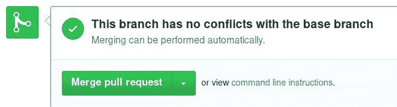

# 使用 GitHub 工作流进行协作

在第三章，*管理组织和团队*中，我们探讨了如何创建和管理组织和团队，这将进一步帮助你与他人协作。

GitHub 是一个出色的协作工具，因此，它基于其提供的功能和 Git 的强大能力创建了一个工作流。它将这个工作流命名为 GitHub 工作流([`guides.github.com/introduction/flow`](https://guides.github.com/introduction/flow))。

在这一章中，我们将学习如何使用分支和拉取请求，它们是 GitHub 最强大的功能。以下是我们将要讨论的内容：

+   学习拉取请求

+   同行评审与内联评论

+   合并拉取请求

+   提示与技巧

# 学习拉取请求

拉取请求是 GitHub 最重要的功能之一，它让 GitHub 发展成今天的样子。它在 2008 年初被引入，并且从那时起在项目中得到了广泛应用。

尽管项目设置中的其他所有功能（例如问题和维基）都可以被禁用，但拉取请求始终是启用的。

# 为什么拉取请求是一个强大的工作工具

无论你是在进行一个只有你自己参与的个人项目，还是在一个有来自全球各地贡献者的大型开源项目中，使用拉取请求（pull requests）肯定能让你的工作变得更加轻松。

可以将拉取请求看作是提交的块，而 GitHub 的用户界面帮助你清晰地可视化即将合并到默认分支或你选择的分支的内容。拉取请求可以通过增强的不同视图进行审查。你可以通过 GitHub 上的一个简单按钮轻松地撤销它们，并且在合并之前可以进行测试，前提是仓库中启用了 CI 服务。

**CI** 代表 **持续集成**。有关更多细节，你可以参考 GitHub 集成的应用程序，[`github.com/marketplace/category/continuous-integration`](https://github.com/marketplace/category/continuous-integration)。

# 分支与拉取请求之间的联系

分支与拉取请求之间有一种特殊的联系。在这种联系中，如果你在仓库中推送一个新分支，GitHub 会自动显示一个按钮来创建新的拉取请求。正如我们在接下来的章节中将探讨的，这与 GitHub 工作流紧密相关，GitHub 使用一些特殊的术语来描述*从*分支和*到*分支。根据 GitHub 的文档：

*Base 分支是你认为应该应用更改的地方，Head 分支是你希望被应用的分支。*

所以，在 GitHub 的术语中，head 是你的分支，而 base 是你希望合并到的分支。

# 在项目中直接创建分支 – 共享代码库模型

GitHub 称之为共享仓库模型，这是指你将新分支直接推送到源仓库。从那里，你可以通过比较分支来创建新的拉取请求，正如我们将在接下来的章节中看到的那样。

当然，要能够推送到仓库，你必须是该仓库的所有者或合作者；换句话说，你必须拥有写权限。

# 在你的分叉中创建分支——分叉和拉取模型

分叉的仓库与它们的父仓库之间有一种关系，GitHub 用这种关系来比较它们的分支。分叉和拉取模型通常用于那些没有写权限但希望贡献的项目。

在分叉一个仓库后，你将分支推送到你的分叉，并在父仓库中创建一个拉取请求，要求其维护者合并这些更改。这是为开源项目贡献代码时常用的做法。你不会直接访问他们的仓库，但由于它是开源的，你可以分叉该公共仓库并在自己的副本上进行工作。

# 如何创建并提交拉取请求

有很多方法可以发起创建拉取请求，我们将在接下来的章节中看到。

最常见的方法是将分支推送到你的仓库，并让 GitHub 的界面引导你。我们首先来探索这个选项。

# 使用“比较并发起拉取请求”按钮

每当新分支被推送到仓库时，GitHub 会显示一个快速按钮来创建拉取请求。实际上，你将被带到比较页面，正如我们将在下一节中探讨的那样，不过有些值已经为你填写好了。

比如说，我们可以创建一个名为`add-gitignore`的新分支，在这个分支上我们将添加一个`.gitignore`文件，内容如下：

```
git checkout -b add-gitignore
echo 'password' > .gitignore
git add .gitignore
git commit -m 'Add .gitignore'
git push origin add-gitignore
```

接下来，前往你的仓库主页，你会注意到“比较并发起拉取请求”按钮：


从这里开始，如果你点击这个按钮，你将被带到比较页面。请注意，我是按照共享仓库模型将分支推送到我的仓库，因此 GitHub 会这样欢迎我：


如果我使用分叉和拉取仓库模型会发生什么呢？为此，我创建了另一个用户来分叉我的仓库，并按照相同的步骤添加一个名为`add-gitignore-2`的新分支，并做出相同的更改。从这里开始，当你将分支推送到你的分叉时，无论你是在你的分叉页面还是在父仓库页面，都会看到“比较并发起拉取请求”按钮。

如果你访问你的分叉，界面会是这样的：


如果你访问父仓库，以下截图将会出现：


在最后的这种情况下，你可以看到这个分支来自哪个用户（axil42:add-gitignore-2）。

无论哪种情况，当使用分叉和拉取模型时，点击“比较并发起拉取请求”按钮将带你到比较页面，页面上有略微不同的选项：


由于你正在跨分叉进行比较，因此有更多的细节。特别是，你可以看到基础分叉和分支，以及你拥有的头部分叉和分支。

GitHub 会将你仓库中设置的默认分支视为你想要合并到的分支（基础分支），当“创建拉取请求”按钮出现时。

在提交之前，让我们看看你可以用来创建拉取请求的另外两种选项。如果你愿意，可以跳到 *提交拉取请求* 部分。

# 直接使用比较功能

如上一节所述，**比较与拉取请求**按钮会带你进入比较页面，并提供一些预定义的值。该按钮在你推送新分支后会出现，并且只会出现短暂的时间。在本节中，我们将看到如何直接使用比较功能来创建拉取请求。

你可以通过点击仓库主页面上分支下拉列表旁的“新建拉取请求”按钮来访问比较功能：


这非常强大，因为你可以在分叉之间进行比较，或者在同一仓库中几乎比较任何东西——分支、标签、单个提交和时间范围。

当你进入比较页面时，默认页面如下；你开始时是将你的默认分支与 GitHub 进行比较，提出一个最近创建的分支列表供选择并进行比较：


为了进行比较，基础分支的提交必须早于你要比较的提交。

在这里，如果我选择 `add-gitignore` 分支，GitHub 会将其与 master 进行比较，并显示出差异，同时提示它可以无冲突地合并到基础分支中。最后，你可以创建拉取请求：


请注意，我在自己的仓库中使用了比较功能。当在一个是其他仓库分支的仓库中进行比较时，比较功能会略有变化，并且自动包含更多选项，正如我们在上一节中所看到的那样。

如你所注意到的，**新建拉取请求快捷按钮**只是手动使用比较功能的快捷方式。如果你想对比较的仓库和分支有更多细致的控制，请直接使用比较功能。

# 使用 GitHub 网页编辑器

到目前为止，我们已经看到了启动拉取请求的两种最知名的方法。还有第三种方式：使用 GitHub 完全提供的网页编辑器。这对于那些不太熟悉 Git 和终端的人非常有用，也可以被更高级的 Git 用户用来快速提出变更。

一如既往地，根据你使用的模型（共享仓库或分叉与拉取），流程会稍有不同。让我们首先探索使用网页编辑器的共享仓库模型流程，也就是编辑你拥有的仓库中的文件。

# 共享仓库模型

首先，确保你在你希望从中分支的分支上；然后，前往你希望修改的文件，点击带有铅笔图标的编辑按钮：


对该文件进行所需的更改，添加适当的提交信息，并选择“创建新分支”，并为新分支命名。默认情况下，分支名称为 `username-patch-i`，其中 `username` 是你的用户名，`i` 是从 `1` 开始递增的整数。连续对文件的编辑会创建 `username-patch-1`、`username-patch-2` 等分支。在我们的例子中，我决定为该分支取一个自己喜欢的名字：


准备好后，点击“提议文件更改”按钮。从这一刻起，分支会随你所做的文件编辑而创建。即使你关闭下一页，你的更改也不会丢失。我们暂时跳过拉取请求提交，来看一下分支与拉取请求模型是如何工作的。

# 分支与拉取请求模型

在分支与拉取请求模型中，你会将仓库进行分叉，并从你在分叉仓库中所做的更改提交拉取请求。在使用网页编辑器的情况下，需要注意的是，为了让 GitHub 自动识别你希望在父仓库中执行拉取请求，你必须从父仓库启动网页编辑器，而不是从你的分叉仓库启动。在以下截图中，你可以看到在这种情况下发生了什么：


GitHub 会通知你在你的仓库（分支）中创建一个新的分支，并包含新更改，以便提交拉取请求。点击“提议文件更改”按钮会带你进入提交拉取请求的表单：


与共享仓库模型相反，现在你可以看到被比较的基础仓库/分支。同时，注意到新分支的默认名称是 `patch-i`，其中 `i` 是递增的整数。在我们的例子中，这是第一个创建的分支，因此它被命名为 `patch-1`。

如果你希望能够自由命名分支，应该按照前述部分的共享仓库模型说明进行操作。按照这种方式，在你有写权限的分叉仓库中编辑文件，添加自己喜欢的分支名称，点击“提议文件更改”按钮以创建分支，然后在要求创建拉取请求时取消操作。然后你可以使用“新建拉取请求”快捷按钮，或直接使用比较功能向父仓库提议拉取请求。

使用网页编辑器时需要考虑的最后一件事是一次只能编辑一个文件的限制。如果你希望在 GitHub 为你首次编辑文件时创建的同一分支上进行更多更改，你必须先切换到该分支，然后再进行后续更改。如何切换分支？只需从下拉菜单中选择它，如下截图所示：


# 提交拉取请求

到目前为止，我们已经探索了启动拉取请求的各种方式。在本节中，我们将最终提交它。

拉取请求表单与创建新问题时的表单是相同的。更多详细信息，请参阅第一章，*问题追踪器的简要概述与使用*，以及*学习如何使用问题追踪器的强大优势*部分。

如果你对要发起拉取请求的仓库有写入权限，那么你就可以设置标签、里程碑和指派人。

拉取请求的标题会自动填写为该分支的最后一次提交消息，或者如果有多个提交，它会填写分支名。在任何情况下，你都可以根据需要进行修改。在以下截图中，你可以看到标题是从分支名称中获取的，GitHub 已经去除了特殊字符。从某种意义上来说，标题变得更具人性化：


如果需要，你可以添加可选的描述和图片。准备好后，点击创建拉取请求按钮。在接下来的部分中，我们将探讨同行评审如何工作，并最终合并拉取请求。

# 同行评审和内联评论

拉取请求的酷之处在于你可以清晰地看到即将合并的内容。你只会看到重要的变更，最棒的是你可以围绕这些变更展开讨论。

在前一部分，我们提交了拉取请求，以便进行审查并最终合并。假设我们正在与一个团队合作，他们加入进来讨论这些更改。让我们首先检查拉取请求的布局。

# 拉取请求的布局

每个拉取请求大致如下所示：


从前面的截图中，你可以看到拉取请求的具体编号。它就像是仓库中的标识符，并且与问题的计数没有分开。问题和拉取请求共享相同的 ID 计数器。所以，在上面的例子中，尽管这是我们的第一个拉取请求，但它被编号为#6；前面的五个是问题：


然后，会显示该拉取请求的状态（已打开）以及谁想要将多少次提交合并到哪个分支，来自哪个其他分支：


在我们刚才描述的信息下方，有四个标签：对话、提交、检查和更改的文件。在“对话”中，除了我们在接下来截图中看到的评论外，GitHub 还会添加与该拉取请求相关的事件信息。你可以看到动作和发生的时间。例如，看看下面的截图；即使是小的变更，如添加标签，也会被记录下来：


“对话”（Conversation）选项卡也是最终决策的地方。这里有合并拉取请求的按钮，你可以看到按钮的状态。如果按钮是绿色的，表示更改的文件与仓库中的文件没有冲突：



最后，评论表单与我们在第一章中探讨的“问题追踪器”是一样的，*简要的仓库概览与问题追踪器的使用*。你可以在这里留下关于拉取请求的任何评论。

提交（Commits）选项卡显示了该分支中的提交以及尚未合并到目标分支的提交。例如，`update-readme`分支有两个提交在`master`分支中不存在。GitHub 按时间顺序显示提交记录，并附带其他信息，如作者是谁，并提供提交的链接：


“检查”（Checks）选项卡专门用于与 GitHub 的 API 交互的外部服务，可以对拉取请求执行检查。可以是一个持续集成（CI）服务，用于测试代码，或者是一个检查拉取请求是否符合某些准则的服务。我们不会详细讨论这个内容，因为它是一个非常广泛的领域，超出了本书的范围，但你可以在 GitHub 的文档中了解更多内容，网址是[`help.github.com/articles/about-status-checks/#checks.`](https://help.github.com/articles/about-status-checks/#checks)

最后，“更改的文件”（Files changed）选项卡显示了此拉取请求中已更改的文件。有两种方式可以查看提交的差异。默认的方式是以统一方式查看更改，将新增和删除的内容显示在同一页面，如下图所示：


请注意，对于每个新增的行，GitHub 会用绿色背景色标记。相反，如果你删除了一些行，它们将以粉红色显示。这个练习留给你自己完成。

另一种方式是选择“拆分”（Split），GitHub 会以并排视图显示差异。在“Diff 设置”（Diff settings）下拉菜单下，有一个选项可以选择在拆分模式下查看更改。选择它并点击“应用”（Apply），然后重新加载页面以使更改生效：


在下一节中，我们将进一步探讨“更改的文件”选项卡，因为审核过程就是在这里进行的。

# 审核过程

为了让审核过程更容易跟进，处理大量提交和更改文件时有几个有用的功能。

“更改来源”（Changes from）下拉菜单很有用，如果你想查看某个单一提交或一系列提交所引入的更改：


旁边的“跳转到”（Jump to）下拉菜单列出了所有已更改的文件，您可以选择并跳转到其中一个文件：


当只有两个文件时，这看起来可能有些冗余，但如果有十几个文件，这个功能就非常强大，因为你不需要手动滚动页面寻找你要的内容。

此外，当你向下滚动长页面时，这个菜单会变得固定，以免你需要滚动回到页面顶部：


GitHub 支持内联评论，因此你可以在每一行已更改的代码下留下评论，如在“文件更改”标签中看到的那样。当你将鼠标悬停在某一行时，你会看到一个交叉图标，如下图所示；点击它，评论表单将会出现：


在写评论时，你可以选择立即提交为单条评论，或者开始一个审查。当你开始一个审查时，评论会被提交，但不会通知仓库成员。这样，你可以批量提交评论，并一次性通知提交拉取请求的人。以下示例中，提议修改的文件上有两条评论：


请注意，它们处于待处理状态，等待最终提交以供审查。一旦你准备好结束审查，可以点击评论下方的“完成审查”按钮，或者使用“审查更改”下拉菜单。


从这里开始，你有三个选择。第一个是仅仅评论，并且不要求提交者做任何其他事情。第二个选择是批准更改并留下反馈。最后一个选择是请求更改，通常是在你评论的行中。你可以选择性地留下审查总结，并点击**提交审查**。

在差异上有一些评论和请求更改后，我们可以看到几件事情。首先，内联评论会计入整体对话，因此“对话”标签应显示该数量。此外，由于请求了更改，这一点会在底部的拉取请求小部件中显示：


作为拉取请求的提交者，你可以点击**查看审查**链接，查看审查评论，或者点击**驳回审查**，如果你认为已经处理了所有评论。在后者的情况下，你需要添加一个评论，说明你的操作理由。

# 修正错误

到目前为止，我们已经看到对话是如何开始的，但如果你所做的更改需要一些调整才能被视为准备好合并时会发生什么呢？

在这种情况下，你可以将新的提交推送到与拉取请求关联的分支，GitHub 会接收这些更改并进行修正。新更改会显示出来，并且可以进一步反馈。在*审查过程*部分，我的恶魔双胞胎用户 `axil42` 提出了一个关于提交了错误行的担忧。现在我们将做一个新的提交并推送到 `update-readme` 分支，看看会发生什么：

```
git checkout update-readme
sed -i 's/Test change/For more info, check the wiki/' README.md # replace text
git add README.md
git commit -m 'Correct line in README.md'
git push origin update-readme
```

返回到 GitHub，发生了三项更改。首先，另一个提交被添加到了“提交”标签。然后，在“文件更改”标签中，由于评论依赖的那一行被删除，评论不再显示。相反，你可以看到在“对话”标签中，这个特定的讨论被标记为过时：


如果您在最后一个提交推送时恰好处于“已更改文件”选项卡，GitHub 会通知您关于更改的内容，并提示您刷新页面：


# 合并拉取请求

在对话进行后，做出了更改，并且同行评审按照预期工作，所以现在是最终合并拉取请求的时候了。

如果您没有合并拉取请求的权限，您应该看到以下结果：


另一方面，具有写入权限的所有者或协作者也可以合并拉取请求。在这种情况下，您应该看到绿色的“合并拉取请求”按钮。点击旁边的箭头，您可以在合并之前选择合并方法。共有三种选项，默认的方式是创建一个合并提交。选择您需要的方式，然后点击合并：


按下这个按钮并不会立即合并，而是会再给您一次确认的机会：


这个合并的提交信息是加粗的部分，而下面可以编辑的则是扩展的提交信息，默认情况下会抓取拉取请求的标题。在扩展的提交信息中，您可以引用带有特殊含义的问题编号。请在本章的*技巧与窍门*部分中阅读更多内容，了解如何通过拉取请求自动关闭问题。

一旦合并完成，您会看到绿色的图标变为紫色。这表示拉取请求已被合并。

# 合并拉取请求后删除/恢复分支

为了保持一切整洁，GitHub 提供了一个简单的按钮，可以在拉取请求合并后删除已合并的分支：


完成删除后，GitHub 会将其作为一个操作事件。如果您改变了主意，您可以随时使用“恢复分支”按钮将已删除的分支恢复，如下图所示：


# 回退一个拉取请求

有时候您可能想回退一个拉取请求，GitHub 使这一操作变得非常简单。合并完成后，合并操作旁边会有一个“回退”按钮：


按下这个按钮会创建一个新的拉取请求，其中包含与之前拉取请求相反的提交。

# 技巧与窍门

到目前为止，我们已经探索了大部分拉取请求的功能。接下来我们来看看一些进一步发挥其功能的方式。

# 通过提交信息关闭问题

在第一章，*简要的仓库概述与问题追踪器的使用*部分，您学习了如何在问题追踪器中引用问题。扩展此功能，您可以在提交信息中引用问题编号，以便在提交合并到默认分支时关闭一些问题。

为了触发此操作，你需要使用一些关键词。例如，提交消息中的 `Closes #42` 会在该提交与默认分支合并时关闭问题 42。

根据 GitHub 文档，以下关键词将通过提交消息关闭一个问题：

+   关闭

+   关闭

+   已关闭

+   修复

+   修复

+   已修复

+   解决

+   解决

+   已解决

以一个开放的问题为例，假设如下所示，并记下它的编号，这里是 2：


然后，进行一次提交，在其消息中使用前面提到的关键词，并引用前述问题编号。我们将遵循本章所学的 GitHub 流程，所以首先创建一个新分支：

```
git checkout master
git checkout -b fix-issue-2
```

为了举例说明，我修改了仓库中的一个文件，并提交了以下内容：

```
git commit -m 'Demo example of closing issues. Closes #2'
git push origin fix-issue-2
```

然后，打开一个新的拉取请求来合并我们刚刚创建的分支，并按照本章所学进行合并。

回到问题跟踪器，你将不再看到问题`#2`在打开的问题中。相反，去查看已关闭的问题，你会发现问题`#2`已经关闭。GitHub 提供了所有必要的信息：


欲了解更多关于通过提交消息关闭问题的信息，请查看 GitHub 的文档：[`help.github.com/articles/closing-issues-using-keywords/`](https://help.github.com/articles/closing-issues-using-keywords/)。

# 拉取请求中的任务列表

提交拉取请求时的一个很棒的功能是任务列表。一个进行中的拉取请求意味着你正在处理一个特定的功能/错误等等，但有许多更改不能一次性提交，而且你还需要有人在你进行时进行同行评审。

在这种情况下，你会发现任务列表非常实用。我们来创建一个拉取请求，并在描述框中添加以下内容：

```
- [ ] First item
- [ ] Second item
- [ ] Third item
  - [ ] Fourth nested item
  - [ ] Fifth nested item
- [x] Sixth item , closes #2 (marked as resolved)
```

结果将是一个带有复选框的列表，你可以在完成任务时手动勾选/取消勾选这些项目：


如果你前往拉取请求跟踪器查看概览，你将看到任务列表中显示以下拉取请求：


这对于交叉引用也有效，由于我们在任务列表中引用了问题 2，这将会记录在该问题中：


任务列表也可以存在于问题中。

# 正在下载拉取请求的差异

对于补丁和差异文件的忠实粉丝，GitHub 提供了一个很棒的功能，你可以查看并下载拉取请求所引入的更改，格式为补丁文件。只需在拉取请求的 URL 后加上 `.patch` 后缀。例如， [`github.com/github-essentials/github-essentials-v2/pull/6`](https://github.com/github-essentials/github-essentials-v2/pull/6) 就会变成 [`github.com/github-essentials/github-essentials-v2/pull/6.patch`](https://github.com/github-essentials/github-essentials-v2/pull/6.patch)。这个文件的内容包括拉取请求的所有提交。

# 您的所有开放拉取请求的全球列表

在顶部搜索栏旁边，有一个名为“拉取请求”的链接，点击后会带您到一个页面，您可以在该页面找到所有打开的拉取请求。直接访问[`github.com/pulls`](https://github.com/pulls)以查看此页面。

# 使用网页编辑器添加 LICENSE 文件

就像您可以编辑已经存在的文件一样，您也可以创建新文件。在这种情况下，我们想要添加一个许可证文件，GitHub 提供了多种选择方式。在您的仓库首页，点击“代码”选项卡下的“创建新文件”按钮：


在下一页中，输入 `LICENSE`，以便出现“选择一个许可证模板”按钮：


点击它，然后从 GitHub 提供的选项中选择一个许可证。完成后，点击“审查并提交”：


在下一步中，您需要将更改直接提交到默认分支，或者创建一个拉取请求。一旦更改合并，如果您导航到仓库的主页，您将看到一个指向您刚刚提交的许可证文件的链接：


这里有一个彩蛋。您可以使用英国式的 `LICENCE` 或美国式的 `LICENSE`。GitHub 足够聪明，能够识别这种语言差异，实际上它甚至不在乎字母的大小写。值得一提的是，输入 `LiCENce` 或 `liCEnSe` 仍然被视为相同！最后，单词 `copying` 也被视为许可证的同义词，因此之前的示例同样适用于这个词。

# 使用网页编辑器创建新目录

除了创建新文件，您还可以通过网页编辑器创建新目录。只需点击创建新文件按钮，像我们在之前选择许可证的技巧中演示的那样，然后输入以斜杠（`/`）结尾的目录名称。您可以根据需要重复此过程。

唯一的警告是空目录不会被 Git 识别，进而也不会被 GitHub 识别，因此如果您希望提交此更改，必须在目录中添加一个文件。

# 总结

在这一章中，我们探讨了 GitHub 工作流以及执行拉取请求的各种方式，以及 GitHub 提供的多种功能，使得这一工作流更加顺畅。这就是大多数开源项目在有几十个贡献者参与时的工作方式。

在下一章中，我们将学习如何制作仅托管在 GitHub 上的漂亮静态网页，并了解 GitHub 为每个项目提供的分析工具。
