# 第五章：GitHub Pages 和网络分析

在本章中，你将学习如何围绕你的项目构建网页，这些网页将免费托管在 GitHub 上，并使用 Jekyll（一个静态站点生成器）或你提供的 HTML 页面。

在继续探索 GitHub 功能时，接下来是可视化仓库数据的功能。GitHub 实现了一些很棒的功能，例如可以描绘提交活动、仓库的流量情况以及在网络图中的提交历史等图表。

我们将讨论以下内容：

+   GitHub Pages

+   网络分析

+   提示与技巧

让我们开始吧！

# GitHub Pages

2008 年底，GitHub 宣布了 GitHub Pages ([`github.com/blog/272-github-pages`](https://github.com/blog/272-github-pages))，一个静态网站托管服务。近年来，静态网站数量大幅增加，而 GitHub 在其中起到了重要作用。静态网站是由 HTML、CSS 和 JavaScript 编写的网页构成的，不包含 PHP、Ruby 或 Python 等服务器端代码，也不需要数据库。

为了在 GitHub Pages 上创建一个功能性的网站，你必须遵循一些约定。让我们详细看看如何创建这些页面。

# 创建用户或组织页面

对于用户和组织，必须创建一个名为`username.github.io`的仓库，其中 `username` 是你的用户名或组织名称，文件必须推送到 `master` 分支。

创建一个以你的用户名命名的新空仓库。创建后，在本地克隆它并添加一个测试的 `index.html` 页面（将 `username` 替换为你的用户名）：

```
git clone git@github.com:username/username.github.io.git
cd username.github.io
echo 'Welcome to my first page!' > index.html
git add index.html
git commit -m 'Add the first webpage'
git push -u origin master
```

上传完成后，访问 `https://username.github.io`（其中 `username` 是你的用户名），查看结果。

就这样！你可以开始编写自己的 HTML 页面并推送到 GitHub。更改几乎是即时生效的。

# 创建项目页面

项目页面与用户/组织页面有所不同；你的网站源文件可以存放在以下三种位置之一：`gh-pages` 分支、`master` 分支，或 `master` 分支中的 `docs` 目录。你可以在仓库的设置中的 GitHub Pages 选项下选择你想使用的一个。

对于项目页面，如果仓库中有一个名为 `gh-pages` 的分支，那么它的 HTML 内容会被 GitHub 自动提供。最终，项目页面将通过 `https://<username>.github.io/<repositoryname>` 进行访问。

在这里，我将在 `github-essentials` 仓库中创建一个 `gh-pages` 分支，创建一个新的 `index.html` 文件，并提交并推送到 `gh-pages` 分支：

```
git checkout -b gh-pages
echo 'Welcome to my first project page!' > index.html
git add index.html
git commit -m 'Add index.html page'
git push origin gh-pages
```

一旦 `index.html` 被上传，它会立即在你页面的 URL 下渲染。由于我上传的是在我的用户名（`axilleas`）下的 `github-essentials` 仓库，我知道 URL 会是 [`axilleas.github.io/github-essentials`](http://axilleas.github.io/github-essentials)。

虽然你可以手动修改项目网站的内容，但 GitHub 提供了一个更好的自动化方法，可以一次性更新你的网页内容。请阅读以下章节，了解如何实现这一点。

# 选择一个主题来样式化你的页面

GitHub Pages 发布约四年后，GitHub 宣布新增了另一个功能——GitHub 页面生成器。

这是为你的项目快速搭建网站的一种简单方法，只需要几次点击。在每个仓库的设置中，有一个 GitHub Pages 部分，并有一个选择主题的选项：

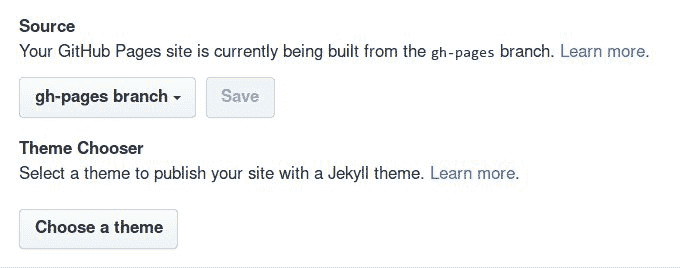

当你选择选择一个主题时，GitHub 会帮助你根据 `README.md` 文件创建一个单一的 HTML 页面，提供多种漂亮的布局供你选择，并有互动式的逐步指导。此操作仅适用于 `gh-pages` 或 `master` 分支中存在的 `README.md` 文件。如果 `README.md` 文件不存在，GitHub 会在你第一次选择主题时为你创建一个。

网站内容的格式是用 Markdown 编写的，我们在第二章《*使用 Wiki 和管理代码版本控制*》中探讨过。你可以使用它的标记语言定义标题和列表，添加链接等。

当你进入主题选择器时，你将能够从现有的布局中进行选择。每种布局都有一个固定的模式，布局中有指向你的仓库 URL 和 ZIP 或 TAR 文件下载的链接和按钮。准备好后，点击选择主题，几秒钟内网站布局就会改变：

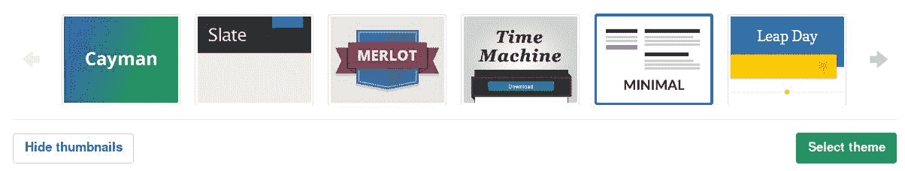

从现在开始，每次你更改 `README.md` 文件时，网站内容会自动更新发布。

每次选择主题时，一个 `_config.yml` 文件会被提交到你的仓库中，里面包含当前使用的主题信息。

如果你访问提交页面，你可以看到 GitHub 提供了一些关于你网站构建的有用信息。点击绿色勾选图标会带你进入网站：

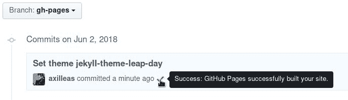

现在，既然你的网站已经上线，接下来我们来看看如何使用你自己的自定义域名。

# 使用自定义域名

你可以使用与 `user/org` GitHub 页面关联的自定义域名，而不是使用经典的 GitHub Pages URL。这意味着你可以告诉 GitHub，当有人访问 `www.mydomain.rocks` 时，它将显示在 `username.github.io` 下发布的内容。

首先，在您的 DNS 提供商处创建一个 CNAME 记录，将`www.mydomain.rocks`指向`username.github.io`。然后，进入您的仓库的`username.github.io`设置 > GitHub Pages，在 Custom domain 下添加您的域名，并点击保存。从现在起，每次访问`username.github.io`时，您将被重定向到`www.mydomain.rocks`。同样，`username.github.io/repository-name`下的项目页面也会被重定向到`www.mydomain.rocks/repository-name`。请注意，您的自定义域名将自动通过 HTTPS 提供服务。如果没有设置强制 HTTPS 选项，请确保您已设置：

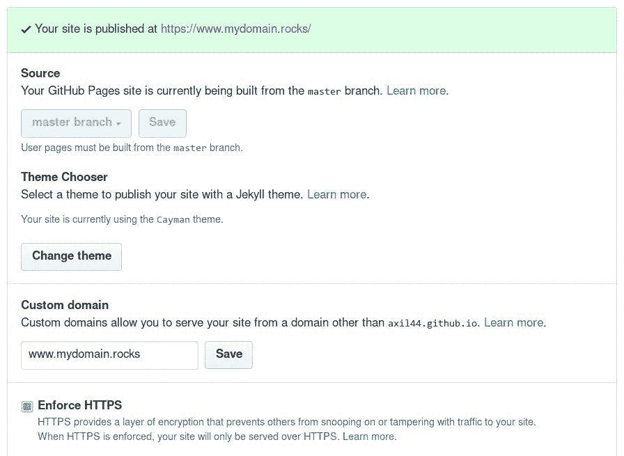

使用`www`子域名作为您的自定义域名，相比仅使用`mydomain.com`或其他子域名（如`blog.mydomain.com`），有一些优势。特别是，这样您会自动使用 GitHub 的 CDN，并且免受 DoS 攻击的威胁。有关可以使用的域名类型的更多信息，请访问 GitHub 的文档：[`help.github.com/articles/about-supported-custom-domains/`](https://help.github.com/articles/about-supported-custom-domains/)。

现在让我们探索如何利用静态站点生成器的强大功能，为您的网站创建更多内容。

# 介绍 Jekyll

到目前为止，我们已经学习了如何通过推送 HTML 文件或使用 GitHub 主题生成器为项目页面手动创建网页。然而，还有一种更复杂的方式可以构建您的网站。

每天，越来越多的人开始使用静态网站来处理他们的个人项目，甚至一些公司也用它来作为他们的主站点或博客平台。与使用服务器端语言（如 PHP）构建的站点相比，静态站点更快、更安全。另一方面，手动维护一个静态站点并完全手动更新其内容是一个繁琐的任务。

由于这些原因，出现了所谓的静态站点生成器：它们是使用模板、标记语言和配置文件的应用程序，并将这些转换为纯 HTML 页面。

GitHub Pages 使用 Jekyll，它是用 Ruby 编写的静态站点生成器，是最顶尖的开源静态站点生成器之一([`www.staticgen.com/`](https://www.staticgen.com/))。

要使用 Jekyll，您需要访问终端。

# 安装 Jekyll

要安装 Jekyll，请参考其文档：[`jekyllrb.com/docs/installation/`](https://jekyllrb.com/docs/installation/)。如果遇到任何问题，请务必访问他们的故障排除指南：[`jekyllrb.com/docs/troubleshooting/#installation-problems`](https://jekyllrb.com/docs/troubleshooting/#installation-problems)。

安装完成后，您可以通过在终端中运行`jekyll`来检查是否安装成功。您应该看到类似如下的输出：

```
jekyll 3.8.2 -- Jekyll is a blog-aware, static site generator in Ruby

Usage:

 jekyll <subcommand> [options]

Options:
 -s, --source [DIR]  Source directory (defaults to ./)
 -d, --destination [DIR]  Destination directory (defaults to ./_site)
 --safe         Safe mode (defaults to false)
 -p, --plugins PLUGINS_DIR1[,PLUGINS_DIR2[,...]]  Plugins directory (defaults to ./_plugins)
 --layouts DIR  Layouts directory (defaults to ./_layouts)
 --profile      Generate a Liquid rendering profile
 -h, --help         Show this message
 -v, --version      Print the name and version
 -t, --trace        Show the full backtrace when an error occurs

Subcommands:
 docs 
 import 
 build, b              Build your site
 clean                 Clean the site (removes site output and metadata file) without building.
 doctor, hyde          Search site and print specific deprecation warnings
 help                  Show the help message, optionally for a given subcommand.
 new                   Creates a new Jekyll site scaffold in PATH
 new-theme             Creates a new Jekyll theme scaffold
 serve, server, s      Serve your site locally
```

# 使用 Jekyll 定制您的页面

现在我们将创建一个新的基础站点，这是由`Jekyll`提供的，以便开始在其上进行构建。可以使用`jekyll new path/to/site`命令来实现：

```
jekyll new website
```

进入新创建的目录并列出文件：

```
cd website
ls -la
```

你应该能看到以下目录和文件：

```
.gitignore
404.html
Gemfile
Gemfile.lock
_config.yml
_posts/
about.md
index.md
```

现在，让我们在本地构建站点，看看效果如何：

```
jekyll serve --watch
```

打开浏览器，访问 `http://127.0.0.1:4000`，你应该能看到默认的 Jekyll 模板网站：

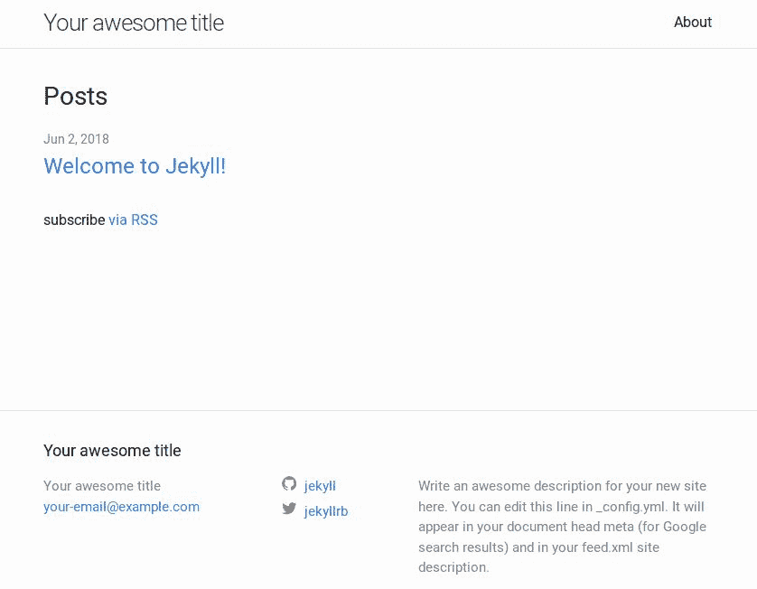

`–watch` 选项启用了文件的自动生成，这样你就不需要每次都停止和启动服务器。然而，如果你编辑了 `_config.yml`，你必须通过停止并重新运行 `jekyll serve` 命令来重启服务器。

从此以后，你可以开始在新网站上进行修改。首先，试着编辑 `_config.yml` 文件并更改一些选项。更改标题、描述和电子邮件后，停止并重新启动 Jekyll，以查看更改效果。

当你对更改满意时，便可以将文件推送到 GitHub 仓库的 `master` 分支（用于用户/组织页面），或者 `gh-pages` 分支（用于项目页面）。对于一个全新的项目，你需要在 `website` 目录中初始化一个新的 Git 仓库；或者，对于一个现有项目，你需要将 Jekyll 生成的所有文件移动到现有仓库中。

在下面的示例中，我将假设是从零开始创建一个新的用户页面。首先，你需要在 GitHub 上创建一个新的空的 `username.github.io` 仓库。接下来，在 `website` 目录中，输入以下命令：

```
git init
git add .
git commit -m 'Init commit using Jekyll'
git remote add origin git@github.com:username/username.github.io.git
git push origin master
```

几秒钟后，GitHub 应该会构建该站点，你可以访问你的用户页面 `username.github.io` 来确认一切正常。

对于项目页面，确保 `_config.yml` 文件中的 `baseurl` 设置为 `/repository-name/`，否则 CSS 文件将无法正确加载。

# 阅读更多关于 Jekyll 的信息

如你所见，我们只设置了 Jekyll 开发的基础。欲了解详细文档，请参考 Jekyll 官方网站 [`jekyllrb.com/docs/home/`](https://jekyllrb.com/docs/home/)。你可以在 [`github.com/jekyll/jekyll/wiki/sites`](https://github.com/jekyll/jekyll/wiki/sites) 找到一些使用 Jekyll 的站点。

其他有用的文章当然包括 GitHub 关于 Jekyll 的帮助页面：

+   [`help.github.com/articles/using-jekyll-with-pages/`](https://help.github.com/articles/using-jekyll-as-a-static-site-generator-with-github-pages/)

+   [`help.github.com/articles/using-jekyll-plugins-with-github-pages/`](https://help.github.com/articles/adding-jekyll-plugins-to-a-github-pages-site/)

# 网站分析

由于 GitHub 的特性，一个仓库包含大量的元数据，比如提交记录、贡献者、贡献的内容、贡献者的数量、分支的数量，甚至是不同文件的站点引用。

GitHub 提供了一些有用的图表和数据，你可以从中推导出你需要的信息，所有这些都在一个仓库的 Insights 标签页下。让我们来看看其中的内容。

# Pulse

Pulse 是一个仓库活动的概览。默认显示的是过去一周的数据，但你可以通过右侧的下拉菜单选择更改时间范围，选择 24 小时、3 天、1 周或 1 个月。

在这里，你可以获得合并和开放的拉取请求（pull request），以及开放和关闭的问题的高层次概览，此外还有该期间的主要提交者：

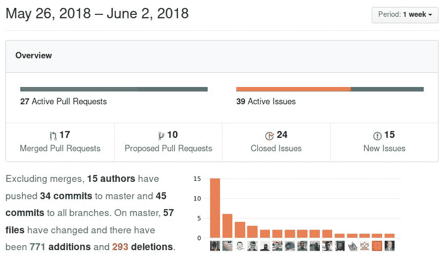

# 贡献者 – 添加/删除

在贡献者标签下，你可以查看项目的前 100 名贡献者的概览。该图表是通过仓库的默认分支的数据创建的，展示了从项目开始到当前的所有提交：

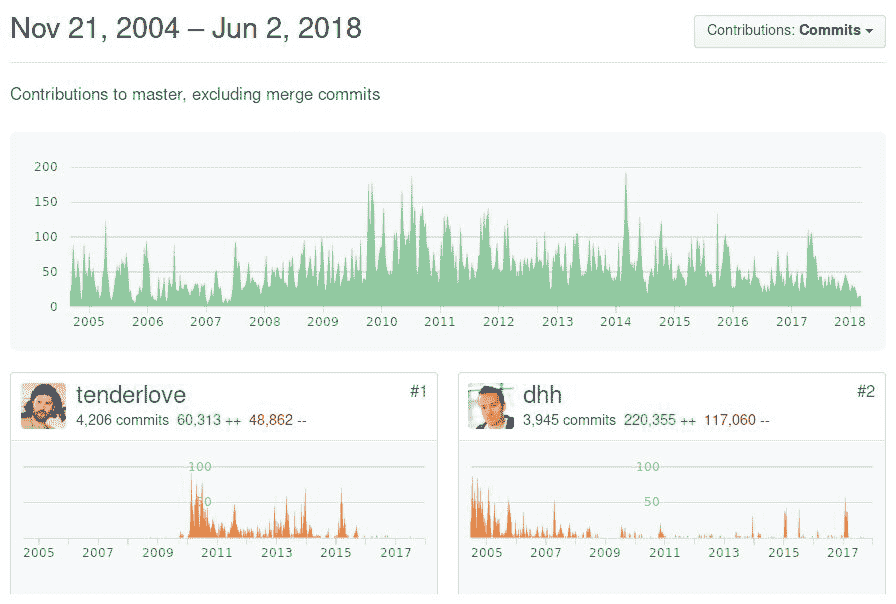

默认筛选条件是提交次数。如果你想查看谁做出了最多的添加或删除，可以通过右侧的“筛选贡献”下拉菜单切换筛选条件：

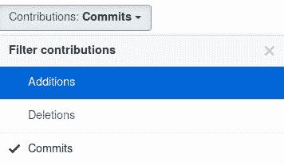

数据可以通过选择图表中的特定时间段来进一步微调。例如，要查看 2015 到 2016 年之间的贡献数据，你可以执行以下操作：

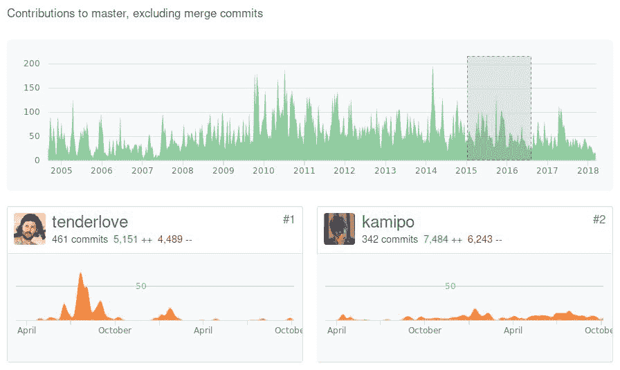

# 社区资料

在**社区**标签下，有一个清单，列出了你应该在你的仓库中拥有的最重要的内容，以便让外部贡献者更友好地参与。你可以从下面的截图中看到，已经有了`README`文件、贡献指南([`help.github.com/articles/setting-guidelines-for-repository-contributors/`](https://help.github.com/articles/setting-guidelines-for-repository-contributors/))和许可证文件([`help.github.com/articles/adding-a-license-to-a-repository/`](https://help.github.com/articles/adding-a-license-to-a-repository/))，但是缺少行为规范文件([`help.github.com/articles/adding-a-code-of-conduct-to-your-project/`](https://help.github.com/articles/adding-a-code-of-conduct-to-your-project/))。

在这种情况下，GitHub 会帮助你添加一个：

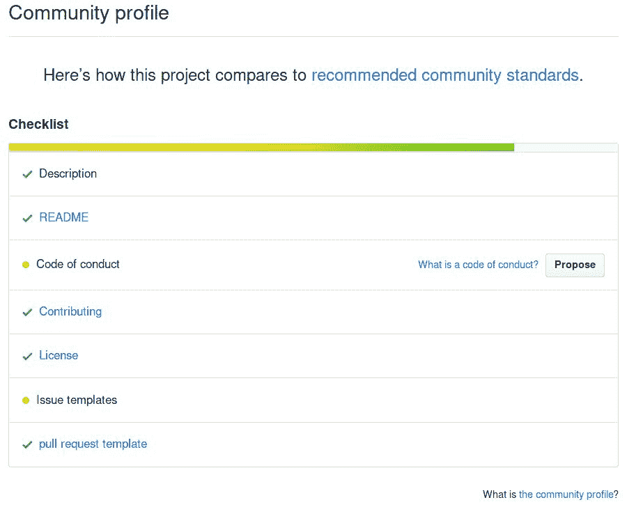

# 提交随时间变化

提交标签显示的是过去一年中的提交活动。在上方的条形图中，你可以查看每周的提交次数；如果点击其中一条柱状图，下面显示的图表会展示该周每天的提交次数：

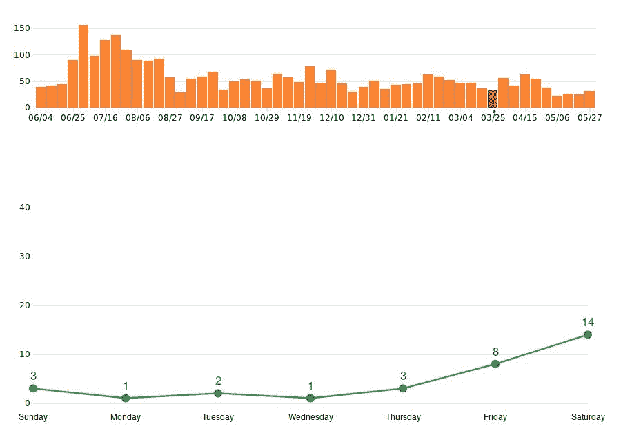

# 代码频率

“代码频率”标签显示的是每周的代码添加和删除：

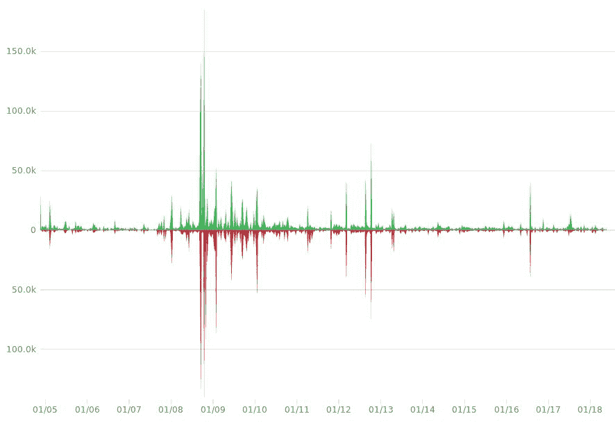

# 依赖关系图

在“依赖关系图”标签下，你可以看到项目的依赖关系以及依赖的库。在写本文时，GitHub 只支持 Ruby 和 JavaScript，并检查你的仓库中是否包含`Gemfile`和`package.json`文件。如果找到了，它会扫描并列出所有依赖项，以及它们的依赖项：

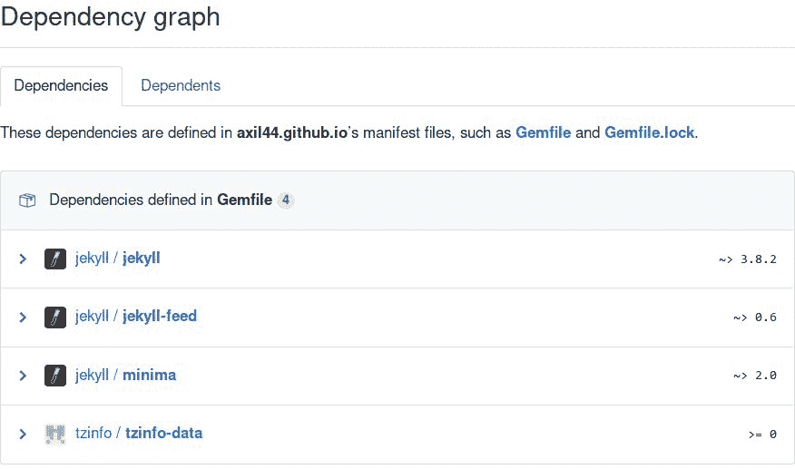

除了依赖关系列表，GitHub 还会在你使用的某个库发现漏洞时通知你。有关安全警告的更多信息，请阅读 [`help.github.com/articles/about-security-alerts-for-vulnerable-dependencies/`](https://help.github.com/articles/about-security-alerts-for-vulnerable-dependencies/)。

# 网络

网络图表展示了主仓库及其分叉的分支历史。你可以点击并拖动图表，或者使用键盘箭头查看更早的历史。要查看另一个分叉如何偏离其父仓库，点击所有者名称，你将被转到那个仓库的网络图表。

最后，你可以点击小圆点，你将被转到该特定的提交：

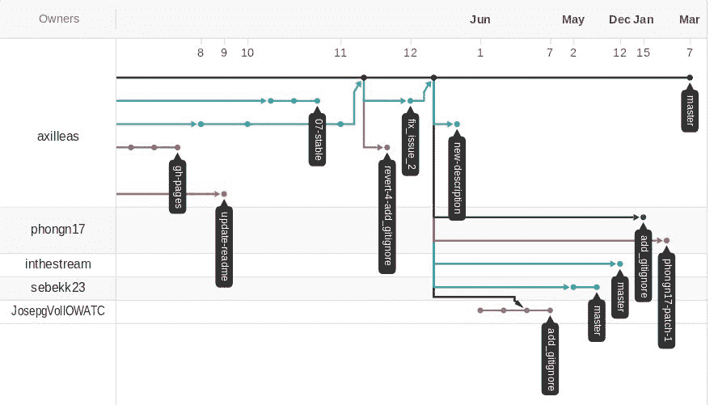

如果一个项目有很多分叉，GitHub 将无法渲染网络图表。

# Forks

Forks 标签，顾名思义，展示了你的仓库的分叉列表：

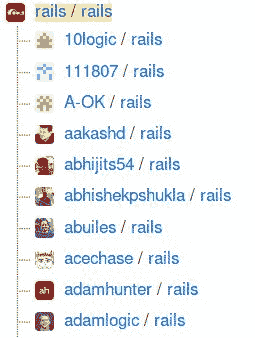

# 流量

流量标签是唯一只能由项目所有者或团队成员查看的标签。仓库的流量越大，可探索的数据也越多。通常，关于流量的信息会保留大约两周。

在第一个图表中，你可以看到一个仓库在该期间被克隆了多少次。将鼠标悬停在圆点上，你可以清晰地看到 GitHub 所称的克隆和独立克隆者的数量，每天都有：

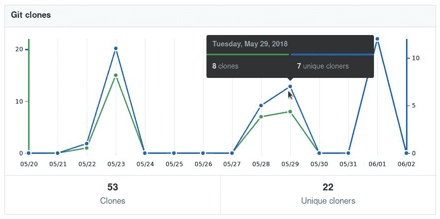

同样，你可以查看过去两周的总浏览量，以及你的仓库有多少独立访客：

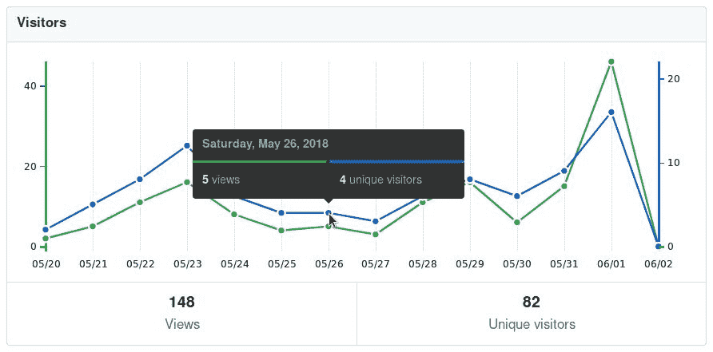

在这些图表的正下方是引用站点和流行内容。点击一个站点将带你到另一个页面，其中实际链接会显示。搜索引擎和 GitHub 自身的搜索被排除在外：

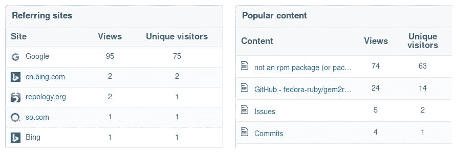

# 小贴士和技巧

下一个技巧是使用一些高级技术，这些技术利用了 GitHub API。

# 使用 Github Pages 的元数据与 Jekyll

GitHub 在使用 Jekyll 创建 GitHub Pages 时提供了一些元数据。这意味着你可以在 Jekyll 模板中添加某些关键词，这些关键词将自动渲染。

例如，你可以添加 `{{ site.github.project_title }}` 变量，GitHub 会自动填充项目标题。

按照本章的 *Jekyll 介绍* 部分中的示例，我们将向 Jekyll 网站添加一个新帖子。

首先，进入仓库目录，确保你在 `master` 分支并且是最新的：

```
git checkout master
git pull origin master
```

接下来，复制默认帖子以便作为参考（你网站中的日期将有所不同）：

```
cp _posts/2018-06-02-welcome-to-jekyll.markdown _posts/2018-06-02-testing-github-metadata-with-jekyll.markdown
```

然后，打开新文件并移除所有内容，保留以下内容：

```
---
layout: post
title:  "Welcome to Jekyll!"
date:   2018-06-02 11:42:46 +0200
categories: jekyll update
---
```

编辑它使其如下所示：

```
---
layout: post
title:  "Testing GitHub metadata with Jekyll"
date:   2018-06-02 00:00:00
categories: jekyll github
---

The name of this project is {{ site.github.project_title }} and owned by
{{site.github.owner_name}}.
```

提交你的更改并推送：

```
git add .
git commit -m "Add new post"
git push origin master
```

几秒钟后，帖子将出现在首页，并且其内容将被渲染变量填充：


你可以在[`help.github.com/articles/repository-metadata-on-github-pages/`](https://help.github.com/articles/repository-metadata-on-github-pages/)了解更多内容。

# 总结

在本章中，我们学习了 GitHub Pages 的目的以及上传内容的各种方式。对 Jekyll 的简要介绍希望能为进一步阅读和使用这个酷炫的静态网站生成器提供基础。

我们还介绍了 GitHub 提供的各种可视化图表和工具，这些都是每个仓库的一部分。

在第六章，《*探索用户和仓库设置*》中，我们将深入探讨用户和仓库设置。
