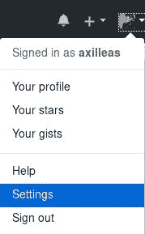

# 探索用户和仓库设置

在本章中，我们将探讨用户和仓库的最重要设置。您可以通过许多方式来个性化您在 GitHub 上的体验，并通过许多设置来改变您与团队成员共同工作的特定工作流程。

作为用户，您可以在用户设置页面上设置很多信息，例如关联多个电子邮件到您的账户，添加多个 SSH 密钥，并设置双因素认证。

同样地，一些仓库的功能可以通过其设置页面进行设置。例如，您可以启用或禁用 wiki 页面，或完全禁用问题跟踪器。

在本章中，我们将涵盖以下内容：

+   用户设置

+   仓库设置

+   小贴士

# 用户设置

您可以通过网页界面（在您头像的下拉列表中）访问您的用户设置页面，也可以直接访问 [`github.com/settings/profile`](https://github.com/settings/profile)：



例如，这是我的设置首页的样子：


我们将分析 GitHub 提供的最重要的设置。

# 个人资料

在个人设置下，您可以看到各种可以根据自己喜好自定义的选项。

个人资料设置是您可以填写个人信息以便他人了解您是谁的地方。可以把它看作社交。毕竟，GitHub 是极客们的 Facebook。

所有的个人资料信息都是可选填写的。您可以通过访问您的用户名页面 `https://github.com/<username>` 查看它会是什么样子。

# 设置多个电子邮件

每次提交都关联有一个电子邮件地址，GitHub 使用您在本地 Git 配置中设置的电子邮件地址来关联提交与您的 GitHub 账户。您可以向您的账户添加任意数量的电子邮件地址，但只能有一个主要地址。这是 GitHub 将向您发送任何通知的地址，并且在通过网页界面编辑和提交文件时将使用这个地址。

您可以通过访问 [`github.com/settings/emails`](https://github.com/settings/emails) 来添加或删除电子邮件并更改主要地址。在这个区域，您还可以选择是否将您的主要电子邮件地址显示给公众。如果您决定保持电子邮件地址的私密性，GitHub 将根据您的用户名分配一个电子邮件：`<username>@users.noreply.github.com`，这将在您通过浏览器编辑文件时使用。

在以下截图中，您可以看到当您有多个电子邮件时页面是什么样子的：


# 管理您的 SSH 密钥

GitHub 在使用 Git 时提供了两种用户认证方式。您可以使用 Git over HTTP 或 Git over SSH。有关 Git 协议的详细解释，请访问 [`git-scm.com/book/ch4-1.html`](https://git-scm.com/book/ch4-1.html)。

使用 HTTP 方式的 Git 时，每次进行更改都必须提供您的用户名和密码，除非您在 Git 中缓存了 GitHub 密码。有关更多详细信息，请参阅文章 [`help.github.com/articles/caching-your-github-password-in-git/`](https://help.github.com/articles/caching-your-github-password-in-git/)。

推荐且更安全的方式是使用 Git 通过 SSH。其概念是，您创建一个个人独特的 SSH 密钥对，将公钥上传到您的 GitHub 个人资料。您可以根据需要重复此过程，因为 GitHub 允许您将多个 SSH 密钥与帐户关联。这样，您可以为笔记本电脑使用一把密钥，为台式机或服务器使用另一把密钥。

要使用 Git 通过 SSH，仓库的远程 URL 必须如下所示：`git@github.com:USERNAME/REPOSITORY.git`。

在您的设置选项卡下，有 SSH 密钥选项。您可以通过 GitHub 用户界面导航到此选项，或直接访问 [`github.com/settings/keys`](https://github.com/settings/keys)。添加 SSH 公钥时，您必须为其指定一个标题，以便您记住此密钥的来源。在密钥区域，您粘贴公钥的内容。如您所见，GitHub 还提供了一些有用的信息，例如密钥的指纹、添加时间和最后使用时间：


您不能编辑密钥。如果您想设置一个不同的标题，您需要删除旧的密钥并重新添加它。

# 设置双因素认证

设置双因素认证为您的帐户提供额外的安全保护。仅使用密码登录可能容易受到安全威胁，因为攻击者只需要一条信息即可。

通过在您的手机或平板电脑上生成额外的认证代码来完成此操作。如果使用智能手机，您需要安装一个能够处理**基于时间的一次性密码**（**TOTP**）技术的应用程序。如果您在寻找开源应用程序，可以查看[`github.com/andOTP/andOTP`](https://github.com/andOTP/andOTP)。

要查看支持的应用程序列表，您可以阅读 Wikipedia 的文章 [`en.wikipedia.org/wiki/Time-based_Onetime_Password_Algorithm#Client_implementations`](https://en.wikipedia.org/wiki/Time-based_Onetime_Password_Algorithm#Client_implementations)。

如果您没有智能手机，GitHub 也可以通过短信发送认证代码。由于涉及传送费用，因此支持的国家/地区是有限的。查看您的国家/地区是否在此列表中：[`help.github.com/articles/countries-where-sms-authentication-is-supported/#supported-countries-for-sms-authentication`](https://help.github.com/articles/countries-where-sms-authentication-is-supported/#supported-countries-for-sms-authentication)。

您可以在安全页面启用双因素认证（2FA）。直接访问[`github.com/settings/security`](https://github.com/settings/security)并按下“设置双因素认证”按钮以开始设置 2FA。选择任一方法并按照屏幕上的指示操作。

设置完 2FA 后，如果访问安全页面，在您的设置下，您将看到 2FA 已启用：


在安全页面，确保点击链接保存您的恢复代码，并按照屏幕上的说明下载并将恢复代码保存在安全的位置。这些恢复代码共有 16 个，它们可以帮助您在某些情况下无法访问账户时恢复账户。如果手机丢失或被盗，它们能派上用场。每个恢复代码只能使用一次，您可以通过点击生成新恢复代码来生成新的一组代码。请保管好它们，最好将其加密存储在像 KeepassX 这样的应用程序中。

现在，每次您第一次从浏览器登录 GitHub 时，除了常规的用户名和密码外，您还需要输入从智能手机应用生成的授权代码或 16 个恢复代码中的一个。

# 仓库设置

在仓库级别有很多设置可以调整。要访问这些设置，请查找扳手图标：


# 更改仓库主页上显示的默认分支

仓库主页的默认分支是**master**。然而，有时您可能希望根据工作流程更改默认分支，正如我们在第四章，*使用 GitHub 工作流进行协作*中所看到的那样。

比如，假设 master 分支是您推送被认为是稳定且经过充分测试的代码，而另有一个名为 develop 的分支用于日常推送和测试新功能。根据这个假设，develop 分支的更新频率要高于 master 分支。从实际角度来看，您希望项目显得活跃；在首页显示一个每天都会更新的分支会更具吸引力。

在这种情况下，您可以前往仓库的**设置** > **分支**页面，并从下拉列表中选择您希望设为默认的分支：


选择后，点击更新并接受 GitHub 提供的提示。

当某人第一次克隆该仓库时，Git 会检出通过项目设置所设定的默认分支。

# 启用/禁用 Wiki

在第二章，*使用 Wiki 和管理代码版本控制*中，我们深入解释了为什么 Wiki 对项目是一个强大的资产。然而，也有一些情况下不需要使用 Wiki；例如，您可能会使用外部 Wiki。

GitHub 提供了三种关于 Wiki 可见性的选项：

+   启用 Wiki 并将其设为公开，使每个人都能拥有写入权限（默认设置）

+   启用 Wiki，但只有所有者和协作者具有写入权限（**仅限协作者编辑**）

+   完全禁用 Wiki

第一个行为是默认行为。您可以在“设置 > 选项”中的“功能”部分找到这些设置。

# 启用/禁用问题跟踪器

尽管 GitHub 的问题跟踪器是一个强大的协作和错误报告工具，但有时您可能希望使用其他跟踪器，如 Redmine、Jira 或 Bugzilla。

在这种情况下，GitHub 的问题跟踪器可以被禁用，这样您就不会在多个地方进行跟踪并失去控制。可以通过“设置 > 选项”中的“功能”部分实现。

即使禁用了问题功能，已创建的问题仍然会保留。只需重新启用问题功能，您的问题跟踪器将恢复如初。

# 添加协作者

通过添加协作者，您授予仓库的推送访问权限。一个仓库可以有多个协作者，没有数量限制。

访问设置中的“协作者”标签，开始输入用户的姓名，自动补全功能会智能地为您提供正在搜索的用户：


# 转移所有权 – 用户到组织

每个仓库都在命名空间下创建，无论是用户还是组织。在极少数情况下，如果您希望将仓库转移给另一个用户，可以在仓库设置中进行此操作。由于此操作被视为危险，因此您会在红色代码块中找到此设置，强调该任务的重要性。

基本上，转移有四种类型：

+   用户到用户

+   用户到组织

+   组织到用户

+   组织到组织

为了初始化转移，您必须提供仓库的名称和新所有者的用户名/组织名以确认：


点击“我明白”后，转移此仓库，会向新所有者发送一封确认邮件。新所有者确认后，过程将完成。

# 删除仓库

您可以通过点击“删除此仓库”按钮删除仓库及其所有设置，按钮位于“危险区域”下。请注意，这是一个破坏性操作，会清除您的仓库、问题跟踪器、任何拉取请求、Wiki，以及与之相关的所有内容。

按下“灾难按钮”后，系统会弹出一个确认框要求确认。出于安全原因，您必须提供仓库的名称以确认。下图中可以看到，除非提供正确的名称，否则删除按钮将处于不可用状态：


# 提示与技巧

您知道根据您所属的组织可以使用不同的电子邮件地址吗？您知道您的仓库占用了多少磁盘空间吗？如果不知道，请阅读以下章节，了解如何执行这些操作。

# 查找仓库的大小

如果你想知道你的仓库变得多大，可以访问[`github.com/settings/repositories`](https://github.com/settings/repositories)查看。记住，GitHub 也计算`.git`目录的大小，因此如果你有成千上万的提交，仓库的大小会大于其实际大小（实际大小指的是你在 GitHub 上看到的文件大小）。

例如，在写这本书时，`diaspora`仓库的大小似乎是 102 MB：


如果我删除`.git`目录，大小会小得多。让我们通过以下命令来测试一下：

```
git clone https://github.com/diaspora/diaspora
du -sh diaspora
rm -rf diaspora/.git
du -sh diaspora
```

删除`.git`目录后，大小降至几乎 14 MB！

# 微调电子邮件通知

如果你是多个组织的成员，可能希望为涉及某个特定组织拥有的仓库的通知使用不同的电子邮件。你可以通过访问[`github.com/settings/notifications`](https://github.com/settings/notifications)来实现；在自定义路由下，选择你希望接收通知的电子邮件。

# 摘要

完成本章后，你应该已经准备好填写详细信息，以建立一个公开的个人资料，任何有兴趣了解你的人都可以查看。你的账户属于你自己，因此应尽可能保障安全。到目前为止，你应该已经按照步骤通过 2FA 保障账户安全，确保自己稍微安全一些。

你还学习了如何配置仓库的设置，包括默认分支的设置以及启用或禁用诸如问题跟踪器和维基等功能。另一个需要记住的事情是如何向你的项目添加协作者，以及在需要时如何转移项目的所有权。

这些是需要考虑的最重要的设置，涉及用户和项目的设置，到了最后你应该感觉自己更有智慧了。
