# Git 入门指南

无论你是专业开发者还是业余爱好者，你可能都听说过版本控制的概念。你可能知道，添加新功能、修复破损的功能或者回溯到以前的状态是日常工作的一部分。

这需要使用一个强大的工具来帮助你管理工作，使你能够快速而无摩擦地在项目中移动。

市场上有很多此类工具，既有专有的也有开源的。通常，你会找到**版本控制系统**（**VCS**）和**分布式版本控制系统**（**DVCS**）。一些集中式工具的例子有**并发版本系统**（**CVS**）、**Subversion**（**SVN**）、**Team Foundation Server**（**TFS**）和**Perforce Helix**。而在分布式系统中，你可以找到**Bazaar**、**Mercurial**和**Git**。两者的主要区别在于，集中式系统中必须有一个远程服务器用于获取和存放文件；不用说，如果网络断开，你就麻烦了。而在分布式系统中，你可以有或者没有远程服务器（甚至可以有多个），但你也可以离线工作。所有的修改都会被本地记录，因此你可以在其他时间同步它们。如今，Git 是获得更多公众青睐的 DVCS，迅速从一个小众工具发展为主流。

Git 作为事实上的源代码版本控制工具迅速成长起来。它是**Linus Torvalds**的第二个著名作品，他在创建**Linux**内核之后，打造了这个版本控制软件来跟踪他数百万行代码的变化。

在本章中，我们将从最基础的开始，假设你的机器上还没有安装 Git。这本书面向那些从未使用过 Git 或者只是略微使用过的开发者，但他们害怕全身心投入其中。

如果你从未安装过 Git，那么这是你的章节。如果你已经有一个工作正常的 Git 环境，你可以快速浏览一下以确保一切正常。

# 第二版前言

欢迎来到 Git Essentials 的第二版！

这一段专为已经阅读过第一版的人士准备；在这里，你将了解到这个全新版本中的变化和新内容的概述。

首先，我们听取了你们的反馈：在第二章 *Git 基础 - 本地操作* 和 第三章 *Git 基础 - 远程操作* 中，我们将更深入地探讨一些技术细节，更准确地描述 Git 的内部工作原理；这需要读者额外的努力，但作为回报，他或她将获得对 Git 架构更加深刻的理解，从而有助于掌握这个强大工具的命令。

自 2015 年 4 月以来，Git 生态系统取得了巨大进步，但 Git 的核心始终不变。以下是一些新增功能和改进的未完整列表：

+   对 Windows 的重大改进（例如，完整的凭证子系统、性能提升等——参见[`github.com/git-for-windows/git`](https://github.com/git-for-windows/git)）。

+   Git 大文件存储（LFS）——来自 GitHub 的附加工具（参见[`git-lfs.github.com`](https://git-lfs.github.com)）。

+   微软同仁提供的 Git 虚拟文件系统（参见[`github.com/Microsoft/GVFS`](https://github.com/Microsoft/GVFS)）。

+   `git worktree`命令和功能。工作树是 Git 2.5 中首次引入的一个功能，它让你可以在不同目录中同时检出并处理多个仓库分支——参见[`git-scm.com/docs/git-worktree`](https://git-scm.com/docs/git-worktree)。

+   许多常用命令得到了改进和新增了选项，改进内容太多，无法一一列举。

所以这本书的目标是让你开始使用版本控制，并学习如何熟练地操作它。

开始吧！

# 安装 Git

Git 是开源软件。你可以从[`git-scm.com`](http://git-scm.com/)免费下载安装，在那里你可以找到适用于所有常见环境（GNU-Linux、macOS 和 Windows）的安装包。写本书时，Git 的最新版本是 2.11.0。

# 在 GNU-Linux 上安装 Git

如果你是 Linux 用户，你可能已经预装了 Git。

如果没有，你可以使用发行版包管理器来下载和安装它；`apt-get install git`命令或等效命令会在几秒钟内为你安装 Git 以及所有必要的依赖，如下图所示：

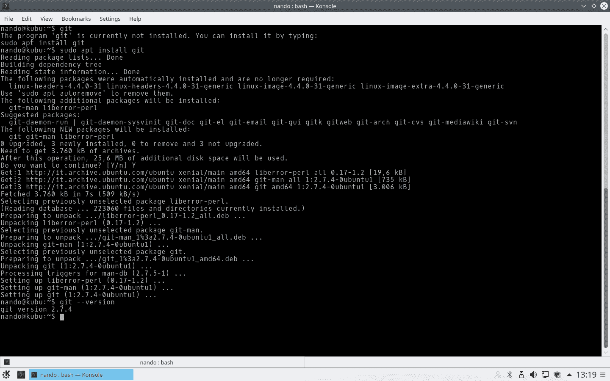

在 Kubuntu 上安装 Git

# 在 macOS 上安装 Git

在 macOS 上安装 Git 有几种方式。最简单的方式是安装*Xcode 命令行工具*。从*Mavericks*（*10.9*）开始，你只需要第一次在终端中尝试运行`git`。如果尚未安装，它会提示你进行安装，如下图所示：

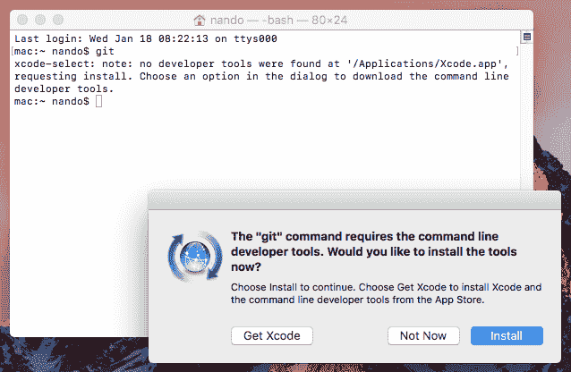

点击安装按钮将开始安装过程。

如果你想要一个更新版本，也可以通过`*.dmg`二进制安装程序进行安装，该安装程序可以从[git-scm.com](http://git-scm.com)下载（文件名中有*mavericks*，但可以忽略这个）。安装从互联网下载的软件包时，请留意 macOS 的安全策略；要允许执行，你需要按住*CTRL*并点击包图标来打开它：

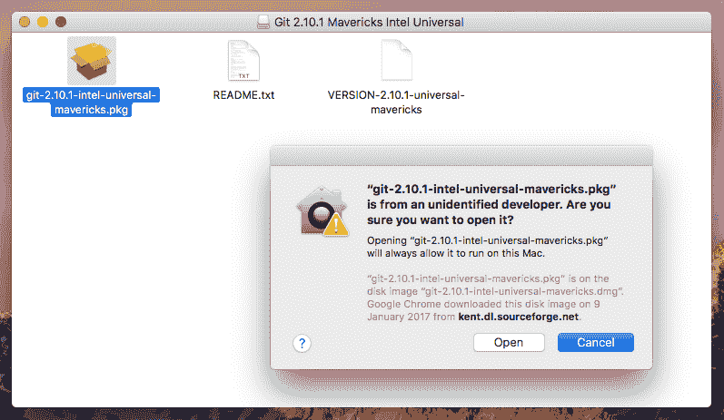

按住 CTRL 并点击，让 macOS 提示你打开包文件

安装完成后，安装过程非常简单——只需点击继续按钮并按照下面的截图中的步骤操作：

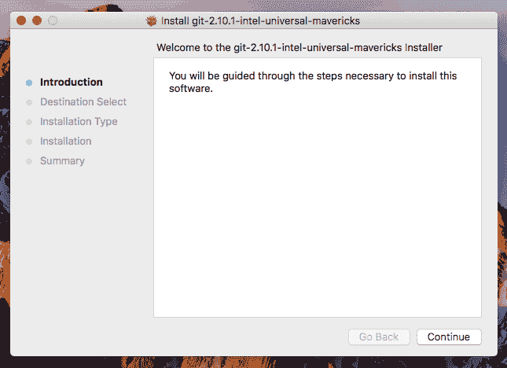

开始安装过程

点击继续按钮，然后继续；如以下图片所示的窗口将会出现：

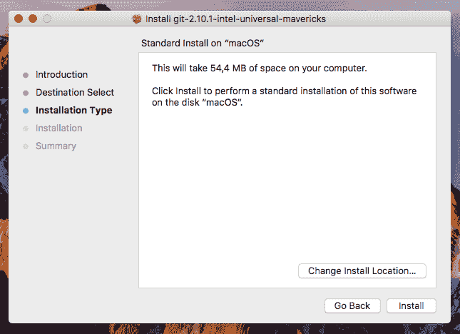

在这里，你可以更改安装位置，如果不确定，可以直接点击安装

现在点击安装按钮以开始安装。几秒钟后，安装将完成：

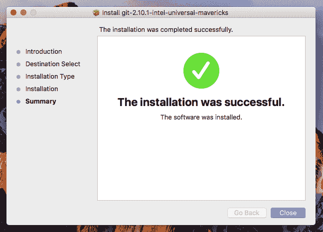

安装完成

# 在 Windows 上安装 Git

当你点击[`git-scm.com`](http://git-scm.com)上的`Download`按钮时，你将自动下载**x86**或**x64**版本的 Git。我不会详细介绍安装过程本身，因为它非常简单；我只会在以下截图中提供一些建议：

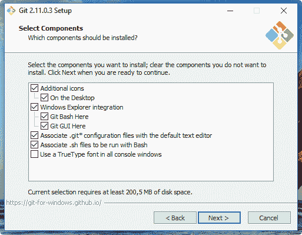

启用 Windows 资源管理器集成通常是有用的；通过右键点击上下文菜单，你可以在任何文件夹中方便地打开 Git 提示符。

你还应该启用 Git 在经典的 DOS 命令提示符下使用，如下图所示：

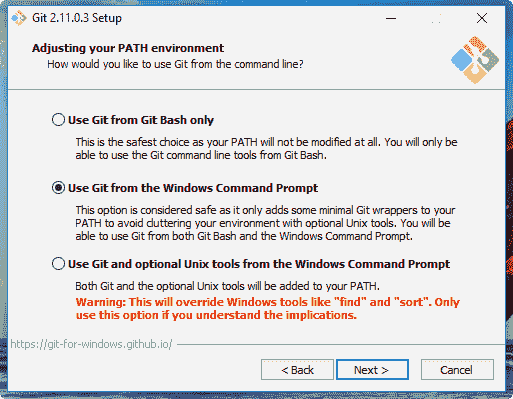

Git 提供了一个内嵌的、与 Windows 兼容的著名**Bash shell**（参见 [`en.wikipedia.org/wiki/Bash_(Unix_shell)`](https://en.wikipedia.org/wiki/Bash_(Unix_shell))），我们将广泛使用它。通过这样做，我们还将使 Git 可供第三方应用程序使用，如 GUI 等。当我们尝试一些 GUI 工具时，它将派上用场。

对行尾使用默认设置。这将避免你在处理多平台仓库时遇到的未来烦恼：

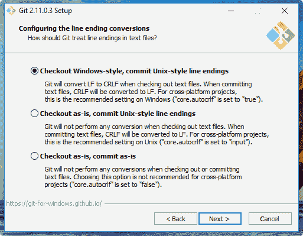

现在是选择 Git 终端模拟器的时候了；我推荐使用**MinTTY**（参见 [`mintty.github.io`](https://mintty.github.io/)），因为它是一个非常好的 shell，完全可定制且用户友好：

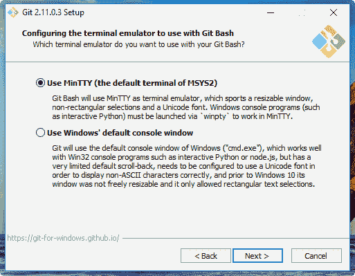

现在，让我们来看一下最新 Git 版本中的一些新特性——即文件系统缓存、Git 凭据管理器和符号链接：

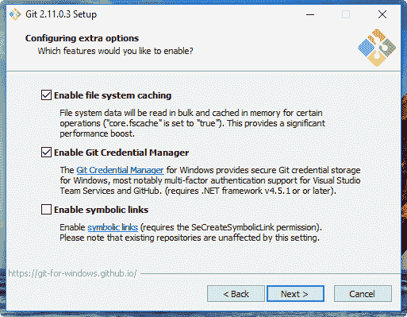

**文件系统缓存**在 Git for Windows v2.7.4（2016 年 3 月 18 日）之前被认为是实验性的，但现在它已稳定，并且自 Git 2.8 起默认启用。这是一个仅适用于 Windows 的配置选项，允许 Git 在处理底层读写操作时更快。我建议你启用此功能以获得最佳性能。

**Git 凭证管理器**（见[`github.com/Microsoft/Git-Credential-Manager-for-Windows`](https://github.com/Microsoft/Git-Credential-Manager-for-Windows)）自 v2.7.2 版（2016 年 2 月 23 日）起已包含在 Git for Windows 安装程序中。多亏了微软，现在你可以像在其他平台上一样轻松处理 Git 用户和密码。它要求.NET 框架 v4.5 或更高版本，并且可以完美集成到 Visual Studio（见[`www.visualstudio.com/`](https://www.visualstudio.com/)）和 GitHub for Windows（见[`desktop.github.com`](https://desktop.github.com)）图形界面中。我建议你启用它，因为它在工作时节省了一些时间。

**符号链接**是 Windows 从一开始就缺失的功能，即便在 Windows Vista 引入该功能时，它们也暴露了许多与 Unix-like 符号链接的不兼容问题。

无论如何，Git 及其 Windows 子系统可以处理这些（有一些限制），所以如果需要，你可以尝试安装此功能并在配置选项中启用它（默认情况下是禁用的）。不过现在，最好的做法是，如果你需要在 Windows 平台上工作，最好完全不要在你的仓库中使用它们。你可以在[`github.com/git-for-windows/git/wiki/Symbolic-Links`](https://github.com/git-for-windows/git/wiki/Symbolic-Links)找到更多信息。

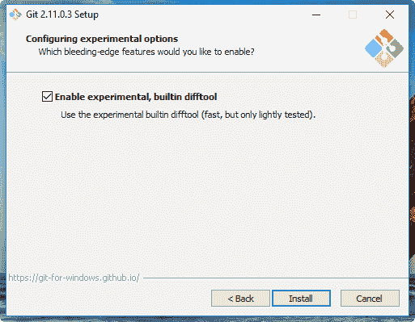

Git for Windows v2.10.2（2016 年 11 月 2 日）引入了**一个新的内置 difftool**，承诺能更快地进行差异比较。我每天都在使用它，觉得它相当稳定且快速。如果你想尝试，可以启用它，但本书的目的并不要求必须使用它。

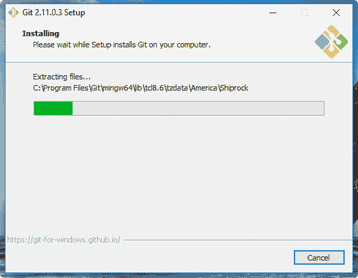

Git for Windows 将把它安装在默认的`Program Files`文件夹中，就像所有 Windows 程序一样。

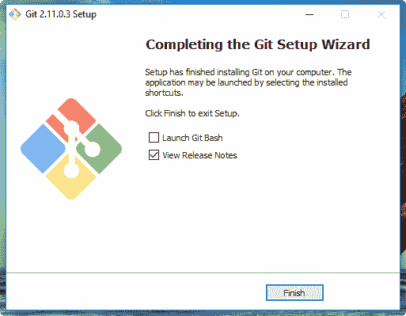

在整个过程中，我们将安装 Git，并且所有它的`*nix`伙伴将准备好使用它。

请注意查看发布说明，以了解最新版本的新增内容。

# 运行我们的第一个 Git 命令

从现在开始，为了方便起见，我们将以 Windows 作为参考平台。我们的截图将始终以该平台为准。无论如何，我们将使用的所有 Git 主命令都能在我们之前提到的平台上正常工作。

现在是测试我们安装的时刻。Git 准备好迎接挑战了吗？让我们来看看！

使用 Shell 集成，在桌面上的空白处右键单击，选择新的菜单项“Git Bash Here”。它将作为一个新的 MinTTY Shell 出现，为你提供一个适用于 Windows 的 Git-ready bash：

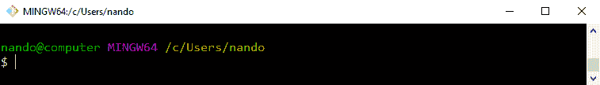

这是一个典型的 Bash 提示符：我们可以看到用户名 `nando` 和主机名 `computer`。接着是一个 `MINGW64` 字符串，它表示我们使用的实际平台，叫做 Minimalist GNU for Windows（请参见 [`www.mingw.org`](http://www.mingw.org)），最后是实际的路径，以更符合 `*nix` 风格的方式呈现，`/c/Users/nando`。稍后我们将更详细地探讨这个参数。

现在我们有了一个崭新的 Bash 提示符，只需输入 `git`（或者等效命令 `git --help`），如下面的截图所示：

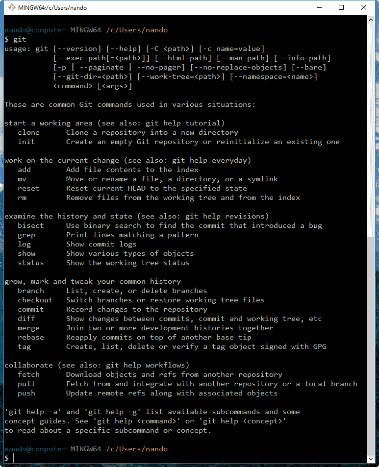

如果 Git 已正确安装，输入 `git` 而不指定任何内容，将显示一个简短的帮助页面，列出常用命令（如果没有显示，请尝试重新安装 Git）。

所以，我们的 Git 已经启动并运行了！你激动吗？让我们开始输入命令吧！

# 做演示

Git 需要知道你是谁。这是因为在 Git 中，你在仓库中的每次修改都必须用作者的名字和电子邮件进行签名。所以，在做任何其他事情之前，我们必须告诉 Git 这些信息。

输入这两个命令：

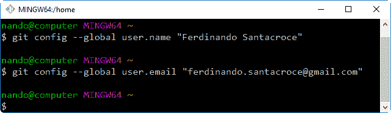

使用 `git config` 命令，我们设置了两个配置变量——`user.name` 和 `user.email`。从现在开始，Git 会在你所有的仓库中使用这些信息来签署你的提交。暂时不用担心这些；在接下来的章节中，我们会更详细地探索 Git 配置系统。

# 设置新仓库

第一步是设置一个新的仓库。一个 **仓库** 是你的整个项目的容器；其中的每个文件或子文件夹都属于该仓库，并保持一致性。物理上，一个仓库就是一个包含特殊 `.git` 文件夹的文件夹，这个文件夹就是魔法发生的地方。

让我们尝试创建我们的第一个仓库。选择一个你喜欢的文件夹（例如，`C:\Repos\MyFirstRepo`），并输入 `git init` 命令，如下所示：

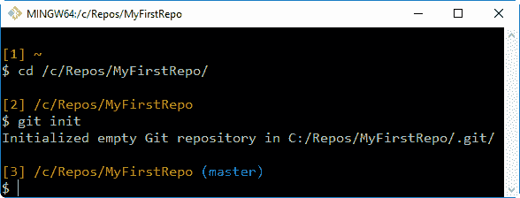

如你所见，我稍微修改了默认的 Git Bash 提示符，以更好地满足演示命令的需求；我去除了用户和主机名，并在每个命令前添加了一个递增的编号，这样在我讲解时更便于引用，也方便你在阅读时查找。

让我们回到正题。刚刚在 `MyFirstRepo` 文件夹中发生了什么？Git 创建了一个 `.git` 子文件夹。这个子文件夹（在 Windows 中通常是隐藏的）包含了一些其他的文件和文件夹，如下一个截图所示：

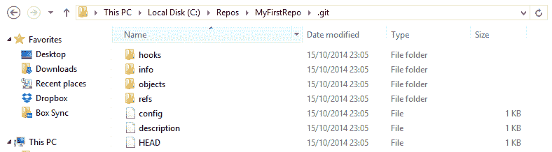

在此时此刻，我们无需理解这个文件夹中的内容。你只需要知道的是，你永远不需要碰它！如果你删除它或者手动修改其中的文件，可能会导致麻烦。我吓到你了吗？

既然我们已经有了一个代码库，就可以开始将文件放入其中。Git 可以高效地跟踪任何类型文件的历史，不论是文本文件还是二进制文件，小文件还是大文件（大文件始终是个问题）。

# 添加文件

我们创建一个文本文件，试试看：

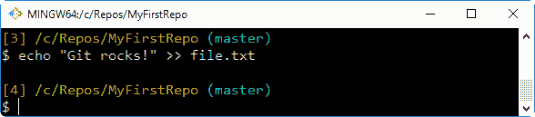

现在怎么办？就这样吗？不！我们还需要告诉 Git，将该文件放入你的代码库中，*明确地*。**Git 不会做任何你不希望它做的事情**。如果你的代码库中有一些临时文件或备用文件，Git 不会处理它们，只会提醒你有些文件不在版本控制之下（在下一章，我们将看到如何指示 Git 在必要时忽略这些文件）。

好的，回到正题。我希望将 `file.txt` 纳入 Git 的管理之中，所以我们将它添加进去，如下所示：

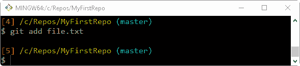

`git add` 命令告诉 Git，我们希望它管理该文件，并在未来检查该文件的修改。

针对这个命令，可能会看到 Git 返回以下消息：

```
warning: LF will be replaced by CRLF in file.txt.
```

该文件将在你的工作目录中保留其原始行结尾格式。

这是由于我们在安装 Git 时选择的选项：*检出 Windows 样式，提交 Unix 样式的行结尾*。目前不用担心这个问题，我们稍后会处理它。

现在，让我们看看 Git 是否听从了我们的指令。

使用 `git status` 命令，我们可以查看代码库的状态，如下所示：

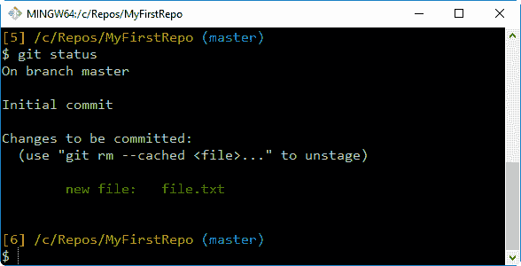

如我们所见，Git 按预期完成了它的工作。在这张图中，我们可以看到诸如 `branch`、`master`、`commit` 和 `unstage` 等字眼。我们稍后会简单了解它们，但现在先忽略它们：这个首次实验的目的是克服我们的恐惧，并开始使用 Git 命令；毕竟，我们有整本书可以学习其中的重要细节。

# 提交添加的文件

到此为止，Git 已经知道 `file.txt` 的存在，但我们还需要执行另一个步骤，以修正其内容的快照。我们需要使用适当的 `git commit` 命令提交它。这一次，我们将在命令中添加一些额外内容，使用 `--message`（或 `-m`）子命令，如下所示：

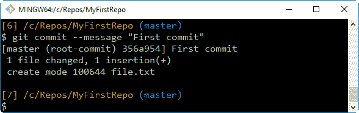

通过提交 `file.txt`，我们终于启动了我们的代码库。在完成第一次提交（也叫做根提交，如截图所示）后，代码库现在拥有一个包含提交的 `master` 分支。接下来的章节中我们会玩转分支。现在，可以将它看作是代码库的路径，并记住一个代码库可以有多条交叉的路径。

# 修改已提交的文件

现在，我们可以尝试修改文件，并查看如何处理它，如下图所示：

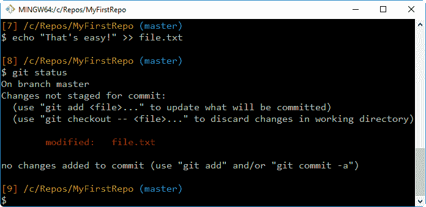

如你所见，Bash shell 会警告我们有些文件已被修改，并且将修改的文件名标红。在这里，`git status` 命令告诉我们有一个文件进行了修改，如果我们想将该修改保存到仓库历史中，需要提交它。

然而，`**no changes added to commit**`是什么意思呢？很简单。Git 会让你重新审视你想要包含在下一个提交中的内容。如果你修改了两个文件，但只想提交其中一个，你可以只添加那个文件。

如果你尝试跳过 `add` 步骤进行提交，什么也不会发生（见下图）。我们将在下一章深入分析这种行为。

所以，让我们再次添加文件，以便为下一个提交做好准备：

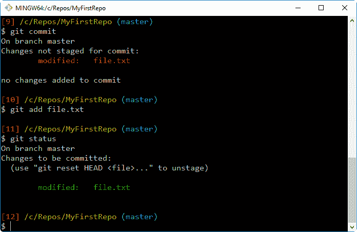

好的，让我们再做一个提交，这次避免使用 `--message` 子命令。输入 `git commit` 然后按 *Enter* 键：

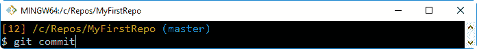

系好安全带！你现在进入了代码历史的一部分！

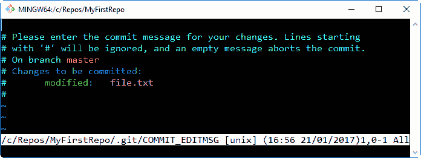

那是什么？它是 **Vim**（**Vi IMproved**），一个古老而强大的文本编辑器，直到今天仍被数百万用户使用。你可以将 Git 配置为使用你自己喜欢的编辑器，但如果你没有这么做，这就是你必须面对的。Vim 很强大，但对于新手来说，使用起来可能会让人头疼。它处理文本的方式很独特。要开始输入，你必须按 *I* 键进入插入模式，如下图所示：

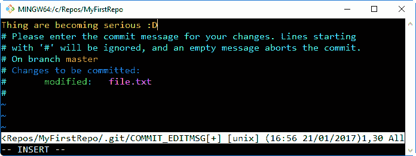

一旦你输入了提交信息，就可以按 *Esc* 键退出编辑模式。然后，你可以输入 `:w` 命令保存更改，并输入 `:q` 命令退出。你也可以将这两个命令合并为 `:wq`，正如我们在这张截图中所做的，或者使用等效的 `:x` 命令：

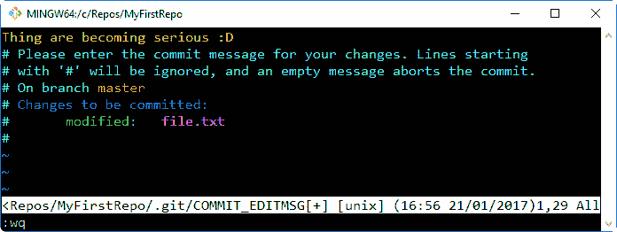

之后，按下 *Enter*，再一次完成提交，如下所示：

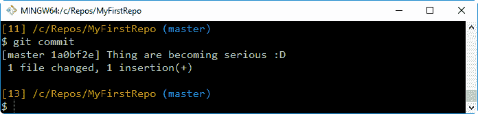

请注意，当你退出 Vim 时，Git 会自动提交，你可以在之前的截图中看到这一点。

做得好！现在，是时候回顾一下了。

# 总结

在这一章中，你学到 Git 并不难安装，即使是在非 Unix 平台上，如 Windows。

一旦你选择了一个目录来包含在 Git 仓库中，你会发现初始化一个新的 Git 仓库就像执行一个 `git init` 命令一样简单。现在，不用担心将其保存到远程服务器等问题。保存并不是强制要求的；你可以在需要时再执行保存操作，保留仓库的完整历史记录。这是 Git 和分布式版本控制系统（DVCS）的一项杀手级功能。你可以在离线状态下舒适地工作，并在网络可用时将你的工作推送到远程位置，毫不麻烦。

最后，我们发现了 Git 最重要的一个特点：如果你没有明确提到，它什么都不会做。你还学到了一点关于`add`命令的知识。当我们第一次将文件提交到 Git 时，必须执行 `git add` 命令。然后，当我们修改文件时，又使用了另一个命令。这是因为，如果你修改了一个文件，Git 默认不会将其自动添加到下次提交中（我认为它这么假设是对的）。

在下一章，我们将学习 Git 的一些基本概念。
