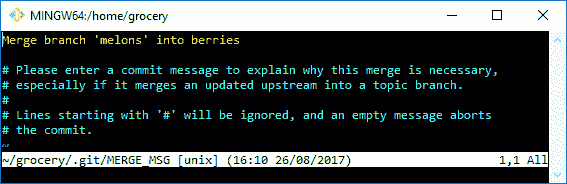

# 第二章：Git 基础 - 本地工作

在本章中，我们将深入探讨 Git 的一些基础知识；了解 Git 如何处理文件，它跟踪提交历史的方式，以及我们需要掌握的所有基本命令，这些都是成为熟练使用 Git 的关键。

# 深入挖掘 Git 内部结构

在本版 *Git 基础* 的第二版中，我稍微改变了我解释 Git 工作方式的方法；这次我不再用文字和图示解释，而是通过仅使用 shell 来展示 Git 是如何内部工作的，允许你在自己的电脑上跟随这些步骤，希望这些能足够清晰，帮助你理解。

一旦你掌握了 Git 工作系统的基础，我认为剩下的命令和模式会变得更清晰，让你能够熟练地完成日常工作，在需要时解决问题。

所以，现在是时候深入了解 Git 的真正本质了；在本章中，我们将接触到这个强大工具的核心。

# Git 对象

在第一章，*Git 入门*，我们创建了一个空文件夹（在 `C:\Repos\MyFirstRepo`），然后使用 `git init` 命令初始化了一个新的 Git 仓库。

让我们创建一个新的仓库来刷新一下记忆，然后开始学习更多关于 Git 的知识。

在这个例子中，我们使用 Git 来追踪去超市前的购物清单；所以，创建一个新的购物文件夹，然后初始化一个新的 Git 仓库：

```
[1] ~
$ mkdir grocery

[2] ~
$ cd grocery/

[3] ~/grocery
$ git init
Initialized empty Git repository in C:/Users/san/Google Drive/Packt/PortableGit/home/grocery/.git/
```

正如我们之前所见，`git init` 命令的结果是创建一个 `.git` 文件夹，Git 在这里存储它管理仓库所需的所有文件：

```
[4] ~/grocery (master)
$ ll
total 8
drwxr-xr-x 1 san 1049089 0 Aug 17 11:11 ./
drwxr-xr-x 1 san 1049089 0 Aug 17 11:11 ../
drwxr-xr-x 1 san 1049089 0 Aug 17 11:11 .git/ 
```

所以，我们可以把这个 `grocery` 文件夹移动到任何地方，数据不会丢失。另一个重要的点是，我们不需要任何服务器：我们可以在本地创建一个仓库，并随时使用它，甚至在没有局域网或互联网连接的情况下。只有在我们想要与他人共享仓库时，才需要它们，无论是直接共享还是通过中央服务器。

事实上，在这个例子中，我们不会使用任何远程服务器，因为这并非必要。

继续创建一个新的 `README.md` 文件来记住这个仓库的目的：

```
[5] ~/grocery (master)
$ echo "My shopping list repository" > README.md
```

然后将一根香蕉添加到购物清单中：

```
[6] ~/grocery (master)
$ echo "banana" > shoppingList.txt
```

此时，正如你已经知道的那样，在执行 commit 之前，我们必须将文件添加到 *暂存区*；使用快捷命令 `git add .` 将两个文件添加进去：

```
[7] ~/grocery (master)
$ git add .
```

使用这个技巧（`git add` 命令后的点），你可以一次性将所有新增或修改的文件添加进来。

此时，如果你没有像在第一章，*Git 入门*中那样设置全局的用户名和电子邮件，那么可能会发生以下情况：

```
[8] ~/grocery (master)
$ git commit -m "Add a banana to the shopping list"
[master (root-commit) c7a0883] Add a banana to the shopping list
Committer: Santacroce Ferdinando <san@intre.it> 
Your name and email address were configured automatically based on your username and hostname. Please check that they are accurate. 
You can suppress this message by setting them explicitly:
git config --global user.name "Your Name"
git config --global user.email you@example.com
After doing this, you may fix the identity used for this commit with:
git commit --amend --reset-author

 2 files changed, 2 insertions(+)
 create mode 100644 README.md
 create mode 100644 shoppingList.txt
```

首先，看看第二行，Git 会显示类似 **`root commit`** 的内容；这意味着这是你仓库的**第一次提交**，就像树的根（或者磁盘分区的根；或许你们这些极客能更好地理解这个比喻）。稍后我们会回到这个概念。

然后，Git 会显示一条信息：“*你没有设置全局用户名和电子邮件；我使用了在你的系统中找到的配置，如果你不喜欢的话，你可以回去重新提交，使用另一组数据*”。

我不喜欢在 Git 中设置全局的用户名和密码，因为我通常在不同的仓库中使用不同的用户名和电子邮件；如果我不注意，我最终可能会用我的个人资料做了工作提交，或者反过来，这非常烦人。所以，我更喜欢为每个仓库单独设置用户名和电子邮件；在 Git 中，你可以在三个层级设置配置变量：*仓库级别*（使用 `--local` 选项，默认选项）、*用户级别*（使用 `--global` 选项）和 *系统级别*（使用 `--system` 选项）。稍后我们会进一步学习配置内容，但现在你只需要知道这些就可以继续操作。

那么，让我们来更改这些设置并*修改*我们的提交（修改提交是一种重新做上次提交并修正一些小错误的方法，比如添加一个遗忘的文件、更改提交信息或作者，正如我们接下来要做的那样；稍后我们会详细学习这是什么意思）：

```
[9] ~/grocery (master)
$ git config user.name "Ferdinando Santacroce"

[10] ~/grocery (master)
$ git config user.email ferdinando.santacroce@gmail.com
```

因为我没有指定配置级别，所以这些参数将在 *仓库级别* 设置（也就是 `--local`）；从现在开始，我在这个仓库中做的所有提交都会由 `"Ferdinando Santacroce"` 签名，电子邮件为 `ferdinando.santacroce@gmail.com`（现在你知道怎么联系我了，万一有需要的话）。

现在是时候输入这个命令了，`git commit --amend --reset-author`。当以这种方式修改提交时，Git 会打开默认编辑器，让你更改提交信息（如果你愿意的话）；正如我们在第一章《Git 入门》中所看到的，在 Windows 中，默认的编辑器是 *Vim*。为了这个练习，请保持信息不变，按 *Esc* 键，然后输入 `:wq`（或 `:x`）命令并按 *Enter* 键保存并退出：

```
[11] ~/grocery (master)
$ git commit --amend --reset-author #here Vim opens
[master a57d783] Add a banana to the shopping list
 2 files changed, 2 insertions(+)
 create mode 100644 README.md
 create mode 100644 shoppingList.txt
```

好的，现在我已经有了一个正确的作者和电子邮件的提交。

# 提交

现在是时候开始研究提交了。

要验证我们刚刚创建的提交，我们可以使用 `git log` 命令：

```
[12] ~/grocery (master)
$ git log
commit a57d783905e6a35032d9b0583f052fb42d5a1308
Author: Ferdinando Santacroce <ferdinando.santacroce@gmail.com>
Date:   Thu Aug 17 13:51:33 2017 +0200

Add a banana to the shopping list
```

如你所见，`git log` 显示了我们在这个仓库中所做的提交；`git log` 会按时间倒序显示所有的提交；目前我们只有一个提交，但接下来我们会看到这一行为是如何在实际操作中体现的。

# 哈希值

现在是时候分析提供的信息了。第一行包含了提交的**SHA-1**（[`en.wikipedia.org/wiki/SHA-1`](https://en.wikipedia.org/wiki/SHA-1)），这是一个包含 40 个字符的字母数字序列，表示一个十六进制数字。这个*代码*，或通常称为**哈希**，唯一标识了仓库中的提交，正是由于它，从现在起我们可以通过它执行一些操作来引用该提交。

# 作者和提交创建日期

我们在前几段已经谈到了作者；**作者**是执行提交的人，**日期**是提交生成时的完整日期。自那时起，这个提交成为了仓库的一部分。

# 提交消息

在作者和日期下方，空一行后，我们可以看到附加到我们所做提交上的消息；实际上，消息本身也是提交的一部分。

但还有更多的东西，我们来尝试使用`git log`命令并加上`--format=fuller`选项：

```
[13] ~/grocery (master)
$ git log --format=fuller
commit a57d783905e6a35032d9b0583f052fb42d5a1308
Author: Ferdinando Santacroce <ferdinando.santacroce@gmail.com>
AuthorDate: Thu Aug 17 13:51:33 2017 +0200
Commit: Ferdinando Santacroce <ferdinando.santacroce@gmail.com>
CommitDate: Thu Aug 17 13:51:33 2017 +0200

Add a banana to the shopping list
```

# 提交者和提交日期

除了作者外，提交还保留了**提交者**和**提交日期**；与作者和作者日期相比，有什么不同呢？首先，不用太担心：在你的仓库中，99%的提交会有相同的作者和提交者信息，以及相同的日期。

在某些情况下，例如*cherry-pick*，你会将一个已有的提交应用到另一个分支上，形成一个全新的提交，应用之前提交的相同更改。在这种情况下，作者和作者日期将保持不变，而提交者和提交日期将与执行此操作的人以及他们执行该操作的日期相关。稍后我们将接触到这个有用的 Git 命令。

# 深入分析

我们分析了一个提交，并通过简单的`git log`获取了相关信息；但我们还不满意，接下来深入了解一下里面的内容。

再次使用`git log`命令，我们可以通过启用`--format=raw`选项来获得透视视图：

```
[14] ~/grocery (master)
$ git log --format=raw
commit a57d783905e6a35032d9b0583f052fb42d5a1308
tree a31c31cb8d7cc16eeae1d2c15e61ed7382cebf40
author Ferdinando Santacroce <ferdinando.santacroce@gmail.com> 1502970693 +0200
committer Ferdinando Santacroce <ferdinando.santacroce@gmail.com> 1502970693 +0200

Add a banana to the shopping list
```

这次输出格式有所不同；我们可以看到作者和提交者的信息，和之前看到的一样，不过是以更紧凑的形式呈现；接下来是提交信息，但有些新东西出现了：它是一个*树*。请耐心等待，我们将在接下来的段落中讨论树。

现在我想展示另一个命令，这次稍微有点难懂；它是`git cat-file -p`。

让我们尝试这个命令。为了使其生效，我们需要指定我们要调查的**对象**；在这种情况下，我们可以使用对象的哈希值，也就是我们的第一次提交。你不需要指定完整的哈希值，但对于小型仓库来说，前五到六个字符就足够了。Git 足够聪明，即使哈希值不到 40 个字符，它也能理解是什么对象；最少需要四个字符，随着仓库中 Git 对象的数量增多，这个数字会增加。举个例子，Linux 内核目前有 1500 万行代码，成千上万的已跟踪文件和文件夹；在这个 Git 仓库中[1]，你需要指定 12 个字符才能获取正确的对象。

在需要时，我通常只尝试输入前五个字符；如果它们不足以让 Git 识别我需要的对象，Git 会提示我再输入一两个字符。

话题回到正题；输入命令，指定提交哈希值的前几个字符（在我的例子中是`a57d7`）：

```
[15] ~/grocery (master)
$ git cat-file -p a57d7
tree a31c31cb8d7cc16eeae1d2c15e61ed7382cebf40
author Ferdinando Santacroce <ferdinando.santacroce@gmail.com> 1502970693 +0200
committer Ferdinando Santacroce <ferdinando.santacroce@gmail.com> 1502970693 +0200

Add a banana to the shopping list
```

好的，正如你所看到的，输出与`git log --format=raw`相同。

这在 Git 中并不罕见：有不同的命令和选项，最终做的是相同的事情；这是 Git 的一个常见*特性*，源于其多年来的有机发展。Git 不断地变化（和更改），因此开发人员在引入新命令时必须保证一定的向后兼容性；这就是其中的一个副作用。

我引入这个命令只是为了有机会介绍 Git 的另一个特点，即*瓷器命令*与*管道命令*之间的区分。

# 瓷器命令与管道命令

Git，如我们所知，拥有大量的命令，其中一些几乎从不被普通用户使用；例如，之前的`git cat-file`。这些命令被称为**管道命令**，而我们已经学过的命令，如`git add`、`git commit`等，则属于所谓的**瓷器命令**。

这个比喻直接来源于 Git 之父 Linus Torvalds 的丰富想象力，与管道工有关。众所周知，管道工也负责维修厕所；在这里，Linus 指的是马桶。马桶是一个瓷器制品，使我们能够舒适地坐下；然后，通过一系列的管道和设备，它能够将我们知道的废物正确地排放到下水道系统中。

Linus 利用这个精妙的比喻，将 Git 命令分为两类：一种是高阶命令，适合用户进行常见操作（*瓷器命令*），另一种是内部使用的命令（但经验更丰富的用户可以根据需要使用）来执行低级操作（*管道命令*）。

因此，我们可以把 porcelain 命令看作是面向用户的*接口*命令，而 plumbing 命令则是在*底层*工作的。这也意味着，porcelain 命令随着时间的推移会保持更*稳定*（使用模式和选项随着时间的推移会更谨慎，延迟出现），因为它们是直接使用的，但也被许多图形工具、编辑器等所实现，而 plumbing 命令则一般以较少的限制进行演变。

这两类命令之间没有明确的划分，因为它们的边界通常非常活跃；我们仍然会使用它们，以更好地理解 Git 的内部运作。

现在回到主题；我们之前在讲 Git 对象。

Git 使用四种不同类型的**对象**，其中 *commit* 就是其中之一。然后还有 *tree*、*blob* 和 *annotated tag*。暂时不讨论 annotated tags（任何已经使用版本控制系统的人都知道标签是什么），我们专注于 blobs 和 trees。

为了方便起见，这里是之前输入的 `git cat-file -p` 命令的输出：

```
[15] ~/grocery (master)
$ git cat-file -p a57d7
tree a31c31cb8d7cc16eeae1d2c15e61ed7382cebf40
author Ferdinando Santacroce <ferdinando.santacroce@gmail.com> 1502970693 +0200
committer Ferdinando Santacroce <ferdinando.santacroce@gmail.com> 1502970693 +0200
```

如今我们可以理解，这个 plumbing 命令让你查看 Git 对象；使用 `-p` 选项（在这里意味着*漂亮打印*），我们让 Git 以更易读的方式显示对象的内容。

现在是时候了解在 Git 中树（tree）是什么了；事实上，在命令输出中，我们可以看到这一行：`tree a31c31cb8d7cc16eeae1d2c15e61ed7382cebf40`。

这是什么意思？让我们一起来看看。

# Trees

**树（tree）**是用来容纳 blobs 和其他树的**容器**。理解它如何工作最简单的方法是把它想象成操作系统中的文件夹，文件夹内也可以包含文件和其他子文件夹。

让我们再次使用 `git cat-file -p` 命令，看看这个额外的 Git 对象包含了什么：

```
[16] ~/grocery (master)
$ git cat-file -p a31c3
100644 blob 907b75b54b7c70713a79cc6b7b172fb131d3027d README.md
100644 blob 637a09b86af61897fb72f26bfb874f2ae726db82 shoppingList.txt
```

这个树，我们之前说过它是 Git 用来标识文件夹的东西，它还包含一些额外的对象，称为**blobs**。

# Blobs

如你所见，在前一个命令输出的右侧，我们有 `README.md` 和 `shoppinglist.txt`，这让我们猜测 Git 的 blobs 代表了**文件**。和之前一样，我们可以验证它的内容；让我们看看 `637a0` 里面是什么：

```
[17] ~/grocery (master)
$ git cat-file -p 637a0
banana
```

哇！它的内容正是我们 `shoppingFile.txt` 文件的内容。

为了确认，我们可以使用 `cat` 命令，这个命令在 `*nix` 系统中允许你查看文件内容：

```
[18] ~/grocery (master)
$ cat shoppingList.txt
banana
```

如你所见，结果是一样的。

Blobs 是二进制文件，没什么特别的。这些无法用肉眼解释的字节序列，内部包含了任何文件的信息，无论是二进制文件还是文本文件，图像、源代码、档案等等。所有内容在归档到 Git 仓库之前都被压缩并转化为一个 blob。

如前所述，每个文件都有一个*哈希值*；这个哈希值在我们的仓库中唯一标识该文件，正是通过这个 ID，Git 可以在需要时检索文件，并在文件被更改时检测到任何变化（内容不同的文件将具有不同的哈希值）。

我们说 SHA-1 哈希值是唯一的；但这意味着什么呢？

让我们通过一个例子来更好地理解它。

打开一个 shell，试着玩一下另一个低级命令`git hash-object`：

```
[19] ~/grocery (master)
$ echo "banana" | git hash-object --stdin
637a09b86af61897fb72f26bfb874f2ae726db82
```

`git hash-object`命令是用来计算任何对象哈希值的低级命令；在这个例子中，我们使用了`--stdin`选项，将前面的命令`echo "banana";`的结果作为命令参数，简而言之，我们计算了字符串`"banana"`的哈希值，结果是`637a09b86af61897fb72f26bfb874f2ae726db82`。

那你在你的计算机上试过了吗？结果是什么？

一点悬念... 太不可思议了，竟然是一样的！

你可以尽情地重新运行这个命令，结果的哈希值总是相同的（如果不相同，可能是因为操作系统或 shell 中不同的换行符导致的）。

这让我们明白了一件非常重要的事情：**一个对象**，无论它是什么，**在任何仓库中，任何计算机上，地球上的任何地方，都会始终有相同的哈希值**。

有经验的人和聪明的人可能早就*嗅到了一丝不对劲*，但我希望在剩下的读者中，我能引起和我第一次做这件事时一样的惊讶。这种行为有一些有趣的影响，我们很快就会看到。

最后但同样重要的是，我想强调**Git 计算的是文件内容的哈希值，而不是文件本身的哈希值**；事实上，使用`git hash-object`计算的`637a09b86af61897fb72f26bfb874f2ae726db82`哈希值与我们之前使用`git cat-file -p`检查的 blob 是相同的。这教会我们一个重要的经验：如果你有两个内容相同的不同文件，即使它们的名称和路径不同，在 Git 中最终只有一个 blob。

# 更深入地 - Git 存储对象模型

好的，现在我们知道 Git 中有不同的对象，我们可以使用一些低级命令来检查它们。但 Git 是如何存储这些对象的呢？

你记得`.git`文件夹吗？让我们把鼻子伸进去看看：

```
[20] ~/grocery (master)
$ ll .git/
total 13
drwxr-xr-x 1 san 1049089   0 Aug 18 17:22 ./
drwxr-xr-x 1 san 1049089   0 Aug 18 17:15 ../
-rw-r--r-- 1 san 1049089 294 Aug 17 13:52 COMMIT_EDITMSG
-rw-r--r-- 1 san 1049089 208 Aug 17 13:51 config
-rw-r--r-- 1 san 1049089  73 Aug 17 11:11 description
-rw-r--r-- 1 san 1049089  23 Aug 17 11:11 HEAD
drwxr-xr-x 1 san 1049089   0 Aug 18 17:15 hooks/
-rw-r--r-- 1 san 1049089 217 Aug 18 17:22 index
drwxr-xr-x 1 san 1049089   0 Aug 18 17:15 info/
drwxr-xr-x 1 san 1049089   0 Aug 18 17:15 logs/
drwxr-xr-x 1 san 1049089   0 Aug 18 17:15 objects/
drwxr-xr-x 1 san 1049089   0 Aug 18 17:15 refs/
```

在其中，有一个`objects`子文件夹；让我们看一下：

```
[21] ~/grocery (master) 
$ ll .git/objects/
total 4
drwxr-xr-x 1 san 1049089 0 Aug 18 17:15 ./
drwxr-xr-x 1 san 1049089 0 Aug 18 17:22 ../
drwxr-xr-x 1 san 1049089 0 Aug 18 17:15 63/
drwxr-xr-x 1 san 1049089 0 Aug 18 17:15 90/
drwxr-xr-x 1 san 1049089 0 Aug 18 17:15 a3/
drwxr-xr-x 1 san 1049089 0 Aug 18 17:15 a5/
drwxr-xr-x 1 san 1049089 0 Aug 18 17:15 c7/
drwxr-xr-x 1 san 1049089 0 Aug 17 11:11 info/
drwxr-xr-x 1 san 1049089 0 Aug 18 17:12 pack/
```

除了`info`和`pack`文件夹（它们现在对我们来说并不重要），如你所见，还有一些其他文件夹，其名称是两个字符的奇怪组合；我们进入`63`文件夹看看：

```
[22] ~/grocery (master) 
$ ll .git/objects/63/
total 1
drwxr-xr-x 1 san 1049089 0 Aug 18 17:15 ./
drwxr-xr-x 1 san 1049089 0 Aug 18 17:15 ../
-r--r--r-- 1 san 1049089 20 Aug 17 13:34 7a09b86af61897fb72f26bfb874f2ae726db82
```

嗯...

看看其中的文件，并思考：`63` + `7a09b86af61897fb72f26bfb874f2ae726db82`实际上是我们`shoppingList.txt` blob 的哈希值！

Git 非常智能且简单：为了在文件系统中更快地搜索，Git 创建了一组文件夹，其中文件夹名由两个字符组成，这两个字符代表哈希码的前两个字符；在这些文件夹中，Git 使用哈希的其他 38 个字符作为文件名，存储所有的对象，不论是何种类型的 Git 对象。

所以，`a31c31cb8d7cc16eeae1d2c15e61ed7382cebf40` 树保存在 `a3` 文件夹中，而 `a57d783905e6a35032d9b0583f052fb42d5a1308` 提交保存在 `a5` 文件夹中。

这是不是你见过的最聪明、最简单的事情？

现在，如果你尝试使用普通的 `cat` 命令查看这些文件，你会被骗：这些文件是纯文本文件，但 Git 使用 `zlib` 库对它们进行压缩，以节省磁盘空间。这就是为什么我们使用 `git cat-file -p` 命令，它可以即时解压缩这些文件。

这再次突显了 Git 的简单性：没有元数据，没有内部数据库或无用的复杂性，简单的文件和文件夹足以管理任何仓库。

到目前为止，我们知道 Git 是如何存储对象的，以及它们存储的位置；我们还知道没有数据库、没有中央仓库或类似的东西。那么，Git 是如何重建我们仓库的历史的呢？它是如何定义哪个提交先于或跟随另一个提交的呢？

要了解这一点，我们需要一个新的提交。所以，现在让我们开始修改 `shoppingList.txt` 文件：

```
[23] ~/grocery (master)
$ echo "apple" >> shoppingList.txt

[24] ~/grocery (master)
$ git add shoppingList.txt

[25] ~/grocery (master)
$ git commit -m "Add an apple"
[master e4a5e7b] Add an apple
 1 file changed, 1 insertion(+)
```

使用 `git log` 命令查看新的提交；`--oneline` 选项让我们以更简洁的方式查看日志：

```
[26] ~/grocery (master)
$ git log --oneline
e4a5e7b Add an apple
a57d783 Add a banana to the shopping list
```

好的，我们有了一个新的提交和它的哈希。是时候查看它里面的内容了：

```
[27] ~/grocery (master)
$ git cat-file -p e4a5e7b
tree 4c931e9fd8ca4581ddd5de9efd45daf0e5c300a0
parent a57d783905e6a35032d9b0583f052fb42d5a1308
author Ferdinando Santacroce <ferdinando.santacroce@gmail.com> 1503586854 +0200
committer Ferdinando Santacroce <ferdinando.santacroce@gmail.com> 1503586854 +0200

Add an apple
```

有一些新东西！

我在谈论的是 `parent a57d783905e6a35032d9b0583f052fb42d5a1308` 这一行；你看到了吗？一个提交的**父提交**就是它之前的那个提交。事实上，`a57d783` 哈希实际上是我们第一次提交的哈希。所以，每个提交都有一个父提交，通过跟踪这些提交之间的关系，我们可以从任意一个提交一直导航到第一个提交，之前提到的**根提交**。

如果你还记得，第一次提交没有父提交，这也是所有提交与第一次提交之间的主要（也是唯一）区别。Git 在浏览和重建我们的仓库时，当它发现一个没有父提交的提交时，简单地知道任务完成了。

# Git 不使用增量

现在是时候研究 Git 与其他版本控制系统之间的另一个著名差异了。以 Subversion 为例：当你进行新提交时，Subversion 会创建一个新的编号修订，只包含与前一个修订之间的增量；这种方法非常适合归档文件的更改，特别是对于大文本文件来说，因为如果只有一行文本发生变化，新提交的大小将大大减少。

相反，在 Git 中，即使你只修改了一个大文本文件中的一个字符，它总是会存储文件的新版本：**Git 不做增量更新**（至少在这个案例中是如此），**每次提交实际上都是整个仓库的快照**。

到这个时候，人们通常会惊呼：“天哪，Git 浪费了大量的磁盘空间！”嗯，这完全不是真的。

在一个常见的源代码仓库中，经过一定数量的提交后，Git 通常不会占用比其他版本控制系统更多的空间。举个例子，当 Mozilla 从 Subversion 迁移到 Git 时，原本需要 12GB 的仓库在 Git 中只需要 420MB 的磁盘空间；请查看这个对比页面了解更多：[`git.wiki.kernel.org/index.php/GitSvnComparsion`](https://git.wiki.kernel.org/index.php/GitSvnComparsion)

此外，Git 有一个巧妙的方法来处理文件；让我们再次查看最后一个提交：

```
[28] ~/grocery (master)
$ git cat-file -p e4a5e7b
tree 4c931e9fd8ca4581ddd5de9efd45daf0e5c300a0
parent a57d783905e6a35032d9b0583f052fb42d5a1308
author Ferdinando Santacroce <ferdinando.santacroce@gmail.com> 1503586854 +0200
committer Ferdinando Santacroce <ferdinando.santacroce@gmail.com> 1503586854 +0200

Add an apple
```

好的，现在来看树结构：

```
[29] ~/grocery (master)
$ git cat-file -p 4c931e9
100644 blob 907b75b54b7c70713a79cc6b7b172fb131d3027d README.md
100644 blob e4ceb844d94edba245ba12246d3eb6d9d3aba504 shoppingList.txt
```

在记事本上标注两个哈希值；现在我们需要查看第一个提交的树结构；查看提交的内容：

```
[30] ~/grocery (master)
$ git cat-file -p a57d783
tree a31c31cb8d7cc16eeae1d2c15e61ed7382cebf40
author Ferdinando Santacroce <ferdinando.santacroce@gmail.com> 1502970693 +0200
committer Ferdinando Santacroce <ferdinando.santacroce@gmail.com> 1502970693 +0200
Add a banana to the shopping list 
```

然后查看树的内容：

```
[31] ~/grocery (master)
$ git cat-file -p a31c31c
100644 blob 907b75b54b7c70713a79cc6b7b172fb131d3027d README.md
100644 blob 637a09b86af61897fb72f26bfb874f2ae726db82 shoppingList.txt
```

猜猜看！`README.md`文件的哈希值在第一次和第二次提交的两棵树中是相同的；这使我们能够理解 Git 采用的另一个简单但巧妙的策略来管理文件；当文件没有被修改时，Git 在提交时创建一个树结构，其中该文件的对象指向已存在的对象，*重复利用*它并避免浪费磁盘空间。

同样的情况也适用于树结构：如果我的工作目录中有一些文件夹和文件，它们将保持不变，当我们进行新的提交时，Git 会循环利用相同的树结构。

# 总结

现在是时候总结一下到目前为止说明的所有概念了。

如人们所说，一张图片胜过千言万语，所以在这里你可以找到一张通过**git-draw**工具（[`github.com/sensorflo/git-draw`](https://github.com/sensorflo/git-draw)）展示我们仓库当前状态的图像：


在这个图形表示中，你将看到一个详细的图示，展示新创建仓库的当前结构；你可以看到树（黄色）、对象（白色）、提交（绿色），以及它们之间的所有关系，通过有向箭头表示。

注意箭头的方向，连接提交的箭头从第二个提交指向第一个提交，或者从后代指向其祖先；这看似是一个细节，但在图形表示中正确定义这些关系非常重要，以便正确突出提交之间的依赖关系（总是子级依赖于父级）。

我只是想强调一些其他的东西；例如：

+   这两个不同的树结构指向同一个`README.md`对象。

+   对于`shoppingList.txt`文件，有两个不同的对象，一个只包含`banana`的文本行，另一个包含`banana`和`apple`。

+   第二个提交引用了第一个提交。

+   第一个提交没有父提交。

+   有三个提交！

这是什么情况？！

好的，别慌张。看看图片右侧的提交，并阅读作者和邮箱：那是我们第一次使用*错误*的用户和邮箱所做的提交；之后我们修改了该提交，改变了作者，记得吗？

好吧，但它为什么已经在那里？为什么我们在这张图片中能看到它，却在`git log`中看不到它？

这是关于**提交可达性**的话题，我们将在接下来的章节中讨论它。

# Git 引用

在上一节中，我们看到一个 Git 仓库可以被想象成一棵树，从根节点（根提交）开始，向上生长，通过一个或多个分支。

这些分支通常由一个名称区分。在这方面 Git 也不例外；如果你还记得，到目前为止的实验都导致我们提交到了我们测试仓库的`master`分支。*Master*恰好是 Git 仓库的*默认分支*的名称，就像 Subversion 中的`trunk`一样。

但 Subversion 的类比到此为止：我们现在将看到 Git 如何处理分支，对于 Subversion 用户来说，这可能会有些惊讶。

# 一切都与标签有关。

在 Git 中，**分支不过是一个标签**，是一个*可移动的标签*，指向一个提交。

事实上，每个 Git 分支上的叶子都必须用一个有意义的名称标记，以便我们能够到达它，然后在其上进行移动、回退、合并、变基或在需要时丢弃某些提交。

让我们通过检查当前`grocery`仓库的状态来开始探索这个话题；我们使用著名的`git log`命令，这次添加了一些新的选项：

```
[1] ~/grocery (master)
$ git log --oneline --graph --decorate
* e4a5e7b (HEAD -> master) Add an apple
* a57d783 Add a banana to the shopping list
```

让我们详细查看这些选项：

+   `--graph`：在这种情况下，它只是在左侧的提交哈希前加上一个星号，但当你有更多分支时，这个选项将为我们绘制分支，提供一个简单但有效的仓库图形表示。

+   `--decorate`：此选项会显示与任何提交关联的标签；在此例中，它会在`e4a5e7b`提交上显示`(HEAD -> master)`标签。

+   `--oneline`：这个选项很容易理解：它用一行展示每个提交，必要时简化内容。

现在我们来做一个新的提交，看看会发生什么：

```
[2] ~/grocery (master)
$ echo "orange" >> shoppingList.txt

[3] ~/grocery (master)
$ git commit -am "Add an orange"
[master 0e8b5cf] Add an orange
 1 file changed, 1 insertion(+)
```

你注意到了吗？在向`shopingList.txt`添加了一个橙子后，我没有先执行`git add`就做了提交；*窍门*在于`git commit`命令中添加了`-a`（`--add`）选项，这意味着*将所有我之前至少提交过一次的修改文件添加到这个提交中*。在我们的例子中，这个选项让我们能更快地跳过`git add`命令。

无论如何，在学习和使用 Git 的初期，特别要小心：你很容易提交更多文件，而不是你想要的。

好的，继续看一下当前仓库的情况：

```
[4] ~/grocery (master)
$ git log --oneline --graph --decorate
* 0e8b5cf (HEAD -> master) Add an orange
* e4a5e7b Add an apple
* a57d783 Add a banana to the shopping list
```

有趣！现在`HEAD`和`master`都指向了最后一个提交，即第三个提交；这意味着什么？

# 分支是可移动的标签。

我们在之前的章节中已经看到了，提交是通过父子关系彼此连接的：每个提交都包含对前一个提交的引用。

这意味着，例如，要在一个仓库内*导航*，我不能从第一个提交开始并尝试跳到下一个提交，因为一个提交并没有指向下一个提交的引用，而是指向前一个提交的引用。继续使用我们*树木*的比喻，这意味着我们的树只能从*叶子*开始导航，从分支的最*顶端*开始，然后一直向下到根提交。

所以，分支不过是标签，标注在顶端提交上，也就是最后一个提交。这个提交，我们的叶子，必须总是由一个标签来标识，以便在浏览仓库时能够访问它的祖先提交。否则，我们每次切换分支时，都需要记住该分支的顶端提交的哈希码，想象一下人类要如何做到这一点。

# 引用如何工作

所以，每当我们向一个分支提交时，标识该分支的**引用**会相应地移动，以始终与顶端提交保持关联。

但是 Git 是如何处理这个功能的呢？我们回到`.git`文件夹中，继续探究：

```
[5] ~/grocery (master)
$ ll .git/
total 21
drwxr-xr-x 1 san 1049089   0 Aug 25 11:20 ./
drwxr-xr-x 1 san 1049089   0 Aug 25 11:19 ../
-rw-r--r-- 1 san 1049089  14 Aug 25 11:20 COMMIT_EDITMSG
-rw-r--r-- 1 san 1049089 208 Aug 17 13:51 config
-rw-r--r-- 1 san 1049089  73 Aug 17 11:11 description
-rw-r--r-- 1 san 1049089  23 Aug 17 11:11 HEAD
drwxr-xr-x 1 san 1049089   0 Aug 18 17:15 hooks/
-rw-r--r-- 1 san 1049089 217 Aug 25 11:20 index
drwxr-xr-x 1 san 1049089   0 Aug 18 17:15 info/
drwxr-xr-x 1 san 1049089   0 Aug 18 17:15 logs/
drwxr-xr-x 1 san 1049089   0 Aug 25 11:20 objects/
drwxr-xr-x 1 san 1049089   0 Aug 18 17:15 refs/
```

这里有一个`refs`文件夹：让我们看一下里面的内容：

```
[6] ~/grocery (master)
$ ll .git/refs/
total 4
drwxr-xr-x 1 san 1049089 0 Aug 18 17:15 ./
drwxr-xr-x 1 san 1049089 0 Aug 25 11:20 ../
drwxr-xr-x 1 san 1049089 0 Aug 25 11:20 heads/
drwxr-xr-x 1 san 1049089 0 Aug 17 11:11 tags/
```

现在，进入`heads`：

```
[7] ~/grocery (master)
$ ll .git/refs/heads/
total 1
drwxr-xr-x 1 san 1049089  0 Aug 25 11:20 ./
drwxr-xr-x 1 san 1049089  0 Aug 18 17:15 ../
-rw-r--r-- 1 san 1049089 41 Aug 25 11:20 master
```

里面有一个`master`文件！让我们看看它的内容：

```
[8] ~/grocery (master)
$ cat .git/refs/heads/master
0e8b5cf1c1b44110dd36dea5ce0ae29ce22ad4b8
```

正如你可以想象的那样，Git 通过一个简单的文本文件来管理所有这个复杂的引用系统！它包含了该分支上最后一次提交的哈希值；实际上，如果你查看之前的`git log`输出，你可以看到最后一个提交的哈希值是`0e8b5cf`。

如今，自从第一次接触以来已经过去了很长时间，但我仍然对 Git 的内部结构感到惊叹，它既简洁又高效。

# 创建一个新分支

现在我们已经热身好了，真正有趣的部分开始了。让我们看看当你请求 Git 创建一个新分支时会发生什么。既然我们准备做一份美味的水果沙拉，是时候为*浆果口味*的变种食谱设立一个分支了：

```
[9] ~/grocery (master)
$ git branch berries
```

就这样！要创建一个新分支，只需要使用`git branch`命令，后面跟上你想要使用的分支名称。这是非常快速的；由于 Git 总是本地操作，它在眨眼之间就完成了这样的工作。

事实上，有一些（复杂的）规则需要遵守，关于分支名称的一些知识（你所需要了解的都在这里：[`git-scm.com/docs/git-check-ref-format`](https://git-scm.com/docs/git-check-ref-format)），但目前这些不太相关。

所以，再次执行`git log`：

```
[10] ~/grocery (master)
$ git log --oneline --graph --decorate
* 0e8b5cf (HEAD -> master, berries) Add an orange
* e4a5e7b Add an apple
* a57d783 Add a banana to the shopping list
```

太棒了！现在 Git 告诉我们有一个新的分支`berries`，并且它指向与`master`分支相同的提交。

无论如何，目前我们仍然位于`master`分支；事实上，正如你在终端输出提示中看到的，它依然显示`(master)`，括号中的内容：

```
[10] ~/grocery (master)
```

如何切换分支？可以使用`git checkout`命令：

```
[11] ~/grocery (master)
$ git checkout berries
Switched to branch 'berries'
```

执行`git log`查看：

```
[12] ~/grocery (berries)
$ git log --oneline --graph --decorate
* 0e8b5cf (HEAD -> berries, master) Add an orange
* e4a5e7b Add an apple
* a57d783 Add a banana to the shopping list
```

Mmm, interesting! 现在在 shell 提示符中有一个`(berries)`标志，并且更重要的是，`HEAD`指向的东西发生了变化：箭头现在指向`berries`，而不是`master`。这是什么意思？

# HEAD，或者你在这里

在之前的练习中，我们在使用`git log`时一直看到`HEAD`，现在是时候稍微调查一下了。

首先，`HEAD`是什么？和分支一样，`HEAD`是一个**引用**。它代表着我们当前所处位置的指针，没有多余的，也没有少的。实际上，它只是另一个普通的文本文件：

```
[13] ~/grocery (berries)
$ cat .git/HEAD
ref: refs/heads/berries
```

`HEAD`文件和分支文本文件之间的区别在于，`HEAD`文件通常指的是一个分支，而不像分支一样直接指向一个提交。`ref:`部分是 Git 内部使用的声明指向另一个分支的指针的约定，而`refs/heads/berries`当然是指向`berries`分支文本文件的相对路径。

因此，当我们检出`berries`分支时，实际上我们将指针从`master`分支移动到`berries`分支；从现在开始，我们每做一次提交都将是`berries`分支的一部分。让我们试试看。

在购物清单中添加一个黑莓：

```
[14] ~/grocery (berries)
$ echo "blackberry" >> shoppingList.txt
```

然后执行一个提交：

```
[15] ~/grocery (berries)
$ git commit -am "Add a blackberry"
[berries ef6c382] Add a blackberry
 1 file changed, 1 insertion(+)
```

看一下使用常规`git log`命令发生了什么：

```
[16] ~/grocery (berries)
$ git log --oneline --graph --decorate
* ef6c382 (HEAD -> berries) Add a blackberry
* 0e8b5cf (master) Add an orange
* e4a5e7b Add an apple
* a57d783 Add a banana to the shopping list
```

很好！这里发生了一些变化：

+   `berries`分支移动到我们执行的最后一个提交，确认了我们之前说的：一个分支只是一个标签，在做新的提交时会跟随你，粘在最后一个提交上

+   `HEAD`指针也移动了，现在跟随它实际指向的分支，即`berries`分支

+   `master`分支仍然停留在原地，粘在倒数第二个提交上，也就是我们切换到`berries`分支之前做的最后一个提交

好的，现在我们的`shoppingList.txt`文件似乎包含了这些文本行：

```
[17] ~/grocery (berries)
$ cat shoppingList.txt
banana
apple
orange
blackberry
```

如果我们回到`master`分支会发生什么？让我们看看。

检查一下 master 分支：

```
[18] ~/grocery (berries)
$ git checkout master
Switched to branch 'master'
```

查看`shoppingFile.txt`的内容：

```
[19] ~/grocery (master)
$ cat shoppingList.txt
banana
apple
orange
```

实际上我们回到了添加黑莓之前的地方；由于它在`berries`分支中被添加了，在`master`分支中它并不存在：听起来不错，是吧？

甚至`HEAD`文件也相应更新了：

```
[20] ~/grocery (master)
$ cat .git/HEAD
ref: refs/heads/master
```

但是此时，有人可能会举手说：<q>"这很奇怪！在 Subversion 中，我们通常为每个不同的分支有不同的文件夹；而在这里 Git 似乎总是覆盖同一个文件夹的内容，对吗？"</q>。

当然了。这就是 Git 的工作原理。当你切换一个分支时，Git 会到分支指向的提交去，根据父子关系和分析树和对象，相应地重新构建**工作目录**的内容，抓住那些文件和文件夹（实际上这就是 Subversion 实际上可以通过*切换分支*功能来做的）。

这是 Git 和 Subversion（以及其他类似版本控制系统）之间的一个重要区别；习惯使用 Subversion 的人常常争论，在这种方式下，你无法像在 Subversion 中那样轻松地按文件逐一比较分支，或者在你喜欢的 IDE 中同时打开你正在开发软件的两个不同 *版本*。是的，这是真的，在 Git 中你不能做到这一点，但有一些技巧可以绕过这个问题（如果这个问题对你来说是个问题的话）。

另一个需要说明的重要事项是，在 Git 中，你不能像在 Subversion 中那样仅检出某个仓库的文件夹；当你检出一个分支时，你将获得该分支的所有内容。

现在回到仓库；让我们执行常见的 `git log`：

```
[21] ~/grocery (master)
$ git log --oneline --graph --decorate
* 0e8b5cf (HEAD -> master) Add an orange
* e4a5e7b Add an apple
* a57d783 Add a banana to the shopping list
```

哎呀：`berries` 分支去哪儿了？别担心：`git log` 通常只显示你所在的分支和属于它的提交。要查看所有分支，你只需要添加 `--all` 选项：

```
[22] ~/grocery (master)
$ git log --oneline --graph --decorate --all
* ef6c382 (berries) Add a blackberry
* 0e8b5cf (HEAD -> master) Add an orange
* e4a5e7b Add an apple
* a57d783 Add a banana to the shopping list
```

好的，让我们看一下：我们现在在 `master` 分支上，正如 shell 提示和 `HEAD` 提示我们所看到的，那个箭头指向 `master`；然后有一个 `berries` 分支，它比 `master` 多一个提交。

# 可达性和撤销提交

现在让我们设想这样一个场景：我们在 `berries` 分支上有一个新的提交，但我们意识到这是一个错误的提交，因此我们希望将 `berries` 分支回退到 `master` 分支的位置。实际上，我们想要丢弃 `berries` 分支上的最后一次提交。

首先，检出 `berries` 分支：

```
[23] ~/grocery (master)
$ git checkout -
Switched to branch 'berries'
```

新技巧：使用破折号（`-`），实际上是在告诉 Git：“*把我移回到我切换之前所在的分支*”；Git 会遵从，将我们移回 `berries` 分支。

现在执行一个新命令，`git reset`（暂时不需要关心 `--hard` 选项）：

```
[24] ~/grocery (berries)
$ git reset --hard master
HEAD is now at 0e8b5cf Add an orange
```

在 Git 中，这就是这么简单。`git reset` 实际上是**将一个分支从当前位置移动到一个新的位置**；在这里，我们让 Git 将当前的 `berries` 分支移动到 `master` 分支所在的位置，结果是现在我们有两个分支都指向相同的提交：

```
[25] ~/grocery (berries)
$ git log --oneline --graph --decorate --all
* 0e8b5cf (HEAD -> berries, master) Add an orange
* e4a5e7b Add an apple
* a57d783 Add a banana to the shopping list
```

你可以通过查看 `refs` 文件来再次确认这一点；这是 `berries` 分支的文件：

```
[26] ~/grocery (berries)
$ cat .git/refs/heads/berries
0e8b5cf1c1b44110dd36dea5ce0ae29ce22ad4b8
```

这是 `master` 分支的内容：

```
[27] ~/grocery (berries)
$ cat .git/refs/heads/master
0e8b5cf1c1b44110dd36dea5ce0ae29ce22ad4b8
```

相同的哈希值，相同的提交。

这次操作的一个 *副作用* 是丢失了我们在 `berries` 分支上做的最后一次提交，正如我们之前所说：但是为什么呢？又是如何发生的？

这是因为**可达性**的原因。一个提交在没有任何分支直接指向它，或者它不再作为其他提交的父提交时，就不再是可达的。我们的 *黑莓提交* 是 `berries` 分支上的最后一个提交，因此将 `berries` 分支移开它，使得该提交变得不可达，并且它从我们的仓库中 *消失* 了。

但是你确定它已经消失了吗？想打个赌吗？

让我们再试一个技巧：我们可以使用 `git reset` 将当前分支直接移动到某个提交。为了让事情更有趣，我们来试试将 *黑莓提交* （如果你向上滚动终端窗口，你可以看到它的哈希值，对我来说是 `ef6c382`）指向该提交，所以我们使用 `git reset` 将 `berries` 分支移到 `ef6c382` 提交：

```
[28] ~/grocery (berries)
$ git reset --hard ef6c382
HEAD is now at ef6c382 Add a blackberry
```

接着执行常见的 `git log`：

```
[29] ~/grocery (berries)
$ git log --oneline --graph --decorate --all
* ef6c382 (HEAD -> berries) Add a blackberry
* 0e8b5cf (master) Add an orange
* e4a5e7b Add an apple
* a57d783 Add a banana to the shopping list
```

真神奇！我们实际上恢复了丢失的提交！

好的，开个玩笑，Git 里没有什么魔法；它只是不删除无法访问的提交，至少不会立刻删除。它会在某个时刻自动进行一些清理，因为它具有强大的**垃圾回收**功能（如果你感兴趣，可以查看`git gc`命令的帮助页面；我希望你记住，任何 Git 命令后跟`--help`选项，都将打开它的内部手册页）。

所以，我们已经了解了提交的可达性是什么意思，然后学会了如何使用`git reset`命令撤销一个提交，这是在处理 Git 仓库时非常有用的功能。

但是让我们继续尝试不同的分支操作。

假设你想把一个西瓜添加到购物清单中，但后来你意识到你把它添加到了错误的`berries`分支；于是，向`shoppingList.txt`文件中添加`"watermelon"`：

```
[30] ~/grocery (berries)
$ echo "watermelon" >> shoppingList.txt
```

然后执行提交：

```
[31] ~/grocery (berries)
$ git commit -am "Add a watermelon"
[berries a8c6219] Add a watermelon
 1 file changed, 1 insertion(+)
```

执行`git log`查看结果：

```
[32] ~/grocery (berries)
$ git log --oneline --graph --decorate --all
* a8c6219 (HEAD -> berries) Add a watermelon
* ef6c382 Add a blackberry
* 0e8b5cf (master) Add an orange
* e4a5e7b Add an apple
* a57d783 Add a banana to the shopping list
```

现在我们的目标是：创建一个新的`melons`分支，它必须包含*西瓜提交*，然后整理一下，将`berries`分支回退到*黑莓提交*。为了保留*西瓜提交*，首先用著名的`git branch`命令创建一个指向它的`melon`分支：

```
[33] ~/grocery (berries)
$ git branch melons
```

让我们检查一下：

```
[34] ~/grocery (berries)
$ git log --oneline --graph --decorate --all
* a8c6219 (HEAD -> berries, melons) Add a watermelon
* ef6c382 Add a blackberry
* 0e8b5cf (master) Add an orange
* e4a5e7b Add an apple
* a57d783 Add a banana to the shopping list
```

好的，现在我们有了`berries`和`melons`两个分支都指向了西瓜提交。

现在我们可以将`berries`分支回退到之前的提交；让我们利用这个机会来学习一些新东西。

在 Git 中，你经常需要指向一个之前的提交，就像在这个例子中，指向那个前一个提交；为了实现这个目的，我们可以使用`HEAD`引用，并跟随两个特殊字符中的一个，*波浪线*`~`和*插入符号*`^`。**插入符号**基本上意味着*回退一步*，而两个插入符号意味着回退两步，依此类推。由于你可能不想打出一堆插入符号，当你需要回退很多步时，可以使用**波浪线**：同样，`~1`表示*回退一步*，而`~25`表示回退 25 步，依此类推。

这个机制还有更多内容需要了解，但现在就足够了；要查看所有的细节，请访问[`www.paulboxley.com/blog/2011/06/git-caret-and-tilde`](http://www.paulboxley.com/blog/2011/06/git-caret-and-tilde)。

那么，使用插入符号（caret）将我们的`berries`分支回退；执行`git reset --hard HEAD^`：

```
[35] ~/grocery (berries)
$ git reset --hard HEAD^
HEAD is now at ef6c382 Add a blackberry
```

我们来看一下结果：

```
[36] ~/grocery (berries)
$ git log --oneline --graph --decorate --all
* a8c6219 (melons) Add a watermelon
* ef6c382 (HEAD -> berries) Add a blackberry
* 0e8b5cf (master) Add an orange
* e4a5e7b Add an apple
* a57d783 Add a banana to the shopping list
```

做得好！我们成功地恢复了错误，并学会了如何使用`HEAD`引用和`git reset`命令来在分支间进行切换。

仅仅为了说明概念，我们来看看`berries`分支中的`shoppingList.txt`文件：

```
[37] ~/grocery (berries)
$ cat shoppingList.txt
banana
apple
orange
blackberry
```

好的，这里我们看到了黑莓，除了之前添加的其他水果。

切换到`master`分支，再次查看；检查一下`master`分支：

```
[38] ~/grocery (berries)
$ git checkout master
Switched to branch 'master'
```

然后`cat`文件：

```
[39] ~/grocery (master)
$ cat shoppingList.txt
banana
apple
orange
```

好的，这里没有黑莓，只有`berries`分支创建之前添加的水果。

然后最后检查一下`melons`分支；查看该分支：

```
[40] ~/grocery (master)
$ git checkout melons
Switched to branch 'melons'
```

然后使用`cat`查看`shoppingList.txt`文件：

```
[41] ~/grocery (melons)
$ cat shoppingList.txt
banana
apple
orange
blackberry
watermelon
```

太棒了！这里有西瓜，除了之前在`berries`和`master`分支中添加的水果。

小提示：写分支名称时，使用*Tab*键进行自动补全：Git 会为你写出完整的分支名称。

# Detached HEAD

现在是时候探索 Git 及其引用的另一个重要概念——`detached HEAD`状态了。

为了说明，返回到`master`分支，看看当我们检出上一个提交时会发生什么，将`HEAD`向后移动；执行`git checkout HEAD^`：

```
[42] ~/grocery (master)
$ git checkout HEAD^
Note: checking out 'HEAD^'. You are in 'detached HEAD' state. You can look around, make experimental
changes and commit them, and you can discard any commits you make in this state without impacting any branches by performing another checkout.

If you want to create a new branch to retain commits you create, you may
do so (now or later) by using -b with the checkout command again. Example:

 git checkout -b <new-branch-name>

HEAD is now at e4a5e7b... Add an apple
```

哇，这里有很多新东西可以看。但不要害怕，其实并没有那么复杂：让我们一步步了解 Git 给我们展示的长消息。

首先，思考一下：Git 非常友好，经常在其输出信息中告诉我们很多有用的信息。不要低估这种行为：尤其是在刚开始时，阅读 Git 的信息可以让你学到很多，所以要仔细阅读。

在这里，Git 告诉我们我们处于`detached HEAD`状态。处于这个状态基本上意味着`HEAD`不再引用一个分支，而是直接指向一个提交，在这个例子中是`e4a5e7b`那个提交；执行`git log`并查看：

```
[43] ~/grocery ((e4a5e7b...))
$ git log --oneline --graph --decorate --all
* a8c6219 (melons) Add a watermelon
* ef6c382 (berries) Add a blackberry
* 0e8b5cf (master) Add an orange
* e4a5e7b (HEAD) Add an apple
* a57d783 Add a banana to the shopping list
```

首先，在 Shell 提示符中，你会看到，在现在加倍的回合之间，并没有分支名称，而是提交的前七个字符，`((e4a5e7b...))`。

然后，`HEAD`现在被固定在那个提交上，而分支，特别是`master`分支，仍然在它们自己的位置。因此，`HEAD`文件现在包含该提交的哈希值，而不是像以前那样引用一个分支：

```
[44] ~/grocery ((e4a5e7b...))
$ cat .git/HEAD
e4a5e7b3c64bee8b60e23760626e2278aa322f05
```

接下来，Git 表示在这个状态下，我们可以四处查看，做实验，如果喜欢，还可以进行新的提交，然后通过检出一个已有分支来简单丢弃它们，或者如果你愿意，可以创建一个新分支来保存它们。你能说出为什么这样做是对的吗？

当然是由于提交的可达性。如果我们做了一些提交，然后将`HEAD`移动到一个已有的分支上，这些提交就变得不可达了。它们会保持在一个可达状态，直到`HEAD`位于它们的最后一个提交之上，但当你使用`git checkout`移动`HEAD`时，它们就会消失。与此同时，如果你在移动`HEAD`之前创建一个新分支，会有一个标签，Git 可以用来指向这些提交，因此它们是安全的。

想试试吗？

好的，来点乐趣；修改`shoppingList.txt`文件，添加一个`bug`：

```
[45] ~/grocery ((e4a5e7b...))
$ echo "bug" > shoppingList.txt
```

然后`commit`这个自愿的错误：

```
[46] ~/grocery ((e4a5e7b...))
$ git commit -am "Bug eats all the fruits!"
[detached HEAD 07b1858] Bug eats all the fruits!
 1 file changed, 1 insertion(+), 2 deletions(-)
```

让我们`cat`这个文件：

```
[47] ~/grocery ((07b1858...))
$ cat shoppingList.txt
bug
```

哎呀，实际上我们删除了你所有的购物清单文件！

那么，仓库中发生了什么呢？

```
[48] ~/grocery ((07b1858...))
$ git log --oneline --graph --decorate --all

 * 07b1858 (HEAD) Bug eats all the fruits!
 | * a8c6219 (melons) Add a watermelon
 | * ef6c382 (berries) Add a blackberry
 | * 0e8b5cf (master) Add an orange
 |/ * e4a5e7b Add an apple
* a57d783 Add a banana to the shopping list

```

很棒！我们有了一个新的提交，就是那个错误提交，我们可以看到`HEAD`跟随了我们，所以现在它指向了它。然后，控制台绘制了两条不同的`路径`，因为从`apple commit`开始，我们追踪了两条路线：一条指向`master`分支（然后是`berries`和`melons`），另一条指向我们刚刚做的`bug commit`。

好的，如果我们现在再次检出`master`，会发生什么？试试看吧：

```
[49] ~/grocery ((07b1858...))
$ git checkout master

Warning: you are leaving 1 commit behind, not connected to
any of your branches:

 07b1858 Bug eats all the fruits!

If you want to keep it by creating a new branch, this may be a good time to do so with:
 git branch <new-branch-name> 07b1858

Switched to branch 'master'
```

好的，我们已经看到过这条信息：Git 知道我们正在丢弃一个提交；但在这种情况下，这对我们来说不是问题，事实上，这正是我们真正想要的。

让我们检查一下情况：

```
[50] ~/grocery (master)
$ git log --oneline --graph --decorate --all
* a8c6219 (melons) Add a watermelon
* ef6c382 (berries) Add a blackberry
* 0e8b5cf (HEAD -> master) Add an orange
* e4a5e7b Add an apple
* a57d783 Add a banana to the shopping list
```

耶！`bug`提交已经消失了，所以没有什么被破坏。在之前的消息中，Git 很友好地提醒我们如何恢复那个提交，以防万一；诀窍是直接创建一个指向该提交的分支，Git 甚至给我们提供了完整的命令。让我们试试看，创建一个`bug`分支：

```
[51] ~/grocery (master)
$ git branch bug 07b1858
```

让我们看看发生了什么：

```
[52] ~/grocery (master)
$ git log --oneline --graph --decorate --all
* 07b1858 (bug) Bug eats all the fruits!
| * a8c6219 (melons) Add a watermelon
| * ef6c382 (berries) Add a blackberry
| * 0e8b5cf (HEAD -> master) Add an orange
|/
* e4a5e7b Add an apple
* a57d783 Add a banana to the shopping list
```

哇，真是太简单了！提交又回来了，现在我们甚至有了一个分支可以切换了，如果我们愿意的话。

# **引用日志**

好的，但是如果我们第一次忽略了 Git 的消息，然后时间过去，最终我们记不起我们想要恢复的提交的哈希值怎么办？

Git 从不忘记你。它有另一个强大的工具在其工具箱里，叫做**引用日志**，简称 reflog。基本上，reflog（或者更准确地说是 reflogs，因为每个引用都有一个）记录了在你提交、重置、检出等操作时发生的所有事情。更具体地说，每个 reflog 记录了分支和其他引用（如`HEAD`）的指针更新的所有时间。

我们可以通过一个方便的 Git 命令`git reflog show`来看一下它：

```
[53] ~/grocery (master)
$ git reflog show
0e8b5cf HEAD@{0}: checkout: moving from 07b18581801f9c2c08c25cad3b43aeee7420ffdd to master
07b1858 HEAD@{1}: commit: Bug eats all the fruits!
e4a5e7b HEAD@{2}: checkout: moving from master to HEAD^
0e8b5cf HEAD@{3}: reset: moving to 0e8b5cf
e4a5e7b HEAD@{4}: reset: moving to HEAD^
0e8b5cf HEAD@{5}: checkout: moving from melons to master
a8c6219 HEAD@{6}: checkout: moving from master to melons
0e8b5cf HEAD@{7}: checkout: moving from berries to master
ef6c382 HEAD@{8}: reset: moving to HEAD^
a8c6219 HEAD@{9}: commit: Add a watermelon
ef6c382 HEAD@{10}: reset: moving to ef6c382
ef6c382 HEAD@{11}: reset: moving to ef6c382
0e8b5cf HEAD@{12}: reset: moving to master
ef6c382 HEAD@{13}: checkout: moving from master to berries
0e8b5cf HEAD@{14}: checkout: moving from berries to master
ef6c382 HEAD@{15}: commit: Add a blackberry
0e8b5cf HEAD@{16}: checkout: moving from master to berries
0e8b5cf HEAD@{17}: commit: Add an orange
e4a5e7b HEAD@{18}: commit: Add an apple
a57d783 HEAD@{19}: commit (amend): Add a banana to the shopping list
c7a0883 HEAD@{20}: commit (initial): Add a banana to the shopping list
```

实际上，这里记录了自从一开始以来，`HEAD`引用在我的仓库中所做的所有变动，按倒序排列，正如你可能已经注意到的那样。

事实上，最后一条（`HEAD@{0}`）显示的是：

```
checkout: moving from 07b18581801f9c2c08c25cad3b43aeee7420ffdd to master
```

实际上，这是我们做的最后一件事，除了在`bug`分支上的创建。由于我们从未切换到该分支，`HEAD`引用日志并没有记录任何关于`bug`分支创建的信息。

引用日志是一个相当复杂的主题，深入讨论它超出了这个范围，因此我们这里只学习如何打开和读取它，并如何解读其中的信息。

我只想让你知道的事情是，这个日志会在某个时刻被清除；默认的保留期限是 90 天。然后，每个引用都有一个 reflog；我们现在看到的是`HEAD`的 reflog（`HEAD@`是一个提示），但是如果你输入`git reflog show berries`，你会看到`berries`分支过去的变动：

```
[54] ~/grocery (master)
$ git reflog berries ef6c382 berries@{0}: reset: moving to HEAD^
a8c6219 berries@{1}: commit: Add a watermelon
ef6c382 berries@{2}: reset: moving to ef6c382
0e8b5cf berries@{3}: reset: moving to master
ef6c382 berries@{4}: commit: Add a blackberry
0e8b5cf berries@{5}: branch: Created from master
```

回到我们的问题，如果我们想检出一个当前无法访问的提交，我们可以进入`HEAD`的 reflog，寻找我们做提交的那一行（在这个例子中，我会寻找一个`commit:`的日志行，查找提交信息中提到的、帮助我记起的内容，比如这次是`bug`）。

做得好，暂时就到这里；稍后我们会再次使用 reflog。

# 标签是固定的标签

**标签**是你可以附加到提交上的标签，但与分支不同的是，它们会一直存在。

创建标签很简单：你只需要`git tag`命令，后面跟上标签名；我们可以在`bug`分支的最新提交上创建一个标签来试试看；切换到`bug`分支：

```
[1] ~/grocery (master)
$ git checkout bug
Switched to branch 'bug'
```

然后使用`git tag`命令，后面跟上有趣的`bugTag`名称：

```
[2] ~/grocery (bug)
$ git tag bugTag
```

让我们看看`git log`怎么说：

```
[3] ~/grocery (bug)
$ git log --oneline --graph --decorate --all
* 07b1858 (HEAD -> bug, tag: bugTag) Bug eats all the fruits!
| * a8c6219 (melons) Add a watermelon
| * ef6c382 (berries) Add a blackberry
| * 0e8b5cf (master) Add an orange
|/ * e4a5e7b Add an apple
* a57d783 Add a banana to the shopping list
```

正如您在日志中所看到的，现在在`bug`分支的末端甚至有一个名为`bugTag`的标签。

如果您在此分支进行提交，您将看到`bugTag`将保持其位置不变；向同一个旧购物清单文件添加一行：

```
[4] ~/grocery (bug)
$ echo "another bug" >> shoppingList.txt
```

执行一个`commit`：

```
[5] ~/grocery (bug)
$ git commit -am "Another bug!"
[bug 5d605c6] Another bug!
 1 file changed, 1 insertion(+)
```

然后查看当前情况：

```
[6] ~/grocery (bug)
$ git log --oneline --graph --decorate --all
* 5d605c6 (HEAD -> bug) Another bug!
* 07b1858 (tag: bugTag) Bug eats all the fruits!
| * a8c6219 (melons) Add a watermelon
| * ef6c382 (berries) Add a blackberry
| * 0e8b5cf (master) Add an orange
|/
* e4a5e7b Add an apple
* a57d783 Add a banana to the shopping list
```

这正是我们预测的。

标签对于赋予某些特定提交特定意义非常有用；例如，作为开发者，您可能希望为您的软件的每个发布打上标签：在这种情况下，这就是您需要知道的所有内容来完成这项工作。

即使标签也是引用，并且像分支一样，它们作为简单的文本文件存储在`.git`文件夹中的 tags 子文件夹中；在`.git/refs/tags`文件夹下看一下，您会看到一个`bugTag`文件；查看其内容：

```
[7] ~/grocery (bug)
$ cat .git/refs/tags/bugTag
07b18581801f9c2c08c25cad3b43aeee7420ffdd
```

正如您可能已经预测的那样，它包含了它所指向的提交的哈希值。

要删除一个标签，只需添加 `-d` 选项：`git tag -d <标签名>`。

由于您不能移动标签，如果需要移动它，则必须删除先前的标签，然后创建一个新的同名标签，指向您希望的提交；您可以创建一个标签，指向任何您想要的提交，例如，`git tag myTag 07b1858`。

# 注释标签

Git 有两种类型的标签；这是因为在某些情况下，您可能希望向标签添加消息，或者因为您喜欢作者坚持不变。

我们已经看到了第一种类型，更简单的那种；包含这些额外信息的标签属于第二种类型，**注释标签**。

注释标签既是一个*引用*，也是*git 对象*，如提交、树和 blob。

要创建一个注释标签，只需将`-a`追加到命令中；让我们再创建一个来试试看：

```
[8] ~/grocery (bug)
$ git tag -a annotatedTag 07b1858
```

此时，Git 打开默认编辑器，允许您编写标签消息，就像下面的截图中所示：


保存并退出，然后查看日志：

```
[9] ~/grocery (bug)
$ git log --oneline --graph --decorate --all
* 5d605c6 (HEAD -> bug) Another bug!
* 07b1858 (tag: bugTag, tag: annotatedTag) Bug eats all the fruits!
| * a8c6219 (melons) Add a watermelon
| * ef6c382 (berries) Add a blackberry
| * 0e8b5cf (master) Add an orange
|/ * e4a5e7b Add an apple
* a57d783 Add a banana to the shopping list
```

好的，现在同一个提交上有两个标签了。

已创建一个新引用：

```
[10] ~/grocery (bug)
$ cat .git/refs/tags/annotatedTag
17c289ddf23798de6eee8fe6c2e908cf0c3a6747
```

但是即使是一个新对象：试着 `cat-file` 这个引用中看到的哈希值：

```
[11] ~/grocery (bug)
$ git cat-file -p 17c289
object 07b18581801f9c2c08c25cad3b43aeee7420ffdd
type commit
tag annotatedTag
tagger Ferdinando Santacroce <ferdinando.santacroce@gmail.com> 150376226 4 +0200

This is an annotated tag
```

这就是注释标签的样子。

显然，`git tag`命令还有许多其他选项，但我只强调了我认为目前值得知道的那些选项。

如果您想查看命令的所有选项，请记住您始终可以使用 `git <命令> --help` 查看完整指南。

是时候多说几句关于缓存区了，因为我们只是刚刚触及了表面。

# 缓存区、工作树和 HEAD 提交

到目前为止，我们几乎只提到了**缓存区**（也称为**索引**），用 `git add` 命令准备文件以进行新的提交。

缓存区的目的实际上就是这样。当您更改文件的内容、添加新文件或删除现有文件时，您必须告诉 Git 这些修改中哪些将成为下一个提交的一部分：缓存区就是存储这类数据的容器。

现在我们专注于这个；如果尚未处于 `master` 分支，请切换到该分支，然后输入 `git status` 命令；它让我们可以查看暂存区的实际状态：

```
[1] ~/grocery (master)
$ git status
On branch master
nothing to commit, working tree clean
```

Git 显示没有内容需要提交，我们的工作树是干净的。但什么是**工作树**呢？它和我们之前讨论过的工作目录是一样的吗？嗯，既是也不是，这点确实令人困惑，我知道。

Git 曾经（并且现在仍然有）一些命名上的问题；事实上，正如我们之前提到的，甚至对于暂存区，我们有两个名字（另一个是 index）。Git 在其消息和命令输出中都使用这两个名字，人们、博客以及像这本书一样的书籍在谈论 Git 时也经常这样做。为同一件事使用两个名字并不总是个好主意，尤其是当它们确切地表示相同的东西时，但意识到这一点就足够了（时间会带给我们一个不那么混乱的 Git，我相信）。

关于工作树和工作目录，情况是这样的。曾有人争论过：*如果我在仓库的根目录下，我就处于一个工作目录，但如果我走进一个子文件夹，我就处于另一个工作目录*。从文件系统的角度来看，这种说法是对的，但在 Git 中，进行一些操作，如 checkout 或 reset，并不会影响当前工作目录，而是影响整个……工作树。因此，为了避免混淆，Git 停止在其消息中使用工作目录这个术语，而是将其“重命名”为工作树。如果你想深入了解，可以查看这个提交记录：[`github.com/git/git/commit/2a0e6cdedab306eccbd297c051035c13d0266343`](https://github.com/git/git/commit/2a0e6cdedab306eccbd297c051035c13d0266343)。希望我已经稍微澄清了一些。

现在回到正题。

向 `shoppingList.txt` 文件添加一个 `peach`：

```
[2] ~/grocery (master)
$ echo "peach" >> shoppingList.txt
```

然后再次使用这个新学到的命令 `git status`：

```
[3] ~/grocery (master)
$ git status
On branch master
Changes not staged for commit:
 (use "git add <file>..." to update what will be committed)
 (use "git checkout -- <file>..." to discard changes in working directory)

modified:   shoppingList.txt

no changes added to commit (use "git add" and/or "git commit -a")
```

好的，现在是时候学习**已暂存**的更改了；当 Git 提到 `staged` 时，它指的是我们已经添加到暂存区的修改，这些修改将成为下一个提交的一部分。在当前情况下，我们修改了 `shoppingList.txt` 文件，但尚未将其添加到暂存区（使用经典的 `git add` 命令）。

所以，Git 会告诉我们：它显示有一个修改过的文件（以红色显示），然后提供两个选择：*暂存*它（将其添加到暂存区），或*放弃*该修改，使用 `git checkout -- <file>` 命令。

让我们尝试添加它；第二个选项稍后会讲到。

所以，尝试一个`git add`命令，不加其他内容：

```
[4] ~/grocery (master)
$ git add
Nothing specified, nothing added.
Maybe you wanted to say 'git add .'?
```

好的，学到新东西了：`git add` 需要你指定要添加的内容。常见的做法是使用点 `.` 作为通配符，默认情况下，这意味着*将此文件夹及子文件夹中的所有文件添加到暂存区*。这与 `git add -A`（或 `--all`）相同，所谓的“所有”是指：

+   **我之前至少添加过一次的此文件夹及子文件夹中的文件**：这组文件也被称为**已追踪文件**。

+   **新文件**：这些称为**未追踪文件**。

+   标记为删除的文件

请注意，这种行为随时间发生了变化：在 Git 2.x 之前，`git add .` 和 `git add -A` 的效果不同。这里有一个表格，帮助快速理解它们之间的差异。

Git 版本 1.x：

|  | **新文件** | **修改过的文件** | **已删除的文件** |  |
| --- | --- | --- | --- | --- |
| `git add -A` | 是 | 是 | 是 | 暂存所有（新建、修改、删除）文件 |
| `git add .` | 是 | 是 | 否 | 仅暂存新建和修改的文件 |
| `git add -u` | 否 | 是 | 是 | 仅暂存已修改和已删除的文件 |

Git 版本 2.x：

|  | **新文件** | **修改过的文件** | **已删除的文件** |  |
| --- | --- | --- | --- | --- |
| `git add -A` | 是 | 是 | 是 | 暂存所有（新建、修改、删除）文件 |
| `git add .` | 是 | 是 | **是** | 暂存所有（新建、修改、删除）文件 |
| `git add --ignore-removal .` | **是** | **是** | **否** | 仅暂存新建和修改的文件 |
| `git add -u` | 否 | 是 | 是 | 仅暂存已修改和已删除的文件 |

正如你所看到的，在 Git 2.x 中，有了一种新的方法来仅暂存新文件和修改过的文件，即 `git add --ignore-removal .`，然后 `git add .` 就变成了与 `git add -A` 相同。如果你在想，`-u` 选项相当于 `--update`。

另一个基本用法是指定我们想要添加的文件；让我们试试：

```
[5] ~/grocery (master)
$ git add shoppingList.txt
```

正如你所看到的，当 `git add` 执行成功时，Git 什么也不说，没有消息：我们可以认为这是一个默许的批准。

另一种添加文件的方式是指定一个目录，将其中所有更改过的文件添加进来，使用通配符（如星号 `*`），可以有或没有其他内容（例如，`*.txt` 用于添加所有 `txt` 文件，`foo*` 用于添加所有以 `foo` 开头的文件，依此类推）。

请参阅 [`git-scm.com/docs/git-add#git-add-ltpathspecgt82308203`](https://git-scm.com/docs/git-add#git-add-ltpathspecgt82308203) 以获取所有相关信息。

好的，现在是时候回顾我们的仓库了；现在用 `git status` 看看：

```
[6] ~/grocery (master)
$ git status
On branch master
Changes to be committed:
 (use "git reset HEAD <file>..." to unstage)

modified:   shoppingList.txt
```

很好！我们的文件已经被添加到暂存区，现在它是下次提交的一部分，实际上是唯一的一部分。

现在看看 Git 后来的输出：如果你想要 `unstage` 这个更改，可以使用 `git reset HEAD` 命令：这是什么意思呢？**Unstage** 是一个表示 *从暂存区移除更改* 的词，例如，因为我们意识到我们不想在下次提交中添加这个更改，而是想在以后添加。

目前，保持现状，然后进行一次 `commit`：

```
[7] ~/grocery (master)
$ git commit -m "Add a peach"
[master 603b9d1] Add a peach
 1 file changed, 1 insertion(+)
```

检查状态：

```
[8] ~/grocery (master)
$ git status
On branch master
nothing to commit, working tree clean
```

好的，现在我们有了一个新的 `commit`，并且我们的工作区再次干净了；是的，因为 `git commit` 的效果是创建一个包含暂存区内容的新提交，然后清空暂存区。

现在我们可以进行一些实验，看看如何处理暂存区和工作区，并在需要时撤销更改。

所以，跟我来，让我们让事情变得更有趣；往购物清单上加个洋葱，然后将它添加到暂存区，再加个大蒜，看看会发生什么：

```
[9] ~/grocery (master)
$ echo "onion" >> shoppingList.txt

[10] ~/grocery (master)
$ git add shoppingList.txt

[11] ~/grocery (master)
$ echo "garlic" >> shoppingList.txt

[12] ~/grocery (master)
$ git status
On branch master
Changes to be committed:
 (use "git reset HEAD <file>..." to unstage)

modified:   shoppingList.txt

Changes not staged for commit:
 (use "git add <file>..." to update what will be committed)
 (use "git checkout -- <file>..." to discard changes in working directory)

modified:   shoppingList.txt
```

好的，很好！我们现在处于一个非常有趣的状态。我们的`shoppingList.txt`文件已经修改了两次，但只有第一次修改被添加到暂存区。这意味着，如果我们现在提交文件，只有`onion`的修改会被包含在提交中，而`garlic`的修改不会。这一点很值得注意，因为在其他版本控制系统中，做这种操作并没有这么简单。

为了突出显示我们所做的修改，并简单查看，我们可以使用`git diff`命令；例如，如果你想查看工作树版本和暂存区版本之间的差异，只需输入`git diff`命令，不加任何选项或参数：

```
[13] ~/grocery (master)
$ git diff
diff --git a/shoppingList.txt b/shoppingList.txt
index f961a4c..20238b5 100644
--- a/shoppingList.txt
+++ b/shoppingList.txt
@@ -3,3 +3,4 @@ apple
 orange
 peach
 onion
+garlic
```

如你所见，Git 突出了工作树中比暂存区版本多出的`garlic`。

`git diff`命令输出的最后部分并不难理解：以加号`+`开头的绿色行是新增的行（被删除的行会有以减号`-`开头的红色行）。修改的行通常会通过红色的减号删除行和绿色的加号新增行来突出显示；要做到`准确`，Git 可以被指示使用不同的`diff`算法，但这超出了本书的范围。

除此之外，`git diff`输出的第一部分有点难以用几句话解释；请参考[`git-scm.com/docs/git-diff`](https://git-scm.com/docs/git-diff)了解所有细节。

但是如果你想查看最后提交的`shoppingList.txt`文件与已经添加到暂存区的文件之间的差异呢？

我们需要使用`git diff --cached HEAD`命令：

```
[14] ~/grocery (master)
$ git diff --cached HEAD
diff --git a/shoppingList.txt b/shoppingList.txt
index 175eeef..f961a4c 100644
--- a/shoppingList.txt
+++ b/shoppingList.txt
@@ -2,3 +2,4 @@ banana
 apple
 orange
 peach
+onion
```

我们需要拆解这个命令，更好地理解它的目的；通过添加`HEAD`参数，我们要求使用我们最后一次提交的版本作为比较对象。要做到`准确`，在这种情况下，`HEAD`引用是可选的，因为它是默认的：`git diff --cached`会返回相同的结果。

另一方面，`--cached`选项表示，*将参数（在本例中是 HEAD）与暂存区中的版本进行比较*。

是的，亲爱的朋友们：暂存区，也被称为`索引`，有时也叫做`缓存`，因此有了`--cached`选项。

我们可以做的最后一个实验是将`HEAD`版本与工作树版本进行比较；我们来用`git diff HEAD`来试试：

```
[15] ~/grocery (master)
$ git diff HEAD
diff --git a/shoppingList.txt b/shoppingList.txt
index 175eeef..20238b5 100644
--- a/shoppingList.txt
+++ b/shoppingList.txt
@@ -2,3 +2,5 @@ banana
 apple
 orange
 peach
+onion
+garlic
```

好的，效果如预期。

现在是从控制台休息一下，花点时间聊聊我们比较过的这三个`位置`。

# Git 的三个区域

在 Git 中，我们在三个不同的层级进行工作：

+   **工作树**（或工作目录）

+   **暂存区**（或索引，或缓存）

+   **HEAD 提交**（或当前分支上的最后提交或头部提交）

当我们修改文件时，我们是在工作区层面进行的；当我们执行 `git add` 时，实际上是在将更改从工作区复制到暂存区。最终，当我们执行 `git commit` 时，我们将更改从暂存区移到一个全新的提交中，该提交由 `HEAD` 引用，最终成为我们仓库历史的一部分：这就是我所说的 HEAD 提交。

下图展示了这三个区域：


我们可以将更改从这些区域向前移动，从工作区到 `HEAD` 提交，但我们甚至可以向后移动，撤销更改。

我们已经知道如何通过使用 `git add` 然后 `git commit` 向前推进；让我们来看看撤销的命令。

# 从暂存区移除更改

假设你已经将更改添加到暂存区，然后你意识到这些更改更适合放到未来的提交中，而不是当前正在编写的提交中。

要从暂存区中移除一个或多个文件的更改，可以使用 `git reset HEAD <file>` 命令；回到命令行，跟着我来。

查看仓库的当前状态：

```
[16] ~/grocery (master)
$ git status
On branch master
Changes to be committed:
 (use "git reset HEAD <file>..." to unstage)

modified:   shoppingList.txt

Changes not staged for commit:
 (use "git add <file>..." to update what will be committed)
 (use "git checkout -- <file>..." to discard changes in working directory)

modified:   shoppingList.txt
```

这就是实际情况，记得吗？我们在暂存区有一个 `onion`，在工作区有一个 `garlic`。

现在使用 `git reset HEAD`：

```
[17] ~/grocery (master)
$ git reset HEAD shoppingList.txt
Unstaged changes after reset:
M   shoppingList.txt
```

好的，Git 确认我们已取消暂存更改。左侧的 `M` 表示 `Modified`；这里 Git 告诉我们已经取消暂存了一个文件的修改。如果你创建了一个新文件并将其添加到暂存区，Git 会知道这是一个新文件；如果你尝试取消暂存它，Git 会在左侧显示 `A` 代表 `Added`，以便记住你刚刚取消暂存了对新文件的添加。同样，如果你取消暂存了删除一个已存在的文件，左侧会显示 `D` 代表 `Deleted`。

好吧，检查一下发生了什么：

```
[18] ~/grocery (master)$ git status
On branch master 
Changes not staged for commit:

(use "git add <file>..." to update what will be committed) (use "git checkout -- <file>..." to discard changes in working directory)modified:   shoppingList.txtno changes added to commit (use "git add" and/or "git commit -a")
```

好的，通过使用 `git status`，我们看到现在暂存区是空的，没有任何暂存的文件。我们只有一些未暂存的修改，但是什么修改呢？`git reset HEAD` 是否真的删除了洋葱？

让我们通过 `git diff` 命令来验证这一点：

```
[19] ~/grocery (master)
$ git diff
diff --git a/shoppingList.txt b/shoppingList.txt
index 175eeef..20238b5 100644
--- a/shoppingList.txt
+++ b/shoppingList.txt
@@ -2,3 +2,5 @@ banana
 apple
 orange
 peach
+onion
+garlic
```

不，幸运的是！`git reset HEAD` 命令不会销毁你的修改；它只是将它们从暂存区移开，这样它们就不会成为下一次提交的一部分。

下图展示了 `git diff` 不同行为的简要总结：


现在假设我们完全搞砸了：我们对 `shoppingList.txt` 文件所做的修改是错误的（事实上是错误的，没有洋葱和大蒜的美味水果沙拉），所以我们需要撤销它们。

该命令是 `git checkout -- <file>`，正如 Git 在 `git status` 输出信息中温柔地提醒我们。试试这个：

```
[20] ~/grocery (master)
$ git checkout -- shoppingList.txt
```

查看状态：

```
[21] ~/grocery (master)
$ git status
On branch master
nothing to commit, working tree clean
```

查看文件内容：

```
[22] ~/grocery (master)
$ cat shoppingList.txt
banana
apple
orange
peach
```

就这样！我们实际上已经从购物清单文件中删除了洋葱和大蒜。但请注意：我们丢失了它们！由于这些修改仅存在于工作区中，无法恢复它们，因此要小心：`git checkout --` 是一个`破坏性`命令，使用时要小心。

除此之外，我们还需要记住，`git checkout` 会覆盖暂存区；如前图所示，工作区和 `HEAD` 提交是直接相关的：更改总是经过暂存区。稍后我们在深入研究 `git reset` 选项时，会更好地理解这个概念。

到此，你可能已经注意到这里我们使用 `git reset` 和 `git checkout` 命令的方式与之前章节中的不同，确实是这样。

一开始，对于新手来说，这可能有点混乱，因为你无法将一个单独的命令与一个操作关联，因为它可以用来执行多个操作。例如，你不能说，*git checkout 只是用于切换分支*（或者用于提交检查，进入 `HEAD` 分离状态），因为它甚至可以用于丢弃工作区的更改，就像我们刚刚做的那样。

你可以通过考虑双破折号 `--` 符号来区分这两个命令的不同变体。所以，你可以记住 *git checkout 用于切换分支* 和 *git checkout -- 用于丢弃本地更改*。

这对于 `git reset` 命令也是真的；实际上，执行 `git reset -- <file>` 与执行 `git reset HEAD <file>` 是一样的。

说实话，双破折号 `--` 符号并不是强制性的；如果你在没有 `--` 的情况下执行 `git checkout <file>` 或 `git reset <file>`，在 99% 的情况下 Git 会做你期望的操作。双破折号是在出现文件和分支同名的情况下需要的：在这种情况下，Git 需要知道你是想处理分支，例如通过 `git checkout` 切换到另一个分支，还是想处理文件。在这种情况下，双破折号是告诉 Git *我想处理文件，而不是分支* 的方式。

以下图表总结了在这三个区域之间移动更改的命令：


现在是时候完成我们关于文件状态生命周期的文化知识了，深入了解一下 Git 仓库中的文件状态。

# 文件状态生命周期

在 Git 仓库中，文件会经历一些不同的状态。当你第一次在工作区创建一个文件时，Git 会注意到它，并告诉你有一个新的未跟踪文件；我们来尝试在 `grocery` 仓库中创建一个新的 `file.txt` 文件，看看 `git status` 的输出：

```
[23] ~/grocery (master)
$ git status
On branch master
Untracked files:
 (use "git add <file>..." to include in what will be committed)

file.txt

nothing added to commit but untracked files present (use "git add" to track)
```

如你所见，Git 明确表示存在一个 **未跟踪** 文件；未跟踪的文件基本上是一个 Git 从未见过的新文件。

当你添加它时，它变成了一个 **已跟踪** 文件。

如果你提交了文件，它将进入 **未修改** 状态；这意味着 Git 知道它，并且工作区中文件的当前版本与 `HEAD` 提交中的版本相同。

如果你做了一些更改，文件会进入 **已修改** 状态。

将已修改的文件添加到暂存区，使其成为一个 **已暂存** 文件。

以下图表总结了这些状态：


了解这些术语对于更好地理解 Git 消息很重要，它有助于我和你在讨论 Git 仓库中的文件时更加顺利。

现在是时候更深入地了解 `git reset` 和 `git checkout` 命令了。

# 你需要了解的关于 checkout 和 reset 的所有内容

首先，我们需要做一些清理工作。返回到 `grocery` 仓库并清理工作树；再次确认你处于 `master` 分支，然后执行 `git reset --hard master`：

```
[24] ~/grocery (master)
$ git reset --hard master
HEAD is now at 603b9d1 Add a peach
```

这让我们可以丢弃所有最新的更改，回到 `master` 上的最新提交，甚至清理暂存区。

然后，删除我们之前创建的 `bug` 分支；删除分支的命令依然是 `git branch` 命令，这次后面跟一个 `-d` 选项，然后是分支名称：

```
[25] ~/grocery (master)
$ git branch -d bug
error: The branch 'bug' is not fully merged.
If you are sure you want to delete it, run 'git branch -D bug'.
```

好的，Git 提出了异议。它说该分支没有完全合并，换句话说，*如果你删除它，里面的提交将丢失*。没问题，我们不需要那个提交；因此，使用大写的 `-D` 选项强制删除：

```
[26] ~/grocery (master)
$ git branch -D bug
Deleted branch bug (was 07b1858).
```

好的，现在完成了，仓库状态良好，正如 `git log` 命令所显示的那样：

```
[27] ~/grocery (master)
$ git log --oneline --graph --decorate --all
* 603b9d1 (HEAD -> master) Add a peach
| * a8c6219 (melons) Add a watermelon
| * ef6c382 (berries) Add a blackberry
|/
* 0e8b5cf Add an orange
* e4a5e7b Add an apple
* a57d783 Add a banana to the shopping list
```

# Git checkout 会覆盖所有的树区

现在使用 `git checkout` 命令切换到 `melons` 分支：

```
[28] ~/grocery (master)
$ git checkout melons
Switched to branch 'melons'
```

查看日志：

```
[29] ~/grocery (melons)
$ git log --oneline --graph --decorate --all
* 603b9d1 (master) Add a peach
| * a8c6219 (HEAD -> melons) Add a watermelon
| * ef6c382 (berries) Add a blackberry
|/
* 0e8b5cf Add an orange
* e4a5e7b Add an apple
* a57d783 Add a banana to the shopping list
```

好的，发生了什么？

Git 从 `melons` 分支获取了提示提交，分析了它，然后将该提交所代表的快照重新构建到我们的工作树中。它基本上将所有这些文件和文件夹复制到暂存区，然后再复制到工作树中。

记住，`git checkout` 可能会覆盖你在工作树中的更改；实际上，如果你有一些本地修改，Git 会阻止你。

我们可以试试；在购物清单文件中添加一个 `potato`：

```
[30] ~/grocery (melons)
$ echo "potato" >> shoppingList.txt
```

然后检出 `master`：

```
[31] ~/grocery (melons)
$ git checkout master
error: Your local changes to the following files would be overwritten by checkout:
shoppingList.txt
Please commit your changes or stash them before you switch branches.
Aborting
```

如你所见，如果你不处于干净的状态下，不能切换分支。

现在请通过编辑器或 Git 删除购物清单文件中的土豆（我将这部分留给你作为练习）。

# Git reset 可以是硬重置、软重置或混合重置

最后，你将看到 `git reset --hard` 的含义，以及我们所拥有的其他重置选项。

为了避免再次弄乱我们的仓库，进入一个脱离的 `HEAD` 状态，这样最终就更容易丢弃所有内容。要做到这一点，直接检出 `master` 分支上的倒数第二个提交：

```
[32] ~/grocery (master)
$ git checkout HEAD~1
Note: checking out 'HEAD~1'.

You are in 'detached HEAD' state. You can look around, make experimental
changes and commit them, and you can discard any commits you make in this
state without impacting any branches by performing another checkout.

If you want to create a new branch to retain commits you create, you may
do so (now or later) by using -b with the checkout command again. Example:

 git checkout -b <new-branch-name>

HEAD is now at 0e8b5cf... Add an orange
```

好的，这是这个提交中 `shoppingList.txt` 文件的内容：

```
[33] ~/grocery ((0e8b5cf...))
$ cat shoppingList.txt
banana
apple
orange
```

现在就复制我们之前使用过的 `onion` 和 `garlic` 情况：在文件中追加一个 `onion` 并将其添加到暂存区，然后再添加一个 `garlic`：

```
[34] ~/grocery ((0e8b5cf...))
$ echo "onion" >> shoppingList.txt

[35] ~/grocery ((0e8b5cf...))
$ git add shoppingList.txt

[36] ~/grocery ((0e8b5cf...))
$ echo "garlic" >> shoppingList.txt

[37] ~/grocery ((0e8b5cf...))
$ git status
HEAD detached at 0e8b5cf
Changes to be committed:
 (use "git reset HEAD <file>..." to unstage)

modified:   shoppingList.txt

Changes not staged for commit:
 (use "git add <file>..." to update what will be committed)
 (use "git checkout -- <file>..." to discard changes in working directory)

modified:   shoppingList.txt
```

现在使用 `git diff` 命令确认我们处于所期望的状态；检查与暂存区的差异：

```
[38] ~/grocery ((0e8b5cf...))
$ git diff --cached HEAD
diff --git a/shoppingList.txt b/shoppingList.txt
index edc9072..063aa2f 100644
--- a/shoppingList.txt
+++ b/shoppingList.txt
@@ -1,3 +1,4 @@
 banana
 apple
 orange
+onion
```

检查工作树和 `HEAD` 提交之间的差异：

```
[39] ~/grocery ((0e8b5cf...))
$ git diff HEAD
diff --git a/shoppingList.txt b/shoppingList.txt
index edc9072..93dcf0e 100644
--- a/shoppingList.txt
+++ b/shoppingList.txt
@@ -1,3 +1,5 @@
 banana
 apple
 orange
+onion
+garlic
```

好的，我们有一个只有水果的 `HEAD` 提交，然后暂存区有一个洋葱，并且工作树中还有一个大蒜。

现在尝试使用 `git reset --soft master` 命令做一个 **软重置** 到 `master` 分支：

```
[40] ~/grocery ((0e8b5cf...))
$ git reset --soft master
```

和暂存区的差异：

```
[41] ~/grocery ((603b9d1...))
$ git diff --cached HEAD
diff --git a/shoppingList.txt b/shoppingList.txt
index 175eeef..063aa2f 100644
--- a/shoppingList.txt
+++ b/shoppingList.txt
@@ -1,4 +1,4 @@
 banana
 apple
 orange
-peach
+onion
```

Git 做了什么？它基本上将 `HEAD` 引用移到了 `master` 分支上的最后一个提交 `603b9d1`。稍作休息：注意，当处于分离的 `HEAD` 状态时，即使你重置到带有分支标签的提交，Git 仍然会直接引用该提交，而不是分支。

好吧，完成这个操作后，现在 `HEAD` 提交和暂存区之间的差异是我们在输出中看到的内容：`shoppingList.txt` 文件中的桃子内容在 `HEAD` 提交中有，但当前暂存的 `shoppingList.txt` 文件中没有，因此 Git 用红色标记一个带有前导减号的 `peach` 行，表示*该行实际上已经被删除*，而 `onion` 行则被添加了。

同样，如果你将 `HEAD` 提交与工作区进行比较：

```
[42] ~/grocery ((603b9d1...))
$ git diff HEAD
diff --git a/shoppingList.txt b/shoppingList.txt
index 175eeef..93dcf0e 100644
--- a/shoppingList.txt
+++ b/shoppingList.txt
@@ -1,4 +1,5 @@
 banana
 apple
 orange
-peach
+onion
+garlic
```

在这种情况下，Git 甚至指出添加了两行新内容，分别是 `onion` 和 `garlic`。

这种软重置技巧可以帮助你快速比较两个提交之间的差异，因为它只会覆盖 `HEAD` 提交区域。

另一种选项是 **混合重置**；你可以使用 `--mixed` 选项（或者直接不加选项，因为这是默认选项）来实现：

```
[43] ~/grocery ((603b9d1...))
$ git reset --mixed master
Unstaged changes after reset:
M   shoppingList.txt
```

好吧，这里有一些不同：Git 告诉我们有未暂存的变化。事实上，`--mixed` 选项让 Git 覆盖了暂存区，而不仅仅是 `HEAD` 提交。如果你使用 `git diff` 检查 `HEAD` 提交和暂存区之间的差异，你会发现没有任何差异：

```
[44] ~/grocery ((603b9d1...))
$ git diff --cached HEAD
```

相反，`HEAD` 提交和工作区之间会产生差异：

```
[45] ~/grocery ((603b9d1...))
$ git diff HEAD
diff --git a/shoppingList.txt b/shoppingList.txt
index 175eeef..93dcf0e 100644
--- a/shoppingList.txt
+++ b/shoppingList.txt
@@ -1,4 +1,5 @@
 banana
 apple
 orange
-peach
+onion
+garlic
```

这种混合重置技巧可以很有用，例如，用一个简单的 `git reset HEAD` 清理所有暂存的更改。

在这一点上，你可以推测 `--hard` 选项的作用：它会覆盖三个区域：

```
[46] ~/grocery ((603b9d1...))
$ git reset --hard master
HEAD is now at 603b9d1 Add a peach

[47] ~/grocery ((603b9d1...))
$ git diff --cached HEAD

[48] ~/grocery ((603b9d1...))
$ git diff HEAD
```

事实上，现在在任何级别上都没有差异。

这种硬重置技巧用于完全丢弃我们所做的所有更改，使用 `git reset --hard HEAD` 命令，就像我们之前的实验一样。

我们完成了。现在我们对 `git checkout` 和 `git reset` 命令有了更多了解；但在离开之前，回到非分离的 `HEAD` 状态，切换到 `master` 分支：

```
[49] ~/grocery ((603b9d1...))
$ git checkout master
Switched to branch 'master'
```

# 变基

现在我想告诉你一些关于 `git rebase` 命令的内容；**rebase** 是使用版本控制系统时常见的术语，即便在 Git 中，这也是一个热门话题。

基本上，使用 `git rebase` 你可以**重写历史**；通过这句话，我的意思是你可以使用 rebase 命令来实现以下操作：

+   将两个或更多提交合并成一个新的提交

+   丢弃你之前做的提交

+   更改分支的起点，拆分分支，以及更多操作

# 重新整理提交

`git rebase` 命令最广泛的用途之一是重新排序或合并提交。对于这种方法，假设你需要合并两个不同的提交。

假设我们错误地在 `shoppingList.txt` 文件中添加了一半的葡萄，然后又添加了另一半，但最终我们希望只有一个提交记录整个葡萄；跟着我做这些步骤。

在购物清单文件中添加一个 `gr`：

```
[1] ~/grocery (master)
$ echo -n "gr" >> shoppingList.txt
```

`-n` 选项用于不添加新行。

使用 `cat` 命令查看文件以确认：

```
[2] ~/grocery (master)
$ cat shoppingList.txt
banana
apple
orange
peach
gr
```

现在执行第一个提交：

```
[3] ~/grocery (master)
$ git commit -am "Add half a grape"
[master edac12c] Add half a grape
 1 file changed, 1 insertion(+)
```

好的，我们有一个提交，里面只有半个葡萄。接着加上另一半，`ape`：

```
[4] ~/grocery (master)
$ echo -n "ape" >> shoppingList.txt
```

查看文件：

```
[5] ~/grocery (master)
$ cat shoppingList.txt
banana
apple
orange
peach
grape
```

执行第二个提交：

```
[6] ~/grocery (master)
$ git commit -am "Add the other half of the grape"
[master 4142ad9] Add the other half of the grape
 1 file changed, 1 insertion(+), 1 deletion(-)
```

查看日志：

```
[7] ~/grocery (master)
$ git log --oneline --graph --decorate --all
* 4142ad9 (HEAD -> master) Add the other half of the grape
* edac12c Add half a grape
* 603b9d1 Add a peach
| * a8c6219 (melons) Add a watermelon
| * ef6c382 (berries) Add a blackberry
|/
* 0e8b5cf Add an orange
* e4a5e7b Add an apple
* a57d783 Add a banana to the shopping list
```

好吧，这有点不方便：我想只保留一个包含整个`grape`的提交。

我们可以通过**交互式变基（interactive rebase）**来修复这个错误。为此，我们需要变基最后两个提交，创建一个新的提交，实际上它是这两个提交的总和。

所以，输入 `git rebase -i HEAD~2` 看看会发生什么；`-i` 表示*交互式*，而 `HEAD~2` 参数表示*我想要变基最后两个提交*。

这是控制台的截图：


正如你在前面的截图中看到的，Git 会打开默认的编辑器 Vim。然后它会告诉我们如何编辑这个临时文件（你可以看到截图底部的位置），并给出一些注释行（以 `#` 开头）。

让我们仔细阅读这个信息。

在这里我们可以重新排序提交行；仅仅这样做，我们实际上是改变了仓库中提交的顺序。这看起来可能是一个不太有用的功能，但如果你计划在这个变基之后创建新分支，并且希望在此之前清理一下环境，它还是有用的。

然后你可以删除行：如果删除一行，基本上就是丢弃对应的提交。

最后，对于每一行（每个提交），你可以使用 Vi 编辑器中注释所示的以下命令之一：

+   **# p, pick = 使用提交**：如果你选择一个提交，该提交将继续成为你仓库的一部分。可以理解为，*好吧，我想保留这个提交不变*。

+   **# r, reword = 使用提交，但编辑提交信息**：Reword 允许你更改提交信息，如果你发现自己写错了某些内容，它会很有用。可以理解为，*好吧，我想保留这个提交，但我要修改提交信息*。

+   **# e, edit = 使用提交，但停下来进行修改**：当你修改一个提交时，你基本上是想重新组合它。例如，你忘记将一个文件包含在其中，或者你多添加了一个。如果你标记一个提交为编辑，Git 会停止后续的变基操作，让你做需要的修改。所以，提交将会被保留，但它会被修改。

+   **# s, squash = 使用提交，但合并到前一个提交**：Squash 是我们会再次看到的一个术语，它基本上意味着将两个或更多提交合并。在这种情况下，如果你 squash 一个提交，它会被删除，但其中的更改会成为前一个提交的一部分。这可能是我们需要的命令？

+   **# f, fixup = 类似于“squash”，但丢弃此提交的日志信息**：Fixup 类似于 squash，但它会为你提供一个新的提交信息。这肯定是我需要的，因为我希望新的 `grape` 提交有一个新的信息。

+   **# x, exec = 使用 shell 运行命令（该行的其余部分）**：Exec 是高级内容。你基本上是在告诉 Git，在接下来的变基操作中，它将操作该提交时运行一个特定的命令。这可以用来做一些你在两次提交之间忘记做的事情，重新运行一些测试，或者其他什么操作。

+   **# d, drop = 删除提交**：Drop 简单地删除提交，就像删除整行一样。

好的，现在我们可以继续了。我们必须使用这些命令修改这个文件，然后保存并退出：Git 接着会继续变基过程，按顺序执行每一个命令，从上到下。

为了解决我们的这个问题，我将*重新编写*第一个提交，然后*修正*第二个提交；以下是我的控制台截图：


请注意，你可以使用命令的长格式或短格式（例如，`f ->`为短格式，fixup `->`为长格式）。

好的，现在 Git 开始工作，并打开一个新的临时文件，允许我们为我们决定要重新编写的提交（也就是第一个提交）写入新的信息。以下是截图：


注意，Git 会逐字告诉我们它将要做什么。

现在编辑消息，然后保存并退出，像下面的截图那样：


按`ENTER`键，我们完成了。

这是 Git 的最终消息：

```
[8] ~/grocery (master)
$ git rebase -i HEAD~2
unix2dos: converting file C:/Users/san/Google Drive/Packt/PortableGit/home/grocery/[detached HEAD 53c73dd] Add a grape
 Date: Sat Aug 26 14:00:58 2017 +0200
 1 file changed, 1 insertion(+)
Successfully rebased and updated refs/heads/master.
```

看一下日志：

```
[9] ~/grocery (master)
$ git log --oneline --graph --decorate --all
* 6409527 (HEAD -> master) Add a grape
* 603b9d1 Add a peach
| * a8c6219 (melons) Add a watermelon
| * ef6c382 (berries) Add a blackberry
|/
* 0e8b5cf Add an orange
* e4a5e7b Add an apple
* a57d783 Add a banana to the shopping list
```

太棒了！我们刚刚完成了任务。

现在，让我们做一个关于变基（rebasing）分支的小实验。

# 变基分支

使用`git rebase`命令，你还可以修改分支的历史；在仓库中，你经常做的一件事就是改变——或者更确切地说——移动一个分支的起点，把它带到树的另一个点上。这项操作使得可以保持较低的分支层级，否则使用`git merge`命令时，分支层级会较高，稍后我们会看到这个命令。

为了更好地理解这一点，让我给你举个例子。

假设在添加橙色的提交时，过去已经创建了一个`nuts`分支，向其中添加了一个核桃。

此时，让我们假设我们想将这个分支向上移动到现在`master`所在的位置，就像这个分支本应从那里而不是从橙色提交开始一样。

让我们看看如何使用`git rebase`命令来实现这一点。

让我们从创建一个指向提交`0e8b5cf`的新分支开始，这个提交是橙色的：

```
[1] ~/grocery (master)
$ git branch nuts 0e8b5cf
```

这次我使用了`git branch`命令，后面跟着两个参数：分支的名称和要贴上标签的提交。结果，一个新的`nuts`分支已经创建：

```
[2] ~/grocery (master)
$ git log --oneline --graph --decorate --all
* 6409527 (HEAD -> master) Add a grape
* 603b9d1 Add a peach
| * a8c6219 (melons) Add a watermelon
| * ef6c382 (berries) Add a blackberry
|/
* 0e8b5cf (nuts) Add an orange
* e4a5e7b Add an apple
* a57d783 Add a banana to the shopping list
```

使用`git checkout`命令将`HEAD`移动到新分支：

```
[3] ~/grocery (master)
$ git checkout nuts
Switched to branch 'nuts'
```

好的，现在是时候添加一个`walnut`了；把它添加到`shoppingList.txt`文件中：

```
[4] ~/grocery (nuts)
$ echo "walnut" >> shoppingList.txt
```

然后进行提交：

```
[5] ~/grocery (nuts)
$ git commit -am "Add a walnut"
[master 3d3ae9c] Add a walnut
 1 file changed, 1 insertion(+), 1 deletion(-)
```

查看日志：

```
[6] ~/grocery (nuts)
$ git log --oneline --graph --decorate --all
* 9a52383 (HEAD -> nuts) Add a walnut
| * 6409527 (master) Add a grape
| * 603b9d1 Add a peach
|/
| * a8c6219 (melons) Add a watermelon
| * ef6c382 (berries) Add a blackberry
|/
* 0e8b5cf Add an orange
* e4a5e7b Add an apple
* a57d783 Add a banana to the shopping list
```

如你所见，图形现在稍微复杂了一些；从`orange`提交开始，有三条分支：`berries`、`master`和`nuts`。

现在我们想要移动`nuts`分支的起始点，将其从`orange`提交移到`grape`提交，就好像`nuts`分支只有一个提交，紧接在`master`之后。

让我们继续，进行将`nuts`分支变基到`master`分支上；请再次确认你确实在`nuts`分支上，因为变基命令基本上是将当前分支（`nuts`）变基到目标分支`master`上；所以：

```
[7] ~/grocery (nuts)
$ git rebase master
First, rewinding head to replay your work on top of it...
Applying: Add a walnut
Using index info to reconstruct a base tree...
M   shoppingList.txt
Falling back to patching base and 3-way merge...
Auto-merging shoppingList.txt
CONFLICT (content): Merge conflict in shoppingList.txt
Patch failed at 0001 Add a walnut
The copy of the patch that failed is found in: .git/rebase-apply/patch

When you have resolved this problem, run "git rebase --continue".
If you prefer to skip this patch, run "git rebase --skip" instead.
To check out the original branch and stop rebasing, run "git rebase --abort".

error: Failed to merge in the changes.
```

好吧，别担心：变基失败了，但这不是问题。实际上，它失败了是因为 Git 无法自动合并`shoppingList.txt`文件版本之间的差异。

阅读提示信息：现在你有三种选择：

1.  修复合并冲突后，继续执行`git rebase --continue`命令。

1.  跳过此步骤，并使用`git rebase --skip`丢弃修改。

1.  使用`git rebase --abort`终止变基操作。

我们将选择第一个选项，但我想先告诉你关于第二个和第三个选项的一些信息。

在进行变基时，Git 会在内部创建补丁并将其应用到我们正在移动的提交上；实际上，在变基分支时，你实际上是将所有的提交移到另一个你选择的提交上，在这个例子中是`master`分支上的最后一个提交。

在这种情况下，`nuts`分支只有一个提交，因此 Git 将目标提交（`master`上的 grape 提交）与`nuts`分支上的 walnut 提交进行比较。最终，只需要一个比较和补丁步骤（这就是控制台中`REBASE 1/1`消息的含义：你正在变基第 1 个提交，总共需要变基 1 个提交）。

话虽如此，你现在可以理解`git rebase --skip`的含义了：如果你发现当前的补丁步骤既不有用也不必要，你可以跳过它，继续进行下一个步骤。

最后，使用`git rebase --abort`你只是简单地停止当前的变基操作，回到变基前的状态。

现在，回到我们的仓库；如果你用 Vim 打开文件，你会看到生成的冲突：

```
[8] ~/grocery (nuts|REBASE 1/1)
$ vi shoppingList.txt
```


`walnut`已添加到第 4 行，但在`master`分支中，这一行被`peach`占据，然后是`grape`。

我将通过在文件末尾添加`walnut`来解决这个问题：


现在，下一步是使用`git add`将`shoppingList.txt`文件添加到暂存区，然后按照之前的提示继续执行`git rebase --continue`命令：

```
[9] ~/grocery (nuts|REBASE 1/1)
$ git add shoppingList.txt

[10] ~/grocery (nuts|REBASE 1/1)
$ git rebase --continue
Applying: Add a walnut

[11] ~/grocery (nuts)
$
```

如你所见，执行`git rebase --continue`命令后，变基成功完成（没有错误，且在步骤`[11]`的命令行提示符中不再出现`REBASE`信息）。

现在像往常一样使用`git log`查看仓库：

```
[12] ~/grocery (nuts)
$ git log --oneline --graph --decorate --all
* 383d95d (HEAD -> nuts) Add a walnut
* 6409527 (master) Add a grape
* 603b9d1 Add a peach
| * a8c6219 (melons) Add a watermelon
| * ef6c382 (berries) Add a blackberry
|/
* 0e8b5cf Add an orange
* e4a5e7b Add an apple
* a57d783 Add a banana to the shopping list
```

做得好！`nuts`分支现在只比`master`分支多了一个提交。

好的，现在为了保持最简洁、最紧凑的仓库，我们取消`walnut`提交，并将一切恢复到这个小实验之前的状态，甚至删除`nuts`分支：

```
[13] ~/grocery (nuts)
$ git reset --hard HEAD^
HEAD is now at 6409527 Add a grape

[14] ~/grocery (nuts)
$ git checkout master
Switched to branch 'master'

[15] ~/grocery (master)
$ git branch -d nuts
Deleted branch nuts (was 6409527).
```

干得好。

变基（Rebasing）是一个广泛而相当复杂的话题；我们需要另一个章节（甚至一本书）来讲述它的全部内容，但这基本上是我们需要了解的关于重写历史的内容。

# 合并分支

是的，我知道，你可能会想：“从我们开始操作分支时，为什么他不讲讲合并？”

现在时刻到了。

在 Git 中，合并两个（或多个！）分支是让它们的历史合并在一起。当它们合并时，可能会发生两件事：

+   文件在它们的最新提交中不同，因此会出现一些冲突。

+   文件没有冲突

+   目标分支的提交直接位于我们要合并的分支提交之后，所以会发生快进合并。

在前两种情况下，Git 将指导我们组装一个新的提交，这就是所谓的**合并提交**；而在快进的情况下，则不需要新的提交：Git 只会将目标分支标签移动到我们要合并的分支的最新提交。

让我们试试吧。

我们可以尝试将`melons`分支合并到`master`分支；为此，你需要先检出目标分支，这里是`master`，然后执行`git merge <branch name>`命令；由于我已经在`master`分支上，所以直接执行`merge`命令：

```
[1] ~/grocery (master)
$ git merge melons
Auto-merging shoppingList.txt
CONFLICT (content): Merge conflict in shoppingList.txt
Automatic merge failed; fix conflicts and then commit the result.
```

哎呀，这里有冲突。Git 总是尝试自动合并文件（它使用复杂的算法来减少你对文件的手动处理），但如果你有疑问，可以假装自己手动修复这些问题。

查看`git diff`中的冲突：

```
[2] ~/grocery (master|MERGING)
$ git diff
diff --cc shoppingList.txt
index 862debc,7786024..0000000
--- a/shoppingList.txt
+++ b/shoppingList.txt
@@@ -1,5 -1,5 +1,10 @@@
 banana
 apple
 orange
++<<<<<<< HEAD
 +peach
- grape

++grape
++=======
+ blackberry
+ watermelon
++>>>>>>> melons
```

好的，很明显我们`shoppingList.txt`的第四和第五行在两个分支中发生了分歧：在`master`中，它们分别是`peach`和`grape`，而在`melons`分支中，这两行被`blackberry`和`watermelon`占据。

注意 Shell 提示符：它在分支名称后面有`MERGING`字样，提醒我们正在进行合并。而`- grape ++grape`部分不用理会：那是我的 Windows 电脑与 GNU/Linux Git 子系统之间的行尾符号不匹配。

要解决合并，你需要相应地编辑文件，然后添加并提交它；我们开始吧。

我将在文件中按以下截图的顺序，排队`blackberry`和`watermelon`，将它们放在`peach`和`grape`之后：


保存文件后，将它添加到暂存区，然后提交：

```
[3] ~/grocery (master|MERGING)
$ git add shoppingList.txt

[4] ~/grocery (master|MERGING)
$ git commit -m "Merged melons branch into master"
[master e18a921] Merged melons branch into master
```

提交完成，合并也结束了。完美！

现在看一下日志：

```
[5] ~/grocery (master)
$ git log --oneline --graph --decorate --all
*   e18a921 (HEAD -> master) Merged melons branch into master
|\
| * a8c6219 (melons) Add a watermelon
| * ef6c382 (berries) Add a blackberry
* | 6409527 Add a grape
* | 603b9d1 Add a peach
|/
* 0e8b5cf Add an orange
* e4a5e7b Add an apple
* a57d783 Add a banana to the shopping list
```

哇，这真酷！

看看绿色路径，右侧的那条：这就是现在`master`分支的新历史。从最开始的香蕉提交开始，然后是`apple`、`orange`，接着是`peach`、`grape`、`blackberry`和`watermelon`提交。

`master`分支上的尖端提交是合并提交，合并的结果。你能看出来 Git 是如何绘制这个图表的吗？

建议：使用`git cat-file -p`查看合并提交：

```
[6] ~/grocery (master)
$ git cat-file -p HEAD
tree 2916dd995ee356351c9b49a5071051575c070e5f
parent 6409527a1f06d0bbe680d461666ef8b137ac7135
parent a8c62190fb1c54d1034db78a87562733a6e3629c
author Ferdinando Santacroce <ferdinando.santacroce@gmail.com> 1503754221 +0200
committer Ferdinando Santacroce <ferdinando.santacroce@gmail.com> 1503754221 +0200

Merged melons branch into master
```

啊哈！这个提交有**两个父提交**！实际上，这是两个先前提交合并的结果，这也是 Git 处理合并的方式。通过将两个父提交存储在提交中，Git 可以跟踪合并，并利用这些信息绘制图表，帮助你记住，哪怕过了几年，什么时候、如何合并了两个分支。

# 快速前进

合并并不总是会生成新的提交；为了测试这种情况，尝试将`melons`分支合并到`berries`分支：

```
[7] ~/grocery (master)
$ git checkout berries
Switched to branch 'berries'

[8] ~/grocery (berries)
$ git merge melons
Updating ef6c382..a8c6219
Fast-forward
 shoppingList.txt | 1 +
 1 file changed, 1 insertion(+)

[9] ~/grocery (berries)
$ git log --oneline --graph --decorate --all
*   e18a921 (master) Merged melons branch into master
|\
| * a8c6219 (HEAD -> berries, melons) Add a watermelon
| * ef6c382 Add a blackberry
* | 6409527 Add a grape
* | 603b9d1 Add a peach
|/
* 0e8b5cf Add an orange
* e4a5e7b Add an apple
* a57d783 Add a banana to the shopping list
```

由于`melons`分支只比`berries`分支多了一个提交，并且它们之间的变化没有冲突，因此在这里进行合并仅仅是一瞬间的事：Git 只需要将`berries`标签移到`melons`分支的相同提交位置。

这就是所谓的**快速前进**。

这次没有合并提交，因为这不是必须的；有人会争辩说，这样做你会丢失合并了两个分支的时间信息。如果你希望 Git 总是创建一个新的合并提交，可以使用`--no-ff`（无快速前进）选项。

想试试吗？好的，这是进行另一个练习的好机会。

使用`git reset`将`berries`分支移回原位：

```
[10] ~/grocery (berries)
$ git reset --hard HEAD^
HEAD is now at ef6c382 Add a blackberry

[11] ~/grocery (berries)
$ git log --oneline --graph --decorate --all
*   e18a921 (master) Merged melons branch into master
|\
| * a8c6219 (melons) Add a watermelon
| * ef6c382 (HEAD -> berries) Add a blackberry
* | 6409527 Add a grape
* | 603b9d1 Add a peach
|/
* 0e8b5cf Add an orange
* e4a5e7b Add an apple
* a57d783 Add a banana to the shopping list
```

我们刚刚撤销了一个合并，你意识到了吗？

好的，现在使用`--no-ff`选项再次进行合并：

```
[12] ~/grocery (berries)
$ git merge --no-ff melons
```

Git 现在会打开你的默认编辑器，允许你指定一个提交信息，正如下面的截图所示：



如你所见，当 Git 能够自动合并更改时，它会自动进行；然后它会要求你输入一个提交信息，建议一个默认的消息。

接受默认信息，保存并退出：

```
[13] ~/grocery (berries)
Merge made by the 'recursive' strategy.--all
 shoppingList.txt | 1 +
 1 file changed, 1 insertion(+)
```

合并完成。

Git 告诉我们自动合并时采用了什么合并策略，然后告诉我们在文件和文件更改（插入或删除）方面发生了哪些变化。

现在执行`git log`：

```
[14] ~/grocery (berries)
$ git log --oneline --graph --decorate --all
*   cb912b2 (HEAD -> berries) Merge branch 'melons' into berries
|\
| | *   e18a921 (master) Merged melons branch into master
| | |\
| | |/
| |/|
| * | a8c6219 (melons) Add a watermelon
|/ /
* | ef6c382 Add a blackberry
| * 6409527 Add a grape
| * 603b9d1 Add a peach
|/
* 0e8b5cf Add an orange
* e4a5e7b Add an apple
* a57d783 Add a banana to the shopping list
```

好的，现在图表突出显示了两个分支之间的合并。正如你所看到的，图表现在变得稍微复杂了一些，这也是为什么通常更倾向于做快速前进合并：它会以一个更紧凑且简单的仓库结构结束。

我们已经完成了这些实验；无论如何，我想撤销这个合并，因为我想保持仓库尽可能简单，以便你能更好地理解我们一起做的练习；执行`git reset --hard HEAD^`：

```
[15] ~/grocery (berries)
$ git reset --hard HEAD^
HEAD is now at ef6c382 Add a blackberry

[16] ~/grocery (berries)
$ git log --oneline --graph --decorate --all
*   e18a921 (master) Merged melons branch into master
|\
| * a8c6219 (melons) Add a watermelon
| * ef6c382 (HEAD -> berries) Add a blackberry
* | 6409527 Add a grape
* | 603b9d1 Add a peach
|/
* 0e8b5cf Add an orange
* e4a5e7b Add an apple
* a57d783 Add a banana to the shopping list
```

好的，现在撤销我们在`master`分支上做的那个合并：

```
[17] ~/grocery (master)
$ git reset --hard HEAD^
HEAD is now at 6409527 Add a grape

[18] ~/grocery (master)
$ git log --oneline --graph --decorate --all
* 6409527 (HEAD -> master) Add a grape
* 603b9d1 Add a peach
| * a8c6219 (melons) Add a watermelon
| * ef6c382 (berries) Add a blackberry
|/
* 0e8b5cf Add an orange
* e4a5e7b Add an apple
* a57d783 Add a banana to the shopping list
```

我相信你现在明白了：在 Git 中撤销合并是很简单的。我想向你展示这一点，因为有时候合并分支会让人感到害怕；做完之后，有时你会意识到自己搞砸了项目，感觉崩溃。其实不用担心：从这种情况恢复是很简单的。

# 樱桃挑选（Cherry picking）

有时候你不想合并两个分支，而只是想将一个提交中的更改应用到另一个分支的顶部。这种情况在处理 bug 时非常常见：你在一个分支中修复了一个 bug，然后你想将相同的修复应用到另一个分支的顶部。

Git 提供了一种方便的方式来处理这个问题；这就是 `git cherry-pick` 命令。

让我们稍微玩一下这个。

假设你想从 `berries` 分支中挑选出 `blackberry`，然后将其应用到 `master` 分支；方法如下：

```
[1] ~/grocery (master)
$ git cherry-pick ef6c382
error: could not apply ef6c382... Add a blackberry
hint: after resolving the conflicts, mark the corrected paths
hint: with 'git add <paths>' or 'git rm <paths>'
hint: and commit the result with 'git commit'
```

对于参数，你通常需要指定你想挑选的提交的哈希值；在这种情况下，由于该提交甚至被 `berries` 分支标签引用，执行 `git cherry-pick berries` 将是相同的。

好的，cherry-pick 引发了一个冲突，当然：

```
[2] ~/grocery (master|CHERRY-PICKING)
$ git diff
diff --cc shoppingList.txt
index 862debc,b05b25f..0000000
--- a/shoppingList.txt
+++ b/shoppingList.txt
@@@ -1,5 -1,4 +1,9 @@@
 banana
 apple
 orange
++<<<<<<< HEAD
 +peach
- grape
++grape
++=======
+ blackberry
++>>>>>>> ef6c382... Add a blackberry
```

`shoppingList.txt` 文件版本的第四行已被不同的水果修改。解决冲突后再添加提交：

```
[3] ~/grocery (master|CHERRY-PICKING)
$ vi shoppingList.txt
```

以下是我 Vim 控制台的截图，文件按照我喜欢的方式排列：


```
[4] ~/grocery (master|CHERRY-PICKING)
$ git add shoppingList.txt

[5] ~/grocery (master|CHERRY-PICKING)
$ git status
On branch master
You are currently cherry-picking commit ef6c382.
 (all conflicts fixed: run "git cherry-pick --continue")
 (use "git cherry-pick --abort" to cancel the cherry-pick operation)

Changes to be committed:

modified:   shoppingList.txt
```

注意 `git status` 输出：你总会看到一些建议；在这种情况下，如果你想中止一个 `cherry-pick` 并撤销你所做的所有操作，你可以执行 `git cherry-pick --abort`（即使在变基或合并时，你也可以执行相同的操作）。

现在继续提交吧：

```
[6] ~/grocery (master)
$ git commit -m "Add a cherry-picked blackberry"
On branch master
nothing to commit, working tree clean

[7] ~/grocery (master)
$ git log --oneline --graph --decorate --all
* 99dd471 (HEAD -> master) Add a cherry-picked blackberry
* 6409527 Add a grape
* 603b9d1 Add a peach
| * a8c6219 (melons) Add a watermelon
| * ef6c382 (berries) Add a blackberry
|/
* 0e8b5cf Add an orange
* e4a5e7b Add an apple
* a57d783 Add a banana to the shopping list
```

好的，如你所见，出现了一个新的提交，但图表中没有新的路径。与合并功能不同，使用 cherry-picking，你只选择指定提交中所做的更改，并且不会在被选择的提交和新创建的提交之间存储任何关系。

如果你想追踪你挑选的提交是什么，你可以在 `git cherry-pick` 命令中加上 `-x` 选项；然后，在提交时，不要使用 `-m` 选项附加消息，而是输入 `git commit` 然后按 `ENTER`，让 Git 打开编辑器：它会建议一个包含 cherry-pick 提交哈希值的消息，如下图所示：


这是追踪 cherry-pick 的唯一方法，如果你想的话。

# 总结

我知道这一章非常长。

但现在我想你已经知道了所有在本地仓库中熟练使用 Git 所需的知识。你了解工作树、暂存区和 `HEAD` 提交；你知道如何使用分支和 `HEAD` 引用；你知道如何合并、变基和进行 cherry-pick；最后，你知道 Git 是如何在后台工作的，这将帮助你从这里开始。

在下一章，我们将学习如何处理**远程**仓库，以及如何从像 GitHub 这样的服务器推送和拉取更改。
