# 第三章：Git 基础 - 使用远程仓库

在上一章中，我们学习了很多关于 Git 的知识；我们了解了 Git 的内部工作原理以及如何管理本地仓库，但现在是时候学习如何共享我们的代码了。

在这一章中，我们终于开始以分布式的方式工作，使用远程服务器作为不同开发者之间的联络点。我们将关注以下主要内容：

+   处理远程仓库

+   克隆远程仓库

+   使用在线托管服务，例如 GitHub

正如我们之前所说，Git 是一个分布式版本控制系统：本章涉及的是*分布式*部分。

# 使用远程仓库

Git 是一个文件版本控制工具，正如你所知道的，但它是为了协作而构建的。2005 年，Linus Torvalds 需要一个轻量且高效的工具来共享 Linux 内核代码，使他和其他几百人能够共同工作而不崩溃；这种务实的开发理念给我们带来了一个非常强大的数据共享层，不需要中央服务器。

基本上，Git 的**远程仓库**是另一个“位置”，它拥有和你电脑上相同的仓库。如图所示，你可以将其视为同一仓库的不同副本，它们可以相互交换数据：

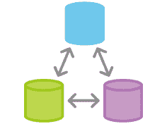

所以，远程 Git 仓库只是我们在本地创建的 Git 仓库的远程副本；如果你通过 SSH、`git://`协议或其他常见协议可以访问该远程仓库，你就可以与它同步修改。

甚至你电脑上的另一个文件夹也可以充当远程仓库：对 Git 而言，文件系统就像任何其他*通信协议*，如果你愿意，可以使用它。

这是我们掌握远程仓库基本概念的方法。

# 克隆本地仓库

在你的磁盘上创建一个新文件夹来克隆我们的`grocery`仓库：

```
[1] ~
$ mkdir grocery-cloned
```

然后使用`git clone`命令克隆`grocery`仓库：

```

[2] ~ $ cd grocery-cloned [3] ~/grocery-cloned $ git clone ~/grocery . Cloning into '.'...
```

完成。

命令末尾的点符号` .`参数意味着*将仓库克隆到当前文件夹*，而`~/grocery`参数实际上是 Git 查找仓库的路径。

现在，直接使用`git log`命令查看：

```
[4] ~/grocery-cloned (master)
$ git log --oneline --graph --decorate --all
* 6409527 (HEAD -> master, origin/master, origin/HEAD) Add a grape
* 603b9d1 Add a peach
| * a8c6219 (origin/melons) Add a watermelon
| * ef6c382 (origin/berries) Add a blackberry
|/
* 0e8b5cf Add an orange
* e4a5e7b Add an apple
* a57d783 Add a banana to the shopping list
```

正如你所见，除了绿色的`master`分支标签，我们在日志输出中还看到一些红色的`origin/<branch>`标签。

# origin

什么是*origin*？

Git 默认将 origin 作为远程仓库的名称。就像分支的`master`一样，`origin`只是一个约定：你可以根据需要将远程仓库命名为任何你喜欢的名字。

这里有一个有趣的地方需要注意，那就是 Git 通过`git log`命令中的`--all`选项，向我们展示了远程仓库中还有其他分支，但正如你所见，它们并没有出现在本地克隆的仓库中。在克隆的仓库中，只有`master`分支。

但是不用担心：你可以通过简单地检出创建一个本地分支来进行本地工作：

```
[5] ~/grocery-cloned (master)
$ git checkout berries
Branch berries set up to track remote branch berries from origin.
Switched to a new branch 'berries'
```

看看消息，Git 说*本地分支已设置为跟踪远程分支*；这意味着，从现在开始，Git 会主动跟踪本地分支与远程分支之间的差异，并在输出消息中通知你这些差异（例如，在使用 `git status` 命令时）。

话虽如此，如果你在这个分支上做一个提交，你可以将它发送到远程，它将成为远程 `origin/berries` 的一部分。

这看起来显而易见，但在 Git 中，你可以根据需要配对分支；例如，如果你愿意，可以通过本地的 `bar` 分支来跟踪远程的 `origin/foo` 分支。或者，你也可以有一些本地分支，它们在远程并不存在。稍后我们将看看如何处理远程分支。

现在，再次查看日志：

```
[6] ~/grocery-cloned (berries)
$ git log --oneline --graph --decorate --all
* 6409527 (origin/master, origin/HEAD, master) Add a grape
* 603b9d1 Add a peach
| * a8c6219 (origin/melons) Add a watermelon
| * ef6c382 (HEAD -> berries, origin/berries) Add a blackberry
|/
* 0e8b5cf Add an orange
* e4a5e7b Add an apple
* a57d783 Add a banana to the shopping list
```

现在，一个绿色的 `berries` 标签出现在靠近红色的 `origin/berries` 标签的位置；这让我们意识到，本地的 `berries` 分支和远程的 `origin/berries` 分支指向相同的提交。

如果我做了一个新的提交，会发生什么？

让我们尝试：

```
[7] ~/grocery-cloned (berries)
$ echo "blueberry" >> shoppingList.txt

[8] ~/grocery-cloned (berries)
$ git commit -am "Add a blueberry"
[berries ab9f231] Add a blueberry
Committer: Santacroce Ferdinando <san@intre.it>
```

你的姓名和电子邮件地址已根据你的*用户名*和*主机名*自动配置。请检查它们是否准确。

你可以通过显式设置来抑制此消息：

```
git config --global user.name "Your Name"
git config --global user.email you@example.com
```

完成此操作后，你可以通过以下代码修复此提交所使用的身份：

```
git commit --amend --reset-author

1 file changed, 1 insertion(+)
```

与上一章一样，Git 提示我关于作者和电子邮件的问题；这次我将使用建议的设置。

好的，让我们看看发生了什么：

```
[9] ~/grocery-cloned (berries)
$ git log --oneline --graph --decorate --all
* ab9f231 (HEAD -> berries) Add a blueberry
| * 6409527 (origin/master, origin/HEAD, master) Add a grape
| * 603b9d1 Add a peach
| | * a8c6219 (origin/melons) Add a watermelon
| |/
|/|
* | ef6c382 (origin/berries) Add a blackberry
|/
* 0e8b5cf Add an orange
* e4a5e7b Add an apple
* a57d783 Add a banana to the shopping list
```

不错！本地的 `berries` 分支向前推进，而 `origin/berries` 仍然停留在原地。

# 使用 git push 分享本地提交

如你所知，Git 在本地工作；不需要远程服务器。

所以，当你做一个提交时，它仅在本地可用；如果你想与远程对等体共享它，你必须以某种方式发送它。

在 Git 中，这叫做 **push**。

现在，我们将尝试将 `berries` 分支中的修改推送到 `origin`；命令是 `git push`，后跟远程名称和目标分支：

```
[10] ~/grocery-cloned (berries)
$ git push origin berries
Counting objects: 3, done.
Delta compression using up to 8 threads.
Compressing objects: 100% (2/2), done.
Writing objects: 100% (3/3), 323 bytes | 0 bytes/s, done.
Total 3 (delta 0), reused 0 (delta 0)
To C:/Users/san/Google Drive/Packt/PortableGit/home/grocery
 ef6c382..ab9f231  berries -> berries

```

哇！这个输出信息包含了很多内容。基本上，Git 在发送提交到远程之前和过程中向我们提供了操作的相关信息。

请注意，Git 只会将它知道的远程不存在的对象（在这种情况下是三个：一个提交、一个树和一个 Blob）发送到远程，它不会发送无法访问的提交，也不会发送与无法访问的提交相关的其他对象（例如树、Blob 或注释，这些对象仅与无法访问的提交相关）。

最后，Git 告诉我们它正在将对象发送到哪里，目标是我的计算机上的另一个文件夹：`To C:/Users/san/Google Drive/Packt/PortableGit/home/grocery`。然后，它告诉我们 `origin/berries` 原本的位置的提交哈希值，以及与本地 `berries` 分支相同的新提交哈希值 `ef6c382..ab9f231`。最后，它给出了两个分支的名称，本地分支和远程分支，`berries -> berries`。

现在，我们显然想查看在远程仓库中，`berries` 分支是否有新的提交；所以，打开 `grocery` 文件夹，在新的控制台中执行 `git log`：

```
[11] ~
$ cd grocery

[12] ~/grocery (master)
$ git log --oneline --graph --decorate --all
* ab9f231 (berries) Add a blueberry
| * 6409527 (HEAD -> master) Add a grape
| * 603b9d1 Add a peach
| | * a8c6219 (melons) Add a watermelon
| |/
|/|
* | ef6c382 Add a blackberry
|/
* 0e8b5cf Add an orange
* e4a5e7b Add an apple
* a57d783 Add a banana to the shopping list
```

是的，太棒了！

提个小提醒：通常，远程仓库副本被管理为 **裸仓库**；在第四章中，*Git 基础 - 小众概念、配置与命令*，我们将对其做一些介绍。因为你通常不会直接在其上工作，裸仓库只包含 `.git` 文件夹；它没有已检出的工作树，也没有 HEAD 引用。相反，我们使用一个普通仓库作为远程仓库。这并不是问题；你只需要记住一件事：你不能向实际检出的远程分支推送更改。

事实上，在那个 `grocery` 仓库中，我们实际上是在 `master` 分支上，而在 `grocery-cloned` 仓库中，我们推送了 `berries` 分支。

这样做的原因非常简单易懂：通过推送到一个远程的已检出的分支，你会影响该仓库中的工作进展，可能会破坏正在进行的更改，这是不公平的。

# 使用 git pull 获取远程提交

现在，是时候尝试相反的操作了：从远程仓库获取更新并将它们应用到我们的本地副本。

所以，在 `grocery` 仓库中做一个新的提交，然后我们将其下载到 `grocery-cloned` 仓库中：

```
[13] ~/grocery (master)
$ printf "\r\n" >> shoppingList.txt
```

我首先需要创建一个新行，因为由于之前的 *葡萄 rebase*，我们最终发现 `shoppinList.txt` 文件的末尾没有新的一行，这是 `echo "" >> <file>` 通常会做的事：

```
[14] ~/grocery (master)
$ echo "apricot" >> shoppingList.txt

[15] ~/grocery (master)
$ git commit -am "Add an apricot"
[master 741ed56] Add an apricot
 1 file changed, 2 insertions(+), 1 deletion(-)
```

好的，现在回到 `grocery-cloned` 仓库。

我们可以通过 `git pull` 从远程获取对象。

事实上，`git pull` 是一个 *超级命令*；实际上，它基本上是另外两个 Git 命令 `git fetch` 和 `git merge` 的合成。在从远程获取对象时，Git 不会强制你将它们合并到本地分支；这可能一开始会让人感到困惑，因为在其他版本控制系统中，如 Subversion，这是默认行为。

相反，Git 更加保守：可能有人在一个分支上推送了一个或多个提交，但你意识到这些提交对你来说不合适，或者它们根本就是错的。所以，通过使用 `git fetch`，你可以获取并检查这些提交，然后再通过 `git merge` 将它们应用到你的本地分支上。

现在先尝试一下 `git pull`，然后我们会分别尝试使用 `git fetch` 和 `git merge`。

返回到 `grocery-cloned` 仓库，切换到 `master` 分支，然后执行 `git pull`：

```
[16] ~/grocery-cloned (berries)
$ git checkout master
Your branch is up-to-date with 'origin/master'.
Switched to branch 'master'
```

Git 说我们的分支与 `'origin/master'` 是最新的，但这并不是真的，因为我们刚刚在那里做了一个新的提交。这是因为，对于 Git 来说，唯一能知道我们是否已更新相对于远程仓库的方式是执行 `git fetch`，而我们没有这么做。稍后我们将更加清楚地看到这一点。

目前，使用 `git pull`：该命令需要你指定要拉取的远程仓库名称，这里是 `origin`，然后是你想要合并到本地分支的分支，当然是 `master`：

```
[17] ~/grocery-cloned (master)
$ git pull origin master
remote: Counting objects: 3, done.
remote: Compressing objects: 100% (2/2), done.
remote: Total 3 (delta 0), reused 0 (delta 0)
Unpacking objects: 100% (3/3), done.
From C:/Users/san/Google Drive/Packt/PortableGit/home/grocery
 * branch    master     -> FETCH_HEAD
 6409527..741ed56  master     -> origin/master
Updating 6409527..741ed56
Fast-forward
 shoppingList.txt | 3 ++-
 1 file changed, 2 insertions(+), 1 deletion(-)

```

很好！Git 告诉我们有三个新的对象需要获取；在获取它们后，它会在本地 `master` 分支上执行合并，在这种情况下，它执行的是快进合并。

好的，现在我想让你分开执行这些步骤；在 `grocery` 仓库的 `master` 分支上创建一个新的提交：

```
[18] ~/grocery (master)
$ echo "plum" >> shoppingList.txt

[19] ~/grocery (master)
$ git commit -am "Add a plum"
[master 50851d2] Add a plum
1 file changed, 1 insertion(+)
```

现在在 `grocery-cloned` 仓库上执行 `git fetch`：

```
[20] ~/grocery-cloned (master)
$ git fetch
remote: Counting objects: 3, done.
remote: Compressing objects: 100% (2/2), done.
remote: Total 3 (delta 0), reused 0 (delta 0)
Unpacking objects: 100% (3/3), done.
From C:/Users/san/Google Drive/Packt/PortableGit/home/grocery
 741ed56..50851d2  master     -> origin/master

```

如你所见，Git 在远程找到了新的对象，并下载了它们。

请注意，你可以在任何分支中执行 `git fetch`，因为它只是下载远程对象；它不会合并这些对象。而在执行 `git pull` 时，你必须确保自己处于正确的本地目标分支。

现在执行 `git status`：

```
[21] ~/grocery-cloned (master)
$ git status
On branch master
Your branch is behind 'origin/master' by 1 commit, and can be fast-forwarded.
 (use "git pull" to update your local branch)
nothing to commit, working tree clean

```

好的，正如你所见，当有远程仓库时，`git status` 会告诉你本地仓库与远程仓库之间的 *同步* 状态；在这里它告诉我们，我们落后于远程仓库，因为远程仓库的 `master` 分支比我们多了一个提交，而这个提交可以通过快进合并。

现在，让我们通过 `git merge` 进行同步；为了合并一个远程分支，我们必须指定分支名称和远程仓库名称，正如我们之前在 `git pull` 命令中所做的那样：

```
[22] ~/grocery-cloned (master)
$ git merge origin master
Updating 741ed56..50851d2
Fast-forward
 shoppingList.txt | 1 +
 1 file changed, 1 insertion(+)
```

就这些！

这基本上就是你需要了解的远程仓库操作的全部内容。注意，如果远程仓库的某些更改与你本地的更改发生冲突，你需要像我们在前面的合并示例中一样解决这些冲突。

# Git 如何跟踪远程仓库

Git 以类似存储本地分支标签的方式存储远程分支标签；它在 `refs` 目录下为作用域创建一个子文件夹，并使用我们为远程仓库指定的符号名称，在这种情况下是 `origin`，默认名称：

```
[23] ~/grocery-cloned (master)
$ ll .git/refs/remotes/origin/
total 3
drwxr-xr-x 1 san 1049089  0 Aug 27 11:25 ./
drwxr-xr-x 1 san 1049089  0 Aug 26 18:19 ../
-rw-r--r-- 1 san 1049089 41 Aug 26 18:56 berries
-rw-r--r-- 1 san 1049089 32 Aug 26 18:19 HEAD
-rw-r--r-- 1 san 1049089 41 Aug 27 11:25 master

```

处理远程仓库的命令是 `git remote`；你可以用它添加、删除、重命名、列出远程仓库，还可以做很多其他操作；这里没有空间展示所有选项。如果你需要了解更多关于 `git remote` 命令的信息，请参考 Git 指南。

现在，我们将在公共服务器上玩一点远程仓库；我们将使用免费的 GitHub 托管服务。

# 在 GitHub 上使用公共服务器

要开始使用公共托管远程仓库，我们需要先获得一个。如今，实现这一点并不困难；世界上有许多免费的在线服务提供 Git 仓库空间，其中最常用的之一是 **GitHub**。

# 设置一个新的 GitHub 账户

GitHub 提供无限的免费公共仓库，因此我们可以在不投入一分钱的情况下使用它。在 GitHub 上，只有需要私有仓库时才需要付费；例如，用于存储你基于其业务的闭源代码。

创建新账户很简单：

1.  访问 [`github.com`](https://github.com/)。

1.  按照以下图片填写文本框，提供用户名、密码和你的电子邮件来注册：

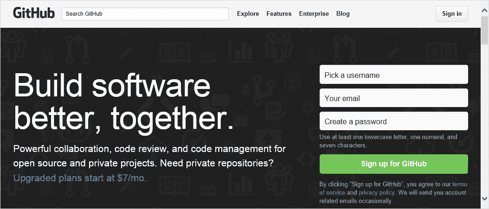

完成后，我们可以创建一个全新的仓库，将我们的工作推送到其中：

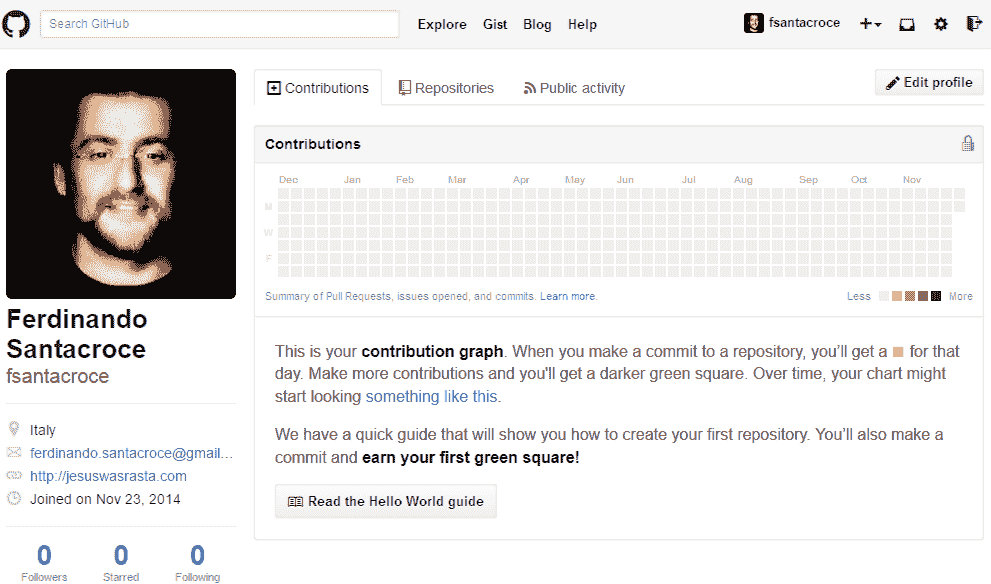

转到“Repositories”标签页，点击绿色的“New”按钮，并为你的仓库选择一个名称，如下截图所示：

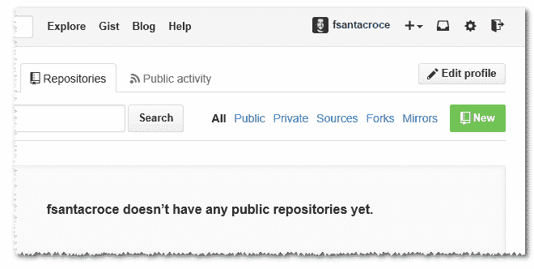

为了学习的目的，我将创建一个简单的个人食谱仓库，使用**Markdown 标记语言**编写（[`daringfireball.net/projects/markdown/`](http://daringfireball.net/projects/markdown/)）：

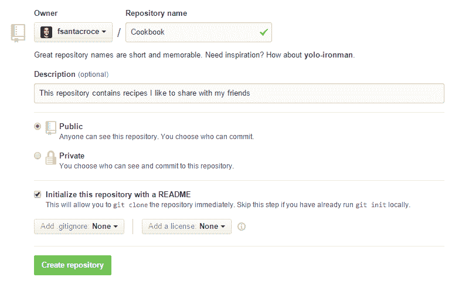

然后，你可以为仓库编写描述；这有助于让访问你个人资料的人更好地了解你的项目用途。我们创建的是公共仓库，因为私有仓库有费用，正如我们之前所说的，然后我们初始化时选择了一个`README`文件；选择这一项时，GitHub 会为我们进行第一次提交，初始化仓库，现在它已准备好进行克隆。

# 克隆仓库

现在，我们已经有了一个远程仓库，是时候将它*挂载*到本地了。为此，Git 提供了`git clone`命令，正如我们已经看到的那样。

使用这个命令很简单；在这种情况下，我们需要知道的唯一信息就是要克隆的仓库 URL。这个 URL 由 GitHub 提供，在仓库主页的右下方：

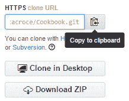

要复制 URL，你可以简单地点击文本框右侧的剪贴板按钮。

那么，让我们一起尝试按以下步骤操作：

1.  转到本地仓库的根文件夹。

1.  在其中打开一个 Bash shell。

1.  输入`git clone https://github.com/fsantacroce/Cookbook.git`。

显然，你的仓库 URL 会有所不同；正如你所看到的，GitHub 的 URL 形式如下：`https://github.com/<Username>/<RepositoryName>.git`：

```
[1] ~
$ git clone https://github.com/fsantacroce/Cookbook.git
Cloning into 'Cookbook'...
remote: Counting objects: 15, done.
remote: Total 15 (delta 0), reused 0 (delta 0), pack-reused 15
Unpacking objects: 100% (15/15), done.

[2] ~
$ cd Cookbook/

[3] ~/Cookbook (master)
$ ll
total 13
drwxr-xr-x 1 san 1049089   0 Aug 27 14:16 ./
drwxr-xr-x 1 san 1049089   0 Aug 27 14:16 ../
drwxr-xr-x 1 san 1049089   0 Aug 27 14:16 .git/
-rw-r--r-- 1 san 1049089 150 Aug 27 14:16 README.md

```

此时，Git 会创建一个新的`Cookbook`文件夹，其中包含我们仓库的下载副本；在里面，我们会找到一个`README.md`文件，这是一个经典的 GitHub 仓库文件。在该文件中，你可以使用常见的 Markdown 标记语言描述你的仓库，供其他偶然访问的人使用。

# 将修改上传到远程仓库

那么，让我们尝试编辑`README.md`文件并将修改上传到 GitHub：

1.  使用你喜欢的编辑器编辑`README.md`文件，例如，添加一句新话。

1.  将其添加到索引中，然后提交。

1.  使用`git push`命令将你的提交推送到远程仓库。

但首先，设置用户和电子邮件，这样 Git 就不会输出我们在前面章节看到的消息：

```
[4] ~/Cookbook (master)
$ git config user.name "Ferdinando Santacroce"

[5] ~/Cookbook (master)
$ git config user.email "ferdinando.santacroce@gmail.com"

[6] ~/Cookbook (master)
$ vim README.md

Add a sentence then save and close the editor.

[7] ~/Cookbook (master)
$ git add README.md

[8] ~/Cookbook (master)
$ git commit -m "Add a sentence to readme"
[master 41bdbe6] Add a sentence to readme
 1 file changed, 2 insertions(+)

```

现在，试着输入`git push`并按下`ENTER`，无需指定其他内容：

```
[9] ~/Cookbook (master)
$ git push
```

在我的 Windows 10 工作站中，会出现如下窗口：

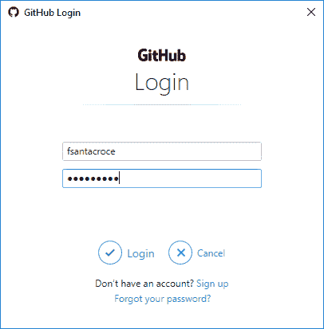

这是**Git 凭证管理器**；它允许你在 Windows 机器上设置凭证。如果你使用的是 Linux 或 macOS，情况可能有所不同，但基本概念是一样的：我们必须给 Git 提供凭证以访问远程的 GitHub 仓库；然后这些凭证将被存储到我们的系统中。

输入你的凭证，然后按下登录按钮；之后，Git 会继续执行：

```
[10] ~/Cookbook (master)
$ git push
Counting objects: 3, done.
Delta compression using up to 8 threads.
Compressing objects: 100% (2/2), done.
Writing objects: 100% (3/3), 328 bytes | 0 bytes/s, done.
Total 3 (delta 1), reused 0 (delta 0)
remote: Resolving deltas: 100% (1/1), completed with 1 local object.
To https://github.com/fsantacroce/Cookbook.git
 e1e7236..41bdbe6  master -> master

```

`git push`命令允许你将本地工作内容*上传*到配置的远程位置；在这种情况下，上传到一个远程的 GitHub 仓库，如下图所示：

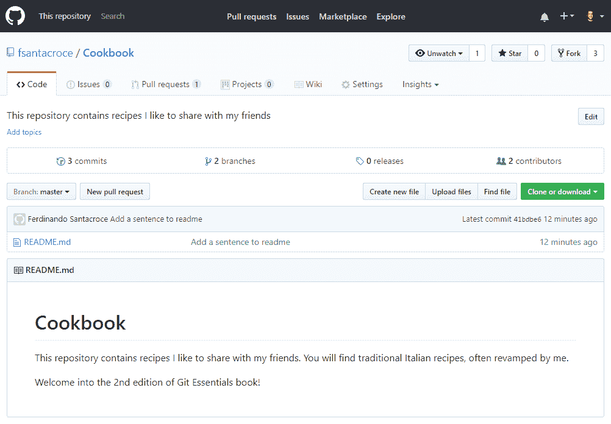

我们需要了解更多关于推送的内容；我们可以开始理解在执行`git push`命令后 Git 给我们的信息。

# 当我推送时，我会发送什么到远程仓库？

当你执行一个没有指定其他内容的`git push`时，Git 会将所有**新提交**以及你在当前分支本地做的所有相关对象发送到远程；对于*新提交*来说，意味着我们只会发送那些尚未上传的本地提交。

# 将新分支推送到远程

显然，我们可以创建并将新分支推送到远程，使我们的工作对其他协作者公开可见；例如，我将为一个新食谱创建一个新分支，然后推送到远程的 GitHub 服务器。按照以下简单步骤操作：

1.  创建一个新分支，例如`Risotti`。

1.  给它添加一个新文件，例如`Risotto-alla-Milanese.md`，然后提交。

1.  使用`git push -u origin Risotti`命令将分支推送到远程仓库：

```
 [11] ~/Cookbook (master)
      $ git branch Risotti

      [12] ~/Cookbook (master)
      $ git checkout Risotti

      [13] ~/Cookbook (Risotti)
      $ notepad Risotto-alla-Milanese.md

      [14] ~/Cookbook (Risotti)
      $ git add Risotto-alla-Milanese.md

      [15] ~/Cookbook (Risotti)
      $ git commit -m "Add risotto alla milanese recipe ingredients"
      [Risotti b62bc1f] Add risotto alla milanese recipe ingredients
       1 file changed, 15 insertions(+)
       create mode 100644 Risotto-alla-Milanese.md

      [16] ~/Cookbook (Risotti)
      $ git push -u origin Risotti
      Total 0 (delta 0), reused 0 (delta 0)
      Branch Risotti set up to track remote branch Risotti from origin.
      To https://github.com/fsantacroce/Cookbook.git
       * [new branch]      Risotti -> Risotti
```

在继续之前，我们需要深入检查一些在执行`git push`命令后发生的事情。

# origin

通过`git push -u origin Risotti`命令，我们告诉 Git 将我们的`Risotti`分支（以及其中的提交）上传到`origin`；使用`-u`选项，我们设置本地分支以跟踪远程分支。

我们知道，`origin`是仓库的默认远程仓库，就像`master`是默认的分支名称一样；当你从远程克隆一个仓库时，那个远程仓库会变成你的`origin`别名。当你告诉 Git 推送或拉取某些内容时，你通常需要指定你想使用的远程仓库；使用别名`origin`，你告诉 Git 你想使用默认的远程仓库。

如果你想查看在你的仓库中实际配置的远程仓库，可以输入简单的`git remote`命令，然后加上`-v`（`--verbose`）来获取更多细节：

```
[17] ~/Cookbook (master)
$ git remote -v
origin  https://github.com/fsantacroce/Cookbook.git (fetch)
origin  https://github.com/fsantacroce/Cookbook.git (push)

```

在详情中，你将看到远程仓库的完整 URL，并且发现 Git 存储了两个不同的 URL：

+   Fetch URL，指的是我们从其他地方获取更新的地址

+   Push URL，指的是我们将更新发送给其他人的地址

这使得我们可以从不同的远程仓库推送和拉取更改，如果你愿意的话，并且强调了 Git 如何被认为是一个对等版本控制系统。

你可以使用`git remote`命令来添加、更新和删除远程仓库。

# 跟踪分支

使用 `-u` 选项，我们告诉 Git **追踪**远程分支。追踪远程分支是 *将你的本地分支与远程分支关联起来的方式*；请注意，这种行为不是自动的，如果你想要它，你必须手动设置。当一个本地分支追踪一个远程分支时，实际上你有一个本地和一个远程分支，它们可以轻松同步（请注意，一个本地分支只能追踪一个远程分支）。这在你需要与远程同事在同一分支上协作时非常有用，可以让所有人保持自己的工作与其他人的更改同步。

为了更好地理解我们当前仓库的配置方式，可以尝试输入 `git remote show origin`：

```
[18] ~/Cookbook (master)
$ git remote show origin
* remote origin
 Fetch URL: https://github.com/fsantacroce/Cookbook.git
 Push  URL: https://github.com/fsantacroce/Cookbook.git
 HEAD branch: master
 Remote branches:
 Pasta   tracked
 Risotti tracked
 master  tracked
 Local branches configured for 'git pull':
 Risotti merges with remote Risotti
 master  merges with remote master
 Local refs configured for 'git push':
 Risotti pushes to Risotti (up to date)
 master  pushes to master  (fast-forwardable)

```

如你所见，`Pasta` **,** `Risotti` 和 `master` 分支都在被追踪。

你还会看到你的本地分支已配置为推送和拉取具有相同名称的远程分支，但请记住：本地和远程分支不需要具有相同的名称；本地分支 `foo` 可以追踪远程分支 `bar`，反之亦然；没有任何限制。

# 回退操作 – 将本地仓库发布到 GitHub

通常情况下，你会需要将本地仓库放置到一个共享的位置，以便其他人查看你的工作；在这一节中，我们将学习如何实现这个目的。

按照以下简单步骤创建一个新的本地仓库进行发布：

1.  进入我们的本地仓库文件夹。

1.  创建一个新的 `HelloWorld` 文件夹。

1.  在其中创建一个新的仓库，像我们在第一章中做的那样。

1.  添加一个新的`README.md`文件并提交：

```
 [19] ~
      $ mkdir HelloWorld

      [20] ~
      $ cd HelloWorld/

      [21] ~/HelloWorld
      $ git init
      Initialized empty Git repository in C:/Users/san/Google 
      Drive/Packt/PortableGit/home/HelloWorld/.git/

      [22] ~/HelloWorld (master)
      $ echo "Hello World!" >> README.md

      [23] ~/HelloWorld (master)
      $ git add README.md

      [24] ~/HelloWorld (master)
      $ git config user.name "Ferdinando Santacroce"

      [25] ~/HelloWorld (master)
      $ git config user.email "ferdinando.santacroce@gmail.com"

      [26] ~/HelloWorld (master)
      $ git commit -m "First commit"
      [master (root-commit) 5b41441] First commit
       1 file changed, 1 insertion(+)
       create mode 100644 README.md

      [27] ~/HelloWorld (master)
```

现在，像我们之前一样创建 GitHub 仓库；这次将它留空，不要初始化 README 文件，因为我们已经在本地仓库中有一个。以下是直接从 GitHub 仓库创建页面截取的截图：

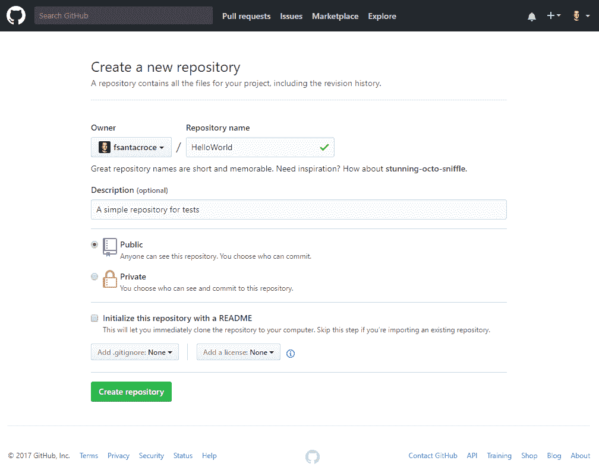

此时，我们准备好将本地仓库发布到 GitHub，或者更好地说，向其添加一个远程仓库。

# 向本地仓库添加远程仓库

为了发布我们的 `HelloWorld` 仓库，我们只需添加它的第一个远程仓库；添加远程仓库非常简单：`git remote add origin <remote-repository-url>`

所以，这是我们需要在 Bash shell 中输入的完整命令：

```
[27] ~/HelloWorld (master)
$ git remote add origin https://github.com/fsantacroce/HelloWorld.git
```

向本地仓库添加远程仓库就像添加或修改其他配置参数一样，简单地编辑 `.git` 文件夹中的一些文本文件，所以速度非常快。

# 将本地分支推送到远程仓库

之后，使用 `git push -u origin master` 将本地更改推送到远程：

```
[28] ~/HelloWorld (master)
$ git push -u origin master
Counting objects: 3, done.
Writing objects: 100% (3/3), 231 bytes | 0 bytes/s, done.
Total 3 (delta 0), reused 0 (delta 0)
Branch master set up to track remote branch master from origin.
To https://github.com/fsantacroce/HelloWorld.git
 * [new branch]      master -> master
```

就这样！

# 社交编程 - 使用 GitHub 协作

GitHub 的商标就是所谓的 **社交编程** 概念；从一开始，GitHub 就让分享代码、跟踪他人工作以及使用两种基本概念进行协作变得简单：**分叉** 和 **拉取请求**。在这一节中，我将简要说明它们。

# 分叉一个仓库

分叉是开发者常见的概念；如果你曾经使用过基于 GNU-Linux 的发行版，你就会知道有一些先驱者，比如 Debian，以及一些衍生发行版，比如 Ubuntu，这些通常被称为原始发行版的 *fork*。

在 GitHub 中也类似。某个时刻，你会发现一个你希望稍微修改、甚至完美契合你需求的有趣开源项目；同时，你还希望从原始项目中受益，获取 bug 修复和新功能，保持你的工作与原始项目的联系。在这种情况下，正确的做法是 *fork* 该项目。但首先，请记住：**fork 并不是 Git 的术语**，它是 GitHub 的术语。

当你在 GitHub 上进行分叉时，*你实际上获得的是该仓库在你 GitHub 账户上的服务器端克隆*；如果你将分叉后的仓库克隆到本地，在远程列表中，你会看到一个指向你账户仓库的 `origin`，而原始仓库则会使用 *upstream* 别名（反正你需要手动添加它）：

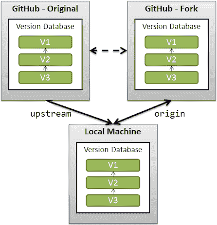

为了更好地理解这个功能，去你的 GitHub 账户并尝试分叉一个名为 `Spoon-Knife` 的常见 GitHub 仓库，它由 GitHub 吉祥物用户 `octocat` 创建；所以：

1.  登录到你的 GitHub 账户

1.  使用位于页面左上方的搜索框搜索 `spoon-knife`：

1.  点击第一个结果，octocat/Spoon-Knife 仓库

1.  使用页面右侧的 Fork 按钮分叉仓库：

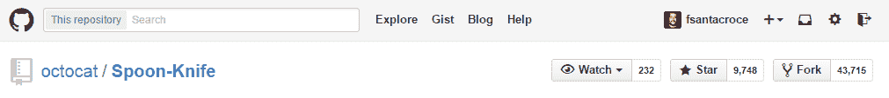

1.  在一次有趣的复印动画后，你将在 GitHub 账户中获得一个全新的 Spoon-Knife 仓库：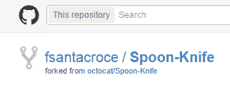

现在，你可以像之前那样将该仓库克隆到本地：

```
[1] ~
$ git clone https://github.com/fsantacroce/Spoon-Knife.git
Cloning into 'Spoon-Knife'...
remote: Counting objects: 19, done.
remote: Total 19 (delta 0), reused 0 (delta 0), pack-reused 19
Unpacking objects: 100% (19/19), done.

[2] ~
$ cd Spoon-Knife

[3] ~/Spoon-Knife (master)
$ git remote -v
origin  https://github.com/fsantacroce/Spoon-Knife.git (fetch)
origin  https://github.com/fsantacroce/Spoon-Knife.git (push)

```

如你所见，`upstream` 远程并未出现，你需要手动添加它；要添加它，可以使用 `git remote add` 命令：

```
[4] ~/Spoon-Knife (master)
$ git remote add upstream https://github.com/octocat/Spoon-Knife.git

[5] ~/Spoon-Knife (master)
$ git remote -v
origin https://github.com/fsantacroce/Spoon-Knife.git (fetch)
origin https://github.com/fsantacroce/Spoon-Knife.git (push)
upstream https://github.com/octocat/Spoon-Knife.git (fetch)
upstream https://github.com/octocat/Spoon-Knife.git (push)

```

现在，你可以保持本地仓库与远程仓库 `origin` 中的更改同步，同时你也可以获取来自 `upstream` 远程的更改，即你分叉的原始仓库的更改。此时，你可能会想知道如何处理两个不同的远程仓库；其实很简单：只需从 `upstream` 远程拉取并将这些修改合并到本地仓库，然后将它们与你的更改一起推送到 `origin` 远程。如果其他人克隆了你的仓库，他或她将收到你的工作与其他人在原始仓库上所做工作的合并结果。

# 提交拉取请求

如果你创建了一个仓库的分叉，那是因为你不是原始项目的直接贡献者，或者你只是想在熟悉代码之前避免在他人的工作中做出干扰。

然而，某个时候，你意识到你的工作甚至对原始项目也有帮助：你实现了之前代码的更好版本，增加了缺失的功能，等等。

所以，你发现自己需要通知原作者你做了一些有趣的事情，询问他是否想看看，或者是否可能整合你的工作。这时，**拉取请求**就派上用场了。

拉取请求是一种告诉原作者的方式，*嘿！我用你的原始代码做了一些有趣的事情，你想看看并整合我的工作吗，如果你觉得足够好？* 这不仅是一个技术手段来实现工作整合的目的，它甚至是一个推广**代码审查**（然后是所谓的*社交编程*）的强大实践，这种做法是*极限编程*（eXtreme Programming）倡导者推荐的（更多信息，请访问：[`en.wikipedia.org/wiki/Extreme_programming`](http://en.wikipedia.org/wiki/Extreme_programming)）。

使用拉取请求的另一个原因是，**如果你不是原始项目的贡献者，你无法直接推送**到`upstream`远程仓库：拉取请求是唯一的方式。在一些小的场景下（比如一个由两三位开发人员组成的团队在同一房间工作），*分叉和拉取*模式可能显得有些额外开销，因此更常见的做法是直接与所有贡献者共享原始代码库，跳过分叉和拉取的过程。

# 创建一个拉取请求

要创建一个拉取请求，你必须进入你的 GitHub 账户，并直接在你的分叉账户中创建；但首先，你需要知道**拉取请求只能从不同的分支创建**。到目前为止，你应该已经习惯了为新的特性或重构目的创建一个新分支，所以这并不算新鲜事，对吧？

为了进行尝试，让我们在我们的代码库中创建一个本地的`TeaSpoon`分支，提交一个新文件，并推送到我们的 GitHub 账户：

```
[6] ~/Spoon-Knife (master)
$ git branch TeaSpoon

[7] ~/Spoon-Knife (master)
$ git checkout TeaSpoon
Switched to branch 'TeaSpoon'

[8] ~/Spoon-Knife (TeaSpoon)
$ vi TeaSpoon.md

[9] ~/Spoon-Knife (TeaSpoon)
$ git add TeaSpoon.md

[10] ~/Spoon-Knife (TeaSpoon)
$ git commit -m "Add a TeaSpoon to the cutlery"
[TeaSpoon 62a99c9] Add a TeaSpoon to the cutlery
1 file changed, 2 insertions(+)
 create mode 100644 TeaSpoon.md

[11] ~/Spoon-Knife (TeaSpoon)
$ git push origin TeaSpoon
Counting objects: 3, done.
Delta compression using up to 8 threads.
Compressing objects: 100% (3/3), done.
Writing objects: 100% (3/3), 417 bytes | 0 bytes/s, done.
Total 3 (delta 0), reused 0 (delta 0)
To https://github.com/fsantacroce/Spoon-Knife.git
 d0dd1f6..62a99c9  TeaSpoon -> TeaSpoon

```

如果你查看你的账户，你会发现一个惊喜：在你的`Spoon-Knife`代码库中，现在有一个“新建拉取请求”按钮，目的是启动一个拉取请求，如下图所示：

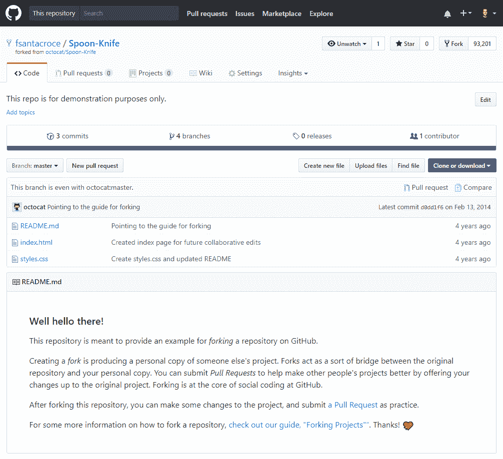

点击该按钮后，GitHub 会打开一个新页面；现在你需要选择要与原始代码库进行比较的分支；请查看以下截图：

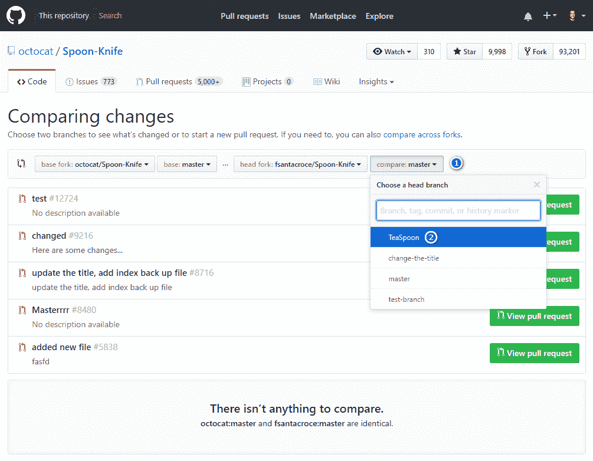

转到分支选择框（1），选择`TeaSpoon`分支（2），然后 GitHub 会显示类似下面的截图：

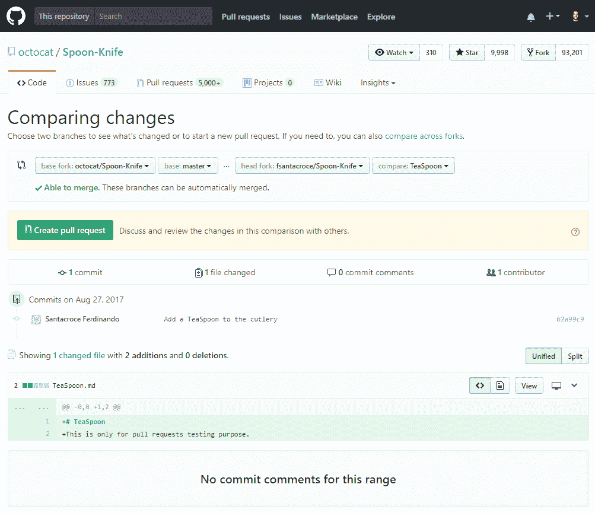

这是一个报告，你可以在其中看到你将要提议的内容：包含新文件的提交。

但让我来分析一下这个页面。

在前面的截图的左上角，你会看到 GitHub 正在为你比较哪些分支；请看下面的图片了解更多细节：

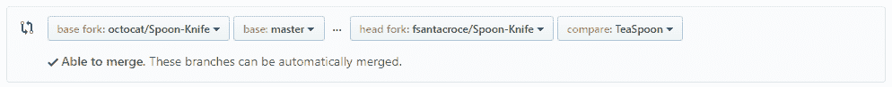

这意味着你即将比较你本地的`TeaSpoon`分支与`octocat`用户的原始`master`分支。页面底部，你可以看到所有不同的细节（添加、删除、修改的文件等）：

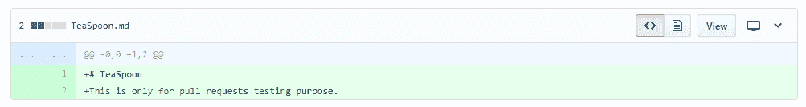

现在，你可以点击绿色的“创建拉取请求”按钮；以下截图中的窗口将会出现：

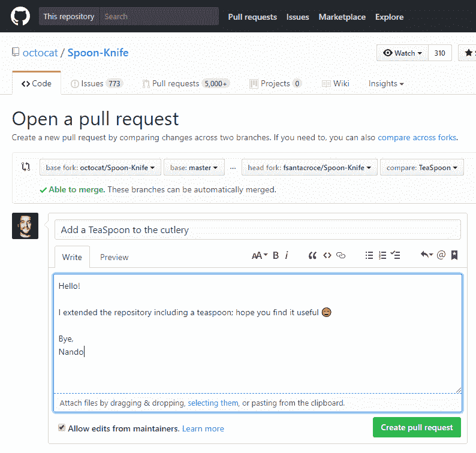

在页面的中央部分，你可以描述你在分支上所做的工作。左上角的绿色“可以合并”文本通知你，这两个分支可以自动合并（没有未解决的冲突；如果你希望看到你的工作被采纳，这是非常好的）。

现在，最后一步：点击“创建拉取请求”按钮，将你的请求发送给原始作者，让他接收你的工作并在接受拉取请求之前进行分析。

此时，一个新的对话开始了，你和项目协作者可以开始讨论你的工作；在此期间，你和其他协作者可以修改代码，以更好地满足共同需求，直到原始仓库的协作者决定接受或丢弃你的请求，从而关闭拉取请求。

# 总结

在这一章中，我们终于接触到了 Git 管理多个远程仓库副本的能力。这为你提供了广泛的可能性，以更好地组织团队内部的协作工作流程。在下一章中，你将学习一些高级技巧，使用知名和小众的命令，这将使你成为一个更安全、更熟练的 Git 用户，轻松解决开发者生活中常见的问题。
