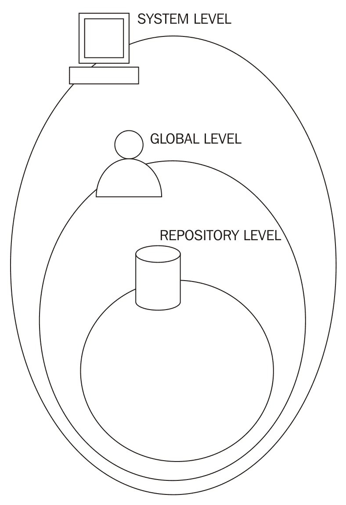
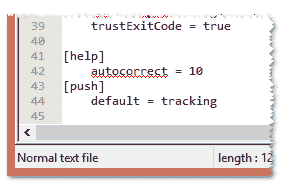
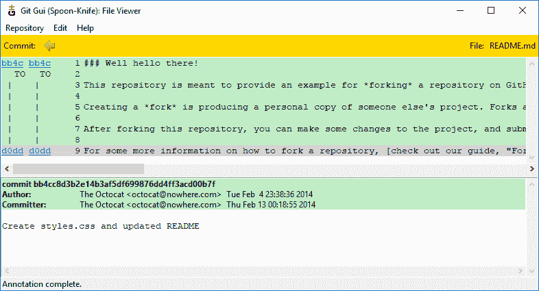

# Git 基础知识 - 特殊概念、配置和命令

本章是一些简短但实用的技巧集合，旨在让我们的 Git 使用体验更加舒适。在前面的三章中，我们学习了使用 Git 工具进行版本控制的基本概念；现在是时候深入了解 Git 中的一些强大武器以及如何使用它们（最好是避免自毁）。

# 分析 Git 配置

本章的第一部分，你将学习如何增强 Git 配置，使其更好地满足你的需求并加速日常工作：是时候熟悉配置的内部原理了。

# 配置架构

配置选项存储在纯文本文件中。`git config` 命令只是一个方便的工具，用于编辑这些文件，无需记住它们存储的位置并打开文本编辑器。

# 配置级别

在 Git 中，我们有*三个配置级别*：

+   系统

+   全局（用户范围）

+   仓库级别

每个不同的配置级别都有不同的配置文件。

基本上，你可以根据需要在每个级别设置所有参数。如果在不同级别设置相同的参数，最低级别的参数会覆盖上级的参数；例如，如果在全局级别设置了 `user.name`，它会覆盖系统级别设置的同一项，如果在仓库级别设置，它会覆盖全局级别和系统级别的设置。

下图将帮助你更好地理解这些级别：



# 系统级别

系统级别包含**系统范围的配置**；如果你在此级别编辑配置，*所有用户和每个用户的仓库都会受到影响*。

此配置通常存储在 `gitconfig` 文件中，位置如下：

+   Windows: `C:\Program Files\Git\etc\gitconfig`

+   Linux: `/etc/gitconfig`

+   macOS: `/usr/local/git/etc/gitconfig`

要在此级别编辑参数，必须使用 `--system` 选项；请注意，它需要管理员权限（例如，在 Linux 和 macOS 上需要 root 权限）。

总之，作为一个经验法则，*不建议在系统级别编辑配置*，建议修改每个用户的配置。

# 全局级别

全局级别包含**用户范围的配置**；如果你在此级别编辑配置，*每个用户的仓库都会受到影响*。

此配置通常存储在 `.gitconfig` 文件中，位置如下：

+   Windows: `C:\Users\<UserName>\.gitconfig`

+   Linux: `~/.gitconfig`

+   macOS: `~/.gitconfig`

要在此级别编辑参数，必须使用 `--global` 选项。

# 仓库级别

仓库级别包含**仅限仓库的配置**；如果你在此级别编辑配置，*只有正在使用的仓库会受到影响*。

该配置存储在 `.git` 仓库子文件夹中的 `config` 文件里：

+   Windows: `C:\<MyRepoFolder>\.git\config`

+   Linux: `~/<MyRepoFolder>/.git/config`

+   macOS: `~/<MyRepoFolder>/.git/config`

要在此级别编辑参数，可以使用 `--local` 选项，或者直接避免使用任何选项，因为这是默认选项。

# 配置列表

要获取当前使用的所有配置列表，可以运行 `git config --list` 命令；如果你在一个仓库内，它将显示所有配置，从仓库级别到系统级别。为了过滤列表，可以选择性地附加 `--system`、`--global` 或 `--local` 选项，只显示所需级别的配置：

```
[1] ~/grocery (master) 
$ git config --list --local 
core.repositoryformatversion=0 
core.filemode=false 
core.bare=false 
core.logallrefupdates=true 
core.symlinks=false 
core.ignorecase=true 
user.name=Ferdinando Santacroce 
user.email=ferdinando.santacroce@gmail.com 
```

# 手动编辑配置文件

即使通常不推荐这么做，你也可以通过直接编辑文件来修改 Git 配置。Git 配置文件非常容易理解，所以当你在网上寻找想要设置的特定配置时，通常会找到完全对应的文本行；在这种情况下，唯一的小心之处是，在编辑之前备份文件，以防万一弄乱了它们。在接下来的段落中，我们将尝试以这种方式进行一些更改。

# 设置其他环境配置

如果你不能将 Git 方便地融入到你的工作环境中，使用 Git 可能是一个痛苦的经历。让我们开始使用一些自定义配置来修复一些粗糙的地方。

# 基本配置

在前面的章节中，我们已经看到可以使用 `git config` 和 `<variable.name> <value>` 语法来更改 Git 变量的值。在本节中，我们将使用 `config` 命令来修改一些 Git 行为。

# 拼写错误自动修正

所以，让我们尝试解决一个关于输入命令的恼人问题：*拼写错误*。我经常发现自己不得不重复输入相同的命令两次或更多次；Git 可以帮助我们实现内嵌的 *自动修正*，但我们首先需要启用它。要启用它，必须修改 `help.autocorrection` 参数，定义 Git 在执行假定命令之前会等待多少十分之一秒；例如，设置 `help.autocorrect 10`，Git 将等待一秒钟：

```
[2] ~/grocery (master) 
$ git config --global help.autocorrect 10 

[3] ~/grocery (master) 
$ git chekcout 
WARNING: You called a Git command named 'chekcout', which does not exist. 
Continuing under the assumption that you meant 'checkout' 
in 1.0 seconds automatically... 
```

要中止自动修正，只需按 *Ctrl*+*C*。

现在我们已经了解了配置文件，你可以注意到我们通过命令行设置的参数是这种形式：`section.parameter_name`。如果你查看配置文件，可以在 `[]` 中看到部分名称；例如，在 `C:\Users\<UserName>\.gitconfig` 中：



# 推送默认行为

我们已经讨论过 `git push` 命令及其默认行为。为了避免恼人的问题，最好为此命令设置一个更方便的默认行为。

我们有两种方法可以做到这一点。第一种方法是：设置 Git 每次都询问我们要推送的分支名称，这样简单的 `git push` 将不起作用。为了实现这一点，将 `push.default` 设置为 `nothing`：

```
[1] ~/grocery-cloned (master) 
$ git config --global push.default nothing 

[2] ~/grocery-cloned (master) 
$ git push 
fatal: You didn't specify any refspecs to push, and push.default is "nothing". 
```

如你所见，现在 Git 假装你在每次推送时都指定了目标分支。

这可能太过严格，但至少你可以避免一些常见错误，例如将个人本地分支推送到远程，从而在团队中产生混乱。

另一个避免此类错误的方法是将`push.default`参数设置为`simple`，这样只有在远程分支与本地分支同名时，Git 才会进行推送：

```
[3] ~/grocery-cloned (master) 
$ git config --global push.default simple 

[4] ~/grocery-cloned (master) 
$ git push 
Everything up-to-date 
```

这将把本地跟踪分支推送到远程。

# 定义默认编辑器

有些人真的不喜欢`vim`，即便是仅用于编写提交信息；如果你是其中之一，好消息是：你可以通过设置`core.default`配置参数来更改它：

```
[1] ~/grocery (master) 
$ git config --global core.editor notepad 
```

显然，你可以设置市场上几乎所有可用的文本编辑器。如果你是 Windows 用户，记住编辑器的完整路径必须在`PATH`环境变量中；基本上，如果你能通过在 DOS 命令行中输入可执行文件的名称来运行你喜欢的编辑器，那么在 Git 的 Bash 命令行中也可以使用它。

# 其他配置

你可以在[git-scm.com/docs/git-config](http://git-scm.com/docs/git-config)浏览更多的配置变量列表。

# Git 别名

我们已经提到过 Git 别名及其目的；在这一部分，我只会建议一些更多的别名，以帮助简化操作。

# 常用命令的快捷方式

有一个你可能会觉得有用的技巧是*简化常用命令*，例如`git checkout`等；因此，实用的别名可以包括以下内容：

```
[1] ~/grocery (master) 
$ git config --global alias.co checkout 

[2] ~/grocery (master) 
$ git config --global alias.br branch 

[3] ~/grocery (master) 
$ git config --global alias.ci commit 

[4] ~/grocery (master) 
$ git config --global alias.st status 
```

另一种常见做法是简化命令，添加一个或多个你经常使用的选项；例如，将`git cm <commit message>`命令快捷方式设置为`git commit -m <commit message>`：

```
[5] ~/grocery (master) 
$ git config --global alias.cm "commit -m" 

[6] ~/grocery (master) 
$ git cm "My commit message" 
On branch master 
nothing to commit, working tree clean 
```

# 创建命令

另一个常见的自定义 Git 体验的方法是*创建你认为应该存在的命令*。

# git unstage

经典示例是`git unstage`别名：

```
[1] ~/grocery (master) 
$ git config --global alias.unstage 'reset HEAD --' 
```

使用这个别名，你可以比使用等效的`git reset HEAD -- <file>`语法更有意义地从索引中移除文件：

```
[2] ~/grocery (master)
$ git unstage myFile.txt
```

现在的行为和下面这个相同：

```
[3] ~/grocery (master) 
$ git reset HEAD -- myFile.txt 
```

# git undo

想要快速撤销上次正在进行的提交吗？创建一个`git undo`别名：

```
[1] ~/grocery (master) 
$ git config --global alias.undo 'reset --soft HEAD~1' 
```

显然，你可以使用`--hard`代替`--soft`，或者使用默认的`--mixed`选项。

# git last

`git last`别名非常有用，可以查看你最后的提交：

```
[1] ~/grocery (master) 
$ git config --global alias.last 'log -1 HEAD' 

[2] ~/grocery (master) 
$ git last
commit b25ffa60f44f6fc50e81181cab87ed3dbf3b172c 
Author: Ferdinando Santacroce <ferdinando.santacroce@gmail.com> 
Date:   Thu Jul 27 15:12:48 2017 +0200 

    Add an apricot 
```

# git difflast

使用`git difflast`别名，你可以查看与最后一次提交的`diff`：

```
[1] ~/grocery (master) 
$ git config --global alias.difflast 'diff --cached HEAD^' 

[2] ~/grocery (master) 
$ git difflast 
diff --git a/shoppingList.txt b/shoppingList.txt 
index d362b98..08e7361 100644 
--- a/shoppingList.txt 
+++ b/shoppingList.txt 
@@ -4,3 +4,4 @@ orange 
 peach 
 grape 
 blackberry 
+apricot 
```

# 使用外部命令的高级别名

如果你希望别名运行外部 shell 命令，而不是 Git 子命令，必须在别名前加上`!`：

```
$ git config --global alias.echo !echo
```

假设你厌烦了经典的`git add <file>`加`git commit <file>`命令序列，而你希望将其合并成一条命令；你可以通过创建这个别名来连续调用两次`git`命令：

```
$ git config --global alias.cm '!git add -A && git commit -m'
```

使用这个别名，你可以提交一个文件，必要时先将其添加。

你注意到我再次设置了`cm`别名吗？如果你设置一个已经配置过的别名，之前的别名将会被覆盖。

也有一些别名定义并使用复杂的功能或脚本，但我会把这些留给读者自己探索。如果你需要灵感，可以看看这个 GitHub 仓库：[`github.com/GitAlias/gitalias`](https://github.com/GitAlias/gitalias)。

# 删除别名

删除一个别名非常简单；你只需要使用 `--unset` 选项，并指定要删除的别名。例如，如果你想删除 `cm` 别名，可以运行：

```
$ git config --global --unset alias.cm 
```

请注意，你必须使用适当的选项指定配置级别；在这种情况下，我们正在从用户（`--global`）级别删除别名。

# 别名化 Git 命令本身

我已经说过我是个打字很慢的人；如果你也是的话，你可以给 Git 命令本身设置别名（使用 Bash 中的默认 `alias` 命令）：

```
$ alias gti='git' 
```

通过这种方式，你将节省一些键盘操作。请注意，这不是 Git 别名，而是 Bash shell 别名。

# 有用的技巧

在本节中，我们将提高我们的技能，学习一些在不同情况下都很有用的技巧。

# Git stash - 暂时搁置更改

有时你需要暂时切换分支，但当前分支有一些正在进行的更改。为了将这些更改暂时搁置，我们可以使用 `git stash` 命令：让我们在 `grocery` 仓库中尝试一下。

向购物清单添加一个新水果，然后尝试切换分支；Git 不允许这样做，因为在检出时你会丢失 `shoppingList.txt` 文件中尚未提交的本地更改。所以，输入 `git stash` 命令；你的更改将被暂存并从当前分支中移除，允许你切换到另一个分支（在这个例子中是 `berries`）：

```
[1] ~/grocery (master) 
$ echo "plum" >> shoppingList.txt 

[2] ~/grocery (master) 
$ git status 
On branch master 
Changes not staged for commit: 
  (use "git add <file>..." to update what will be committed) 
  (use "git checkout -- <file>..." to discard changes in working directory) 

        modified:   shoppingList.txt 

no changes added to commit (use "git add" and/or "git commit -a") 

[3] ~/grocery (master) 
$ git checkout berries 
error: Your local changes to the following files would be overwritten by checkout: 
        shoppingList.txt 
Please commit your changes or stash them before you switch branches. 
Aborting 

[4] ~/grocery (master) 
$ git stash 
Saved working directory and index state WIP on master: b25ffa6 Add an apricot 
HEAD is now at b25ffa6 Add an apricot 

[5] ~/grocery (master) 
$ git checkout berries 
Switched to branch 'berries' 
```

`git stash` 是如何工作的？实际上，`git stash` 是一个相当复杂的命令。它基本上保存了两到三个不同的提交：

+   一个新的 *WIP 提交*，包含工作副本的实际状态；它包含所有已追踪的文件及其修改。

+   一个 *索引提交*，作为 WIP 提交的父提交。它包含已添加到暂存区的内容。

+   一个可选的第三个提交，称为 *未追踪文件提交*，它包含未追踪的文件（使用 `--include-untracked` 选项）或未追踪的文件加上之前被忽略的文件（使用 `--all` 选项）。

让我们使用 `git log` 命令来查看我们仓库的实际情况：

```
[6] ~/grocery (berries) 
$ git log --oneline --graph --decorate --all 
*   fedc4cf (refs/stash) WIP on master: b25ffa6 Add an apricot 
|\ 
| * 7312ff0 index on master: b25ffa6 Add an apricot 
|/ 
* b25ffa6 (master) Add an apricot 
* 280e7a8 Cherry picked the blackberry 
* 5dc3352 Add a grape 
* de8bcb9 Add a peach 
| * 362f8ec (HEAD -> berries) Add a strawberry 
| * f037469 (melons) Add a watermelon 
| * af9b640 Add a blackberry 
|/ 
* 00404b4 Add an orange 
* f583fdc Add an apple 
* 40d865b Add a banana to the shopping list
```

正如你所看到的，在这种情况下只有两个提交。*WIP 提交*，`fedc4cf`，是带有以 *WIP on master* 开头的消息的那个提交，其中 `master` 当然是执行 `git stash` 命令时 `HEAD` 所在的分支。*索引提交*，`7312ff0`，是带有以 *index on master* 开头的消息的那个提交。

*WIP 提交*包含对已跟踪文件所做的未暂存更改；如你所见，*WIP 提交*有两个父提交：一个是*索引提交*，包含已暂存的更改，另一个是`master`分支上的最后一个提交，也就是`HEAD`所在的位置，并且我们在此位置运行了`git stash`命令。

使用所有这些被暂存的信息，Git 可以在你完成`berries`分支上的工作后，将你的工作重新应用到`master`分支上；一个 stash 可以在任何地方应用，甚至可以多次应用。

使用`git stash`命令时，实际上我们使用了默认选项`git stash save`子命令。`save`子命令仅保存对已跟踪文件的更改，使用的是这些*特殊提交*的默认消息。

要检索一个 stash，使用命令`git stash apply <stash>`；它会应用这两个提交中的更改，最终修改你的工作副本和暂存区。应用后，stash 不会被删除；你可以通过`git stash drop <stash>`手动删除。另一种方式是使用`git stash pop <stash>`子命令：它会应用 stash 后再删除它。

在使用这些子命令时，你可以通过不同的标记来引用过去的各种 stash；最常见的是`stash@{0}`，其中`0`表示*你最后一次创建的 stash*。要检索倒数第二个，可以使用`stash@{1}`，以此类推。

为了做一个完整的示例，让我们在不应用的情况下删除当前的 stash，然后按照以下步骤进行新的操作：

1.  使用`git stash drop`删除最后一个创建的 stash（`git stash clear`会删除所有的 stash）。

1.  向购物清单中添加一个新的水果（例如，一个李子）并将其添加到暂存区。

1.  然后添加另一个（例如，一个梨），但避免将其添加到暂存区。

1.  现在创建一个新的未跟踪文件（例如，`notes.txt`）。

1.  最后，使用`-u`（`--include-untracked`选项）创建一个新的 stash。

这是完整的命令列表：

```
[1] ~/grocery (master) 
$ echo "plum" >> shoppingList.txt 

[2] ~/grocery (master) 
$ git add . 

[3] ~/grocery (master) 
$ echo "pear" >> shoppingList.txt 

[4] ~/grocery (master) 
$ echo "Reserve some tropical fruit for next weekend" > notes.txt 

[5] ~/grocery (master) 
$ git status 
On branch master 
Changes to be committed: 
  (use "git reset HEAD <file>..." to unstage) 

        modified:   shoppingList.txt 

Changes not staged for commit: 
  (use "git add <file>..." to update what will be committed) 
  (use "git checkout -- <file>..." to discard changes in working directory) 

        modified:   shoppingList.txt 

Untracked files: 
  (use "git add <file>..." to include in what will be committed) 

        notes.txt 

[6] ~/grocery (master) 
$ git stash -u 
Saved working directory and index state WIP on master: b25ffa6 Add an apricot 
HEAD is now at b25ffa6 Add an apricot 
```

好的，让我们通过`git log`命令来看看发生了什么：

```
 [7] ~/grocery (master) 
$ git log --oneline --graph --decorate --all 
*-.   87b1d8b (refs/stash) WIP on master: b25ffa6 Add an apricot 
|\ \ 
| | * b07c304 untracked files on master: b25ffa6 Add an apricot 
| * ad2efef index on master: b25ffa6 Add an apricot 
|/ 
* b25ffa6 (HEAD -> master) Add an apricot 
* 280e7a8 Cherry picked the blackberry 
* 5dc3352 Add a grape 
* de8bcb9 Add a peach 
| * 362f8ec (berries) Add a strawberry 
| * f037469 (melons) Add a watermelon 
| * af9b640 Add a blackberry 
|/ 
* 00404b4 Add an orange 
* f583fdc Add an apple 
* 40d865b Add a banana to the shopping list 
```

如你所见，这次有一个新的提交，即*未跟踪的文件*提交：这个提交包含了`notes.txt`文件，并且作为*WIP 提交*的额外父提交。

总结来说，你基本上是使用`git stash save`命令（如果需要，使用`-u`或`--all`选项）来暂存你的修改，然后使用`git stash apply`来检索它们；我建议使用`git stash apply`后再使用`git stash drop`，而不是`git pop`，这样可以在需要时重新应用你的 stash，或者当你的 stash 不像平常那样简单时。

要查看此命令的所有选项，请参考`git stash --help`输出。

# Git 提交修改 - 修改最后的提交

这个技巧适用于那些没有双重检查自己所做操作的人。如果你过早按下了回车键，有一种方法可以修改最后的提交消息或添加你忘记的文件，使用带有`--amend`选项的`git commit`命令：

```
$ git commit --amend -m "New commit message"
```

请注意，使用`--amend`选项时，你实际上是在重新提交一次，这将生成一个新的哈希值；如果你已经推送了之前的提交，更改最后一个提交并不推荐——实际上，这是不提倡的做法。

如果你修改了已经推送的提交并再次推送新的提交，实际上你是在丢弃分支上的最新提交，并用新提交替换它：对于那些将要拉取该分支的人来说，这可能会导致一些困惑，因为他们会看到自己的本地分支丢失了最后一个提交，并被一个新的提交所替代。

# Git blame - 追踪文件中的更改

在团队中进行源代码工作时，查看特定文件的最后修改记录以更好地理解其随时间演变的情况并不罕见。为此，我们可以使用`git blame <filename>`命令。

让我们在`Spoon-Knife`仓库中尝试，查看在特定时间段内对`README.md`文件所做的更改：

```
[1] ~/Spoon-Knife (master) 
$ git blame README.md 
bb4cc8d3 (The Octocat 2014-02-04 14:38:36 -0800 1) ### Well hello there! 
bb4cc8d3 (The Octocat 2014-02-04 14:38:36 -0800 2) 
bb4cc8d3 (The Octocat 2014-02-04 14:38:36 -0800 3) This repository is meant to provide an example for *forking* a repository on GitHub. 
bb4cc8d3 (The Octocat 2014-02-04 14:38:36 -0800 4) 
bb4cc8d3 (The Octocat 2014-02-04 14:38:36 -0800 5) Creating a *fork* is producing a personal copy of someone else's project. Forks act as a sort of bridge between the original repository and your personal copy. You can submit *Pull Requests* to help make other people's projects better by offering your changes up to the original project. Forking is at the core of social coding at GitHub. 
bb4cc8d3 (The Octocat 2014-02-04 14:38:36 -0800 6) 
bb4cc8d3 (The Octocat 2014-02-04 14:38:36 -0800 7) After forking this repository, you can make some changes to the project, and submit [a Pull Request](https://github.com/octocat/Spoon-Knife/pulls) as practice. 
bb4cc8d3 (The Octocat 2014-02-04 14:38:36 -0800 8) 
d0dd1f61 (The Octocat 2014-02-12 15:20:44 -0800 9) For some more information on how to fork a repository, [check out our guide, "Forking Projects""](http://guides.github.com/overviews/forking/). Thanks! :sparkling_heart: 
```

如你所见，结果报告了`README.md`文件中所有受影响的行；对于每一行，你都可以看到提交哈希值、作者、日期和文本文件行号。

假设你现在发现你要查找的修改是发生在`d0dd1f61`提交中的；要查看其中发生了什么，可以输入`git show d0dd1f61`命令：

```
[2] ~/Spoon-Knife (master) 
$ git show d0dd1f61 
commit d0dd1f61b33d64e29d8bc1372a94ef6a2fee76a9 
Author: The Octocat <octocat@nowhere.com> 
Date:   Wed Feb 12 15:20:44 2014 -0800 

    Pointing to the guide for forking 

diff --git a/README.md b/README.md 
index 0350da3..f479026 100644 
--- a/README.md 
+++ b/README.md 
@@ -6,4 +6,4 @@ Creating a *fork* is producing a personal copy of someone else's project. Forks 

 After forking this repository, you can make some changes to the project, and submit [a Pull Request](https://github.com/octocat/Spoon-Knife/pulls) as practice. 

-For some more information on how to fork a repository, [check out our guide, "Fork a Repo"](https://help.github.com/articles/fork-a-repo). Thanks! :sparkling_heart: 
+For some more information on how to fork a repository, [check out our guide, "Forking Projects""](http://guides.github.com/overviews/forking/). Thanks! :sparkling_heart:
```

`git show`命令是一个多功能命令，可以显示一个或多个对象；在这里，我们使用它来展示通过`git show <commit-hash>`格式显示某个特定提交所做的修改。

`git blame`和`git show`命令有相当长的选项列表；本节的目的是引导读者找到追踪文件变更的方法；你可以通过随时使用`git <command> --help`命令来检查其他可能性。

我想建议的最后一个小技巧是使用 Git 图形界面：

```
[3] ~/Spoon-Knife (master) 
$ git gui blame README.md 
```



有了图形界面的帮助，理解起来更加容易。

# 小窍门

在本节中，我想提出一些我过去发现有用的小技巧。

# 裸仓库

裸仓库是指不包含工作副本文件，仅包含`.git`文件夹的仓库。裸仓库本质上是*用于共享*的：如果你以集中式方式使用 Git，推送和拉取到一个公共远程仓库（如本地服务器、GitHub 仓库等），你会发现远程仓库不需要查看你正在处理的文件；远程仓库的作用仅仅是作为团队的一个中心联络点，因此在其中拥有工作副本文件只会浪费空间，因为没有人会直接在远程修改这些文件。

如果你想设置一个裸仓库，只需要使用`--bare`选项：

```
$ git init --bare NewRepository.git
```

正如你可能注意到的，我将其命名为`NewRepository.git`，并使用`.git`扩展名；这并不是强制性的，但它是识别裸仓库的常见方式。如果你留意的话，你会发现即使在 GitHub 上，每个仓库的名字也以`.git`结尾。

# 将常规仓库转换为裸仓库

可能会发生您在本地仓库中开始工作，随后感到需要将其迁移到集中式服务器上，以便其他人或其他地方的人员也能使用。

您可以轻松地使用带有相同 `--bare` 选项的 `git clone` 命令将常规仓库转换为裸仓库：

```
$ git clone --bare my_project my_project.git
```

以这种方式，您可以在另一个文件夹中获得您仓库的 1:1 副本，但它是裸版本，准备好进行推送。

# 备份仓库

如果您需要备份，您可以使用两个命令：一个用于仅存档文件，另一个用于备份整个 bundle，包括版本信息。

# 存档仓库

要存档仓库而不包括版本信息，您可以使用 `git archive` 命令；有许多输出格式，但经典格式是 `.zip` 格式：

```
$ git archive master --format=zip --output=../repoBackup.zip 
```

请注意，使用此命令并不等同于在文件系统中备份文件夹；正如您所注意到的，`git archive` 命令可以更智能地生成存档，仅包括某个分支中的文件，甚至是某次提交中的文件；例如，执行此操作时，您仅存档最后一次提交：

```
$ git archive HEAD --format=zip --output=../headBackup.zip 
```

以这种方式存档文件在您需要与未安装 Git 的人共享代码时非常有用。

# 打包仓库

另一个有趣的命令是 `git bundle` 命令。使用 `git bundle`，您可以导出仓库的快照，然后将其恢复到任何您想要的地方。

假设您想在另一台计算机上克隆您的仓库，而网络中断或无法访问；使用此命令，您可以创建 `master` 分支的 `repo.bundle` 文件：

```
$ git bundle create ../repo.bundle master 
```

使用此命令，我们可以在另一台计算机上使用 `git clone` 命令恢复这个 bundle：

```
$ cd /OtherComputer/Folder 
$ git clone repo.bundle repo -b master 
```

# 总结

在这一章中，我们增强了对 Git 及其广泛命令集的理解。我们发现了配置层级的工作原理，以及如何通过 Git 设置我们的偏好，例如，向 shell 添加有用的命令别名。然后我们探讨了 Git 如何处理缓存，提供了暂存和重新应用更改的方法。

此外，我们向技能库中添加了一些其他技巧，学习了一些我们将很快在广泛使用 Git 时应用的内容。一些简单的技巧为激发读者好奇心提供了方式：Git 还有很多命令可以探索。

在下一章中，我们将暂时离开控制台，讨论一些更好的仓库组织策略。我们将学习如何进行有意义的提交，并了解一些可采用的流程，将 Git 与我们的工作方式结合起来。
