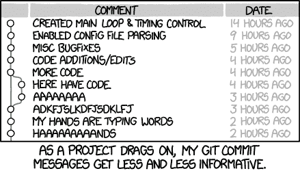
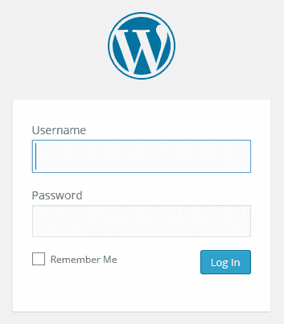
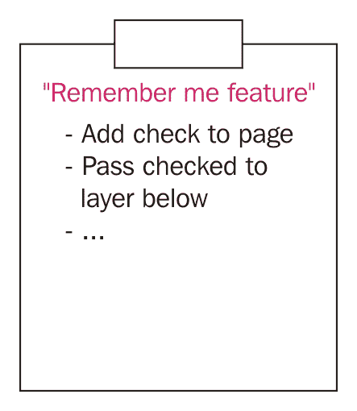
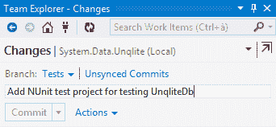
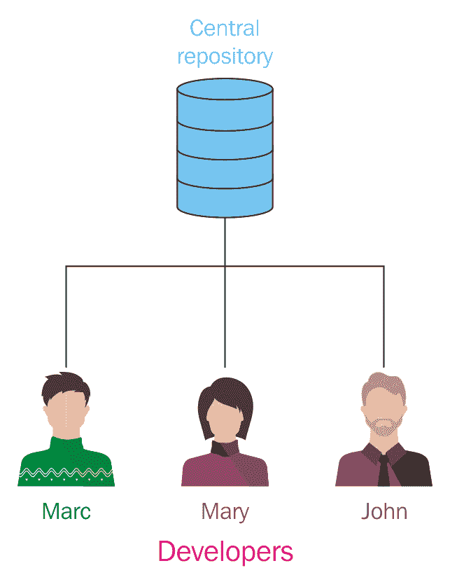
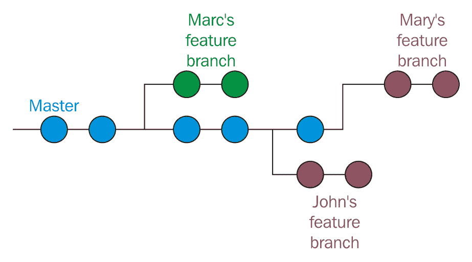
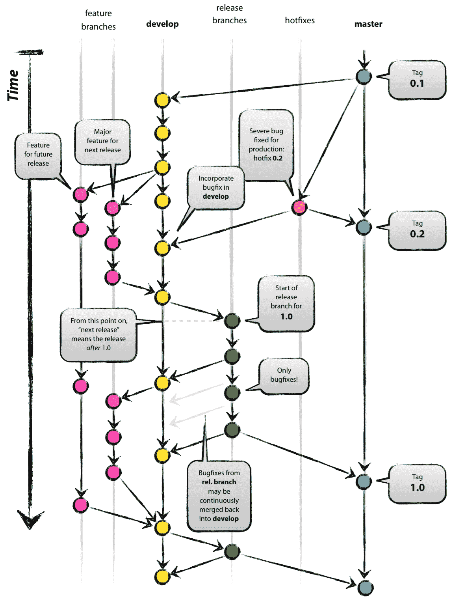
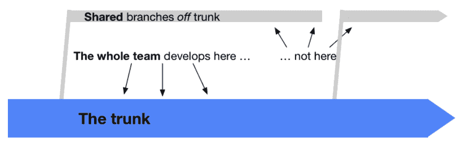
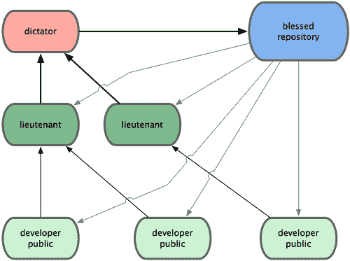

# 获取最大效益 - 良好的提交和工作流程

现在我们已经对 Git 和版本控制系统有了一些了解，是时候从更高的视角来看待整个问题，意识到常见的模式和流程。

在本章中，我们将介绍一些最常见的组织和构建有意义的提交和代码库的方式，从而获得一个井井有条的代码栈，甚至是一个有意义的信息源。

# 提交的艺术

在使用 Git 时，提交似乎是工作中最简单的部分：你添加文件，写一个简短的评论，然后就完成了。但正因为它简单，尤其是在刚开始使用时，你往往会养成做出糟糕提交的坏习惯：提交得太晚、太大、太短，或者仅仅是带有糟糕的消息。

现在我们将花一些时间来识别可能的问题，比如没有意义的或过大的提交，并提出一些建议和提示，帮助大家摆脱这些坏习惯。

# 构建正确的提交

在编程过程中，一项更难掌握的技能是**将工作分解为小而有意义的任务**。

我经常遇到这样的情况：你开始修复文件中的一个小问题；然后你看到另一段代码，可以轻松改进，尽管它与当前的工作无关——你忍不住，还是去修复了。最后，经过一段时间，你发现自己有一大堆**并发**文件和**更改**等待提交。

到此时，*情况变得更糟*，因为通常*程序员是懒惰的人*，所以他们不会在提交信息中写下所有重要的内容来描述所做的更改。在提交信息中，你开始写诸如“*对这个和那个的一些修复*”，“*移除旧的东西*”，“*微调*”之类的句子，但这些并没有帮助其他程序员理解你做了什么：



由 http://xkcd.com/1296/ 提供

最后，你会意识到*你的代码库只不过是一个垃圾堆*，你偶尔才会清理一次索引。我见过一些人只在一天结束时提交（而且不是每天都提交），只是为了备份数据，或者因为其他人需要在他们的计算机上反映这些更改。

另一个副作用是，结果的*代码库历史变得毫无意义*，除了在某个时间点检索内容外，几乎没有其他用途。

以下提示可以帮助你将版本控制系统（VCS）从一个备份系统转变为*一个有价值的沟通和文档工具*。

# 每次提交只进行一次更改

在例行的早晨咖啡后，你打开编辑器，开始处理一个 bug：`BUG42`。在修复代码中的 bug 时，你意识到修复 `BUG79` 只需要修改一行代码，于是你进行修复，但你不仅修改了那个糟糕的类名，还给表单添加了一个漂亮的标签，并做了一些其他更改。*现在损失已经造成了*。

现在你怎么将所有这些工作总结成一个*有意义的提交*呢？也许你在这段时间回家吃午饭，跟老板讨论了另一个项目，甚至你自己都不记得所有做过的细小事情了。

在这种情况下，只有一种方法可以**限制损害**：*将文件拆分成多个提交*。有时这样做有助于减轻痛苦，但这只是一个*权宜之计*：你太频繁地因为*不同的原因*修改同一个文件，所以这样做是相当困难的，甚至是不可能的。

解决这个问题的唯一方法是**每次提交时只做一次修改**。这看起来简单，我知道，但要掌握这项能力却相当困难。没有工具能做到；除了你自己，没有人能帮忙，因为这需要**自律**，*这是创意工作者（比如程序员）最缺乏的美德*。

有一些技巧可以帮助你实现这个目标；让我们一起看看它们。

# 拆分功能和任务

如前所述，将事情分解是一个精细的艺术。如果你知道并采用了一些**敏捷方法**技巧，你可能已经遇到过这些问题，因此你占有优势；否则你将需要付出更多努力，但这不是你无法达成的。

假设你被指派在一个 web 应用的登录页上添加“记住我”选项框，像下面这样：



这个功能很小，但在不同层面上会涉及到改动。为了实现这一点，你必须：

1.  修改 UI 以添加检查控制。

1.  将*已检查*的信息通过不同的层级传递。

1.  将这些信息存储到某个地方。

1.  在需要时获取这些信息。

1.  根据某些政策使其失效（例如：15 天后，或登录 10 次后，等等）。

你认为你能在一次尝试中完成所有这些事情吗？是吗？你错了！即使你为一项普通任务估计几个小时，也要记住墨菲定律：你会接到四个电话，你的老板会找你参加三个不同的会议，而你的电脑会起火。

这是需要学习的第一件事之一：**将每一项工作分解成小任务**。无论你是否使用时间盒技术，比如*番茄工作法*，小任务更容易处理。我不是说要斤斤计较，但尽量将任务组织成可以在规定时间内完成的事情，最好是几段半小时，而不是几天。

欲了解更多关于番茄工作法的信息，可以访问[`cirillocompany.de/pages/pomodoro-technique`](https://cirillocompany.de/pages/pomodoro-technique)

或者维基百科[`en.wikipedia.org/wiki/Pomodoro_Technique`](https://en.wikipedia.org/wiki/Pomodoro_Technique)

所以，*拿起纸和笔，写下所有任务*，就像我们之前在登录页面的例子中做的那样。你现在觉得自己能在很短的时间内完成所有这些任务吗？也许能，也许不能：有些任务比其他任务要大。这没关系，这不是一种科学方法，*这取决于经验*；你能将一个任务拆分成两个有意义的任务吗？做吧。

你能做到吗？没问题，*不要尝试拆分任务，如果这样会失去它们的意义*。

做一个小本子，像下面图片中的那样——它会成为你最宝贵的工具之一：



# 编写提交信息再开始编码

现在你有了一份任务清单，选择第一个任务并... 开始编码？不！再拿一张纸，**用一句话描述每个任务的步骤**；你会发现每一句话都可以成为一个提交信息，描述你在软件中删除、添加或更改的功能。

这种事先的准备帮助你*定义要实现的修改*（让*更好的软件设计*自然产生），*专注于重要事项*，并且*减轻压力*，让你在编码过程中不再过多考虑版本管理的部分。当你面对编程问题时，你的大脑会充斥着与正在编写代码相关的小细节，因此，分散注意力的事情越少越好。

这是我收到的与版本管理相关的最佳建议之一：如果你有十五分钟的空闲时间，我建议你阅读*预先提交评论*的博客文章，链接在[`arialdomartini.wordpress.com/2012/09/03/pre-emptive-commit-comments/`](https://arialdomartini.wordpress.com/2012/09/03/pre-emptive-commit-comments/)，它是我学到这个技巧的地方，作者是*Arialdo Martini*。

# 将所有更改放在一个提交中

每次提交做多于一个更改是坏事，但即使将单个更改拆分成多个提交也会被认为是有害的。正如你可能已经知道的，在一些训练有素的团队中，你不能简单地将代码推送到生产环境；首先你必须通过*代码质量审查*，其中其他人会尝试理解你所做的工作，以决定你的代码好不好（这就是为什么会有*拉取请求*的原因）。你可能是世界上最好的开发人员，但如果对方无法理解你的提交，你的工作很可能会被拒绝。

要避免这些不愉快的情况，你必须遵循一个简单的规则：**不要进行部分提交**。如果时间不够，如果你必须参加那该死的会议（程序员讨厌开会）或其他任何事情，请记住你可以随时保存你的工作而不提交，使用`git stash`命令。如果你想关闭提交，因为你想把它推送到远程分支进行备份，请记住*Git 不是备份工具*：在另一个磁盘上备份你的 stash，把它放在云上，或者在离开之前结束你的工作，但不要像看电视剧集一样提交。

再说一遍，Git 就像任何其他软件工具一样，甚至它也可能失败：不要认为使用 Git 或其他版本控制系统就不需要备份策略 - 本地和远程仓库的备份同样重要，就像你备份其他重要事物一样。

# 描述变更，而不是你做了什么

我经常读到（而且更经常写到）像“*移除这个*”、“*修改那个*”、“*添加那个*”之类的提交信息。

想象一下你要在你的网站上共同工作的“*丢失密码*”功能；你可能会觉得这样的消息足够了：“*在登录页面添加了丢失密码找回链接*”。这种提交消息不描述功能给你带来了什么修改，而是你做了什么（并非你做的一切）。试着真诚地回答：阅读仓库历史时，你想要读到每个开发者做了什么吗？或者读到每个提交中实现的功能会更好？

努力去做，**开始编写以变更本身为主题的句子**，不要描述你是如何实现它的。使用祈使现在时态（例如*修复*、*添加*或*实现*），在一个简短的主题句中描述变更，然后在需要时添加一些细节（如果需要的话），例如：“*实现密码找回机制*”是一个良好的提交信息主题；如果你觉得有用，那么可以添加一些其他信息来使其形成一个完整的消息，就像这样：

```
"Implement the password retrieval mechanism 

 - Add the "Lost password?" link into the login page
 - Send an email to the user with a link to renew the password" 
```

你有没有手动编写过软件的*更新日志*？我有过，那是最无聊的事情之一。如果你不喜欢写更新日志，就像我一样，把代码库历史看作是你的更新日志：只要你注意提交信息，你就会免费得到一个漂亮的更新日志！

在接下来的段落中，我将介绍一些关于良好提交信息的其他有用提示。

# 不要害怕提交

恐惧是最强烈的情感之一；它可以驱使一个人做地球上最疯狂的事情。对恐惧的最常见反应之一是**崩溃**：*你不知道该怎么做，最终什么也不做*。

这是一个常见的反应，特别是当你开始使用像 Git 这样的新工具时，建立信心可能很困难；因为害怕犯错，你通常不会提交，直到被迫提交。**这才是真正的错误：害怕**。在 Git 中，你不必害怕；也许解决方案并不显而易见，也许你得上网查找正确的做法，但你可以承受的小代价几乎没有（除非你是`--hard`选项的重度用户）。

相反，你需要努力**频繁提交**，尽可能早提交。你提交的越频繁，提交的内容就越小；提交越小，变更日志就越容易阅读和理解，挑选提交也变得更加容易，代码审查也更轻松。为了帮助自己习惯这种提交方式，我采用了这个简单的小技巧：在开始写任何代码之前，先在 Visual Studio 中写下提交信息：



尝试在你的 IDE 或者直接在 Bash 终端中做到这一点，这会有很大帮助。

# 隔离无意义的提交

黄金法则是避免这种情况，但有时候你确实需要提交*不是真正实现的内容*，而只是一些清理工作，比如删除旧的注释、调整格式等等。

在这些情况下，最好将这些代码变更隔离在单独的提交中。这样做可以防止其他团队成员带着刀冲向你，嘴里冒着泡沫。不要将无意义的更改与真正的更改混合在一起提交，否则其他开发者（以及几周后的你）在查看差异时将无法理解它们。

# 完美的提交信息

让我坦白地说：完美的提交信息是不存在的。如果你独自工作，你可能会找到最适合自己的方式，但在团队中有不同的思维方式和敏感度，所以对我来说合适的，可能对别人来说并不一定是最好的。

在这种情况下，你需要坐下来一起开会进行回顾，尽量达成一个共享的标准；这个标准可能不是你最喜欢的，但至少这是找到共同路径的方式。

一个好的提交信息的规则确实取决于你和你的团队的日常工作方式，但有一些常见的提示是每个人都可以应用的；它们如下。

# 写一个有意义的主题

提交的主题是最重要的部分：它的作用是清楚地表明提交包含了什么内容。避免涉及其他技术细节——普通开发者可以通过打开代码来理解，应该专注于大局：记住，每个提交都是仓库历史中的一句话。所以，戴上变更日志阅读者的帽子，尝试写出最便于他理解的句子，而不是为你自己写：使用现在时态，写一个最多 50 个字符的句子。

一个好的主题是这样的：“*在主页中添加新闻通讯注册功能*”。

如你所见，我使用了*祈使过去式*，更重要的是，*我没有说我做了什么，而是说功能做了什么*：它在我的网站上添加了一个新闻通讯订阅框。

50 字符规则源于你通过命令行或图形界面工具使用 Git 的方式；如果你开始写长句子，查看日志等操作可能会变成一场噩梦。所以，不要试图成为提交信息的*斯蒂芬·金*：避免使用形容词，直接进入主题，之后可以在附加的详细行中更深入地描述。

还有一件事：开始时使用大写字母，并且不要以句号结束句子——它们是多余的，甚至是危险的。

# 根据需要添加项目符号细节行

你通常可以在 50 个字符内表达你想说的所有内容；在这种情况下，使用详细的行。常见的规则是*主题后留空一行*，使用破折号，并且不要超过 72 个字符：

```
"
Add the newsletter signup in homepage

- Add textbox and button on homepage
- Implement email address validation
- Save email in database"

```

在这些行中稍微深入一点，但不要过多；尽量描述原始问题（如果你解决了它）或原始需求，为什么实现了这个功能（解决了什么问题）以及可能的限制或已知问题。

# 关联其他有用的信息

如果你使用问题和项目追踪系统，请写下问题编号、bug ID 或任何其他有用的信息：

```
"
Add the newsletter signup in homepage

- Add textbox and button on homepage
- Implement email address validation
- Save email in database 

#FEAT-123: closed"
```

# 发布的特别信息

另一件有用的事是，为发布写*特殊格式*的提交信息，这样会更容易找到它们。我通常会用一些特殊字符来装饰主题，但除此之外没有更多；为了突出某个特别的提交，比如发布版本，可以使用`git tag`命令，记得吗？

# 结论

最后，我的建议是，尝试制定你个人的提交信息标准，遵循之前的提示，并参考网络上优秀项目和团队所采用的信息策略，尤其是通过实际操作来发现它。你的标准一定会随着你作为软件开发者和 Git 用户的成长而变化，因此尽早开始，并让时间帮助你找到写出完美提交信息的方法。

至少，不要模仿这个链接：[`www.commitlogsfromlastnight.com`](http://www.commitlogsfromlastnight.com)。

# 采用工作流——明智之举

既然我们已经学习了如何进行良好的提交，是时候更进一步，考虑一下**工作流**了。Git 是一个版本控制工具，但就像其他强大的工具（比如刀具）一样，你可以用它切出美味的生鱼片，也可能会受伤。

区分一个优秀代码库与垃圾堆的，是你如何管理发布、如何在某个特定版本的程序中修复 bug 以及当你需要让用户测试即将发布的功能时，你的反应方式。

这些操作属于现代软件项目的日常管理，但我常常看到团队因为糟糕的版本控制工作流而疲于应付。

在本章的第二部分，我们将快速浏览一些最常用的工作流和 Git 版本控制系统。

# 集中化工作流

正如我们在其他版本控制系统（如 Subversion）中常做的那样，即便是在 Git 中，采用*集中式工作方式*也是很常见的。如果你在团队中工作，通常需要与他人共享仓库，因此一个*共同的联络点*变得不可或缺。

我们可以假设，如果你在办公室里不是一个人，你将采用这种工作流的某种变体。正如我们所知，我们可以配置使同事们的所有电脑成为远程仓库的一部分，形成某种*点对点*的配置，但通常你不会这么做，因为这会很快变得太复杂，难以保持每个分支在每个远程仓库中的同步。

这一场景在下图中展示：



# 它们如何运作

在这种场景中，你通常会遵循以下简单步骤：

1.  有人初始化了远程仓库（在本地 Git 服务器、GitHub、BitBucket 等上）

1.  其他团队成员将原始仓库克隆到他们的电脑上并开始工作

1.  工作完成后，你将推送到远程仓库，使其他同事能够访问

到这个时候，剩下的只是内部规则和模式的问题。

# 特性分支工作流

到这个阶段，你可能至少会选择*特性分支*的方法，每个开发者都在自己的分支上工作。当工作完成后，特性分支准备好被合并到主分支；在此之前，你可能需要从`master`分支合并回来，因为你的另一位同事在你开始自己的分支后已经合并了一个特性分支，但之后基本就完成了。

下图展示了仓库中分支的发展：



# Gitflow

**Gitflow**工作流源自**Vincent Driessen**的思想，他是来自荷兰的一个热情的软件开发者；你可以在[`nvie.com/posts/a-successful-git-branching-model`](http://nvie.com/posts/a-successful-git-branching-model)找到他关于该工作流的原始博客文章。

这种工作流多年来获得了成功，甚至许多其他开发者（包括我！）、团队和公司都开始使用它。*Atlassian*，一家知名公司，提供像*BitBucket*这样的 Git 相关服务，它们将 Gitflow 直接集成到他们的图形用户界面工具——漂亮的*SourceTree*中。

即使 Gitflow 工作流是一个集中式的，它也可以通过以下图片来很好地描述：



这个工作流基于使用一些**主分支**；这些分支之所以特别，完全是因为我们赋予它们的意义：在 Git 中并没有*特殊分支*和*特殊特性*，但我们当然可以将它们用于不同的目的。

# 主分支

在 Gitflow 中，`master` 分支代表最终阶段；将你的工作合并到该分支就相当于发布一个 *新版本* 的软件。通常你不会从 `master` 分支开始新的分支；只有在你必须立即修复严重 bug 时，才会这样做，即使这个 bug 已经在另一个正在开发的分支中被发现并修复。这种操作方式在需要快速反应时非常高效。除此之外，`master` 分支就是你打标签发布版本的地方。

# 热修复分支

**热修复分支** 是只从 `master` 分支派生的分支，正如前面所提到的；一旦你修复了一个 bug，你就会将 `hotfix` 分支合并到 `master`，这样你就可以发布新的版本。如果 bug 在其他地方没有得到解决，那么策略是将 `hotfix` 分支合并到 `develop` 分支。之后，你可以删除 `hotfix` 分支，因为它已经达到了预期目标。

在 Git 中，有 *一种分组相似分支的技巧*：你需要使用一个共同的前缀并加上斜杠 `/` 来命名它们；对于热修复分支，作者建议使用 `hotfix/<branchName>` 前缀（例如 `hotfix/LoginBug` 或 `hotfix/#123`，对于使用 bug 跟踪系统的用户，其中 `#123` 是 bug ID）。

这些分支通常不会推送到远程；只有在你需要其他团队成员的帮助时，才会推送。

# 开发分支

`develop` 分支是一种 *预发布* 分支。当你开始实现新功能时，必须从 `develop` 分支创建一个新的分支；直到任务完成，你会一直在这个分支上工作。

任务完成后，你可以将代码合并回 `develop` 分支并删除你的 `feature` 分支：像热修复分支一样，这些分支只是临时性的分支。

和 `master` 分支一样，`develop` 分支是一个 **长期存在的分支**：你永远不会关闭或删除它。

这个分支会被推送并共享到远程 Git 仓库。

# 发布分支

在某些时候，你需要准备下一个版本的发布，包含过去几周你实现的一些功能。为了准备即将到来的版本，你必须从 `develop` 分支创建一个新的分支，并为该分支命名，名称由 `release` 前缀和你选择的版本数字（例如 `release/1.0`）组成。

注意：**在这个阶段，不允许添加新功能**！你不能再将 `develop` 合并到 `release` 分支；你只能从该分支创建新的分支来修复 bug；这个中间分支的目的是将软件交给 beta 测试人员，允许他们进行试用并向你反馈问题和 bug。

如果你在 `release` 分支上修复了某个 bug，唯一需要记住的是将其合并到 `develop` 分支，以避免丢失 bug 修复——`release` 分支不会被合并回 `develop`。

你可以让这个分支保持有效，直到你认为软件已经成熟并经过足够的测试，准备进入生产环境：此时你将`release`分支合并到`master`分支，创建一个新的发布。

合并到`master`后，你有两个选择：如果你需要保持不同版本的发布，可以保持`release`分支开放，否则可以删除它。就我个人而言，我总是删除`release`分支（正如 Vincent 建议的那样），因为我通常会进行频繁的小规模增量发布（所以我很少需要修复已经发布的版本），而且，正如你一定记得的那样，你可以随时从一个提交（在这种情况下是一个标记的提交）打开一个全新的分支，因此，最多我也只是会在必要时从那个点重新打开它。

这个分支会推送并共享到一个公共的远程仓库。

# 特性分支

当你需要开始实现一个新特性时，你需要从`develop`分支创建一个新分支。特性分支以`feature/`为前缀（例如`feature/NewAuthenitcation`或`feature/#987`，如果你使用某些功能追踪软件，`#987`就是特性 ID）。

你会一直在特性发布上工作，直到完成你的任务；我建议你*经常从`develop`分支合并回来*：如果多个修改同时作用于同一文件，提前解决冲突能更快地解决问题；这样，一次解决一两个冲突比在特性工作结束时解决几十个冲突要容易得多。

一旦工作完成，你将特性分支合并到`develop`，工作就完成了；此时你可以删除`feature`分支。

特性分支主要是私有分支，但如果需要与其他团队成员合作，你可以将它推送到远程仓库。

# 结论

我真的推荐你看一下这个工作流，因为我可以向你保证，使用它时没有任何我无法解决的情况。

你可以在**Vincent Driessen**之前提到的博客上找到更深入的解释，里面有可以直接使用的 Git 命令。你甚至可以使用 Vincent 为定制 Git 体验而创建的*gitflow 命令*；可以在他的 GitHub 账户上查看，地址是[`github.com/nvie/gitflow`](https://github.com/nvie/gitflow)。

# GitHub flow

前面描述的*GitFlow*有很多追随者，但这总是一个口味问题；也有人认为它对于他们的情况来说太复杂和死板，事实上，在过去几年中，也有其他管理软件仓库的方法获得了共识。

其中一种工作流是 GitHub 用于内部项目和仓库的工作流；这个工作流被称为**GitHub flow**，最早由著名的**Scott Chacon**（前 GitHub 员工以及*ProGit*书籍作者）在他的博客中描述，网址是[`scottchacon.com/2011/08/31/github-flow.html`](http://scottchacon.com/2011/08/31/github-flow.html)。

与 Gitflow 相比，这种工作流更适合频繁发布，当我说频繁时，我指的是非常频繁，甚至一天两次。显然，这种工作流在网页项目中效果更好，因为要部署，你*只需要*将新版本放到生产服务器上；如果你开发的是桌面解决方案，则需要一个完美运作的更新机制来做到这一点。

GitHub 软件基本上没有发布版本，因为他们会定期将更新部署到生产环境，甚至一天多次。这是由于强大的*持续交付*结构，这并不容易实现；它需要一定的努力。

GitHub flow 基于以下简单规则。

# `master` 分支中的任何内容都是可部署的

类似于 GitFlow，在 GitHub flow 中，部署也是从 `master` 分支进行的。

这是该工作流中唯一的*主*分支；在 Gitflow 中没有 `hotfix`、`develop` 或其他特殊分支。错误修复、新功能实现等都会不断地合并到 `master` 分支。

除此之外，`master` 分支中的代码始终处于*可部署*状态；当你在某个分支上修复或添加新内容，然后将其合并到 `master` 上时，你不会自动进行部署，但你可以假设你的更改将在几个小时内上线并运行。

不断地将分支合并到 `master`，即生产就绪分支，可能会带来风险：你很容易引入回归问题或错误，因为除了你自己，没有其他人能够检查你是否做得好。这个问题通过 GitHub 开发者常用的*社会契约*来避免；在这个契约中，你承诺在将代码合并到 `master` 之前进行测试，确保所有自动化测试都已成功完成。

# 从 `master` 分支创建描述性分支

在 GitFlow 中，你总是从 `master` 分支上创建分支，所以当你需要拉取某个分支时，很容易看到一片分支森林。为了更好地识别这些分支，在 GitHub flow 中，你需要使用描述性的名称来创建有意义的*主题分支*。这里也是一种良好的习惯；如果你开始创建名为 *stuff-to-do* 的分支，你很可能会在采用这种工作流时失败。一些示例包括 `new-user-creation`、`most-starred-repositories` 等等（注意使用**Kebab Case**，[`wiki.c2.com/?KebabCase`](http://wiki.c2.com/?KebabCase)）；通过使用一种常见的方式来定义主题，你将更容易通过查找关键词找到感兴趣的分支。

# 不断推送到命名分支

与 Gitflow 相比，GitHub flow 的另一个显著区别是，在 GitHub flow 中，即使你是唯一的开发者并且只对自己感兴趣，你也需要定期将功能分支推送到远程。这是为了持续集成和测试，或者可能也是为了备份；关于备份这一部分，尽管我已经在优点上表达了我的观点，但我不能说这是一件坏事。

我喜欢 GitFlow 的一个方面是，每次将分支推送到远程仓库的习惯让你能够通过简单的`git fetch`看到所有当前活动的分支，从而了解所有的进行中的工作，包括你团队成员的工作。

# 随时发起拉取请求

在第三章，*Git 基础 - 远程工作*中，我们讨论了 GitHub，并快速尝试了*拉取请求*。我们已经看到，基本上它们用于*贡献*：你 fork 了别人的仓库，创建了一个新分支，进行了一些修改，然后向原作者发起拉取请求。

在 GitHub Flow 中，你大量使用拉取请求，即便是请求团队中的其他开发人员来查看你的工作并提供帮助、建议，或审查已完成的工作。在这个阶段，你可以开始讨论，使用 GitHub 的拉取请求功能进行聊天，并通过 @提及 他们的用户名来让其他人参与。此外，拉取请求功能还允许你在差异视图中评论代码的单行内容，让相关用户能够讨论正在修改的工作。

# 仅在拉取请求审查后合并

你现在可以理解，前面我们看到的*拉取请求分支阶段*变成了一个*审查阶段*，在这个阶段，其他用户可以查看代码，甚至仅仅留下一个积极的评论，像是一个`+1`，让其他人知道他们对这项工作有信心，并且批准将其合并到 master 分支。

在这个步骤之后，当 CI 服务器表示该分支仍通过所有自动化测试时，你就准备好将该分支合并到 `master`。

# 审查后立即部署

在这个阶段，你将分支合并到`master`，工作就完成了。虽然部署不是立即触发的，但在 GitHub，他们有一个非常直接且强大的部署程序，因此他们可以轻松地完成部署。无论是包含 50 次提交的大分支，还是只有一次提交和一行代码更改的小分支，他们都能很快且廉价地完成部署。

这就是为什么他们能够承担如此简单的分支策略的原因，首先将代码放到`master`，然后部署，而无需像 GitFlow 中那样通过`develop`或`release`阶段的分支。

# 结论

我认为这种流程对于基于 web 的项目非常高效和灵活，基本上你可以在没有太多关注软件版本的情况下直接部署到生产环境。只使用`master`分支来派生和集成其他分支，比光速还快，但这种策略仅在具备以下前提条件时才可应用：

+   一个已准备好的集中式远程仓库来管理拉取请求（就像 GitHub 所做的那样）

+   一个良好的分支命名和拉取请求使用约定

+   一个非常强大的部署系统

这是这一流程的宏观图，图形化地表示在下图中；欲了解更多详情，我建议访问与 GitHub 相关的页面，[`guides.github.com/introduction/flow/index.html`](https://guides.github.com/introduction/flow/index.html)：


# 基于主干的开发

如今，另一种策略在全球开发者中重新获得了一定的关注；它的名字已经说明了一切：*停止使用分支*，仅使用*主分支*！

下图展示了这一流程的精髓：



这一趋势旨在解决所谓的*合并地狱*问题；当分支长时间分叉时，合并它们就变得非常痛苦。与 GitHub 流程类似，这里没有长时间存在的分支，甚至连功能分支也不推荐使用。

持续集成和持续交付在这里得到了体现，这种工作方式确实加强了我们已经熟悉的好实践，这些实践得益于**极限编程**([`www.extremeprogramming.org/`](http://www.extremeprogramming.org/))的心态和实践。

这个运动太广泛且深刻，无法在几句话中讨论，但值得阅读它的原则，因为它让你反思开发者在日常工作中所面对的话题。所以请花一点时间，阅读更多内容，[trunkbaseddevelopment.com](http://trunkbaseddevelopment.com)。

# 其他工作流程

显然，还有许多其他工作流程；我将花一点时间讲述这个（幸运的是！）说服 Linus Torvalds 意识到 Git 版本控制系统的工作流。

# Linux 内核工作流程

**Linux 内核**使用的工作流程参考了**Linus Torvalds**在这些年中推动其演进的传统方式，基于*军事化的层级结构*。

简单的内核开发者在他们个人的分支上工作，基于参考库将主分支进行重置，然后将他们的分支推送到*中尉开发者*`master`分支。中尉是 Linus 根据他们的经验指派负责内核特定话题和领域的开发者。当中尉完成工作时，他会将代码推送到*仁慈独裁者*`master`分支（Linus 分支），然后如果一切正常（他不容易被骗），Linus 会将他的主分支推送到*祝福库*，这是开发者在开始工作前用来重置的库。

这种工作流程并不常见；它是由 Linus 和 Linux 内核团队创造的，恰好反映了他们从一开始就采用的项目工作方式，当时开发者使用补丁和电子邮件将工作提交给 Linus Torvalds。

管理数百万行代码和成千上万的贡献者，我认为这种层级模型在工作范围、责任和补丁筛选方面是一个很好的折中方案。

以下图片有助于你更好地理解这个流程：



# 摘要

在本章中，我们了解了有效使用 Git 的方法；我个人认为本章对*新 Git 用户*来说最为重要，因为只有通过应用一些规则和纪律，你才能从这个工具中获得最大的收益。所以，请选择一个好的工作流程（如果需要，自己制定！），并注意你的提交：这才是成为一个优秀版本控制工具用户的唯一途径，不仅仅是在 Git 中。

在下一章中，我们将看到一些使用 Git 的技巧，即使你需要处理 Subversion 服务器，之后我们还将快速了解如何从 Subversion 完全迁移到 Git。
