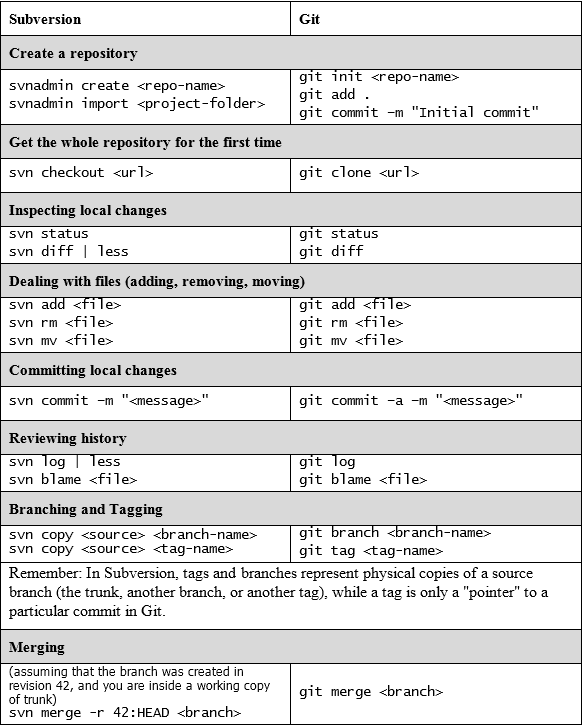

# 向 Git 迁移

你经常在使用其他版本控制系统后转向 Git；世界上有许多不同的版本控制系统，但其中最受欢迎的之一无疑是**Subversion**。

Git 和 Subversion 可以共存，因为 Git 有一些专门的命令用于与 Subversion 交换数据。

本章的目的是帮助那些实际上使用 Subversion 的开发人员立即开始使用 Git，即使团队的其余成员继续使用 Subversion。

此外，本章还涵盖了决定放弃 Subversion 转而使用 Git 的人的最终迁移，以及保存更改历史记录的方法。

# 在开始之前

在本章的第一部分，我们将看看在没有麻烦的情况下如何保持安全，并在实际的 SVN 代码库上工作。

请记住，本章的目的是给读者一些提示；处理大型和复杂的代码库需要更加谨慎和细致的方法。

# 安装 Subversion 客户端

为了能够进行这些实验，你需要一个 Subversion 工具；在 Windows 上，最广泛使用的是著名的**TortoiseSVN**（[`tortoisesvn.net`](http://tortoisesvn.net/)），它提供了 GUI 和命令行工具的集成。

我推荐完整安装 TortoiseSVN，包括命令行工具，因为我们将需要其中一些工具来进行实验。

# 使用 Git 在 Subversion 代码库上工作

在第一部分，我们将看到在开始远离 Subversion 时最谨慎的方法，即保持原始的代码库，使用 Git 来获取和推送更改。

为了学习的目的，我们将创建一个本地的 Subversion 代码库，使用 Subversion 和 Git 来访问其内容。

# 创建一个本地 Subversion 代码库

在没有远程服务器麻烦的情况下，让我们创建一个本地的 Subversion 代码库，作为我们实验的容器：

```
$ cd C:\Repos
$ svnadmin create MySvnRepo
```

没有更多，也没有更少；代码库现在已经准备好可以填充文件夹和文件了。

# 使用 svn 客户端检出 Subversion 代码库

到此，我们已经有了一个工作的 Subversion 代码库；我们现在可以将其检出到我们选择的文件夹，这个文件夹将成为我们的*工作副本*；在我的例子中，我将使用`C:\Sources`文件夹：

```
$ cd C:\Sources\svn
$ svn checkout file:///Repos/MySvnRepo
```

现在，你在`Sources`文件夹下有了一个`MySvnRepo`文件夹，准备填充你的项目文件；但首先，让我提醒你一些事情。

正如你所知，Subversion 代码库通常有以下子文件夹结构：

+   `/trunk`，主文件夹，通常存放正在开发中的代码。

+   `/tags`，通常用于冻结并保持不变的快照根文件夹，例如`/tags/v1.0`

+   `/branches`，所有你为功能开发而创建的分支的根文件夹，例如`/branches/NewDesign`

Subversion 没有提供一个命令来初始化具有这种布局（通常称为*标准布局*）的代码库，因此我们必须手动构建它。

此时，我们可以导入一个已经包含三个子文件夹（`/trunk`，`/branches` 和 `/tags`）的骨架文件夹，命令如下：

```
$ cd \Sources\svn\MySvnRepo
$ svn import /path/to/some/skeleton/dir
```

否则，我们可以使用 `svn mkdir` 命令手动创建文件夹：

```
$ cd \Sources\svn\MySvnRepo
$ svn mkdir trunk
$ svn mkdir tags
$ svn mkdir branches  
```

提交我们刚刚创建的文件夹，仓库就准备好了：

```
svn commit -m "Initial layout"  
```

现在，添加并提交第一个文件：

```
$ cd trunk
$ echo "This is a Subversion repo" > readme.txt
$ svn add readme.txt
$ svn commit -m "Readme file"
```

如果你想复制一个更真实的情况，随时可以添加更多文件，或者导入一个现有项目；要导入文件到 Subversion 仓库中，你可以使用 `svn import` 命令，正如我们之前所看到的：

```
$ svn import \MyProject\Folder
```

稍后，我们将添加一个*标签*和一个*分支*，以验证 Git 如何与它们交互。

# 从 Git 克隆 Subversion 仓库

Git 提供了一套与 Subversion 协作的工具；基本命令实际上是 `git svn`；通过 `git svn`，你可以克隆 Subversion 仓库，检索和上传更改等。

所以，戴上 Git 的帽子，使用 `git svn clone` 命令克隆 Subversion 仓库：

```
$ cd \Sources\git
$ git svn clone file:///c/Repos/MySvnRepo  
```

如你所见，这次我在 `file:///` 路径中添加了根驱动器字母 `c`；在 Windows 中，Git 假设你提供的路径是从驱动器字母开始的。

# 添加标签和分支

为了让情况更真实一些，我将向 Subversion 仓库添加一个标签和一个分支；这样，我们就可以看到如何在 Git 中处理它们。

所以，让我们继续添加一个新文件：

```
$ cd \Sources\svn\MySvnRepo\trunk
$ echo "This is the first file" > svnFile01.txt
$ svn add svnFile01.txt
$ svn commit -m "Add first file"  
```

然后，将这个仓库的快照标记为 `v1.0`；如你所知，在 Subversion 中，标签或分支是快照的副本：

```
$ svn copy file:///Repos/MySvnRepo/trunk file:///Repos/MySvnRepo/tags/v1.0 -m "Release 1.0" 
```

一旦我们有了标签，我们甚至可以创建一个分支，假设我们想为 `v1.0` 版本添加一个用于修复 Bug 的地方：

```
$ svn copy file:///Repos/MySvnRepo/trunk file:///Repos/MySvnRepo/branches/v1.x -m "Maintenance branch for release 1.0" 
```

# 使用 Git 作为客户端向 Subversion 提交文件

现在我们已经有了一个正在运行的原始 Subversion 仓库克隆，我们可以像使用 Subversion 客户端一样使用 Git。所以，使用 Git 添加一个新文件并提交它：

```
$ echo "This file comes from Git" >> gitFile01.txt 
$ git add gitFile01.txt 
$ git commit -m "Add a file using Git" 
```

现在，我们必须将这个文件*推送*到 Subversion 服务器：

```
$ git svn dcommit 
```

做得好！

# 从 Subversion 服务器检索新的提交

我们甚至可以使用 Git 通过 `git svn fetch` 命令来获取更改，或者直接使用 `git svn rebase` 更新本地工作副本，作为 `svn update` 命令的 Git 对应命令：

```
$ git svn rebase 
```

Git 将从远程 Subversion 服务器获取新的提交，类似于 `git pull` 命令；然后，它会将这些提交在你当前所在的分支上进行 rebase。也许你会好奇，为什么我们使用 rebase 而不是像 `git pull` 命令默认处理 Subversion 远程仓库时那样使用 merge。使用 `merge` 命令而不是 `rebase` 来应用远程提交可能会有害；过去，Git 在处理 Subversion 的 `svn:mergeinfo` 属性时遇到了一些问题（[`svnbook.red-bean.com/en/1.6/svn.ref.svn.c.mergeinfo.html`](http://svnbook.red-bean.com/en/1.6/svn.ref.svn.c.mergeinfo.html)），即使它支持这些属性（[`www.git-scm.com/docs/git-svn/2.11.1#git-svn---mergeinfoltmergeinfogt`](https://www.git-scm.com/docs/git-svn/2.11.1#git-svn---mergeinfoltmergeinfogt)），rebase 被认为是更安全的选择。

Git 与 Subversion 的集成是一个广泛的话题；有关其他命令和选项，我建议你阅读主页面 `git svn --help`。

使用 Git 作为 Subversion 客户端并不是我们能得到的最理想的方式，但至少它为你提供了一种方式，可以开始使用 Git，即使你无法立即放弃 Subversion。

# 使用 Git 作为 Subversion 仓库的客户端

使用 Git 作为 Subversion 客户端可能会引起一些混淆，因为 Git 比 Subversion 更灵活，Subversion 在文件组织上则较为严格。

为确保保持与 Subversion 兼容的工作方式，我建议你遵循一些简单的规则。

首先，确保你的 Git `master` 分支与 Subversion 中的 `trunk` 分支相关联；正如我们之前所说，Subversion 用户通常以这种方式组织仓库：

+   一个 `/trunk` 文件夹，即主文件夹

+   一个 `/branches` 根文件夹，存放所有分支，每个分支位于单独的子文件夹中（例如，`/branches/feat-branch`）

+   一个 `/tags` 根文件夹，存放你创建的所有标签（例如，`/tags/v1.0.0`）

要遵循这种布局，你可以在克隆 Subversion 仓库时使用 `--stdlayout` 选项：

```
$ git svn clone <url> --stdlayout 
```

以这种方式，Git 会将 `/trunk` Subversion 分支与 Git `master` 分支连接起来，然后将所有的 `/branches` 和 `/tags` 分支复制到你的本地 Git 仓库，使你能够在一个 1:1 同步的上下文中使用它们。

# 迁移 Subversion 仓库

如果可能，建议将 Subversion 仓库完全迁移到 Git；这很简单，主要取决于 Subversion 仓库的大小和组织方式。

如果仓库遵循前面描述的标准布局，迁移只需要几分钟的时间。

# 检索 Subversion 用户列表

如果你的 Subversion 仓库由不同的人使用，你可能会希望在新的 Git 仓库中保持提交作者的名称不变。

如果 `awk` 命令可用（可以在 Windows 系统下使用 Git Bash shell 或 Cygwin），这里有一个脚本，可以从 Subversion 日志中获取所有用户并将其附加到一个文本文件中，这样在克隆时，即使是转换为 Git 的提交，也能完美匹配 Subversion 用户：

```
$ svn log -q | awk -F '|' '/^r/ {sub("^ ", "", $2); sub(" $", "", $2); print $2" = "$2" <"$2">"}' | sort -u > authors.txt 
```

现在，我们将在下一个克隆步骤中使用 `authors.txt` 文件。

# 克隆 Subversion 仓库

要开始迁移，我们必须像之前一样在本地克隆 Subversion 仓库；我再次建议添加 `--stdlayout` 选项，以保持分支和标签，然后添加 `-A` 选项，让 Git 在克隆时*转换*提交作者：

```
$ git svn clone <repo-url> --stdlayout --prefix svn/ -A authors.txt 
```

如果 Subversion 仓库中的 trunk、branches 和 tags 位于其他路径中（即不是标准布局），Git 提供了一个方法，通过 `--trunk`、`--branches` 和 `--tags` 选项来指定它们：

```
$ git svn clone <repo-url> --trunk=<trunk-folder> --branches=<branches-folder> --tags=<tags-folder>
```

当你执行 `clone` 命令时，请记住**此操作可能需要消耗较长时间**；在一个有千次提交的仓库中，等待一两个小时是常见的情况。

# 保留被忽略的文件

为了保留之前在 Subversion 中被忽略的文件，我们可以将 `svn:ignore` 设置附加到 `.gitignore` 文件中：

```
$ git svn show-ignore >> .gitignore
$ git add .gitignore
$ git commit -m "Convert svn:ignore properties to .gitignore"
```

# 推送到本地裸 Git 仓库

既然我们已经有了本地的仓库副本，我们可以将其迁移到一个全新的 Git 仓库。这里，你可以使用你选择的服务器上的远程仓库，甚至是 GitHub 或 BitBucket，但我建议你使用一个本地裸仓库。我们可以在将文件推送到目标仓库之前做一些小的调整（比如重命名标签和分支）。所以，首先在你选择的文件夹中初始化一个裸仓库：

```
$ mkdir \Repos\MyGitRepo.git
$ cd \Repos\MyGitRepo.git
$ git init --bare
```

现在，将默认分支重命名为与 Subversion `trunk` 分支相匹配的名称：

<pre>**$ git symbolic-ref HEAD refs/heads/trunk**

然后，添加一个指向我们刚刚创建的裸仓库的 `bare` 远程仓库：

```
$ cd \Sources\MySvnRepo
$ git remote add bare file:///C/Repos/MyGitRepo.git
```

最后，将本地克隆的仓库推送到新的裸仓库：

```
$ git push --all bare
```

我们现在有了一个全新的裸仓库，它是原始 Subversion 仓库的完美副本。我们现在可以调整分支和标签，以更好地适应 Git 的常规布局。

# 排列分支和标签

现在，我们可以重命名分支和标签，以获得更适合 Git 的场景。

# 将 trunk 分支重命名为 master

Subversion 的主开发分支是 `/trunk`，但在 Git 中，通常我们称主分支为 `master`；这里有一种方法可以将其重命名：

```
$ git branch -m trunk master 
```

# 将 Subversion 标签转换为 Git 标签

Subversion 将标签视为分支；它们都是某个 trunk 快照的副本。而在 Git 中，分支和标签有不同的含义。

要将 Subversion 标签的分支转换为 Git 标签，这里有一个简单的脚本来完成这个工作：

```
$ git for-each-ref --format='%(refname)' refs/heads/tags |
cut -d / -f 4 |
while read ref
do
 git tag "$ref" "refs/heads/tags/$ref";
 git branch -D "tags/$ref";
done
```

# 将本地仓库推送到远程

现在，你已经拥有一个本地裸 Git 仓库，准备推送到远程服务器；转换的结果是一个完整的 Git 仓库，其中分支、标签和提交历史都得到了保留。你唯一需要手动操作的，就是最终调整 Git 用户的配置。

# 比较 Git 和 Subversion 命令

在接下来的页面中，你可以找到一张简短且部分的回顾表格，我试图将最常用的 Subversion 和 Git 命令配对，以帮助 Subversion 用户迅速转变思维，快速从 Subversion 过渡到 Git。

请记住，Subversion 和 Git 的行为不同，所以直接比较命令可能不是最好的做法，但对于从 Subversion 转到 Git 的新手来说，这能帮助他们在学习的过程中将 Subversion 的基本命令与 Git 对应的命令进行匹配：



# 总结

本章仅仅是浅尝辄止，但我认为它对了解这个话题很有帮助。如果你有大规模的 Subversion 仓库，可能需要在开始转换到 Git 之前做更深入的培训，但对于小型到中型仓库，现在你已经知道了开始迁移的基本知识。

我唯一想与您分享的建议是不要急于求成；先让 Git 与您的 Subversion 服务器合作，在仓库混乱时进行重组，多做备份，最后尝试进行转换；您可能会像我一样多次进行转换，但最终您会获得满足感。

在下一章，我将与您分享我在作为 Git 用户的职业生涯中找到的一些有用资源。
