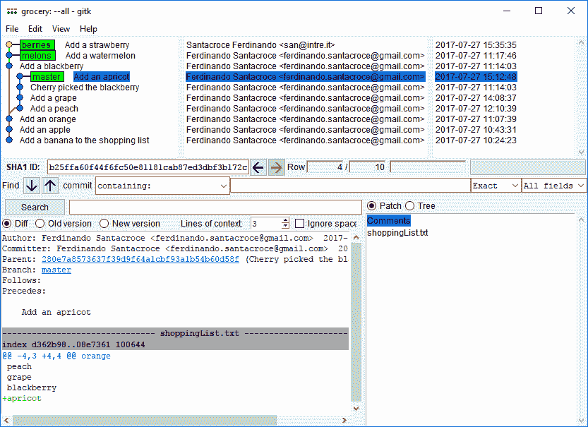
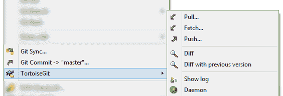
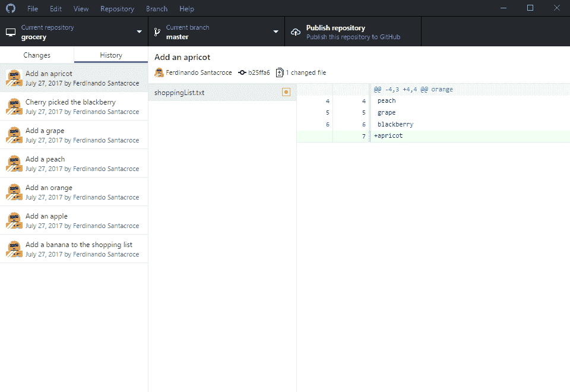
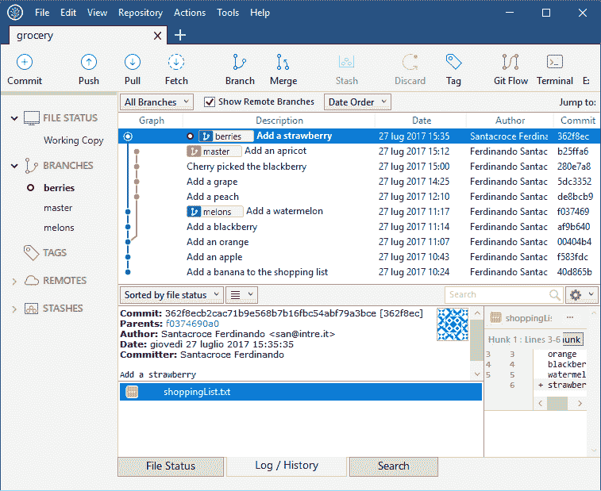
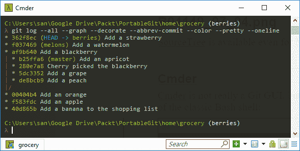
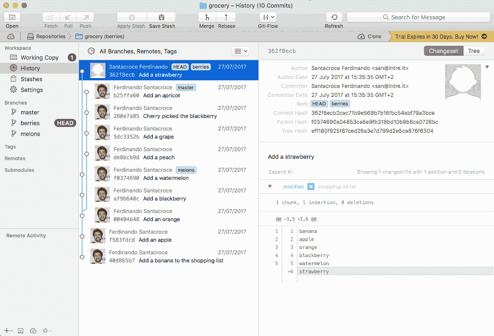
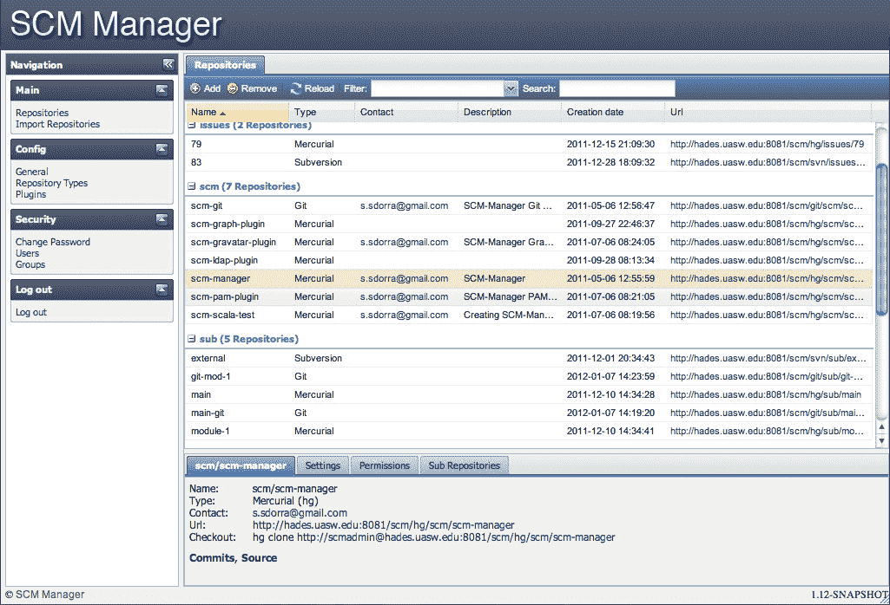
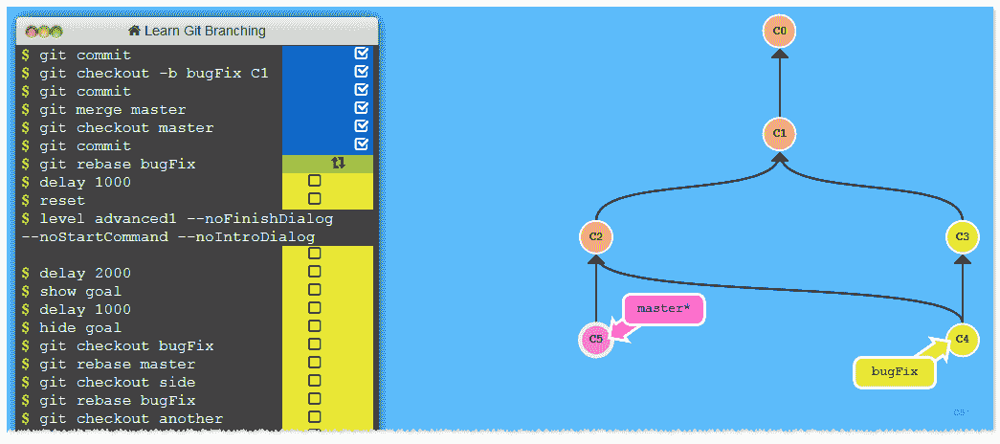
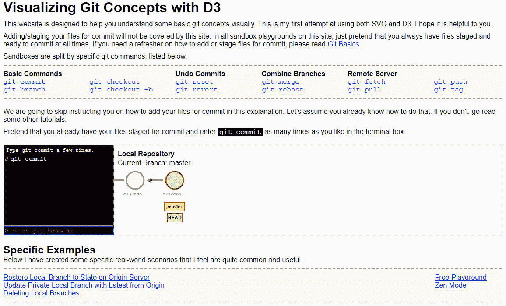

# 第七章：Git 资源

本章是我在使用 Git 过程中的一些资源集合。我将分享一些关于 GUI 工具、Git 仓库的 Web 界面以及学习资源的想法，希望它们能作为你成功 Git 生涯的跳板。

# Git GUI 客户端

当开始学习一款新工具，特别是像 Git 这样广泛且复杂的工具时，利用一些 GUI 工具是非常有用的，这样你可以更简单地理解命令和模式。

Git 受益于各种 GUI 工具，因此这仅仅是一个选择的问题；我想马上告诉你，通常没有完美的工具，但有足够多的工具可以让你选择最适合你需求的一个。

# Windows

作为一个 Microsoft .NET 开发者，我 99% 的时间都在使用 Windows；在空闲时间，我会玩一些 Linux，但在那种情况下，我更倾向于使用命令行。在这一节中，你将找到我使用或曾经使用过的工具，而在其他平台部分，我会根据其他人的经验提供一些建议。

# Git GUI

Git 拥有一个集成的 GUI，正如我们在前几章中所学的那样。它可能不是你找到的最吸引眼球的解决方案，但它足够用。使用它的原因是，当你安装 Git 时，它已经预装好了，并且与命令提示符的集成非常好；因此，查看文件、查看历史记录或进行交互式合并都可以轻松启动（只需在你的 shell 中输入 `git gui <command>`）：

# TortoiseGit

如果你已经从 Subversion 迁移到 Git，你可能已经听说过 *TortoiseSVN*，这是一款精心设计的工具，可以通过右键菜单集成直接在资源管理器中处理 Subversion 命令。

TortoiseGit 将 Git 而不是 Subversion 带到同一个地方；通过安装 TortoiseGit，你将受益于与资源管理器的相同集成，使得最常用的 Git 命令只需一步即可完成。即使我不鼓励使用本地化版本，TortoiseGit 也提供了不同语言版本；请记住，你需要先安装 Git，因为它不包含在 TortoiseGit 的安装包中：

# GitHub for Windows

GitHub 提供了一个时尚的现代 UI 客户端。不得不承认，我一开始对它有些轻视，主要是因为我确信它只能用于 GitHub 仓库；事实上，你甚至可以将它用于其他远程仓库，但显然这个客户端是专为 GitHub 定制的——要使用其他远程仓库，你必须手动编辑 `config` 文件，将 GitHub 远程仓库替换为你想要的远程仓库。

如果你需要一个通用的客户端，这可能不是最适合你的工具，但如果你主要在 GitHub 上工作， chances are 它是最适合你需求的 GUI：

# Atlassian SourceTree

这是我最喜欢的客户端。SourceTree 像其他所有工具一样是免费的；它来自**Atlassian**的创意，这家公司背后有*BitBucket*等知名服务，以及*Jira*和*Confluence*等其他流行的产品。SourceTree 能够处理各种远程仓库，并提供一些方便的功能（如记住密码），可以访问像 BitBucket 和 GitHub 这样的大多数流行服务。

它通过设计嵌入了 GitFlow 的组织方式，提供了一个便捷的按钮，可以用 Gitflow 分支初始化一个仓库，并集成了作者提供的 GitFlow 命令。我最初发现最有趣的地方是，你可以启用一个窗口，当你通过用户界面使用某些 Git 命令时，SourceTree 会显示相应的 Git 命令；这样，当你不确定该使用哪个命令时，你可以使用 SourceTree 完成任务，并查看它用来完成工作的命令：

SourceTree 也可以在 macOS 上使用。

# Cmder

Cmder 并不是一个 Git GUI，而是一个更为优雅的便携式控制台模拟器，你可以用它代替传统的 Bash shell：

它看起来比原始 shell 更漂亮；它支持多标签，并提供广泛的配置选项，让你根据自己的喜好进行定制，这要归功于*ConEmu*和*Clink*项目。最后但同样重要的是，它自带 Git。你可以在 GitHub 上下载，网址是[`github.com/bliker/cmder`](https://github.com/bliker/cmder)。

# macOS

正如我之前所说，我对 macOS 上的 Git 客户端没有经验；我唯一可以分享的信息是，GitHub 甚至为这个操作系统提供了免费的客户端，就像 Atlassian 为 SourceTree 提供的那样。虽然 Mac 上没有 TortoiseGit，但我听说有一款很酷的应用叫 Git Tower，考虑试一试吧，因为它似乎做得非常精致：

# Linux

Linux 是 Git 的发源地，所以我认为它是使用 Git 的最佳平台。我时不时玩一下 Linux，通常使用 Bash shell 来操作 Git。

对于 ZSH shell 爱好者，我建议看看[`ohmyz.sh/`](http://ohmyz.sh/)，这是一个有趣的开源项目，你可以在这里找到大量插件和主题。说到插件，有些插件可以增强你在这个著名的替代控制台中使用 Git 的体验。

最后，查看一下 Linux 上可用的 Git GUI，访问[`git-scm.com/download/gui/linux`](http://git-scm.com/download/gui/linux)

# 构建一个带有 Web 界面的个人 Git 服务器

在我曾工作的一家公司，我是第一个将 Git 用于生产代码的人；在经过几个月的空闲时间里小规模尝试后，我鼓起勇气将我通常独自使用的所有 Subversion 代码库转换为 Git 代码库。

不幸的是，严格的 IT 政策阻止了我使用外部源代码仓库，所以没有 *GitHub* 或 *BitBucket*；更糟糕的是，我也没办法获得一个 Linux 服务器，无法利用像 *Gitosis*、*Gitlab* 等优秀的 web 界面。因此，我开始在 Google 上寻找解决方案，最后找到一个即使对处于相同状况的人也有用的解决方案。

# SCM 管理器

**SCM 管理器** ([`www.scm-manager.org/`](https://www.scm-manager.org/)) 是一个非常简便的解决方案，允许你在本地 Windows 网络中共享 Git 仓库；它提供了一个独立的解决方案，可以在 Windows 上通过 Apache Web 服务器直接安装并运行。尽管它是用 Java 构建的，但你也可以在 Linux 或 Mac 上使用它。

它可以管理 Subversion、Git 和 Mercurial 仓库，允许你定义用户、组等；它还提供了丰富的插件列表，支持其他版本控制系统以及与开发相关的工具，如 Jenkins、Bamboo 等。还有一个 *Gravatar* 插件和一个 Active Directory 插件，允许你和你的同事使用默认域凭证访问内部仓库。

我已经使用这个解决方案大约两年了，除了在更新期间因为我的自定义路径设置而遇到的一些配置相关的小问题外，一直没有出现其他问题：

# 以可视化方式学习 Git

最后我想与读者分享的是，我在刚开始更好理解 Git 工作原理时发现的一个有用的 web 应用。

**Learn Git Branching** ([`learngitbranching.js.org/`](https://learngitbranching.js.org/)) 是一个非常有用的 web 应用，它提供了一些练习，帮助你提升 Git 技能。从一个基础的提交练习开始，你将学习如何创建分支、变基等，但最酷的是，在页面右侧，你会看到一个有趣的仓库图形实时变化，跟随你在模拟终端中输入的命令：

另一个类似的好资源是 **用 D3 可视化 Git 概念**，在这里你可以直观地掌握所有最重要的命令。可以在 [`onlywei.github.io/explain-git-with-d3/`](https://onlywei.github.io/explain-git-with-d3/) 找到它：

# 网络上的 Git

最后，我建议关注一些我常常关注的资源，这样可以学习新知识，并与其他聪明、有趣的 Git 用户在互联网上交流。

# 面向人类的 Git Google Group

这个小组经常有 Git 专业用户参与；如果你在遇到困难时需要帮助，最好的地方就是在 [`groups.google.com/forum/#!forum/git-users`](https://groups.google.com/forum/#!forum/git-users) 提问。

# Git 社区在 Google+

这个社区充满了乐于分享知识的人；我所知道的大多数关于 Git 的酷炫技巧，都是在[`plus.google.com/u/0/communities/112688280189071733518`](https://plus.google.com/u/0/communities/112688280189071733518)这个平台上发现的。

# Git 备忘单

互联网上有很多关于 Git 的优质备忘单；以下是我最喜欢的一些：

**Git 漂亮命令**: [`justinhileman.info/article/git-pretty/`](http://justinhileman.info/article/git-pretty/)

**Hylke Bons Git 备忘单**: [`github.com/hbons/git-cheat-sheet`](https://github.com/hbons/git-cheat-sheet)

# Git Minutes 和 Thomas Ferris Nicolaisen 博客

Thomas 是一个熟练的 Git 用户，也是一个非常友善的人。在他的博客上，你可以找到许多有趣的资源，包括他在德国本地编程活动中讨论 Git 的视频。除此之外，Thomas 还主持了*Git Minutes*播客系列，在这个系列中，他与其他人讨论 Git，分享工具、观点和一些常见话题。

请访问 [www.tfnico.com](http://www.tfnico.com/) 和 [www.gitminutes.com](http://www.gitminutes.com)。

# 在线视频

YouTube 和其他视频分享平台上有很多关于 Git 的优质免费教程；在学习 Git 时，千万不要低估这一机会。此外，*Packt*有一系列非常丰富的 Git 视频资源，更多信息请查看 [`www.packtpub.com/video?search=git`](https://www.packtpub.com/video?search=git)

# Ferdinando Santacroce 的博客

在我的个人博客 [jesuswasrasta.com](http://jesuswasrasta.com) 上，我最近开始了一个*Git Pills*系列，在这个系列中，我与读者分享一些我在使用 Git 时发现的技巧，快速完成任务的方法以及如何从奇怪情况中恢复过来。

# 总结

在本章中，我们介绍了一些 Git 的图形界面客户端。尽管我鼓励大家通过使用 shell 命令来理解 Git，但不得不承认，对于大多数常见任务，使用基于 GUI 的工具或 IDE 集成功能让我感觉更舒适，尤其是在进行差异比较或查看历史记录时。

然后我们发现可以通过一个精美的网页界面来获取个人 Git 服务器：互联网有许多优秀的软件可以实现这一目标。

最后，作为我的最后建议，我提到了一些很好的资源，可以增强你对 Git 的理解；聆听专家的意见并向他们提问，是完成工作的最有效方式。
