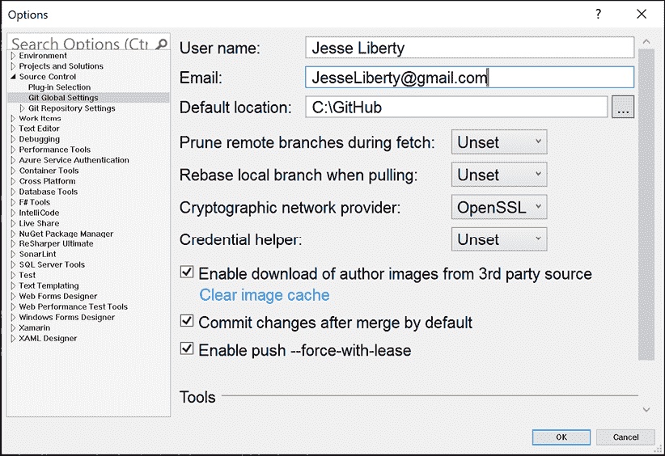

# 第一章：简介

在本章中，我们将涵盖以下主题：

+   版本控制和 Git 的简短历史

+   获取并设置 Visual Studio 2019、GitHub Desktop 和终端

+   获取并安装 Git

+   为 Visual Studio、GitHub Desktop 和 GitHub 命令行配置 Git

开始吧！

# 本书简介

> “从一开始开始，”国王庄严地说，“一直进行到结束，然后停下来。”——《爱丽丝梦游仙境》

在本书中，我们将从 Git 的基础开始，逐步深入到高级主题。无需任何 Git 的使用经验。当然，如果你已经在使用 Git，你可能希望跳过前面的章节。Git 可以说是全球最流行的版本控制系统，但这也引发了一个问题：“什么是版本控制？”

# 版本控制

在有版本控制之前，我会写一点代码，然后当我开始担心丢失这些代码时，我会备份我的目录。这种做法很慢、低效，占用了大量的磁盘空间，而且很难与他人共享。

**版本控制系统**（**VCS**）为你完成所有这些工作（还有更多），并且以一种快速、高效、占用最少磁盘空间的方式进行。其中最快和最有效的之一就是 Git，尽管也有其他的工具。本书不会花很多时间说服你 Git 比其他工具更好。首先，市场已经证明了这一点，Git 占据了主导地位。其次，如果你已经购买了本书，那说明你已经做出了选择。如果你还没有购买本书，那就去购买吧。我会在这里等你。

# 关于代码示例

为了演示 Git 的使用，我们需要有一个可以演变的小程序。代码示例使用 C#编写，但它们非常简单，无论你是否熟悉这门语言，你都能跟得上。例如，如果你能搞清楚这段代码的作用，那你就准备好了。

```
public class Program
{
    public void PrintHello()
    {
        Console.WriteLine("Hello World!");
    }
} 
```

这段代码声明了一个类（不用担心它是什么）名为`Program`。在这个类内部，有一个方法（函数）叫做`PrintHello`，它会将`Hello World`打印到控制台（你的屏幕上）。

这大概就是最复杂的地方了，我会在接下来的过程中解释每个代码片段。

# 简短的历史

2005 年 7 月，在仅仅几个月的工作后，Linux 背后的天才 Linus Torvalds 发布了 Git，以满足他自己的需求、Linux 社区的需求，最终也满足了我们所有人的需求。Git 的目标是快速和高效。它做到了。

虽然当时大多数 VCS 都是集中式的（所有文件都保存在一个大服务器上），但 Git 使用的是分布式系统，其中每个人都有自己的仓库。从技术上讲，Git 不需要中央服务器，尽管如果你在团队中工作，中央的代码共享位置会很方便。但最大的不同在于，使用 Git 时，你与 VCS 的绝大多数交互都是本地的——就在你的磁盘上。

# 使用 Git 的工具

有许多容易混淆的术语（例如 Git 与 GitHub 的区别），而且有很多工具可以与 Git 一起使用——从命令行到**图形用户界面**（**GUI**）工具。本节将回顾其中的一些选项。

## GitHub 等

有许多服务允许你创建共享的“仓库”（存储程序所有版本的位置）。最著名和流行的包括 GitHub 和微软的 Azure，还有 BitBucket 和 GitLab。Azure 是一个功能强大的 DevOps 系统，而 GitHub 是一个非常直接的托管程序的方式。本书中我们将使用 GitHub。（最近，微软以 75 亿美元的股票收购了 GitHub，并对 GitHub、开源项目以及 Git 做出了巨大的承诺。）

**关键点**：Git 是本书中讲解的系统。GitHub 是一个用于共享代码的中央仓库系统（我们将在书中稍后更加具体地讲解），而 GitHub Desktop 是一个用于操作 Git 的 GUI。

## GUI 和命令行

有许多方式可以与 Git 互动。主要的方式是通过命令行操作或使用 GUI。GUI 工具种类繁多。本书将重点介绍 GitHub for Desktop 和 Visual Studio 2019 以及命令行。事实上，本书的一个不同之处在于，我们将通过这三种工具来讲解 Git。这将帮助你深入理解 Git，同时了解 GUI 工具如何帮助（或阻碍）你的工作。

还有许多其他优秀的 GUI 工具，而且工具的生态系统也在不断发展。话虽如此，我们将使用的这些工具既强大又具有代表性，几乎所有其他 GUI 工具也都提供类似功能。此外，这些工具已经得到广泛应用，未来很可能会继续存在。更重要的是，如果你掌握了一个 GUI 工具，并了解它与命令行指令的关系，你会发现使用其他 GUI 工具也变得轻松。

我们将首先看一下 Git 的命令行界面。虽然 GUI 工具有一些局限性，但如果 Git 可以做到的事，你也能在命令行中完成，也就是说，Git 的所有功能都可以在命令行中操作。此外，正如常常有人指出的那样，了解 Git 的命令行使用方式，会让你使用 GUI 工具更加得心应手，因为你会知道发生了什么。

理解你的车是怎么运作的有帮助吗？完全没有，除非出现故障。然后你会求助于能够修理问题的专业机械师。在 Git 中，专家就是熟悉命令行的程序员。

## 命令行

在 Windows 10 上，开箱即用的命令行可以直接从终端访问。它提供了你需要的一切，但它有点难看：


图 1.1：Git 在命令行中的表现

它比较难读，但我们可以把它美化，使它更容易阅读。

## 美化命令行界面

如果你在 Windows 10 上使用 Git，你可以让命令行界面看起来更漂亮且更有用，如下所示：


图 1.2：Pretty Print 示例

为此，请下载并安装 Power Shell。然后，按照 Scott Hanselman 在 [`jliberty.me/PrettyGit`](http://jliberty.me/PrettyGit) 上提供的出色指示操作。

在 mac 和 Linux 上，你可以通过访问 [`github.com/diogocavilha/fancy-git`](https://github.com/diogocavilha/fancy-git) 按照指示操作，达到类似的效果。GitHub 网站上还有其他类似的选项，也能做到差不多的效果。

## Visual Studio 2019

Visual Studio 2019 内置了对 Git 的广泛支持。专门为 Git 设计了一个独立的菜单，Git 信息也集成到了整体的用户界面中：


图 1.3：Visual Studio 2019 中的 Git 菜单

首要的任务是获取并设置 Visual Studio。

## 免费获取 Visual Studio

本书中用于示范的三个产品（命令行、Visual Studio 2019 和 GitHub Desktop）都提供免费版本。要获取 Visual Studio 2019，访问 [`visualstudio.com`](http://visualstudio.com)，然后将鼠标悬停在 **Visual Studio** 按钮上，选择 **Community 2019**。它将自动下载，你只需双击并按照指示完成安装：


图 1.4：获取 Visual Studio

如果你使用的是 Mac，Visual Studio 2019 for Windows 和 Visual Studio for Mac 在处理 Git 的方式上存在一些显著的差异。你可能不会遇到太多困难，但你也可以随时使用 Terminal 或 GitHub Desktop。

## GitHub Desktop

一款非常流行的图形界面（GUI），尤其适用于 GitHub，是 GitHub Desktop。这款跨平台应用程序让使用 Git 变得异常简单：预判你可能想做的事情，并将其简化。缺点是，像几乎所有图形界面一样，它也有一些限制。


图 1.5：GitHub Desktop

本书中我们将使用这三种工具：命令行、Visual Studio 2019 和 GitHub Desktop。随着内容的推进，上面展示的选择和 Git 命令会变得更易理解；现在，你只需熟悉它们的外观即可。

# 获取 Git

你需要做的第一件事是安装 Git。Git 的官方网站声明：“即使 Git 已经安装在你的电脑上，重新安装并更新到最新版本也是一个不错的主意。”

## 在 Windows 上获取 Git

在 Windows 上，还有几种方法可以安装 Git。我推荐使用官方版本。最新版本可以在 Git 网站上获取：[`git-scm.com/download/win`](https://git-scm.com/download/win)。

获取 Git 的另一种方式，并且一举两得，是下载并安装 GitHub Desktop。安装程序还会安装 Git 的命令行版本。你可以在 [`desktop.github.com/`](https://desktop.github.com/) 获取：


图 1.6：获取 GitHub Desktop

本书将在 Windows 10 上展示演示，使用 Git 版本 2.30.0.windows.2，但这些示例应该适用于几乎任何版本的 Git。

## 在 Mac 上获取 Git

有几种方式可以在 Mac 上安装 Git。最简单的方法可能是安装 Xcode 命令行工具。你可以通过第一次从终端运行 Git 来实现，如下所示：

```
$ Git --version 
```

如果你尚未安装，它会提示你进行安装。

如果你想要更最新版的 Git，也可以通过二进制安装程序进行安装。一个 macOS 的 Git 安装程序由 Git 网站维护并提供下载，网址是 [`git-scm.com/download/mac`](https://git-scm.com/download/mac)：


图 1.7：在 Mac 上安装 Git

你也可以将其作为 GitHub Desktop for macOS 安装的一部分来安装。它们的 GUI Git 工具也有一个选项可以安装命令行工具。你可以从 GitHub Desktop for macOS 网站下载该工具，网址是 [`desktop.github.com`](https://desktop.github.com)。

## 在 Linux 上获取 Git

本书没有正式支持 Linux，但几乎所有平台上的 Git 都是相同的。

如果你想在 Linux 上安装基本的 Git 工具，通常可以通过随发行版附带的包管理工具来实现。如果你使用的是 Fedora（或任何相关的 RPM 发行版，如 RHEL 或 CentOS），可以使用 `dnf`：

```
$ sudo dnf install git-all 
```

如果你使用的是基于 Debian 的发行版，如 Ubuntu，尝试使用`apt`：

```
$ sudo apt install git-all 
```

## 检查你的版本

安装完 Git 后，你的第一个命令应该是以下内容：

```
git --version 
```

也就是说，关键字是 `git`，然后是 `version`，前面加上两个破折号。这有时被称为“git 双破折号版本”。

我电脑上的输出如下：

```
˃ Git --version
git version 2.30.0.windows.2 
```

（你可能会有不同的体验。）

# 配置 Git – 命令行

本书将会介绍如何配置 Git 来进行个性化设置，但现在，先添加你的名字和电子邮件地址，以便每次使用 Git 时都能正确地记录信息。输入以下命令行命令：

```
git config --global --edit 
```

这将打开你的编辑器。找到或创建 `[user]` 部分，并添加以下内容：

```
[user]
name = Jesse Liberty
email = jesseliberty@gmail.com 
```

你可能想使用自己的姓名和电子邮件地址。

配置文件中还有其他条目。暂时忽略它们并保存关闭文件。

# 配置 Git – Visual Studio

在 Windows 的 Visual Studio 中，点击 Git 菜单，打开一个对话框。在第一个标签页中，输入你的用户名和电子邮件地址：



图 1.8：在 Visual Studio 中设置 Git 选项

# 配置 Git – GitHub Desktop

要配置 GitHub Desktop，你需要一个 GitHub 账户。我们将在下一章中介绍。一旦你有了账户，进入 **文件 | 选项**，选择 **账户** 标签，然后点击 **登录**：


图 1.9：设置 GitHub Desktop

# 总结

本章介绍了本书的概述，列出了每一章的内容。你还看到了版本控制及 Git 本身的简短历史。

接下来，我们查看了下载你需要的环境：Visual Studio 2019、GitHub Desktop 和 PowerShell 作为你的命令行工具。所有这些都可以免费获得。

软件下载完毕后，我们查看了如何设置 Git，以及如何配置我们将要使用的工具。
