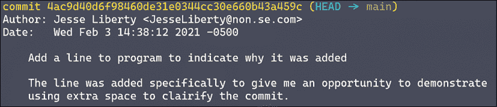

# 第二章：创建你的代码库

本章将教你如何在 GitHub 上创建一个账户，如何创建和克隆你的第一个代码库，从而建立你电脑上的代码库与 GitHub 上代码库之间的链接。

本章内容将包括：

+   创建你的代码库

+   Git 拉取

+   推我、拉你

+   从命令行开始

+   提交 – 最佳实践

我们将从创建你的 GitHub 代码库开始。

# 创建你的代码库

创建代码库有很多种不同的方法。我们将介绍如何在 GitHub 上创建代码库并将其克隆到本地磁盘，因为这是最常见的方式。

## 首先在 GitHub 上创建你的代码库

你首先需要在 GitHub 上注册。访问 [`github.com`](http://github.com) 并点击**注册**。填写你的用户名（如果用户名已被占用，系统会提示）和邮箱，系统可能会要求你验证你是人类。假设你是，点击**创建账户**。

填写他们的微型调查问卷，然后点击**创建账户**。系统会要求你验证电子邮件，完成后你会看到（一次性）欢迎页面，询问你想要做的第一件事。选择**创建代码库**：


图 2.1：开始使用 GitHub

如果你已经有账户，登录并点击**新建代码库**。你可能一开始找不到这个选项，这时点击角落的大加号。

无论如何，你都会被引导到**创建新代码库**页面。第一件事是为你的新代码库命名。我将使用 `ProGitForProgrammers`。只要 GitHub 没有提示名称已被占用，你可以随意使用任何名称。

现在是时候填写表格了：


图 2.2：创建代码库

首先输入一个简短的项目描述。接下来，非常重要的是，选择你是否希望将这个代码库设置为公开（任何人都可以查看）还是私有（只有你邀请的人可以查看）。

我强烈建议勾选**添加 README 文件**。这将是用户访问你的代码库时看到的内容。你可以稍后使用 Markdown 来修改该文件。

一定要添加 `.gitignore` 文件。这告诉 Git 在提交文件到代码库时忽略哪些文件。这非常重要，以防你不小心覆盖了其他程序员的元数据文件。点击下拉菜单，看看支持多少种语言；对于 C#，我建议你搜索并选择 Visual Studio。

如果你的代码库是公开的，请务必为代码选择许可证。我选择了 MIT 许可证。你可以在 [`opensource.org/licenses/MIT`](https://opensource.org/licenses/MIT) 了解更多关于此许可证的信息。

就是这样！你准备好点击**创建代码库**了。点击后，你将被带到你的新 GitHub 代码库的主页：


图 2.3：你代码库的初始视图

注意，你已经有了你要求的三个文件，并且可以看到 README 文件的预览以及你输入的描述。

目前，这个仓库只存在于服务器上。你想把它复制到你的磁盘上，以便你可以添加代码并使用命令保持同步。因此，你将“克隆”这个仓库；也就是说，你会在本地仓库中创建一个远程仓库的精确副本。

你如何进行这一步将取决于你使用的是命令行、Visual Studio 还是 GUI。

## 克隆到你的计算机 – 命令行

克隆到本地仓库非常简单。打开你的终端（或 PowerShell），并将目录更改为你想要仓库存放的位置（在我这里是 GitHub/命令行）。

返回到你的 GitHub 仓库，点击右上角绿色的**Code**按钮。点击该按钮后会弹出一个小对话框。选择**HTTPS**，除非你知道自己有**SSH**（就像我一样）。无论哪种情况，点击剪贴板图标以复制地址：


图 2.4：复制仓库地址

返回到命令行，输入 `git clone`，然后粘贴地址：

```
git clone git@github.com:JesseLiberty/ProGitForProgrammers.git 
```

你应该会看到类似这样的内容：


图 2.5：在命令行中克隆

将目录更改为`ProGitForProgrammers`，你会看到原本在服务器上的三个文件现在也出现在这里：


图 2.6：目录中的文件

现在，让我们看看如何在 Visual Studio 中执行此操作。

## 克隆到你的计算机 – Visual Studio

进入你的目录（在我这里是`GitHub`），创建一个名为 `VisualStudio` 的目录。

打开没有项目的 Visual Studio，选择**文件 | 克隆仓库**。填写字段并点击**克隆**：


图 2.7：使用 Visual Studio 克隆到本地仓库

几秒钟后，你会看到三个文件，现在它们显示在**解决方案资源管理器**中：


图 2.8：在 Visual Studio 中的克隆文件

从 GitHub 仓库克隆到你自己的仓库有很多种方法。其中一种方法是使用专用的 GUI 工具，比如 GitHub Desktop。

## 克隆到你的计算机 – GitHub for Desktop

再次返回到你的根目录（`GitHub`），并创建一个新目录。这次命名为`GitHubDesktop`。

现在，返回到 GitHub 并点击**Code**：


图 2.9：通过 GitHub Desktop 直接克隆

请注意，其中一个选项是**使用 GitHub Desktop 打开**。点击它，一个对话框会弹出。你需要填写的唯一字段是本地路径。点击**克隆**：


图 2.10：使用 HTTP 克隆到 GitHub Desktop

请注意，GitHub Desktop 需要你仓库的 `https` URL。

现在，你有三个原始仓库的副本，每个副本都在自己的目录中：`CommandLine`、`VisualStudio` 和 `GitHubDesktop`。这些可能代表三位程序员在同一个解决方案上工作，或者是一个程序员选择克隆其项目的不同方式。

## 创建项目

我们需要一个项目。使用 Visual Studio（或您喜欢的编辑器）在 `CommandLine` 目录下创建一个名为 `ProGitForProgrammers` 的项目。完成后，您应该会有三个原始文件和一个程序文件夹。该文件夹中将包含 `.sln` 文件以及一个代码文件夹。

打开命令行并导航到相同的目录。当您到达时，您的命令行应如下所示：


图 2.11：命令行提示符

看看黄色区域，您会看到 `+1 ~0 -0`。`+1` 表示您添加了一个文件或目录；`~0` 表示没有文件被修改；`-0` 表示没有文件被删除。让我们来看一下添加了什么。输入：

```
git status 
```

您应该看到类似如下内容：


图 2.12：未跟踪的文件

Git 告诉您您在 `main` 分支（目前唯一的分支）上，并且您有“未跟踪的文件”——也就是说，这些文件存在于目录中，但 Git 并没有跟踪它们。如果它们是未跟踪的，Git 无法存储它们；实际上，Git 根本不知道它们的存在。让我们来解决这个问题。输入以下命令：

```
git add ProGitForProgrammers/
git commit -m "First commit – from command line" 
```

`add` 告诉 Git 这是一个它应该关注的文件，而 `commit` 将其添加到本地仓库。

每次 `commit` 都必须有一条信息，如果您没有提供，Git 会提示您添加信息。我在这里通过使用 `-m` 标志添加了它。

再次强调，所有这些操作都发生在本地，因此 GitHub 并不知道这一切。我们可以通过将我们的提交推送到服务器来解决这个问题：

```
git push 
```

现在，如果您去 GitHub 并刷新页面，您的项目将会显示在那里。您可以通过文件夹逐层点击，甚至进入 `Program.cs` 文件，查看代码：


图 2.13：在 GitHub 上查看您的代码

注意左上角告诉您您正在 **main** 分支。旁边是到 `Program.cs` 的路径。下面是您添加的提交信息，然后是文件本身。

# Git 拉取

将您的提交推送到服务器后，其他开发者可能希望将其拉取到自己的目录，以保持同步。

### 使用 GitHub Desktop 拉取

将项目上传到服务器后，我们可以轻松地将其拉取到其他位置。例如，打开 GitHub Desktop。它会告诉您仓库中有更改，并热心地提供一个按钮帮助您更新本地仓库。

如果您打开文件资源管理器并导航到 `GitHubDesktop` 目录，您将看到现在有一个您从命令行推送的文件副本。

### 拉取到 Visual Studio

点击 Git 菜单并选择 **拉取**。Visual Studio 会更新为服务器上的代码。现在所有三个仓库都是最新的。这是 Git 的核心：

+   将文件保存到本地仓库

+   将文件推送到远程仓库

+   拉取任何在远程仓库中但本地仓库中不存在的文件

# 推送我，拉取你

通常，你会推送自己的更改并从其他开发者那里拉取更改。此外，通常你不会在相同的文件上工作，更不会在主分支（main）上工作。我们将在*第四章*，*合并分支*中讨论如何避免这种情况。现在，我们只需要格外小心。

在目录`GitHub/VisualStudio/ProGitForProgrammers`中打开 Visual Studio。按照下面的方式向`Program.cs`中添加一行代码：

```
namespace ProGitForProgrammers
{
    class Program
    {
        static void Main(string[] args)
        {
            Console.WriteLine("Hello World!");
           `**Console.WriteLine("I just added this in Visual Studio");**         }     } }` 
```

````Having made your change, you want to check it in. Since we are in the `VisualStudio` directory, we'll do the work right within Visual Studio. Click the `Git` menu and choose **Commit or Stash**. A Git window will open as a tab next to **Solution Explorer**. Enter a commit message and press **Commit All**:    Figure 2.14: Git window in Visual Studio    Note that if you drop down the **Commit All** menu, you have a number of shortcuts for adding, committing, and pushing your changes.    As you can see, and will see often in this book, you can do almost anything in Visual Studio that you can do at the command line.    ### Pushing to the server    You have now committed your changes to your local repository. The GitHub repository, however, doesn't know about your changes. (You can prove this to yourself by returning to GitHub and drilling down to `Program.cs`.)    The other programmers' repositories (for example, `CommandLine` and `GitHubDesktop`) are equally oblivious. To disseminate this change, you first push your changes up to the server (GitHub) and then pull them down to the other repositories.    From within Visual Studio's Git window, press **Staged**. This will stage your changes for committing. Next, click **Commit**. This will put your changes into your local repository (be sure to give the commit a meaningful message).    Examine the Git window; there is a lot of information:    Figure 2.15: The Git window in Visual Studio    You are told that the commit was created locally (and locally is the important part!). Below that is the status of your commit. You have one to push up to the server (outgoing) and none to bring down (incoming):    Figure 2.16: Uploading a commit from Visual Studio    Now, find the up-pointing arrow in the upper-right corner. Hover over it and you'll see that it says `Push`. Click that button to push your changes to the server. When it is done, it will give you a success message. Ignore the offer to create a pull request for now.    Look to the left of your Git menu and see the local history of your commits:    Figure 2.17: The history of commits    Each dot signals a commit, and next to each dot is your commit message (and now you can see why meaningful commit messages are both hard to write and worth the effort). There is also an indicator that main is pointing to your last commit.    If you check GitHub (remember to refresh the page) you will now see the line in `Program.cs`. Make sure you understand why: this is because after we committed the change, we pushed it to the remote repository.    ## Downloading the changes at the command line    We created the changes in the `VisualStudio` directory. `CommandLine` and `GitHubDesktop` know nothing of the changes, even though they are now on GitHub.    For these directories to know about the changes, you need to pull the changes down.    Change directories to `CommandLine`. Examine the contents of `Program.cs`; the new line is not there. Open your terminal and enter `pull`. This will pull any changes from the server to your local repository.    The result should look like this:    Figure 2.18: Pulling from the remote repository    Git is telling you that it formatted and compressed your files and passed them down to your repository. Toward the bottom it says that it used Fast-forward. We'll discuss this in *Chapter 4*, *Merging, Pull Requests, and Handling Merge Conflicts*.    Take a look at `Program.cs` now in your command directory; the new addition should now be there.    Want to do something cool? Open the `Program.cs` file before updating. After the update you will see the second `WriteLine` pop into view. What is actually happening is that the code that was in your directory is replaced by the new code on the pull.    ### Downloading the changes using GitHub Desktop    Change directories to `GitHubDesktop` and open the GitHub Desktop program. It will give you a lot of information about the status of your repository (**No Local Changes**) and it will automatically check and inform you that there is one commit to update your local repository with:    Figure 2.19: The view from the remote repository    Go ahead and click **Pull origin**. It does the pull, and the button disappears. Check your code; the change should now be in your `Program.cs` (and is recorded in your local repository).    All three local repositories and the server repository are now in sync.    # Starting at the command line    You can start the process at any of our repositories. Last time we started in the `VisualStudio` repository and then pulled the changes down to the `CommandLine` and `GitDesktop` repos. This time, let's start at the command line.    Open Visual Studio and point it to the project in your `CommandLine` directory. Just to be certain, right-click on **Solution**, select **Open Folder in File Explorer**, and make sure you are in the right directory.    To keep this example very simple, we'll just add another line to `Program.cs`:    ``` class Program {     static void Main(string[] args)     {         Console.WriteLine("Hello World!");         Console.WriteLine("I just added this in Visual Studio");         Console.WriteLine("I just added this in the command line repo");     } }  ```    Normally you would make many more changes before checking in, but again, this is a demo and we're more interested in using Git than we are in fussing with this silly program. Save all your files and at the command line get the status by entering:    ``` git status  ```    This will give you output that looks like this:    Figure 2.20: The command line indicating one file has been modified    The key piece of information is the modified file. That is just as it should be, as that is the file we modified. You can now add it to the index and then commit it:    ``` git add ProGitForProgrammers/ProGitForProgrammers/Program.cs git commit -m "Add writeline indicating we are in command line"  ```    On the other hand, you can combine these two steps with the `-a` flag:    ``` git commit -a -m "Add writeline indicating we are in command line"  ```    You will want to draw a distinction between untracked files and modified files. Untracked files are outside of Git and cannot be manipulated inside Git until they are added; modified files are tracked by Git but have changed since the last commit.    If we are happy with the commit we've added, we can (optionally) push it to the server:    Figure 2.21: Pushing our commit to the remote repository    We'll want to do that because we want to share this code with the other programmers.    ## Pulling to GitHub Desktop    Switching to GitHub Desktop, we see that it already knows there is something to pull, as we saw last time. (If it doesn't, push the **Fetch** button, which will go to the server to see if there is anything to bring back.)    That's two repos that are identical, but the `VisualStudio` repo is not yet up to date. Let's return to Visual Studio in the `VisualStudio` folder.    ## Pulling to Visual Studio    Open the Git menu item, and select `Pull`. Watch your source code and see the third line pop into existence. Once again, the three local repositories and the remote repo are all in sync.    # Commits – best practices    Like everything else in programming, best practices in commits are, to some degree, controversial. The first issue is frequency.    ## How often should I commit?    There are those who say a commit should be atomic: representing exactly one unit of work (one task, one bug fix). No more and no less. So, according to this line of thought, if you are in the middle of work and you get called away, you should not commit, but you should use the stash. The stash is an area where you can put files that you want to come back to later. You can name sets of files that you stash, and then pick the one you want to restore by name.    This is a defensible position, but I hold the opposite: commit early and commit often.    Commits are cheap and fast in Git, and interactive rebase (see *Chapter 6*, *Interactive Rebasing*) allows you to "squash" commits together. Therefore, if you are working on a feature and you make five interim commits before you are done, you'll have the opportunity to squash them into a single commit with a single message. This is the best of both worlds: you secure your interim work with a commit, and you present only one commit (rather than five) to the server.    ## Keep your commit history clean    The first way that a programmer reviews your code is to look at the list of commits and then dive into those that are interesting. A good history of commits with well-written messages is a delight to review. A long, tedious history with meaningless messages is only slightly more fun than eating glass.    ## A note on commit messages    As you will see later in this book, commit messages are very important for anyone (including you) reviewing your commit history. By convention, commit messages should be in the imperative, and should tell you exactly what is in that commit.    ``` Fixing some files                        // bad Fix WriteLine in helloworld.cs           // good  ```    In practice you'll often find comments in the past tense:    ``` Fixed WriteLine in helloworld.cs         // good enough  ```    > *"In theory, theory and practice are the same; in practice, they never are*." -- Pat Johnson    It pays to get into the habit of writing good messages in the right format. Your teammates will thank you.    ## When the title isn't enough    The message title should be kept to 50 characters. Most of the time this is enough, but if it isn't, leave the `-m` message off and let Git open your editor. There you can add additional information. Skip a line after the header and consider using bullet points or other ways of making the things you want to convey easy to read.    Important: By default Git uses vi (a Unix editor). You'll want to enter:    ``` git config ––global core editor "code -w"  ```    This ensures that Visual Studio Code is your default editor:    Figure 2.22: Editing in Visual Studio Code    Note that `#` is the comment character, and all lines that begin with `#` will be ignored.    When you use `log` (see *Chapter 9*, *Using the Log*) to see your history (or view history in Visual Studio, etc.) you'll see the entire message:    Figure 2.23: The output of the log command    You can see just the headers if you want, using `git log -–oneline`, but we'll leave the details for *Chapter 9*, *Using the Log*:    Figure 2.24: log using the oneline flag    # Summary    In this chapter, we have covered a number of topics relating to creating and interacting with your repository. We discussed:    *   Creating your repository *   The relationship between your local and remote repositories *   Git pull *   Git push *   Starting at the command line *   Using Visual Studio *   Commits: best practices    In the next chapter, we'll take a look at the various places Git keeps your files, and the relationship between adding an untracked file and committing a tracked file.````
