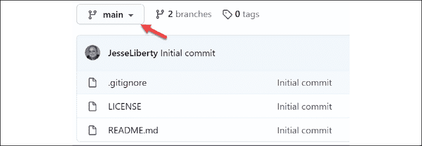

# 3

# 分支、位置和图形界面

在本章中，你将了解 Git 中至关重要的“五个位置”：工作区、索引、局部仓库、远程仓库和暂存区。你将学习如何使用这些位置以及它们是如何协同工作的。

每个概念将通过代码和截图进行说明，大多数 Git 操作将在命令行、Visual Studio 和 GUI（GitHub Desktop）中进行演示。

你还将学习如何创建分支、提交代码，以及如何将提交从工作区移到仓库中，再从仓库移到远程仓库中。

# 五个位置

作为程序员，我将 Git 分为五个位置：

1.  工作区

1.  索引（暂存区）

1.  局部仓库

1.  远程仓库

1.  暂存区

让我们逐一查看这些内容。

## 工作区

工作区是你当前文件所在的位置。也就是说，如果你打开 Windows 资源管理器并导航到你克隆的目录，你会看到你当前正在处理的程序版本。如果你打开 Visual Studio 2019，这些文件会出现在解决方案资源管理器中。同样，工作区是你当前文件所在的位置；如果你在你的项目中打开 Visual Studio，工作区中的文件就是你会看到的文件。当你切换分支时（见下文），工作区会更新为适当的文件。这可能是 Git 中最难理解的概念之一：当你切换分支时，工作区中的文件会发生变化——也就是说，当前分支的文件会被切换到 Windows（或 Mac 或 Linux）目录中。

**注意**：可以通过所谓的工作树使用多个工作区。这些超出了本书的范围，你在很长时间内可能都不需要它们。

在我们当前的程序中，工作区在 Windows 资源管理器中的样子如下：


图 3.1：当前工作区

这个相同的目录可以通过命令行查看：


图 3.2：来自命令行的当前工作区

在 Visual Studio 中，相同的工作区如下所示：


图 3.3：来自 Visual Studio 的当前工作区

如果你查看目录中的内容，你会发现完全相同的文件。

## 索引/暂存区

如果工作区中有你想要提交的文件，你首先需要将它们添加到暂存区（通常称为索引）。从暂存区开始，只需一个命令（`commit`）就能将这些文件移入局部仓库。


图 3.4：修改 Program.cs

我在我们拥有的三个副本中都添加了几行。

让我们从命令行开始。我有一个习惯，就是在做任何事情之前，先运行`git status`：


图 3.5：命令行中的 git status

要在命令行中将这个文件添加到索引中，只需使用关键字`add`，然后跟上文件名或一个句点（`.`），表示你希望将所有文件移到暂存区：

```
git add  ProGitForProgrammers/ProGitForProgrammers/Program.cs 
```

Git 不会做出响应，但文件现在已经进入暂存区。如果你再次查看状态，你会看到这一点：


图 3.6：已修改文件已暂存

这次，它显示已修改的文件已准备好提交。要提交这个文件，你只需输入 `git commit`。因为文件已经暂存，它将立即提交到本地仓库。如果你没有添加 `-m "my message"`，编辑器将打开，供你添加消息。

## 跳过暂存区

你可以跳过暂存区，直接提交文件，方法是使用 `-a` 参数。因此，当你的文件未暂存时，你可以写：

```
git commit ProGitForProgrammers/ProGitForProgrammers/Program.cs -a -m "My message" 
```

这将立即提交 `Program.cs` 文件，并附上指定的消息。我承认，我 90% 的时间都是这样提交文件的。（你也可以使用 `git commit -a -m "my message"` 来提交工作区中所有已修改的文件。）

## Visual Studio

在 Visual Studio 中，状态始终可见，位于右下角：


图 3.7：Visual Studio 右下角

0 与上箭头表示你没有文件等待推送。铅笔旁边的 1 表示你有一个已修改的文件。接下来是你的程序名称，最后是你所在的分支。

在 Visual Studio 中有多种提交方式。例如，你可以直接从 Git 菜单提交，或者右键单击文件并选择**Git**。然后选择**提交或暂存**。然而，更简单的方法是点击铅笔图标，打开**Git 变更**菜单：


图 3.8：Visual Studio 变更窗口

在这里，你可以看到已更改的文件及其路径。你可以选择**全部提交**，或者点击该按钮下拉并选择若干相关选项。填写消息后按下**全部提交**，Visual Studio 会立即响应，确认你已提交到*本地*仓库，并提供将更改上传到远程仓库的机会（显示你有一个外发文件）：


图 3.9：Visual Studio 提交和推送/拉取菜单

由于我们通常认为上传是“向外”传输，而不是“外发”，所以可能会感到困惑。简单来说，当 Visual Studio 说“外发”时，它指的是从本地到远程服务器，而“内发”则指的是从服务器到本地仓库。

## GitHub Desktop

GitHub Desktop 在一个屏幕上给你提供了大量信息：


图 3.10：GitHub Desktop

在顶部行，你可以看到仓库名称和当前分支。在左上角的窗口中，你可以看到有一个文件发生了变化，以及是哪个文件。在右侧，你可以看到实际的变化。

最后，在左下角，你可以输入消息并提交文件。

一旦你提交，页面会清空并显示一个新按钮，允许你将更改推送到服务器。

## 本地与远程仓库

Git 的第三和第四个区域是本地仓库和远程仓库。我们在前一章中已经讨论过这个话题，这里我只重复一句：`commit` 将文件提交到*本地*仓库，`push` 将你的提交从本地仓库推送到远程仓库。

虽然我提倡频繁提交，但你可能希望在推送之前进行几次提交。这样，你就有机会合并相似的提交，正如我们在*第六章*中所看到的，*交互式变基*（Interactive Rebasing）中所述。

## 暂存区

Git 的第五个也是最后一个区域是暂存区。顾名思义，暂存区是用来存放你修改过但不想提交或者在切换分支时不想丢失的文件的地方。我们将在下面的分支讨论中详细了解这个功能。

# 分支

使用分支对 Git 的操作至关重要，更不用说对项目成功的影响了。其基本思想是：你有一个“主”分支，所有发布操作都从这个分支进行。每当有代码添加到主分支时，都会进行检查和审查，以确保主分支保持尽可能干净。

当你需要修复一个 bug 或开发一个新功能时，你会创建一个新的分支（通常称为功能分支）。这将创建一个当前主分支代码的副本。你可以在功能分支上工作，而不会影响主分支。完成工作并确保一切正常后，你可以将功能分支“合并”回主分支：


图 3.11：第一个功能分支

请注意，存在一个名为**Head**的指针。它指向你工作区中的内容。在这种情况下，我们已经分支到**Feature 1**，**Head**显示该功能分支的代码现在位于我们的工作区中。

这是对分支的一个很好的简化，但实际上还有很多内容。首先，让我们来看一下如何操作。直到现在，你的所有代码都在 Main 分支上——这是一种不好的实践。我们应该在编码前就创建一个功能分支。话虽如此，我们现在仍然可以这样做。

从命令行开始，你只需检查 Main（将 Main 上的最新提交内容放入你的工作区。指针“tip”表示最新的提交）。进入 Main 后，你将从远程仓库 `pull` 以获取 Main 的最新版本。此时，你已经准备好创建你的第一个分支。命令序列如下所示：


图 3.12：在命令行上创建分支

请注意，创建分支 `Calculator` 并没有自动检出它；你必须作为一个单独的步骤来完成此操作。但是，如果你使用 `-b` 标志，那么你可以同时创建并检出分支：

```
git checkout -b Calculator 
```

无论哪种情况，新分支都在工作区中。但是，那个分支中是什么内容呢？由于该分支是从主分支创建的，而我们还没有做任何更改，因此新分支与主分支完全相同。从这里开始，它们将分叉。随着你添加代码，代码将存在于新分支（`Calculator`）中，但不会出现在主分支中。

在深入研究之前，我们先为 Visual Studio 用户和 GitHub Desktop 用户创建分支。

最简单（也是最不混淆）的方法是打开 Windows 资源管理器，导航到`VisualStudio`文件夹（在我的情况下是**GitHub** | **VisualStudio** | **ProGitForProgrammers** | **ProGitForProgrammers**）。在该文件夹中有一个`.sln`文件，我会双击它，打开 Visual Studio。（这本书最初叫做《Pro Git For Programmers》，你会在代码中看到这个名字。）

不要混淆`VisualStudio`文件夹（我们用它来演示在 Visual Studio 中使用 Git）和程序本身，后者用来修改所有三个地方（`CommandLine`、`GitHubDesktop` 和 `VisualStudio`）中的代码。

如果你把这些看作是三个独立的程序员，每个程序员在自己的计算机上（这里通过使用不同的目录来模拟），可能会更容易理解。每个程序员都有一个主分支，现在每个人都在为自己的工作创建分支。

我们也希望把这个放到一个分支上，为了减少混淆，我们将这个分支命名为`Book`。要创建该分支，点击**Git**菜单，选择**新建分支**。给新分支命名为`Book`，然后按**创建**：


图 3.13：在 Visual Studio 中创建新分支

当你这么做时，左侧会弹出一个窗口，列出该仓库的所有分支，`Book`会以粗体显示，表明它是当前分支：


图 3.14：Visual Studio 中的分支菜单

现在有两个用户已经从主分支创建了分支。我们用 GitHub Desktop 来创建第三个分支。打开该程序，点击菜单中的**仓库**。在菜单中点击**在资源管理器中显示**，确保你处在`C:\GitHub\GitHubDesktop\ProGitForProgrammers`路径下。

它应该显示你已经从源（服务器）拉取了一次，并且有一个按钮上写着**拉取源**。点击该按钮。这将下载最新版本的**Main**。你现在应该看到按钮显示**推送源**—这表示将现在位于该目录中的两个提交推送到服务器。

创建新分支时，点击**分支**菜单，并选择**新建分支**。系统会提示你输入新分支的名称。输入`Movie`并点击**创建**。此时界面会询问你是否要发布该分支。GitHub Desktop 中的发布仅仅是将其上传到远程仓库。我们先不发布，先进行一些提交。

## 程序员 1（命令行）与计算器

在`CommandLine`目录路径中打开 Visual Studio。在解决方案资源管理器中，你应该能看到`Program.cs`，里面有五个`WriteLine`语句。添加一个名为`Calculator`的新类，并将其设置为`public`：

```
namespace ProGitForProgrammers
{
    public class Calculator
    {
    }
} 
```

通常情况下，我们不会在如此少量的工作后就创建提交，但为了本书中的简单示例，我们将进行大量提交。返回命令行并查看状态。它会告诉你有一个未跟踪的文件。Git 已经识别出该目录中有一个它不了解的文件。我们的下一步是将其添加到 Git 中：

```
git add . 
```

通过使用点号，`add`命令将把任何修改过或新增的文件添加到暂存区。然后，你只需通过输入以下命令提交新文件：

```
git commit -m "Add calculator class" 
```

如果你现在写`git status`，Git 会告诉你当前所在的分支是`计算器`，没有任何需要提交的内容，且工作区是干净的。

我们将在*第九章*《使用日志》中详细讨论`log`命令，但现在先用它查看我们的提交和相关消息：

```
git log ––oneline 
```

这将显示你所有的提交，每个提交一行：

```
˃ git log --oneline
e5c4db9 (HEAD -> Calculator) Add calculator class
b00ca09 (origin/main, origin/HEAD, main, featureOne) Demonstrating the staging area
4ac9d40 Add a line to program to indicate why it was added
ef16f81 Add writeline indicating we are in command line
d418600 Add informative WriteLine
a3f085e First commit -- from command line
a5798e1 Initial commit 
```

七位十六进制标识符是“短 ID”，足以唯一标识每个提交。它们按最新到最旧的顺序列出。我们最近的提交是：

```
e5c4db9 (HEAD -> Calculator) Add calculator class 
```

这告诉你，当前的 Head 指针指向**计算器**分支（也就是说，当前工作区中的内容是**计算器**分支），并显示了我们为该提交添加的消息。从图形上看，可能是这样的：


图 3.15：Head 指针

注意到箭头从**计算器**指向**主分支**。每个提交都指向其父提交。

### 推送新分支

我们可以将这个提交推送到服务器，但服务器并不知道这个分支。当我们输入`git push`时，会收到以下消息：

```
> git push
fatal: The current branch Calculator has no upstream branch.
To push the current branch and set the remote as upstream, use
    git push --set-upstream origin Calculator 
```

它表示无法继续操作（`fatal`），因为当前分支（即`计算器`分支）与服务器上的分支不对应。然而，幸运的是，它给出了我们需要使用的命令行。只需复制该命令，粘贴到命令提示符中，然后按*Enter*键。嘿，搞定了！你已经将分支推送到服务器上：


图 3.16：推送到服务器

目前，你可以忽略其他所有消息；你关心的是最后两行，它们表明你现在在服务器上有一个分支`计算器`，而且在服务器上这个分支也叫`计算器`。

请注意，从现在开始，在推送`计算器`分支的提交时，你不需要使用那一行命令；你只需要写`git push`。

### 查看源

让我们去 GitHub 查看我们的新分支。登录后选择`ProGitForProgrammers`代码库：


图 3.17：服务器上的代码库

那么，哪里是我们的计算器文件夹呢？注意左上角有一个按钮显示**main**。点击下拉，选择**计算器** —— 这样就会显示`计算器`分支的内容：


图 3.18：服务器上的计算器分支

你可以看到`计算器`分支*确实*有预期的文件。

### 向分支添加提交

让我们再往分支中添加一个提交。返回 Visual Studio 并为我们的 `Calculator` 类添加一个 `add` 方法：

```
 public int Add (int left, int right)
        {
            return left + right;
        } 
```

同样，为了有更多的提交，我们再提交一次。最简单的方式是将添加和提交合并，并在单行中添加提交信息：

```
git commit -a -m "Add the add method" 
```

为了验证这个提交，重新运行 `log` 命令：


图 3.19：跟踪 HEAD

如果稍作分析，你不仅会看到我们的提交成功了（它是列表中的第一个），还会发现我们有多个指针。在第一行，我们看到 `HEAD` 指向我们的 `Calculator` 分支。很好。

第二行表明，origin（GitHub）上的 `Calculator` 分支指向上一个提交。我们有一个提交需要推送。

第三行显示，`main` 分支、`HEAD`、origin 上的 `main` 分支以及 `featureOne` 分支都指向第三个最新的提交。所有这些都是正常的。我们预期 `Calculator` 分支会从 `main` 分支分叉，如果需要的话，我们可以推送这个提交，或者等待再提交几个。

## `Book` 分支 – 在 Visual Studio 中的 Git

让我们将注意力转向 Visual Studio 的开发者。你会记得，这个操作发生在 `VisualStudio` 文件夹中。让我们在该目录下打开 Visual Studio，并注意到右上角显示 **1 个待提交** – 这表示我们有一个提交需要推送。点击它，Visual Studio 会打开两个新窗口。

一个窗口显示 `Book` 是当前分支（见上文），另一个显示你的提交历史（与 `log` 命令类似）。

中间窗口中有一部分显示了本地提交的内容以及待提交的内容。还注意到，`Book` 和 `main` 被标记为待提交：


图 3.20：Visual Studio 中的提交窗口

要推送这些提交，找到右上角的小上箭头（这里放大显示）：


图 3.21：在 Visual Studio 中推送文件的链接

让我们创建一个 `Book` 类。这个过程类似于上面创建 `Calculator` 类的过程。右键点击项目，选择 **添加** | **类**。将新类命名为 "Book"。使 `Book` 类为 public，并给它三个属性：


图 3.22：新的 Book 类

让我们提交这个。为此，可以点击 **Git** 菜单项并选择 **提交或暂存**，或者点击屏幕底部的铅笔图标。无论哪种方式，都将打开提交界面。注意，它显示 **1 个待提交**。点击上箭头，这将推送我们之前的提交。你会收到一条消息，表示你已经成功将 `Book` 推送到 origin。

## 使用 GitHub Desktop 提交

打开位于 `GitHubDesktop` 目录中的 Visual Studio。这里我们将创建 `Movie` 类，并为其添加两个属性：`Title` 和一个人名的集合（我们将使用字符串来表示，以简化操作）：


图 3.23：Movie 类

现在打开 GitHub Desktop。它会识别并显示更改（删除的行以红色显示，新增的行以绿色显示）。它还为你提供了检查新更改的机会：


图 3.24：在 GitHub Desktop 中显示的更改

你可以在 *图 3.24* 中看到上面高亮显示的更改。

## 状态

你可以看到，图形界面使工作变得更简单，但命令行使步骤更加明确。我们的仓库大概是这样的（从概念上讲）：


图 3.25：多个分支

### 远程仓库是什么状态？

需要记住的是，这个提交历史图仅适用于本地仓库。远程仓库中的内容可能与某个分支的内容不同，这取决于你是否已经推送了所有的提交。在 *第六章*，*交互式变基*，我们将回顾为什么在推送提交之前你可能希望保留一些提交（简而言之，你将有能力将多个提交合并，以减少审阅者必须逐一检查的提交数量）。

## 添加更多的提交

我们希望添加一些提交，以便能够查看它们的历史记录，并为未来的章节做准备。为此，我们将要在 CommandLine 项目上工作。你可以像我们已经做的那样，打开 Windows 资源管理器并导航到相应的目录，然后双击 `ProGitForProgrammers.sln`。另外，你也可以从任何位置打开 Visual Studio，然后选择 **文件** | **最近的项目和解决方案**，点击你想要的那个，在本例中是 `ProGitForProgrammers`（`C:\GitHub\CommandLine\ProGitForProgrammers`）。

Visual Studio 会打开 `Calculator` 文件夹。为了确认你在正确的位置，右键点击项目并选择 **在文件资源管理器中打开文件夹**。你应该看到一个 Windows 资源管理器窗口在预期的文件夹中打开（无论你开始时在哪个文件夹）。让我们添加一个 `Subtract` 方法：

```
 public int Add (int left, int right)
        {
            return left + right;
        }
        public int Subtract (int left, int right)
        {
            return left - right;
        } 
```

虽然通常我们不会为如此小的更改提交，但现在我们还是先切换到命令行。像往常一样，我们从 `git status` 开始：


图 3.26：git status

让我们仔细阅读一下。`git status` 后的第一行确认你当前在 `Calculator` 分支。接下来是一个通知，告诉你当前领先于 `origin/Calculator` 一个提交。这意味着你没有推送上次的提交（而这确实如此）。

接下来是一个段落，告诉你 `Calculator.cs` 已经被修改，并给出了一些你可能想在这种情况下使用的命令。我们将使用 `add` 命令把修改后的文件添加到索引中。

我们将使用一个句点（`.`）来代替输入修改文件的名称，表示我们想要提交工作目录中所有更改（在这种情况下，只有一个文件）：

```
git add . 
```

Git 没有做出实际的确认，但如果你请求状态，你会发现修改的文件现在是不同的颜色（在大多数设置中），并且消息略有不同，因为你现在已将该修改文件添加到索引中：


图 3.27：git status 中的修改文件

Git 会提供一个命令来取消暂存你的文件，如果你选择这么做。但要小心使用`restore`命令。如果你按照示例使用`--staged`标志，它会取消暂存你的文件，但如果你不加该标志，你会将文件恢复到最后一次提交的状态，**丢失你在这期间所做的所有工作**。

在我们的例子中，我们想要提交这个更改，因此我们将输入：

```
git commit -m "Add subtract method" 
```

注意，我们不需要`-a`标志，因为我们要提交的文件已经添加到索引中了。

添加一个`multiply`方法并提交。接下来，添加一个整数除法方法并提交：

```
public int Add(int left, int right)
 {
     return left + right;
 }
 public int Subtract(int left, int right)
 {
     return left - right;
 }
 public int Multiply(int left, int right)
 {
     return left * right;
 }
 public int Divide(int left, int right)
 {
     return left / right;
 } 
```

## 检查你的提交

输入`log`命令：

```
git log –oneline 
```


图 3.28：log 命令

再次仔细查看输出。第一行告诉你，`HEAD`指向的是`Calculator`分支，这是我们预期的。下面是几次提交记录，然后你会看到一行，表明远程的`Calculator`分支仅有提交`e5c4db9`（即`Add calculator class`消息的提交）。

这对吗？有几种方法可以确认。最简单的办法是去 GitHub，看看`Calculator`类是否符合此处的描述：


图 3.29：服务器上的分支

注意，在左上角我们处于`Calculator`分支。现在深入查看代码。你看到的只是类的初始状态。这与日志显示的内容是一致的。

还有一种方法可以确认。返回到 Visual Studio，并点击应用程序底部右侧向上箭头旁的**3**：


图 3.30：在 Visual Studio 中访问历史记录

当你执行此操作时，会打开一个窗口，显示你的本地历史记录和“待推送”文件——也就是那些你还没有推送的文件：


图 3.31：Visual Studio 中的历史记录

再次强调，这与`log`所显示的内容一致。

# 总结

在本章中，你已经了解了 Git 的五个关键位置：工作区、索引、局部仓库、远程仓库和暂存区。你已经了解了如何使用这些位置以及它们如何协同工作。

每个概念都通过代码和截图进行了说明，且每个 Git 操作都在命令行、Visual Studio 和 GitHub Desktop 中进行了展示。

最后，你已经学习了如何创建分支、提交代码，以及如何将提交从工作区移到仓库，再从仓库移到远程仓库。

# 挑战

在 GitHub 上创建一个名为`Contacts`的私有仓库，然后将该仓库克隆到本地磁盘的一个文件夹中。使用命令行，创建一个名为`Person`的功能分支，并在该功能分支中创建一个包含姓名、年龄和社会保障号码的`person`对象。每添加一个属性时创建一个提交。查看日志，看看你创建了什么，然后将这些提交添加到远程仓库。

# 答案

这没有唯一的正确方式，但我们将通过一个可能的解决方案来演示。

任务 #1 – 在 GitHub 上创建一个名为`Contacts`的私有仓库。为此，打开浏览器访问[Github.com](http://Github.com)，并进入你的仓库页面。点击**新建**，并按照如下图填写各字段：


图 3.32: 服务器上的新仓库

注意，我已经将仓库标记为私有。点击**创建仓库**按钮。

任务 #2 – 将该仓库克隆到你磁盘上的一个文件夹中。

在同一个 GitHub 页面上，点击**代码**，然后点击剪贴板图标复制 HTTPS 或 SSH 路径（如果你有 SSH，你会知道它，否则选择 HTTPS）：


图 3.33: 从服务器复制地址

打开你希望放置克隆仓库的命令行窗口，输入：

```
git clone 
```

然后粘贴你刚才复制的链接：

```
git clone git@github.com:JesseLiberty/Contacts.git 
```

你应该看到如下内容：


图 3.34: 从服务器克隆到本地仓库

这表示你已经将`Contacts`从 GitHub 克隆到一个名为`Contacts`的目录中，并且你已经切换到该目录。

任务 #3 – 使用命令行创建一个名为`Person`的功能分支。

要创建一个功能分支，我们将使用`branch`命令和`checkout`命令（或者`cb`别名）：


图 3.35: 创建分支

任务 #4 – 在该功能分支中，创建一个包含姓名、年龄和社会保障号码的`person`对象。每添加一个属性时创建一个提交。

为此，我创建了我的项目（`Contacts`），然后在一个文件夹内添加了`Person`类：


图 3.36: 添加 Person 类

创建类时故意让它变得简单：


图 3.37: Person 属性

然后我回到命令行，检查并提交这些更改。

在每次提交之前，记得保存文件，否则命令行会告诉你没有任何要提交的内容。

任务 #5 – 查看日志，看看你创建了什么：


图 3.38: 检查日志

任务 #6 – 将这些提交添加到远程仓库。

我们将尝试推送，但远程仓库尚未识别我们的分支。幸运的是，Git 会告诉我们该怎么做：


图 3.39: 推送到服务器

此时，你已经拥有一个名为`Contacts`的本地和远程仓库，以及一个名为`Person`的分支。在名为`Person`的分支中，你有一个名为`Person`的骨架类的代码。快速查看 GitHub 可以发现，主分支（main）并没有`Person`对象（或类，或文件夹）：



图 3.40：原点上的分支

但是 `Person` 分支确实有：


图 3.41：原点上的 Person 分支

如你所见，`Person` 分支确实包含了预期的代码。
