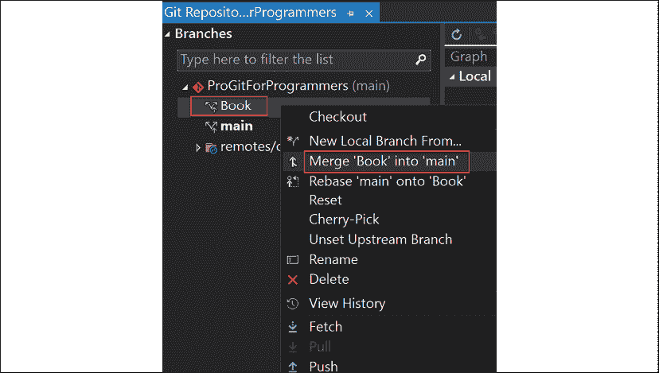
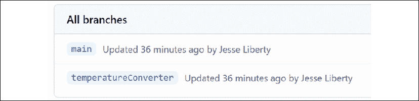
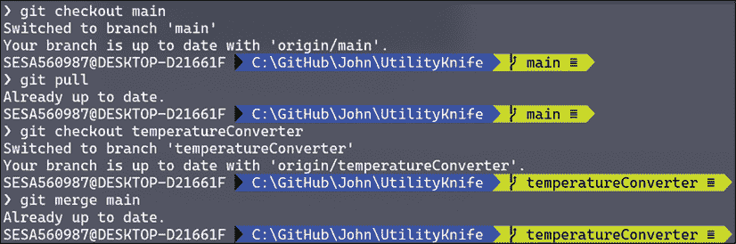

# 4

# 合并、拉取请求和处理合并冲突

在本章中，你将看到如何使用不同类型的合并来合并分支。你还将看到如何处理合并冲突，以及一些工具来简化冲突管理。你将了解拉取请求以及快进合并与“真正”合并之间的区别。

在本章中，你将学习：

+   如何将提交推送到服务器

+   如何通过命令行、Visual Studio 和 GitHub Desktop 管理提交

+   如何合并到主分支

+   什么是拉取请求

+   什么是合并冲突，如何解决它们

+   什么是快进合并

+   什么是“真正的”合并

让我们从合并的概述开始。

# 合并概述

如果你处于一个功能分支，且该功能已经完成并经过充分测试，你可能希望将该分支合并回主分支。有些组织允许你直接合并，而其他组织（大多数？）要求你创建一个**拉取请求（PR）**。**PR**基本上是说：“请检查我的代码，如果你认为它是正确的，请将其合并到主分支。”

在合并之前让其他人审查你的代码，可以避免日后出现很多麻烦（参见*第十二章*，*修复错误（撤销）*，了解如何修复错误）。

通常，如果你足够小心（见下文），你将顺利合并而不会出现问题。然而，偶尔你会遇到令人头疼的合并冲突。你将在下面看到几种处理冲突的方法。

## 书籍

你会记得在前一章中，我们有一个目录`C:\GitHub\VisualStudio\ProGitForProgrammers`，这是《书籍》应用程序的根目录，我们一直在 Visual Studio 中编辑。当然，我们不必仅仅在 Visual Studio 中管理它；我们可以使用任何工具。例如，我可以打开终端并将目录切换到《书籍》应用程序：


图 4.1：打开终端

注意，它显示我有一个提交待推送（由向上箭头和 1 表示）。我一定是上次工作时忘记了提交。然而，我不想直接推送——谁知道里面有什么？有几种方法可以找出。

# 推送里有什么？

从命令行，我们可以使用`git show`命令：


图 4.2：查看推送内容

这里有很多信息。首先，我们看到作者和日期。接下来是附加到此提交的消息（`添加属性`）。然后，Git 对`Book.cs`与`Book.cs`之间做了`diff`（差异）比较，前者被命名为**a**，后者为**b**。标记为**a**的是此提交之前的`Book.cs`，标记为**b**的是此提交中的新内容。

你可能已经注意到那一行显示`/dev/null`。这表示一个文件正在与空值进行比较，因此所有内容都是新的。

下一行显示`/dev/null`与文件**b**（新的`Book.cs`文件）进行比较：


图 4.3：与`dev/null`进行比较

接下来是更改内容。删除部分将以红色标出，修改部分以绿色显示，新增代码则以黄色显示。（此显示方式和颜色可能取决于你使用的终端。）我们看到，这次提交中添加了三个`using`语句、一个命名空间以及类`Book`。在我们推送之前，让我们看看在 Visual Studio 中能学到什么。

## Visual Studio

在 Visual Studio 中打开相同的目录并进入 Git 视图，正如我们预期的那样，显示了一个待推送的提交（外发）：


图 4.4：Visual Studio 显示待推送的一个文件

在我们推送之前，让我们看看这次推送中包含了什么内容。点击**1 outgoing**会打开两个窗口。**Branches**窗口显示了我们所在的分支（**Book**）：


图 4.5：Visual Studio 显示本地仓库的内容

中间面板展示了非常酷的信息。它告诉你分支的本地历史（与远程分支相对）：


图 4.6：Visual Studio 显示提交历史

我们可以看到**main**有五个提交（从最新到最旧），在**main**的最新提交之前，我们有一个来自**Book**分支的外发提交，其提交信息是**Add properties**。这与我们在命令行中看到的情况一致。

我们可以进一步操作，返回到**Solution Explorer**。因为在`Program.cs`（而非`Book.cs`）中还有更多内容可以查看，所以右键点击`Program.cs`，选择**Git**，然后选择**History**。这将打开`Program.cs`的**History**页面：


图 4.7：Visual Studio 显示 Program.cs 的历史记录

请注意，如果我们注册了带有图片的用户，那张图片会显示在最左侧。

这里我们可以看到四个提交。我们可以通过右键点击其中一个，比如第一个，选择**Compare with previous**来进行比较。两个窗口将会打开。左侧是较旧的提交，右侧是较新的提交。我们可以看到，在较新的提交中添加了一行内容，Visual Studio 用绿色高亮显示：


图 4.8：并排比较

你可以看到，Visual Studio 可以为你提供一个图形化的展示，展示你从命令行中可能获得的相同信息。

## 细节，细节

让我们关闭所有这些历史窗口，返回到外发和本地历史记录的列表。在**Outgoing**下，我们看到**Add properties**。右键点击该行，一个窗口将会在右侧打开。你将看到提交 ID（ID）、提交者的名字、日期等信息。你还会看到提交信息，接着看到被更改的文件列表（在这个案例中是**Book.cs**）：


图 4.9：Visual Studio 显示提交修改的文件

我们想了解`Book.cs`文件中发生了什么变化。为此，右键点击`Book.cs`并选择**查看历史记录**。中间窗口会显示出唯一的提交。双击该提交，你将看到这个提交中添加的`Book`类。

# GitHub Desktop

我们可以打开 GitHub Desktop 并定位到相同的目录。点击**文件**并选择**添加本地仓库...**：


图 4.10：打开 GitHub Desktop

下一步是告诉 GitHub Desktop 该仓库的位置。会弹出一个对话框，你可以手动输入本地路径，或者点击**选择...**，这将打开一个 Windows 资源管理器窗口，允许你选择合适的目录。设置完成后，点击**添加仓库**：


图 4.11：添加本地仓库

现在你将被带到主页面。注意，我们仍然在**ProGitForProgrammers**仓库中，但处于**Book**分支，并且系统知道我们有一个提交需要推送。它还提供了一个方便的**推送到 origin**按钮，点击这个按钮将把提交推送到 origin（即服务器；你在 GitHub 上的仓库）：


图 4.12：GitHub Desktop 信息条

再次强调，我们想知道自己正在推送的内容。没问题，只需点击**历史记录**，你将看到提交历史和每个提交的更改内容：


图 4.13：GitHub Desktop 中的历史记录

现在我们已经看过了命令行、Visual Studio 和 GitHub Desktop 如何管理提交，是时候将提交推送到服务器了。

## 现在就推送它吧

让我们回到命令行并推送我们正在查看的提交：


图 4.14：从命令行推送

如果你此时去查看 Visual Studio，它应该显示**0 个待推送**，因为你已经推送了之前等待的提交。同样，GitHub Desktop 的按钮也会从**推送到 Origin**变为**创建 Pull Request**—接下来很可能需要执行的操作。

现在我们已经处理好了`Book`分支，终于可以将它合并到**main**分支了。

## Visual Studio

我们的目标是将`Book`分支合并回`main`分支。要在 Visual Studio 中完成这项操作，只需点击**Git**，然后点击**管理分支**。你的**分支**窗口将会打开。右键点击**main**并选择**检出**。现在你已经准备好将`Book`合并到`main`，这个选项也会出现在右键（上下文）菜单中：



图 4.15：在 Visual Studio 中合并

诀窍是，在切换到`main`分支时，右键点击**Book**，你会看到一个合并选项。

# 合并冲突

让我们转向命令行，执行拉取操作，因为我们的分支已经与原始分支分开。当我们这样做时，Git 告诉我们 `Program.cs` 中存在合并冲突，并且合并失败了。Git 告诉您解决冲突，然后提交结果。虽然在拉取时出现合并冲突是不寻常的，但如您所见，确实会发生。让我们处理这个冲突，然后设置一个更典型的情况：


图 4.16: 合并冲突

有几种处理合并的方法，但最简单的方法是使用合并工具。我使用的是 KDiff3 ([`sourceforge.net/projects/kdiff3/`](https://sourceforge.net/projects/kdiff3/))。由于我经常使用它，我已经将其放入了我的配置文件中：

```
git config --edit --global 
```


图 4.17: 查看配置文件

这将 KDiff3 设置为我的合并工具，并告诉 Git 在哪里找到它。我最喜欢 KDiff 的一件事情是它通常会为您修复问题。

要调用它，我只需要写：

```
git mergetool 
```

并且它打开了冲突的 KDiff。

在这里它发现了两个问题，并且能够修复了一个：


图 4.18: KDiff 自动解决一个冲突

然后它会带我们进入一个带有多个窗格的窗口。顶部的窗格显示了冲突的内容：


图 4.19: KDiff 中显示的冲突

您可以看到左侧 **（本地）** 我们有一行，而右侧 **（远程）** 我们有两行。显然，其他人已经编辑了这个我们也编辑的文件，现在 Git 不知道该怎么办了。

底部窗格显示了提供上下文的代码，然后显示了您选择放置哪一行的高亮显示行：


图 4.20: KDiff 提供了合并的上下文信息

当您右键单击该行时，您会看到可以选择左窗口（窗口 A）、右窗口（窗口 B）或两者（并且您可以选择它们添加的顺序）的选项：


图 4.21: KDiff 询问应放置哪个版本

完成后，保存文件并关闭 KDiff。 <poof\> 冲突解决了。现在 Git 显示您所做的更改，这些更改现在应该提交了：


图 4.22: 控制台指示冲突已解决

现在您可以添加该文件并提交，然后将其推送到原始库：


图 4.23: 提交并推送到原始库

我们已经看到 KDiff 和类似程序在解决合并冲突时可以大大减少工作量。

## 从命令行合并

当您特定地在本地合并时，出现合并冲突的情况更为常见。要这样做很简单。从命令行中，切换到您想要合并到的分支 **（主分支）** 然后使用 Git 命令 `merge`：


图 4.24: 合并命令

在这里 Git 使用了 "递归" 策略；一种加快合并速度的方法。

## 快进

然而，你通常会看到 Git 报告它使用了快速前进合并。快速前进的工作方式如下：假设你的起始点是这样的：


图 4.25：快速前进

现在你想要将**Feature1**合并到**Main**。请注意，**Feature1**是从**Main**的末端（最新的提交）分支出来的。在这种情况下，从**Main**的第一个提交到**Feature1**的最后一个提交之间有一条路径。在这种情况下，Git 只需要将**Main**的指针移动到**Feature1**的末端，创建一个单一的分支（它将称之为**Main**）：


图 4.26：移动指针

因为所需要的只是将指针移动到最后一个提交，所以这叫做**快速前进**。

## 真正的合并

在之前的示例中，**Feature1**是从**Main**的末端分支出来的，这个末端仍然是**Main**的最新提交。但如果其他人已经将某个分支合并进了**Main**，而你分支出来的那个提交不再是末端提交呢：


图 4.27：**Feature1**没有从**Main**的末端分支出来

在这种情况下，你需要进行重基（将在下一章讲解）或“真正的”合并：


图 4.28：需要进行真正的合并

因为从**Main**到**Feature1**的末端没有任何一条路径能够不遗漏其他提交（例如，**Main**的末端），所以我们使用了一个新的提交将两个分支合并在一起。

请注意，这种方法会添加一个新的提交（**A**），这个提交仅用于合并。随着时间的推移，你会看到很多相对没有意义的提交使历史记录变得杂乱无章。解决这个问题的方法是重基，如下一章所示。

在进行快速前进或真正的合并时，你不会做任何改变；你合并，Git 会处理细节

# 避免冲突

避免冲突通常是一个好习惯，在 Git 中尤其如此。与其一次性解决大量冲突，你更希望在遇到冲突时及时处理（这样每次处理的冲突数量就会更少）。如果你在一个团队中，有些冲突是不可避免的，但有两个很好的经验法则可以大大减少解决冲突时的工作量：

+   尽量避免多个程序员同时在同一个文件上工作（如果可能的话）

+   经常将**Main**合并到你的特性分支中

注意 #2 并没有说将你的特性分支合并到**Main**，而是反过来。这不会危及主线程，但会迅速揭示出到目前为止是否有任何冲突。如果有，你可以在你的分支中解决它们，然后继续前进。

# 总结

在本章中，你学习了：

+   如何合并分支

+   不同类型的合并

+   如何解决合并冲突

+   像 KDiff 这样的工具如何让合并变得更容易

+   什么是拉取请求

+   什么是快速前进合并

+   什么是真正的合并

# 挑战

假装你们是两个程序员在开发同一个项目——一个包含计算器和华氏转摄氏温度转换器的工具。如果你们实际上有两个人来做这个任务，那就更好了。

设置一个新的仓库并将其克隆到两个不同的文件夹。让一个人将主分支填充上 UtilityKnife 项目的初步内容，提交更改并推送。让另一个人拉取主分支的更改。

好了，你们两个现在都有一个主分支并且上面有一些代码。接下来，让每个程序员创建自己的分支，一个用来开发计算器，另一个用来开发转换器。在此过程中，转换器需要使用计算器的一些方法。尽量避免或减少冲突，频繁合并，并解决出现的冲突。

# 答案

像往常一样，没有唯一正确的方法来完成这个任务。以下是我处理这个问题的方式。

## 任务 #1：设置一个新的仓库并将其克隆到两个不同的文件夹

注意，我们只使用一个仓库。我们在构建一个单一的程序，但至少在开始时，John 将创建计算器，而 Sara 将创建温度转换器。我们将整个程序称为**UtilityKnife**。首先，我们访问[GitHub.com](http://GitHub.com)并创建我们的新仓库：


图 4.29：创建新仓库

读取文档文件是使用 Markdown 编写的。你可以在[`www.markdownguide.org/cheat-sheet/`](https://www.markdownguide.org/cheat-sheet/)等网络资源中了解更多关于 Markdown 的内容。

然后我们将仓库克隆到文件夹中（如果有两人或更多人，可以克隆到不同的计算机）。我会创建一个名为`John`的目录，并将这个仓库克隆到该目录下。


图 4.30：从命令行克隆

John 选择使用命令行，而 Sara 则喜欢使用 Visual Studio。

首先点击**文件**，然后选择**克隆仓库...**：


图 4.31：打开 Git 菜单

这将弹出一个对话框，在其中你可以粘贴从[GitHub.com](http://GitHub.com)获取的路径和你新仓库的路径：


图 4.32：从 Visual Studio 克隆

点击**克隆**按钮，Visual Studio 会设置你克隆的仓库。

解决方案资源管理器验证你已克隆仓库并从 GitHub 拉取了三个文件：


图 4.33：解决方案资源管理器显示克隆结果

## 任务 #2：让一个人将主分支填充上 UtilityKnife 的初步内容，提交更改并推送

我们让 Sara 在她的目录下为 UtilityKnife 程序创建一个新的解决方案：


图 4.34：创建程序

当项目完成时，她将调整`Program.cs`，以便为接下来的所有内容搭建框架：

```
namespace UtilityKnife
{
    public static class Program
    {
        static void Main(string[] args)
        {
            // skeleton program
        }
    }
} 
```

完成这一步后，她将通过**Git**菜单提交这些更改：


图 4.35：Visual Studio 中的 Git 菜单

这将打开提交窗口，您可以填写提交信息，然后点击**提交所有**：


图 4.36：Visual Studio 中的 Git 更改菜单

一旦操作完成，视图将更改，移除文件和提交信息，并确认提交，同时显示有一个提交准备好推送：


图 4.37：在 Visual Studio 中的提交确认

这正是我们想要的，所以点击上传按钮（向上的箭头）并将提交推送到 GitHub 上的仓库。

它验证了您的成功并提供了为您创建 Pull Request 的选项，但我们现在不需要这个：


图 4.38：提交后，Visual Studio 显示有一个文件需要推送

Sara 现在有了起始主分支，准备创建一个功能分支。在我们查看之前，让我们先让 John 也拉取主分支：


图 4.39：从源拉取仓库

这是一个稍微复杂的截图。我们首先看到在 `C:\GitHub\John` 中有一个名为 `UtilityKnife` 的文件夹。我们切换到该目录，然后执行 `git pull`。结果是获取了 `UtilityKnife` 程序的文件。

现在，John 和 Sara 拥有相同的 UtilityKnife 起始程序。

## 任务 #3：每个程序员创建一个功能分支。然后，每个程序员将他们功能的开始部分放入他们的分支，频繁地提交（比在“真实生活”中更频繁）

使用命令行的 John 通过使用 `checkout -b` 命令开始他的功能分支，这个命令既创建了一个新分支并切换到该分支：


图 4.40：在命令行创建新分支

他现在准备开始编码了。让我们创建一个文件夹，然后在其中创建我们的类框架和它的第一个方法：

```
namespace UtilityKnife.Converters
{
    public class FahrenheitToCelsius
    {
        public double FahrenheitToCelsiusConverter(double FahrenheitTemp)
        {
            double _fahreneithTemp = 0.0;
            double _celsius = 0.0;
            return _celsius;
        }
    }
} 
```

让我们保存并提交这个：


图 4.41：从命令行提交

我们首先查看状态，显示我们有一个未追踪的文件。我们将该文件添加进去（记住，`add .`意味着将所有未追踪和修改过的文件添加到暂存区），然后我们提交它，并添加一条信息。哎呀，提交信息拼写错了。让我们用新命令 `amend` 修正它。由于我们还没有推送，所需要做的就是输入 `--amend`，并使用 `-m` 添加修正后的信息：


图 4.42：使用 amend 标志

请注意，第二行反映了更改，如果我们使用`log`查看提交记录，我们将看到提交现在已正确拼写：


图 4.43：使用 log 查看提交记录

John 决定将他在本地仓库的提交推送到源（GitHub 仓库）。然而，当他尝试时，Git 告诉他服务器不知道他的分支，但它很友好地给出了正确的命令：


图 4.44：尝试推送失败，Git 帮助

与此同时，Sara 已经开始了`Calculator`类的工作。

### Sara 和 Calculator

在 Visual Studio 中，她点击**Git**菜单选项，然后选择**新建分支**。会弹出一个对话框，注意它假设你要从**main**分支上创建新分支（当然，如果你有多个分支，也可以从任何一个分支上派生）：


图 4.45：创建新分支

她现在准备开始编码了，不管她写什么，都不会影响 John 的代码（或者主分支上的代码）。你可以确认，她甚至看不到 John 的工作。他们在不同的（因此是隔离的）功能分支上。

她将会在自己的文件夹中添加一个`Calculator`类的框架。

```
namespace UtilityKnife.Calculator
{
    public class Calculator
    {
        public static int Add (int x, int y)
        {
            return x + y;
        }
    }
} 
```

Sara 现在准备提交这个更改，但与 John 不同，她不会将它推送到服务器。因此，这个更改仅保存在她的本地仓库中。

选择**Git** | **提交**（**Commit**）或**暂存**（**Stash**）后，她输入消息并点击**提交所有**（**Commit All**）：


图 4.46：提交所有

如上所述，这将她的提交放入本地仓库。

## 任务#4：经常将主分支合并到功能分支中，确保如果有冲突，能尽早发现

John 想将主分支合并到他的分支中，以确保他能尽早发现问题。为此，他切换到主分支，执行`pull`操作更新内容，然后切换回他的功能分支并输入`merge main`：


图 4.47：主分支已经是最新的

这里没有问题。自从我们从主分支派生以来，主分支没有变化，所以`temperatureConverter`分支完全是最新的。

现在，假设 John 决定将他的功能分支合并到主分支。无论这是否明智，他只需要反转合并的顺序：


图 4.48：反转合并顺序

关键的一行是：

```
git merge temperatureConverter 
```

我们当前在主分支上，这将功能分支合并到主分支。你可以看到，Git 能够快速前进合并（fast-forward merge），如前面章节中所描述的。

现在 John 可以继续他的现有功能分支，或者创建一个新分支。另一方面，如果他必须先做一个拉取请求（Pull Request），然后等待他的 PR 被批准才能真正合并，他最好新建一个分支，可能是从`temperatureConverter`分支派生的。

Sara 已经休息过了，但她准备回去工作。为了小心起见，她首先要将主分支合并到她的功能分支中，以确保没有冲突。记住，John 和 Sara 可能合作得很好，但他们并不会每次提交或合并时都互相通知。

首先，Sara 检出了主分支并执行`pull`操作，以获取主分支上的最新文件。然后她检出了**Calculator**，并右键点击**main**：


图 4.49：在 Visual Studio 中将主分支合并到 Calculator 中

她将选择**将‘main’合并到‘Calculator’**。再一次，执行此操作并*不会*将她的更改合并到主分支，而只是获取主分支的最新版本，并将其合并到她的功能分支中。

由于 Visual Studio 会小心谨慎，它会询问你是否确定。


图 4.50：Visual Studio 检查你即将执行的操作是否符合你的意图

点击 **Yes** 将开始合并。现在，请记住 John 做了一些工作，然后将他的分支合并到 main 中。由于没有冲突，Visual Studio 只会告诉 Sara 合并成功：


图 4.51：Visual Studio 表示成功

当然，将 main 合并到 Calculator 中会改变 Calculator，带入 main 中的所有内容。main 中的关键内容是 John 合并的部分，现在我们在 Calculator 中看到了这些：


图 4.52：在 Visual Studio 中检查合并的结果

请注意，由于 Sara 还没有将她的代码合并到 main 分支，John 对 `Calculator` 类一无所知，也无法访问它。如果我们在 John 的分支中打开 Visual Studio，我们会看到 **Converters**，但没有 **Calculator**：


图 4.53：John 的分支没有 Calculator

让我们暂停片刻，思考一下 GitHub 上发生了什么。Sara 已经提交了她的更改，但还没有推送，因此 GitHub 并不知道她的分支。John 已经推送了他的更改，并将其合并到 main 分支。我们预计 GitHub 上会有两个分支，一个是 main，另一个是 John；更重要的是，此时 main 和 John 应该是相同的，而 Sara 应该在 GitHub 上有一个分支：


图 4.54：origin 上的分支

main 分支有 **Converters**（来自 John 的合并），但没有 Calculator（因为 Sara 还没有合并）。John 的分支（**temperatureConverter**）是相同的：


图 4.55：在 origin 上切换分支

为了更清楚地说明这一点，我们可以请求 GitHub 列出它知道的所有分支：



图 4.56：请求 GitHub 列出所有分支

这些都显示为“由我更新”，因为 Sara 和 John 实际上并不存在。

## 任务 #5：John 正在构建温度转换器。让他“借用”计算器的代码，看看是否会出现合并冲突

在接下来的四次提交中，Sara 将计算器扩展了减法、乘法、整数除法和除法功能。她还没有推送她的更改：


图 4.57：完善计算器

将华氏度转换为摄氏度的公式是：

*(F – 32) * 5/9*

John 想要转换 212° 华氏度（水的沸点），并期望得到 100° 摄氏度作为一个好的测试用例。为此，他本可以使用内置的减法和除法运算符，但他选择使用 Sara 的计算器。他的第一次尝试是将 main 合并到他的分支中：



图 4.58：将 main 合并到工作分支

主分支是最新的，`temperatureConverter`与主分支没有差异。然而，约翰没有他需要的功能。这告诉约翰，他所需的计算器功能还没有推送到 GitHub。他可以给萨拉打电话，请她将这些功能推送上去，以便他可以拉取，或者她可以将这些功能合并到主分支，然后他可以从主分支更新。萨拉还没准备好将功能合并到主分支，但同意推送她分支的提交。

她有四个未推送的提交（即还未推送到远程仓库的提交）：


图 4.59：Visual Studio 显示有四个未推送的提交

要推送这些更改，她只需点击向上的箭头：


图 4.60：Visual Studio 中的推送按钮

约翰尝试拉取更改，但碰到了障碍。


图 4.61：无法查看计算器

他的本地仓库从未听说过**Calculator**分支。解决这个问题有几种方法，但最简单的方式是让萨拉将她的工作合并到**main**分支：


图 4.62：将 Calculator 合并到 main 分支

当萨拉将 Calculator 合并到 main 分支时，她是*在本地*进行的。她仍然需要将这些更改推送到远程仓库，这样才能对约翰有用。她像提交任何其他提交一样推送它们。

约翰现在准备`pull`这些更改。一旦他执行了操作，他意识到萨拉使用了整数，而他需要的是浮点数。他修改了`Calculator`类，改用浮点数，同时他还将所有方法（以及类）设为静态。（如果你不熟悉 C#，不用担心这意味着什么；重要的是他已经做出了更改）

```
namespace UtilityKnife.Calculator
{
    public static class Calculator
    {
        public static double Add(double x, double y)
        {
            return x + y;
        }
        public static double Subtract(double x, double y)
        {
            return x - y;
        }
        public static double Multiply(double x, double y)
        {
            return x * y;
        }
        public static int Division (int x, int y)
        {
            return x / y;
        }
        public static double Division (double x, double y)
        {
            return x / y;
        }
    }
} 
```


图 4.63：拉取分支的更改

第二行表示，我们开始时主分支与`origin/main`同步。然而，当我们执行`pull`时，本地 Git 发现有对象需要拉取到主分支。共有 22 个对象。为什么是 22 个，而不是仅仅 4 个提交？这些对象中的一部分是 Git 内部使用的。

后来我们看到合并是快速前进（fast-forward）的，接下来的行显示有 29 个添加项，且没有修改或删除（如果你数一下+标记，你会发现是 29 个）。随后确认有 1 个文件发生了变化，并且插入了 29 行。

约翰快完成了。他的本地 main 分支现在有了他需要的内容，但它在错误的分支上。解决方案是将 main 分支合并到`temperatureConverter`分支。

因为合并的分支顺序很重要，我总是去 Stack Overflow 查找相关信息：


图 4.64：Stack Overflow 建议

这是约翰需要采取的步骤：


图 4.65：合并

最后两行表示`Calculator`已经通过合并带了过来，`temperatureConverter`有两个提交要推送到其仓库。

快速查看日志显示，`HEAD`、`origin/temperatureConverter`、`origin/main`、`origin/HEAD` 和 `origin/Calculator` 都指向与 main 相同的提交！因此，John 的分支现在可以访问 `Calculator` 类：


图 4.66：访问计算器

他现在可以返回到他的程序中，使用这些静态方法：

```
namespace UtilityKnife.Converters
{
    public class FahrenheitToCelsius
    {
        public double FahrenheitToCelsiusConverter(double fahrenheitTemp)
        {
            double _celsius = 0.0;
            // (F – 32) * 5/9
            var step1 = Calculator.Calculator.Subtract(fahrenheitTemp, 32);
            var step2 = Calculator.Calculator.Multiplication(step1, 5.0);
            _celsius = Calculator.Calculator.Division(step2, 9.0);
            return _celsius;
        }
    }
} 
```

我同意这看起来非常丑陋，但它有效，且更重要的是，它展示了 John 的 `temperatureConverter` 可以使用 `Calculator` 中的代码。而且，John 还可以编辑 `Calculator`。我们将看看在所有这些合并之后会发生什么。

在 John 和 Sara 之间来回跳跃时，我在 Sara 的文件夹中完成了工作。不过没关系。我们只需要让 Sara 提交这些更改。糟糕，修改是在 main 上进行的。我们来整理一下这一切。首先，在 Sara 的机器上，我们将 main 合并到 `Calculator`：


图 4.67：在 Visual Studio 中将 main 合并到 Calculator

这与之前的合并类似，只不过现在 `Calculator` 是被选中的分支，我们右键点击 main，选择 **将 'main' 合并到 'Calculator'** 选项。现在，为了确保一切正常，我们将 `Calculator` 合并回 main。

此时，Sara 的 `main` 和 `Calculator` 分支是相同的，但 John 仍然没有获得所需的内容。Sara 现在可以通过简单的 push 将 main 推送到 origin。

John 现在可以检索 main，这应该包含他需要的更改：


图 4.68：获取带有更改的 main

很好，main 拥有 John 需要的内容，但他需要将其放到自己的分支中。没问题，我们将把 main 合并到 `temperatureConverter`：


图 4.69：将 main 合并到 temperatureConverter

让我们看看 John 的华氏转换器，看看它现在是否已经是最新的。

```
namespace UtilityKnife.Converters
{
    public class FahrenheitToCelsius
    {
        public double FahrenheitToCelsiusConverter(double fahrenheitTemp)
        {
            double _celsius = 0.0;
            // (F – 32) * 5/9
            var step1 = Calculator.Calculator.Subtract(fahrenheitTemp, 32);
            var step2 = Calculator.Calculator.Multiplication(step1, 5.0);
            _celsius = Calculator.Calculator.Division(step2, 9.0);
            return _celsius;
        }
    }
} 
```

我们可以通过将方法输入 212 并希望返回 100 来测试是否成功。让我们查看一下程序：

```
using System;
using UtilityKnife.Converters;
namespace UtilityKnife
{
    public static class Program
    {
        static void Main(string[] args)
        {
            var converter = new FahrenheitToCelsius();
            var celsius = converter.FahrenheitToCelsiusConverter(212.0);
            Console.WriteLine($"Fahrenheit temp of 212 is {celsius}.");
        }
    }
} 
```

让我们运行我们的程序：


图 4.70：测试程序

我们已经完成了挑战并管理了所有分支。更重要的是，程序可以正常运行！
