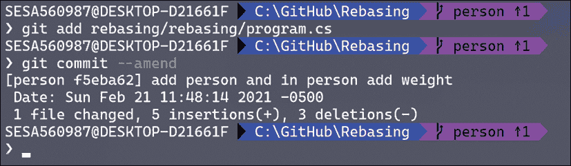
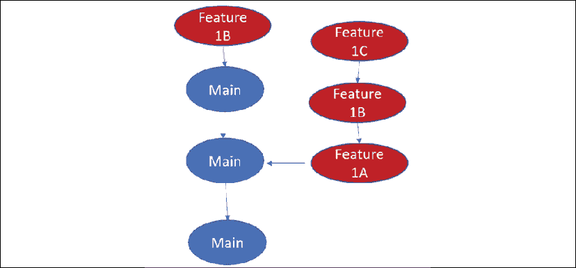
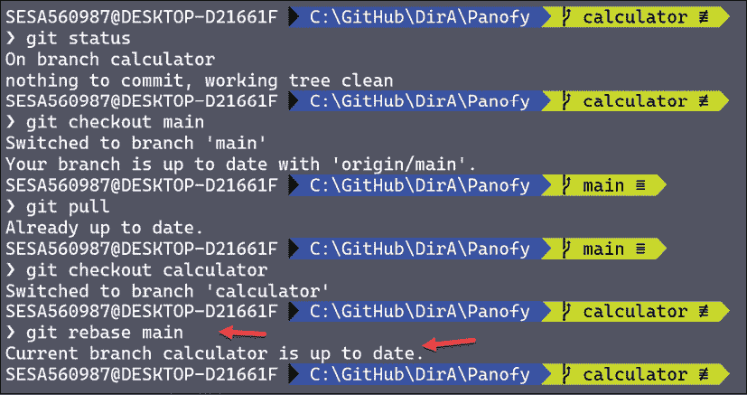

# 第五章：重新基准、修改和樱桃挑选

如果你对大多数初学 Git 的程序员说“重新基准”，他们会立刻泪流满面并尖叫着跑出房间。但事实是，这只是因为在许多书籍和杂志中，重新基准的解释通常非常复杂而且令人困惑，图示中显示了提交被复制并随着密集的技术性文字移动。

事实上，重新基准并不难理解，如果你明白它的用途，它也不难操作。在本章中，我们将无所畏惧地回顾重新基准。

**重新基准**是一个命令，它允许你将一个特性分支放置到另一个分支的顶部。我们将讨论如何做，*更重要的是*，为什么要这么做。

**修改**是一个快速命令，它允许你修改最近的提交。你可以用它来添加你忘记包含的文件或修正一个写错的提交信息。

**樱桃挑选**是将一个或多个提交从一个分支提取并应用到另一个分支的顶部的能力。

Git 程序员将这三个命令描述为**重写历史**，这也是它们的共同点。每个命令都可以改变提交如何添加到版本库，从而清理你的提交列表。

# 重新基准

重新基准无非就是将一个分支添加到另一个分支的顶部，其中顶部只是该分支的最后一个提交。例如，假设你有以下结构：


图 5.1: Git 结构

你在这里无法进行快进操作，因为自从你从**Main**分支出来后，**Main**已经有了新的进展。你可以做一个真正的合并，但每次进行真正的合并时，它都会在历史记录中增加一个提交：


图 5.2: 真正的合并

重新基准解决了相同的问题，但不会在提交历史中添加合并记录。

请注意，在查看这个历史记录时，你必须跳过许多提交，因为它们只是合并。重新基准可以去除大部分这样的提交。

这里是关键部分：

+   你将分支**Feature1** *合并到* **Main**，但是你将**Feature1** *重新基准到* **Main**。

+   回到我们之前的例子，如果你将**Feature1**重新基准到**Main**，它看起来是这样的：

图 5.3: 重新基准后的状态

+   现在从**Main**的第一次提交到**Feature1**的最后一次提交之间，路径已经清晰可见，且没有遗漏任何内容。它通常是这样画的：

图 5.4: 重新基准后查看提交的另一种方式

+   这强调了你已经将**Feature1**重新基准到了**Main**的顶部（顶部是**Main**的最新提交）。

就这点，重新基准就这么简单。说真的。

## Git 是如何做到的

通常，我不会花时间去思考 Git 是如何执行操作的，但在这里值得注意的是，要进行 Rebase，Git 会回滚历史记录到第一个 **Feature1** 提交，然后创建一个副本并将其添加到 **Main** 的顶部。接着，它会复制第二个 **Feature1** 提交，并将其放到最新提交的顶部，依此类推。

之所以这样做很重要，是因为会创建一个副本，因此会有一个不同的 ID。好了，现在你可以忘记这一切，把 Rebase 当作它本来的魔力来看待。

## 理解它

如你所见，Rebase 并不难。但真正理解发生了什么以及为什么它是可以接受的，可能需要从五分钟到五年的时间。我们将我们的功能分支放到了主分支之上。记住，我们的功能分支最初是从主分支派生出来的。

现在我们将主分支中的所有内容并入我们的功能分支。

这是关键部分。因为我们是在本地进行操作，所以我们只是说：“无论主分支进展到什么程度，我最终都需要将其合并进来。现在，我将进行 Rebase 到主分支，使其成为一个长分支，并确保没有冲突。”

## 早点 Rebase，频繁 Rebase

经常进行 Rebase 是一个非常好的实践，可以及时发现可能出现的冲突。每次进行 Rebase 时，你会得到一个包含所有之前提交的堆栈，然后是你新提交的内容。如果你刚刚添加的内容和之前的内容之间出现冲突，你将立刻看到并可以立即修复它。

## 仅在本地进行 Rebase

你*只*在本地计算机上进行 Rebase，*绝不*在云中的共享仓库（例如 GitHub）上进行 Rebase。这是因为 Rebase 会“重写历史”——记住，它会复制 Feature1——如果其他程序员正在处理这个分支，当你进行 Rebase 时，他们会对你不满意。这种“不满意”可能会导致刑事指控。

## 实践中的 Rebase

让我们创建一个新的仓库，命名为 Rebasing。我们将观察 Adam 创建一个名为 `Person` 的分支，他将采取以下步骤：

1.  进入主根目录

1.  创建一个名为 `Person` 的分支

1.  打开 Visual Studio 并创建一个名为 `Person` 的项目

1.  创建一个名为 `Person` 的新类

1.  将 `Rebasing` 仓库添加到你的本地仓库

1.  添加仓库并提交（这也会提交 `Person`）

1.  向 `Person` 添加年龄属性并提交（但不要推送）：

    ```
    namespace Rebasing
    {
        public class Person
        {
            public double Age {get; set;}
        }
    } 
    ```

1.  添加一个名称属性并提交，但不要推送

在我们添加一个高度属性后，我们就处于这种情况：


图 5.5：在 Visual Studio 中的提交历史

我们现在可以推送了，但 `Person` 类上还有更多工作要做。另一方面，我们不希望主分支已发生太大变化，以至于在完成 `Person` 类后会有太多冲突。答案是：Rebase。确保你处于 `Person` 分支，然后右击主分支并选择 **将 'person' Rebase 到 'main'**：


图 5.6：在 Visual Studio 中进行 Rebase

完成这个之后，我们可以继续在 `Person` 分支上工作。

注意，您只有四个待推送的提交：


图 5.7：Rebase 不会添加提交

这次 rebase 没有添加提交，并保持了您的历史记录的整洁。

## 看到 rebase 在实际操作中的效果

为了确认您的 rebase 确实回滚了提交历史，并将每个提交重新添加到主分支上，请转到命令行并执行命令 `git log --name-only --oneline`：


图 5.8：Rebase 回滚历史

从上到下我们看到的是，首先添加了最后一个属性（height），然后我们对 `Person.cs` 进行 rebase，添加了 name 属性。接着，我们进行 rebase 并添加了 age 属性。我们一直这样做，直到所有文件都被 rebase 到主分支的最新版本。

## 冲突

在 rebase 时我们可能会遇到冲突。您还记得我们有一个分支：`Person`。假设第二个程序员克隆了这个仓库。这个程序员在他们的分支（teacher）上高高兴兴地工作时，意识到他们需要将 person 的年龄修改为不同的值。他们向文件中添加了这一变化（好吧，没有人会这么傻，但这种情况在更微妙的情况下确实会发生）：


图 5.9：Rebase 导致了冲突

幸运的是，Git 会告诉您该怎么做。

记住，您可以随时输入 `git rebase --abort`，并返回到开始 rebase 前的状态。

不过，这次我们将手动修复问题。打开指向的文件 `Person.cs`：

```
namespace Rebasing
{
    public class Person
    {
<<<<<<< HEAD
        public double Age { get; set; } = 35;
=======
        public double Age { get; set; } = 30;
>>>>>>> cb76bd6 (set age to 30)
        public string Name { get; set; }
        public double Height { get; set; }
        public double Weight { get; set; }
<<<<<<< HEAD
=======
>>>>>>> cb76bd6 (set age to 30)
    }
} 
```

看起来像这样的部分：

```
<<<<<<< HEAD
        public double Age { get; set; } = 35;
======= 
```

是当前版本中的代码；接下来的一组代码：

```
>>>>>>> cb76bd6 (set age to 30)
        public string Name { get; set; }
        public double Height { get; set; }
        public double Weight { get; set; }
<<<<<<< HEAD 
```

这些提交来自要进行 rebase 的代码。

哎呀，真是一团糟。您可以手动修复此问题，进行调整后删除冲突标记，或者使用上一章中提到的工具。

为了修复这个问题，我们将在我们进行补丁 rebase 的分支上调整年龄；也就是说，35 岁是权威的年龄，因此我们要保留 35 这一行，并删除其他的。

无论如何，一旦您解决了冲突，返回到命令行并输入 `git rebase --continue`。这将恢复 rebase，并检查是否有其他冲突。如果没有，Git 会要求您输入一条消息，并完成 rebase：

```
> git rebase --continue
[detached HEAD 5843a73] Rebased, set age to 30
 1 file changed, 1 insertion(+)
Successfully rebased and updated refs/heads/person. 
```

处理 rebase 冲突的关键是不慌张，而是一个一个地解决它们。放心，如果您没有执行 rebase，等到完成功能分支后再尝试合并到主分支时，您会遇到这些问题，甚至更多。

# 修正

如果您提交了更改后才发现漏掉了一个文件或者搞乱了提交信息，您可以使用 `amend` 命令。然而，您只能修改最近的一次提交。

假设我们回到 person，并添加一个 weight 属性，然后提交它。在推送之前，我们意识到遗漏了对 `Program.cs` 的更改：

```
namespace Rebasing
{
    class Program
    {
        static void Main(string[] args)
        {
            var person = new Person();
            person.Name = "Jesse";
        }
    }
} 
```

由于错误发生在最近的提交中，我们可以修改该提交。我们只需要将 `Program.cs` 文件放入索引中，然后执行命令 `git commit --amend`。

由于 amend 会重写历史，**你只能在推送之前执行此操作**（也就是说，在提交仅存在于本地仓库时），原因与上面提到的一样：


图 5.10：修改（推送前！）

我们逐行分析。首先我们注意到有一个提交等待推送。那就是我们要修改的提交。

在第二行，我们将要修改的文件添加到索引中。

接下来，我们添加 amend 命令：`git commit --amend`。

Git 会响应并打开编辑器，让你修改提交消息（我们在这里看到的消息是：`add person and in person add weight`）。

最后，它会告诉你关于提交的所有常规信息。

然而请注意，你仍然只有一个提交等待推送。修改似乎并没有创建新的提交（实际上它创建了一个新提交，但你可以安全地忽略它）。

如果你使用没有文件名但带有消息标志的提交，只有该最近的提交消息会被修改。你甚至不需要标志；如果索引中没有新的、修改过的或删除的文件，它会自动打开编辑器供你修改：



图 5.11：这将导致打开你的编辑器

如果你现在查看历史记录并使用 log 命令，你会看到修改后的提交消息：


图 5.12：在编辑器中修改的消息

使用 amend 可以节省很多后续的工作，且为提交编写清晰的消息非常重要，以明确提交的目的。

# Cherry-picking

有时你只需要将一个分支中的一个或少量提交添加到另一个分支的顶端。一个常见的情况是：你有一个发布分支和一个功能分支。发布分支已经“冻结”，但你需要将功能分支中的一个提交添加到发布分支（可能是修复问题的补丁）。当你执行 cherry-pick 时，被挑选的提交会被添加到你所选的目标分支的顶端。

下面的示例会帮助你理解。我们从这里开始：


图 5.13：Cherry-pick 前

我们发现我们并不想把所有的**Feature1**合并到**Main**，但是我们确实需要**Feature1B**（它包含我们需要的修复或功能集）。要在命令行中执行此操作，你需要输入 `git cherry-pick a2cb5f3`，其中 `a2cb5f3` 是你想要 cherry-pick 的功能提交的 ID。

最终结果看起来是这样的：



图 5.14：Cherry-pick 后

请注意，**Feature1B** 现在已添加到主分支的顶端，但它仍然保留在功能分支中。

## Visual Studio 的 cherry-pick 操作

Visual Studio 对 cherry-pick 提供了极好的支持。只需切换到你想要的分支，然后打开历史记录。右键单击你想要的提交，选择 **Cherry-Pick**：


图 5.15：在 Visual Studio 中进行 cherry-pick

当你从开发分支分出，但在功能分支上创建了一个你后来意识到需要的东西时，挑选提交是至关重要的。

# 总结

在本章中，我们讨论了一些高级话题：

+   变基

+   修改

+   挑选提交

这三者的共同点是，它们都会重写历史。变基通过将一个分支的所有提交复制到另一个分支的末端来实现这一点。修改提交则允许您添加文件和/或更改提交的信息。最后，挑选提交的行为类似于变基，但只涉及一个或少数几个提交。

你看到许多这些操作在 Visual Studio 中更容易，但有些操作在命令行中做起来更加清晰。

最后，我们解释了为什么要合并*到*主分支，但你要*在*主分支上进行变基。

# 挑战

创建一个名为 Panofy 的新仓库，向其订阅者提供 MP3 音乐。将有三个分支：主分支（创建仓库时自动生成的分支）和两个功能分支。展示以下内容：

+   创建仓库

+   两个程序员创建功能分支

+   频繁地变基

+   修改提交以添加文件

+   修改提交以更改信息

+   将一个提交挑选到主分支

# 答复

再次提醒，有很多方法可以解决这个挑战。以下是我采取的方式。

## 在 GitHub 上创建新仓库

我们以前见过这个，因此我将快速操作。我将访问[GitHub.com](http://GitHub.com)，并填写常规表单，使此示例程序公开：


图 5.16：创建新仓库

一旦创建了仓库，您和其他任何想要基于它进行开发的人（且拥有适当权限）都可以将其克隆到本地。

## 创建两个虚拟程序员的功能分支

为此，我将创建两个目录并分别克隆到每个目录。我将第一个目录命名为`GitHub/DirA`，第二个命名为`GitHub/DirB`。然后我将分别克隆到每个目录：


图 5.17：将程序克隆到本地仓库

只有 Mateo 会在`DirA`中编程，而只有 Kim 会在`DirB`中编程。

在`DirA`和`DirB`中创建一个 C# 程序。完成后，使用`git status`确保它们都指向主分支。为了确认，您可以在`DirA`中做一个小修改，并确保它在`DirB`中反映出来。由于 Visual Studio 可能指向不同的目录，因此很容易混淆。您可以随时右键单击项目并选择**在文件资源管理器中打开文件夹**以进行双重检查。

我将采取的步骤，以确认两个目录具有相同的主分支如下：

1.  在分支 B 中，我将做一个修改并推送它

1.  在分支 A 中，我将拉取变更以更新本地仓库。

1.  最后，我将检查分支 A 中的 Visual Studio，以证明它与分支 B 完全相同：


图 5.18：克隆以确保两个仓库完全相同

为了跟踪我所查看的内容，我将 B 项目的名称更改为`PanofyB`。然后，我将其推送，并在 A 中拉取，以确保两个分支保持同步。

这种方法充满了风险，最重要的一点是容易覆盖其他开发者的工作，或者引发冲突。为了避免这种情况，我将为每个程序员创建一个分支。我将在 A 上创建一个名为 `Calculator` 的分支，在 B 上创建一个名为 `Converter` 的分支。

## 频繁的 rebase

现在我们有了两个分支，为了简单起见，我们将构建一个新的 UtilityKnife 版本，这次包含小功能和频繁合并。Mateo 会首先创建计算器的结构并提交，你将把它合并到主分支中（通常情况下不会这样做——你会先构建功能的几个方面，频繁提交，然后在完成时再合并，但我们需要一些演示代码）。

当我第一次向 `Calculator` 添加内容时，主分支是相同的，所以当我做 rebase 时，实际上什么都不会发生：



图 5.19：尽早进行 rebase，频繁进行 rebase

让我们在 `Calculator` 上做一点工作，然后准备推送。但在此之前，让我们先做一次 rebase，以防在其他线程上已经有了对主分支的工作并且推送了：


图 5.20：拉取更改，然后获取计算器，记得在主分支上做 rebase

没错！即使另一个线程（在这个例子中是 converter）被添加到主分支，我们仍然能够将计算器的代码 rebase 到它之上。我们现在知道至少在目前的开发阶段不会发生冲突。

## 修改提交以添加文件

让我们回到 `Calculator` 类。我们将添加一个使用双精度数的除法示例，提交并提交它：


图 5.21：使用 amend 将文件添加到最近的提交

在我们做出提交后，我们意识到我们还打算添加一个平方根方法：

```
public double SquareRoot(double x)
{
    return Math.Sqrt(x);
} 
```

我们宁愿不为了这个创建一个新的提交。我们要做的是修改最近的提交。我们通过 `--amend` 命令来实现。

为了做到这一点，我们将要添加的文件放入索引中，并执行 `git commit --amend` 命令：


图 5.22：修改提交以包括 Calculator.cs 中的更改

我们在上面显示的代码中采取以下步骤：

1.  输入 `git status`。注意我们有一个修改过的文件，因此使用 `git add` 将其添加到索引中。

1.  执行 `git commit --amend`，这会将新代码作为上一个提交的一部分提交。

1.  编辑器会打开；输入新的信息。注意，新消息现在已经显示出来（第二个箭头）。

这让我们能够将消息修改为更有意义的内容。在关于交互式 rebase 的章节中，你将看到另一种做法。

## 修改提交以更改消息

如果索引中没有任何新的内容，那么 `git commit --amend` 将只给你一个修改消息的机会：


图 5.23：使用 amend 修改最近提交的消息

我们执行`git status`来确保索引中没有任何内容。然后，我们像之前一样调用`git commit --amend`，但我们添加了一条信息（如果没有添加信息，编辑器会自动弹出）。由于索引中没有任何内容，Git 只是更改了提交信息。

## 将一个提交樱桃挑选到主分支

这里是主分支和计算器分支的日志：


图 5.24：樱桃挑选到主分支

我们不想将计算器的所有内容合并到主分支，但我们确实希望将乘法和除法的提交合并进来。

好吧，这有点傻，但为了一个实际的例子，假设主分支是你的发布分支，而计算器分支有一个重要的功能，你希望将它添加进去。

注意每个提交旁边的七位数字 ID。要将`972d77a`樱桃挑选到主分支，我们确保主分支是当前分支，然后执行樱桃挑选命令，指定我们要添加的提交的 ID：


图 5.25：执行樱桃挑选命令

你已将`972d77a`提交到主分支，主分支有一个提交待推送。在我们推送之前，让我们再看一下这些日志：


图 5.26：查看樱桃挑选后的日志

这里有三点需要注意：

1.  现在主分支包含了添加乘法和除法的提交

1.  乘法和除法并没有从计算器中移除

1.  这两个提交的 ID 不同，意味着它们是独立的提交，一个的操作不会影响另一个

这个示例答案符合创建两个功能分支的要求，分支来自一个新的仓库，并且“程序员们”会频繁地进行变基操作。我们还修改了一个信息（在本地），并使用樱桃挑选将一个提交复制到主分支。
