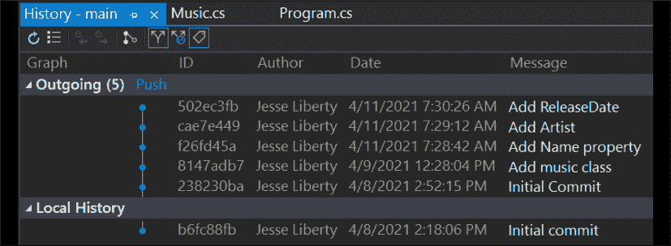

# 6

# 交互式变基

交互式变基是 Git 中一个非常有用的功能，但其名字可能会让人感到困惑。从用户的角度来看，变基和交互式变基几乎没有什么共同点。

交互式变基允许你清理提交，但只能在你推送到服务器之前进行。通过交互式变基，你可以：

+   “压缩”你的提交，以使提交历史更简洁，便于阅读

+   修改提交信息

+   Fixup，功能类似于 squash，不同的是它不会停止并要求你输入新的提交信息

+   Drop，用于移除一个提交

这里的关键是你正在修改提交，而不是提交中的文件。而且，正如我会一再强调的，你必须在推送提交到 origin 之前进行交互式变基。提交一旦推送到服务器，就不应再修改，因为其他开发人员可能正在与这些提交进行交互，修改可能会导致冲突，而冲突的修复非常耗时。关于合并冲突的处理，请参见*第四章*，《合并、拉取请求与处理合并冲突》。

# 交互式变基的工作示例

为了了解这一点的工作原理，我们需要做几个提交。让我们创建一个简单的程序，并为每一行代码创建一个提交。等我们完成后，就可以在命令行和 Visual Studio 中查看如何进行交互式变基。

**注意**：你通常不会这么频繁地提交，但我们需要一些提交来进行演示。

## 创建我们的示例

为了多样性，我们来创建一个音乐跟踪应用程序的框架。第一步是在 GitHub 上创建一个仓库：


图 6.1：创建仓库

创建仓库后，我们需要将其克隆到本地仓库。这次我们使用 Visual Studio，并利用 GitHub 与 Visual Studio 的集成。在 GitHub 上点击**代码**，然后在下拉菜单中选择**使用 Visual Studio 打开**：


图 6.2：使用 Visual Studio 下载提交

当你这么做时，Visual Studio 会打开并提供保存你的项目，选择了名称和默认位置。对于这个练习，创建一个包含该项目的解决方案，然后添加一个`Music`类：


图 6.3：使用 Visual Studio 克隆一个仓库

点击右下角的**克隆**，你将进入你的应用程序。如果你尚未在 Visual Studio 中登录 GitHub，系统可能会要求你进行登录。

由于在创建仓库时已选择了勾选框，你的三个文件已经出现在**解决方案资源管理器**中（`README.md`、`LICENSE` 和 `.gitignore`）。下一步是创建一个项目。在我们的案例中，我们将创建一个名为`MusicHandler`的控制台应用程序。点击**文件** | **新建项目**，然后选择**控制台应用程序**。系统会询问你想使用哪个框架。对于这个控制台应用程序，任意框架都可以，我选择.NET 5。点击右下角的**创建**。

你的应用程序已经创建，并包括`Program.cs`。让我们将其作为第一次提交。在 Visual Studio 中，我们可以点击**Git**菜单项，并选择**提交或暂存**：


图 6.4：在 Visual Studio 中的第一次提交

一旦你选择它，右侧窗口（即**解决方案资源管理器**所在的地方）将变成 Git 处理器：


图 6.5：Visual Studio 的主要 Git 处理器

这里有很多信息。在图形的底部，你可以看到项目和`Program.cs`被标记为新的（大写字母 A），并且有两个更改（这是正确的）。你可以通过点击**+**号来暂存它们，或者你可以点击**提交全部**来同时暂存和提交文件。

输入你的信息并选择**提交全部**：


图 6.6：在 Visual Studio 中创建提交后

视图会立即在几个显著的方面发生变化。顶部显示了一个本地创建的提交——也就是说，提交是在本地仓库中创建的。你还会看到现在有“1 个待推送”——即本地有一个提交尚未推送到服务器。

你还会看到一个**修正**复选框；如果你想更改最近一次提交的信息，可以使用它。即使我们有一个待推送的提交，我们也不打算推送那个提交。我们需要一些本地提交。

我们需要一个解决方案来继续工作，因此在相同位置创建一个新的项目/解决方案。完成后，你的**解决方案资源管理器**应该像*图 6.7*所示：


图 6.7：在仓库文件夹中创建项目

我们现在准备创建我们的`Music`类：

```
using System;
public class Music
{
     public Music()
     {
     }
} 
```

让我们提交它。你会看到文件尚未被追踪。你需要将它们添加到索引中：

```
git add . 
```

现在你准备好提交它了：

```
git commit -m "Add music class" 
```

如果你查看日志（`git log --oneline`），你应该会看到所有三个提交：一个是在你克隆仓库时创建的，另两个是你手动创建的：

```
8147adb (HEAD -> main) Add music class
238230b Initial Commit
b6fc88f (origin/main, origin/HEAD) Initial commit 
```

让我们创建两个新的提交。我们将首先为`Music`类添加一些属性，并在添加每个属性时进行提交：

```
using System;
public class Music
{
    public string Name { get; set; }
    public string Artist { get; set; }
    public DateTime ReleaseDate { get; set; }
} 
```

我们可以通过进入**Git**菜单并选择**查看分支历史**来查看我们的提交（这和`git log --oneline`很像）：


图 6.8：在 Visual Studio 中查看提交

结果是一个包含提交 ID、提交作者、提交日期和提交信息的列表，如*图 6.9*所示：



图 6.9：在 Visual Studio 中查看提交历史

注意，Visual Studio 会区分那些已经在服务器上的提交（在**本地历史**下）和那些尚未推送的提交（在**待推送**下）。

让我们再做三个提交。如果你按照步骤操作，那么你应该和我一样，`Music`类没有放在任何命名空间下。让我们来修复它：

```
using System;
namespace MusicHandler
{
    public class Music
    {
        public string Name { get; set; }
        public string Artist { get; set; }
        public DateTime ReleaseDate { get; set; }
    }
} 
```

现在将 `Music.cs` 从解决方案中拖出并放入项目中，这样你就修复了我的错误。当从 Git 仓库中通过 Visual Studio 获取解决方案时，这是一个常见的错误。

提交这些更改。

现在我们可以在 `Program.cs` 中创建一个 `Music` 实例并提交：

```
static void Main(string[] args)
{
    var music = new Music();
    music.Name = "Ripple";
    music.Artist = "Grateful Dead";
    music.ReleaseDate = new DateTime(11, 1, 1970);
} 
```

现在我们可以使用 Visual Studio 中的 **Git** 菜单来查看完整的提交历史：


图 6.10：返回 Visual Studio 查看完整的提交历史

我们应该在命令行的日志中看到相同的信息：


图 6.11：使用日志查看提交历史

## 使用互动 rebase 清理你的提交记录

假设我们不希望名称、艺术家和发行日期这三个提交作为独立的提交出现在历史记录中，造成杂乱。这时互动 rebase 就派上用场了。我们只需要计算出从 `Add Name property` 开始的提交数量，向下数到一或两个。假设我们选择了 `7`，然后输入：

```
git rebase -i HEAD~7 
```

Git 会回应：

```
hint: waiting for your editor to close the file… 
```

它将打开 Visual Studio Code，如*图 6.12*所示：


图 6.12：等待你的编辑器打开

接下来是有趣的部分。对于每一行，我们有几个选项：

+   保留 pick，表示保持提交不变

+   合并 – 我们想要的那个，下面会解释

+   删除 – 跳过该提交 – 删除它

+   标记 – 用标签标记选择的提交（参见*第六章*，*使用日志*）

如果这对你有帮助，你还可以重新排序你的提交。

让我们做我们打算做的事，将发行日期、名称和艺术家合并到上面的提交中（创建 `music` 类）。在 Visual Studio Code 中进行如*图 6.13*所示的更改：


图 6.13：互动 rebase 编辑器中的内容

注意，我们设置为将发行日期合并到艺术家中（使它们成为一个提交），然后将该提交合并到名称中，再将所有这些合并到 `music` 类中。这样，四个提交将合并为一个提交。

保存文件；Git 会重新打开文件并提供修正消息的选项。它首先会显示你之前的消息，如*图 6.14*所示：


图 6.14：消息历史

你现在可以选择你的消息（并且可以编辑它），包括或排除之前的消息。

我将选择一条有意义的消息：


图 6.15：选择你想保留的消息

再次注意，文件底部有大量评论，帮助你理解发生了什么：


图 6.16：关于互动反馈的进度笔记

当我们保存并关闭这个文件时，Git 告诉我们 rebase 成功完成。

如果此时你询问 Git 当前的状态，你将看到关于 rebase 进度的回顾：


图 6.17：互动 rebase 后的 Git 状态

输入 `git rebase ––continue`，你应该会看到如 *图 6.18* 所示的回顾和成功信息：


图 6.18：交互式 rebase 的 Git 摘要

你的 rebase 操作成功了。我们来看看日志：


图 6.19：日志反映了交互式 rebase

让我们回到 Visual Studio 并查看历史：


图 6.20：在 Visual Studio 中查看修改后的历史

注意，中间的提交已消失！它们已合并到 **添加音乐课** 中。

交互式 rebase 既强大又安全。它可以在推送之前清理你的提交，使得你的队友更容易阅读历史。如果在使用交互式 rebase 时遇到问题，你可以输入：

```
--abort 
```

返回到交互式 rebase 开始之前的状态。

我承认，我一直在使用压缩操作，几乎从不使用其他选项；不过，知道它们的存在是很好的。

# 总结

在本章中，你学到了：

+   如何使用交互式 rebase 在推送之前压缩提交

+   交互式 rebase 中的其他选项

+   交互式 rebase 中压缩操作的影响

+   如何修正你的 rebase 文件的提交信息

# 挑战

在这个挑战中，你将创建一个新项目，并使用 GitHub Desktop 克隆到本地仓库。然后，你将至少添加 7-8 次提交。最后，你将使用交互式 rebase 将一些提交压缩到一起。你可以自由地尝试交互式 rebase 中的其他选项。

对于我的项目，我将创建一个追踪《摇滚恐怖秀》的解决方案（这是一部真正的经典）。

第一步，像往常一样，创建新的仓库：


图 6.21：创建仓库

第二步是将仓库克隆到你的磁盘；不过这次我们将使用 GitHub Desktop：


图 6.22：使用 GitHub Desktop 下载仓库

GitHub Desktop 将启动：


图 6.23：启动 GitHub Desktop

GitHub Desktop 会启动并弹出一个模式对话框，要求你确认或更改仓库，并选择将其放置在哪个磁盘位置：


图 6.24：克隆到 GitHub Desktop

如预期，你的仓库已克隆到你指定的文件夹，并且 GitHub Desktop 已设置为你的仓库和主分支：


图 6.25：确认本地仓库已创建

下一步是创建该目录中的一个项目。GitHub Desktop 会立即在左侧显示你输入的文件，在右侧显示已选文件的更改：


图 6.26：在你的仓库目录中创建项目

我们想要提交这个，但不推送它。我们通过左下角的提交区域进行提交：


图 6.27：在 GitHub Desktop 中创建提交（带有信息）

GitHub Desktop 重新配置，展示你的项目当前状态：


图 6.28：你在 GitHub Desktop 中的项目状态

从左到右跟随箭头，我们看到现在没有更改要报告；这一点在标题中得到了重复，第三个箭头指向按钮，表示将更改推送到远程仓库（我们现在不会进行推送）。

在左上角有一个按钮，显示为**历史记录**；点击该按钮会带你到提交历史页面，列出每次提交中添加或修改的文件：


图 6.29：GitHub Desktop 中的提交历史

这里有很多信息可以查看。高亮显示的提交有一个向上的箭头，表示可以将其推送到远程仓库。它还显示了提交的单行标题，右侧也会显示提交消息。再次强调，点击该提交中的任何文件都会在右侧窗口显示更改（未显示）。

现在让我们像过去一样添加提交。我选择从创建一个名为`Showing`的类开始，该类将包含电影在波士顿一周内每个放映的地点和时间的属性：

```
namespace RockyHorror
{
    public class Showing
    {
    }
} 
```

我会在创建类及其每个属性后进行提交。完成后，`Showing`看起来是这样的：

```
namespace RockyHorror
{
    public class Showing
    {
        public string Location { get; set; }
        public int NumberOfSeats { get; set; }
        public List<DateTime> ShowTimes { get; set; }
    }
} 
```

我第一次保存这个文件时，`ShowTimes`只是一个`DateTime`，但我很快意识到，这样会需要在每个位置为每个放映时间创建一个对象，因此我将其更改为`DateTime`对象的列表。

`Program.cs`最终看起来像这样：

```
using System;
using System.Collections.Generic;
namespace RockyHorror
{
    class Program
    {
        static void Main(string[] args)
        {
            var showing = new Showing();
            showing.Location = "Brattle";
            showing.NumberOfSeats = 250;
            showing.ShowTimes = new List<DateTime>
            {
                new DateTime(0,0,0,10,0,0),
                new DateTime(0,0,0,13,0,0),
                new DateTime(0,0,0,16,0,0),
                new DateTime(0,0,0,19,0,0),
                new DateTime(0,0,0,22,0,0),
                new DateTime(0,0,0,0,0,1)
            };
        }
    }
} 
```

我第一次提交`ShowTimes`时，忘记了包括午夜（天啊！）。让我们来看一下 GitHub Desktop 中的历史记录：


图 6.30：GitHub Desktop 中的提交历史

在我们推送这些更改之前，让我们用交互式变基清理一下。我们可以合并一些提交，更有趣的是，我们可以丢弃只包含单个时间的提交，因为它已经被将`ShowTimes`转变为列表的提交所取代。

最简单的方式是使用命令行调出编辑器。

这是我们交互式变基的初始状态：


图 6.31：交互式变基前的状态

这里是最终的样子：


图 6.32：交互式变基后的状态

我们将放弃包含`DateTime`的提交，因为它被下一个提交替代，在该提交中，`ShowTimes`变成了`DateTime`对象的列表。我们还将把所有条目压缩为一个提交。保存后，我们将有机会修正提交消息。

哎呀，我们收到了一个冲突通知：


图 6.33：交互式变基过程中的冲突

Git 为我们提供了几种选择：解决冲突然后继续变基，或者跳过有冲突的提交并中止变基。我们来通过回到 GitHub Desktop 来解决问题：


图 6.34：在 GitHub Desktop 中找到冲突

注意 GitHub Desktop 也知道冲突，并提供多种选择：

+   在 Visual Studio Code 中打开

+   在命令行中打开

+   用你喜欢的工具打开

+   手动解决

让我们选择在 Visual Studio Code 中打开：


图 6.35：Visual Studio 中的冲突

Visual Studio Code 努力帮助你进行更改。注意小菜单，允许你接受其中一个或两个更改（并且它会给出关于传入更改的消息，确保你知道自己在选择什么）。完成后，文件看起来和你打算的一样：

```
using System;
using System.Collections.Generic;
namespace RockyHorror
{
    public class Showing
    {
        public string Location { get; set; }
        public int NumberOfSeats { get; set; }
        public List<DateTime> ShowTimes { get; set; }
    }
} 
```

保存并关闭文件。当你返回命令行时，将修复后的文件添加回去，然后告诉 Git 继续：

```
git add .
git rebase --continue 
```

Visual Studio Code 将再次打开，允许你修正提交消息。保存并关闭后，Visual Studio Code 将再次打开，允许你修正所有消息。一旦保存并关闭，非常令你宽慰的是，Git 会告诉你变基成功了：


图 6.36：您的交互式变基已成功！
