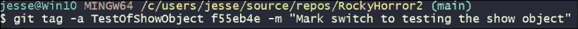
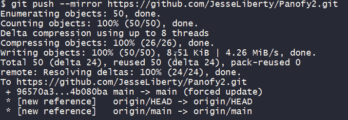

# 7

# 工作流程、笔记和标签

在本章中，我们将看到

+   使用 Git 的标准工作流程

+   什么是笔记

+   如何使用笔记

+   什么是标签

+   如何使用标签

我们将从检查标准工作流程开始。

# 标准工作流程

标准工作流程基本上就是我们在前五章中看到的，只是你通常不会这么快速或频繁地提交。通常，它的流程如下：

1.  创建一个仓库。

1.  可以从服务器克隆该仓库，或者如果它是本地创建的，可以将其推送到服务器。

1.  创建一个分支。

1.  代码。

1.  测试。

1.  提交。

1.  重复*步骤 4-6*，直到你有一段执行“某些操作”的代码（例如打开一个对话框并处理结果）。

1.  测试。

1.  提交。

1.  推送。

1.  重复*步骤 4-10*，直到你完成一个需求（无论是自我设定的还是其他的）。

1.  合并到主分支（如果你在团队中，创建一个拉取请求）。

这方面有一些变体。有些人喜欢每次提交后就推送，但这样会阻止他们使用交互式变基来重组他们的提交。但是，如果你已经推送了提交，然后意识到有额外的信息你希望能添加到提交信息中，会发生什么呢？

*不要*修改你已经推送的代码。（我之前说过吗？）那么，该怎么做呢？

如果问题比较严重（你需要修改提交内容等），那么你需要采取更为激烈的措施（参见*第十二章*《修复错误》）。但如果只是更新消息的话，可以考虑添加一个笔记。

# 镜像你的仓库

我们想继续讨论笔记，但为了做到这一点，我们需要稍微偏离一下，先镜像我们的仓库，这样我们就可以添加笔记而不会搞乱现有的仓库。

我们想要镜像的仓库应该有足够数量的提交。你可能还记得在上一章中，我通过创建一个名为`RockyHorror`的仓库来解决挑战。让我们打开这个仓库，在本地机器上使用日志查看提交：


图 7.1：现有仓库中的内容是什么？

**注意**：你并没有疯：在这一章中，我已经从 PowerShell 切换到了 Bash shell。

## 复制现有仓库

如你所见，有九次提交，这对于我们的目的已经足够了。不过，我不想修改这个仓库（主要是为了当你下载代码时，在阅读*第六章*《交互式变基》时，它看起来是正确的）。

要将这个仓库的精确副本（包括提交、消息等）放入另一个仓库，我们将使用 Git 的 --`mirror` 标志。以下是操作步骤。

切换到 `RockyHorror` 目录，并使用日志确认你已在本地仓库中，使用`--oneline`标志，正如之前在*图 7.1*中所示。

现在，我们需要一个仓库来放置我们的镜像版本。去 GitHub 创建一个名为`RockyHorror2`的新仓库：


图 7.2：创建新仓库

正如你所预期的，现在你在服务器上有一个仓库 `RockyHorror2`，但在本地没有。接下来，我们将用 `RockyHorror` 的内容覆盖服务器上的文件、提交等，给我们提供一个完全相同的副本来进行工作。

要做到这一点，确保你处于原始仓库（`RockyHorror`）中，然后使用 `––mirror` 标志将内容推送到服务器，并推送到新的仓库（`RockyHorror2`）。你需要新仓库的地址，因此首先去服务器上的克隆按钮，复制地址，但*不要克隆仓库*：


图 7.3：将内容镜像到新仓库

好的，让我们复习一下。在你的终端（Bash、PowerShell、Terminal 等）中，你位于 `RockyHorror` 目录下，如果你运行 `git log --oneline`，你将看到如*图 7.1*所示的结果。

现在你已经准备好将这个仓库镜像到本地。你将在终端中进行此操作，但请记住，这将把这个仓库的镜像推送到服务器，并覆盖 `RockyHorror2` 中已有的内容（在此案例中仅有 `README.md`、`LICENSE` 和 `.gitignore` 文件）。

这将导致 Git 执行一系列操作，最终的效果是将 `RockyHorror` 中的所有内容复制到 `RockyHorror2`：


图 7.4：从服务器复制到本地仓库

现在你可以去 GitHub 查看，`RockyHorror2` 已经更新为 `RockyHorror` 的完全副本（如果没有看到，记得刷新页面）：


图 7.5：查看镜像仓库

在*图 7.5*中有一些有趣的内容。首先，注意左上角显示的是 `RockyHorror2`，但是如果你查看 `README` 文件，它上面写的是 `RockyHorror`。这是因为这个 `README` 文件来自原始的 `RockyHorror` 仓库。还要注意，文件不是几分钟前的，而是我在 6 天前在原始仓库中修改的；这是因为这些文件是 6 天前在原仓库中修改的。要点是，虽然这看起来是一个副本，但它实际上是 `RockyHorror` 的完全复制品。

现在转到你本地的 `RockyHorror2` 目录。什么？它不在那儿？对，我们只是在服务器上进行了镜像。如果我们想要本地仓库，我们需要克隆我们新的仓库。你可以通过命令行、Visual Studio 或 GitHub Desktop 来完成这一操作（或者任何你喜欢的 GUI，SourceTree 和 Fork 在撰写本文时非常流行）。

当你进行克隆时，请确保复制新仓库的地址，而不是原始仓库的地址：


图 7.6：确保你在正确的位置

现在你可以进入新的 `RockyHorror2` 目录。进入后查看里面的日志：


图 7.7：获取镜像仓库的日志

这里需要注意的一个关键点是，提交记录以及 `HEAD` 和 `origin` 指向的位置与*图 7.1*所示的 `RockyHorror` 完全相同。

请注意，ID 也是相同的。我个人觉得这几乎让人吃惊，但就 Git 而言，这只是同一个仓库的另一个副本。然而，从现在开始，你可以改变一个，而不会影响另一个。

## 添加和显示笔记

现在我们已经准备好为我们的一个提交添加笔记。

让我明确一点，你*不需要*镜像你的仓库来使用笔记。我们在这里这么做仅仅是为了本书的目的；以确保仓库与每章中所展示的内容相对应。通常，你只需要添加笔记即可。

笔记只是你可以在提交已存在于仓库之后附加到提交上的一些文本。笔记的常见用途是解释某个提交如何与其他提交相关，或者标记一个提交需要修改或重新基准，或者添加你希望粘贴到提交中的任何信息。它不会改变提交；它就像一个便条纸，你贴在上面。

要添加笔记，你需要使用`git notes`命令并加上一个或多个标志。例如，如果你在*图 7.7*中有代码，且想要为当前显示“Remove Hello World”的提交添加笔记，我们只需要获取 ID `commit id—bb4927c—`，然后像这样执行：

```
git notes add -m "Remove from program.cs" bb4927c 
```

如果你现在运行`git log`，你将看到日志列表中的笔记，前面会有“Notes”字样：

``

图 7.8：查看附加的笔记

如果你想看到带有笔记的更改，可以使用`show`子命令：


图 7.9：查看带有笔记的更改

再次提醒，当需要时，你可以谷歌搜索很多子命令。

## 标签

为某个提交标记一个名称可能会很方便。例如，你可以将某个提交标记为开发者版本，另一个标记为正式版本。每次发布新版本时，你都可以添加另一个标签，这样就能快速、清晰地浏览历史记录，查看每个版本之前或之后添加了哪些提交。

让我们再回头看一下*图 7.1*。我们可能会决定将提交`Enter show times`视为创建 Show 对象的最后一个提交，并且我们想要表明这一点。我们可以用笔记来做，但在这种情况下，用标签标记这个提交可能更方便。

你可能使用两种类型的标签：简单标签和注解标签。我们先从简单标签开始：


图 7.10：LastShowCommit 的标签

在*图 7.10*中，我们首先获取所有提交的在线日志。然后我们添加标签：

```
git tag LastShowCommit bf6b900 
```

如你所见，我们使用关键字`tag`，后跟标签本身（一个单词，不加引号），然后是我们正在标记的提交的 ID。

请注意，我们标记的是提交，而不是某个特定文件。这个标签适用于该提交中的所有文件。

第二种类型的标签是注解标签，如*图 7.11*所示：



图 7.11：注解标签

当你使用在线日志时，它与其他标签一样出现，如*图 7.12*所示：


图 7.12：在线日志中的注解标签

然而，如果你使用`show`命令，你可以看到标签的附加信息（即创建时的消息）和由谁创建。它非常类似于提交，只不过不会影响文件，并且标记了**tag**和**tagger**关键词：


图 7.13：注释标签

### 指向不同的标签

如果你创建了一个标签，但指向了错误的提交，可以通过使用强制标志来更改它指向的内容。例如，假设你有*图 7.14*中所示的提交列表：


图 7.14：指向错误提交的标签列表

注意，标签`TestOfShowObject`指向`f55eb4e`。不幸的是，我们本来是想指向下一个提交（`e16d191`）。为此，我们可以写：

```
git tag -f TestOfShowObject e16d191 
```

我们需要强制标志（`-f`）来确保 Git 不会报错`Fatal: tag TestOfShowObjects already exists`：


图 7.15：使用强制命令重新分配标签

如*图 7.15*所示，Git 回复了更新标签的消息、标签的名称以及它之前指向的内容。标签现在已经被移动到`e16d191`，正如我们所希望的那样。

最后，我们可以使用`-d`标志删除一个标签：


图 7.16：删除标签

*图 7.16*显示 Git 确认了删除操作，运行日志显示标签已被删除。

# 总结

在本章中，你学到了

+   使用 Git 的标准工作流

+   注释是什么，如何创建注释

+   标签是什么，如何创建、移动和删除标签

# 挑战

创建`Panofy`的本地副本。向其中一个提交添加注释，并确保它存在。向其中一个提交添加标签并确保它存在。最后，改变标签指向的提交。

这是我的回答：

首先，切换到`Panofy`目录。如果它不在本地机器上，克隆它：


图 7.17：切换到 Panofy 项目

如*图 7.17*所示，当我尝试切换到`Panofy`目录时，系统告诉我该目录不存在，于是我从服务器上克隆了它。

为了创建镜像，我首先在服务器上创建一个名为`Panofy2`的新仓库：


图 7.18：镜像

如*图 7.18*所示，这次我没有费心创建许可证文件，因为所有这些内容将在我将 Panofy 镜像过来时被覆盖。为此，我将目录切换到 Panofy（原始仓库）并输入：

```
git push ––mirror https://github.com/JesseLiberty/Panofy2.git 
```

这会将我所在的仓库（`Panofy`）推送到新地址，镜像原始仓库：



图 7.19：推送到服务器上的镜像仓库

我将在服务器上切换到`Panofy2`，果然，许可证现在已经在那里（来自`Panofy`），并且有了`Panofy`文件夹，如*图 7.20*所示：


图 7.20：Panofy 的许可证

这样一来，我可以安全地更改`Panofy2`。第一项任务是添加一个注释。我们从日志开始，这样我们就可以看到现有内容：


图 7.21：在镜像仓库中为提交添加注释

让我们为提交添加一个信息为`Add Hello Message`的注释，内容是`Traditional first Hello World`：


图 7.22：添加注释

在*图 7.22*中，我们看到这次我没有在 Git 提交语句中添加注释。相反，我等待编辑器（在我的情况下是 Visual Studio Code）打开，然后把语句放入其中。当我关闭文件时，注释已被输入，如*图 7.23*所示：


图 7.23：使用编辑器添加注释

让我们再看一次日志：


图 7.24：检查日志

我将添加一个注释标签到提交中，标签内容是`Update csproj`：


图 7.25：检查注释标签

在*图 7.25*中有四个箭头。第一个指向标签的创建。第二个显示标签名称，第三个显示标签的创建者，最后一个箭头指向标签本身的文本。

让我们再次查看日志，如*图 7.26*所示：


图 7.26：单行日志中的注释标签

我们可以看到标签位于`877348c`，但事实证明我们忘记了更新`csproj`，并在提交`4b080ba`时修复了这个问题。让我们将标签移到那里：


图 7.27：移动标签

在最后一张图中，*图 7.27*，你可以看到我们已经将标签`ReleaseCandidate`移动到了`4b080ba`，正如预期的那样。
