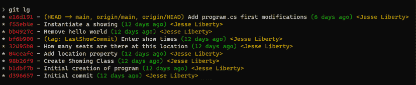
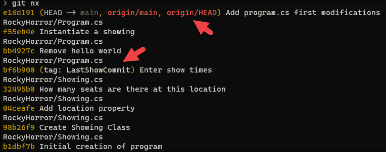

# 第八章：别名

停止那么辛苦地工作！在这一章中，我们将学习 Git 别名，它们大大减少了你需要输入的内容。别名可以非常简单，也可以带有参数和标志。

# 别名

别名允许你创建`git`命令的快捷方式。例如，我有一个`st`别名，代表状态。因此，我输入：

```
git st 
```

就好像我输入了：

```
git status 
```

我们很快就会看到更令人兴奋和有用的别名，但首先让我们来看一下这些是如何创建的。要创建一个别名：

+   输入`git`

+   输入关键字`config`

+   输入标志`--global`

+   输入关键字`alias`，后跟一个句点，然后是别名本身

+   输入你想要创建别名的命令

这听起来比实际要复杂。举个例子，要创建`st`别名，我输入了：

```
git config --global alias.st status 
```

当然，你不一定非得使用`global`。你可以选择`system`和`local`，但就个人而言，我总是使用`global`，因为我是这个电脑上唯一的用户，我希望它始终可用。

这里是一个稍微复杂一点的别名，它允许你创建一个分支并切换到该分支：

```
git config --global alias.bc checkout -b 
```

这里需要注意的是，你的别名可以带一个或多个标志。

我总是记不住是`bc`还是`cb`，所以我创建了另一个别名来执行相同的命令：

```
git config --global alias.cb checkout -b 
```

我经常使用的一个别名会提交所有内容并等待我的消息：

```
git config --global alias.cam commit -a -m 
```

当我输入`git cam`时，它会提交所有内容并附上我给定的消息：

```
git cam "Here is my message" 
```

最后，这是我最喜欢的别名：

```
git config –global alias.lg log --graph --pretty=format:'%Cred%h%Creset -%C(yellow)%d%Creset %s %Cgreen(%cr) %C(yellow)<%an>%Creset' --abbrev-commit 
```

这为我提供了一个替代`log --oneline`的选项，能够提供更多的信息：



图 8.1：git lg

从左到右看，我们看到 SHA 后跟提交消息，接着在括号中可以看到提交的时间以及由谁提交。如第四行所示，如果有标签，它会显示在消息之前，指针（例如`HEAD`）会显示在 SHA 之后。

我们简单拆解一下这个别名：每种颜色都被`%C`和`%Creset`包围。一些显示项使用快捷方式显示，比如`%h`，它会显示 SHA。因此，为了将 SHA 显示为红色，我们使用`'%Cred%h%Creset`。

所有这些都存储在你的全局配置文件中，你可以通过输入以下命令访问：

```
git config --edit --global 
```

它会在编辑器中打开全局配置文件。在这里，你会找到多个部分，其中一个部分包含了别名：

```
[user]
    name = Jesse Liberty
    email = jesseliberty@gmail.com
[alias]
    co = checkout
    bc = checkout
    cb = checkout
    st = status
    cam = commit -a -m
    lg = log –graph --pretty=format:'%Cred%h%Creset -%C(yellow)%d%Creset %s %Cgreen(%cr) %C(yellow)<%an>%Creset' --abbrev-commit 
```

注意，别名在那里，但语法稍微不同。如果你喜欢，可以直接在这里添加别名。（注意，红色下划线没有任何意义。这只是 Visual Studio Code 指出它无法识别这些术语。）

请注意：如果你要使用多个标志，你必须把别名放在引号中，如这一行所示（你将在我回答挑战时再次看到它）：

```
git config --global alias.nx  "log --name-only --oneline" 
```

# 总结

别名是一个方便的方式，用来缩短本来很长的命令。你可以使用以下序列创建别名：

+   输入`git`

+   输入关键字`config`

+   输入标志`--global`

+   输入关键字别名，后跟一个点号，然后是别名本身

+   输入你正在别名化的命令

你可以直接使用以下命令访问配置文件：

```
git config --edit --global 
```

在命令行工作时，别名简单、易用且非常实用。

# 挑战

创建一个替代以下命令的别名：

```
git log ––name-only --oneline 
```

# 答案

为此，我将进入命令行并输入：

```
git config --global alias.nx  "log --name-only --oneline" 
```

需要使用双引号，因为你在`log`中使用了两个标志。

调用此命令的结果如*图 8.2*所示：



图 8.2：我们的新别名工作示例

请注意，每个提交都在那儿，以单行显示，并且只包含 SHA 和消息（除了当存在标签或指针时，如*图 8.2*中的第 1 行和第 7 行所示）。
