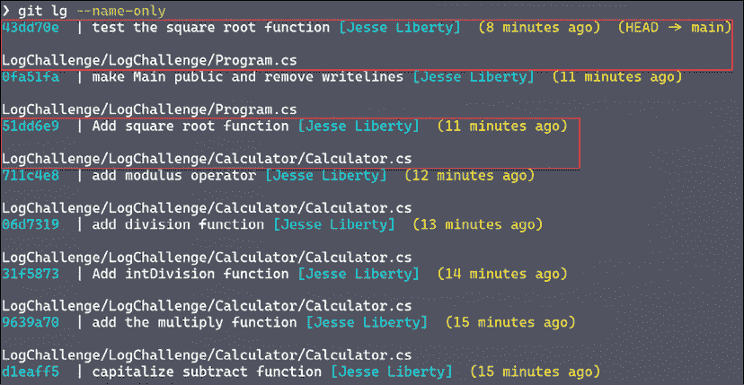

# 第九章：使用日志

Git 中最强大的命令之一是`log`。你已经在前几章看到过日志的用法，现在是时候深入了解它了。

日志可以显示每个提交的创建时间、创建者以及关于提交的其他有用信息，比如每个文件的变化内容。你可以对显示内容进行精细控制，正如本章所示。

# 开始使用日志

让我们快速构建另一个项目和仓库：


图 9.1：创建新仓库

接下来，正如我们之前所做的，我们将把这个仓库克隆到本地计算机：


图 9.2：克隆示例程序

使用这个本地仓库，我们可以开始使用`log`命令查看其提交记录。要做到这一点，当然，我们需要先创建一个程序并进行一些提交。

## LogDemo 程序

在`LogDemo`目录中创建一个程序。将程序修改为公开的，并进行构建和运行，以确保它能够正常工作：


图 9.3：测试程序

我将创建与之前相同的`calculator`类，并在每个小功能后做提交。我会省略这些内容，只将其放入仓库中。

添加完所有功能后，我们来试一试：

```
using System;
namespace LogDemo
{
    public class Program
    {
        static void Main(string[] args)
        {
            var calculator = new Calculator.Calculator();
            Console.WriteLine($"5+3 = {calculator.Add(5, 3)}");
            Console.WriteLine($"The square root of 3.14159 is {calculator.squareRoot(3.14159)}");
        }
    }
} 
```

结果应为：

```
5+3 = 8
The square root of 3.14159 is 1.7724531023414978 
```

我现在有了多个提交，我们可以使用在*第八章*中描述的`lg`别名来查看这些提交：


图 9.4：使用`lg`别名查看提交历史

我们可以看到有 12 个提交，并且可以从最后一行看到这些提交都没有被推送，因此我们领先于远程仓库 12 次提交。通过`status`命令可以确认这一点：


图 9.5：状态显示有 12 个提交等待推送，工作目录为空

一旦提交完成，工作目录就会保持干净。你确实有 12 个提交准备推送，但这并不影响 Git 对工作目录状态的分析。

## Visual Studio

另一个很棒的视图展示相同信息的是在 Visual Studio 中。点击**Git**：


图 9.6：点击菜单项 Git

然后点击**查看分支历史**：


图 9.7：分支历史

这显示了 12 个准备推送的提交，以及一个已经在远程仓库的提交（`e040fb00`）。

## GitHub 桌面客户端

GitHub 桌面客户端还有另一种展示相同数据的方式。这一单独页面能让你在一个视图中获取大量信息：


图 9.8：GitHub 桌面客户端

在页面顶部，我们看到仓库、分支和状态。左侧列展示了每个提交及其信息。（点击向上箭头将推送该提交。）中间列显示该提交涉及的文件，右侧则显示选中文件的代码。`log`命令可以完成所有这些操作，但不能同时进行。

# 命令行中的 log

你可以向 `log` 添加大量标志以控制其输出。在创建 `lg` 别名时，我们已经看到如何使用 `log --oneline`：


图 9.9：在命令行中使用 `log`

仔细观察，我们看到左列显示短 ID，右列列出了与每个提交相关的消息，在第一个和最后一个提交中，我们还看到了 head 指针的位置；本地和远程都是如此。

## 哪些文件发生了变化？

如果你只想知道每次提交中哪些文件被更改，但不想看到这些更改的具体内容，你可以使用：

```
git log ––name-only 
```

以下是一个摘录：


图 9.10：使用 `log` 查看文件更改

我们看到两个提交。第一个，在 `Program.cs` 中，消息为 `调用 add 函数`，你还可以看到完整的 ID、作者和提交的时间。

当然，你也可以使用我们的 `lg` 别名来简化输出：


图 9.11：使用快捷键 lg

这里的问题是，垂直间距可能会让人感到困惑。这个例子展示了三个提交。第一个提交的消息是 `实例化计算器`，在这个提交中，`Program.cs` 被修改。弄清楚哪个文件属于哪个提交的最好方法是从 ID 开始。

在 Visual Studio 中没有简单的办法做到这一点，正如我们所看到的，GitHub Desktop 会将更改过的文件列表显示为提交历史的一部分。

## 每个文件发生了什么变化？

我们可以进一步询问 `log` 哪些文件发生了变化，以及这些变化中涉及到的文件。对应的命令是 `git log -p`。

这将打印出每个提交中每个文件的更改。以下是一个文件的更改：


图 9.12：使用 `log` 查看每个文件的变化

在我的电脑上，新增的行显示为绿色，并且注意到左边的 `+` 符号，表示这行是新增的。接下来，我们进入 `Program.cs`，做更多修改——移除平方根函数并添加对除法函数的调用：


图 9.13：使用 diff 指示器查看变化

在这里，`log` 显示了平方根方法被移除（我的屏幕上是红色，并且最左边有一个减号），而除法方法被添加（再次注意最左边的加号）。

在该提交的消息下方，我们看到了一行有趣的内容：

```
diff --git a/LogDemo/LogDemo/Program.cs b/LogDemo/LogDemo/Program.cs 
```

Git 使用了 `diff` 命令，将原始版本（`a/LogDemo/LogDemo/Program.cs`）与新版本（`b/LogDemo/LogDemo/Program.cs`）进行了区分。正是 `diff` 的这种使用，使得 `log` 能够显示变化。

## diff

没有什么能阻止你自己使用 `diff`。最强大的用途是，它可以在你提交更改之前，显示你自上次提交以来所做工作的变化。

假设你正在工作，然后被叫走了。如果你像我一样，可能已经完全忘记了自己做到了哪里以及到底要做什么。我们添加平方根方法并删除除法方法来测试程序，但在提交之前，我们先查看一下更改：


图 9.14：使用 diff

这与之前的示例非常相似，唯一的不同是，这里展示的是我的工作目录与上一个提交之间的差异。我可以通过提示符中的`~1`知道这是工作目录中的更改——表示有一个文件被修改但尚未提交。

## Visual Studio

假设我在我的程序中工作，并且为计算器添加了一个`Absolute`方法：

```
public double Absolute (double x)
 {
     return Math.Abs(x);
 } 
```

我保存了它，然后去做程序的其他部分。当我回到计算器时，我知道我做了更改，但不记得是什么。在 Visual Studio 中，右键单击`Calculator.cs`并选择：

```
git compare with unmodified 
```

Visual Studio 打开并显示并排窗口，显示自上次提交以来你在此文件中做的更改：


图 9.15：并排比较

这样你的更改立即变得显而易见。

## 这个文件随时间发生了什么变化？

如果你想查看给定文件的更改历史，可以输入：

```
git log <filename> 
```


图 9.16：检查一个文件随时间变化的更改

在这里，我请求查看`Calculator.cs`的日志（提供完整路径），并获取该文件随时间变化的每个更改。正如你预期的那样，我可以使用`lg`让它更易读：


图 9.17：使用 lg 查看随时间变化的内容

现在我们可以看到实际发生了什么。日志提供了它通常所提供的所有信息，但仅限于所选文件。注意，提示符仍然显示我们有 14 个文件待上传，这表明这个列表并不是等待推送的所有提交。

## 搜索

假设我们想找到所有提交中包含单词"calculator"的文件。为此，我们使用`-S`搜索标志，紧接着输入我们要搜索的词：

```
git log -Scalculator 
```

这将返回所有包含单词"calculator"的提交，无论该词出现在其中一个或多个文件中：


图 9.18：在提交中搜索

注意：你还可以使用`git log -Gcalculator`，这将允许你使用正则表达式进行搜索。

再次，`lg`别名可以让它更易读：


图 9.19：使用 lg 进行搜索

搜索虽然不常见，但当你需要它时，Git 提供了一个非常强大的工具。

## 我的提交在哪里？

有时你只想查看某个特定人添加的提交列表。为此，你可以使用：

```
git lg ––committer="Jesse" 
```

当然，对于这个示例，这将是所有的提交：


图 9.20：使用 lg 查看随时间变化的内容

注意，搜索是区分大小写的，所以搜索"jesse liberty"不会返回任何记录，但"Jesse"会。

实际上，你可能会发现你更关心作者而非是谁做了提交，这样做的方式是一样的，只不过需要使用`--author`。

然而，事实证明，我只想要“Jesse Liberty”在过去 80 分钟内的提交。为此，我们使用`since`标志（你可以输入任何合理的时间段，例如`--since="one week"`）：

```
git lg --since="80 minutes" 
```

这样可以生成一个更加易于管理的列表：


图 9.21：按时间限制日志输出

你可以完全按作者进行相同的搜索，以防他们不相同：


图 9.22：基于作者和时间限制日志输出

限制日志显示特定时间段内的提交，可以大大帮助你集中注意力查看感兴趣的更改。

# 总结

在本节中，你已经看到`log`命令的强大功能。我们讨论了其中的一些标志：

| log 标志 | 含义 |
| --- | --- |
| `--oneline` | 每个提交只显示一行 |
| `--name-only` | 只显示每个提交中更改的文件名称 |
| `-p` | 有什么更改？ |
| `git log <filename>` | 该文件中发生了什么变化？ |
| `-Sfoo` | 在每个提交中搜索`foo` |
| `--committer="name"` | 按名称搜索所有提交 |
| `--author="name"` | 按名称搜索所有作者 |
| `--since="1 week"` | 与提交者或作者一起使用，在指定时间段内进行搜索 |

熟练掌握最常用的`log`命令可以让你更轻松地处理提交。当然，还有很多其他命令和标志，但你可以通过谷歌搜索找到你需要的命令。

# 挑战

在这个挑战中，你将使用`log`命令查看一组提交：

1.  创建一个新的仓库

1.  在该仓库中创建一个程序

1.  添加至少 6 个提交

1.  查找每个提交中更改的文件名称

1.  查找某个文件在时间推移中的变化

1.  查找过去一小时内（或任何合适的时间段）你提交的所有文件

请注意，你将使用`log`查看一个文件如何随时间变化，并查找每个提交中更改的文件名称。这展示了`log`命令的多功能性。

# 答案

对于这个挑战，没有一个正确答案，但与其他一些挑战不同，你在一定程度上受限于`log`命令的常见用法。

## 创建一个新的仓库

我将去 GitHub.com 创建`LogChallenge`仓库：


图 9.23：创建仓库

接下来，我需要将那个仓库克隆到我的本地机器：

```
git clone git@github.com:JesseLiberty/LogChallenge.git 
```

## 至少添加 6 个提交

首先，我们必须追踪新程序：


图 9.24：追踪程序

我们将向`Program.cs`文件添加一个更改：

```
namespace LogChallenge
{
    class Program
    {
        static void Main(string[] args)
        {
            Console.WriteLine("Hello World!");
            Console.WriteLine("Log Challenge!");
        }
    }
} 
```

现在是时候提交这个更改了。让我们从查看状态（`st`）开始：


图 9.25：处理未追踪和修改的文件

这是一个棘手的图像。确保你理解为什么前三个是“待提交的”，而最后一个没有被暂存提交。（提示：前三个已经在暂存区中。）

为了简化操作，我们一次性将所有未暂存的文件都添加进来：


图 9.26：添加未暂存文件

现在确保你理解为什么有三个文件需要提交而不是四个（提示：查看 `Program.cs`）。

继续提交这些文件：


图 9.27：创建提交

再次提醒，我使用的是上一章中的别名。注意 cam 添加了文件，但实际上没有文件被添加。没关系。然后它进行了提交并等待消息。*此时不要推送提交*。

让我们通过创建 `Calculator` 类并添加每个方法，在每次更改后提交，从而增加更多的提交记录，就像你之前看到的那样。

最后，让我们测试一下 `Program.cs` 中的 `SquareRoot` 函数：

```
namespace LogChallenge
{
    public static class Program
    {
        public static void Main(string[] args)
        {
            var calculator = new Calculator.Calculator();
            Console.WriteLine($"The square root of 2 is {calculator.SquareRoot(2)}");
        }
    }
}
namespace LogChallenge.Calculator
{
    public class Calculator
    {
        public int Add(int left, int right)
        {
            return left + right;
        }
        public int Subtract(int left, int right)
        {
            return left - right;
        }
        public int Multiply(int left, int right)
        {
            return left * right;
        }
        public int IntDivision(int left, int right)
        {
            return left / right;
        }
        public double Division(double left, double right)
        {
            return left / right;
        }
        public int Modulus(int left, int right)
        {
            return left % right;
        }
        public double SquareRoot(double x)
        {
            return Math.Sqrt(x);
        }
    }
} 
```

运行此命令可以得到正确的结果，且类型为 double：

```
The square root of 2 is 1.4142135623730951 
```

让我们查看所有提交的消息：

```
> git lg
43dd70e  | test the square root function [Jesse Liberty]  (5 minutes ago)  (HEAD -> main)
0fa51fa  | make Main public and remove writelines [Jesse Liberty]  (8 minutes ago)
51dd6e9  | Add square root function [Jesse Liberty]  (8 minutes ago)
711c4e8  | add modulus operator [Jesse Liberty]  (9 minutes ago)
06d7319  | add division function [Jesse Liberty]  (10 minutes ago)
31f5873  | Add intDivision function [Jesse Liberty]  (11 minutes ago)
9639a70  | add the multiply function [Jesse Liberty]  (12 minutes ago)
d1eaff5  | capitalize subtract function [Jesse Liberty]  (12 minutes ago)
d92657d  | Add subtract function [Jesse Liberty]  (13 minutes ago)
b5e945f  | Capitalize add function [Jesse Liberty]  (13 minutes ago)
f535d26  | Add the add function [Jesse Liberty]  (14 minutes ago)
a8cf101  | make calculator class public [Jesse Liberty]  (15 minutes ago)
acd2ce4  | Create calculator class [Jesse Liberty]  (15 minutes ago)
29cfe55  | First commit [Jesse Liberty]  (19 minutes ago)
d0518a1  | Initial commit [Jesse Liberty]  (41 minutes ago)  (origin/main, origin/HEAD) 
```

这里有一些额外的信息（如 ID、作者等），但我们确实看到了所有提交的消息：



图 9.28：仅使用名称标志的 lg

现在我们已经了解了如何处理已暂存和未暂存的文件，并通过 log 命令检查它们的内容，接下来我们来看一下如何找到在一次提交中实际更改的所有文件。

## 查找每次提交中更改的所有文件名

这有点棘手，因为存在空格问题。让我们先看第一个；首先，我们看到的是最新提交的 ID 和消息，然后在稍后的位置看到受影响的文件。类似地，在第二个框中，我们看到 **添加平方根函数**，但受影响的文件 `Calculator.cs` 离它的显示位置稍远。这在处理多个文件时会更加清晰。让我们试试这样做。

我们将向 `Calculator` 添加 `Round` 方法：

```
 public decimal Round(decimal x)
        {
           return  Math.Round(x);
        } 
```

我们将在程序中进行测试：

```
public static void Main(string[] args)
 {
     var calculator = new Calculator.Calculator();
     Console.WriteLine($"The square root of 93 is {calculator.SquareRoot(93)}");
     Console.WriteLine($"93.64 rounded is " + $"{calculator.Round((decimal)93.64)}");
 } 
```

我们现在将其提交，并且已经更改了两个文件：


图 9.29：看到有两个文件被修改

我们将其提交，现在已经有 15 次提交：


图 9.30：使用 lg 查看 15 次提交

## 查找随时间变化的指定文件的变更

要查看文件随时间变化的内容，我们使用简单的 `log` 命令，后面加上要查看的文件名。例如，我们可以查看 `Program.cs` 的变更（记得包括相对路径）：

```
git log LogChallenge/LogChallenge/Program.cs 
```

结果显示了所有的提交记录，最新的位于顶部：


图 9.31：查看一个文件的所有提交记录

我们已经看到如何查找某个文件随时间变化的所有提交记录，但这可能会让人感到有些不知所措。我们可能只需要查看最近的提交记录。

## 查找过去一小时内你提交的所有文件（或者根据需要选择合适的时间段）

为此，我们只需要使用 `since` 标志：


图 9.32：使用 since 标志

我们通过以下步骤完成了挑战：

+   创建一个新仓库

+   在该仓库中创建一个程序

+   添加提交

+   查找每次提交中更改的所有文件名

+   查看一个文件随时间变化的更改记录

+   查找过去一小时内所有提交的文件
