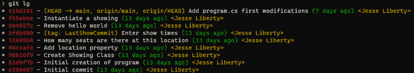
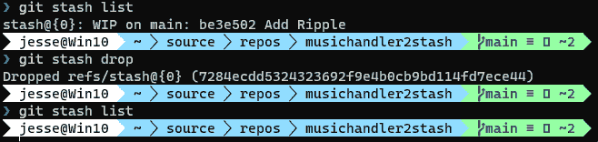

# 10

# 重要的 Git 命令和元数据

Git 命令和标志成百上千。在本章中，我们将尽力回顾一些我们到目前为止没有看过的最重要的命令。包括：

+   创建 stash

+   列出 stash 中的内容

+   从 stash 中恢复

+   清理命令，用于删除不需要的未跟踪文件

+   如何查看元数据并选择你想查看的数据

让我们从挖掘 stash 开始。

你可以在 [`git-scm.com/docs`](http://git-scm.com/docs) 找到完整的列表。

# Stash

当我们回顾 Git 的五个领域时，我们提到了一个叫做 stash 的领域，但并没有深入讲解 stash 是什么。简而言之，stash 是一个可以存放（stash）你修改过但尚未提交的文件的地方：

图 10.1：Git 的五个领域

Stash 非常重要。假设你正在开发一个功能，突然被要求处理一个非常重要的 bug。你还不准备提交当前的代码，但在工作区有未提交的文件时，你无法切换分支。

为了解决这个问题，你*可以*只需备份你的目录，然后删除那些未提交的文件，但这种方法非常慢且容易出错。相反，你应该把这些文件存放在某个地方，当你准备好时可以将它们取回，这正是 stash 的目的所在。

要看到这个工作效果，我们需要一个包含一些提交的仓库。让我们快速创建一个 `RockyHorror2` 仓库的镜像。为此，我们首先需要确保磁盘上有 `RockyHorror2` 仓库，如果没有，我们就从服务器拉取它。

让我们去 GitHub 创建一个名为 `RockyHorrorStash` 的仓库：

图 10.2：创建仓库

注意，我并没有麻烦去创建 readme、.gitignore 或许可证，因为当我执行镜像操作时，这些文件都会被覆盖。

点击 **创建仓库**，创建后，获取其地址。

我们现在准备将 `RockyHorror2` 镜像到 `RockyHorrorStash`。请确保切换到 `RockyHorror2` 目录并输入以下命令：

图 10.3：将镜像仓库推送到远程

我们现在在服务器上有了镜像仓库，但在本地没有，所以让我们克隆它：

图 10.4：将镜像仓库拉回到本地仓库

太好了，我们有一个可以操作的仓库。让我们通过快速调用日志查看其中的内容：

图 10.5：检查本地仓库的日志

假设我们正在这个项目中工作，并且修改了两个文件。首先，我们修改了 `Showing` 类来记录售出了多少盒爆米花：

图 10.6：添加 Showing 类

接下来，我们修改 `Program.cs`，让它显示 Brattle 剧院有 500 个座位。如果我们查看状态，就会看到工作区中有两个已修改的文件：

图 10.7：git status 显示两个已修改的文件

我们有两个未提交的修改文件。我们还有更多的工作要做，但老板打来电话，告诉我们另一个项目中有一个紧急 bug。这时，暂存就派上用场了。我们*可以*提交现在的工作，但我们还没有准备好，所以让我们将其暂存起来：

图 10.8：添加到暂存区

你输入`git stash`，它会把工作区和索引中的所有内容都放入暂存区，而不会提交。此时，工作区会重置到你开始修改文件之前的状态——也就是`HEAD`的先前位置。

你可以使用`stash list`命令查看暂存中的内容：

图 10.9：列出暂存中的内容

暂存中已经加入了`WIP on main`的标记。WIP 意味着“进行中的工作”。

目前，你在暂存区只有一项内容。然而，你可能会发现，在修复那个“非常重要的 bug”时，你的老板打来电话，告诉你停止这个工作，改去修复一个致命 bug。再次，你可能需要暂存你的工作。为了避免设置所有内容，我们只需在主程序中做一个小改动，然后将其暂存。我们来改一下剧院的名字：

图 10.10：暂存更多工作

嘿！增加 500 个座位的事怎么了？记得吗？我们从未提交过那个改动，我们将它暂存了，并且工作区已重置。让我们看一下状态：

图 10.11：检查状态

正如我们预期的那样，我们看到了我们所做的修改。让我们使用`git stash`将其暂存起来：

图 10.12：暂存修改

现在，我们在暂存区有两项内容。如果我们请求列出内容，应该会看到这两项：

图 10.13：列出暂存中的项目

果然，两个暂存的项目都在那儿。通常它们会有不同的 ID 和消息，但由于我们是从同一位置暂存的，最终出现了这种异常情况。你可以使用`stash show`查看暂存中的内容：

图 10.14：显示暂存内容

你可以从暂存中删除项目，也可以使用`stash clear`清空整个暂存。

# 清理

有时，你会发现状态中列出了未跟踪的文件。99%的情况下，这些是你创建的文件，你希望它们被跟踪，这可以通过将它们添加到索引中来实现（如前所示）。然而，有时你可能会发现一些你不需要的未跟踪文件：

图 10.15：未跟踪的文件

在这种情况下，我们有几个选择。我们可以将`Untracked.cs`添加到索引中，或者将其删除。为了实现这一点，我们可以使用`git clean`：

图 10.16：使用 clean 删除未跟踪文件（失败）

由于 `git clean` 是少数几个真正具有破坏性的命令之一——一旦执行，未追踪的文件将被永久删除——Git 会以讽刺的回应“拒绝清理”。为了真正清理，Git 要求你通过使用 `-f`（强制）标志来告诉它你是认真的：

图 10.17：使用如上所示的 clean 命令，但加上了 force 标志（成功执行）

`-f` 标志基本上意味着“我知道自己在做什么”——所以确保你确实知道。

# 元数据

每次提交、合并等操作都会伴随元数据。你可以通过使用日志获取大量元数据，但有时你只是想提取一些重要的元数据。为此，你可以使用 `show` 命令：

图 10.18：使用 show 查看元数据

在这个示例中，我们使用 `show` 查找作者的姓名和邮箱，以及 ID 和元数据，告诉我们 main 的尖端位置。让我们逐步解析：

+   `git` `show`—`show` 命令。

+   `-s`—静默模式（或安静模式），它会抑制差异输出（可以尝试去掉它看看效果）。

+   `HEAD` 告诉 show 你感兴趣的提交。

+   `%an` 是作者的名字。

+   `%ae` 是作者的电子邮件地址。

我们将这段代码放入字符串中，并将其分配给 format 标志。

让我们看看日志，看看我们还可以使用 `show` 查看哪些元数据：

图 10.19：查看日志

让我们集中查看与这些条目之一相关的元数据。为此，我们使用 ID：

图 10.20：使用 show -s 查看元数据

你也可以指定一个条目的范围：

图 10.21：指定条目的范围

我们能够聚焦于 stash 中需要的内容。要恢复暂存的文件，请使用 `git stash apply`。这会将暂存中的所有内容应用到当前工作目录中。一旦确定你得到了需要的内容，就可以调用 `git stash pop`，这将再次应用更改并将其从暂存中移除。

# 总结

在本章中，我们回顾了我们之前没有查看的一些最重要的命令。这些命令包括：

+   创建 stash

+   列出 stash 中的内容

+   从 stash 中恢复

+   `clean` 命令用于删除不需要的未追踪文件

+   如何查看元数据并选择你想查看的数据

# 挑战

镜像一个仓库，或者如果你不介意修改现有仓库，可以使用一个已经存在的仓库。检查提交列表。开始进行一些更改，但不提交这些更改。切换到另一个仓库继续工作。在第二个仓库中创建或修改一些文件，但不要提交它们。开始第三个仓库的工作。放弃这项工作并返回到第一个仓库。检查 stash 并恢复你需要的 stash 以继续工作。

# 答案

再次提醒，有许多方法可以回答这个问题。我将通过将 `RockyHorrorStash` 仓库镜像到 `RockyHorrorStash2`，然后立即将其克隆到我的本地仓库来开始。

我将对 `Panofy`（创建 `PanofyStash`）和 `musicHandler2`（创建 `musicHandler2Stash`）做同样的操作。现在我们有三个仓库可以操作：

+   `musicHandler2Stash`

+   `PanofyStash`

+   `RockyHorrorStash`

让我们从 `musicHandler2Stash` 开始，先切换目录并获取已有日志。然后，我们将在 Visual Studio 中打开它并进行工作：

图 10.22：MusicHandler2Stash 的日志

让我们在 Visual Studio 中打开该目录并做出两处修改。我们需要修改几个文件，所以我们仅添加一些注释。当我们执行 `status` 命令时，我们看到有两个已修改的文件：

图 10.23：MusicHandler 文件在修改后和提交前的状态

在我们工作进行到一半时，突然被要求处理一个 bug。我们还没准备好提交这些文件，所以我们将它们加入到暂存区：

图 10.24：调用暂存命令，将修改的文件放入暂存区，然后调用 `status` 查看工作目录为空

现在我们可以自由切换到 `RockyHorrorStash` 目录，在这里我们将开始修复 bug（我们会通过添加注释来表示实际工作）。哦哦，我们需要处理一个更大的 bug。让我们将 `RockyHorrorStash` 中的工作暂存起来。

我们将切换到 `PanofyStash`，做一些修改并提交。现在我们准备好返回到我们在 `musicHandler2stash` 中正在处理的 bug，因为这已经成为优先处理的任务。首先要做的是列出这个仓库中暂存区的内容（记住，暂存区是按仓库分开的）：

图 10.25：musicHandler2stash 中的暂存列表

让我们恢复这些。我们可以通过两种方式来实现：

+   `apply` 会应用暂存的文件，但会将它们保留在暂存区。

+   `pop` 会应用暂存的文件，但会从暂存区中移除它们。

我建议使用 `apply`，因为它会保留暂存项的副本在暂存区：

图 10.26：暂存应用

在*图 10.26*中，我们首先执行 `git stash apply`。这一步需要非常小心——有一个不同的命令 `git apply`，这并不是我们在这里需要的。

一旦应用，你可以看到两个修改过的文件已经回来了。我们执行了 `status` 命令，确保一切如我们所预期。现在我们知道没有问题，我们可以清理暂存区：

图 10.27：删除缓存

在*图 10.27*中，我们列出了暂存区中的内容，然后我们删除了暂存区的文件，接着再次列出，确保它们已经消失。

在这个挑战中，我们镜像了三个仓库，这样我们就可以在不改变它们原始状态的情况下进行操作。然后，我们查看了有哪些提交，并在不提交的情况下添加了新文件。为了能够切换仓库，我们将未提交的文件暂存了起来。当我们回到原始项目时，我们能够恢复暂存的文件。
