# 第十一章：查找坏的提交：Bisect 和 Blame

迟早你会发现你的程序中有一个错误，它是在过去某个时间点引入的。你可以通过所有以前的提交来查找，但那样既费时又低效。Git 提供了一个命令，bisect，可以为你完成所有繁琐的工作。

它是如何工作的：bisect 会要求你提供一个已知的“坏的”提交。通常这是最后一个提交。然后它会要求提供一个已知的“好的”提交——也就是说，一个已知可以正常工作的提交。你不需要尝试不同的提交来找到这个提交；只需要回溯到足够远的提交，确保它当时是正常的。

如果你小心的话，可能希望检出一个好的提交并运行它来确保没有问题。

Bisect 会进行一系列的二分查找，试图找到第一个坏的提交。如果你有好的单元测试，bisect 可以自己完成这个过程；否则你必须测试每个它找到的提交并报告它是好的还是坏的。

你开始时输入`git bisect start`。这会进入 bisect 状态，类似于我们进入 rebase 状态的方式。

你的第二个命令是告诉 bisect 当前的提交是坏的（不工作，或者用 bisect 的术语来说是*坏的*）。你可以通过输入`git bisect bad`来表示这一点。

你现在需要告诉 bisect 一个好的检出。你可以通过两种方式做到这一点：要么提供一个好的提交的 ID，要么告诉它从当前提交回溯多少次，例如`git checkout HEAD~12`，表示我们知道十二个提交前一切正常。

Git 会将剩余的提交大致分为两半，并检出一个提交。假设这是当前提交之前六个提交的那个。你接着测试该提交并告诉 bisect 它是好是坏。

如果你说它是好的，那么意味着它之前的所有提交都是好的。如果你说它是坏的，那么意味着之后的所有提交都是坏的。假设提交 6 是好的。Bisect 现在会将其范围视为 6 到 12，并可能会检出提交 9。

你测试了提交 9，发现它是坏的。这意味着 9 之后的每个提交都是坏的。Bisect 现在的范围是从 6 到 9，并检出 7。如果 7 是好的，那么坏的提交就是 8 或 9。我们测试 8 得到答案：如果它是好的，那么 9 是第一个坏的提交，否则就是 8。

所有这一切通过一个示例更容易理解。让我们创建一个名为`BisectTest`的新仓库：

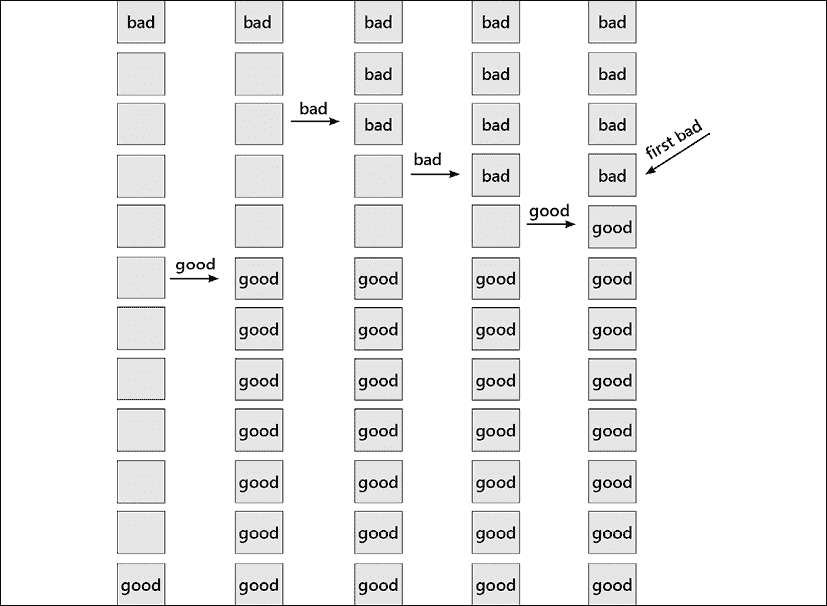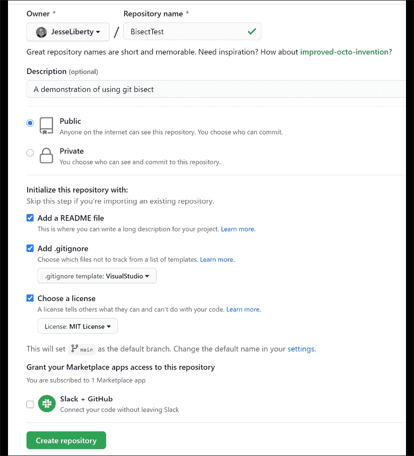

图 11.1：演示 bisect 的仓库

现在，像之前一样将该仓库克隆到本地磁盘。为了演示这个过程，我们将创建 12 次提交，其中有一个中间的提交存在错误，直到有人注意到程序在检查提交 12 后坏掉了。“哦不，”我们能听到那个程序员喊道，“这个问题可能已经存在很久了，但没人发现。我需要用 bisect 来找出哪个提交是坏的，并修复它。”

让我们用我们久经考验的 `Calculator` 类创建 12 个提交。第一个只会创建项目：

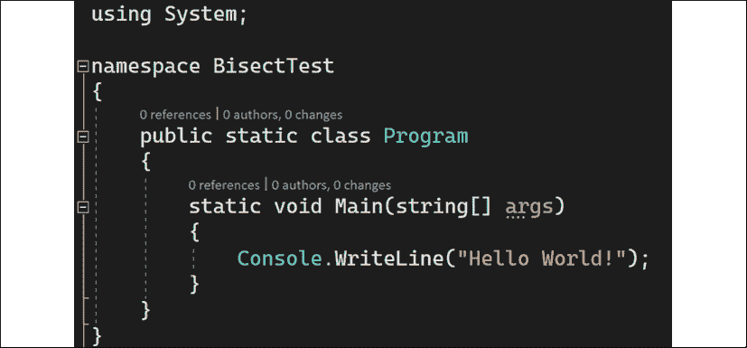

图 11.2: 我们程序的开始

我们将保存并提交作为第一个提交：

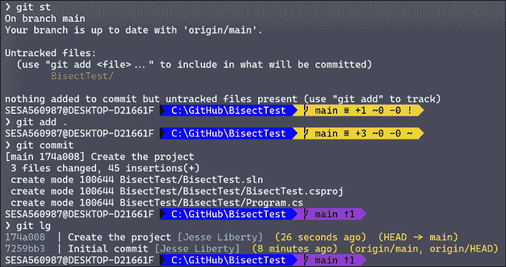

图 11.3: 保存并提交

接下来，我们将创建 `Calculator` 类并提交：

```
namespace BisectTest
{
    public class Calculator
    {
    }
} 
```

这样就有了三个提交：克隆时创建的初始提交，创建程序后的提交，以及创建 `Calculator` 类后的提交：

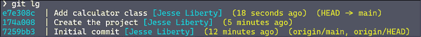

图 11.4: 三个提交

现在我们将添加四个函数（加法、减法、乘法和整数除法），每完成一个就提交。完成后，我们有了七个提交。

让我们添加取模运算符、实数除法和平方根，每完成一个就提交一次。

这给我们提供了十个提交。接下来，我们回到程序中，使用计算器打印出 23/4 的整数除法结果，得到值 5。让我们检查一下。

接下来，我们将在相同的除法运算中使用取模运算符：

```
namespace BisectTest
{
    public static class Program
    {
        static void Main(string[] args)
        {
            var calculator = new Calculator();
            Console.WriteLine($"Integer division of 23/4 is {calculator.Divide(23, 4)}");
            Console.WriteLine($"Modulus 23%4 is {calculator.Modulus(23, 4)}");
        }
    }
} 
```

最后，我们将使用双精度除法：

```
using System;
namespace BisectTest
{
    public static class Program
    {
        static void Main(string[] args)
        {
            var calculator = new Calculator();
            Console.WriteLine($"Integer division of 23/4 is {calculator.Divide(23, 4)}");
            Console.WriteLine($"Modulus 23%4 is {calculator.Modulus(23, 4)}");
            Console.WriteLine($"Real division of 23/4 is {calculator.Divide(23.0, 4.0)}");
        }
    }
} 
```

好的，我们准备在下次代码审查时展示我们的结果。我们运行程序，得到了：

```
Integer division of 23/4 is 5
Modulus 23%4 is 5
Real division of 23/4 is 5.75 
```

这个结果不可能是对的。在这种情况下，问题很明显；我们的取模运算符出了问题。但是在实际情况下，问题的答案要模糊得多，更别提它是在哪里引入的。

让我们使用 bisect 来找出出现问题的提交。我们启动 bisect，然后告诉它当前的提交是坏的：

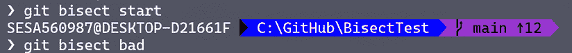

图 11.5: 开始 bisect

现在我们需要告诉它一个好的提交。让我们查看日志：

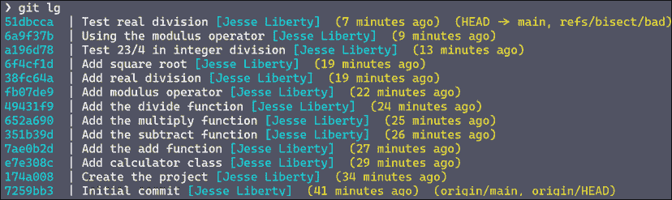

图 11.6: 寻找好的提交

我们知道第二个提交是好的，因为我们所做的就是创建项目。让我们告诉 bisect 这一点：


图 11.7: 一个已知的好提交

你可能会收到很多关于分离头指针的警告（真疼）。你可以安全地忽略这些警告。为了形式上的完整，我们将测试当前检出的提交，当然，它是没问题的。所以我们告诉 bisect 当前的检出是好的：

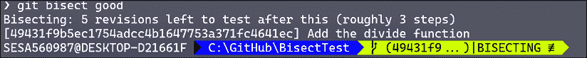

图 11.8: 告诉 Bisect 这个提交是好的

它返回了一些有趣的信息。它告诉你，如果原始提交是坏的，而这个提交是好的，那么剩下的五个修订需要测试，大约需要三步。它还告诉你，它已经检出了信息为“添加除法函数”的提交。现在让我们检查一下（当前的）程序，看看它是否正确。（通常，在这里，你会运行程序看看是否得到预期的结果。更好的是，你可能会运行单元测试套件，看看是否通过。）

在 Visual Studio 中查看，我们看到工作目录看起来是这样的：

```
namespace BisectTest
{
    public class Calculator
    {
        public int Add(int x, int y)
        {
            return x + y;
        }
        public int Subtract(int x, int y)
        {
            return x + y;
        }
        public int Multiply(int x, int y)
        {
            return x * y;
        }
        public int Divide(int x, int y)
        {
            return x / y;
        }
    }
} 
```

看起来不错。注意，某些函数缺失，这是因为 bisect 检出了一个较早的提交。我们可以告诉 bisect 这个提交是好的：

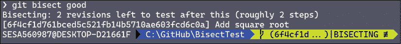

图 11.9: 另一个好的提交

它返回并告诉我们，我们确实已经缩小了范围。现在只剩下两个修复项需要测试。看看原始日志：

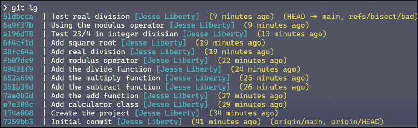

图 11.10：演示二分查找的代码库

我们告诉它最新的提交有问题，第二个是好的。然后它为我们提供了“添加除法函数”这一提交信息。也就是说，二分查找大致将我们的提交列表分成了两半，并检查了一个提交让我们进行测试。我们告诉二分查找它让我们测试的提交是好的。所以，二分查找认为：“嗯，除法是好的，真正的除法有问题，那就再把它一分为二（给我们‘添加平方根’），看看是好是坏。无论如何，我们只剩下一个测试，得到最终答案。”

当我们尝试这段代码时，它不对，无法按预期工作。所以，我们告诉二分查找平方根是坏的。作为回应，它检查了“添加真实除法”提交。再次查看日志。这个提交有问题，还是下面那个有问题。我们已经告诉它“添加除法函数”是好的，并且已经告诉它平方根提交是坏的：

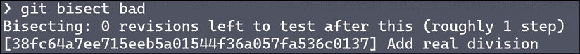

图 11.11：锁定问题所在

它已经检查了“添加除法函数”，我们来测试一下。

那个提交有问题，所以我们告诉二分查找：

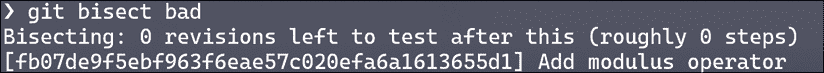

图 11.12：我们找到了问题

它返回并告诉我们“添加模运算符”一定是罪魁祸首，而且没有更多的测试项了。我们找到了。我们来看一下——果然，模运算符使用了除法运算符：

```
public int Modulus(int x, int y)
 {
     return x / y;
 } 
```

尽管我们使用了一个简单的假例子，但你可以看到二分查找如何缩小提交范围，找到第一个出现问题的提交。现在我们知道哪里出错了，可以进行修复。

# Blame

这个命令名字虽然不幸，但在逐行追踪谁更改了你的代码时非常有帮助。从这里，你可以与程序员讨论并了解他们的意图，或者提供修改的机会。

要在 Visual Studio 中打开 Blame，右键点击文件并选择**Git**，然后选择**Blame**。文件会打开，左侧会列出谁修改了该行代码。

# 挑战

创建一个有二十个提交的程序。在其中一个较早的提交中放置一个不会破坏正常程序的错误（以便它可以被隐藏）。使用二分查找找到错误。

第一步是创建一个包含 20 个提交的程序。我决定创建一个包含书籍信息的程序：

```
namespace BisectTest
{
    public class Book
    {
        public string Author { get; set; }
        public string BookName { get; set; }
        public double Price { get; set; }
        public double DiscountPrice { get; set; }
        internal double WholeSalePrice { get; set; }
        internal double DiscontinuedPrice { get; set; }
        public void ComputePrice()
        {
            Price = WholeSalePrice + (WholeSalePrice * .5);         
        }
        public void ComputeDiscountPrice()
        {
            DiscountPrice = Price * 2;
        }
        public void ComputeDiscontinued()
        {
            DiscontinuedPrice = DiscontinuedPrice * 0.8;
        }
    }
} 
```

我们还有一个与书籍类互动并显示结果的程序：

```
using System;
namespace BisectTest
{
    class Program
    {
        static void Main(string[] args)
        {
            var book = new Book();
            book.Author = "Jesse Liberty";
            book.BookName = "Pro Git for Programmers";
            book.WholeSalePrice = 10.0;
            book.ComputePrice();
            Console.WriteLine($"{book.BookName} by {book.Author}" );
            Console.WriteLine($"{book.BookName}: {book.Price}");
            Console.WriteLine($"Discount price is {book.DiscountPrice}");
            Console.WriteLine($"Discontinued price is {book.DiscontinuedPrice}");
        }
    }
} 
```

让我们运行程序并检查输出：

```
Pro Git for Programmers by Jesse Liberty
Pro Git for Programmers: 15
Discount price is 0
Discontinued price is 0 
```

这显然不是我们想要的。折扣价和停产价都是 0，实际上它们应该是 15 的一小部分。哦！我们忘记调用计算价格的方法了。当我们这样做并显示所有价格时，得到的是：

```
Pro Git for Programmers by Jesse Liberty
Pro Git for Programmers: 15
Pro Git for Programmers discount price = 30
Discontinued price is 0 
```

更好，但还是不对。为什么`Discontinued`的结果是零？为了找出原因，我们将使用二分查找。首先我们输入：

```
git bisect start 
```

接下来，我们需要告诉 Bisect 当前（最新的）提交是坏的，方法是输入：

```
git bisect bad 
```

查看日志后，我看到第一个提交的 ID 是 `7259bb3`。所以我们将输入：

```
Git checkout 7259bb3
Git bisect good 
```

它为我检查一个版本进行测试，并告诉我在此之后还有 11 个版本需要测试（假设这是坏的），并且大约需要 4 个步骤。我们继续二分查找，直到找到第一个出错的代码实例，正如我们上面所看到的。
