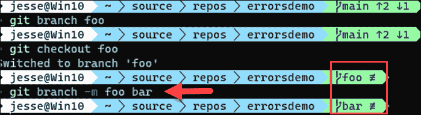

# 第十二章：修正错误

在 Git 中犯错最常见的反应是恐慌。如果你刚刚丢失了所有的工作怎么办？更糟的是，如果你搞砸了主分支呢？

本章将回顾一些常见的 Git 错误以及如何修复它们。当然，第一条规则是保持冷静，或者像道格拉斯·亚当斯所说的那样，*不要恐慌*！

我们将回顾一些常见的 Git 错误以及如何修复它们的问题：

+   您在提交中写了错误的消息。

+   您忘记添加上次提交的更改文件。

+   提交的顺序或它们的消息有问题。

+   您需要撤消提交中所做的更改。

+   您错误命名了分支。

+   您提交到错误的分支。

+   您在之前的提交中损坏了一个文件。

+   您通过推送一个损坏的分支搞乱了远程。

要查看答案的运行情况，让我们将 `Panofy` 镜像到 `ErrorsDemo`。以下是我们将要执行的步骤：

1.  在远程上，创建 `ErrorsDemo` 并获取其 URL。

1.  转到您想要镜像的本地分支（在我们的例子中为 `Panofy`）。

1.  使用`ErrorsDemo`的 URL，将其推送到服务器上的镜像命令。

1.  克隆新分支（确保在您想要的目录中克隆它）。

1.  切换到新的（克隆的）目录（`ErrorsDemo`）。

您可以在 *第十章*，*重要的 Git 命令和元数据* 中看到这一点的具体步骤。

# 您在上次提交中写了错误的消息

让我们从日志开始，这样我们就可以看到更改：


图 12.1：初始状态的日志

这很容易；您只需输入：

```
git commit --amend 
```

您的编辑器将打开并允许您更改消息。要更改消息的措辞，只需将 "pick" 更改为 "reword"。

保存文件后，最后一个提交的消息将如 *图 12.2* 所示更改：


图 12.2：修订后的日志（在最后一次提交中更改了消息）

# 您忘记添加上次提交的更改文件

您通过与上次提交修复消息的方式解决此问题：使用 `--amend`。

首先，将新的或更改的文件暂存。然后输入：

```
git --amend 
```

如果您不想在添加文件时编辑消息，请输入：

```
git --amend --no-edit 
```

# 提交的顺序或它们的消息有问题

如果问题不是在最后一次提交中（在这种情况下，您将使用 `--amend`），那么现在是时候使用交互式 rebase 了，如 *第八章*，*交互式 Rebase* 所示。如果您尚未推送，交互式 rebase 将让您执行所有这些操作及更多操作。

# 需要撤消提交中所做的更改。

在这里您所需做的就是调用日志，获取您想要撤消的提交的 ObjectID，并调用：

```
git revert ObjectID 
```

让我们回到日志：


图 12.3：日志，起始点

现在让我们回滚添加 hello 消息的提交：

```
git revert c507abf 
```

因为我在分支中间撤销了一个更改，所以遇到合并冲突不足为奇：


图 12.4：合并冲突

为了解决这个问题，我将调用`git mergetool`，启动我在*第四章*，*合并、拉取请求与解决合并冲突*中设置的工具。Kdiff3 足够智能，能够在没有我的帮助下解决所有冲突：


图 12.5：Kdiff3 为我解决了冲突

果然，当我们打开`Program.cs`时，Hello World 不见了：


图 12.6：Program.cs 在回退后的样子

# 你给分支命名错误

检出相关分支并输入：

```
git branch -m <currentName> <desiredName> 
```

这是我们得到的结果：



图 12.7：将分支 foo 重命名为 bar

在*图 12.7*中，你创建了 foo 分支并将其检出。最后，你按上面所示重命名它，分支名称就被改变了。

# 你提交到了错误的分支

这种情况对我来说（一次又一次！）通常是我忘记创建新分支，所以在开发分支或主分支上进行更改。要解决这个问题，请输入：

```
git branch <new branch>
git reset HEAD~ --hard 
```

你正在创建一个新的分支，然后从 main（`HEAD~`）中移除该提交，但将文件保留在新分支中。

# 你在之前的提交中丢失了一个文件

你破坏了一个文件，但在之后的几个提交中才发现，真痛。使用`git log`查找问题提交之前的提交的 ObjectID。现在，我们只想获取那个提交中的文件。为此，我们输入：

```
git checkout ObjectID --<path to file> 
```

（文件的路径是相对于项目根目录的。）

现在你已经在暂存区有了较早的版本。你可以将其“取消暂存”并从工作区进行编辑。

使用 ObjectID 的替代方法是从`HEAD`向后计数，例如：

```
git checkout HEAD~4 --<path to file> 
```

这只是说“回退到 4 个提交之前并从那里获取文件。”这两种方法同样有效。

# 你通过推送一个损坏的分支弄坏了远程仓库

如果（以及当）你通过推送一个不完整且损坏的本地副本破坏了主分支，别难过，振作起来！这是可以修复的。

注意，这不应该是可能的。如果你正在使用 Azure DevOps（或类似工具），你的流水线不应该接受任何无法编译的合并（可以说，应该通过一组单元测试）。不过，我有点跑题了……

你需要的第一个命令是：

```
git reset --hard <remoteRepository> / <Yourbranch>@{1} 
```

这会将你本地的`<Yourbranch>`重置为`<remoteRepo>`的最后同步版本。因此，如果你的分支是 Feature1 并且它在 origin 上，你需要输入：

```
git reset --hard origin/Feature1@{1} 
```

现在你想将远程仓库恢复到你破坏它之前的状态：

```
git push -f <remoteRepository><Yourbranch> 
```

# 测验

本章的挑战是一个测验。答案在测验的最后。

1.  如果你在上次提交中漏掉了一个更改的文件，该怎么办？

1.  如果你提交到了错误的分支，该怎么办？

1.  如果你在之前的提交中损坏了一个文件，该怎么办？

1.  如果你需要撤销某次提交中的更改，该怎么办？

1.  如果你通过推送一个损坏的分支破坏了主分支，该怎么办？

# 答案

## 如果你在上次提交中漏掉了一个更改的文件，该怎么办？

你可以使用与修改上次提交消息相同的命令，使用`--amend`，但你需要表明你不想编辑消息（确保你的文件已暂存）：

```
git --amend --no-edit 
```

## 如果你提交到了错误的分支，该怎么办？

检出或创建你想要提交的分支，然后使用 reset 命令将变更从远程分支中移除，但保留文件在暂存区，以便提交到新的分支：

```
git branch <new branch>
git reset HEAD~ --hard 
```

## 如果你在之前的提交中破坏了某个文件，该怎么办？

首先，使用 `git log` 查找损坏之前的提交，获取该提交的 ObjectID。接下来，从正常的提交中获取问题文件（仅获取该文件）：

```
git checkout ObjectID --<path to file> 
```

请记住：文件的路径是相对于项目根目录的。

你现在已经在暂存区得到了该文件的健康版本。如果该文件需要编辑，你可以将其取消暂存，但更常见的情况是，你可以直接使用这个较旧的版本。在这种情况下，你可以直接提交。

## 如果你需要撤销某个提交中的变更，该怎么办？

在这种情况下，打开日志，获取你想撤销的提交的 ObjectID。现在，你可以在该 ObjectID 上调用 `revert` 命令：

```
git revert ObjectID 
```

## 如果你通过推送一个损坏的分支把 Master 分支弄坏了，该怎么办？

如果你的 DevOps 系统允许你将一个损坏的分支推送到 Master，立即修复这个问题。事实上，如果可能的话，告诉你的团队在你修复之前不要提交到 Master。等他们不再对你大喊大叫后，按照以下步骤操作：

```
git reset --hard <remoteRepository> / <Yourbranch>@{1} 
```

这将把你本地的 `<Yourbranch>` 重置为 `<remoteRepo>` 的最后同步版本。因此，如果你的分支是 `myFeature`，并且它在 origin 上，你将写：

```
git reset --hard origin/myFeature@{1} 
```

现在，你需要将远程仓库恢复到破坏之前的状态：

```
git push -f <remoteRepository><Yourbranch> 
```

现在，Master 分支应该已经修复。

做得好！将这一章留着，以备未来你需要时用到。
