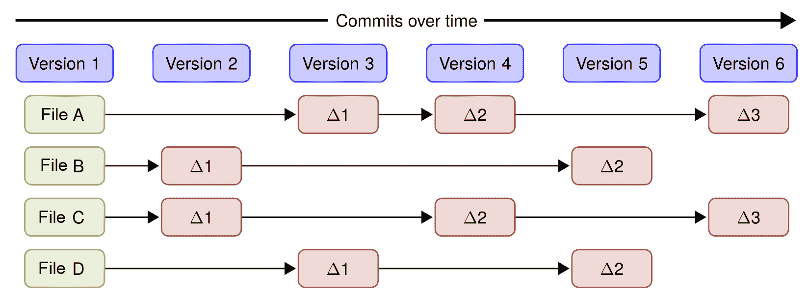
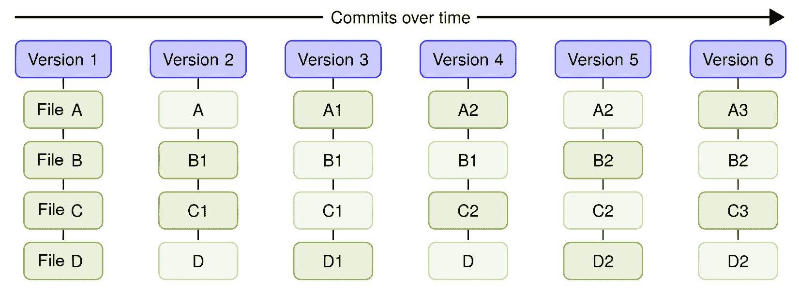
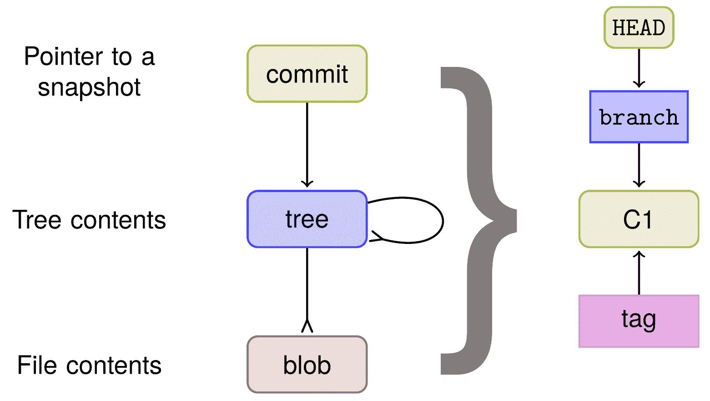
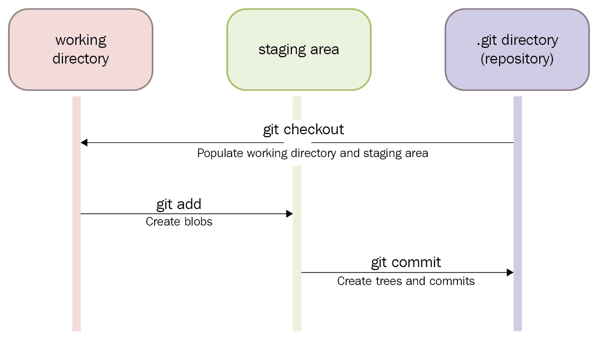
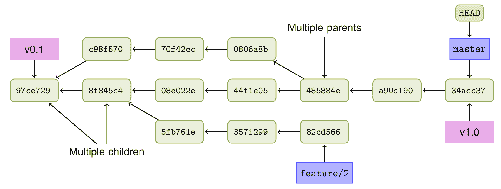
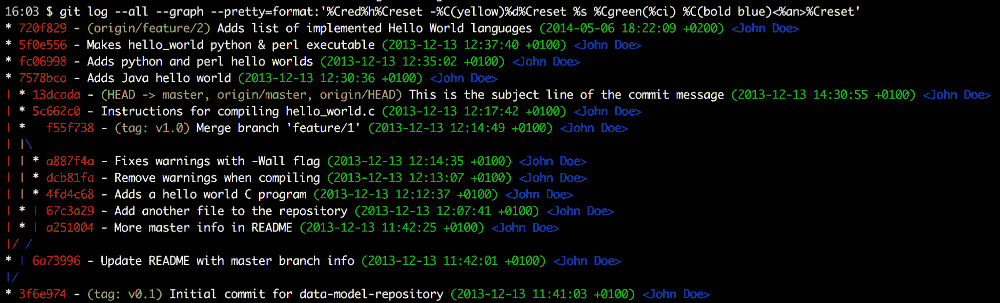
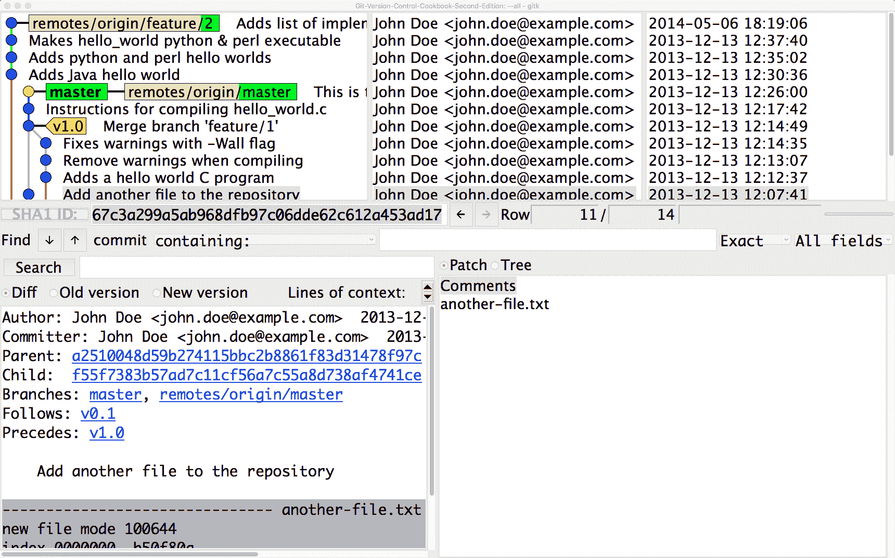
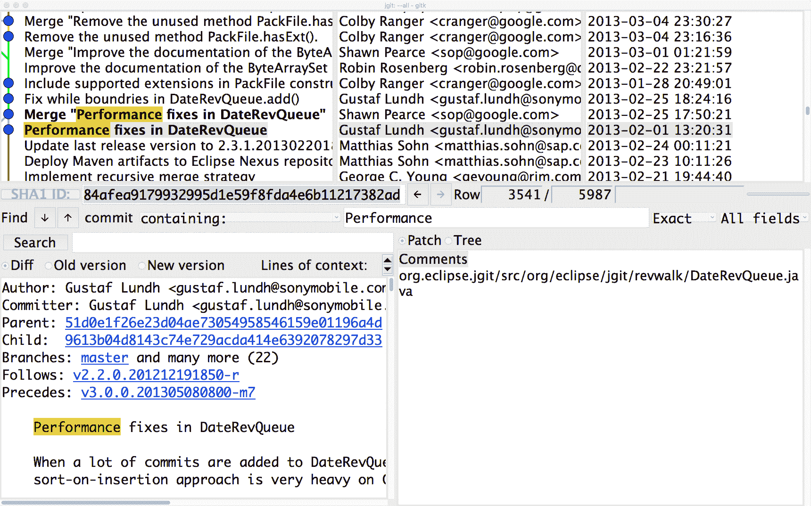

# 导航 Git

本章将涵盖以下内容：

+   Git 的对象

+   三个阶段

+   查看有向无环图（DAG）

+   提取已修复的问题

+   获取已更改文件的列表

+   使用 gitk 查看历史

+   查找历史中的提交

+   搜索历史代码

# 介绍

本章我们将深入了解 Git 的数据模型。我们将学习 Git 如何引用其对象以及历史如何记录。我们将学习如何导航历史，从查找提交消息中的特定文本片段，到引入代码中的特定字符串。

Git 的数据模型与其他常见的**版本控制系统**（**VCSs**）在数据处理方式上有所不同。传统上，VCS 会将数据存储为初始文件，接着是每个新版本文件的补丁列表：



Git 的不同之处在于：Git 不像常规的文件和补丁列表那样，而是记录了 Git 跟踪的所有文件及其相对于仓库根目录的路径的快照——也就是说，Git 在文件系统树中跟踪的文件。Git 中的每个提交都记录了完整的树状态。如果文件在提交之间没有变化，Git 不会重新存储该文件，而是存储该文件的链接。如下图所示，你可以看到每个提交/版本后文件的状态。



这就是 Git 与大多数其他版本控制系统不同之处，在接下来的章节中，我们将探讨这种强大模型的一些好处。

Git 引用文件和目录的方式直接内建于数据模型中。简而言之，Git 的数据模型可以通过下图总结：



`commit` 对象指向根树。根树指向子树和文件。

分支和标签指向一个 `commit` 对象，而 `HEAD` 对象指向当前检出的**分支**。因此，每个提交的完整树状态和快照由根树标识。

# Git 的对象

现在，既然你知道 Git 将每次提交存储为完整的树状态或快照，让我们仔细看看存储库中的 Git 对象存储。

Git 的对象存储是一个键值存储，键是对象的 ID，值是对象本身。键是对象的 SHA-1 哈希值，包含一些额外的信息，如大小。Git 中有四种类型的对象，还有分支（虽然不是对象，但很重要）以及特殊的 `HEAD` 指针，它指向当前检出的分支/提交。Git 中的四种对象类型如下：

+   文件，或者在 Git 上下文中也叫做 blobs

+   目录，或在 Git 上下文中的树

+   提交

+   标签

我们将从查看我们刚刚克隆的仓库中的最新 `commit` 对象开始，记住，特殊的 `HEAD` 指针指向当前检出的分支。

# 准备开始

要查看 Git 数据库中的对象，我们首先需要一个需要检查的仓库。对于这个实例，我们将克隆一个位于以下位置的示例仓库：

```
$ git clone https://github.com/PacktPublishing/Git-Version-Control-Cookbook-Second-Edition.git
$ cd Git-Version-Control-Cookbook-Second-Edition
```

现在，您已准备好查看数据库中的对象。我们将首先查看 `commit` 对象，然后是 `tree`，文件，最后是分支和标签。

# 如何做...

让我们更仔细地看看仓库中对象的 Git 存储情况。

# `commit` 对象

Git 的特殊 `HEAD` 对象始终指向当前的快照/提交，因此我们可以将其作为目标来查看我们想要检查的提交：

```
$ git cat-file -p HEAD
tree 34fa038544bcd9aed660c08320214bafff94150b
parent 5c662c018efced42ca5e9cce709787c40a849f34
author John Doe <john.doe@example.com> 1386933960 +0100
committer John Doe <john.doe@example.com> 1386941455 +0100
```

这是提交消息的主题行。它应该后跟一个空行，然后是正文，正文是这段文本。在这里，您可以使用多个段落来解释您的提交。它就像一封电子邮件，有主题和正文，目的是吸引人们的注意力。

带有 `-p` 选项的 `cat-file` 命令会打印命令行中给出的对象；在这种情况下，`HEAD` 指向 `master`，`master` 进一步指向该分支上的最新提交。

现在，我们可以看到 `commit` 对象，它由根 `tree`（`tree`）、父 `commit` 对象的 ID（`parent`）、作者和时间戳信息（`author`）、提交者和时间戳信息（`committer`）以及提交消息组成。

# `tree` 对象

要查看 `tree` 对象，我们可以对该 `tree` 运行相同的命令，但目标是该 `tree` 的 ID（`34fa038544bcd9aed660c08320214bafff94150b`）：

```
$ git cat-file -p 34fa038544bcd9aed660c08320214bafff94150b 
100644 blob f21dc2804e888fee6014d7e5b1ceee533b222c15    README.md
040000 tree abc267d04fb803760b75be7e665d3d69eeed32f8    a_sub_directory
100644 blob b50f80ac4d0a36780f9c0636f43472962154a11a    another-file.txt
100644 blob 92f046f17079aa82c924a9acf28d623fcb6ca727    cat-me.txt
100644 blob bb2fe940924c65b4a1cefcbdbe88c74d39eb23cd    hello_world.c
```

我们还可以通过指定`git cat-file -p HEAD^{tree}`来指定想要查看 `HEAD` 所指向提交的 `tree` 对象，这将与之前的命令给出相同的结果。特殊符号`HEAD^{tree}`表示从给定的引用中，`HEAD` 会递归地解引用该引用所指向的对象，直到找到一个 `tree` 对象。

第一个 `tree` 对象是从 `master` 分支指向的提交中找到的根 `tree` 对象，而 `HEAD` 也指向该分支。该符号的一般形式是 `<rev>^<type>`，它将递归查找 `<rev>` 中的第一个 `<type>` 对象。

从`tree`对象中，我们可以看到它包含的内容：文件类型/权限、类型（`tree`/`blob`）、ID 和路径名：

| **类型/****权限** | **类型** | **ID/SHA-1** | **路径名** |
| --- | --- | --- | --- |
| 100644 | `blob` | `f21dc2804e888fee6014` `d7e5b1ceee533b222c15` | `README.md` |
| 040000 | `tree` | `abc267d04fb803760b75` `be7e665d3d69eeed32f8` | `a_sub_directory` |
| 100644 | `blob` | `b50f80ac4d0a36780f9c` `0636f43472962154a11a` | `another-file.txt` |
| 100644 | `blob` | `92f046f17079aa82c924` `a9acf28d623fcb6ca727` | `cat-me.txt` |
| 100644 | `blob` | `bb2fe940924c65b4a1ce` `fcbdbe88c74d39eb23cd` | `hello-world.c` |

# `blob` 对象

现在，我们可以查看 `blob`（文件）对象。我们可以使用相同的命令，通过将 `blob` 的 ID 作为目标来查看 `cat-me.txt` 文件：

```
$ git cat-file -p 92f046f17079aa82c924a9acf28d623fcb6ca727
```

文件的内容是 `cat-me.txt`。

```
Not really that exciting, huh?
```

这只是文件的内容，我们也可以通过运行普通的`cat cat-me.txt`命令来获取。因此，这些对象是相互关联的，blob 到树，树到其他树，根树到`commit`对象，所有的连接都通过对象的 SHA-1 标识符来实现。

# 分支对象

`branch`对象并不像其他 Git 对象；你不能像其他对象一样通过`cat-file`命令打印它（如果你指定`-p`的漂亮打印选项，你只会得到它指向的`commit`对象），如下代码所示：

```
$ git cat-file master
usage: git cat-file (-t|-s|-e|-p|<type>|--textconv) <object>
or: git cat-file (--batch|--batch-check) < <list_of_objects>

<type> can be one of: blob, tree, commit, tag.
...
$ git cat-file -p master
tree 34fa038544bcd9aed660c08320214bafff94150b
parent a90d1906337a6d75f1dc32da647931f932500d83
...
```

相反，我们可以查看`.git`文件夹中的分支，该文件夹存储着整个 Git 仓库。如果我们打开文本文件`.git/refs/heads/master`，就能看到`master`分支指向的提交 ID。我们可以使用`cat`命令查看，方法如下：

```
$ cat .git/refs/heads/master
13dcada077e446d3a05ea9cdbc8ecc261a94e42d
```

我们可以通过运行`git log -1`来验证这是否是最新的提交：

```
$ git log -1
commit 34acc370b4d6ae53f051255680feaefaf7f7850d (HEAD -> master, origin/master, origin/HEAD)
Author: John Doe <john.doe@example.com>
Date:   Fri Dec 13 12:26:00 2013 +0100

This is the subject line of the commit message
...
```

我们还可以使用`cat`命令查看`.git/HEAD`文件，确认`HEAD`指向的是活动分支：

```
$ cat .git/HEAD
ref: refs/heads/master
```

`branch`对象只是一个指向提交的指针，通过其 SHA-1 哈希值来标识。

# 标签对象

最后需要分析的对象是`tag`对象。`tag`有三种不同的类型：轻量标签（仅是一个`label`）、注释标签和签名标签。在示例仓库中，有两个注释标签：

```
$ git tag
v0.1
v1.0
```

我们来仔细看看`v1.0`标签：

```
$ git cat-file -p v1.0
object f55f7383b57ad7c11cf56a7c55a8d738af4741ce
type commit
tag v1.0
tagger John Doe <john.doe@example.com> 1526017989 +0200

We got the hello world C program merged, let's call that a release 1.0  
```

如你所见，标签由一个对象组成——在这种情况下，是`master`分支上的最新提交——对象的类型（提交、blob 和树都可以被标记）、标签名称、标签创建者和时间戳，最后是标签信息。

# 它是如何工作的...

Git 命令`git cat-file -p`会打印作为输入的对象。通常，它不用于日常的 Git 命令中，但它在调查对象如何相互关联时非常有用。

我们还可以通过使用 Git 命令`git hash-object`重新哈希来验证`git cat-file`的输出；例如，如果我们想验证`HEAD`上的`commit`对象（`34acc370b4d6ae53f051255680feaefaf7f7850d`），可以运行以下命令：

```
$ git cat-file -p HEAD | git hash-object -t commit --stdin 13dcada077e446d3a05ea9cdbc8ecc261a94e42d 
```

如果你看到的提交哈希与`HEAD`指向的哈希相同，可以通过`git log -1`来验证它是否正确。

# 还有更多内容...

查看 Git 数据库中的对象有很多种方法。`git ls-tree`命令可以轻松显示树和子树的内容，而`git show`则可以以不同的方式显示 Git 对象。

# 三个阶段

我们已经看过 Git 中的不同对象，那么我们如何创建它们呢？在这个示例中，我们将看到如何在仓库中创建`blob`、`tree`和`commit`对象。我们还将学习创建提交的三个阶段。

# 准备就绪

我们将使用上一个示例中的相同仓库`Git-Version-Control-Cookbook-Second-Edition`：

```
$ git clone https://github.com/PacktPublishing/Git-Version-Control-Cookbook-Second-Edition.git
$ cd Git-Version-Control-Cookbook-Second-Edition
```

# 如何操作...

1.  首先，我们对文件进行一个小修改，然后检查`git status`：

```
$ echo "Another line" >> another-file.txt
$ git status
On branch master
Your branch is up-to-date with 'origin/master'.

Changes not staged for commit:
(use "git add <file>..." to update what will be committed)
(use "git checkout -- <file>..." to discard changes in working directory)

modified:   another-file.txt

no changes added to commit (use "git add" and/or "git commit -a")
```

当然，这只是告诉我们我们修改了`another-file.txt`，并且我们需要使用`git add`将其暂存。

1.  让我们添加`another-file.txt`文件并再次运行`git status`：

```
$ git add another-file.txt
$ git status
On branch master
Your branch is up-to-date with 'origin/master'.

Changes to be committed:
(use "git reset HEAD <file>..." to unstage)

modified:   another-file.txt
```

现在，文件已经准备好提交，就像你可能之前看到的那样。但`add`命令到底发生了什么呢？一般来说，`add`命令会将文件从工作目录移动到暂存区；然而，这并不是唯一发生的事情，尽管你看不到。当文件被移到暂存区时，文件的 SHA-1 哈希值会被创建，并且`blob`对象会被写入 Git 的数据库。每次添加文件时都会发生这种情况，但如果文件没有发生变化，意味着它已经存储在数据库中。刚开始时，这看起来数据库会迅速增长，但实际情况并非如此。垃圾回收机制会定期启动，压缩并清理数据库，只保留需要的对象。

1.  我们可以再次编辑文件并运行`git status`：

```
$ echo 'Whoops almost forgot this' >> another-file.txt
$ git status
On branch master
Your branch is up-to-date with 'origin/master'.

Changes to be committed:
(use "git reset HEAD <file>..." to unstage)

modified:   another-file.txt

Changes not staged for commit:
(use "git add <file>..." to update what will be committed)
(use "git checkout -- <file>..." to discard changes in working directory)

modified:   another-file.txt
```

现在，文件同时出现在`待提交更改`和`未暂存的更改`部分。刚开始看起来有点奇怪，但当然是有原因的。当我们第一次添加文件时，它的内容被哈希并存储在 Git 的数据库中。第二次对文件所做的更改尚未被哈希并写入数据库；它仅存在于工作目录中。因此，文件会同时出现在`待提交更改`和`未暂存的更改`部分；第一次的更改已准备好提交，第二次的更改则没有。我们也来添加第二次更改：

```
$ git add another-file.txt
$ git status
On branch master
Your branch is up-to-date with 'origin/master'.

Changes to be committed:
(use "git reset HEAD <file>..." to unstage)

modified:   another-file.txt  
```

1.  现在，我们对文件所做的所有更改都已经准备好提交，我们可以记录一次提交：

```
$ git commit -m 'Another change to another file'
[master 99fac83] Another change to another file
1 file changed, 2 insertions(+)
```

# 它是如何工作的……

正如我们之前学到的，`add`命令会创建`blob`、`tree`和`commit`对象；不过，当我们运行`commit`命令时，它们也会被创建。我们可以使用`cat-file`命令查看这些对象，正如我们在前面的方法中所看到的：

```
$ git cat-file -p HEAD
tree 162201200b5223d48ea8267940c8090b23cbfb60
parent 13dcada077e446d3a05ea9cdbc8ecc261a94e42d
author John Doe <john.doe@example.com> 1524163792 +0200
committer John Doe <john.doe@example.com> 1524163792 +0200
```

对另一个文件进行了更改。

提交中的`root-tree`对象如下所示：

```
$ git cat-file -p HEAD^{tree}
100644 blob f21dc2804e888fee6014d7e5b1ceee533b222c15  README.md
040000 tree abc267d04fb803760b75be7e665d3d69eeed32f8  a_sub_directory
100644 blob 35d31106c5d6fdb38c6b1a6fb43a90b183011a4b  another-file.txt
100644 blob 92f046f17079aa82c924a9acf28d623fcb6ca727  cat-me.txt
100644 blob bb2fe940924c65b4a1cefcbdbe88c74d39eb23cd  hello_world.c
```

从前面的方法中我们知道，根树的 SHA-1 值是`34fa038544bcd9aed660c08320214bafff94150b`，`another-file.txt`文件的 SHA-1 值是`b50f80ac4d0a36780f9c0636f43472962154a11a`，并且如预期的那样，它们在我们更新`another-file.txt`文件时发生了变化。在我们创建提交之前，我们添加了同一个文件`another-file.txt`两次，将更改记录到版本库的历史中。我们还了解到，`add`命令会在调用时创建一个`blob`对象。因此，在 Git 数据库中，第一次将文件添加到暂存区时，应该已经存在一个类似于`another-file.txt`内容的对象。我们可以使用`git fsck`命令检查悬空对象——即没有被其他对象或引用所指向的对象：

```
$ git fsck --dangling
Checking object directories: 100% (256/256), done.
dangling blob ad46f2da274ed6c79a16577571a604d3281cd6d9  
```

让我们使用以下命令检查`blob`对象的内容：

```
$ git cat-file -p ad46f2da274ed6c79a16577571a604d3281cd6d9
This is just another file
Another line
```

如预期的那样，当我们第一次将`another-file.txt`文件添加到暂存区时，`blob`对象的内容与文件内容相似。

以下图示描述了树的各个阶段及用于在各阶段之间移动的命令：



# 另请参见

如需更多关于 `cat-file` 和 `fsck` 命令的示例和信息，请查阅 Git 文档：[`git-scm.com/docs/git-cat-file`](https://git-scm.com/docs/git-cat-file) 和 [`git-scm.com/docs/git-fsck`](https://git-scm.com/docs/git-fsck)。

# 查看 DAG

Git 中的历史记录由 `commit` 对象构成；随着开发的推进，分支被创建和合并，历史记录将形成一个有向无环图（DAG），因为 Git 将提交与其父提交关联的方式。DAG 使得通过提交轻松查看项目的开发进度。

请注意，以下图示中的箭头是依赖箭头，这意味着每个提交指向它的父提交，因此箭头的方向与时间流逝的正常方向相反：



示例仓库的图形，带有简化的提交 ID

你可以通过使用 `git log` 命令查看 Git 中的历史记录（DAG）。也有一些可视化 Git 工具可以图形化地显示历史记录。本节将展示 `git log` 的一些功能。

# 准备工作

我们将使用上一节中的示例仓库，并确保 master 分支指向 `34acc37`：

```
$ git checkout master && git reset --hard 34acc37
```

在前面的命令中，我们只使用提交 ID 的前七个字符（`34acc37`）；只要所使用的简化 ID 在仓库中是唯一的，这样做是没问题的。

# 如何操作...

1.  查看历史的最简单方法是使用 `git log` 命令；这将以逆时间顺序显示历史记录。输出通过 `less` 分页显示，还可以进一步限制显示的内容，例如，通过提供要显示的提交数：

```
$ git log -3
```

1.  这将显示以下结果：

```
commit 34acc370b4d6ae53f051255680feaefaf7f7850d
Author: John Doe <john.doe@example.com>
Date:   Fri Dec 13 12:26:00 2013 +0100

This is the subject line of the commit message.

It should be followed by a blank line then the body, which is this text. Here 
you can have multiple paragraphs etc. and explain your commit. It's like an 
email with subject and body, so try to get people's attention in the subject

commit a90d1906337a6d75f1dc32da647931f932500d83
Author: John Doe <john.doe@example.com>
Date:   Fri Dec 13 12:17:42 2013 +0100

Instructions for compiling hello_world.c

commit 485884efd6ac68cc7b58c643036acd3cd208d5c8
Merge: 44f1e05 0806a8b
Author: John Doe <john.doe@example.com>
Date:   Fri Dec 13 12:14:49 2013 +0100

Merge branch 'feature/1'

Adds a hello world C program.

```

通过运行 `git config --global color.ui auto` 来在 Git 输出中启用颜色。

1.  默认情况下，`git log` 会打印提交、作者的姓名和电子邮件 ID、时间戳以及提交信息。然而，这些信息并不是非常直观，尤其是当你想查看分支和合并时。要显示这些信息并限制其他一些数据，你可以使用以下选项与 `git log` 一起使用：

```
$ git log --decorate --graph --oneline --all
```

1.  前面的命令将每行显示一个提交（`--oneline`），并用简化的提交 ID 和提交信息主题进行标识。提交之间将绘制一条图形，表示它们的依赖关系（`--graph`）。`--decorate` 选项会在简化的提交 ID 后显示分支名称，`--all` 选项则显示所有分支，而不仅仅是当前分支：

```
$ git log --decorate --graph --oneline --all
* 34acc37 (HEAD, tag: v1.0, origin/master, origin/HEAD, master) This is the sub...
* a90d190 Instructions for compiling hello_world.c
*   485884e Merge branch 'feature/1'
...
```

然而，这个输出不会显示时间戳或作者信息，因为 `--oneline` 选项的格式化方式。

1.  幸运的是，`log`命令使我们能够创建自己的输出格式。因此，我们可以制作一个类似于之前的历史视图。颜色使用`%C<color-name>text-be-colored%Creset`语法，并结合作者和时间戳信息以及一些颜色来漂亮地显示它：

```
 $ git log --all --graph \
   --pretty=format:'%Cred%h%Creset -%C(yellow)%d%Creset %s %Cgreen(%ci) %C(bold blue)<%an>%Creset'
```



1.  写起来有点麻烦，但幸运的是，它可以作为别名来简化，你只需要写一次：

```
git config --global alias.graph "log --all --graph --pretty=format:'%Cred%h%Creset -%C(yellow)%d%Creset %s %Cgreen(%ci) %C(bold blue)<%an>%Creset'"
```

现在，你只需调用`git graph`来显示历史记录，正如你之前看到的那样。

# 它是如何工作的...

Git 通过跟踪给定提交的父 ID（哈希值）来遍历 DAG。传递给`git log`的选项可以以不同方式格式化输出；这可以服务于多个目的——例如，像之前看到的那样，以漂亮的图形方式显示历史、分支和标签，或者提取仓库历史中的特定信息，供脚本使用等。

# 提取已修复的问题

创建发布版本的常见用例是生成发布说明，其中包括修复的漏洞等内容。一个好的实践是，在提交信息中写明该提交是否修复了某个漏洞。更好的做法是采用标准化的方式来进行标记——例如，在提交信息的最后部分添加一行`"Fixes-bug: "`，后面跟上漏洞标识符。这使得我们能够轻松编译出修复的漏洞列表用于发布说明。JGit 项目就是一个很好的例子，他们的提交信息中的漏洞标识符是简单的`"Bug: "`字符串，后面跟着漏洞 ID。

这个方法将向你展示如何将`git log`的输出限制为仅列出自上次发布（标签）以来的、包含漏洞修复的提交。

# 准备工作

使用以下命令行克隆 JGit 仓库：

```
$ git clone https://git.eclipse.org/r/jgit/jgit
$ cd jgit 
```

如果你想要和这个示例完全一样的输出，请将`master`分支重置为`b14a93971837610156e815ae2eee3baaa5b7a44b`：

```
$ git checkout master && git reset --hard b14a939
```

# 如何做…

现在，你已经准备好查看提交日志，查找描述已修复漏洞的提交信息。

1.  首先，让我们将日志限制为只查看上一个标签（发布）以来的历史记录。为了找到上一个标签，我们可以使用`git describe`：

```
$ git describe 
v3.1.0.201310021548-r-96-gb14a939
```

上面的输出告诉我们三件事：

+   +   上一个标签是`v3.1.0.201310021548-r`

    +   自该标签以来的提交数量是`96`

    +   当前的提交简写形式是`b14a939`

现在，日志可以从`HEAD`解析到`v3.1.0.201310021548-r`。但是仅仅运行`git log 3.1.0.201310021548-r..HEAD`将会返回所有 96 个提交，而我们只需要包含`"Bug: xxxxxx"`的提交信息来生成发布说明。`xxxxxx`是漏洞的标识符，将是一个数字。我们可以使用`--grep`选项和`git log`来达到此目的，形成代码片段`git log --grep "Bug: "`。这将返回所有提交信息中包含`"Bug: "`的提交；现在我们只需要将它格式化成可以用于发布说明的内容。

1.  现在，让我们假设我们希望发布说明的格式如以下模板所示：

```
Commit-id: Commit subject 
Fixes-bug: xxx 
```

1.  到目前为止，我们的命令行如下：

```
$ git log --grep "Bug: " v3.1.0.201310021548-r..HEAD
```

这给出了所有修复 bug 的提交，但我们可以使用 `--pretty` 选项将其格式化为易于解析的格式。

1.  首先，我们将打印缩写的提交 ID（`%h`），后面是我们选择的分隔符（`|`），然后是提交主题（`%s`，提交消息的第一行），再加上一个新行（`%n`），以及正文（`%b`）：

```
--pretty="%h|%s%n%b" 
```

当然，输出需要被解析，但这在常规的 Linux 工具如 `grep` 和 `sed` 中很容易实现。

1.  首先，我们只需要包含 `"|"` 或 `"Bug: "` 的行：

```
grep -E "\||Bug: "
```

1.  然后，我们可以使用 `sed` 替换这些：

```
sed -e 's/|/: /' -e 's/Bug:/Fixes-bug:/'
```

1.  整个命令如下所示：

```
$ git log --grep "Bug: " v3.1.0.201310021548-r..HEAD --pretty="%h|%s%n%b" | grep -E "\||Bug: " | sed -e 's/|/: /' -e 's/Bug:/Fixes-bug:/'
```

1.  前面一组命令给出了以下输出：

```
f86a488: Implement rebase.autostash 
Fixes-bug: 422951 
7026658: CLI status should support --porcelain 
Fixes-bug: 419968 
e0502eb: More helpful InvalidPathException messages (include reason) 
Fixes-bug: 413915 
f4dae20: Fix IgnoreRule#isMatch returning wrong result due to missing reset 
Fixes-bug: 423039 
7dc8a4f: Fix exception on conflicts with recursive merge 
Fixes-bug: 419641 
99608f0: Fix broken symbolic links on Cygwin. 
Fixes-bug: 419494 
...  
```

现在，如果必要的话，我们可以从 bug 跟踪器中提取 bug 信息，并将上述代码放入发布说明中。

# 工作原理...

首先，我们将 `git log` 命令限制为仅显示我们感兴趣的提交范围，然后进一步通过在提交消息中过滤 `"Bug: "` 字符串来限制输出。我们将字符串漂亮地打印出来，以便我们可以轻松地将其格式化为我们需要的发布说明样式，并最终使用 `grep` 和 `sed` 找到 `"Bug: "` 并将其替换为 `"Fixes-bug: "`，以完全匹配发布说明的样式。

# 还有更多...

如果我们只想从提交消息中提取 bug ID 而不关心提交 ID，我们可以在 `git log` 命令之后使用 `grep`，仍然将日志限制为最后一个标签：

```
$ git log  v3.1.0.201310021548-r..HEAD | grep "Bug: "
```

如果我们只想获取提交 ID 和它们的主题，但不想获取实际的 bug ID，我们可以结合 `git log` 的 `--oneline` 功能和 `--grep` 选项使用：

```
$ git log --grep "Bug: " --oneline  v3.1.0.201310021548-r..HEAD
```

# 获取已更改文件的列表

正如我们在前一篇文章中看到的，从历史记录中提取到的固定问题列表，也可以轻松地提取出自上次发布以来已更改的所有文件列表。文件可以进一步过滤，以查找已添加、已删除、已修改等文件。

# 准备工作

与前一篇文章中看到的相同仓库和 `HEAD` 位置（`HEAD` 指向 `b14a939`）将被使用。发布版本也相同，即 `v3.1.0.201310021548-r`。

# 如何操作...

以下命令列出自上次发布（`v3.1.0.201310021548-r`）以来已更改的所有文件：

```
$ git diff --name-only v3.1.0.201310021548-r..HEAD
org.eclipse.jgit.packaging/org.eclipse.jgit.target/jgit-4.3.target
org.eclipse.jgit.packaging/org.eclipse.jgit.target/jgit-4.4.target 
org.eclipse.jgit.pgm.test/tst/org/eclipse/jgit/pgm/DescribeTest.java 
org.eclipse.jgit.pgm.test/tst/org/eclipse/jgit/pgm/FetchTest.java 
org.eclipse.jgit.pgm/src/org/eclipse/jgit/pgm/Describe.java 
...  
```

# 工作原理...

`git diff` 命令与前一篇文章中 `git log` 所做的相同的修订范围操作。通过指定 `--name-only`，Git 将仅将在指定范围内的提交更改的文件路径作为输出。

# 还有更多...

命令的输出可以进一步过滤：如果我们只想显示自上次提交以来在仓库中已删除的文件，我们可以使用 `git diff` 的 `--diff-filter` 开关：

```
$ git diff --name-only --diff-filter=D  v3.1.0.201310021548-r..HEAD 
org.eclipse.jgit.junit/src/org/eclipse/jgit/junit/SampleDataRepositoryTestCase.java 
org.eclipse.jgit.packaging/org.eclipse.jgit.target/org.eclipse.jgit.target.target 
org.eclipse.jgit.test/tst/org/eclipse/jgit/internal/storage/file/GCTest.java  
```

还有关于已添加 (`A`)、复制 (`C`)、删除 (`D`)、修改 (`M`)、重命名 (`R`) 等文件的开关。

# 另请参见

如需更多信息，请通过运行`git help diff`命令访问帮助页面。

# 使用 gitk 查看历史

我们之前已经看过如何通过使用`git log`查看历史（DAG 图）并将其可视化。然而，随着历史的增长，终端中显示的历史可能会变得有些难以导航。幸运的是，Git 中有许多图形化工具，其中一个是 gitk，它支持多个平台（Linux、Mac 和 Windows）。

本示例将向你展示如何开始使用 gitk。

# 准备工作

确保你已安装`gitk`：

```
$ which gitk
/usr/local/bin/gitk
```

如果什么都没有显示出来，那说明你的系统没有安装 gitk，或者至少它不在你的`$PATH`中。

切换到`Git-Version-Control-Cookbook-Second-Edition`仓库，该仓库包含对象和 DAG 示例。确保已检出 master 分支并指向`13dcad`：

```
$ git checkout master && git reset --hard 13dcad
```

# 如何操作…

在仓库中，运行`gitk --all &`以启动`gitk`界面。你还可以指定提交范围或分支，就像你使用`git log`时一样（或提供`--all`查看所有提交）：

```
$ gitk --all &
```

Gitk 展示了仓库的提交历史：



# 它是如何工作的…

Gitk 解析每个提交及其附加的对象信息，提供一个易于使用的图形化信息界面，显示历史图、作者和每个提交的时间戳。底部则是选中某个提交后的结果，包括提交信息和每个修改文件的补丁内容。此外，修改过的文件列表会显示在右侧。

虽然 gitk 非常轻量且速度很快，但它是一个功能非常强大的工具。用户点击历史视图中的提交、分支或标签后，会出现多个上下文菜单。你可以创建和删除分支、撤销和挑选提交、`diff`选定的提交等，功能非常多。

# 还有更多…

在界面中，你可以执行查找和搜索操作。查找会遍历历史，而搜索会遍历 gitk 下半部分显示的信息，查找当前高亮的提交。

# 查找历史中的提交

你在前面的示例中已经看过如何过滤`git log`的输出，只列出提交信息中包含“`Bug: `”字符串的提交。在本例中，我们将使用相同的技术来查找整个历史中的特定提交。

# 准备工作

同样，我们将使用 JGit 仓库，尝试查找与“`Performance`”关键字相关的提交。在本示例中，我们将浏览整个历史，因此不需要让 master 分支指向特定的提交。

# 如何操作…

如我们之前所做的，我们可以使用`--grep`选项在提交信息中查找特定的字符串。在本示例中，我们查看整个历史并搜索所有提交信息中包含“`Performance`”的提交：

```
$ git log --grep "Performance" --oneline --all 
e3f19a529 Performance improvement on writing a large index
83ad74b6b SHA-1: collision detection support
48e245fc6 RefTreeDatabase: Ref database using refs/txn/committed
087b5051f Skip redundant 'OR-reuse' step in tip commit bitmap setup
9613b04d8 Merge "Performance fixes in DateRevQueue"
84afea917 Performance fixes in DateRevQueue
7cad0adc7 DHT: Remove per-process ChunkCache
d9b224aeb Delete DiffPerformanceTest
e7a3e590e Reuse DiffPerformanceTest support code to validate algorithms
fb1c7b136 Wait for JIT optimization before measuring diff performance   
```

# 它是如何工作的…

在这个示例中，我们特别要求 Git 考虑历史中的所有提交，通过提供`--all`开关。Git 会遍历 DAG（有向无环图），并检查提交信息中是否包含`"Performance"`字符串。为了更方便地查看结果，`--oneline`开关被用来限制输出仅显示提交信息的主题。希望这样，所需的提交记录可以从这个更简短的提交列表中被识别出来。

注意，搜索是区分大小写的——如果我们搜索的是 `"performance"`（全小写），提交列表将会完全不同：

```
$ git log --grep "performance" --oneline --all
d7deda98d Skip ignored directories in FileTreeIterator
5a87d5040 Teach UploadPack "include-tag" in "fetch"
7d9246f16 RawParseUtils#lineMap: Simplify by using null sentinel internally
4bfc6c2ae Significantly speed up FileTreeIterator on Windows
4644d15bc GC: Replace Files methods with File alternatives
d3021788d Use bitmaps for non-commit reachability checks
6b1e3c58b Run auto GC in the background
db7761025 Pack refs/tags/ with refs/heads/
30eb6423a Add GC_REST PackSource to better order DFS packs
... more output 
```

# 还有更多...

我们也可以使用 gitk 的查找功能来查找相同的提交记录。打开 gitk 并使用 `--all` 开关，在查找字段中输入 `Performance`，然后按 *Enter*。这会在历史视图中突出显示相关的提交记录，你可以通过按 *Shift* + 上箭头、*Shift* + 下箭头，或使用查找字段旁边的按钮，来导航到前一个或下一个结果。你仍然能够在视图中看到整个历史记录，并且匹配的提交会被高亮显示：



# 在历史代码中查找

有时候，仅列出提交信息是不够的。你可能想知道哪些提交修改了特定的方法或变量。使用`git log`也可以做到这一点。例如，你可以对一个字符串、变量或方法进行搜索，`git log`会列出包含该字符串的提交记录，无论是添加还是删除了该字符串。通过这种方式，你可以轻松地获取该段代码的完整提交上下文。

# 准备工作

再次，我们将使用 JGit 仓库，master 分支指向 `b14a939`：

```
$ git checkout master && git reset --hard b14a939  
```

# 如何操作...

我们希望找到所有修改了包含 `"isOutdated"` 方法的行的提交记录。同样，我们将每个提交记录显示为一行；之后我们可以逐一检查：

```
$ git log -G"isOutdated" --oneline 
f32b861 JGit 3.0: move internal classes into an internal subpackage 
c9e4a78 Add isOutdated method to DirCache 
797ebba Add support for getting the system wide configuration 
ad5238d Move FileRepository to storage.file.FileRepository 
4c14b76 Make lib.Repository abstract and lib.FileRepository its implementation 
c9c57d3 Rename Repository 'config' as 'repoConfig' 
5c780b3 Fix unit tests using MockSystemReader with user configuation 
cc905e7 Make Repository.getConfig aware of changed config  
```

我们可以看到，八个提交包含了涉及 `"isOutdated"` 字符串的补丁。

# 它是如何工作的...

Git 会查看历史（DAG），检查每个提交中父提交与当前提交之间的补丁，寻找`"isOutdated"`字符串。这种方法非常方便，用来查找某个字符串被引入或删除的时间点，并获取该时刻的完整上下文和提交记录。

# 还有更多...

`-G` 选项与 `git log` 一起使用时，会查找补丁中包含的新增或删除的行，这些行与给定的字符串匹配。然而，这些行也可能是由于某些其他重构或变量/方法重命名而被添加或删除的。`git log` 还有另一个选项 `-S`，它将以类似 `-G` 选项的方式检查补丁文本中的差异，但只会匹配那些指定字符串出现次数发生变化的提交记录——也就是说，某行被添加或删除，而不是同时添加和删除。

让我们看看 `-S` 选项的输出：

```
$ git log -S"isOutdated" --oneline 
f32b861 JGit 3.0: move internal classes into an internal subpackage
c9e4a78 Add isOutdated method to DirCache
797ebba Add support for getting the system wide configuration
ad5238d Move FileRepository to storage.file.FileRepository
4c14b76 Make lib.Repository abstract and lib.FileRepository its implementation
5c780b3 Fix unit tests using MockSystemReader with user configuation
cc905e7 Make Repository.getConfig aware of changed config  
```

搜索匹配七个提交，而使用 `-G` 选项的搜索则匹配了八个提交。不同之处在于，在第一个列表中，只有使用 `-G` 选项才能找到 ID 为 `c9c57d3` 的提交。仔细查看此提交显示，由于另一个对象的重命名，仅触及了 `isOutdated` 字符串，这就是在使用 `-S` 选项时将其从匹配提交列表中过滤掉的原因。我们可以使用 `git show` 命令查看提交的内容，并使用 `grep -C4` 仅限制输出到搜索字符串前后的四行内容：

```
$ git show c9c57d3 | grep -C4 "isOutdated"
    @@ -417,14 +417,14 @@ public FileBasedConfig getConfig() {
               throw new RuntimeException(e);
             }
           }
    -    if (config.isOutdated()) {
    +    if (repoConfig.isOutdated()) {
             try {
    -              loadConfig();
    +              loadRepoConfig();
             } catch (IOException e) {
```
