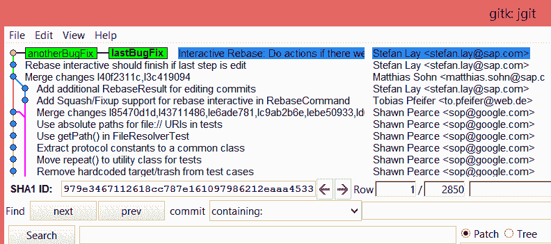
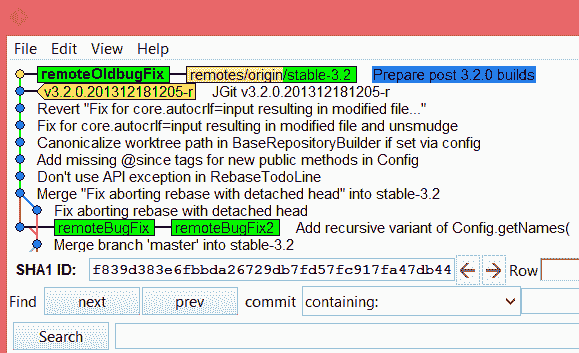
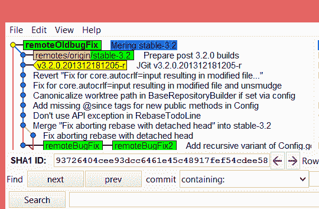
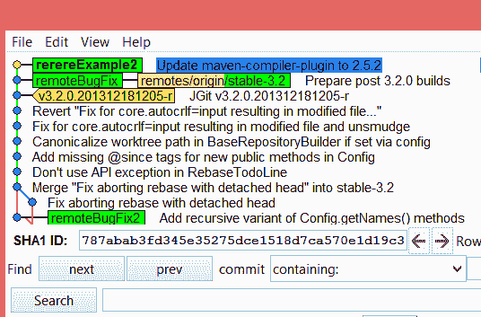

# 第三章：分支、合并和选项

在本章中，我们将介绍以下几种方法：

+   管理你的本地分支

+   带有远程的分支

+   强制合并提交

+   使用 Git 重用已记录的解决方案（rerere）来合并 Git 冲突

+   计算分支之间的差异

+   孤立分支

# 介绍

如果你在大公司作为开发者开发一个小型应用，或者你正在尝试理解一个来自 GitHub 的开源项目，你已经在使用 Git 的分支功能了。

大多数时候，你可能只是一直在本地的开发分支或主分支上工作，因此没有太在意其他分支。

在本章中，我们将展示不同类型的分支以及如何使用它们。

# 管理你的本地分支

假设你只有本地 Git 仓库，并且目前没有分享代码给其他人的计划；不过，你仍然可以轻松地将你在与仓库合作时所获得的知识分享给一个或多个远程仓库。没有远程的本地分支正是这样工作的。如你所见，在示例中，我们正在克隆一个仓库，因此我们有一个远程。

我们从创建几个本地分支开始。

# 准备工作

使用以下命令克隆 `jgit` 仓库以进行匹配：

```
$ git clone https://git.eclipse.org/r/jgit/jgit 
$ cd jgit 
```

# 如何操作...

执行以下步骤来管理你的本地分支：

1.  每当你开始修复 Bug 或开发新特性时，都应该创建一个分支。你可以使用以下代码做到这一点：

```
$ git branch newBugFix 
$ git branch 
* master 
 newBugFix 
```

1.  `newBugFix` 分支指向创建时你所处的当前 `HEAD`。你可以通过 `git log -1` 查看 `HEAD`：

```
$ git log -1 newBugFix --format=format:%H 
25fe20b2dbb20cac8aa43c5ad64494ef8ea64ffc 
```

1.  如果你想为分支添加描述，可以使用 `git branch` 命令的 `--edit-description` 选项来做到这一点：

```
$ git branch --edit-description newBugFix
```

1.  上一个命令会打开一个编辑器，你可以在其中输入描述：

```
Refactoring the Hydro controller 

The hydro controller code is currently horrible needs to be refactored.  
```

1.  关闭编辑器后，消息将被保存。

# 它是如何工作的...

Git 会将信息存储在本地的 `git config` 文件中；这也意味着你无法将这些信息推送到远程仓库。

要检索分支的描述，你可以使用 `git config` 命令的 `--get` 标志：

```
$ git config --get branch.newBugFix.description 
Refactoring the Hydro controller 

The hydro controller code is currently horrible and needs to be refactored.  
```

这将在我们在 第七章 中自动化一些任务时非常有帮助，*通过 Git Hooks、*别名* 和脚本来提升你的日常工作*。

记得在开始工作之前先切换到 `newBugFix` 分支。这必须通过 Git 的 `checkout` 命令来完成。如果你着急，也可以通过一个命令来创建并切换到新分支。只需在 `checkout` 命令中加上 `-b` 选项。

分支信息会以文件的形式存储在 `.git/refs/heads/newBugFix` 中：

```
$ cat .git/refs/heads/newBugFix 
25fe20b2dbb20cac8aa43c5ad64494ef8ea64ffc 
```

请注意，这是我们通过 `git log` 命令获取的相同提交哈希。

# 还有更多内容...

也许你想从特定的提交哈希值创建特定的分支。你可能首先想到的是检出该提交，然后创建一个分支；然而，使用`git branch`命令直接创建分支而不检出提交要简单得多：

1.  如果你需要从特定的提交哈希值创建一个分支，可以使用`git branch`命令如下：

```
$ git branch anotherBugFix 979e346 
$ git log -1 anotherBugFix --format=format:%h 
979e346 

$ git log -1 anotherBugFix --format=format:%H 
979e3467112618cc787e161097986212eaaa4533 
```

1.  如你所见，当你使用`%h`时，显示的是简化的提交哈希，而当你使用`%H`时，显示的是完整的提交哈希。你可以看到，简化的提交哈希与用于创建分支的哈希相同。大多数情况下，你希望立即创建并开始在分支上工作：

```
$ git checkout -b lastBugFix 979e346 
Switched to a new branch 'lastBugFix' 
```

1.  Git 会在创建分支后立即切换到新分支。可以使用`gitk`验证是否已经切换到`lastBugFix`分支，并且另一个`BugFix`分支处于相同的提交哈希值：

```
$ gitk
```

这可以通过以下截图来展示：



1.  不使用 Gitk 时，你也可以在`git branch`命令中添加`-v`，甚至可以再加一个`-v`：

```
$ git branch -v 

 anotherBugFix 979e346 Interactive Rebase: Do actions if 
* lastBugFix    979e346 Interactive Rebase: Do actions if  
 master        25fe20b Add missing package import for jg 
 newBugFix     25fe20b Add missing package import for jg 
```

1.  使用`-v`，你可以查看每个分支的简化提交哈希，而使用`-vv`，你还可以看到`master`分支跟踪`origin/master`分支：

```
$ git branch -vv 

 anotherBugFix 979e346 Interactive Rebase: Do actions if e 
* lastBugFix    979e346 Interactive Rebase: Do actions if e 
 master        25fe20b [origin/master] Add missing package 
 newBugFix     25fe20b Add missing package import for g 
```

# 带有远程仓库的分支

在某个时刻，很可能你已经克隆了别人的仓库。这意味着你有一个关联的远程仓库。这个远程仓库通常被称为`origin`，因为它是源代码的来源。

在使用 Git 和远程仓库时，你将从 Git 中获得一些好处。

我们可以从`git status`开始，看看在与远程仓库交互时我们得到的结果。

# 准备就绪

按照以下步骤操作：

1.  我们将首先检查一个跟踪远程分支的本地分支：

```
$ git checkout -b remoteBugFix --track origin/stable-3.2 
Branch remoteBugFix set up to track remote branch stable-3.2 from origin. 
Switched to a new branch 'remoteBugFix'
```

1.  上一个命令创建并切换到`remoteBugFix`分支，该分支将跟踪`origin/stable-3.2`分支。因此，例如，执行`git status`将自动显示你的分支与`origin/stable-3.2`的差异，并且它还会显示你的分支`HEAD`是否可以快速前移到远程分支的`HEAD`。

1.  为了提供一个如何执行前一步骤的示例，我们需要做一些手动操作来模拟这种情况。首先，我们找到一个提交：

```
$ git log -10 origin/stable-3.2 --oneline 
f839d383e (HEAD -> remoteBugFix, origin/stable-3.2) Prepare post 3.2.0 builds
699900c30 (tag: v3.2.0.201312181205-r) JGit v3.2.0.201312181205-r
0ff691cdb Revert "Fix for core.autocrlf=input resulting in modified file..."
1def0a125 Fix for core.autocrlf=input resulting in modified file and unsmudge
0ce61caef Canonicalize worktree path in BaseRepositoryBuilder if set via config
be7942f2b Add missing @since tags for new public methods in Config
ea04d2329 Don't use API exception in RebaseTodoLine
3a063a0ed Merge "Fix aborting rebase with detached head" into stable-3.2
e90438c0e Fix aborting rebase with detached head
2e0d17885 Add recursive variant of Config.getNames() methods 
```

1.  该命令将列出`stable-3.2`分支的最后 10 个提交，这些提交来自远程的`origin`。`--oneline`选项将显示简化的提交哈希和提交主题。对于这个例子，我们将使用以下提交：

```
$ git reset --hard 2e0d178 
HEAD is now at 2e0d178 Add recursive variant of Config.getNames() methods 
```

1.  这将重置`remoteBugFix`分支到`2e0d178`提交哈希值。现在我们已经准备好继续使用 Git 的免费功能，当我们有远程跟踪分支时。

我们正在重置到一个可以从`origin/stable-3.2`远程跟踪分支访问的提交；这样做是为了模拟我们已经执行了 Git fetch 并下载了`origin/stable-3.2`分支的新提交。

# 如何操作...

在这里，我们将尝试一些命令，帮助你在有远程跟踪分支时操作：

1.  从执行`git status`开始：

```
$ git status 

On branch remoteBugFix 
Your branch is behind 'origin/stable-3.2' by 9 commits, and can be fast-forwarded. 
 (use "git pull" to update your local branch) 

 nothing to commit, working directory clean 
```

当你有一个跟踪分支并使用`git status`时，Git 会非常详细地描述当前状态。

从消息中你可以看到，可以使用`git pull`来更新你的本地分支，我们将在下一个示例中尝试这个。消息说它可以进行快进合并。这意味着 Git 可以在不进行合并的情况下推进`HEAD`。现在，我们将执行合并操作：

`git pull`命令实际上是一个`git fetch`命令，接着是一个与远程跟踪分支的`git merge`命令。

```
$ git merge origin/stable-3.2 

Updating 2e0d178..f839d38 
Fast-forward 
 .../org/eclipse/jgit/api/RebaseCommandTest.java    | 213 +++++++++++ 
 .../src/org/eclipse/jgit/api/RebaseCommand.java    |  31 +-- 
 .../jgit/errors/IllegalTodoFileModification.java   |  59 ++++++ 
 .../eclipse/jgit/lib/BaseRepositoryBuilder.java    |   2 +- 
 .../src/org/eclipse/jgit/lib/Config.java           |   2 +
 .../src/org/eclipse/jgit/lib/RebaseTodoLine.java   |  16 +- 
 6 files changed, 266 insertions(+), 57 deletions(-) 
 create mode 100644 org.eclipse.jgit/src/org/eclipse/jgit/errors/IllegalTodoFileModification.java
```

1.  从输出中你可以看到，这是一个快进合并，就像 Git 预测的那样。

    `git status`的输出。

# 还有更多...

你还可以向现有分支添加远程，这在你意识到其实想要一个远程跟踪分支，但在创建分支时忘记添加跟踪信息时非常有用：

1.  从`2e0d17`提交开始创建一个本地分支：

```
$ git checkout -b remoteBugFix2 2e0d17 
Switched to a new branch 'remoteBugFix2' 
```

1.  `remoteBugFix2`分支目前只是一个本地分支，没有跟踪信息；要设置跟踪分支，我们需要使用`--set-upstream-to`或`-u`作为`git branch`命令的标志：

```
$ git branch --set-upstream-to origin/stable-3.2 
Branch remoteBugFix2 set up to track remote branch stable-3.2 from origin. 
```

1.  从 Git 输出中可以看到，我们现在正在跟踪`origin`的`stable-3.2`分支：

```
$ git status 
On branch remoteBugFix2 
Your branch is behind 'origin/stable-3.2' by 9 commits, and can be fast-forwarded. 
 (use "git pull" to update your local branch) 
nothing to commit, working directory clean 
```

1.  从 Git 输出中你可以看到你领先了九次提交，你可以使用`git pull`来更新分支。记住，`git pull`命令实际上是一个`git fetch`命令，接着是一个与上游分支的`git merge`命令，我们也称之为远程跟踪分支：

```
$ git pull 

Updating 2e0d17885..f839d383e
Fast-forward
 org.eclipse.jgit.test/tst/org/eclipse/jgit/api/RebaseCommandTest.java | 213 +++++++++++++++++++++++++++++++++++++++++++++++++++++++++++++++++++++++++++++++----------------
 org.eclipse.jgit/src/org/eclipse/jgit/api/RebaseCommand.java | 31 ++++++++------
 org.eclipse.jgit/src/org/eclipse/jgit/errors/IllegalTodoFileModification.java | 59 +++++++++++++++++++++++++++
 org.eclipse.jgit/src/org/eclipse/jgit/lib/BaseRepositoryBuilder.java | 2 +-
 org.eclipse.jgit/src/org/eclipse/jgit/lib/Config.java | 2 +
 org.eclipse.jgit/src/org/eclipse/jgit/lib/RebaseTodoLine.java | 16 ++++----
 6 files changed, 266 insertions(+), 57 deletions(-)
 create mode 100644 org.eclipse.jgit/src/org/eclipse/jgit/errors/IllegalTodoFileModification.java
```

1.  从输出中可以看到，分支已被快进到`f839d383e`提交哈希，相当于`origin/stable-3.2`。你可以使用`git log`验证这一点：

```
$ git log -1 origin/stable-3.2  --format=format:%h 
f839d383e 
```

# 强制合并提交

在阅读本书之前，你可能已经见过很多关于软件交付链和分支模型的基本示例。很可能你已经尝试过使用不同的策略，但发现没有一种完全支持你的场景，这完全没问题，只要工具能够支持你特定的工作流。

Git 支持几乎所有的工作流。我们经常遇到在合并功能时需要一个合并提交的情况，尽管可以使用快进合并来完成。那些请求合并提交的人通常是为了表明你确实合并了某个功能，并希望将该信息存储在仓库中。

Git 可以快速访问所有的提交信息，因此代码仓库应当作为日志使用，而不仅仅是源代码的备份。

# 准备工作

从`origin/stable-3.1`跟踪的本地分支`remoteOldbugFix`开始：

```
$ git checkout -b remoteOldBugFix --track origin/stable-3.1 
Branch remoteOldBugFix set up to track remote branch stable-3.1 from Switched to a new branch 'remoteOldBugFix' 
```

# 如何操作...

以下步骤将向你展示如何强制进行合并提交：

1.  要强制进行合并提交，你需要使用`--no-ff`标志；*no-ff*表示不进行快进合并。我们还将使用`--quiet`标志来最小化输出，并使用`--edit`来允许我们编辑提交信息。除非你有合并冲突，否则 Git 会自动为你创建合并提交：

```
$ git merge origin/stable-3.2 --no-ff --edit --quiet 

Auto-merging org.eclipse.jgit.test/tst/org/eclipse/jgit/test/resources/SampleDat 
Removing org.eclipse.jgit.test/tst/org/eclipse/jgit/internal/storage/file/GCTe 
Auto-merging org.eclipse.jgit.packaging/org.eclipse.jgit.target/jgit-4.3.target 
```

1.  提交消息编辑器将会打开，你可以写下提交消息。关闭编辑器后会创建合并提交，完成操作。

1.  为了验证这一点，你可以重置回`origin/stable-3.1`并在没有`--no-ff`标志的情况下进行合并：

```
$ git reset --hard  remotes/origin/stable-3.1 
HEAD is now at da6e87b Prepare post 3.1.0 builds 
```

1.  现在，使用以下命令执行合并：

```
$ git merge origin/stable-3.2 --quiet
```

1.  你可以通过 Gitk 查看差异。以下截图显示了快速前进合并；如你所见，我们的`remoteOldBugFix`分支指向`origin/stable-3.2`：



1.  下一张截图展示了我们强制 Git 创建的合并提交。我们的分支`remoteOldBugFix`领先于`remotes/origin/stable-3.2`，然后我们进行了提交：



# 还有更多...

尽管大多数分支场景期望你完全合并分支，但在实际环境中，仍然有一些情况，只需要将一个分支中的特定部分合并到另一个分支中。使用`--no-commit`选项，Git 将会执行合并并在提交前停止，允许你在提交之前修改并添加文件到合并提交中。

例如，我们一直在处理这样的项目：字符串版本在功能分支中更新了，但在主分支中没有更新。因此，自动合并到主分支时，将会替换主分支当前使用的版本字符串，而这在本例中并非我们的意图。在接下来的示例中，我们将使用一个简单的 Git 仓库，里面有几个提交和文件：

1.  首先，检查出一个本地的`remotePartlyMerge`分支，该分支跟踪`origin/release/1.0`：

```
$ git clone https://github.com/PacktPublishing/Git-Version-Control-Cookbook-Second-Edition_hello_world_flow_model.git
$ cd Git-Version-Control-Cookbook-Second-Edition_hello_world_flow_model $ git checkout -b remotePartlyMerge --track origin/release/1.0 Branch remotePartlyMerge set up to track remote branch release/1.0 from origin. 
Switched to a new branch 'remotePartlyMerge'
```

1.  然后，为了创建合并并允许你决定哪些内容将成为提交的一部分，你可以使用`--no-commit`选项：

```
$ git merge origin/master  --no-ff --no-commit 
 Automatic merge went well; stopped before committing as requested 
```

1.  再次强调，Git 提供了非常详细的信息；从输出中可以看到，一切正常，并且 Git 在提交之前按照要求停止了。接下来，假设我们不希望`LICENSE`文件成为合并提交的一部分。

    为了实现这一点，我们使用`git reset <path>`命令重置了目录：

```
$ git reset LICENSE
```

1.  从输出中你可以看到，重置后有未暂存的更改；这正是我们想要的。你可以通过运行`git status`查看有哪些未暂存的更改。现在，我们将完成合并：

```
$ git commit -m "Merging without LICENSE" 
[remotePartlyMerge f138175] Merging without LICENSE 
```

1.  合并提交已完成。如果现在运行`git status`命令，你仍然会看到工作区中有未暂存的更改。为了验证结果是否如预期，我们可以使用`git diff`计算差异，显示文件与`origin/master`分支上的文件一致，排除`LICENSE`文件：

```
$ git diff origin/master !(LICENSE)
```

1.  `diff`没有任何输出，这是预期的结果。我们告诉`diff`命令将当前的`HEAD`提交与分支`origin/master`进行`diff`，并且我们不关心`LICENSE`中的差异。

如果你没有指定`HEAD`，你将会与当前的`WA`进行`diff`，并且由于有未暂存的更改，`diff`命令会产生很多输出。

# 使用 Git 重用已记录的解决方案（rerere）来合并 Git 冲突

在处理功能分支时，你可能喜欢每天合并一次，甚至更频繁。但是，当你在长期存在的功能分支上工作时，你会发现自己处于一个不断出现相同冲突的局面。

在这里，你可以使用`git rerere`，它代表*重用记录的解决方案*。`git rerere`默认是未启用的，但可以通过以下命令启用：

```
$ git config rerere.enabled true
```

你可以通过将`--global`添加到`git config`命令来全局配置它。

# 怎么做...

执行以下步骤来合并已知的冲突：

1.  在`jgit`仓库文件夹中，首先检出一个跟踪`origin/stable-2.2`的分支：

```
$ git checkout -b rerereExample --track origin/stable-2.2 
```

1.  现在，将 maven-compiler-plugin 版本更改为个性化的版本，比如 2.5.2，因为这是`pom.xml`中的第 211 行。如果你运行`git diff`，你应该会看到类似下面的结果：

```
$ git diff 

diff --git a/pom.xml b/pom.xml 
index 085e00f..d5aec17 100644 
--- a/pom.xml 
+++ b/pom.xml 
@@ -208,7 +208,7 @@ 
 <plugin> 
 <artifactId>maven-compiler-plugin</artifactId> 
-          <version>2.5.1</version> 
+          <version>2.5.2</version> 
 </plugin>  

 <plugin> 
```

1.  现在添加文件并创建一个提交：

```
$ git add pom.xml 
$ git commit -m "Update maven-compiler-plugin to 2.5.2" 
[rerereExample d474848] Update maven-compiler-plugin to 2.5.2 
 1 file changed, 1 insertion(+), 1 deletion(-) 
```

1.  将当前提交存储在一个名为`rerereExample2`的备份分支中：

```
$ git branch rerereExample2 
```

在这里，`git branch rerereExample2`只是将当前提交存储为一个分支，因为我们需要用它来做第二个 rerere 示例。

1.  现在，我们需要执行第一次合并，这次合并将会在自动合并时失败。然后我们可以解决这个问题。解决后，我们可以复用合并的解决方案，以后遇到相同的问题时可以再次使用：

```
$ git merge --no-ff v3.0.2.201309041250-rc2 

A lot of output ... 

Automatic merge failed; fix conflicts and then commit the result. 
```

1.  由于我们启用了`git rerere`，我们可以使用`git rerere status`来查看哪些文件或路径将被记录：

```
$ git rerere status 
pom.xml 
```

1.  编辑`pom.xml`文件（大约在第 229 行），解决合并冲突，使其得到如下所示的`diff`输出。你需要删除包含 3.1 的行和合并标记：

合并标记是以`<<<<<<`、`>>>>>>`或`======`开头的行；这些行标记了 Git 无法自动合并的地方。

```
$ git diff v3.0.2.201309041250-rc2 pom.xml 

diff --git a/pom.xml b/pom.xml 
index 60cb0c8..faa7618 100644 
--- a/pom.xml 
+++ b/pom.xml 
@@ -226,7 +226,7 @@ 

 <plugin> 
 <artifactId>maven-compiler-plugin</artifactId> 
-          <version>3.1</version> 
+          <version>2.5.2</version> 
 </plugin> 

 <plugin>
```

1.  使用`git add`将`pom.xml`添加到暂存区，然后运行`git commit`来完成合并，标记合并为完成：

```
$ git commit 
Recorded resolution for 'pom.xml'. 
[rerereExample 9b8725f] Merge tag 'v3.0.2.201309041250-rc2' into rerereExample 
```

1.  注意 Git 记录的`pom.xml`输出的解决方案；如果没有启用`git rerere`，这里是不会出现的。Git 已经记录了这个特定合并冲突的解决方案，并且会记录如何解决这个冲突。现在，我们可以尝试将更改进行`rebase`到另一个分支。

1.  从我们的仓库中检出`rerereExample2`分支：

```
$ git checkout rerereExample2 

Switched to branch 'rerereExample2' 
```

1.  尝试将你的更改基于`origin/stable-3.2`分支进行`rebase`：

```
$ git rebase origin/stable-3.2 
First, rewinding head to replay your work on top of it...
Applying: Update maven-compiler-plugin to 2.5.2
Using index info to reconstruct a base tree...
M pom.xml
Falling back to patching base and 3-way merge...
Auto-merging pom.xml
CONFLICT (content): Merge conflict in pom.xml
Resolved 'pom.xml' using previous resolution.
error: Failed to merge in the changes.
Patch failed at 0001 Update maven-compiler-plugin to 2.5.2
The copy of the patch that failed is found in: .git/rebase-apply/patch

Resolve all conflicts manually, mark them as resolved with
"git add/rm <conflicted_files>", then run "git rebase --continue".
You can instead skip this commit: run "git rebase --skip".
To abort and get back to the state before "git rebase", run "git rebase --abort".
```

1.  你应该注意到以下输出：

```
CONFLICT (content): Merge conflict in pom.xml 
Resolved 'pom.xml' using previous resolution
```

1.  由于合并冲突发生在`pom.xml`中，Git 可以自动解决该文件中的冲突。你可以通过打开文件并看到没有合并标记来清楚地看到这一点，因为 Git 已应用记录的解决方案。完成合并后，添加`pom.xml`并继续`rebase`：

```
$ git add pom.xml  
$ git rebase --continue 
Applying: Update maven-compiler-plugin to 2.5.2 
```

1.  启动 Gitk 以查看提交是否已经在`origin/stable-3.2`分支之上进行了`rebase`：



你可以尝试相同的场景进行合并，Git 将自动为你合并该文件。

# 还有更多...

当你经常合并不同的分支时，如果你不确定某个特定错误修复属于哪个分支，实际上很容易找出：

1.  你需要找到一个提交，然后使用 `git branch` 命令的 `--contains` 标志获取这个信息：

```
$ git branch --contains 699900c308 

 anotherBugFix 
 lastBugFix 
 master 
 newBugFix 
 remoteBugFix 
 remoteBugFix2 
 remoteOldbugFix 
* rerereExample2 
```

1.  上述命令列出了所有包含特定提交的分支。如果省略提交参数（`8e2886897`），Git 会检查 `HEAD`。例如，检出 `rerereExample2` 分支并执行以下命令，你会看到该提交只出现在该分支上：

```
$ git checkout rerereExample2 
Switched to branch 'rerereExample2' 

$ git branch -a --contains 
* rerereExample2 
```

`-a` 选项表示你希望检查所有的远程分支。如果省略该选项，它只会检查本地分支。

然而，正如你所看到的，我们的提交不在任何远程分支上，因为该提交刚刚在本地创建，并且尚未推送到任何远程仓库。

你可以在使用 `git branch -a --contains` 命令时使用标签、分支名称或提交哈希。

1.  让我们尝试查看 `v2.3.0.201302130906` 标签存在的分支：

```
$ git branch -a --contains v2.3.0.201302130906 

 anotherBugFix 
 lastBugFix 
 master 
 newBugFix 
 remoteBugFix 
 remoteBugFix2 
 remoteOldbugFix 
 remotePartlyMerge 
* rerereExample2 
 remotes/origin/HEAD -> origin/master 
 remotes/origin/master 
 remotes/origin/stable-2.3 
 remotes/origin/stable-3.0 
 remotes/origin/stable-3.1 
 remotes/origin/stable-3.2 

... and many more
```

该标签可以在许多分支中找到。

# 计算分支之间的差异

在合并之前，检查分支之间的差异可以提供有价值的信息。

一个常规的 `git diff` 可以显示两个分支之间的所有差异信息，但它可能非常冗长，也许你只关心某一个文件。因此，你不需要查看长的统一差异。

# 准备开始

首先，我们决定想要查看差异的两个分支、标签或提交。然后，为了列出这两个分支之间有变化的文件，你可以使用 `--name-only` 标志。

# 如何操作...

执行以下步骤以查看分支之间的差异：

1.  将 `origin/stable-3.1` 与 `origin/stable-3.2` 分支进行差异比较：

```
$ git diff --name-only origin/stable-3.1 origin/stable-3.2 org.eclipse.jgit/src/org/eclipse/jgit/transport/org.eclipse.jgit/src/org/eclipse/jgit/transport/BasePackFetch 

More output.. 
```

1.  我们按照这个模式构建命令，即 `git diff [options] <commit> <commit> <path>`。然后，我们可以在查看分支之间的差异时，专注于我们关心的部分。这对于负责源代码某一子集的人非常有用，你只需查看该区域的差异。

1.  让我们尝试在两个分支之间执行相同的差异比较，但这次我们将对整个分支进行比较，而不仅仅是一个子目录；不过，我们只想显示分支之间被删除或添加的文件。通过使用 `--diff-filter=DA` 和 `--name-status` 选项可以做到这一点。`--name-status` 选项只会显示文件名和变化类型，`--diff-filter=DA` 选项只会显示删除和添加的文件：

```
$ git diff --name-status --diff-filter=DA origin/stable-3.1 origin/stable-3.2 

A org.eclipse.jgit.packaging/org.eclipse.jgit.target/jgit-4.4.target
A org.eclipse.jgit.pgm.test/tst/org/eclipse/jgit/pgm/DescribeTest.java
A org.eclipse.jgit.pgm.test/tst/org/eclipse/jgit/pgm/FetchTest.java
A org.eclipse.jgit.pgm/src/org/eclipse/jgit/pgm/Describe.java
A org.eclipse.jgit.test/tst/org/eclipse/jgit/api/DescribeCommandTest.java
A org.eclipse.jgit.test/tst/org/eclipse/jgit/api/Sets.java
D org.eclipse.jgit.test/tst/org/eclipse/jgit/internal/storage/file/GCTest.java

 More output.. 
```

1.  这显示了在从 `origin/stable-3.1` 到 `origin/stable-3.2` 的过程中被添加和删除的文件。

1.  如果我们交换分支，如以下命令所示，我们将得到相反的结果：

```
$ git diff --name-status --diff-filter=DA origin/stable-3.2 origin/stable-3.1 

D org.eclipse.jgit.packaging/org.eclipse.jgit.target/jgit-4.4.target
D org.eclipse.jgit.pgm.test/tst/org/eclipse/jgit/pgm/DescribeTest.java
D org.eclipse.jgit.pgm.test/tst/org/eclipse/jgit/pgm/FetchTest.java
D org.eclipse.jgit.pgm/src/org/eclipse/jgit/pgm/Describe.java
D org.eclipse.jgit.test/tst/org/eclipse/jgit/api/DescribeCommandTest.java
D org.eclipse.jgit.test/tst/org/eclipse/jgit/api/Sets.java
A org.eclipse.jgit.test/tst/org/eclipse/jgit/internal/storage/file/GCTest.java

 More output.. 
```

请注意，字母 A 和 D 交换了位置，因为现在我们想知道如果从 `origin/stable-3.2` 切换到 `origin/stable-3.1` 会发生什么。

# 孤立分支

现在你已经熟悉了 Git 的数据模型——有向无环图（DAG）。你已经看到对象有一个父对象。当你创建一个新分支时，提交就是它的父对象。然而，在某些情况下，拥有一个没有父分支的分支是非常有用的。

一个例子是，当你有两个独立的代码库，但出于某种原因，现在想要将它们合并到一个库中。一种方法是直接复制文件并将其添加到其中一个仓库，但缺点是你会丢失历史记录。第二种方法是使用孤立分支，它可以帮助你将一个仓库的内容拉取到另一个仓库中。

# 准备工作

其实创建孤立分支并不难。使用`--orphan`标志与`checkout`命令就可以实现。执行方法如下：

```
$ git clone https://github.com/PacktPublishing/Git-Version-Control-Cookbook-Second-Edition.git
$ cd Git-Version-Control-Cookbook-Second-Edition $ git checkout --orphan fresh-start
Switched to a new branch 'fresh-start'
```

# 如何操作...

1.  现在我们有一个没有父分支的分支。你可以通过检查提交日志来验证这一点，如下所示：

```
$ git log
fatal: your current branch 'fresh-start' does not have any commits yet
```

`全新开始`并不意味着你从头开始。已经添加到仓库中的文件和目录仍然存在：

```
$ ls
README.md a_sub_directory another-file.txt cat-me.txt hello_world.c
$ git status
On branch fresh-start

No commits yet

Changes to be committed:
 (use "git rm --cached <file>..." to unstage)

 new file: README.md
 new file: a_sub_directory/readme
 new file: another-file.txt
 new file: cat-me.txt
 new file: hello_world.c
```

1.  如果你需要一个全新的开始，可以删除文件（但记得不要删除`.git`），方法如下：

```
$ git rm --cached README.md a_sub_directory/readme another-file.txt cat-me.txt hello_world.c
$ rm -rf README.md a_sub_directory another-file.txt cat-me.txt hello_world.c
$ git status
On branch fresh-start

No commits yet

nothing to commit (create/copy files and use "git add" to track)
```

1.  你有一个没有文件和提交的分支。此外，该分支与`master`分支没有任何提交历史记录。你可以通过`git remote add`和`git fetch`将另一个仓库添加到该分支并拉取所有提交记录。但我们将通过简单地添加一个文本文件来说明这一点，如下所示：

```
$ echo "This is from an orphan branch." > orphan.txt
$ git add orphan.txt
$ git commit  -m "Orphan"
```

提交是你可以通过`git log`命令验证的历史记录中的唯一内容。如果你将另一个仓库拉取到该分支中，你将看到所有的提交记录，最重要的是，你将拥有该仓库历史的副本。

1.  一旦你在孤立分支上完成提交，就该将它们合并到主分支上了。然而，你的第一次尝试会失败。例如，检查如下内容：

```
$ git checkout master
$ git merge fresh-start
fatal: refusing to merge unrelated histories
```

1.  正如你所见，孤立分支与主分支没有共享历史记录，git 将不允许你合并该分支。这不应该让你感到意外，因为孤立分支的基本特征就是如此。不过，你仍然可以通过允许合并不相关的历史记录来合并孤立分支：

```
$ git merge fresh-start --allow-unrelated-histories
$ git log -3
commit aa804347c728552f7ce9298a83ab646148078dab (HEAD -> master)
Merge: 13dcada 45d1798
Author: John Doe <john.doe@example.com>
Date: Fri May 11 08:57:45 2018 +0200

Merge branch 'fresh-start'

commit 45d179838f8f9f8fd64c6c7bf96147e09ceadbc2 (fresh-start)
Author: John Doe <john.doe@example.com>
Date: Fri May 11 08:57:22 2018 +0200

Orphan

commit 13dcada077e446d3a05ea9cdbc8ecc261a94e42d (origin/master, origin/HEAD)
Author: John Doe <john.doe@example.com>
Date: Fri Dec 13 12:26:00 2013 +0100

This is the subject line of the commit message

... and more output
```

虽然你不太可能每天都使用孤立分支，但当你需要重组代码库时，它是一个很强大的功能，值得掌握。

# 还有更多内容...

Git 的帮助文件中有更多选项。只需运行`git merge --help`或`git branch --help`即可查看其他可用的选项。
