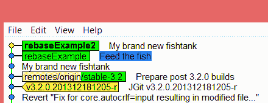
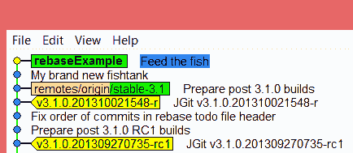
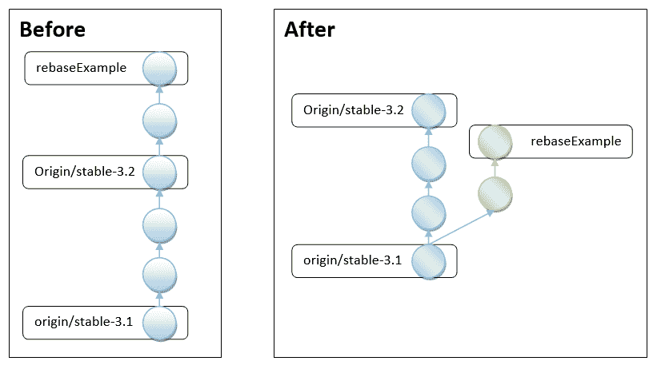
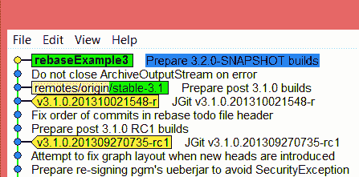

# 定期和交互式变基，及其他使用场景

在本章中，我们将介绍以下操作：

+   将提交变基到另一个分支

+   继续处理合并冲突的变基操作

+   交互式变基选定提交

+   使用交互式变基压缩提交

+   使用变基更改提交的作者

+   自动压缩提交

# 介绍

变基是一个非常强大的 Git 功能。希望你之前已经使用过它；如果没有，你也许听说过它。变基正如它的字面意思。如果你有一个基于提交`B`的提交`A`，那么将`A`变基到`C`，最终结果就是提交`A`基于提交`C`。

正如你将在本章的不同示例中看到的那样，情况并不总是那么简单。

# 将提交变基到另一个分支

首先，我们将执行一个非常简单的变基操作，在这个过程中，我们将引入一个新文件，提交该文件，对其进行修改，然后再次提交，这样我们最终会得到两个新的提交。

# 准备工作

在开始之前，我们需要一个可以操作的仓库。你可以使用之前克隆的`jgit`仓库，但为了得到与示例尽可能相同的输出，你可以克隆`jgit`仓库。

`jgit`仓库可以通过以下方式克隆：

```
$ git clone https://git.eclipse.org/r/jgit/jgit chapter4
$ cd chapter4
```

# 如何操作...

我们首先创建一个本地分支，然后通过以下步骤进行两个提交；这些提交是我们希望变基到另一个分支上的：

1.  检出一个新的分支`rebaseExample`，它跟踪`origin/stable-3.1`：

```
$ git checkout -b rebaseExample --track origin/stable-3.1
Branch rebaseExample set up to track remote branch stable-3.1  from origin.
Switched to a new branch 'rebaseExample'
```

1.  在`rebaseExample`分支上做两个提交，如下所示：

```
$ echo "My Fishtank

Gravel, water, plants
Fish, pump, skeleton" > fishtank.txt
$ git add fishtank.txt
$ git commit -m "My brand new fishtank"
[rebaseExample 4b2c2ec] My brand new fishtank
  1 file changed, 4 insertions(+)
   create mode 100644 fishtank.txt
$ echo "mosquitos" >> fishtank.txt
$ git add fishtank.txt
$ git commit -m "Feeding my fish"
[rebaseExample 2132d88] Feeding my fish
  1 file changed, 1 insertion(+)
```

1.  然后，我们将把更改变基到`origin/stable-3.2`分支上：

```
$ git rebase origin/stable-3.2
First, rewinding head to replay your work on top of it...
Applying: My brand new fishtank
Applying: Feed the fish
```

# 工作原理...

当你执行`git rebase`时，Git 首先会查找当前`HEAD`分支和你希望变基的目标分支的公共祖先。当 Git 找到`merge-base`时，它会查找那些在目标分支中不可用的提交。Git 会逐个应用这些提交。

# 继续处理合并冲突的变基操作

当你将一个提交或分支变基到另一个`HEAD`上时，你可能最终会遇到冲突。

如果发生冲突，系统会要求你解决合并冲突，然后使用`git rebase --continue`继续变基操作。

# 如何操作...

我们将创建一个提交，将相同的`fishtank.txt`文件添加到`origin/stable-3.1`分支上；然后，我们将尝试将它变基到我们在*将提交变基到另一个分支*部分中创建的`rebaseExample`分支上：

1.  检出名为`rebaseExample2`的分支，它跟踪`origin/stable-3.1`：

```
$ git checkout -b rebaseExample2 --track origin/stable-3.1
Checking out files: 100% (212/212), done.
Branch rebaseExample2 set up to track remote branch stable-3.1 from origin.
Switched to a new branch 'rebaseExample2'
```

1.  在分支上进行提交：

```
$ echo "My Fishtank
Pirateship, Oister shell
Coconut shell
">fishtank.txt
$ git add fishtank.txt
$ git commit -m "My brand new fishtank"
[rebaseExample2 39811d6] My brand new fishtank
  1 file changed, 4 insertions(+)
create mode 100644 fishtank.txt
```

1.  尝试将分支变基到`rebaseExample`分支上：

```
$ git rebase rebaseExample
First, rewinding head to replay your work on top of it...
Applying: My brand new fishtank
Using index info to reconstruct a base tree...
<stdin>:12: new blank line at EOF.
  +
  warning: 1 line adds whitespace errors.
  Falling back to patching base and 3-way merge...
  Auto-merging fishtank.txt
  CONFLICT (add/add): Merge conflict in fishtank.txt
  Failed to merge in the changes.
  Patch failed at 0001 My brand new fishtank
  The copy of the patch that failed is found in:
    /Users/JohnDoe/repos/chapter4/.git/rebase-apply/patch

  When you have resolved this problem, run "git rebase --continue".
  If you prefer to skip this patch, run "git rebase --skip" instead.
  To check out the original branch and stop rebasing, run "git rebase --abort".
```

1.  你可以在你喜欢的编辑器中解决冲突。然后，使用`git add`将文件添加到索引，并继续进行变基操作。

```
$ git add fishtank.txt
$ git rebase --continue
Applying: My brand new fishtank
```

1.  现在，我们可以使用`gitk`检查我们的更改是否已经变基到`rebaseExample`分支上，如下图所示：



# 工作原理...

正如我们在第一个例子中所学到的，Git 会应用那些在你重新基准的目标分支中不存在的提交。在我们的例子中，只有我们自己创建的提交存在于`rebaseExample2`分支上。

# 还有更多内容…

你可能在失败的重新基准输出中注意到，你有两个额外的选项来处理提交。

当你解决了这个问题后，运行`git rebase --continue`。如果你希望跳过这个补丁，可以运行`git rebase --skip`。要检出原始分支并停止重新基准，运行`git rebase --abort`。

我们的第一个额外选项是完全忽略这个补丁并跳过它；你可以使用`git rebase --skip`来实现。在我们的例子中，这将导致我们的分支快进到`rebaseExample`分支。因此，我们的两个分支将指向相同的提交哈希值。

第二个选项是中止重新基准。如果我们选择这样做，我们将返回到重新基准开始之前的分支状态。可以使用`git rebase --abort`来实现。

# 交互式地重新基准选定的提交

当你在开发新特性并从旧版本分支出来时，你可能希望将此分支重新基准到最新的发布版本。当查看特性分支上的提交列表时，你可能会发现一些提交不适用于新的发布版本。在这种情况下，当你想要将分支重新基准到新版本时，你需要删除一些提交。这可以通过交互式重新基准来实现，Git 会给你选择你希望重新基准的提交的选项。

# 准备工作

要开始这个例子，你需要检查之前创建的分支`rebaseExample`；如果你没有这个分支，可以按照*将提交重新基准到另一个分支*部分的步骤操作，并使用以下命令：

```
$ git checkout rebaseExample
Switched to branch 'rebaseExample'
Your branch is ahead of 'origin/stable-3.1' by 109 commits.
(use "git push" to publish your local commits)
```

请注意，因为我们正在跟踪`origin/stable-3.1`，所以 Git 检出会告诉我们与该分支相比，我们超前了多少。

# 如何操作…

我们将尝试将当前分支`rebaseExample`重新基准到`origin/stable-3.1`分支，通过执行以下步骤。记住，Git 会应用那些在我们重新基准的目标分支上不存在的提交；因此，在这种情况下，会有很多提交：

1.  使用以下命令将分支重新基准到`origin/stable-3.1`：

```
$ git rebase --interactive origin/stable-3.1
```

1.  你现在看到的是所有将被重新基准到`origin/stable-3.1`分支上的提交列表。这些提交是`origin/stable-3.1`和`rebaseExample`分支之间的所有提交。提交将从上到下应用，因此提交会按相反的顺序列出——至少与 Git 中通常看到的顺序相反。这其实是有道理的。提交左侧有`pick`关键字，接着是简短的提交哈希值，最后是提交的标题。

如果你向下滚动到页面底部，你会看到类似以下内容的列表：

```
pick 43405e6 My brand new fishtank
pick 08d0906 Feed the fish
# Rebase da6e87b..08d0906 onto da6e87b
#
# Commands:
#  p, pick = use commit
#  r, reword = use commit, but edit the commit message
#  e, edit = use commit, but stop for amending
#  s, squash = use commit, but meld into previous commit
#  f, fixup = like "squash", but discard this commit's log message
#  x, exec = run command (the rest of the line) using shell
#
# These lines can be re-ordered; they are executed from top to bottom.
#
# If you remove a line here THAT COMMIT WILL BE LOST.
#
# However, if you remove everything, the rebase will be aborted.
#
# Note that empty commits are commented out
```

所以，如果我们只希望我们的`fishtank`提交基于`origin/stable-3.1`分支，那么我们应该移除所有提交，除了我们这两个提交。

1.  移除底部两个提交之外的所有行；暂时保持`pick`作为关键字。保存文件并关闭编辑器，Git 会给出以下信息：

```
Successfully rebased and updated refs/heads/rebaseExample.
```

1.  现在，使用`gitk`检查我们是否达到了预期的效果。下图展示了我们两个`fishtank`提交位于`origin/stable-3.1`分支之上。接下来的截图就是我们预期的效果：



# 还有更多...

事实上，使用一个简单的 Git 命令也可以实现相同的效果。我们已经将`origin/stable-3.2`分支的提交变基到`rebaseExample`分支，并将其合并到`origin/stable-3.2`分支。这也可以通过以下方式实现：

```
$ git rebase --onto origin/stable-3.1 origin/stable-3.2 rebaseExample
First, rewinding head to replay your work on top of it...
Applying: My brand new fishtank
Applying: Feed the fish
```

`--onto origin/stable-3.2`标志告诉 Git 变基到`origin/stable-3.2`，并且它必须从`origin/stable-3.1`分支到`rebaseExample`分支。因此，最终我们会得到`rebaseExample`分支位于`origin/stable-3.1`分支上，依此类推。下图展示了变基前的状态，其中我们有两个提交位于`origin/stable-3.2`之上，而变基后的状态是我们的提交位于`origin/stable-3.1`之上，正如我们所期望的那样：



# 使用交互式变基来压缩提交

当我在本地分支上工作时，我喜欢以小增量提交，每次提交都带上一些关于我所做工作的评论；然而，由于这些提交不能构建或通过任何测试要求，我无法逐个提交它们进行审查和验证。我必须在我的分支中将它们合并，但如果要逐一挑选我的修复，就必须挑选两倍数量的提交，这样做不太方便。

我们可以做的是变基并将提交压缩为一个提交，或者至少减少提交数量。

# 准备就绪

要开始这个示例，我们需要一个新的分支，即`rebaseExample3`，它跟踪`origin/stable-3.1`。使用以下命令创建该分支：

```
$ git checkout -b rebaseExample3 --track origin/stable-3.1
Branch rebaseExample3 set up to track remote branch stable-3.1 from origin.
Switched to a new branch 'rebaseExample3'
```

# 如何操作...

为了真正展示这个 Git 特性，我们将从`origin/stable-3.1`分支的六个提交开始。这是为了模拟我们刚刚在`rebaseExample3`分支上创建了六个提交；为此，请执行以下步骤：

1.  找到一个介于`origin/stable-3.1`和`origin/stable-3.2`之间的提交，并按逆序列出提交。或者，您可以滚动到底部，找到我们将使用的提交，如下所示：

```
$ git log origin/stable-3.1..origin/stable-3.2 --oneline --reverse
8a51c44 Do not close ArchiveOutputStream on error
3467e86 Revert "Close unfinished archive entries on error"
f045a68 Added the git-describe implementation
0be59ab Merge "Added the git-describe implementation"
fdc80f7 Merge branch 'stable-3.1'
7995d87 Prepare 3.2.0-SNAPSHOT builds
5218f7b Propagate IOException where possible when getting refs.
```

1.  将`rebaseExample3`分支重置为`5218f7b`提交；这将模拟在`origin/stable-3.1`分支上有六个提交。可以通过如下命令检查 Git 的状态来验证：

```
$ git reset --hard 5218f7b
HEAD is now at 5218f7b Propagate IOException where possible when getting refs.
$ git status
On branch rebaseExample3
Your branch is ahead of 'origin/stable-3.1' by 6 commits.
(use "git push" to publish your local commits)

nothing to commit, working directory clean
```

1.  现在，我们在`origin/stable-3.1`分支上有了这六个提交，我们希望将这些提交压缩成两个不同的提交。只需运行`git rebase --interactive`即可完成。请注意，我们没有指定要 rebase 到哪个分支，因为在创建分支时我们已经使用`--track`设置了跟踪分支。

为继续操作，让我们执行如下的 rebase 命令：

```
$ git rebase --interactive
pick 8a51c44 Do not close ArchiveOutputStream on error
pick f045a68 Added the git-describe implementation
pick 7995d87 Prepare 3.2.0-SNAPSHOT builds
pick 5218f7b Propagate IOException where possible when getting refs.
```

1.  编辑器将打开，你将看到四个提交，而不是你预期的六个。这是因为通常情况下，rebase 会拒绝将合并的提交作为 rebase 的一部分。虽然你可以使用`--preserve-merges`标志，但根据 Git 帮助文档，这并不推荐。

根据 Git 帮助文档，`--preserve-merges`并不是忽略合并，而是尝试重新创建它们。`--preserve-merges`标志内部使用`--interactive`机制，但通常不建议将其与`--interactive`选项显式结合使用，除非你知道自己在做什么（参见下面代码段中的 bug）。

1.  编辑文件，使其看起来如下所示：

```
pick 8a51c44 Do not close ArchiveOutputStream on error
squash f045a68 Added the git-describe implementation
pick 7995d87 Prepare 3.2.0-SNAPSHOT builds
squash 5218f7b Propagate IOException where possible when getting refs.
```

1.  记住，提交是按与 Git 日志相反的顺序列出的。所以，在压缩提交时，我们将提交合并到我们标记为`pick`的提交中。当你关闭编辑器时，Git 将从上到下开始 rebase。首先，应用`8a51c44`，然后将`f045a68`压缩到`8a51c44`提交中。这将打开提交信息编辑器，其中包含两个提交信息。你可以编辑提交信息，但现在我们只是关闭编辑器，以完成这两个提交的 rebase 和压缩操作。编辑器将再次打开，完成将`5218f7b`压缩到`7995d87`的操作。使用`gitk`验证结果。

以下截图符合预期；现在，我们只在`origin/stable-3.1`分支上有两个提交：



1.  如果查看`HEAD`提交的提交信息，你会看到它包含了两个提交的信息，如以下命令所示。这是因为我们决定在进行更改时不更改提交信息：

```
$ git log -1
commit 9c96a651ff881c7d7c5a3974fa7a19a9c264d0a0
Author: Matthias Sohn <matthias.sohn@sap.com>
Date:   Thu Oct 3 17:40:22 2013 +0200

 Prepare 3.2.0-SNAPSHOT builds

 Change-Id: Iac6cf7a5bb6146ee3fe38abe8020fc3fc4217584
 Signed-off-by: Matthias Sohn <matthias.sohn@sap.com>

 Propagate IOException where possible when getting refs.

 Currently, Repository.getAllRefs() and Repository.getTags() 
 silently
 ignores an IOException and instead returns an empty map. Repository
  is a public API and as such cannot be changed until the next major
  revision change. Where possible, update the internal jgit APIs to
  use the RefDatabase directly, since it propagates the error.

 Change-Id: I4e4537d8bd0fa772f388262684c5c4ca1929dc4c
```

# 还有更多内容...

现在我们已经压缩了两个提交，但我们本可以在编辑 rebase 的待办列表时使用其他关键字。

我们将尝试修复功能（fixup），它的工作方式类似于 squash 功能，通过执行以下步骤；唯一的区别是，Git 将使用`pick`关键字选择提交的提交信息：

1.  从重置回我们的起点开始：

```
$ git reset --hard 5218f7b
HEAD is now at 5218f7b Propagate IOException where possible when getting refs.
$ git status
On branch rebaseExample3
Your branch is ahead of 'origin/stable-3.1' by 6 commits.
(use "git push" to publish your local commits)

nothing to commit, working directory clean
```

1.  如你所见，我们已经回到了起点，即我们比`origin/stable-3.1`分支多了六个提交。现在我们可以尝试 fixup 功能。启动交互式 rebase 并根据以下输出更改文件。注意，你可以使用`f`代替`fixup`：

```
$ git rebase --interactive
pick 8a51c44 Do not close ArchiveOutputStream on error
f f045a68 Added the git-describe implementation
pick 7995d87 Prepare 3.2.0-SNAPSHOT builds
f 5218f7b Propagate IOException where possible when getting refs.
```

1.  一旦你关闭编辑器，你将看到 Git 显示变基的进度。正如预期的那样，提交信息编辑器不会打开。Git 会将变基操作合并到`origin/stable-3.1`分支的两个提交上。使用`git status`命令，你可以确认你现在有两个提交：

```
$ git status
On branch rebaseExample3
Your branch is ahead of 'origin/stable-3.1' by 2 commits.
  (use "git push" to publish your local commits)

nothing to commit, working tree clean
```

1.  另一个不同点是，我们用`fixup`标记的两个提交的提交信息已消失。所以，如果你将其与之前的示例进行比较，差异非常明显；差异可以通过以下命令查看：

```
$ git log -1    
commit c5bc5cc9e0956575cc3c30c3be4aecab19980e4d
Author: Matthias Sohn <matthias.sohn@sap.com>
Date:   Thu Oct 3 17:40:22 2013 +0200

 Prepare 3.2.0-SNAPSHOT builds

 Change-Id: Iac6cf7a5bb6146ee3fe38abe8020fc3fc4217584
 Signed-off-by: Matthias Sohn matthias.sohn@sap.com
```

1.  最后，我们还可以确认我们仍然拥有相同的源代码，但提交已发生变化。这可以通过使用以下命令，将此提交与通过`5218f7b`创建的提交进行比较来完成：

```
$ git diff 5218f7b
```

正如预测的那样，`git diff`没有输出，所以我们仍然保留着相同的源代码。

这个检查也可以在之前的示例中进行。

# 使用变基更改提交的作者

在开始一个新项目时，常常会忘记为该项目设置作者姓名和电子邮件地址。因此，你可能会在本地分支中看到一些使用错误的用户名和/或电子邮件 ID 进行提交的记录。

# 准备工作

在我们开始之前，我们需要一个分支，像 Git 中一样，创建一个名为`resetAuthorRebase`的分支，并使其跟踪`origin/master`。可以使用以下命令来完成：

```
$ git checkout -b resetAuthorRebase -t origin/master
Branch resetAuthorRebase set up to track remote branch 'master' from 'origin'.
Switched to a new branch 'resetAuthorRebase'
```

# 如何进行...

现在，我们想要将所有从`origin/stable-3.2`到我们的`HEAD`（即`master`）的提交作者进行更改。这只是一个示例；你通常不会需要更改已经发布到远程仓库的提交作者。

你可以通过使用`git commit --amend --reset-author`来更改`HEAD`提交的作者；然而，这只会更改`HEAD`的作者，并保持其余提交不变。我们将从更改`HEAD`提交的作者开始，然后通过执行以下步骤验证为什么这样做是错误的：

1.  如下所示更改`HEAD`提交的作者：

```
$ git commit --amend --reset-author
[resetAuthorRebase b0b2836] Update Kepler target platform to use Kepler SR2 orbit R-build
  1 file changed, 1 insertion(+), 1 deletion(-)
```

1.  使用 Git log 命令验证你是否已经更改了作者信息：

```
$ git log --format='format:%h %an <%ae>' origin/stable-3.2..HEAD
b0b2836 John Doe <john.doe@example.com>
b9a0621 Matthias Sohn <matthias.sohn@sap.com>
ba15d82 Matthias Sohn matthias.sohn@sap.com
```

1.  我们将列出从`origin/stable-3.2`到`HEAD`的所有提交，并定义一个格式，`%h`代表简短的提交哈希值，`%an`代表作者的名字，`%ae`代表作者的电子邮件地址。从输出中你可以看到，我现在是`HEAD`提交的作者，但我们真正想要的是更改所有提交的作者。为此，我们将基于`origin/stable-3.2`分支进行变基；然后，对于每个提交，我们将停止并修正作者。Git 可以通过`--exec`选项帮助我们完成大部分工作，具体命令如下：

```
$ git rebase --interactive --exec "git commit --amend --reset-author" origin/stable-3.2
pick b14a939 Prepare 3.3.0-SNAPSHOT builds
exec git commit --amend --reset-author
pick f2abbd0 archive: Prepend a specified prefix to all entry filenames
exec git commit --amend --reset-author
```

1.  如你所见，Git 为你打开了变基的待办列表，在每个提交之间，你都可以看到`exec`关键字和我们在命令行中指定的命令。如果有需要，你还可以在提交之间添加更多`exec`行。关闭编辑器将开始变基操作。

1.  如你所见，这个过程并不理想，因为每次都会打开提交消息编辑器，你必须关闭编辑器以让 Git 继续变基。要停止变基，请清空提交消息编辑器，Git 将返回到命令行；然后，你可以使用 `git rebase --abort`，如下所示：

```
Executing: git commit --amend --reset-author
Aborting commit due to empty commit message.
Execution failed: git commit --amend --reset-author
You can fix the problem, and then run

 git rebase --continue
$ git rebase --abort
```

为了实现我们真正想要的，你可以为 `git commit` 添加 `--reuse-message` 选项；这将重用你指定提交的提交消息。我们想要使用 `HEAD` 的消息，因为我们将其修改到 `HEAD` 提交。所以，再试一次，如下所示：

```
$ git rebase --interactive --exec "git commit --amend --reset-author --reuse-message=HEAD" origin/stable-3.2
Executing: git commit --amend --reset-author --reuse-message=HEAD
[detached HEAD 0cd3e87] Prepare 3.3.0-SNAPSHOT builds
 51 files changed, 291 insertions(+), 291 deletions(-)
 rewrite org.eclipse.jgit.java7.test/META-INF/MANIFEST.MF (62%)
 rewrite org.eclipse.jgit.junit/META-INF/MANIFEST.MF (73%)
 rewrite org.eclipse.jgit.pgm.test/META-INF/MANIFEST.MF (61%)
 rewrite org.eclipse.jgit.test/META-INF/MANIFEST.MF (76%)
 rewrite org.eclipse.jgit.ui/META-INF/MANIFEST.MF (67%)
    Executing: git commit --amend --reset-author --reuse-message=HEAD
    [detached HEAD faaf25e] archive: Prepend a specified prefix to all entry filenames
     5 files changed, 115 insertions(+), 1 deletion(-)
    Executing: git commit --amend --reset-author --reuse-message=HEAD
    [detached HEAD cfd743e] [CLI] Add option --millis / -m to debug-show-dir-cache c
    Command
    Successfully rebased and updated refs/heads/resetAuthorRebase.
```

1.  Git 提供了一个输出，表示操作成功；然而，为了验证这一点，你可以执行之前的 Git 日志命令，你应该看到所有提交的电子邮件地址都已经改变，如下所示：

```
$ git log --format='format:%h %an <%ae>' origin/stable-3.2..HEAD
9b10ff9 John Doe <john.doe@example.com>
d8f0ada John Doe <john.doe@example.com>
53df2b7 John Doe <john.doe@example.com>
```

# 它是如何工作的...

它按你预期的方式工作！有一点需要记住：当使用 `exec` 选项时，Git 会检查工作区中未暂存和已暂存的更改。请看以下命令行：

```
 exec echo rainy_day > weather_main.txt
 exec echo sunny_day > weather_california.txt
```

如果你像前面的命令那样有一行，第一次 `exec` 将被执行，接着你会在工作区有一个未暂存的更改。Git 会抱怨，你必须解决这个问题才能继续下一个 `exec`。

所以，如果你想做类似的事情，你必须创建一行执行所有你想做的操作的 `exec`。除此之外，变基功能相当简单；它只是尝试按变基待办列表中指定的顺序应用更改。Git 只会应用列表中指定的更改，因此，如果你移除其中的一些，它们将不会被应用。这是一种清理功能分支中不需要的提交的方法，比如调试过程中生成的提交。

# 自动合并提交

当我使用 Git 时，我经常为一个单独的 bug 修复创建许多提交，但在将修改推送到远程仓库时，我更喜欢——并且推荐——将 bug 修复作为一个提交来交付。这可以通过交互式变基来实现，但由于这应该是一个常见的工作流程，Git 提供了一个内置功能，叫做 autosquash，它可以帮助你将提交合并在一起。

# 准备工作

在我们开始这个操作之前，我们将从 `origin/master` 创建一个分支，以便准备将提交添加到我们的修复中。

我们从这样的例子开始：

```
$ git checkout -b readme_update_developer --track origin/master
Branch readme_update_developer set up to track remote branch master from origin.
Switched to a new branch 'readme_update_developer'
```

# 如何操作...

检查分支后，我们将创建我们想要合并其他提交的第一个提交。我们需要使用此提交的缩写提交哈希值，按照以下步骤自动创建其他将合并到此提交的提交：

1.  从将一些文本写入 `README.md` 开始：

```
$ echo "More information for developers" >> README.md
```

1.  这将为开发者向 `README.md` 添加更多信息；使用 Git 状态验证文件是否已更改，如下所示：

```
$ git status
On branch readme_update_developer
Your branch is up-to-date with 'origin/master'.

Changes not staged for commit:
 (use "git add <file>..." to update what will be committed)
 (use "git checkout -- <file>..." to discard changes in working directory)

            modified:   README.md

no changes added to commit (use "git add" and/or "git commit -a")
```

1.  现在，我们想要添加并提交这些更改。我们可以使用 `commit` 命令，并加上 `-a` 标志，这将把任何未暂存的更改加入提交，正如以下命令所示：

```
$ git commit -a -m "Updating information for developers"
[readme_update_developer d539645] Updating information for developers
 1 file changed, 1 insertion(+)
```

1.  创建提交后，请记住简短的提交哈希；我们已经在命令输出中以粗体标出了它。该简短哈希在你的环境中会有所不同，一旦完成练习，你应该会有自己的简短哈希。

1.  为了继续，我们将向分支添加三个提交，并希望将其中的两个与第一个提交进行 squash，正如以下命令所示：

```
$ echo "even More information for developers" >> README.md
$ git commit -a --squash=d539645 --no-edit
[readme_update_developer d62922d] squash! Updating information for developers
 1 file changed, 1 insertion(+)
```

1.  这是第一个提交。注意我们为什么需要存储第一个提交的简短哈希——我们将其与 `git commit` 的 `--squash` 选项一起使用。该选项会使用指定的提交主题来创建提交，同时会在主题开头加上 `squash!`，表示在执行 rebase 时 Git 应该 squash 该提交。现在，创建第二个提交，正如以下命令所示：

```
$ echo "even More information for developers" >> README.md
$ git commit -a --squash=d539645 --no-edit
[readme_update_developer 7d6194d] squash! Updating information for developers
 1 file changed, 1 insertion(+)
```

1.  我们添加了两个提交，并希望将它们与第一个提交一起 squash。在提交时，我还使用了 `--no-edit` 选项；该选项会跳过打开提交信息编辑器。如果不使用这个标志，编辑器将照常打开。不同之处在于，提交主题已经设置好，你只需要填写提交信息。现在，我们将创建最后一个提交，我们不希望将这个提交进行 squash：

```
$ echo "Adding configuration information" >> README.md
$ git commit -a -m "Updating information on configuration"
[readme_update_developer fd07857] Updating information on configuration
 1 file changed, 1 insertion(+)
```

1.  我们添加了最后一个提交，它与我们添加的前三个提交没有任何关系。这就是我们为什么没有使用 `--squash` 选项的原因。现在，我们可以使用 `git rebase -i` 将这些提交进行 squash：

```
$ git rebase -i
```

1.  你会在配置的提交编辑器中看到 rebase 的待办事项列表。我们原本期望 Git 会为我们想要 sqush 的提交配置 squash，正如以下命令所示：

```
pick d539645 Updating information for developers
pick d62922d squash! Updating information for developers
pick 7d6194d squash! Updating information for developers
pick fd07857 Updating information on configuration
```

1.  你可以看到，Git 已经将 `squash` 插入到两个提交的主题中，但除此之外，我们没有得到预期的结果。Git 要求你在 `git rebase -i` 命令中指定 `--autosquash`。关闭编辑器后，Git 将执行 rebase 操作，并给出以下输出：

```
Successfully rebased and updated refs/heads/readme_update_developer.
```

1.  让我们再试一次使用 `--autosquash`，看看 rebase 的待办事项列表会发生什么：

```
$ git rebase -i --autosquash
pick d539645 Updating information for developers
squash d62922d squash! Updating information for developers
squash 7d6194d squash! Updating information for developers
pick fd07857 Updating information on configuration
```

1.  现在，rebase 的待办事项列表看起来更符合我们的预期。Git 已经预先配置了待办事项列表，显示出它将会 squash 哪些提交，保留哪些提交。

1.  现在关闭待办事项列表将开始执行 rebase，但我们不想这样做（下一步会展示我们真正想要的结果）。如果你清空待办事项列表（删除所有行），然后保存并关闭编辑器，rebase 将会被中止。这正是我们想要的。输出将如下所示：

```
Nothing to do
```

1.  我们真正想要做的只是运行 `git rebase -i`，Git 会默认使用 `--autosquash`。这可以通过 `git config rebase.autosquash true` 来实现；试试看，然后运行 `git rebase -i`：

```
$ git config rebase.autosquash true
$ git rebase -i
```

1.  变基的待办事项列表弹出，我们得到了预期的结果，如下所示：

```
pick d539645 Updating information for developers
squash d62922d squash! Updating information for developers
squash 7d6194d squash! Updating information for developers
pick fd07857 Updating information on configuration
```

1.  现在关闭编辑器并允许变基开始。编辑器打开后，你可以更改合并消息的提交消息，如下命令所示：

```
# This is a combination of 3 commits.
# The first commit's message is:
Updating information for developers

# This is the 2nd commit message:

squash! Updating information for developers

# This is the 3rd commit message:

squash! Updating information for developers
```

1.  修改消息并关闭编辑器；Git 会继续进行变基操作并以以下消息结束：

```
[detached HEAD baadd53] Updating information for developers
 1 file changed, 3 insertions(+)
Successfully rebased and updated refs/heads/readme_update_developer.
Verify the commit log with git log -3
$ git log -3
commit 6d83d44645e330d0081d3679aca49cd9bc20c891
Author: John Doe <john.doe@example.com>
Date:   Wed May 21 10:52:03 2014 +0200

 Updating information on configuration

commit baadd53018df2f6f3cdf88d024c3b9db16e526cf
Author: John Doe <john.doe@example.com>
Date:   Wed May 21 10:25:43 2014 +0200

 Updating information for developers
commit 6d724dcd3355f09e3450e417cf173fcafaee9e08
Author: Shawn Pearce <spearce@spearce.org>
Date:   Sat Apr 26 10:40:30 2014 -0700
```

1.  正如预期的那样，我们现在在 `origin/master` 提交之上有两个提交。

希望这能帮助你在进行更改并提交时，但仍想将代码作为一个提交来交付。

# 还有更多...

如果你想避免像在 *自动压缩提交* 配方的第 17 步那样打开提交消息编辑器，可以使用 `--fixup=d539645`。这将使用第一个提交的提交消息，完全忽略其他提交中编写的消息。
