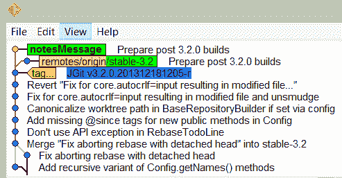

# 第五章：在你的仓库中存储附加信息

在本章中，我们将涵盖以下内容：

+   添加你的第一个 Git 备注

+   按类别分离备注

+   从远程仓库获取备注

+   将 Git 备注推送到远程仓库

+   在仓库中标记提交

# 介绍

Git 在许多方面都非常强大。Git 最强大的功能之一是它有不可变的历史记录。这非常强大，因为没有人可以在 Git 的历史中偷偷插入任何东西，所有克隆了该仓库的人都会注意到这一点。这也给开发者带来了一些挑战，因为有些开发者希望在提交发布后修改提交消息。在许多其他版本控制系统中这是可能的，但由于 Git 有不可变历史记录，它提供了 Git 备注。Git 备注本质上是 Git 中的一个额外的`refs/notes/commits`引用。在这里，你可以在提交中添加额外的信息，这些信息可以在运行`git log`命令时显示出来。你还可以将备注推送到远程仓库，以便其他人能够获取这些备注。

# 添加你的第一个 Git 备注

我们将为已发布的代码添加一些额外的信息。如果我们在实际的提交中做这件事，我们会看到提交哈希发生变化。

# 准备就绪

在开始之前，我们需要一个仓库来进行操作；你可以使用之前克隆的`jgit`，但为了获得几乎完全相同的输出，你可以按如下方式克隆`jgit`仓库：

```
$ git clone https://git.eclipse.org/r/jgit/jgit chapter5
$ cd chapter5  
```

# 如何做...

我们首先创建一个本地分支`notesMessage`，并跟踪`origin/stable-3.2`。

然后，我们将尝试修改提交消息，并看到提交哈希发生变化：

1.  切换到跟踪`origin/stable-3.2`的`notesMessage`分支：

```
$ git checkout -b notesMessage  --track origin/stable-3.2
Branch notesMessage set up to track remote branch stable-3.2 from origin.
Switched to a new branch 'notesMessage'
```

1.  列出分支的`HEAD`提交哈希：

```
$ git log -1
commit f839d383e6fbbda26729db7fd57fc917fa47db44
Author: Matthias Sohn <matthias.sohn@sap.com>
Date:   Wed Dec 18 21:16:13 2013 +0100

 Prepare post 3.2.0 builds

 Change-Id: Ie2bfdee0c492e3d61d92acb04c5bef641f5f132f
 Signed-off-by: Matthias Sohn <matthias.sohn@sap.com>
```

1.  通过使用`git commit --amend`修改提交消息，然后，在`Change-Id:`行上方添加一行`Update MANIFEST files`：

```
$ git commit --amend
```

1.  现在，我们再次列出提交，看到提交哈希已经变化：

```
$ git log -1
commit 5ccc9c90d29badb1bd860d29860715e0becd3d7b
Author: Matthias Sohn <matthias.sohn@sap.com>
Date:   Wed Dec 18 21:16:13 2013 +0100

 Prepare post 3.2.0 builds

 Update MANIFEST files 
 Change-Id: Ie2bfdee0c492e3d61d92acb04c5bef641f5f132f
 Signed-off-by: Matthias Sohn matthias.sohn@sap.com
```

1.  注意到提交部分已经从`f839d383e6fbbda26729db7fd57fc917fa47db44`变化为`9fcaa153c4afc6ee95572a58ddfa297f60b7e1cf`，因为提交是由提交中的内容、提交的父级和提交消息派生出来的。所以，在更新提交消息时，提交哈希会发生变化。由于我们已经改变了`HEAD`提交的内容，我们不再基于`origin/stable-3.2`分支的`HEAD`提交。这一点在`gitk`和`git status`中可以看到：

```
$ git status
On branch notesMessage
Your branch and 'origin/stable-3.2' have diverged,
and have 1 and 1 different commit each, respectively.
(use "git pull" to merge the remote branch into yours)

nothing to commit, working directory clean
```

1.  从输出中可以看到，我们的分支已经与`origin/stable-3.2`发生了分歧；这一点也可以从`gitk`中看到。注意，我们可以通过`gitk`指定想要查看的分支和提交。在这种情况下，我们希望查看`origin/stable-3.2`和`HEAD`：

```
$ gitk origin/stable-3.2 HEAD 
```

以下是此操作的截图：



1.  为了避免这种情况，我们可以在提交消息中添加一个备注。

    让我们先将分支重置为 `origin/stable-3.2`，然后为提交添加一条笔记：

```
$ git reset --hard origin/stable-3.2
HEAD is now at f839d38 Prepare post 3.2.0 builds
```

1.  现在，添加与之前相同的消息，但仅作为笔记：

```
$ git notes add -m "Update MANIFEST files"
```

1.  我们已经通过使用 `-m` 标志和消息，直接从命令行添加了笔记，而不调用编辑器。现在，当运行 `git log` 时，日志将可见：

```
$ git log -1

commit f839d383e6fbbda26729db7fd57fc917fa47db44
Author: Matthias Sohn <matthias.sohn@sap.com>
Date:   Wed Dec 18 21:16:13 2013 +0100

 Prepare post 3.2.0 builds

 Change-Id: Ie2bfdee0c492e3d61d92acb04c5bef641f5f132f
    Signed-off-by: Matthias Sohn <matthias.sohn@sap.com>

Notes:
    Update MANIFEST files
```

1.  从日志输出中可以看到，我们有一个 `Notes:` 部分，显示了我们的笔记。尽管它不会像 `--amend` 选项那样直接将笔记添加到提交信息中，但我们仍然可以看到我们对提交信息的关键添加。我们可以通过 `git status` 验证，确保我们没有再偏离：

```
$ git status
On branch notesMessage
Your branch is up-to-date with 'origin/stable-3.2'.

nothing to commit, working directory clean
```

# 还有更多内容...

所以，你已经为提交添加了笔记，现在你想进一步添加信息。你可能会认为只需再次添加笔记并补充更多内容。实际上并非如此。你有选项可以附加、编辑或强制创建笔记：

1.  首先尝试再次添加笔记并附加更多信息：

```
$ git notes add -m "Update MANIFESTS files for next version"
error: Cannot add notes. Found existing notes for object f839d383e6fbbda26729db7
fd57fc917fa47db44\. Use '-f' to overwrite existing notes
```

1.  正如预期的那样，我们不能直接添加笔记，但可以使用 `-f` 标志来进行操作：

```
$ git notes add -f -m "Update MANIFESTS files for next version"
Overwriting existing notes for object f839d383e6fbbda26729db7fd57fc917fa47db44
```

1.  由于 `-f` 标志，Git 会覆盖现有的笔记。你也可以使用 `--force`，效果相同。用 `git log` 验证它：

```
$ git log -1
commit f839d383e6fbbda26729db7fd57fc917fa47db44
Author: Matthias Sohn <matthias.sohn@sap.com>
Date:   Wed Dec 18 21:16:13 2013 +0100

    Prepare post 3.2.0 builds

    Change-Id: Ie2bfdee0c492e3d61d92acb04c5bef641f5f132f
    Signed-off-by: Matthias Sohn <matthias.sohn@sap.com>

Notes:
   Update MANIFESTS files for next version
```

1.  你也可以使用 `git notes append` 来附加当前笔记：

```
$ git notes append -m "Verified by John Doe"
```

1.  除非出现错误，否则此操作不会产生输出，但你可以通过再次使用 `git log` 来验证。为了保持输出简洁，我们使用了 `--oneline`。这将显示提交的最简输出。但要显示笔记，我们必须添加 `--notes`，它会在输出中显示提交的笔记：

```
$ git log -1 --notes --oneline
f839d38 Prepare post 3.2.0 builds
Notes:
 Update MANIFESTS files for next version

 Verified by John Doe
```

1.  从输出中可以看到，我们已经将行附加到笔记中。如果你尝试使用 `edit` 选项，你会发现只有在使用 `-m` 标志时才能使用此选项。这是有道理的，因为你应该编辑笔记，而不是覆盖或附加到已经创建的笔记：

```
$ git notes edit -m "John Doe"
The -m/-F/-c/-C options have been deprecated for the 'edit' subcommand.
Please use 'git notes add -f -m/-F/-c/-C' instead.
```

1.  换句话说，Git 会拒绝编辑笔记，并提到其他的操作方法。

如果不带任何参数使用 `git notes add` 和 `git notes edit` 命令，它们将执行相同的操作，即打开配置的编辑器并允许你为提交编写笔记。

# 按类别分隔笔记

正如我们在前面的示例中看到的，我们可以将笔记添加到提交中；然而，在某些情况下，将信息按类别存储是有意义的，例如 `featureImplemented`、`defect` 和 `alsoCherryPick`。正如本章开头简要解释的那样，笔记存储在 `refs/notes/commits` 中，但我们可以添加多个引用，以便轻松地对笔记的不同范围进行排序和列出。

# 准备工作

为了开始这个示例，我们需要一个新的分支来跟踪 `origin/stable-3.1` 分支；我们将分支命名为 `notesReferences`，并使用以下命令创建并切换到该分支：

```
$ git checkout -b notesReferences --track origin/stable-3.1
Branch notesReferences set up to track remote branch stable-3.1 from origin.
Switched to a new branch 'notesReferences'
```

# 如何操作...

假设我们修复了一个缺陷，并在发布之前尽一切可能确保提交的质量。尽管如此，我们还是不得不为相同的缺陷做出另一个修复。

因此，我们希望向`refs/notes/alsoCherryPick`引用添加一个注释，该注释应表示如果你选择性地拾取这个提交，你还应该选择性地拾取其他提交，因为它们修复了相同的缺陷。

在这个示例中，我们将找到提交，并在多个注释引用规格中为提交添加一些额外的信息：

1.  首先列出分支上的前 10 个提交，这样我们就有一些内容可以复制和粘贴：

```
$ git log -10 --oneline
da6e87b Prepare post 3.1.0 builds
16ca725 JGit v3.1.0.201310021548-r
c6aba99 Fix order of commits in rebase todo file header
5a2a222 Prepare post 3.1.0 RC1 builds
6f0681e JGit v3.1.0.201309270735-rc1
a065a06 Attempt to fix graph layout when new heads are introduced
b4f07df Prepare re-signing pgm's ueberjar to avoid SecurityException
aa4bbc6 Use full branch name when getting ref in BranchTrackingStatus
570bba5 Ignore bitmap indexes that do not match the pack checksum
801aac5 Merge branch 'stable-3.0'
```

1.  为`da6e87bc3`提交添加注释：

```
$ git notes add -m "test note"
```

1.  现在，要为`b4f07df`提交在`alsoCherryPick`引用中添加注释，我们必须在`git notes`中使用`--ref`选项。这个选项必须在`add`选项之前指定：

```
$ git notes --ref alsoCherryPick add -m "570bba5" b4f07df
```

1.  没有输出表示添加注释成功。现在我们已经有了一个注释，我们应该能够通过单个`git log -1`命令列出它。但事实并非如此。实际上，你需要指定要从特定引用中列出注释。这可以通过`git log`的`--notes=alsoCherryPick`选项来完成：

```
$ git log -1 b4f07df357fccdff891df2a4fa5c5bd9e83b4a4a --notes=alsoCherryPick
commit b4f07df357fccdff891df2a4fa5c5bd9e83b4a4a
Author: Matthias Sohn <matthias.sohn@sap.com>
Date:   Tue Sep 24 09:11:47 2013 +0200

 Prepare re-signing pgm's ueberjar to avoid SecurityException
More output...
 Change-Id: Ia302e68a4b2a9399cb18025274574e31d3d3e407
 Signed-off-by: Matthias Sohn <matthias.sohn@sap.com>

Notes (alsoCherryPick):
 570bba5
```

1.  如你从输出中看到的，Git 显示了`alsoCherryPick`注释。Git 默认将注释添加到`refs/notes/commits`，但我们已经明确指定要显示`alsoCherryPick`。如果你能够默认显示`alsoCherryPick`注释的引用，而无需使用`--notes=alsoCherryPick`，那会很好。可以通过如下配置 Git 来实现：

```
$ git config notes.displayRef "refs/notes/alsoCherryPick"
```

1.  通过配置此选项，你告诉 Git 始终列出这些注释。但默认的注释呢？我们是否覆盖了列出默认`refs/notes/commits`注释的配置？我们可以通过`git log -1`检查是否仍然显示测试注释：

```
$ git log -1
commit da6e87bc373c54c1cda8ed563f41f65df52bacbf
Author: Matthias Sohn <matthias.sohn@sap.com>
Date:   Thu Oct 3 17:22:08 2013 +0200

 Prepare post 3.1.0 builds

 Change-Id: I306a3d40c6ddb88a16d17f09a60e3d19b0716962
 Signed-off-by: Matthias Sohn <matthias.sohn@sap.com>

Notes:
 test note
```

1.  不，我们并没有覆盖设置来列出默认的注释引用。既然我们知道可以有任意数量的`notes.displayRef`配置，我们应该在我们的仓库中添加所有我们想要使用的引用。在某些情况下，最好直接添加`refs/notes/*`。这将配置 Git 显示所有注释：

```
$ git config notes.displayRef 'refs/notes/*'
```

1.  如果我们现在在`refs/notes/defect`中添加另一个注释，我们应该能够在使用`git log`时列出它，而不需要指定我们想要列出哪个注释引用。我们正在为已经在`alsoCherryPick`引用中有注释的提交添加注释：

```
$ git notes --ref defect add -m "Bug:24435" b4f07df357fccdff891df2a4fa5c5bd9e83b4a4a
```

1.  现在，用`git log`列出提交：

```
$ git log -1 b4f07df357fccdff891df2a4fa5c5bd9e83b4a4a
commit b4f07df357fccdff891df2a4fa5c5bd9e83b4a4a
Author: Matthias Sohn <matthias.sohn@sap.com>
Date:   Tue Sep 24 09:11:47 2013 +0200

 Prepare re-signing pgm's ueberjar to avoid SecurityException
 See http://dev.eclipse.org/mhonarc/lists/jgit-dev/msg02277.html

 Change-Id: Ia302e68a4b2a9399cb18025274574e31d3d3e407
 Signed-off-by: Matthias Sohn <matthias.sohn@sap.com>

Notes (alsoCherryPick):
 570bba5

Notes (defect):
 Bug:24435
```

1.  Git 显示了两个注释，这正是我们预期的结果。

# 它是如何工作的…

我们一直在讨论`refs/notes/alsoCherryPick`引用等等。如你所知，我们将远程分支称为引用，例如`refs/remotes/origin/stable-3.2`，但是本地分支也有引用，例如`refs/heads/develop`，例如。

由于你可以创建一个从特定引用开始的分支，因此你应该能够创建一个从`refs/notes/alsoCherrypick`引用开始的分支：

1.  创建一个从`refs/notes/alsoCherryPick`开始的分支，并切换到该分支：

```
$ git checkout -b myNotes notes/alsoCherryPick
Switched to a new branch 'myNotes'
```

1.  `myNotes`分支现在指向`refs/notes/alsoCherryPick`上的`HEAD`。列出分支上的文件会显示一个包含我们已添加注释的提交哈希的文件：

```
$ ls
b4f07df357fccdff891df2a4fa5c5bd9e83b4a4a
```

1.  显示文件内容将展示我们用作注释文本的文字：

```
$ cat b4f07df357fccdff891df2a4fa5c5bd9e83b4a4a
570bba5
```

1.  如你所见，我们为`b4f07df357fccdff891df2a4fa5c5bd9e83b4a4a`添加的注释`570bba5`已经存在于文件中。如果我们有更长的消息，这条消息也会在这里显示。

# 从远程仓库获取笔记

到目前为止，我们一直在自己的本地仓库中创建笔记，这样做没问题。但如果我们想要分享这些笔记，就必须确保能够推送它们。我们还希望能够从远程仓库中获取其他人的笔记。不幸的是，这并不像看起来那么简单。

# 准备就绪

在开始之前，我们需要从已有的本地克隆中再克隆一个。这是为了展示 Git 使用`git notes`的推送和获取机制：

1.  首先检查主分支：

```
$ git checkout master
Checking out files: 100% (1529/1529), done.
Switched to branch 'master'
Your branch is up-to-date with 'origin/master'.
```

1.  现在，创建一个所有`stable-3.1`分支的本地分支：

```
$ git branch stable-3.1 origin/stable-3.1
Branch stable-3.1 set up to track remote branch stable-3.1 from origin.
```

1.  我们检查所有这些分支，因为我们想克隆这个仓库，并且默认情况下，所有`refs/heads/*`分支都会被克隆。因此，当我们克隆`chapter5`目录时，你会看到我们只获得了执行`git branch`命令时看到的分支：

```
$ git branch
* master
myNotes
notesMessage
notesReference
stable-3.1
```

1.  现在，向上跳转到一个目录，以便可以从`chapter5`目录创建新的克隆：

```
$ cd ..
$ git clone ./chapter5 shareNotes
Cloning into 'shareNotes'...
done.
```

1.  现在，进入`shareNotes`目录并运行`git branch -a`，你会看到我们唯一的远程分支是我们在`chapter5`目录中作为本地分支检查出来的分支。完成这一步后，我们准备好提取一些笔记：

```
$ cd shareNotes
$ git branch -a
* master
remotes/origin/HEAD -> origin/master
remotes/origin/master
remotes/origin/myNotes
remotes/origin/notesMessage
remotes/origin/notesReference
remotes/origin/stable-3.1
```

1.  正如预测的那样，列表与`chapter5`目录中的 Git 分支输出相匹配。

# 怎么做...

我们现在已经准备好推送和获取笔记的设置。挑战在于，Git 默认并不设置为获取和推送笔记，因此你通常看不到其他人的笔记：

1.  我们首先展示没有在克隆过程中接收到笔记的情况：

```
$ git log -1 b4f07df357fccdff891df2a4fa5c5bd9e83b4a4a --notes=alsoCherryPick
warning: notes ref refs/notes/alsoCherryPick is invalid
commit b4f07df357fccdff891df2a4fa5c5bd9e83b4a4a
Author: Matthias Sohn <matthias.sohn@sap.com>
Date:   Tue Sep 24 09:11:47 2013 +0200

 Prepare re-signing pgm's ueberjar to avoid SecurityException
```

1.  正如预期的那样，输出没有显示笔记，第一行明确说明了原因。在`chapter5`目录中，我们会看到该笔记。为了使笔记可以被提取，我们需要创建一个新的提取规则配置；它需要类似于`refs/heads`的提取规则。请查看`git config`中的配置：

```
$ git config --get remote.origin.fetch
+refs/heads/*:refs/remotes/origin/* 
```

1.  这表明我们正在将`refs/heads`提取到`refs/remotes/origin`引用中，但我们还想做的是将`refs/notes/*`提取到`refs/notes/*`：

```
$ git config --add remote.origin.fetch '+refs/notes/*:refs/notes/*'
```

1.  你现在应该已经配置好了。如果在命令中省略了`--add`选项，你会覆盖当前设置。请验证规则是否已存在：

```
$ git config --get-all  remote.origin.fetch
+refs/heads/*:refs/remotes/origin/*
+refs/notes/*:refs/notes/*
```

1.  现在，尝试获取笔记：

```
$ git fetch
From /tmp/chapter5
* [new ref] refs/notes/alsoCherryPick -> refs/notes/alsoCherryPick
* [new ref] refs/notes/commits -> refs/notes/commits
* [new ref] refs/notes/defect -> refs/notes/defect
```

1.  正如 Git 输出所示，我们已经接收到了一些新的引用。所以，让我们检查一下现在是否已经有了提交的笔记：

```
$ git log -1 b4f07df357fccdff891df2a4fa5c5bd9e83b4a4a --notes=alsoCherryPick
commit b4f07df357fccdff891df2a4fa5c5bd9e83b4a4a
Author: Matthias Sohn <matthias.sohn@sap.com>
Date:   Tue Sep 24 09:11:47 2013 +0200

 Prepare re-signing pgm's ueberjar to avoid SecurityException
More output...
 Signed-off-by: Matthias Sohn <matthias.sohn@sap.com>
Notes (alsoCherryPick):
 570bba5
```

1.  现在，我们的仓库中已经有了笔记，这正是我们所期望的。

# 它是如何工作的...

我们已经成功获取了注释。之所以能够工作，是因为我们获取注释的方式。默认情况下，Git 被配置为将 `refs/heads/*` 获取到 `refs/remotes/origin/*`。这样，我们可以轻松地跟踪远程和本地的内容。我们本地仓库中的分支位于 `refs/heads/*`，这些分支也会在执行 `git branch` 时列出。

对于注释，我们需要将 `refs/notes/*` 获取到 `refs/notes/*`，因为我们想从服务器获取注释，并在 `git show`、`git log` 和 `git notes` 等 Git 命令中使用它们。

# 将 Git 注释推送到远程仓库

我们已经成功地尝试从远程仓库获取注释，但那你的注释呢？你如何将它们推送到服务器？这必须像推送其他引用（例如分支和提交）一样，通过推送命令来完成。

# 如何操作...

在我们可以将注释从 `shareNotes` 仓库推送之前，我们需要创建一个注释，因为我们现在的注释都已经在远程仓库中。此时远程仓库是 `chapter5` 目录：

1.  你已经找到了一个想要添加注释的提交，并且想将注释添加到 `verified` 引用：

```
$ git notes --ref verified add -m "Verified by john.doe@example.com" 871ee53b52a
```

1.  现在我们已经添加了注释，可以通过 `git log` 命令列出它：

```
$ git log --notes=verified -1 871ee53b52a
commit 871ee53b52a7e7f6a0fe600a054ec78f8e4bff5a
Author: Robin Rosenberg <robin.rosenberg@dewire.com>
Date:   Sun Feb 2 23:26:34 2014 +0100

 Reset internal state canonical length in WorkingTreeIterator when moving

 Bug: 426514
 Change-Id: Ifb75a4fa12291aeeece3dda129a65f0c1fd5e0eb
 Signed-off-by: Matthias Sohn <matthias.sohn@sap.com>

Notes (verified):
 Verified by john.doe@example.com
```

1.  正如预期的那样，我们可以看到注释。如果你看不到注释，可能是因为在执行 `git log` 命令时漏掉了 `--notes=verified`，因为我们尚未将 `verified` 配置为 `notes.displayRef`。要推送注释，我们必须使用 `git push` 命令，因为 Git 中的默认推送规则是将分支推送到 `refs/heads/<branchname>`。

所以，如果我们仅仅尝试将注释推送到远程，什么也不会发生：

```
$ git push
Everything up-to-date
```

1.  你可能会看到关于 `git push.default` 未配置的警告；你可以在这些示例中安全地忽略此警告。重要的是，Git 显示一切都是最新的。但是我们知道我们已经为一个提交创建了 Git 注释。所以，要推送这些注释，我们需要将注释引用推送到远程的注释引用。这可以按如下方式完成：

```
$ git push origin refs/notes/*
Counting objects: 3, done.
Delta compression using up to 4 threads.
Compressing objects: 100% (2/2), done.
Writing objects: 100% (3/3), 294 bytes | 294.00 KiB/s, done.
Total 3 (delta 0), reused 0 (delta 0)
To /Users/kneth/tmp/./chapter5
 * [new branch] refs/notes/verified -> refs/notes/verified 
```

1.  现在，发生了一些变化；我们在远程仓库上有了一个新的分支，名为 `refs/notes/verified`。这是因为我们将注释推送到了远程仓库。为了验证这一点，我们可以进入 `chapter5` 目录，查看 `871ee53b52a` 提交是否有 Git 注释：

```
$ cd ../chapter5/
$ git log --notes=verified -1 871ee53b52a
commit 871ee53b52a7e7f6a0fe600a054ec78f8e4bff5a
Author: Robin Rosenberg <robin.rosenberg@dewire.com>
Date:   Sun Feb 2 23:26:34 2014 +0100

 Reset internal state canonical length in WorkingTreeIterator when moving

 Bug: 426514
 Change-Id: Ifb75a4fa12291aeeece3dda129a65f0c1fd5e0eb
 Signed-off-by: Matthias Sohn <matthias.sohn@sap.com>

Notes (verified):
 Verified by john.doe@example.com
```

1.  如预期的那样，我们可以在此目录中看到注释。

# 还有更多内容...

由于 Git 注释不像普通分支那样工作，所以当你尝试协作时，将它们推来推去可能会有些麻烦。因为你不能像处理其他分支一样，轻松地获取和合并 Git 注释分支，因此明确的建议是建立一些工具来添加这些注释，这样就只有一个服务器来添加注释。

一个简单但有价值的备注可以是关于 Jenkins 构建和测试的信息。这在你需要重新打开一个缺陷时非常有价值。这样你可以在仓库中查看哪个测试是在提交哈希上执行的。

# 在仓库中标记提交

如果你正在使用 Git 发布软件，你必然会涉及标签。标签描述了仓库中的不同软件发布版本。标签有两种类型，轻量标签和注释标签。轻量标签与分支非常相似，因为它只是一个命名的引用，比如`refs/tags/version123`。它指向你标记的提交的提交哈希；而如果它是一个分支，则会是`refs/heads/version123`。不同之处在于，当你在分支上工作并提交时，分支会向前移动。而标签始终指向相同的提交哈希。我们稍后会讨论注释标签。

# 准备工作

在我们开始之前，你必须进入`chapter5`目录，这是我们最初克隆的地方。

本章内容。

我们应该从标记距离`origin/stable-2.3`十次提交并且不是合并的提交开始。为了找到那个提交，我们将使用`git log`命令。

对于`git log`命令，我们使用了`--no-merges`选项，它会显示只有一个父提交的提交。我们之前使用过的`--oneline`选项告诉 Git 将输出限制为每个提交一行。此外，`-11`选项显示了最近的 11 个提交（比最新的提交早 10 个）。

按如下方式找到提交：

```
$ git checkout stable-2.3 
$ git log -11 --no-merges --oneline
49ec6c1 Prepare 2.3.2-SNAPSHOT builds
63dcece JGit v2.3.1.201302201838-r
3b41fcb Accept Change-Id even if footer contains not well-formed entries
5d7b722 Fix false positives in hashing used by PathFilterGroup
9a5f4b4 Prepare post 2.3.0.201302130906 builds
19d6cad JGit v2.3.0.201302130906
3f8ac55 Replace explicit version by property where possible
1c4ee41 Add better documentation to DirCacheCheckout
e9cf705 Prepare post 2.3rc1 builds
ea060dd JGit v2.3.0.201302060400-rc1
60d538f Add getConflictingNames to RefDatabase
```

# 如何操作...

现在我们已经找到了`60d538f`提交，我们应该将其标记为轻量标签：

1.  使用`git tag`命令为发布指定有意义的名称：

```
$ git tag 'v2.3.0.201302061315rc1' ea060dd
```

1.  由于没有输出，操作成功。要查看标签是否可用，请使用`git tag`命令：

```
$ git tag -l "v2.3.0.2*"
v2.3.0.201302061315rc1
v2.3.0.201302130906
```

1.  我们使用`git tag`命令并带上`-l`选项，因为我们想列出标签，而不是标记当前的`HEAD`。一些仓库有很多标签；为了防止列表变得过长，你可以指定要列出的标签，并使用`*`通配符，就像我们之前做的那样。我们的标签是可用的，但它实际上只是说我们在仓库中有一个名为`v2.3.0.201302061315rc1`的标签，如果你使用`git show v2.3.0.201302061315rc1`，你会看到输出与`git show ea060dd`相同：

```
$ git show v2.3.0.201302061315rc1
commit ea060dd8e74ab588ca55a4fb3ff15dd17343aa88
Author: Matthias Sohn <matthias.sohn@sap.com>
Date:   Wed Feb 6 13:15:01 2013 +0100

 JGit v2.3.0.201302060400-rc1

 Change-Id: Id1f1d174375f7399cee4c2eb23368d4dbb4c384a
 Signed-off-by: Matthias Sohn <matthias.sohn@sap.com>
diff --git a/org.eclipse.jgit.ant.test/META-INF/MANIFEST.MF b/org.eclipse.jgit.a 
... More output

$ git show ea060dd
commit ea060dd8e74ab588ca55a4fb3ff15dd17343aa88
Author: Matthias Sohn <matthias.sohn@sap.com>
Date:   Wed Feb 6 13:15:01 2013 +0100

 JGit v2.3.0.201302060400-rc1

 Change-Id: Id1f1d174375f7399cee4c2eb23368d4dbb4c384a
 Signed-off-by: Matthias Sohn <matthias.sohn@sap.com>

diff --git a/org.eclipse.jgit.ant.test/META-INF/MANIFEST.MF b/org.eclipse.jgit.a
... More output 
```

1.  输出中还会有大量的文件差异信息，但输出内容完全相同。因此，为了添加更多信息，我们应该使用注释标签。注释标签是你需要在标签中添加一些信息的标签。要创建注释标签，我们使用`git tag`命令的`--annotate`选项：

```
$ git tag --annotate -m "Release Maturity rate 97%" 'v2.3.0.201409022257rc2' 1c4ee41
```

1.  `-m`标志与`--message`相同，因为我们希望给标签添加一条消息。如果你不使用`-m`标志，Git 会打开配置的编辑器，你可以在标签的注释中写入完整的发布说明。我们可以使用`git show`来检查标签信息：

```
$ git show 'v2.3.0.201409022257rc2'
tag v2.3.0.201409022257rc2
Tagger: John Doe <john.doe@example.com>
Date:   Sun Feb 9 22:58:28 2014 +0100

Release Maturity rate 97%

commit 1c4ee41dc093266c19d4452879afe5c0f7f387f4
Author: Christian Halstrick christian.halstrick@sap.com
... More output 
```

1.  我们实际上可以看到标签名称和我们通过`-m`标志添加的信息。使用轻量级标签时，我们在输出中看不到任何关于标签的信息。实际上，当我们使用`git show`查看轻量级标签时，甚至看不到标签名称。

# 还有更多内容...

标签非常强大，因为它们可以为仓库添加有价值的信息，并且由于标签应被视为仓库中的正式发布版本，因此在使用时应非常小心。

自然，你可以将标签推送到远程区域，仓库的贡献者会获取这些标签。这是你需要小心的地方。在传统的版本控制系统中，你可以回到过去并直接更改发布版本，而这些传统系统都基于集中式服务器，你必须连接才能工作，因此更改发布版本并不会造成太大问题，因为并不是很多人使用这个版本或者已经下载了这个版本。但在 Git 中则不同。如果你修改了已经推送的标签，使其指向另一个提交哈希值，那么那些已经获取了该标签的开发者将无法获得新的标签，除非他们在本地删除该标签：

1.  为了证明不获取新标签的危险，我们将尝试删除一个标签并重新创建它，使其指向另一个提交哈希值：

```
$ git tag -d v1.3.0.201202121842-rc4
Deleted tag 'v1.3.0.201202121842-rc4' (was d1e8804)
```

1.  现在我们已删除该标签，准备重新创建标签：

    指向`HEAD`：

```
$ git tag -a -m "Local created tag" v1.3.0.201202121842-rc4
```

1.  我们已经重新创建了标签，它指向`HEAD`，因为我们在命令末尾没有指定提交哈希值。现在，执行`git fetch`，看看是否能从远程仓库获取覆盖的标签：

```
$ git fetch
```

1.  由于没有输出，标签可能没有被覆盖。让我们通过以下方式验证：

    `git show`：

```
$ git show v1.3.0.201202121842-rc4
tag v1.3.0.201202121842-rc4
Tagger: John Doe <john.doe@example.com>
Date:   Wed May 2 16:27:25 2018 +0200

Local created tag

commit 1c4ee41dc093266c19d4452879afe5c0f7f387f4
```

1.  如你从输出中看到的，它仍然是我们本地创建的标签。要再次从远程获取标签，我们需要删除本地标签并执行`git fetch`。要删除标签，你需要使用`-d`标志：

```
$ git tag -d v1.3.0.201202121842-rc4
Deleted tag 'v1.3.0.201202121842-rc4' (was 28be24b)
$ git fetch
From https://git.eclipse.org/r/jgit/jgit
* [new tag]       v1.3.0.201202121842-rc4 -> v1.3.0.201202121842-rc4
```

1.  如你所见，Git 已经从服务器重新获取了标签。我们可以验证：

    使用`git show`：

```
$ git show v1.3.0.201202121842-rc4
tag v1.3.0.201202121842-rc4
Tagger: Matthias Sohn <matthias.sohn@sap.com>
Date:   Mon Feb 13 00:57:56 2012 +0100

JGit 1.3.0.201202121842-rc4
-----BEGIN PGP SIGNATURE-----
Version: GnuPG/MacGPG2 v2.0.14 (Darwin)

    iF4EABEIAAYFAk84UhMACgkQWwXM3hQMKHbwewD/VD62MWCVfLCYUIEz20C4Iywx
    4OOl5TedaLFwIOS55HcA/ipDh6NWFvJdWK3Enm2krjegUNmd9zXT+0pNjtlJ+Pyi
    =LRoe
-----END PGP SIGNATURE-----

commit 53917539f822afa12caaa55db8f57c29570532f3
```

1.  所以，如你所见，我们再次得到了正确的标签，但这也应当是一个警告。一旦你将标签推送到远程仓库，你就不应再更改它，因为从仓库拉取的开发者可能永远不会知道更改，除非他们重新克隆仓库或删除本地标签并重新拉取。

在这一章中，我们学习了如何为提交添加标签并添加注释。这些都是在提交已经提交并发布到共享仓库后，存储附加信息的强大方法。但在你实际发布提交之前，你有机会为提交添加最有价值的信息。提交信息是你必须指定你在做什么，及有时也说明你为什么这样做的地方。

如果你正在解决一个 bug，你应该列出 bug 的 ID；如果你使用了一种特殊的方法来解决问题，建议你描述一下为什么使用了这个很棒的技巧来解决问题。这样，当人们回顾你的提交时，他们也能了解为什么做出不同的决策。
