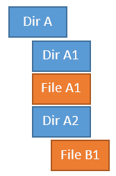

# 第六章：从仓库中提取数据

本章将介绍以下内容：

+   提取顶级贡献者

+   查找源代码树中的瓶颈

+   使用`grep`查找提交信息

+   发布内容

+   查找最近一段时间内仓库中的成就

# 介绍

无论你在大公司还是小公司工作，保护和维护数据始终非常重要，它会为你追踪大量信息；这只是一个提取数据的问题。部分数据是你或其他开发者在填写提交信息时自动加入到系统中的——例如，修复的 bug 的详细信息来自于 bug 跟踪系统。

这些数据不仅对管理有用，还可以用于增加更多时间来重构 C 文件，在这些文件中几乎所有的 bug 都已修复。

# 提取顶级贡献者

Git 提供了一些内置的统计数据，你可以即时获取。`git log`命令有不同的选项，比如`--numstat`，它将显示自每次提交以来每个文件的添加行数和删除行数。然而，要在仓库中找到顶级提交者，我们只需使用`git shortlog`命令。

# 准备工作

在本书中的所有示例中，我们使用的是`jgit`仓库；你可以选择克隆它，或者使用你可能已经拥有的克隆之一。

如下克隆`jgit`仓库：

```
$ git clone https://git.eclipse.org/r/jgit/jgit chapter6 
$ cd chapter6 
```

# 如何操作...

`shortlog` Git 命令非常简单，没有太多可用的选项或标志。它可以显示日志，但以精简版显示，然后可以按如下方式总结给我们：

1.  开始时，用`shortlog`显示最后五次提交。我们可以使用`-5`来限制输出量：

```
$ git shortlog -5 
Jonathan Nieder (1): 
 Update commons-compress to 1.6 

Matthias Sohn (2): 
 Update com.jcraft.jsch to 0.1.50 in Kepler target platform 
 Update target platforms to use latest orbit build 

SATO taichi (1): 
 Add git checkout --orphan implementation 

Stefan Lay (1): 
 Fix fast forward rebase with rebase.autostash=true 
```

1.  如你所见，输出结果与`git log`的输出非常不同。你可以自己尝试运行`git log -5`。括号中的数字是该提交者的提交次数。在名字和数字下面是提交的标题。请注意，没有显示提交的哈希值。仅凭这五次提交找出顶级提交者很容易，但如果你尝试运行不带`-5`的`git shortlog`，就很难找到这个人。为了排序并找到顶级提交者，我们可以使用`-n`或`--numbered`选项来排序输出；顶级提交者会排在最上面：

```
$ git shortlog -5 --numbered 
Matthias Sohn (2): 
 Update com.jcraft.jsch to 0.1.50 in Kepler target platform 
 Update target platforms to use latest orbit build 

Jonathan Nieder (1): 
 Update commons-compress to 1.6 

SATO taichi (1): 
 Add git checkout --orphan implementation 

Stefan Lay (1): 
 Fix fast forward rebase with rebase.autostash=true 
```

1.  如你所见，输出结果已很好地排序。如果我们不关心提交的主题，可以使用`-s`或`--summary`来仅显示每个开发者的提交计数，如下所示：

```
$ git shortlog -5 --numbered --summary 
 2  Matthias Sohn 
 1  Jonathan Nieder 
 1  SATO taichi 
 1  Stefan Lay 
```

1.  最后，我们得到了我们想要的，除了我们没有提交者的电子邮件地址；这个选项也可以使用`-e`或`--email`。这将显示提交者的电子邮件地址。这一次，我们将尝试在整个仓库上运行。当前，我们只列出了 HEAD 提交的信息。为了列出整个仓库的信息，我们需要在命令的末尾添加`--all`，以便对所有分支执行命令，如下所示：

```
$ git shortlog  --numbered --summary --email --all 
 765  Shawn O. Pearce <spearce@spearce.org> 
 399  Matthias Sohn <matthias.sohn@sap.com> 
 360  Robin Rosenberg <robin.rosenberg@dewire.com> 
 181  Chris Aniszczyk <caniszczyk@gmail.com> 
 172  Shawn Pearce <spearce@spearce.org> 
 160  Christian Halstrick <christian.halstrick@sap.com> 
 114  Robin Stocker <robin@nibor.org>
```

1.  所以，现在这是列表；我们知道谁提交了最多的代码，但这个图像可能有些偏差，因为最大的提交者可能恰好是项目的创建者，可能并没有积极地参与仓库的贡献。因此，要列出过去六个月的主要提交者，我们可以在 `git shortlog` 命令中添加 `--since="6 months ago"`，如下所示：

```
$ git shortlog  --numbered --summary --email --all --since="6 months ago" 
 73  Matthias Sohn <matthias.sohn@sap.com> 
 15  Robin Stocker <robin@nibor.org> 
 14  Robin Rosenberg <robin.rosenberg@dewire.com> 
 13  Shawn Pearce <sop@google.com> 
 12  Stefan Lay <stefan.lay@sap.com> 
 8  Christian Halstrick <christian.halstrick@sap.com> 
 7  Colby Ranger <cranger@google.com> 
```

1.  如你所见，自从仓库开始以来，图片已经发生了变化。

你可以使用 *"n 周前"*, *"n 天前"*, *"n 个月前"*, *"n 小时前"* 等来指定时间段。你也可以使用具体日期，如 `"2013 年 10 月 1 日"`。

你还可以使用 `--until` 选项列出某个月份的主要提交者，你可以指定希望列出提交记录的截止日期。可以按如下方式执行：

```
$ git shortlog  --numbered --summary --email --all --since="30 september 2013" --until="1 november 2013" 
 15  Matthias Sohn <matthias.sohn@sap.com> 
 4  Kaloyan Raev <kaloyan.r@zend.com> 
 4  Robin Rosenberg <robin.rosenberg@dewire.com> 
 3  Colby Ranger <cranger@google.com> 
 2  Robin Stocker <robin@nibor.org> 
 1  Christian Halstrick <christian.halstrick@sap.com> 
 1  Michael Nelson <michael.nelson@tasktop.com> 
 1  Rüdiger Herrmann <ruediger.herrmann@gmx.de> 
 1  Tobias Pfeifer <to.pfeifer@web.de> 
 1 Tomasz Zarna <tomasz.zarna@tasktop.com> 
```

1.  如你所见，我们得到了一份新的列表，看来 Matthias 是主要贡献者，至少相比于初步结果来说。通过收集自仓库初始化以来每个月的数据，这类信息还可以用来可视化仓库中责任的转变。

# 还有更多……

在处理代码时，通常很有用的一点是知道在你需要修复软件中的问题时，应该找谁，尤其是在你不熟悉的领域。所以，找出你正在修改的文件或文件的代码负责人是很有帮助的。显而易见的原因是为了获取代码方面的输入，同时也知道应该找谁进行代码审查。你同样可以使用 `git shortlog` 来搞清楚这一点。你也可以在文件上使用这个命令：

1.  为此，我们只需将文件添加到 `git shortlog` 命令的末尾：

```
$ git shortlog  --numbered --summary --email ./pom.xml 
 86  Matthias Sohn <matthias.sohn@sap.com> 
 21  Shawn O. Pearce <spearce@spearce.org> 
 4  Chris Aniszczyk <caniszczyk@gmail.com> 
 4  Jonathan Nieder <jrn@google.com> 
 3  Igor Fedorenko <igor@ifedorenko.com> 
 3  Kevin Sawicki <kevin@github.com> 
 2  Colby Ranger <cranger@google.com> 
```

1.  至于 `pom.xml`，我们也有一个主要提交者。由于 `git log` 的所有选项也可以用于 `shortlog`，我们同样可以对一个目录使用它，如下所示：

```
$ git shortlog  --numbered --summary --email org.eclipse.jgit.lfs.server.test
 35 Matthias Sohn <matthias.sohn@sap.com>
 20 David Pursehouse <david.pursehouse@gmail.com>
 4 Markus Duft <markus.duft@ssi-schaefer.com>
 2 Saša Živkov <sasa.zivkov@sap.com>
 1 David Ostrovsky <david@ostrovsky.org>
 1 Mat Booth <mat.booth@redhat.com>
 1 Karsten Thoms <karsten.thoms@itemis.de>
```

1.  如你所见，要知道在 Git 中哪些文件或目录该找谁是相当简单的。

# 在源代码树中查找瓶颈

通常，开发团队知道源代码树中的瓶颈在哪里，但说服管理层需要资源来重写部分代码可能是一个挑战。然而，使用 Git，提取此类数据相对简单。

# 准备工作

先通过以下方式查看 stable-3.1 版本：

```
$ git checkout stable-3.1 
Branch stable-3.1 set up to track remote branch stable-3.1 from origin. 
Switched to a new branch 'stable-3.1' 
```

# 如何做……

我们希望从列出某个提交的统计信息开始，然后可以将示例扩展到更大范围的提交：

1.  我们将使用的第一个选项是 `git log` 的 `--dirstat`，如下所示：

```
$ git log -1 --dirstat 
commit da6e87bc373c54c1cda8ed563f41f65df52bacbf 
Author: Matthias Sohn <matthias.sohn@sap.com> 
Date:   Thu Oct 3 17:22:08 2013 +0200 

 Prepare post 3.1.0 builds 

 Change-Id: I306a3d40c6ddb88a16d17f09a60e3d19b0716962 
 Signed-off-by: Matthias Sohn <matthias.sohn@sap.com> 

 5.0% org.eclipse.jgit.http.server/META-INF/ 
 6.9% org.eclipse.jgit.http.test/META-INF/ 
 3.3% org.eclipse.jgit.java7.test/META-INF/ 
 4.3% org.eclipse.jgit.junit.http/META-INF/ 
 6.6% org.eclipse.jgit.junit/META-INF/ 
 5.5% org.eclipse.jgit.packaging/ 
 5.9% org.eclipse.jgit.pgm.test/META-INF/ 
 13.7% org.eclipse.jgit.pgm/META-INF/ 
 15.4% org.eclipse.jgit.test/META-INF/ 
 3.7% org.eclipse.jgit.ui/META-INF/ 
 13.1% org.eclipse.jgit/META-INF/
```

1.  `--dirstat`选项显示了在提交中哪些目录发生了变化，并且这些变化与其他目录相比有多少。默认设置是计算在提交中添加或删除的行数。因此，代码的重新排列可能不会算作任何变化，因为行数可能是相同的。你可以通过使用`--dirstat=lines`来稍微补偿这一点。这个选项会逐行查看每个文件，查看它们与之前的版本相比是否发生了变化，如下所示：

```
$ git log -1 --dirstat=lines 
commit da6e87bc373c54c1cda8ed563f41f65df52bacbf 
Author: Matthias Sohn <matthias.sohn@sap.com> 
Date:   Thu Oct 3 17:22:08 2013 +0200 

 Prepare post 3.1.0 builds 

 Change-Id: I306a3d40c6ddb88a16d17f09a60e3d19b0716962 
 Signed-off-by: Matthias Sohn <matthias.sohn@sap.com> 

 4.8% org.eclipse.jgit.http.server/META-INF/ 
 6.5% org.eclipse.jgit.http.test/META-INF/ 
 3.2% org.eclipse.jgit.java7.test/META-INF/ 
 4.0% org.eclipse.jgit.junit.http/META-INF/ 
 6.1% org.eclipse.jgit.junit/META-INF/ 
 6.9% org.eclipse.jgit.packaging/ 
 5.7% org.eclipse.jgit.pgm.test/META-INF/ 
 13.0% org.eclipse.jgit.pgm/META-INF/ 
 14.6% org.eclipse.jgit.test/META-INF/ 
 3.6% org.eclipse.jgit.ui/META-INF/ 
 13.8% org.eclipse.jgit/META-INF/ 
```

1.  这也会产生略微不同的结果。如果你想限制输出仅显示某个百分比以上的目录，我们可以按如下方式限制输出：

```
$ git log -1 --dirstat=lines,10 
commit da6e87bc373c54c1cda8ed563f41f65df52bacbf 
Author: Matthias Sohn <matthias.sohn@sap.com> 
Date:   Thu Oct 3 17:22:08 2013 +0200 

 Prepare post 3.1.0 builds 
 Change-Id: I306a3d40c6ddb88a16d17f09a60e3d19b0716962 
 Signed-off-by: Matthias Sohn <matthias.sohn@sap.com> 

 13.0% org.eclipse.jgit.pgm/META-INF/ 
 14.6% org.eclipse.jgit.test/META-INF/ 
 13.8% org.eclipse.jgit/META-INF/
```

1.  通过在`--dirstat=lines`命令中添加`10`，我们要求 Git 只显示发生了 10%或更多变化的目录；你可以根据需要使用任何数字。默认情况下，Git 不统计子目录中的变化，只统计目录中的文件变化。因此，在下图中，只有**文件 A1**的变化被算作变化；对于**目录 A1**和**文件 B1**，它们的变化被算作**目录 A2**的变化：



1.  为了累积这些数据，我们可以在`--dirstat=lines,10`命令中添加`cumulative`，这将累积所有变化并计算出百分比。

    请注意，由于计算方式的不同，百分比可能会超过 100：

```
$ git log -1 --dirstat=files,10,cumulative 
commit da6e87bc373c54c1cda8ed563f41f65df52bacbf 
Author: Matthias Sohn <matthias.sohn@sap.com> 
Date:   Thu Oct 3 17:22:08 2013 +0200 

 Prepare post 3.1.0 builds 

 Change-Id: I306a3d40c6ddb88a16d17f09a60e3d19b0716962 
 Signed-off-by: Matthias Sohn <matthias.sohn@sap.com> 

 31.3% org.eclipse.jgit.packaging/
```

1.  如你所见，输出与我们之前看到的稍有不同。通过使用`git log --dirstat`，你可以获得一些关于仓库的情况显现出来的信息。显然，你也可以在两个版本之间或两个提交哈希之间做这件事。让我们尝试一下，但这次我们不使用`git log`，而是使用`git diff`，因为 Git 会显示两个版本之间的累积`diff`，而`git log`会显示两个版本之间每个提交的`dirstat`：

```
$ git diff  origin/stable-3.1..origin/stable-3.2 --dirstat 
 4.0% org.eclipse.jgit.packaging/org.eclipse.jgit.target/ 
 3.9% org.eclipse.jgit.pgm.test/tst/org/eclipse/jgit/pgm/ 
 4.1% org.eclipse.jgit.pgm/ 
 20.7% org.eclipse.jgit.test/tst/org/eclipse/jgit/api/ 
 21.3% org.eclipse.jgit.test/tst/org/eclipse/jgit/internal/storage/file/ 
 5.2% org.eclipse.jgit.test/tst/org/eclipse/jgit/ 
 14.5% org.eclipse.jgit/src/org/eclipse/jgit/api/ 
 6.5% org.eclipse.jgit/src/org/eclipse/jgit/lib/ 
 3.9% org.eclipse.jgit/src/org/eclipse/jgit/transport/ 
 4.6% org.eclipse.jgit/src/org/eclipse/jgit/ 
```

1.  所以，在`origin/stable-3.1`和`origin/stable-3.2`分支之间，我们可以看到哪些目录的变化百分比最高。然后，我们可以通过`--stat`或`--numstat`进一步深入查看该目录，并再次使用`git diff`。我们还会使用`--relative="org.eclipse.jgit.test/tst/org/eclipse/"`，这将显示相对于`org.eclipse.jgit.test/tst/org/eclipse/`的文件路径，这样在控制台上显示会更清晰。你可以尝试在不使用以下选项的情况下进行此操作：

```
$ git diff --pretty  origin/stable-3.1..origin/stable-3.2 --numstat  --relative="org.eclipse.jgit.test/tst/org/eclipse/jgit/internal/"  org.eclipse.jgit.test/ 

tst/org/eclipse/jgit/internal/ 
4       2       storage/file/FileRepositoryBuilderTest.java 
8       1       storage/file/FileSnapshotTest.java 
0       741     storage/file/GCTest.java 
162     0       storage/file/GcBasicPackingTest.java 
119     0       storage/file/GcBranchPrunedTest.java 
119     0       storage/file/GcConcurrentTest.java 
85      0       storage/file/GcDirCacheSavesObjectsTest.jav 
104     0       storage/file/GcKeepFilesTest.java 
180     0       storage/file/GcPackRefsTest.java 
120     0       storage/file/GcPruneNonReferencedTest.java 
146     0       storage/file/GcReflogTest.java 
78      0       storage/file/GcTagTest.java 
113     0       storage/file/GcTestCase.java 
```

1.  第一个数字是添加的行数，第二个数字是两分支之间删除的行数。

# 还有更多...

我们已经使用了`git log`、`git diff`和`git shortlog`来查找关于仓库的信息，但这些命令有许多选项可以帮助我们找到源代码中的瓶颈。

如果我们想找到提交次数最多的文件，而这些文件不一定是行数增加或删除最多的文件，我们可以使用`git log`：

1.  我们可以在 `origin/stable-3.1` 和 `origin/stable-3.2` 分支之间使用 `git log`，列出每次提交中更改的所有文件。

    然后，我们只需要使用一些 Bash 工具对结果进行排序和统计，如下所示：

```
$ git log origin/stable-3.1..origin/stable-3.2 --format=format: --name-only 

org.eclipse.jgit.ant.test/META-INF/MANIFEST.MF 
org.eclipse.jgit.ant.test/pom.xml 
```

1.  首先，我们只是执行命令，而没有使用 Bash 工具。从大量输出中可以看到，你只会看到文件名，其他什么都看不见。这是由于所使用的选项。`--format=format:` 选项告诉 Git 不显示任何与提交信息相关的信息，而 `--name-only` 则告诉 Git 只列出每次提交的文件。现在，我们要做的就是统计它们：

```
$ git log origin/stable-3.1..origin/stable-3.2 --format=format: --name-only | sed '/^$/d'  | sort | uniq -c | sort -r | head -10 
 12 se.jgit/src/org/eclipse/jgit/api/RebaseCommand.java 
 12 est/tst/org/eclipse/jgit/api/RebaseCommandTest.java 
 9 org.eclipse.jgit/META-INF/MANIFEST.MF 
 7 org.eclipse.jgit.pgm.test/META-INF/MANIFEST.MF 
 7 org.eclipse.jgit.packaging/pom.xml 
 6 pom.xml 
 6 pse.jgit/src/org/eclipse/jgit/api/RebaseResult.java 
 6 org.eclipse.jgit.test/META-INF/MANIFEST.MF 
 6 org/eclipse/jgit/pgm/internal/CLIText.properties 
 6 org.eclipse.jgit.pgm/META-INF/MANIFEST.MF 
```

1.  现在，我们有了两个版本之间前十个文件的列表，但在进一步操作之前，我们先回顾一下我们所做的。我们获取了文件列表，使用 `sed '/^$/d'` 移除了输出中的空行。之后，我们用 `sort` 对文件列表进行了排序。接着，我们使用 `uniq -c`，它会统计每个文件出现的次数，并将数量加到输出中。最后，我们使用 `sort -r` 进行倒序排序，并使用 `head 10` 只显示前十个结果。从这里开始，我们应该列出两个分支之间所有更改了最上面文件的提交，方法如下：

```
$ git log origin/stable-3.1..origin/stable-3.2 \\
  org.eclipse.jgit/src/org/eclipse/jgit/api/RebaseCommand.java 

commit e90438c0e867bd105334b75df3a6d640ef8dab01 
Author: Stefan Lay <stefan.lay@sap.com> 
Date:   Tue Dec 10 15:54:48 2013 +0100 

 Fix aborting rebase with detached head 

 Bug: 423670 
 Change-Id: Ia6052867f85d4974c4f60ee5a6c820501e8d2427 

commit f86a488e32906593903acb31a93a82bed8d87915 
```

1.  通过将文件添加到 `git log` 命令的末尾，我们将看到两个分支之间的提交。现在，我们要做的就是 grep 出有错误的提交，这样我们就可以告诉我们的经理我们在这个文件中修复了多少个错误。

# Grep 提交信息

现在我们知道如何列出和排序我们频繁更改的文件，反之亦然，但我们也感兴趣的是找出我们修复的错误，正在实现的功能，甚至可能是谁签署了代码。所有这些信息通常都在提交信息中。有些公司有政策，要求你在提交信息中提到一个错误、一个功能或其他引用。通过在提交信息中包含这些信息，生成漂亮的发布说明也会变得容易得多。

# 准备好

由于在这些例子中我们大部分时间都在 grep Git 数据库，我们其实不需要检出任何东西或处于某个特定的提交。所以，如果你仍然在 `chapter6` 文件夹中，我们可以继续。

# 如何操作...

让我们看看仓库中有多少提交提到了一个错误：

1.  首先，我们需要知道提交信息中提到的错误的模式。我通过查看提交信息找到了 `jgit` 的模式是使用 `Bug: 6 位数字`；因此，要找到所有这些提交，我们使用 `git log` 的 `--grep` 选项，并可以通过 `"[Bb][Uu][gG]: [0-9]+"` 来 grep：

```
$ git log --all --grep="^[bB][uU][gG]: [0-9]" 
commit 3db6e05e52b24e16fbe93376d3fd8935e5f4fc9b 
Author: Stefan Lay <stefan.lay@sap.com> 
Date:   Wed Jan 15 13:23:49 2014 +0100 

 Fix fast forward rebase with rebase.autostash=true 

 The folder .git/rebase-merge was not removed in this case. The 
 repository was then still in rebase state, but neither abort nor 
 continue worked. 

 Bug: 425742 
 Change-Id: I43cea6c9e5f3cef9d6b15643722fddecb40632d9 
```

1.  你应该会看到大量的提交作为输出，但你需要注意的是，所有提交都包含一个指向 bug ID 的引用。那么，grep 做了什么呢？`^[Bb][Uu][gG]:` 部分匹配任何大小写组合的 bug。`^` 字符表示从行首开始。`:` 字符匹配冒号。接着是 `[0-9]+`，它将匹配从零到九的任何数字，`+` 部分表示一个或多个出现。但是正则表达式的内容就到此为止。我们得到了很多输出（这很有价值），但现在我们只想统计提交次数。我们可以通过将其传递给 `wc -l` 来做到这一点（`wc -l` 用于统计行数）：

```
$ git log --all --oneline --grep="^[bB][uU][gG]: [0-9]+" | wc -l 

 366
```

1.  在将其传递给 `wc` 之前，记得使用 `--oneline` 限制每个提交的输出为一行。如你所见，当我写这篇文章时，`jgit` 参考了 `366` 个 bug，这些 bug 都已经被修复并发布到仓库中。如果你习惯于在其他脚本或编程语言中使用正则表达式，你会发现 `--grep` 并不支持所有内容。你可以通过使用 `git log` 的 `--extended-regexp` 选项来启用更广泛的正则表达式支持；然而，模式仍然需要与 `--grep` 一起使用，如下所示：

```
$ git log --all --oneline  --extended-regexp --grep="^[bB][uU][gG]: [0-9]{6}" 

3db6e05 Fix fast forward rebase with rebase.autostash=true 
c6194c7 Update com.jcraft.jsch to 0.1.50 in Kepler target platform 
1def0a1 Fix for core.autocrlf=input resulting in modified file and unsmudge 
0ce61ca Canonicalize worktree path in BaseRepositoryBuilder if set via config 
e90438c Fix aborting rebase with detached head 
2e0d178 Add recursive variant of Config.getNames() methods 
```

1.  我们在前面的示例中使用了它，你可以看到我们得到了相同的提交。我使用了稍微不同的表达式，并且现在将 `{6}` 替代了 `+`；`{6}` 搜索与模式关联的六个出现。在我们的案例中，它是六个数字，因为它紧邻 `[0-9]` 模式。我们可以通过重新计算行数或提交次数来验证，如下所示，使用 `wc -l`：

```
$ git log --all --oneline  --extended-regexp --grep="^[bB][uU][gG]: [0-9]{6}" | wc -l 

 366 
```

1.  我们得到相同的数字。为了进一步缩小正则表达式，我们可以使用 `--regexp-ignore-case`，它将忽略模式的大小写：

```
$ git log --all --oneline  --regexp-ignore-case --extended-regexp --grep="^bug: [0-9]{6}" 

3db6e05 Fix fast forward rebase with rebase.autostash=true 
c6194c7 Update com.jcraft.jsch to 0.1.50 in Kepler target platform 
1def0a1 Fix for core.autocrlf=input resulting in modified file and unsmudge 
0ce61ca Canonicalize worktree path in BaseRepositoryBuilder if set via config 
e90438c Fix aborting rebase with detached head 
2e0d178 Add recursive variant of Config.getNames() methods
```

1.  现在我们得到了完全相同的输出，且不再有 `[bB][uU][Gg]`，而只有 `bug`。

现在你知道如何使用 grep 搜索提交消息中的信息，你可以在提交消息中搜索任何内容，并列出所有匹配正则表达式的提交。

# 发布内容

在从 Git 提取信息时，生成发布说明是其中一个常见的操作。要生成发布说明，你需要获取从此版本到上一个版本之间的所有有效信息。

我们可以利用之前使用过的一些方法来生成我们想要的数据。

# 如何操作...

我们首先列出两个标签之间的提交，`v2.3.1.201302201838-r` 和 `v3.0.0.201305080800-m7`，然后基于这些信息进行构建：

1.  使用 `git log` 和 `v3.0.0.201305080800-m7.. v3.0.0.201305080800-m7`，我们将获得标签之间的提交：

```
$ git log --oneline v2.3.1.201302201838-r..v3.0.0.201305080800-m7 

00108d0 JGit v3.0.0.201305080800-m7 
e27993f Add missing @since tags 
d7cc6eb Move org.eclipse.jgit.pgm's resource bundle to internal package 
75e1bdb Merge "URIish: Allow multiple slashes in paths" 
b032623 Remove unused repository field from RevWalk 
a626f9f Merge "Require a DiffConfig when creating a FollowFilter" 
```

1.  由于这两个标签之间有很多提交，让我们使用 `wc -l` 来统计它们：

```
$ git log --oneline v2.3.1.201302201838-r..v3.0.0.201305080800-m7 | wc -l 

 211
```

1.  在这两个标签之间有 `211` 次提交。现在，我们将展示发布版本之间最常修改的文件：

```
$ git log  v2.3.1.201302201838-r..v3.0.0.201305080800-m7  --format=format: --name-only | sed '/^$/d'  | sort | uniq -c | sort -r | head -10 

 11 org.eclipse.jgit/src/org/eclipse/jgit/internal/st 
 10 org.eclipse.jgit/src/org/eclipse/jgit/internal/sto 
 10 org.eclipse.jgit.pgm/resources/org/eclipse/jgit/p 
 9 org.eclipse.jgit.test/META-INF/MANIFEST.MF 
 8 pom.xml 
 8 org.eclipse.jgit/src/org/eclipse/jgit/storage/pac 
 8 org.eclipse.jgit/src/org/eclipse/jgit/internal/sto 
 8 org.eclipse.jgit.pgm/src/org/eclipse/jgit/pgm/CLI 
 7 org.eclipse.jgit/src/org/eclipse/jgit/storage/dfs/D 
 7 org.eclipse.jgit/src/org/eclipse/jgit/storage/dfs/D 
```

1.  这些信息非常有用，因为我们现在有了对大多数更改所在位置的概览。然后，我们可以找到与 bug 相关的提交，这样我们就可以列出 bug ID：

```
$ git log --format=format:%h --regexp-ignore-case  --extended-regexp --grep="bug: [0-9]{6}"  v2.3.1.201302201838-r..v3.0.0.201305080800-m7 | xargs -n1 git log -1 | grep --ignore-case -E "commit [0-9a-f]{40}|bug:" 

commit e8f720335f86198d4dc99af10ffb6f52e40ba06f 
 Bug: 406722 
commit f448d62d29acc996a97ffbbdec955d14fde5c254 
 Bug: 388095 
commit 68b378a4b5e08b80c35e6ad91df25b1034c379a3 
 Bug: 388095 
commit 8bd1e86bb74da17f18272a7f2e8b6857c800a2cc 
 Bug: 405558 
commit 37f0e324b5e82f55371ef8adc195d35f7a196c58 
 Bug: 406722 
commit 1080cc5a0d67012c0ef08d9468fbbc9d90b0c238 
 Bug: 403697 
commit 7a42b7fb95ecd2c132b2588e5ede0f1251772b30 
 Bug: 403282 
commit 78fca8a099bd2efc88eb44a0b491dd8aecc222b0 
 Bug: 405672 
commit 4c638be79fde7c34ca0fcaad13d7c4f1d9c5ddd2 
 Bug: 405672
```

1.  所以，现在我们得到的是一个包含修复的 bug 和对应提交哈希值的不错列表。

# 它是如何工作的...

我们正在使用一些 Bash 工具来获取已修复 bug 的列表。我将在本节简要解释它们的作用：

+   `xargs -n1 git log -1` 部分将在从第一个 `git log` 命令来的每个提交上执行 `git log -1`，命令为 `git log --format=format:%h --regexp-ignore-case --extended-regexp --grep="bug: [0-9]{6}" v2.3.1.201302201838-r..v3.0.0.201305080800-m7`。

+   `grep --ignore-case -E "commit [0-9a-f]{40}|bug:"` 部分将忽略正则表达式中的大小写，`-E` 将启用扩展正则表达式。你可能会发现，很多这些 `grep` 工具的选项和我们在 `git log` 中使用的选项是一样的。这个正则表达式匹配的是提交和由 `[0-9a-f]` 范围表示的 40 个字符，或者是 bug。`|` 字符表示或。记住，我们现在处于 `git log -1` 的输出中。

我们提取的所有这些信息是编写良好、扎实的发布说明的基础，包含了从一个版本到另一个版本的更改内容。

接下来的自然步骤是查看 bug 跟踪系统，并列出每个错误在提交中被修复的标题。然而，这不是我们在这里讨论的内容，因为它完全取决于你使用的系统。

# 查找在最近一段时间内在仓库中完成的工作

有时，能够提取在特定时间范围内完成的工作是非常有用的。让我们看看 `git log` 的多个参数如何帮助完成这个任务。

# 如何操作...

1.  假设我们想知道在过去 30 天内，在我们分析的 `jgit` 仓库中完成的所有工作：

```
$ git log --all --since="30 days ago"
commit 6efedb41c6fe3fc6eb88f49afc3e7f481514e806 (HEAD -> master, origin/master, origin/HEAD)
Author: Jonathan Nieder <jrn@google.com>
Date: Wed May 2 15:23:31 2018 -0700

 Mark CrissCrossMergeTest as flaky

 It often fails on my machine, both in maven and bazel.

 This patch marks the test flaky[1] in bazel so that "bazel test" can
 run it a few times before declaring failure.

 [1] https://docs.bazel.build/versions/master/be/common-definitions.html#test.flaky

 Bug: 534285
 Change-Id: Ibe5414fefbffe4e8f86af7047608d51cf5df5c47

commit 5f2ddc8ac0528f2fc9776be822568dff3f065670
Merge: b1f8ddfb7 3d89622d4
Author: Matthias Sohn <matthias.sohn@sap.com>
Date: Sat May 5 19:44:26 2018 -0400

 Merge "Add API filter for "non-API type FileRepository" in tests"

commit 3d89622d4e32eb24c203b71f4cce49e35dff8e09
Author: David Pursehouse <david.pursehouse@gmail.com>
Date: Thu Apr 12 10:53:29 2018 +0900

 Add API filter for "non-API type FileRepository" in tests

 Change-Id: If805ad4a962e48dd16fbc7eff915fd6539839933
 Signed-off-by: David Pursehouse <david.pursehouse@gmail.com>

[...]
```

在这里，我们使用 `--all` 来查看所有分支中的提交，而不仅仅是当前分支。我们还使用了如本章前面所示的 `--since`。

1.  现在，让我们只显示 `David Pursehouse` 的提交：

```
$ git log --all --since="30 days ago" --oneline --author="David Pursehouse"
3d89622d4 Add API filter for "non-API type FileRepository" in tests
9fb724f1b RefDatabase: add hasRefs convenience method
4dcf2f93d RefDatabase: Introduce getAllRefs method
57f158632 RefDatabase: Update Javadoc for ALL constant
20d431f79 LargePackedWholeObject#openStream: Suppress resource warning
7575cab53 Upgrade error_prone_core to 2.3.1
cbb2e65db PushProcess: Remove unused import of HashMap
5b0129641 Merge "Push: Ensure ref updates are processed in input order"
e5ba2c9bd DirCache: Use constant from StandardCharsets
ec84767c3 Use Constants.CHARACTER_ENCODING in tests
b0ac5f9c8 LargePackedWholeObject: Refactor to open DfsReader in try-with-resource
045799f2e Merge branch 'stable-4.11'
```

我们使用了 `--author` 来指定所需的提交作者，使用 `--oneline` 来将输出缩减为更易于管理的格式。

如果你在寻找自己的提交，可以将你的名字传递给 `--author`，但是如果你在编写脚本或别名并希望它具有可移植性，至少在 Linux 和 macOS 上，你可以使用子进程来自动检索信息：`--author=$(git config user.name)`。

1.  看起来存在一些合并提交。这些提交并不是描述上个月活动的有用信息，因此我们可以通过 `--no-merges` 来去除它们：

```
$ git log --all --since="30 days ago" --oneline --author="David Pursehouse" --no-merges
3d89622d4 Add API filter for "non-API type FileRepository" in tests
9fb724f1b RefDatabase: add hasRefs convenience method
4dcf2f93d RefDatabase: Introduce getAllRefs method
57f158632 RefDatabase: Update Javadoc for ALL constant
20d431f79 LargePackedWholeObject#openStream: Suppress resource warning
7575cab53 Upgrade error_prone_core to 2.3.1
cbb2e65db PushProcess: Remove unused import of HashMap
e5ba2c9bd DirCache: Use constant from StandardCharsets
ec84767c3 Use Constants.CHARACTER_ENCODING in tests
b0ac5f9c8 LargePackedWholeObject: Refactor to open DfsReader in try-with-resource
```

我们终于得到了所需的信息。这个简单的示例还展示了良好提交信息的重要性，因为它们会让 Git 管理的历史变得更加有用和有价值！

# 它是如何工作的...

在这个例子中，我们不需要做复杂的操作就能得到所需的结果；我们只是利用了`git log`命令及其选项的强大功能。事实上，`git log`有将近 200 个不同的参数，并且它的帮助文档，通过`git log --help`访问，包含了超过 11,000 个单词！现在你知道下一次没有网络连接的长途飞行时该做什么了！

# 还有更多…

那么，跨仓库的情况呢？当然，前面的做法可以通过一些脚本进行扩展，从而在一系列仓库上重复操作，但有一个更好且更简单的选项可用，它作为一个第三方应用程序，利用了我们到目前为止探索的相同`git log`功能：`git-standup`。

它可以通过`curl`命令轻松安装：

```
curl -L https://raw.githubusercontent.com/kamranahmedse/git-standup/master/installer.sh | sudo sh 
```

它的源代码可以在`https://github.com/kamranahmedse/git-standup`找到，且具有多个选项，可以使日常或每周的团队会议准备工作变得更加轻松。

`git-standup`也可以在单个仓库上运行，当应用到之前的例子时，它的输出如下：

```
$ git-standup -a "David Pursehouse" -d 30
3d89622d4 - Add API filter for "non-API type FileRepository" in tests (6 days ago) <David Pursehouse>
9fb724f1b - RefDatabase: add hasRefs convenience method (12 days ago) <David Pursehouse>
4dcf2f93d - RefDatabase: Introduce getAllRefs method (2 weeks ago) <David Pursehouse>
57f158632 - RefDatabase: Update Javadoc for ALL constant (2 weeks ago) <David Pursehouse>
20d431f79 - LargePackedWholeObject#openStream: Suppress resource warning (2 weeks ago) <David Pursehouse>
7575cab53 - Upgrade error_prone_core to 2.3.1 (3 weeks ago) <David Pursehouse>
cbb2e65db - PushProcess: Remove unused import of HashMap (4 weeks ago) <David Pursehouse>
e5ba2c9bd - DirCache: Use constant from StandardCharsets (4 weeks ago) <David Pursehouse>
```
