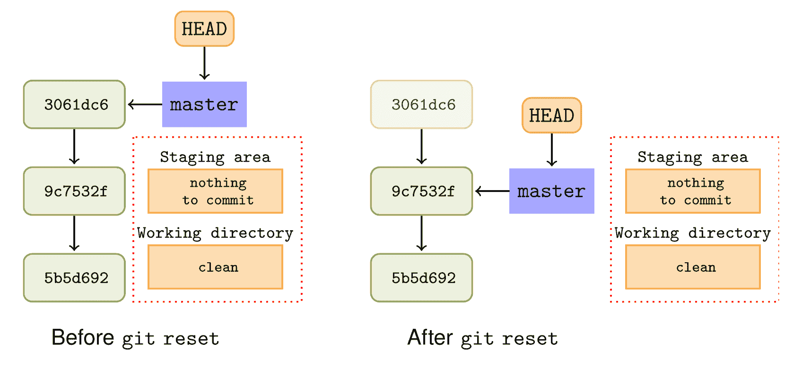
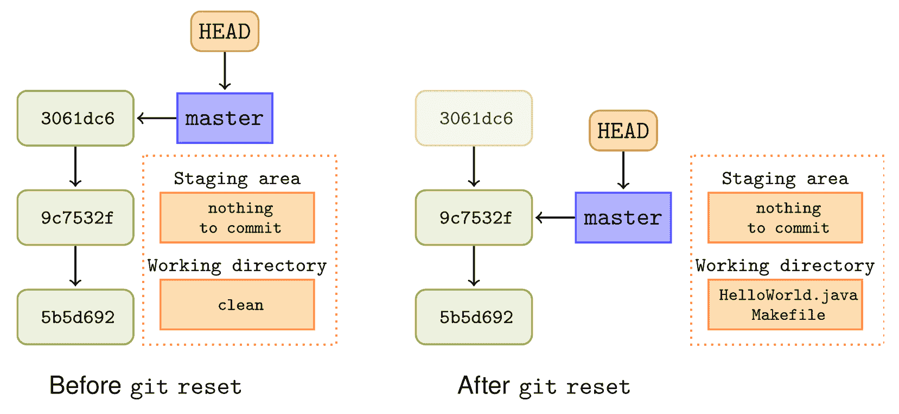
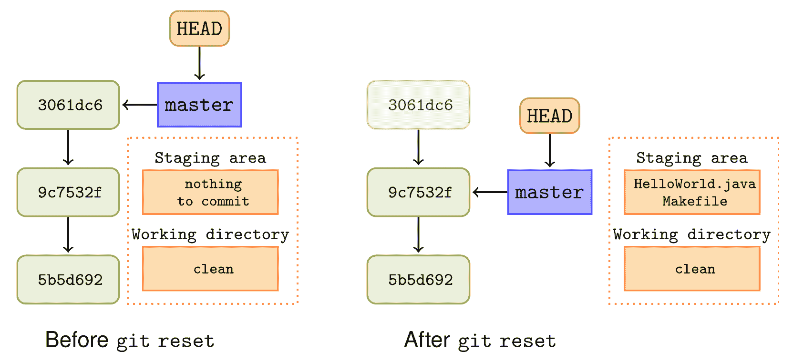
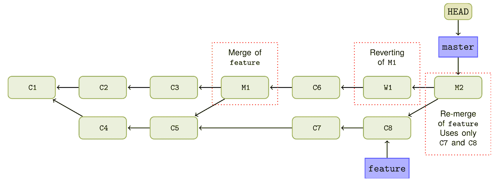

# 第八章：从错误中恢复

在本章中，我们将介绍以下几种做法：

+   撤销 – 完全移除一个提交

+   撤销 – 移除一个提交并保留文件的更改

+   撤销 – 移除一个提交并保留暂存区的更改

+   撤销 – 处理脏工作区

+   重做 – 使用新更改重新创建最新提交

+   还原 – 撤销提交所引入的更改

+   撤销合并

+   使用 git reflog 查看过去的 Git 操作

+   使用 git fsck 查找丢失的更改

# 介绍

在 Git 中可以通过 git push 上下文来纠正错误（如果错误在分享或发布更改之前发现，可以不暴露它们）。如果错误已经推送，仍然可以撤销引入错误的提交所做的更改。

我们将查看 `reflog` 命令，了解如何使用它以及 `git fsck` 恢复丢失的信息。

在 Git 核心中没有 git undo 命令，原因之一是对需要撤销的内容存在歧义，例如，最后一个提交，已添加的文件。如果你想撤销最后一个提交，应该怎么做？是否应该删除该提交对文件做出的更改？比如，你是直接回滚到最后一个已知的良好提交，还是保留更改以便进行更好的提交？提交信息是否应该仅仅重新措辞？在本章中，我们将根据要实现的目标，探索多种撤销提交的方式。我们将探讨四种撤销提交的方法：

+   撤销一切，完全移除最后一个提交，仿佛它从未发生过

+   撤销提交并取消暂存文件；这将我们带回到开始添加文件之前的状态

+   撤销提交，但保留文件在暂存区或暂存区域，这样我们可以进行一些小的修改，然后完成提交

+   在脏工作区中撤销提交

本章中的 `undo` 和 `redo` 命令是针对已经发布的提交进行的操作。通常，你不应该对已经发布的公共仓库中的提交执行撤销和重做操作，因为这会重写历史。然而，在接下来的示例中，我们将使用示例仓库并对已发布的提交执行操作，以便每个人都有相同的体验。

# 撤销 – 完全移除一个提交

在这个例子中，我们将学习如何撤销一个提交，仿佛它从未发生过。我们将学习如何使用 reset 命令有效地丢弃提交，从而将我们的分支重置到期望的状态。

# 准备工作

在这个例子中，我们将使用 `Git-Version-Control-Cookbook-Second-Edition_hello_world_cookbook` 仓库，克隆该仓库，并将工作目录切换到克隆的仓库：

```
$ git clone https://github.com/PacktPublishing/Git-Version-Control-Cookbook-Second-
```

```
Edition_hello_world_cookbook.git 
$ cd Git-Version-Control-Cookbook-Second-Edition_hello_world_cookbook.git
```

# 如何操作...

首先，我们将尝试撤销仓库中的最新提交，仿佛它从未发生过：

1.  我们将确保工作目录干净，没有文件处于修改状态，也没有文件被添加到暂存区：

```
$ git status 
On branch master 
Your branch is up-to-date with 'origin/master'. 

nothing to commit, working directory clean 
```

1.  同时，检查一下我们工作树中的内容：

```
$ ls 
HelloWorld.java Makefile        hello_world.c 
```

1.  如果一切正常，我们将检查日志以查看仓库的历史。我们将使用`--oneline`选项来限制输出：

```
$ git log --oneline 
3061dc6 Adds Java version of 'hello world' 
9c7532f Fixes compiler warnings 
5b5d692 Initial commit, K&R hello world 
```

1.  最后一条提交是`3061dc6 Adds Java version of 'hello world'`提交。我们现在将撤销该提交，就像它从未发生过一样，历史中将不再显示它：

```
$ git reset --hard HEAD^ 

HEAD is now at 9c7532f Fixes compiler warnings 
```

1.  查看日志、状态和文件系统，这样你就可以看到实际发生了什么：

```
$ git log --oneline 
9c7532f Fixes compiler warnings 
5b5d692 Initial commit, K&R hello world 

$ git status 
On branch master 
Your branch is behind 'origin/master' by 1 commit, and can be fast-forwarded. 

 (use "git pull" to update your local branch)

nothing to commit, working directory clean 

$ ls 
hello_world.c 
```

1.  提交现在已经消失，连同它引入的所有更改（`Makefile` 和 `HelloWorld.java`）。

在`git status`命令的最后输出中，你可以看到我们的主分支落后于`origin/master`一个提交。这与我们在章节开头提到的类似，因为我们正在移除和撤销已发布的提交。此外，如前所述，你应该只在尚未共享的提交上执行撤销和重做（`git reset`）操作。在这里，我们仅展示已发布的提交，以便于示例的重现。

# 它是如何工作的...

实际上，我们只是将主分支的指针指向前一个提交的**HEAD**，也就是说，指向**HEAD**的第一个父提交。现在，分支将指向**9c7532f**，而不是我们移除的提交**35b29ae**。这在下面的图示中展示：



上述图示还表明，原始的**3061dc6**提交仍然存在于仓库中，但主分支的新提交将从**9c7532f**开始；**3061dc6**提交被称为悬挂提交。

你应该仅对尚未共享（推送）的提交执行此撤销操作，因为在撤销或重置后创建的新提交会形成一条新的历史，与原始的仓库历史分叉。

当执行重置命令时，Git 会查看**HEAD**指向的提交，并从中找到父提交。当前分支、主分支和**HEAD**指针会被重置到父提交，暂存区和工作树也会被重置。

# 撤销 – 删除一个提交并保留文件的更改

与其执行硬重置并丢失该提交引入的所有更改，不如执行重置，使更改保留在工作目录中。

# 准备工作

我们再次使用 hello world 仓库的示例。如果你已经克隆过仓库，可以重新设置主分支，或者新克隆一个仓库。

你可以按如下方式创建一个新的克隆：

```
$ git clone https://github.com/PacktPublishing/Git-Version-Control-Cookbook-Second-Edition_hello_world_cookbook.git 
$ cd Git-Version-Control-Cookbook-Second-Edition_hello_world_cookbook
```

你可以按如下方式重置现有的克隆：

```
$ git checkout master 
$ git reset --hard origin/master 

HEAD is now at 3061dc6 Adds Java version of 'hello world'
```

# 如何操作...

1.  首先，我们将检查工作树中的文件是否有任何更改（仅为便于示例的清晰度）以及仓库的历史：

```
$ git status 
On branch master 
Your branch is up-to-date with 'origin/master'. 

nothing to commit, working directory clean 

$ git log --oneline 
3061dc6 Adds Java version of 'hello world' 
9c7532f Fixes compiler warnings 
5b5d692 Initial commit, K&R hello world 
```

1.  现在，我们将撤销该提交并保留引入工作树的更改：

```
$ git reset --mixed HEAD^  

$ git log --oneline 
9c7532f Fixes compiler warnings 
5b5d692 Initial commit, K&R hello world 

$ git status 
On branch master 
Your branch is behind 'origin/master' by 1 commit, and can be fast-forwarded. 

 (use "git pull" to update your local branch)  

Untracked files: 

 (use "git add <file>..." to include in what will be committed) 

 HelloWorld.java 
 Makefile 

nothing added to commit but untracked files present (use "git add" to track) 
```

我们可以看到我们的提交已被撤销，但文件的更改保留在工作树中，因此可以继续进行工作，以便创建一个正确的提交。

# 它是如何工作的...

从指向**HEAD**的提交的父提交开始，Git 将重置分支指针和**HEAD**以指向父提交。暂存区被重置，但工作树保持了重置之前的状态，因此受`撤销`提交影响的文件将处于修改状态。下图展示了这一过程：



默认情况下，`--mixed`选项是`git reset`的行为，因此可以省略：`git reset HEAD^`

# 撤销 – 删除提交并保留暂存区中的更改

当然，也可以撤销提交，但保留索引或暂存区中文件的更改，以便随时可以重新创建提交，例如进行一些微小的修改。

# 准备工作

我们仍然会使用 hello world 代码库的示例。如果您已经克隆了代码库，请进行一次新的克隆，或者重置主分支。

按以下步骤创建新的克隆：

```
$ git clone https://github.com/PacktPublishing/Git-Version-Control-Cookbook-Second-Edition_hello_world_cookbook.git $ cd Git-Version-Control-Cookbook-Second-Edition_hello_world_cookbook
```

我们可以按以下步骤重置现有的克隆：

```
 $ git checkout master 
 $ git reset --hard origin/master 

 HEAD is now at 3061dc6 Adds Java version of 'hello world'
```

# 如何操作...

1.  检查是否有文件处于修改状态并查看日志：

```
$ git status 
On branch master 
Your branch is up-to-date with 'origin/master'.  

nothing to commit, working directory clean 

$ git log --oneline 
3061dc6 Adds Java version of 'hello world' 
9c7532f Fixes compiler warnings 
5b5d692 Initial commit, K&R hello world 
```

1.  现在，我们可以撤销提交，同时保留索引中的更改：

```
$ git reset --soft HEAD^ 

$ git log --oneline 
9c7532f Fixes compiler warnings 
5b5d692 Initial commit, K&R hello world 

$ git status 
On branch master 

Your branch is behind 'origin/master' by 1 commit, and can be fast-forwarded. 

 (use "git pull" to update your local branch) 

Changes to be committed: 

 (use "git reset HEAD <file>..." to unstage) 

 new file:   HelloWorld.java 
 new file:   Makefile 
```

现在，您可以对需要的文件进行微小（或重大）更改，将它们添加到暂存区，并创建一个新的提交。

# 工作原理...

再次，Git 将重置分支指针和**HEAD**以指向前一个提交。但是，使用`--soft`选项时，索引和工作目录不会被重置，即它们的状态与我们创建现在被撤销的提交之前相同。

以下图示展示了撤销前后的 Git 状态：



# 撤销 – 处理脏区

在前面的示例中，我们假设工作树是干净的，即没有跟踪文件处于修改状态。但这并不总是情况，如果执行硬重置，那些修改过的文件的更改将会丢失。幸运的是，Git 提供了一个智能的方式来快速将东西放置到一边，以便稍后可以使用`git stash`命令检索。

# 准备工作

再次以 hello world 代码库为例。如果您已经克隆了代码库，请进行一次新的克隆，或者重置主分支。

我们可以按以下步骤创建新的克隆：

```
$ git clone https://github.com/PacktPublishing/Git-Version-Control-Cookbook-Second-Edition_hello_world_cookbook.git $ cd Git-Version-Control-Cookbook-Second-Edition_hello_world_cookbook
```

我们可以按以下步骤重置现有的克隆：

```
$ git checkout master 
$ git reset --hard origin/master 

HEAD is now at 3061dc6 Adds Java version of 'hello world'
```

我们还需要确保一些文件处于工作状态，因此我们将`hello_world.c`更改为以下内容：

```
#include <stdio.h> 

void say_hello(void) { 
 printf("hello, worldn"); 
} 

int main(void){ 
 say_hello(); 
 return 0; 
}
```

# 如何操作...

为了避免在撤销提交时意外删除工作树中的任何修改，您可以使用 `git status` 命令查看工作目录的当前状态（如我们之前所见）。如果有修改且您希望保留它们，您可以在撤销提交之前将它们存入暂存区，然后稍后取回。Git 提供了一个暂存命令，可以将未完成的修改存放起来，因此可以在不丢失工作的情况下快速切换上下文。暂存功能在第十一章，*技巧与窍门*中有进一步描述。目前，您可以将暂存命令看作是一个堆栈，可以将修改放入其中，然后稍后取出。

在工作目录中，`hello_world.c` 文件已修改到前述状态，我们可以尝试对 `HEAD` 提交进行硬重置，在重置前先将修改存入暂存区，稍后再应用这些修改：

1.  首先，检查历史记录：

```
$ git log --oneline 
3061dc6 Adds Java version of 'hello world' 
9c7532f Fixes compiler warnings 
5b5d692 Initial commit, K&R hello world 
```

1.  然后，检查状态：

```
$ git status 
On branch master 
Your branch is up-to-date with 'origin/master'.

Changes not staged for commit: 

 (use "git add <file>..." to update what will be committed) 

 (use "git checkout -- <file>..." to discard changes in working directory) 

 modified:   hello_world.c 

no changes added to commit (use "git add" and/or "git commit -a") 
```

1.  正如预期的那样，`hello_world.c` 文件处于修改状态；所以，将其存入暂存区，检查状态，然后执行重置：

```
$ git stash 
Saved working directory and index state WIP on master: 3061dc6 Adds Java version of 'hello world' 

HEAD is now at 3061dc6 Adds Java version of 'hello world' 

$ git status 
On branch master 
Your branch is up-to-date with 'origin/master'.  
nothing to commit, working directory clean  

$ git reset --hard HEAD^ 
HEAD is now at 9c7532f Fixes compiler warnings 

$ git log --oneline 
9c7532f Fixes compiler warnings 
5b5d692 Initial commit, K&R hello world 
```

1.  重置完成，我们已经删除了想要删除的提交。现在，让我们恢复存入暂存区的修改并检查文件：

```
$ git stash pop 
On branch master 
Your branch is behind 'origin/master' by 1 commit, and can be fast-forwarded. 

 (use "git pull" to update your local branch) 

Changes not staged for commit: 
 (use "git add <file>..." to update what will be committed) 
 (use "git checkout -- <file>..." to discard changes in working directory) 
modified:   hello_world.c 
no changes added to commit (use "git add" and/or "git commit -a") 
Dropped refs/stash@{0} (e56b68a1f5a0f72afcfd064ec13eefcda7a175ca) 

$ cat hello_world.c 

#include <stdio.h> 
void say_hello(void) { 
 printf("hello, worldn"); 
} 
int main(void){ 
 say_hello(); 
 return 0; 
} 
```

所以，文件恢复到了重置前的状态，我们也删除了不需要的提交。

# 它是如何工作的……

重置命令的工作原理与前面示例中的解释相同，但与暂存命令结合使用时，形成了一种非常有用的工具，即使您已经开始做其他工作，也能纠正错误。暂存命令通过保存工作目录和暂存区的当前状态来工作。然后，它会将工作目录恢复到干净的状态。

# 重新做——使用新修改重新创建最新提交

与撤销类似，重做也可以有多种含义。在这个上下文中，重做一个提交意味着几乎相同地重新创建一个提交，具有与之前提交相同的父提交，但内容和/或提交信息不同。如果您刚刚创建了一个提交，但可能忘记在提交之前将必要的文件添加到暂存区，或者需要重新编写提交信息，这非常有用。

# 准备工作

再次，我们将使用 hello world 仓库。创建该仓库的新克隆，或者如果您已经克隆过，重置主分支。

我们可以按如下方式创建一个新的克隆：

```
$ git https://github.com/PacktPublishing/Git-Version-Control-Cookbook-Second-Edition_hello_world_cookbook.git 
$ cd Git-Version-Control-Cookbook-Second-Edition_hello_world_cookbook
```

我们可以按如下方式重置现有的克隆：

```
$ git checkout master 
$ git reset --hard origin/master 
 HEAD is now at 3061dc6 Adds Java version of 'hello world'
```

# 如何操作……

假设我们需要重新做最新的提交，因为我们需要重新编写提交信息以包含对问题追踪器的引用。

1.  首先查看最新的提交，并确保工作目录是干净的：

```
$ git log -1 

commit 3061dc6cf7aeb2f8cb3dee651290bfea85cb4392 
Author: John Doe <john.doe@example.com> 
Date:   Sun Mar 9 14:12:45 2014 +0100 
 Adds Java version of 'hello world' 
 Also includes a makefile 

$ git status 
On branch master 
Your branch is up-to-date with 'origin/master'. 
nothing to commit, working directory clean 
```

1.  现在，我们可以重新做提交，并使用 `git commit --amend` 命令更新提交信息。这将打开默认编辑器，我们可以在提交信息中添加对问题追踪器的引用（`Fixes: RD-31415`）：

```
$ git commit --amend 
Adds Java version of 'hello world' 
Also includes a makefile 
Fixes: RD-31415 

# Please enter the commit message for your changes. Lines starting 
# with '#' will be ignored, and an empty message aborts the commit. 
# 
# Author:    John Doe <john.doe@example.com> 
# 
# On branch master 
# Your branch is up-to-date with 'origin/master'. 
# 
# Changes to be committed: 
#       new file:   HelloWorld.java 
#       new file:   Makefile 
# 

~ 
~ 
[master 75a41a2] Adds Java version of 'hello world' 
 Author: John Doe <john.doe@example.com> 
 2 files changed, 19 insertions(+) 
 create mode 100644 HelloWorld.java 
 create mode 100644 Makefile
```

1.  现在，重新检查日志，看看是否一切正常：

```
$ git log -1 

commit 75a41a2f550325234a2f5f3ba41d35867910c09c 

Author:  John Doe <john.doe@example.com> Date: Sun Mar 9 14:12:45 2014 +0100  Adds Java version of 'hello world'  Also includes a makefile  Fixes: RD-31415
```

1.  我们可以看到提交信息已经更改，但我们无法从日志输出中验证该提交的父提交是否与原始提交相同，以及其他信息，就像我们在第一次提交时看到的那样。为了检查这一点，我们可以使用在第一章中学到的`git cat-file`命令，*Git 导航*。首先，让我们看看原始提交是什么样的：

```
$ git cat-file -p 3061dc6 

tree d3abe70c50450a4d6d70f391fcbda1a4609d151f 
parent 9c7532f5e788b8805ffd419fcf2a071c78493b23 

author John Doe <john.doe@example.com> 1394370765 +0100 
committer John Doe <john.doe@example.com> 1394569447 +0100 Adds Java version of 'hello world' Also includes a makefile
```

父提交是`b8c39bb35c4c0b00b6cfb4e0f27354279fb28866`，根树是`d3abe70c50450a4d6d70f391fcbda1a4609d151f`。

1.  让我们检查一下新提交中的数据：

```
$ git cat-file -p HEAD 

tree d3abe70c50450a4d6d70f391fcbda1a4609d151f 
parent 9c7532f5e788b8805ffd419fcf2a071c78493b23 
author John Doe <john.doe@example.com> 1394370765 +0100 
committer John Doe <john.doe@example.com> 1394655225 +0100 

Adds Java version of 'hello world' 
Also includes a makefile 
Fixes: RD-31415
```

父提交是相同的，即`9c7532f5e788b8805ffd419fcf2a071c78493b23`，根树也是相同的，即`d3abe70c50450a4d6d70f391fcbda1a4609d151f`。这是我们预期的结果，因为我们只更改了提交信息。如果我们将一些更改添加到暂存区并执行`git commit --amend`，我们将把这些更改包含在提交中，并且根树的 SHA1 ID 会发生变化，但父提交 ID 仍然相同。

# 它是如何工作的……

`--amend`选项大致相当于执行`git reset --soft HEAD^`，然后修复需要的文件并将它们添加到暂存区。接着，我们会运行`git commit`并重新使用上一个提交的提交信息（`git commit -c ORIG_HEAD`）。

# 还有更多……

我们也可以使用`--amend`方法将遗漏的文件添加到最新的提交中。假设你需要将`README.md`文件添加到最新的提交中，以便使文档保持最新，但你已经创建了提交，尽管尚未推送。

然后，你将文件添加到索引中，就像在开始制作新提交时一样。你可以通过`git status`检查，确认只有`README.md`文件被添加：

```
$ git add README.md 

$ git status 
On branch master 
Your branch and 'origin/master' have diverged, 
and have 1 and 1 different commit each, respectively. 
 (use "git pull" to merge the remote branch into yours) 

Changes to be committed: 
 (use "git reset HEAD <file>..." to unstage) 

 new file:   README.md
```

现在，你可以通过`git commit --amend`修改最新的提交。此命令将把索引中的文件包含在新的提交中，像上一个示例一样，你可以在需要时修改提交信息。在这个示例中不需要修改，所以我们将传递`--no-edit`选项给命令：

```
$ git commit --amend --no-edit 

[master f09457e] Adds Java version of 'hello world' 
 Author: John Doe <john.doe@example.com> 
 3 files changed, 20 insertions(+) 
 create mode 100644 HelloWorld.java 
 create mode 100644 Makefile 
 create mode 100644 README.md 
```

你可以从提交命令的输出中看到，三个文件发生了变化，其中`README.md`是其中之一。

你还可以通过提交的`--amend`命令重置作者信息（姓名、邮箱和时间戳）。只需传递`--reset-author`选项，Git 将创建一个新的时间戳，并从配置或环境中读取作者信息，而不是使用旧提交对象中的信息。

# 撤销 – 撤消提交所引入的更改

撤销可以用于撤销已发布（已推送）历史中的提交，而使用修改或重置选项则无法做到这一点，因为那样会重写历史。

撤销通过应用由目标提交引入的反补丁来工作。默认情况下，撤销将创建一个新提交，并附上描述已撤销提交的提交信息。

# 准备开始

再次，我们将使用 hello world 仓库。重新克隆该仓库，或者如果已经克隆过，重置 master 分支。

我们可以按如下方式创建一个新的克隆：

```
$ git clone https://github.com/PacktPublishing/Git-Version-Control-Cookbook-Second-Edition_hello_world_cookbook.git 
$ cd Git-Version-Control-Cookbook-Second-Edition_hello_world_cookbook
```

我们可以按如下方式重置现有的克隆：

```
$ cd Git-Version-Control-Cookbook-Second-Edition_hello_world_cookbook $ git checkout master 
$ git reset --hard origin/master 
HEAD is now at 3061dc6 Adds Java version of 'hello world'
```

# 如何操作...

1.  首先，我们将列出仓库中的提交：

```
$ git log --oneline 
3061dc6 Adds Java version of 'hello world' 
9c7532f Fixes compiler warnings 
5b5d692 Initial commit, K&R hello world  
```

1.  我们将撤销第二个提交 `9c7532f`：

```
$ git revert 9c7532f 

Revert "Fixes compiler warnings" 
This reverts commit 9c7532f5e788b8805ffd419fcf2a071c78493b23. 

# Please enter the commit message for your changes. Lines starting 
# with '#' will be ignored, and an empty message aborts the commit. 
# On branch master 
# Your branch is up-to-date with 'origin/master'. 
# 
# Changes to be committed: 
#       modified:   hello_world.c 
# 
~ 
~ 
~ 
"~/john.doe/packt/repos/Git-Version-Control-Cookbook-Second-Edition_hello_world_cookbook/.git/COMMIT_EDITMSG" 12L, 359C [master 9b94515] Revert "Fixes compiler warnings"  1 file changed, 1 insertion(+), 5 deletions(-)
```

1.  当我们查看日志时，我们可以看到已经创建了一个新的提交：

```
$ git log --oneline 
9b94515 Revert "Fixes compiler warnings" 
3061dc6 Adds Java version of 'hello world' 
9c7532f Fixes compiler warnings 
5b5d692 Initial commit, K&R hello world 
```

如果我们想更仔细地检查发生了什么，可以使用 `git show` 来查看这两个提交。

# 它是如何工作的...

`git revert` 命令将相应提交的反补丁应用到当前的 `HEAD` 指针。它将生成一个带有反补丁的新提交，并附带描述被撤销提交的提交消息。

# 还有更多...

可以在一次撤销操作中撤销多个提交，例如，`git revert master~6..master~2` 将撤销从 master 分支底部第六个提交到 master 分支底部第三个提交（包括这两个提交）。

也可以在撤销时不创建提交；将 `-n` 选项传递给 `git revert` 将应用所需的补丁，但仅应用于工作区和暂存区。

# 撤销合并

合并提交在撤销时是一个特殊情况。为了能够撤销合并提交，您必须指定希望保留的合并父分支。然而，当您撤销合并提交时，应该记住，尽管撤销将撤销对文件的更改，但它不会撤销历史记录。这意味着，当您撤销合并提交时，您声明将不保留合并引入的任何更改到目标分支。

这样做的效果是，来自其他分支的后续合并将只带入不是被撤销合并提交的祖先的提交更改。



在这个示例中，我们将学习如何撤销合并提交，并且我们将学习如何在撤销合并提交后重新合并分支，合并所有的更改。

# 准备工作

再次，我们将使用 hello world 仓库。重新克隆该仓库，或者如果已经克隆过，重置 master 分支。

我们可以按如下方式创建一个新的克隆：

```
$ git clone https://github.com/PacktPublishing/Git-Version-Control-Cookbook-Second-Edition_hello_world_cookbook.git 
$ cd Git-Version-Control-Cookbook-Second-Edition_hello_world_cookbook
```

我们可以按如下方式重置现有的克隆：

```
$ cd Git-Version-Control-Cookbook-Second-Edition_hello_world_cookbook $ git checkout master 
$ git reset --hard origin/master 

HEAD is now at 3061dc6 Adds Java version of 'hello world'
```

在这个示例中，我们还需要使用仓库中的其他分支，因此需要在本地创建它们：

```
$ git branch -f feature/p-lang origin/feature/p-lang 
Branch feature/p-lang set up to track remote branch feature/p-lang from origin. 

$ git checkout develop 
Switched to branch 'develop' 
Your branch is up-to-date with 'origin/develop'. 

$ git reset --hard origin/develop 
HEAD is now at a95abc6 Adds Groovy hello world 
```

# 如何操作...

在 develop 分支上，我们刚刚检查了存在一个合并提交，该合并提交引入了以字母 P 开头的编程语言中的 hello world 程序。

不幸的是，Perl 版本无法运行：

```
$ perl hello_world.pl 

Can't find string terminator '"' anywhere before EOF at hello_world.pl line 3. 
```

以下步骤将帮助您撤销一个合并：

1.  让我们来看一下历史记录，查看最新的五个提交，并找到合并提交：

```
$ git log --oneline --graph -5 
* a95abc6 Adds Groovy hello world 
*   5ae3beb Merge branch 'feature/p-lang' into develop 

| 
| * 7b29bc3 php version added 
| * 9944417 Adds perl hello_world script 
* | ed9af38 Hello world shell script 
|/
```

我们正在寻找的提交是`5ae3beb Merge branch 'feature/p-lang' into develop`；此提交将 hello world 的 Perl 和 PHP 版本添加到 develop 分支。我们希望 Perl 版本的修复在 feature 分支上进行，修复完成后再合并到 develop。为了保持`develop`的稳定性，我们需要撤销引入有问题的 Perl 版本的合并提交。在执行合并之前，让我们先看看`HEAD`的内容：

```
$ git ls-tree --abbrev HEAD 

100644 blob 28f40d8    helloWorld.groovy 
100644 blob 881ef55    hello_world.c 
100644 blob 5dd01c1    hello_world.php 
100755 blob ae06973    hello_world.pl 
100755 blob f3d7a14    hello_world.py 
100755 blob 9f3f770    hello_world.sh 
```

1.  撤销合并，保留第一个父节点的历史：

```
$ git revert -m 1 5ae3beb 

[develop e043b95] Revert "Merge branch 'feature/p-lang' into develop" 

 2 files changed, 4 deletions(-) 
 delete mode 100644 hello_world.php 
 delete mode 100755 hello_world.pl 
```

1.  让我们看看我们新`HEAD`状态的内容：

```
$ git ls-tree --abbrev HEAD 

100644 blob 28f40d8    helloWorld.groovy 
100644 blob 881ef55    hello_world.c 
100755 blob f3d7a14    hello_world.py 
100755 blob 9f3f770    hello_world.sh 
```

合并中引入的 Perl 和 PHP 文件已经消失，因此撤销操作完成了它的工作。

# 它是如何工作的...

撤销命令将获取你想撤销的提交所引入的补丁，并将反向/反补丁应用到工作树。如果一切顺利，即没有冲突，将会生成一个新的提交。在撤销合并提交时，只有主线（`-m`选项）中引入的更改会被保留，合并另一方引入的所有更改都会被撤销。

# 还有更多内容...

尽管撤销合并提交很容易，但如果以后你想再次合并该分支，你可能会遇到问题，因为合并中的问题尚未解决。在撤销合并提交时，你实际上告诉 Git，你不希望在该分支中包含另一个分支所引入的任何更改。因此，当你再次尝试合并该分支时，你只会得到那些不是撤销合并提交的祖先提交中的更改。

我们将通过再次尝试将`feature/p-lang`分支与 develop 分支合并来实际演示这一过程：

```
$ git merge --no-edit feature/p-lang 

CONFLICT (modify/delete): hello_world.pl deleted in HEAD and modified in feature/p-lang. Version feature/p-lang of hello_world.pl left in tree. 

Automatic merge failed; fix conflicts and then commit the result. 
```

我们只需添加`hello_world.pl`就可以解决冲突：

```
$ git add hello_world.pl 

$ git commit 
[develop 2804731] Merge branch 'feature/p-lang' into develop 
```

让我们检查一下树，看看一切是否正常：

```
$ git ls-tree --abbrev HEAD 

100644 blob 28f40d8    helloWorld.groovy 
100644 blob 881ef55    hello_world.c 
100755 blob 6611b8e    hello_world.pl 
100755 blob f3d7a14    hello_world.py 
100755 blob 9f3f770    hello_world.sh 
```

`hello_world.php`文件缺失，但这很有意义，因为引入它的更改已经在撤销合并提交中被撤销。

要执行正确的重新合并，我们首先必须撤销撤销合并提交；这可能看起来有些奇怪，但这是将撤销前的更改重新纳入我们树中的方法。然后，我们可以再次合并该分支，最终会得到我们合并分支所引入的所有更改。然而，我们首先需要通过硬重置丢弃我们刚刚做的合并提交：

```
$ git reset --hard HEAD^ 

HEAD is now at c46deed Revert "Merge branch 'feature/p-lang' into develop" 
```

现在，我们可以撤销撤销合并并重新合并该分支：

```
$ git revert HEAD 

[develop 9950c9e] Revert "Revert "Merge branch 'feature/p-lang' into develop"" 
 2 files changed, 4 insertions(+) 
 create mode 100644 hello_world.php 
 create mode 100755 hello_world.pl 

$ git merge feature/p-lang 

Merge made by the 'recursive' strategy. 
 hello_world.pl | 2 +- 
 1 file changed, 1 insertion(+), 1 deletion(-) 
```

让我们检查一下树，看看 Perl 和 PHP 文件，并查看 Perl 文件是否已修复：

```
$ git ls-tree --abbrev HEAD 

100644 blob 28f40d8    helloWorld.groovy 
100644 blob 881ef55    hello_world.c 
100644 blob 5dd01c1    hello_world.php 
100755 blob 6611b8e    hello_world.pl 
100755 blob f3d7a14    hello_world.py 
100755 blob 9f3f770    hello_world.sh 

$ perl hello_world.pl 
Hello, world!
```

# 另见

欲了解有关撤销合并的更多信息，请参阅以下文章：

+   [`www.kernel.org/pub/software/scm/git/docs/howto/revert-a-faulty-merge.html`](https://www.kernel.org/pub/software/scm/git/docs/howto/revert-a-faulty-merge.html)上的*如何撤销一个错误的合并*文章

+   [`git-scm.com/blog/2010/03/02/undoing-merges.html`](http://git-scm.com/blog/2010/03/02/undoing-merges.html)上的*撤销合并*文章

# 使用 git reflog 查看过去的 Git 操作

`reflog` 命令存储了 Git 中更新分支尖端的相关信息，普通的 `git log` 命令显示从 `HEAD` 开始的祖先链，而 `reflog` 命令显示 `HEAD` 在仓库中指向的内容。这是你在仓库中的历史，告诉你如何在分支之间移动、创建提交和重置等等。基本上，任何使 `HEAD` 指向新内容的操作都会被记录在 `reflog` 中。这意味着，通过查看 `reflog` 命令，你可以找到那些没有被任何分支或其他提交指向的丢失提交。因此，`reflog` 命令是寻找丢失提交的一个很好的起点。

# 准备工作

再次，我们将使用 hello world 仓库。如果你进行一个新的克隆，确保运行本章的脚本，这样 `reflog` 命令中就会有一些条目。

脚本可以在本书的主页上找到。如果你只是在执行完本章的操作后，将主分支重置为 `origin/master`，那么一切就准备好了。

我们可以按如下方式创建一个新的克隆：

```
$ git clone https://github.com/PacktPublishing/Git-Version-Control-Cookbook-Second-Edition_hello_world_cookbook.git
$ cd Git-Version-Control-Cookbook-Second-Edition_hello_world_cookbook
```

我们可以按如下方式重置现有的克隆：

```
$ cd Git-Version-Control-Cookbook-Second-Edition_hello_world_cookbook $ git checkout master 
$ git reset --hard origin/master 
HEAD is now at 3061dc6 Adds Java version of 'hello world'
```

# 如何操作...

1.  让我们尝试运行 `reflog` 命令，并限制只显示最新的七个条目：

```
$ git reflog -7 

3061dc6 HEAD@{0}: checkout: moving from develop to master 
d557284 HEAD@{1}: merge feature/p-lang: Merge made by the 'recursive' strategy. 
9950c9e HEAD@{2}: revert: Revert "Revert "Merge branch 'feature/p-lang' into develop"" 
c46deed HEAD@{3}: reset: moving to HEAD^ 
2804731 HEAD@{4}: commit (merge): Merge branch 'feature/p-lang' into develop 
c46deed HEAD@{5}: revert: Revert "Merge branch 'feature/p-lang' into develop" 
a95abc6 HEAD@{6}: checkout: moving from master to develop 
```

在你的仓库中，由于示例中生成的提交会有略微不同的内容，具体来说是你的用户名和电子邮件地址，因此提交的 SHA-1 哈希值会有所不同，但顺序应该大致相同。

我们可以看到在上一个示例中通过回退、提交和重置所执行的操作。我们可以看到我们放弃的合并提交 `2804731`。由于之前的合并及其回退，它没有合并我们想要的所有更改。

1.  我们可以使用 `git show` 更详细地查看该提交：

```
$ git show 2804731 
commit 2804731c3abc4824cdab66dc7567bed4cddde0d3 
Merge: c46deed 32fa2cd 
Author: John Doe <john.doe@example.com> 
Date:   Thu Mar 13 23:20:21 2014 +0100 

 Merge branch 'feature/p-lang' into develop 

 Conflicts: 
 hello_world.pl 
```

确实，这正是我们在前一个示例中选择放弃的提交。我们也可以像在前一个示例中那样查看提交的树形结构，检查它们是否相同：

```
$ git ls-tree --abbrev 2804731 

100644 blob 28f40d8    helloWorld.groovy 
100644 blob 881ef55    hello_world.c 
100755 blob 6611b8e    hello_world.pl 
100755 blob f3d7a14    hello_world.py 
100755 blob 9f3f770    hello_world.sh 
```

从这里开始，有多种方式可以恢复这些更改。你可以检查提交并创建一个分支；这样，你将有一个指针，方便你再次找到它。你也可以使用 `git checkout` 检出特定的文件 —— `path/to/file SHA-1`，或者使用 `git show` 或 `git cat-file` 命令查看文件。

# 它是如何工作的...

对于仓库中每次`HEAD`指针的移动，Git 会存储指向的提交以及到达该提交的操作。这个操作可以是提交、检出、重置、回退、合并、变基等。信息是本地存储在仓库中的，不会在推送、拉取和克隆时共享。如果你知道你在寻找的内容以及大致的时间点，使用 `reflog` 命令查找丢失的提交是相当简单的。如果你有大量的 reflog 历史、许多提交、切换分支等，那么由于 `HEAD` 的多次更新带来的噪音，查找就变得困难。`reflog` 命令的输出可能会有很多选项，其中一些选项也可以传递给普通的 `git log` 命令。

# 使用 git fsck 找回丢失的更改

Git 中还有一个工具可以帮助你找回丢失的提交，甚至是 blob（文件），它就是 `git fsck`。`fsck` 命令会测试对象数据库，验证对象的 SHA-1 ID 以及它们之间的连接。这个命令还可以用来查找那些从任何命名引用中不可达的对象，因为它会测试数据库中所有的对象，这些对象位于 `.git/objects` 文件夹中。

# 准备工作

再次，我们将使用 hello world 仓库。如果你做一个新的克隆，确保运行本章的脚本（`04_undo_dirty.sh`），这样 `git fsck` 就会有一些对象可以处理。脚本可以在书的主页找到。如果你在执行完本章其他操作后只重置主分支，一切就绪。

我们可以按照以下方式创建新的克隆：

```
$ git clone https://github.com/PacktPublishing/Git-Version-Control-Cookbook-Second-Edition_hello_world_cookbook.git 
$ cd Git-Version-Control-Cookbook-Second-Edition_hello_world_cookbook
```

我们可以按照以下方式重置现有的克隆：

```
$ cd Git-Version-Control-Cookbook-Second-Edition_hello_world_cookbook $ git checkout master 
$ git reset --hard origin/master 
HEAD is now at 3061dc6 Adds Java version of 'hello world'
```

# 怎么做...

1.  让我们在数据库中查找不可达的对象：

```
$ git fsck --unreachable 

Checking object directories: 100% (256/256), done. 
unreachable commit 147240ad0297f85c9ca3ed513906d4b75209e83d 
unreachable blob b16cf63ab66605f9505c17c5affd88b34c9150ce 
unreachable commit 4c3b1e10d8876cd507bcf2072c85cc474f7fb93b 
```

如果你在自己的计算机上执行这个示例，对象的 ID（SHA-1 哈希值）将不会相同，因为提交者、作者和时间戳会不同。

1.  我们找到了两个提交和一个 blob。让我们仔细看看每一个；先看这个 blob：

```
$ git show b16cf63ab66605f9505c17c5affd88b34c9150ce 

#include <stdio.h> 
void say_hello(void) { 
 printf("hello, worldn"); 
} 

int main(void){ 
 say_hello(); 
 return 0; 
} 
```

所以，blob 是示例中的 `hello_world.c` 文件，它在重置提交之前将你的更改存放在暂存区。在这里，我们将文件暂存，执行了重置操作，并从暂存区恢复文件，但我们实际上并没有执行提交。然而，`stash` 命令确实将文件添加到了数据库中，这样它就可以再次找到，直到垃圾回收启动，或者如果文件被历史中的提交引用，它将永远存在。

1.  让我们更仔细地看看这两个提交：

```
$ git show 147240ad0297f85c9ca3ed513906d4b75209e83d 

commit 147240ad0297f85c9ca3ed513906d4b75209e83d 
Merge: 3061dc6 4c3b1e1 
Author: John Doe <john.doe@example.com> 
Date:   Thu Mar 13 23:19:37 2014 +0100 
     WIP on master: 3061dc6 Adds Java version of 'hello world' 

diff --cc hello_world.c 
index 881ef55,881ef55..b16cf63 
--- a/hello_world.c 
+++ b/hello_world.c 
@@@ -1,7 -1,7 +1,10 @@@ 

 #include <stdio.h> 

--int main(void){ 
 ++void say_hello(void) { 
 printf("hello, worldn"); 
++} 

++int main(void){ 
 ++  say_hello(); 
 return 0; 
--} 
++} 

$ git show 4c3b1e10d8876cd507bcf2072c85cc474f7fb93b 

commit 4c3b1e10d8876cd507bcf2072c85cc474f7fb93b 
Author: John Doe <john.doe@example.com> 
Date:   Thu Mar 13 23:19:37 2014 +0100 
 index on master: 3061dc6 Adds Java version of 'hello world' 
```

这两个提交实际上是我们在前一个示例中将更改暂存时所做的提交。`stash` 命令会创建一个提交对象，其中包含暂存区的内容，并且会有一个合并提交，合并 `HEAD` 和与暂存区内容相关的提交（仅跟踪文件）。正如我们在前一个示例中恢复了暂存的更改，我们不再有任何引用指向之前的提交，因此它们通过 `git fsck` 被找到了。

# 它是如何工作的……

`git fsck` 命令会测试 `.git/objects` 文件夹中找到的所有对象。当给定 `--unreachable` 选项时，它会报告那些无法从其他引用中访问到的对象；引用可以是分支、标签、提交、树、`reflog` 或者已经被暂存的更改。
