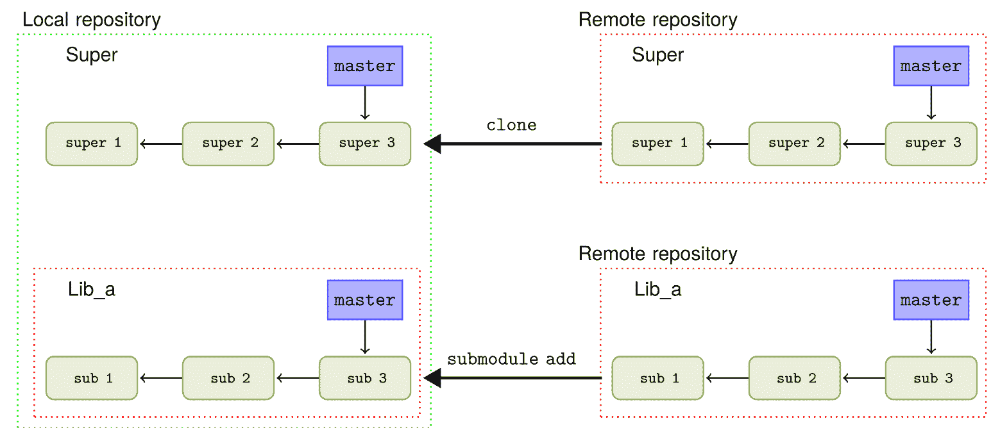
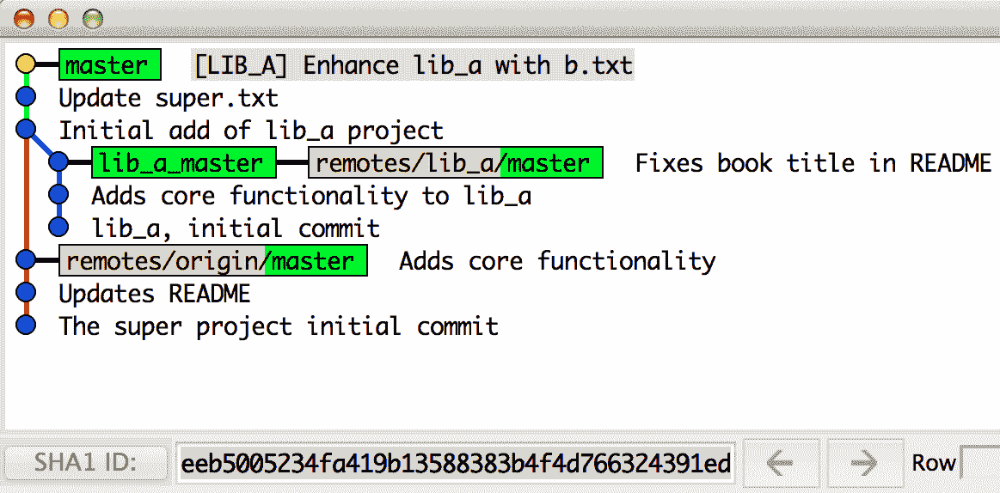
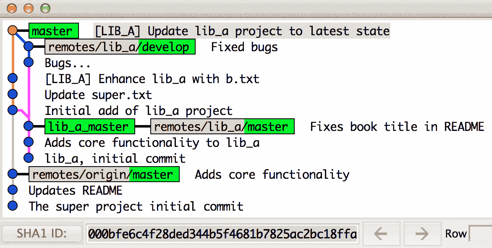
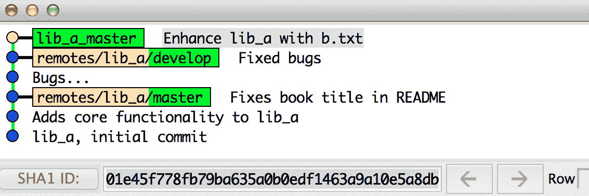
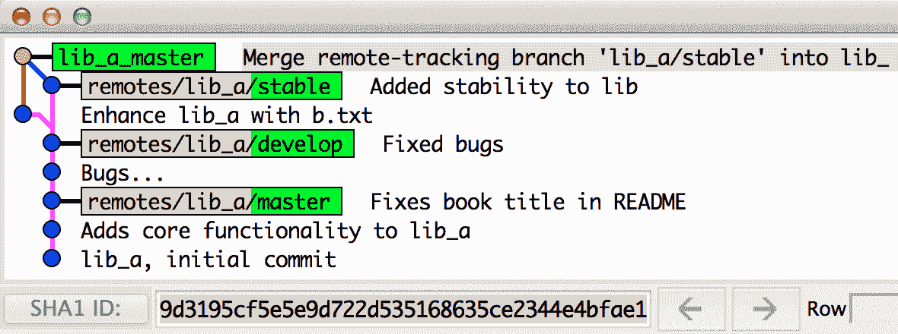
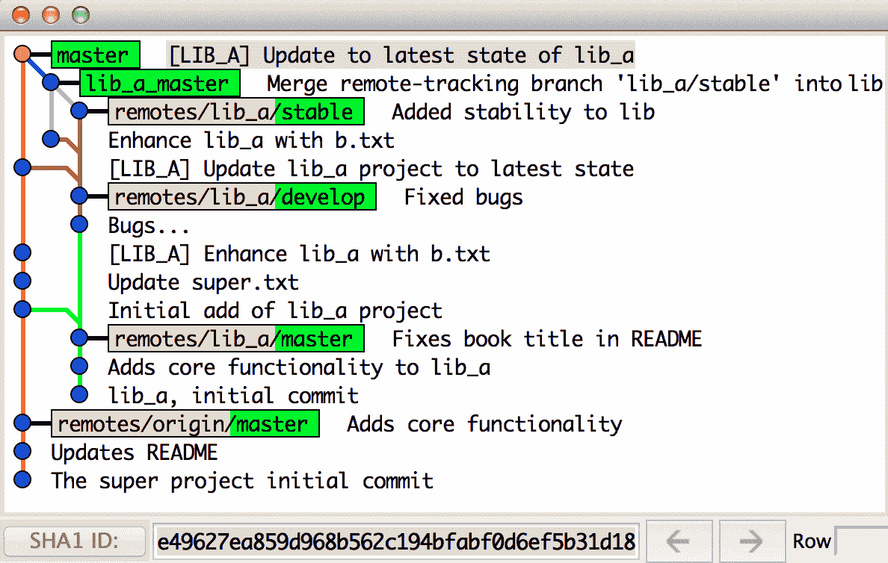

# 仓库维护

在本章中，我们将涵盖以下方案：

+   修剪远程分支

+   手动运行垃圾回收

+   关闭自动垃圾回收

+   拆分仓库

+   重写历史——修改单个文件

+   创建仓库备份作为镜像仓库

+   快速“如何做”子模块

+   子树合并

+   子模块与子树合并

# 介绍

在本章中，我们将探讨用于仓库维护的各种工具。我们将学习如何轻松删除已从远程仓库删除的本地仓库中的分支。我们还将了解如何触发垃圾回收以及如何关闭它。我们将查看如何使用 `filter-branch` 命令拆分一个仓库，并了解如何使用相同的命令重写仓库的历史。最后，我们将简要了解如何将其他 Git 项目作为子项目集成到 Git 仓库中，采用子模块功能或子树策略。

# 修剪远程分支

通常，一个由 Git 跟踪的软件项目的开发是在功能分支上进行的，随着时间的推移，越来越多的功能分支被合并到主干中。通常，这些功能分支会在主仓库（origin）中被删除。然而，分支在所有克隆中不会自动删除，只有在执行拉取（fetch）和拉取请求（pull request）时。必须明确告诉 Git 从本地仓库中删除那些已从 origin 仓库删除的分支。

# 准备工作

首先，我们将设置两个仓库，并使用其中一个作为另一个的远程仓库。我们将使用 `Git-Version-Control-Second-Edition_hello_world_flow_model` 仓库，但首先我们会克隆一个仓库到本地裸仓库：

```
$ git clone --bare https://github.com/PacktPublishing/Git-Version-Control-Cookbook-Second-Edition_hello_world_flow_model.git hello_world_flow_model_remote Cloning into bare repository 'hello_world_flow_model_remote'...
remote: Counting objects: 51, done.
remote: Total 51 (delta 0), reused 0 (delta 0), pack-reused 51
Unpacking objects: 100% (51/51), done. 
```

接下来，我们将把新克隆的仓库克隆到一个本地仓库，并附带工作目录：

```
$ git clone hello_world_flow_model_remote hello_world_flow_model 
```

现在，让我们删除裸仓库中的几个已合并的功能分支：

```
$ cd hello_world_flow_model_remote 
$ git branch -D feature/continents  
$ git branch -D feature/printing  
$ git branch -D release/1.0  
$ cd .. 
```

最后，切换到工作副本目录并确保 `develop` 分支已被检出：

```
$ cd hello_world_flow_model 
$ git checkout develop 
$ git reset --hard origin/develop
```

# 如何操作...

1.  首先，使用以下命令列出所有分支：

```
$ git branch -a 
* develop 
 remotes/origin/HEAD -> origin/develop 
 remotes/origin/develop 
 remotes/origin/feature/cities 
 remotes/origin/feature/continents 
 remotes/origin/feature/printing 
 remotes/origin/master 
 remotes/origin/release/1.0 
```

1.  让我们尝试执行拉取或拉取请求，看看是否发生了任何变化，使用以下命令：

```
$ git fetch 
$ git pull 
Already up to date. 
$ git branch -a 

* develop 
 remotes/origin/HEAD -> origin/develop 
 remotes/origin/develop 
 remotes/origin/feature/cities 
 remotes/origin/feature/continents 
 remotes/origin/feature/printing 
 remotes/origin/master 
 remotes/origin/release/1.0 
```

1.  即使远程仓库中的分支已被删除，分支仍然存在于本地仓库中。我们需要明确告诉 Git 删除那些已经从远程仓库删除的分支，使用以下命令：

```
$ git fetch --prune 
 x [deleted]         (none)     -> origin/feature/continents 
 x [deleted]         (none)     -> origin/feature/printing 
 x [deleted]         (none)     -> origin/release/1.0 
$ git branch -a 
* develop 
 remotes/origin/HEAD -> origin/develop 
 remotes/origin/develop 
 remotes/origin/feature/cities 
 remotes/origin/master
```

这些分支现在也已从我们的本地仓库中删除。

# 它是如何工作的...

Git 会检查远程或 origin 命名空间下的远程跟踪分支，并移除那些在远程仓库中已不存在的分支。

# 还有更多...

有几种方法可以从 Git 中删除已经从主分支删除的分支。我们可以在更新本地仓库时进行操作，正如我们在使用`git fetch --prune`时所看到的，也可以使用`git pull --prune`。甚至可以使用`git remote prune origin`命令来执行。这将删除远程仓库中已不再存在的分支，但不会更新仓库中的远程跟踪分支。

# 手动运行垃圾回收

在日常使用 Git 时，你可能会注意到某些命令有时会触发 Git 执行垃圾回收，并将松散的对象打包成一个包文件（Git 的对象存储）。垃圾回收和松散对象的打包也可以通过执行`git gc`命令手动触发。如果你有很多松散对象，触发`git gc`会非常有用。松散对象可以是例如一个 blob、一个树对象或一个提交对象。正如我们在第一章 *Git 导航* 中看到的，`blob-`、`tree-`和`commit`对象会在我们添加文件并创建提交时被添加到 Git 的数据库中。这些对象最初作为不可达的对象存储在 Git 的对象存储中，以单独的文件形式存放在`.git/objects`文件夹中。最终，或者通过手动请求，Git 会将这些松散对象打包成包文件，这样可以减少磁盘使用。添加大量文件到 Git 后，很多对象会变成松散的对象，例如，当你开始一个新项目或频繁执行添加和提交时。运行垃圾回收将确保松散的对象被打包，并且任何没有被任何引用或对象指向的对象会被删除。当你删除了某些分支或提交，并希望确保它们所引用的对象也被删除时，这一操作尤其有用。

让我们看看如何触发垃圾回收，并从数据库中移除一些对象。

# 准备工作

首先，我们需要一个仓库来执行垃圾回收操作。我们将使用与之前示例相同的仓库：

```
$ git clone https://github.com/PacktPublishing/Git-Version-Control-Cookbook-Second-Edition_hello_world_flow_model.git  
$ cd hello_world_flow_model 
$ git checkout develop 
$ git reset --hard origin/develop 
```

# 如何执行...

1.  首先，我们将检查仓库中未打包的对象；我们可以使用`count-objects`命令来执行此操作：

```
$ git count-objects 
51 objects, 204 kilobytes 
```

1.  我们还将检查不可达的对象，这些对象是无法通过任何引用（标签、分支或其他对象）访问的对象。这些不可达的对象将在垃圾回收运行时被删除。我们还将使用以下命令检查`.git`目录的大小：

```
$ git fsck --unreachable 
Checking object directories: 100% (256/256), done. 

$ du -sh .git 

292K  .git # Linux - 1K = 1024 bytes
300K  .git # MacOS - 1K = 1000 bytes
```

1.  目前没有不可达的对象。这是因为我们刚刚克隆了仓库，并未实际进行操作。如果我们删除远程仓库的源（origin），远程分支（`remotes/origin/*`）将会被删除，且我们会失去对某些对象的引用；这些对象在运行`fsck`时会显示为不可达，并且可以被垃圾回收：

```
$ git remote rm origin 
$ git fsck --unreachable 
Checking object directories: 100% (256/256), done. 
unreachable commit 127c621039928c5d99e4221564091a5bf317dc27 
unreachable commit 472a3dd2fda0c15c9f7998a98f6140c4a3ce4816 
unreachable blob e26174ff5c0a3436454d0833f921943f0fc78070
unreachable tree f03964e50809d5a0a9d35c208001b141ac36d997 
unreachable commit f336166c7812337b83f4e62c269deca8ccfa3675 
```

1.  我们可以看到，由于远程仓库被删除，导致一些不可达的对象。让我们尝试手动触发垃圾回收：

```
$ git gc 
Counting objects: 46, done. 
Delta compression using up to 8 threads. 
Compressing objects: 100% (44/44), done. 
Writing objects: 100% (46/46), done. 
Total 46 (delta 18), reused 0 (delta 0) 
```

1.  如果我们现在检查仓库，我们将看到以下内容：

```
$ git count-objects 
5 objects, 20 kilobytes 
$ git fsck --unreachable 
Checking object directories: 100% (256/256), done. 
Checking objects: 100% (46/46), done. 
unreachable commit 127c621039928c5d99e4221564091a5bf317dc27 
unreachable commit 472a3dd2fda0c15c9f7998a98f6140c4a3ce4816 
unreachable blob e26174ff5c0a3436454d0833f921943f0fc78070 
unreachable tree f03964e50809d5a0a9d35c208001b141ac36d997
unreachable commit f336166c7812337b83f4e62c269deca8ccfa3675 
$ du -sh .git 
120K  .git # Linux
124K  .git # MacOS
```

1.  对象的数量变小了。Git 已将这些对象打包到存储在 `.git/objects/pack` 文件夹中的包文件中。仓库的大小也变小了，因为 Git 对包文件中的对象进行了压缩和优化。然而，仍然有一些无法访问的对象残留。这是因为对象只有在它们比 `gc.pruneexpire` 配置选项指定的时间更久远时才会被删除，而该选项的默认值为两周（`config value: 2.weeks.ago`）。我们可以通过运行 `--prune=now` 选项来覆盖默认或配置的选项：

```
$ git gc --prune=now 
Counting objects: 46, done. 
Delta compression using up to 8 threads. 
Compressing objects: 100% (26/26), done. 
Writing objects: 100% (46/46), done. 
Total 46 (delta 18), reused 46 (delta 18)
```

1.  调查该仓库会产生以下输出：

```
$ git count-objects 
0 objects, 0 kilobytes 
$ git fsck --unreachable 
Checking object directories: 100% (256/256), done. 
Checking objects: 100% (46/46), done. 
$ du -sh .git 
100K  .git # Linux
104K  .git # MacOS
```

无法访问的对象已被删除，仓库中没有松散的对象，且由于对象已被删除，仓库的大小也变小了。

# 其工作原理...

`git gc` 命令通过压缩文件修订版本和删除没有引用的对象来优化仓库。这些对象可以是提交（commits）等。在一个被废弃（删除）的分支上，`git add` 的调用、通过 `git commit --amend` 丢弃/重做的提交或其他命令可能会留下对象。对象在创建时默认已经通过 `zlib` 压缩，并且在移入包文件（pack file）时，Git 确保只存储必要的更改。例如，如果你只更改了一个大文件中的一行，将整个文件再次存储到包文件中会浪费一些空间。相反，Git 会将最新的文件作为整体存储在包文件中，只存储旧版本的增量（delta）。这非常聪明，因为你更可能需要的是文件的最新版本，并且 Git 不需要为此进行增量计算。这看起来似乎与第一章中学到的 Git 存储快照而非增量的说法相矛盾。可是，记住快照是如何生成的。Git 对文件内容进行哈希处理，生成 `tree` 和 `commit` 对象，而提交对象（commit object）描述了完整的树状态，并通过 `root-tree sha-1` 哈希来表示。存储对象到包文件中不会影响树状态的计算。当你检查早期版本的提交时，Git 会确保 sha-1 哈希值与所请求的分支、提交或标签匹配。

# 关闭自动垃圾回收

自动触发垃圾回收的功能可以关闭，这样它就不会自动运行，除非手动触发。这在你搜索丢失的提交或文件时非常有用，可以确保在搜索过程中（运行 Git 命令时）不会被垃圾回收。

# 准备工作

我们将再次使用 `Git-Version-Control-Cookbook-Second-Edition_hello_world_flow_model` 仓库作为本例：

```
$ git clone https://github.com/PacktPublishing/Git-Version-Control-Cookbook-Second-Edition_hello_world_flow_model.git 
Cloning into 'Git-Version-Control-Cookbook-Second-Edition_hello_world_flow_model'... 
remote: Reusing existing pack: 51, done. 
remote: Total 51 (delta 0), reused 0 (delta 0) 
Unpacking objects: 100% (51/51), done. 
Checking connectivity... done. 
$ cd Git-Version-Control-Cookbook-Second-Edition_hello_world_flow_model 
$ git checkout develop 
Already on 'develop' 
Your branch is up-to-date with 'origin/develop'. 
$ git reset --hard origin/develop 
HEAD is now at 2269dcf Merge branch 'release/1.0' into develop 
```

# 如何操作...

1.  为了关闭自动垃圾回收的触发，我们需要将 `gc.auto` 配置设置为 0。首先，我们将检查现有设置，然后可以使用以下命令设置并验证配置：

```
$ git config gc.auto # exit code is 1 when not set
$ echo $?
1
$ git config gc.auto 0 
$ git config gc.auto 
0
```

1.  现在我们可以尝试使用`git gc`命令并加上`--auto`标志，因为它将在从其他命令触发时被自动调用：

```
$ git gc --auto
```

1.  正如预期的那样，什么也没发生，因为配置禁用了自动垃圾回收。不过，我们仍然可以手动触发它（不带`--auto`标志）：

```
$ git gc 
Counting objects: 51, done. 
Delta compression using up to 8 threads. 
Compressing objects: 100% (49/49), done. 
Writing objects: 100% (51/51), done. 
Total 51 (delta 23), reused 0 (delta 0) 
```

# 拆分一个仓库

有时，一个由 Git 跟踪的项目并不是一个逻辑上的单一项目，而是由多个项目组成的。这可能是完全有意为之，没什么问题，但也可能存在这样的情况，仓库中跟踪的项目确实应该分属于两个不同的仓库。你可以想象一个项目，其中代码库不断增长，在某个时刻，某个子项目可能会成为一个独立的项目。通过拆分包含该子项目的子文件夹和/或文件，可以实现这个目标，同时保留触及这些文件和/或文件夹的完整提交历史。

# 准备中

在这个示例中，我们将使用 JGit 仓库，这样我们就有一些历史记录可以筛选。我们拆分的子文件夹并不是真正的项目，而是作为此练习的示例。

1.  首先，克隆 JGit 仓库，并使用以下命令为远程分支创建本地分支：

```
$ git clone https://git.eclipse.org/r/jgit/jgit 
Cloning into 'jgit'... 
remote: Counting objects: 98, done
remote: Total 95247 (delta 0), reused 95247 (delta 0)
Receiving objects: 100% (95247/95247), 41.25 MiB | 1.91 MiB/s, done.
Resolving deltas: 100% (41334/41334), done.
$ cd jgit 
$ git checkout master 
Already on 'master' 
Your branch is up-to-date with 'origin/master'.
```

1.  将当前分支的名称保存到一个名为 `current` 的变量中：

```
$ current=$(git rev-parse --symbolic-full-name --abbrev-ref HEAD) 
```

1.  在接下来的步骤中，我们从仓库中的所有远程分支创建本地分支：

```
$ for br in $(git branch -a | grep -v $current | grep remotes | grep -v HEAD); 
 do 
 git branch ${br##*/} $br; 
 done 

Branch stable-0.10 set up to track remote branch stable-0.10 from origin. 
Branch stable-0.11 set up to track remote branch stable-0.11 from origin. 
Branch stable-0.12 set up to track remote branch stable-0.12 from origin. 
... 
```

首先，我们过滤分支。从所有分支（`git branch -a`）中，我们排除那些在名称中包含 `$current` 变量的分支（`grep -v $current`）。然后，我们仅包括那些匹配远程仓库的分支（`grep remotes`）。最后，我们排除所有带有 `HEAD` 的分支（`grep -v HEAD`）。对于每个分支（`$br`），我们创建一个本地分支，分支名取自该分支全名中最后一个 "`/`" 后的部分（`git branch ${br##*/} $br`）。例如，`remotes/origin/stable-0.10` 这个分支变成了本地分支 `stable-0.10`。

1.  现在，我们将准备一个简短的脚本，该脚本会删除除输入的 Git 索引中的内容之外的所有内容。将以下内容保存为`clean-tree`文件，放在包含 JGit 仓库的文件夹中（不是仓库本身）：

```
#!/bin/bash 
# Clean the tree for unwanted dirs and files 
# $1 Files and dirs to keep 

clean-tree () { 
 # Remove everything but $1 from the git index/staging area 
 for f in $(git ls-files | grep -v -E "$1" | grep -o -E "^[^/\"]+" | sort -u); do 
 git rm -rq --cached --ignore-unmatch $f 
 done 
} 

clean-tree $1 
```

这个简短的脚本过滤所有当前在暂存区中的文件（`git ls-files`），排除与输入匹配的文件（`grep -v -E "$1"`）。它只列出文件的 `name/path` 的第一部分，直到遇到第一个 "`/`"（`grep -o -E "^[^/\"]"`），最后按唯一条目进行排序（`sort -u`）。剩余列表中的条目（`$f`）将从 Git 暂存区中移除（`git rm -rq --cached --ignore-unmatch $f`）。`--cached` 选项告诉 Git 从暂存区中删除文件，`--ignore-unmatch` 告诉 Git 如果文件在暂存区中不存在时不要报错。`-rq` 选项分别表示递归和安静模式。

暂存区包含 Git 在最后一次快照（提交）中跟踪的所有文件，以及你通过 `git add` 添加的文件（修改或新增）。然而，当你运行 `git status` 时，你只会看到最新提交和暂存区之间的差异，以及工作树和暂存区之间的差异。

1.  使用以下命令使文件具有可执行权限：

```
$ chmod +x clean-tree 
```

1.  现在我们准备好将仓库的一个子部分拆分出来。

# 如何操作...

1.  首先，我们需要决定哪些文件夹和文件需要保留在新的仓库中；我们会删除仓库中的所有内容，除了那些需要保留的文件。我们会将需要保留的文件和文件夹以 `|` 分隔，存储在一个字符串中，以便将其作为正则表达式传递给 `grep`，如下所示的命令：

```
keep="org.eclipse.jgit.http|LICENSE|.gitignore|README.md|.gitattributes" 
```

1.  现在我们准备好开始转换仓库了。我们将使用 `git filter-branch` 命令，它可以重写整个仓库的历史；这正是我们需要完成此任务的工具。

始终记得确保在运行 `git filter-branch` 前备份好即将操作的仓库，以防出现意外。

1.  我们将使用 `--index-filter` 选项来过滤分支。该选项允许我们在每个提交记录之前重写索引或暂存区，我们将使用之前创建的 `clean-tree` 脚本来完成这一操作。我们还将使用 `cat` 作为 `tag-name-filter` 来保留标签。我们将在所有分支上执行重写，并记得使用清理脚本的绝对路径：

```
$ git filter-branch --prune-empty  --index-filter "\"/absolute/path/to/clean-tree\" \"$keep\"" --tag-name-filter cat -- --all 
...
Rewrite 720734983bae056955bec3b36cc7e3847a0bb46a (13/3051) 
Rewrite 6e1571d5b9269ec79eadad0dbd5916508a4fee82 (23/3051) 
Rewrite 2bfe561f269afdd7f4772f8ebf34e5e25884942b (37/3051) 
Rewrite 2086fdaedd5e71621470865c34ad075d2668af99 (60/3051) 
... 
```

1.  重写过程需要一些时间，因为所有的提交都需要被处理。重写完成后，我们可以看到所有内容都被删除了，除了我们想要保留的文件和文件夹：

```
$ git ls-tree --abbrev HEAD 
100644 blob f57840b7e .gitattributes
100644 blob 3679a3365 .gitignore
100644 blob 1b85c6466 LICENSE
100644 blob 54133e1d3 README.md
040000 tree 2edd8e193 org.eclipse.jgit.http.apache
040000 tree cda583881 org.eclipse.jgit.http.server
040000 tree daace995c org.eclipse.jgit.http.test
```

1.  清理工作还没有完成。`git filter-branch` 会将所有原始引用、分支和标签保存到仓库的 `refs/original` 命名空间中。经过验证，新历史看起来没问题后，我们可以删除原始的 `refs`，因为这些引用指向的对象不在我们当前的历史中，并且占用了大量磁盘空间。我们将删除所有原始引用，并运行垃圾回收器来清理仓库中的旧对象：

```
$ du -sh .git 
 53M  .git # MacOS
```

1.  删除原始引用 `refs/original`，并使用 `git gc` 删除旧对象，如下所示的命令：

```
$ git for-each-ref --format="%(refname)" refs/original/ | xargs -n 1 git update-ref -d 
$ git reflog expire --expire=now --all 
$ git gc --prune=now 
Counting objects: 96863, done.
Delta compression using up to 4 threads.
Compressing objects: 100% (28811/28811), done.
Writing objects: 100% (96863/96863), done.
Total 96863 (delta 42589), reused 94395 (delta 41334) 
```

1.  检查垃圾回收后的仓库大小：

```
$ du -sh .git 
44M  .git # MacOS
```

1.  仓库现在已清除所有旧对象，大小已减小，并且我们列出的需要保留的文件和目录的历史得以保留。

# 它是如何工作的...

`git filter-branch`命令根据在重写仓库时需要做的操作有不同的过滤选项。在这个例子中，我们只需要从仓库中移除文件和文件夹；`index-filter`非常实用，它允许我们在将提交记录到数据库之前重写索引，而无需实际检出磁盘上的树，从而节省了大量的磁盘 I/O。然后，我们使用之前准备好的`clean-tree`脚本来从索引中移除不需要的文件和文件夹。首先，我们列出索引的内容并过滤出我们想保留的文件和文件夹。然后，我们使用以下命令从索引中移除剩余的文件和文件夹（`$f`）：

```
git rm -rq --cached --ignore-unmatch $f 
```

`--cached`选项告诉 Git 从文件中移除索引，`-rq`选项告诉它递归地移除（r）并保持安静（q）。最后，使用`--ignore-unmatch`选项，这样即使`git rm`尝试移除索引中没有的文件，也不会导致错误退出。

# 还有更多内容...

`git filter-branch`有许多其他过滤器，最常用的过滤器及其使用场景如下：

+   `env-filter`：此过滤器用于修改记录提交时的环境，特别适用于重写作者和提交者的信息。

+   `tree-filter`：`tree-filter`用于重写树结构。如果需要在树中添加或修改文件，例如移除仓库中的敏感数据，它非常有用。

+   `msg-filter`：此过滤器用于更新提交信息。

+   `subdirectory-filter`：如果你想将一个子目录提取到新的仓库并保留该子目录的历史记录，可以使用此过滤器。该子目录将成为新仓库的根目录。

# 重写历史 – 更改单个文件

在这个例子中，我们将展示如何使用 Git 的`filter-branch`命令在整个仓库历史中移除敏感数据。

# 准备开始

为了简化操作，我们将使用一个非常简单的示例仓库。它包含几个文件，其中之一是`.credentials`，它包含一个用户名和密码。首先克隆仓库并切换到该目录，如下所示：

```
$ git clone https://github.com/PacktPublishing/Git-Version-Control-Cookbook-Second-Edition_Remove-Credentials.git 
$ cd Git-Version-Control-Cookbook-Second-Edition_Remove-Credentials 
```

在继续操作之前，可以使用`ls`查看仓库内容，并使用`git log`查看历史记录。

# 如何操作...

1.  由于我们需要在重写仓库历史时修改文件，所以我们将使用`tree-filter`选项来过滤分支。`.credentials`文件如下所示：

```
username = foobar
password = verysecret 
```

1.  我们需要做的就是删除文件中每行等号后面的内容。我们可以使用以下`sed`命令来实现：

```
sed -i '' -e 's/^\(.*=\).*$/\1/' 
```

1.  现在我们可以使用以下命令运行过滤分支：

```
$ git filter-branch --prune-empty  --tree-filter "test -f .credentials && sed -i '' -e 's/^\(.*=\).*$/\1/' .credentials || true" -- --all 
```

1.  如果我们现在查看文件，可以看到用户名和密码已经消失：

```
$ cat .credentials 
username = 
password = 
```

1.  如我们在之前的示例中所见，我们仍然需要在 `filter-branch` 后进行清理，删除原始引用，过期 `reflog`，并触发垃圾回收。但此时，你可以比较仓库的内容和提交历史。

# 它是如何工作的...

对于仓库中的每个提交，Git 会检查该提交的内容并运行 `tree-filter`。如果过滤器失败并返回非零退出码，`filter-branch` 会失败。因此，记得处理 `tree-filter` 可能失败的情况非常重要。这也是为什么之前的 `tree-filter` 会检查 `.credentials` 文件是否存在，如果存在，则运行 `sed` 命令，否则返回 `true` 以继续执行 `filter-branch`。

# 创建仓库的镜像仓库备份

尽管 Git 是分布式的，每个克隆实际上都是一个备份，但在备份 Git 仓库时，仍然有一些技巧可以派上用场。一个普通的 Git 仓库会有它跟踪的文件的工作副本，以及该仓库的完整历史记录，这些都保存在该仓库的 `.git` 文件夹中。服务器上的仓库，通常是你推送和拉取的仓库，通常是裸仓库。裸仓库是没有工作副本的仓库。大致上，它就只是一个普通仓库的 `.git` 文件夹。镜像仓库几乎与裸仓库相同，唯一的不同是它会获取所有位于 `refs/*` 下的引用，而裸仓库只会获取位于 `refs/heads/*` 下的引用。接下来，我们将更详细地看一下普通、裸和镜像克隆的 JGit 仓库。

# 准备工作

我们将从创建 JGit 仓库的三个克隆开始：一个普通的、一个裸的和一个镜像的克隆。当我们创建第一个克隆时，可以将其作为其他克隆的参考仓库。通过这种方式，我们可以共享数据库中的对象，而不需要将相同的数据传输三遍：

```
$ git clone https://git.eclipse.org/r/jgit/jgit 
$ git clone --reference jgit --bare https://git.eclipse.org/r/jgit/jgit 
$ git clone --mirror --reference jgit https://git.eclipse.org/r/jgit/jgit jgit.mirror 
```

# 如何操作...

1.  普通仓库与裸仓库或镜像仓库之间的一个区别是，裸仓库中没有远程分支。所有分支都是本地创建的。我们可以通过使用 `git branch` 命令列出这三个仓库中的分支，来看这一点：

```
$ cd jgit 
$ git branch 
* master 
$ cd ../jgit.git # or cd ../jgit.mirror 
$ git branch 
* master 
 stable-0.10 
 stable-0.11 
 stable-0.12 
... 
```

1.  为了查看裸仓库和镜像仓库之间的区别，我们需要列出不同的 refspec 获取和不同的 `refs` 命名空间。列出镜像仓库 (`jgit.mirror`) 中的 origin 的获取 `refspec`：

```
$ cd ../jgit.mirror
$ git config remote.origin.fetch 
+refs/*:refs/* 
```

1.  列出镜像仓库中的不同 `refs` 命名空间：

```
$ git show-ref | cut -f2 -d " " | cut -f1,2 -d / | sort -u 
refs/cache-automerge 
refs/changes 
refs/heads 
refs/meta 
refs/notes 
refs/tags 
```

1.  裸仓库 (`jgit.git`) 的 origin 配置中没有明确的 `refspec` 获取。当未找到配置条目时，Git 会使用默认的 `refspec` 获取，就像在普通仓库中一样。我们可以使用以下命令检查 origin 的远程 URL：

```
$ cd ../jgit.git
$ git config remote.origin.url 
https://git.eclipse.org/r/jgit/jgit 
```

1.  使用以下命令列出裸仓库中的不同 `refs` 命名空间，看看有什么不同：

```
$ git show-ref | cut -f2 -d " " | cut -f1,2 -d / | sort -u 
refs/heads 
refs/tags 
```

1.  最后，我们可以列出普通仓库 (`jgit`) 的 `refspec` 拉取和 `refs` 命名空间：

```
$ cd ../jgit 
$ git config remote.origin.fetch 
+refs/heads/*:refs/remotes/origin/* 
$ git show-ref | cut -f2 -d " " | cut -f1,2 -d / | sort -u 
refs/heads 
refs/remotes 
refs/tags 
```

1.  镜像仓库有四个在普通或裸仓库中找不到的 ref 命名空间：`refs-cache-automerge`、`changes`、`meta` 和 `notes`。普通仓库是唯一一个拥有 `refs/remote` 命名空间的仓库。

# 它的工作原理...

普通和裸仓库非常相似，只有镜像仓库显得与众不同。这是因为镜像仓库上的 `refspec` 拉取 `+refs/*:refs/*`，它将从远程获取所有 `refs` 而不仅仅是普通仓库（和裸仓库）所做的 `refs/heads/*` 和 `refs/tags/*`。JGit 仓库上许多不同的 `ref` 命名空间是因为 JGit 仓库由 Gerrit 代码审查管理。它使用不同的命名空间来存储仓库特定内容，例如用于所有提交的代码审查分支的变更分支和代码审查分数元数据。

`mirror` 仓库是当你想要快速备份 Git 仓库时的理想选择。它确保你包含了一切，而无需比 Git 仓库所在的主机的 Git 访问权限更多的额外访问权限。

# 还有更多...

GitHub 上的仓库在某些 refs 命名空间中存储额外的信息。如果一个仓库曾经发起过一个拉取请求，该拉取请求将记录在 `refs/pull/*` 命名空间中。让我们在下面的例子中看看这个：

```
$ git clone --mirror git@github.com:jenkinsci/extreme-feedback-plugin.git 
$ cd extreme-feedback-plugin.git 
$ git show-ref | cut -f2 -d " " | cut -f1,2 -d / | sort -u 
refs/heads 
refs/meta 
refs/pull 
refs/tags
```

# 一个快速的子模块 "如何"

在进行软件项目开发时，有时会遇到需要将另一个项目作为自己项目的一部分的情况。这个其他项目可以是任何东西，从你正在开发的另一个项目到第三方库。尽管需要在一个项目中使用另一个项目，但你希望保持这些项目的分离。Git 为这种项目依赖关系提供了一种机制，称为子模块。基本思想是你可以将另一个 Git 仓库克隆到你的项目中作为子目录，但保持两个仓库的提交记录分离，如下图所示：



# 准备工作

我们将从克隆一个示例仓库开始，作为超级项目的使用示例：

```
$ git clone https://github.com/PacktPublishing/Git-Version-Control-Cookbook-Second-Edition_Super.git 
$ cd Git-Version-Control-Cookbook-Second-Edition_Super
```

# 如何做...

1.  我们将把子项目`lib_a`作为 Git 子模块添加到超级项目中：

```
$ git submodule add https://github.com/PacktPublishing/Git-Version-Control-Cookbook-Second-Edition_lib_a.git lib_a 
Cloning into 'lib_a'... 
remote: Counting objects: 18, done. 
remote: Compressing objects: 100% (14/14), done. 
remote: Total 18 (delta 4), reused 17 (delta 3) 
Receiving objects: 100% (18/18), done. 
Resolving deltas: 100% (4/4), done. 
Checking connectivity... done. 
```

1.  让我们使用以下命令检查`git status`的状态：

```
$ git status 
On branch master 
Your branch is up-to-date with 'origin/master'. 

Changes to be committed: 
 (use "git reset HEAD <file>..." to unstage)  

 new file:   .gitmodules 
 new file:   lib_a 
```

1.  我们可以更仔细地查看 Git 索引中的两个文件；`.gitmodules` 是一个普通文件，所以我们可以使用 `cat`：

```
$ cat .gitmodules 
[submodule "lib_a"] 
 path = lib_a 
 url = https://github.com/PacktPublishing/Git-Version-Control-Cookbook-Second-Edition_lib_a.git 
$ git diff --cached lib_a 
diff --git a/lib_a b/lib_a 
new file mode 160000 
index 0000000..0d96e7c 
--- /dev/null 
+++ b/lib_a 
@@ -0,0 +1 @@ 
+Subproject commit 0d96e7cfc4d4db64002e63af0f7325d33bdaf84f
```

`.gitmodules`文件如上所述，包含有关所有在仓库中注册的子模块的信息。`lib_a`文件存储着当子模块被添加到超项目时，子模块`HEAD`指向的是哪个提交。每当子模块通过新的提交（本地创建或拉取）进行更新时，超项目在运行`git status`时会显示子模块发生了变化。如果子模块的更改可以接受，超项目中的子模块修订版本会通过添加子模块文件并提交到超项目来更新。

1.  我们将使用以下命令将子模块`lib_a`更新到开发分支上的最新更改：

```
$ cd lib_a 
$ git checkout develop 
Branch develop set up to track remote branch develop from origin by rebasing. 
Switched to a new branch 'develop' 
$ cd .. 
$ git status 
On branch master 
Your branch is ahead of 'origin/master' by 1 commit. 
 (use "git push" to publish your local commits) 

Changes not staged for commit: 
 (use "git add <file>..." to update what will be committed) 
 (use "git checkout -- <file>..." to discard changes in working directory) 

 modified:   lib_a (new commits) 

no changes added to commit (use "git add" and/or "git commit -a") 
```

1.  让我们检查一下子模块是否有任何更新：

```
$ git submodule update 
Submodule path 'lib_a': checked out '0d96e7cfc4d4db64002e63af0f7325d33bdaf84f' 
```

1.  哎呀！现在我们实际上已经将子模块重置为该子模块文件中描述的状态。我们需要再次切换到子模块，检查开发分支，并这次在超项目中创建一个提交：

```
$ cd lib_a 
$ git status 
HEAD detached at 0d96e7c 
nothing to commit, working directory clean 
$ git checkout develop 
Previous HEAD position was 0d96e7c... Fixes book title in README 
Switched to branch 'develop' 
Your branch is up-to-date with 'origin/develop'. 
$ cd .. 
$ git status 
On branch master 
Your branch is ahead of 'origin/master' by 1 commit. 
 (use "git push" to publish your local commits) 

Changes not staged for commit: 
 (use "git add <file>..." to update what will be committed) 
 (use "git checkout -- <file>..." to discard changes in working directory) 

 modified:   lib_a (new commits) 

no changes added to commit (use "git add" and/or "git commit -a") 
$ git add lib_a 
$ git commit -m 'Updated lib_a to newest version' 
[master 4d371bb] Updated lib_a to newest version 
 2 files changed, 4 insertions(+)
 create mode 100644 .gitmodules
 create mode 160000 lib_a 
```

注意，默认情况下，子模块处于分离头指针（detached head）状态，这意味着`HEAD`直接指向某个提交，而不是分支。你仍然可以编辑子模块并记录提交；但是，如果在超项目中执行子模块更新而没有首先提交新的子模块状态，你的更改可能会很难找到。切记，在切换到子模块工作时，一定要检查或创建一个分支。如果是这样，你只需要再次检出该分支，就能恢复你的更改。从 Git 1.8.2 版本开始，可以使子模块跟踪一个分支，而不是单个提交。Git 1.8.2 版本发布于 2013 年 3 月 13 日，你可以通过运行`git --version`来检查你的版本。

1.  为了让 Git 跟踪子模块的分支而不是特定的提交，我们需要记录我们想要跟踪的分支名称。这可以在子模块的`.gitmodules`文件中完成；在这里，我们将使用稳定分支：

```
$ git config -f .gitmodules submodule.lib_a.branch stable 
$ cat .gitmodules 
[submodule "lib_a"] 
 path = lib_a
```

```
 url = https://github.com/PacktPublishing/Git-Version-Control-Cookbook-Second-Edition_lib_a.git 
 branch = stable 
```

1.  我们现在可以添加并提交子模块，然后尝试使用以下命令更新它：

```
$ git add .gitmodules 
$ git commit -m 'Make lib_a module track its stable branch' 
[master bf9b9ba] Make lib_a module track its stable branch 
 1 file changed, 1 insertion(+) 
$ git submodule update --remote 
Submodule path 'lib_a': checked out '8176a16db21a48a0969e18a51f2c2fb1869418fb' 
$ git status 
On branch master 
Your branch is ahead of 'origin/master' by 2 commits. 
 (use "git push" to publish your local commits) 

Changes not staged for commit: 
 (use "git add <file>..." to update what will be committed) 
 (use "git checkout -- <file>..." to discard changes in working directory) 

 modified:   lib_a (new commits) 

no changes added to commit (use "git add" and/or "git commit -a") 
```

子模块仍然处于分离`HEAD`状态。然而，当使用`git submodule update --remote`更新子模块时，将从子模块的远程仓库拉取更改，并将子模块更新到它正在跟踪的分支的最新提交。我们仍然需要记录一次提交到超项目中，指定子模块的状态。

# 还有更多...

当你克隆一个包含一个或多个子模块的仓库时，你需要在克隆后显式地拉取它们。我们可以用新创建的子模块仓库尝试这个：

```
$ git clone super super_clone 
Cloning into 'super_clone'... 
done.
```

现在，初始化并更新子模块：

```
$ cd super_clone 
$ git submodule init 
Submodule 'lib_a' (https://github.com/PacktPublishing/Git-Version-Control-Cookbook-Second-Edition_lib_a.git) registered for path 'lib_a' 
$ git submodule update --remote 
Cloning into 'lib_a'... 
remote: Counting objects: 18, done. 
remote: Compressing objects: 100% (14/14), done. 
remote: Total 18 (delta 4), reused 17 (delta 3) 
Receiving objects: 100% (18/18), done. 
Resolving deltas: 100% (4/4), done. 
Checking connectivity... done. 
Submodule path 'lib_a': checked out '8176a16db21a48a0969e18a51f2c2fb1869418fb' 
```

仓库已准备好进行开发！

克隆仓库时，如果提供`--recursive`或`--recurse-submodules`选项，子模块可以在克隆后直接初始化和更新。

# 子树合并

子模块的替代方法是子树合并。子树合并是一种可以在使用 Git 执行合并时采用的策略。当将一个分支（或者如我们在本食谱中所看到的，另一个项目）合并到 Git 仓库的子目录而不是根目录时，这种策略非常有用。使用子树合并策略时，子项目的历史会与超级项目的历史合并，而子项目的历史可以保持清晰，除了那些计划合并到上游的提交。

# 准备工作

我们将使用与上一个食谱中相同的仓库，并重新克隆超级项目以摆脱子模块设置：

```
$ git clone https://github.com/PacktPublishing/Git-Version-Control-Cookbook-Second-Edition_Super.git
$ cd Git-Version-Control-Cookbook-Second-Edition_Super 
```

# 如何做...

1.  我们将把子项目作为一个新的远程仓库添加，并获取其历史记录：

```
$ git remote add lib_a https://github.com/PacktPublishing/Git-Version-Control-Cookbook-Second-Edition_lib_a.git
$ git fetch lib_a 
warning: no common commits 
remote: Reusing existing pack: 18, done. 
remote: Total 18 (delta 0), reused 0 (delta 0) 
Unpacking objects: 100% (18/18), done. 
From https://github.com/PacktPublishing/Git-Version-Control-Cookbook-Second-Edition_lib_a.git 
 * [new branch]      develop    -> lib_a/develop 
 * [new branch]      master     -> lib_a/master 
 * [new branch]      stable     -> lib_a/stable 
```

1.  现在我们可以创建一个本地分支`lib_a_master`，该分支指向与 lib a 的主分支(`lib_a/master`)相同的提交：

```
$ git checkout -b lib_a_master lib_a/master 
Branch lib_a_master set up to track remote branch master from lib_a by rebasing. 
Switched to a new branch 'lib_a_master' 
```

1.  我们可以使用以下命令检查工作树的内容：

```
$ ls 
README.md  a.txt
```

1.  如果我们切换回`master`分支，应该会在目录中看到超级仓库的内容：

```
$ git checkout master 
Switched to branch 'master' 
Your branch is up-to-date with 'origin/master'. 
$ ls 
README.md  super.txt 
```

1.  Git 会正常切换分支并填充工作目录，即使这些分支最初来自两个不同的仓库。现在，我们想将`lib_a`的历史合并到一个子目录中。首先，我们使用`ours`策略准备一个合并提交，并确保该提交未完成（我们需要引入所有文件）：

```
$ git merge -s ours --no-commit --allow-unrelated-histories lib_a_master 
Automatic merge went well; stopped before committing as requested 
```

简而言之，`ours`策略告诉 Git 执行以下操作：合并这个分支，但保持最终的树结构与该分支顶端的树结构相同。所以，分支被合并，但它所引入的所有更改都会被丢弃。在我们之前的命令行中，我们还传递了`--no-commit`选项。这个选项阻止 Git 完成合并，但让仓库保持在合并状态。现在我们可以将`lib_a`仓库的内容添加到仓库根目录中的`lib_a`文件夹。我们使用`git read-tree`来确保两个树完全相同，如下所示：

```
$ git read-tree --prefix=lib_a/ -u lib_a_master 
```

1.  我们当前的目录结构如下所示：

```
$ tree 
. 
|-- README.md 
|-- lib_a 
|   |-- README.md 
|   '-- a.txt 
'-- super.txt 
```

1.  现在是通过以下命令结束我们开始的合并提交的时候了：

```
$ git commit -m 'Initial add of lib_a project' 
[master 5066b7b] Initial add of lib_a project
```

现在，子项目已添加。接下来，我们将看到如何使用子项目中的新提交更新超级项目，并且如何将超级项目中的提交复制到子项目中。

1.  我们需要使用以下命令向超级项目添加并提交一些更改：

```
$ echo "Lib_a included!" >> super.txt 
$ git add super.txt 
$ git commit -m "Update super.txt" 
[master 83ef9a4] Update super.txt 
 1 file changed, 1 insertion(+) 
```

1.  对子项目进行了更改，并在超级项目中提交：

```
$ echo "The b file in lib_a" >> lib_a/b.txt 
$ git add lib_a/b.txt 
$ git commit -m "[LIB_A] Enhance lib_a with b.txt" 
[master debe836] [LIB_A] Enhance lib_a with b.txt 
 1 file changed, 1 insertion(+) 
 create mode 100644 lib_a/b.txt 
```

当前的历史记录如下图所示：



合并可以在之前的截图中看到，同时还可以看到仓库的两个根提交：原始根提交和来自`lib_a`的根提交。

1.  现在，我们将学习如何将子项目`lib_a`中做的新提交集成到超级仓库中。通常，我们会通过切换到`lib_a_master`分支并执行拉取操作，获取远程仓库中的最新提交。然而，由于我们在本食谱中使用的是示例仓库，`master`分支上没有新提交。因此，我们将使用`lib_a`的`develop`和`stable`分支。现在，我们将直接使用`lib_a/develop`引用，将`develop`分支中的提交集成到`lib_a`中，如下所示：

```
$ git merge -m '[LIB_A] Update lib_a project to latest state' -s  subtree lib_a/develop 
Merge made by the 'subtree' strategy. 
 lib_a/a.txt | 2 ++ 
 1 file changed, 2 insertions(+) 
```

现在，我们的`master`分支已经更新了来自`lib_a/develop`的提交，如下图所示：



1.  现在，是时候将我们在`lib_a`目录中所做的提交添加回`lib_a`项目了。首先，我们将切换到`lib_a_master`分支，并将其与`lib_a/develop`合并，以确保尽可能保持最新：

```
$ git checkout lib_a_master 
$ git merge lib_a/develop 
Updating 0d96e7c..ab47aca 
Fast-forward 
 a.txt | 2 ++ 
 1 file changed, 2 insertions(+)
```

1.  我们现在准备好将超级项目中的更改与子项目合并。为了避免将超级项目的历史与子项目合并，我们将使用`--squash`选项。这个选项会阻止 Git 完成合并，并且与之前的情况不同，我们也阻止了合并提交记录，它不会使仓库处于合并状态。然而，工作目录和暂存区的状态会像真正的合并一样：

```
$ git merge --squash -s subtree --no-commit master 
Squash commit -- not updating HEAD 
Automatic merge went well; stopped before committing as requested 
```

1.  现在，我们可以记录一个包含所有`lib_a`更改的提交到超级项目中：

```
$ git commit -m 'Enhance lib_a with b.txt' 
[lib_a_master 01e45f7] Enhance lib_a with b.txt 
 1 file changed, 1 insertion(+) 
 create mode 100644 b.txt 
```

`lib_a`仓库的历史如以下截图所示：



1.  我们可以将更多来自`lib_a/stable`的更改集成到超级项目中，但首先我们需要更新`lib_a_master`分支，以便能够从这里集成它们：

```
$ git merge lib_a/stable 
Merge made by the 'recursive' strategy. 
 a.txt | 2 ++ 
 1 file changed, 2 insertions(+)
```

一个新提交已添加到子项目中，如下图所示：



1.  最后的任务是将`lib_a_master`上的新提交集成到超级仓库中的`master`分支。这与之前的操作一样，通过`git merge`使用`subtree strategy`选项来完成：

```
$ git checkout master 
$ git merge -s subtree -m '[LIB_A] Update to latest state of lib_a' lib_a_master 
Merge made by the 'subtree' strategy. 
 lib_a/a.txt | 2 ++ 
 1 file changed, 2 insertions(+) 
```

结果历史如以下截图所示：



# 它是如何工作的...

当使用子树策略时，Git 会确定你试图合并的分支适合你的仓库中的哪个子树。这就是我们使用`read-tree`命令添加`lib_a`仓库内容的原因，以确保在超级项目中获得与`lib_a`项目根树相同的`lib_a`目录的 SHA-1 ID。在下面的示例中，SHA-1 ID 在第一条命令中找到。

我们可以通过查找在我们合并子项目的提交中`lib_a`树的 SHA-1 来验证这一点：

```
$ git log -1 | head -1 | awk '{print $2}' 0f10e563c6824402d30380c9f8fbf87769e64e8a $ git ls-tree 0f10e563c6824402d30380c9f8fbf87769e64e8a 100644 blob 456a5df638694a699fff7a7ff31a496630b12d01 README.md 040000 tree 7d66ad11cb22c6d101c7ac9c309f7dce25231394 lib_a 100644 blob c552dead26fdba634c91d35708f1cfc2c4b2a100 super.txt
```

`lib_a/master`上的根树 ID 可以通过以下命令获取：

```
$ git cat-file -p lib_a/master 
tree 7d66ad11cb22c6d101c7ac9c309f7dce25231394 
parent a7d76d9114941b9d35dd58e42f33ed7e32a9c134 
author John Doe <john.doe@example.com> 1396553189 +0200 
committer John Doe <john.doe@example.com> 1396553189 +0200 

Fixes book title in README 
```

# 参见

使用 `git subtree` 命令是另一种使用子树合并的方式。这在许多 Git 安装中默认未启用，但自 Git 1.7.11 起已随 Git 分发。您可以在以下链接中查看如何安装和使用：

+   要安装，请访问 [`github.com/git/git/blob/master/contrib/subtree/INSTALL`](https://github.com/git/git/blob/master/contrib/subtree/INSTALL)

+   要了解如何使用子树，请访问 [`github.com/git/git/blob/master/contrib/subtree/git-subtree.txt`](https://github.com/git/git/blob/master/contrib/subtree/git-subtree.txt)

如果您是 Homebrew 或 Ubuntu 用户，它们的基本包支持子树。对于 Fedora，您必须安装额外的软件包。

# 子模块与子树合并

对于一个项目是否应该使用子模块或者子树合并，没有一个简单的答案。选择子模块会给项目中的开发人员增加很大的额外压力，因为他们需要确保子模块和超级项目保持同步。选择通过子树合并添加项目时，对开发人员几乎没有额外的复杂性。然而，仓库维护者需要确保子项目是最新的，并且提交被添加回子项目中。这两种方法都行之有效，且广泛使用，可能只是一个习惯的问题。一个完全不同的解决方案是使用超级项目的构建系统来获取必要的依赖，例如 Maven 或 Gradle。
