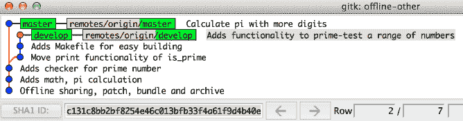

# 补丁和离线共享

在本章中，我们将介绍以下几种方法：

+   创建补丁

+   从分支创建补丁

+   应用补丁

+   发送补丁

+   创建 Git 打包

+   使用 Git 打包

+   从树中创建归档

# 介绍

由于 Git 的分布式特性以及现有的众多托管选项，当机器通过网络连接时，分享历史记录变得非常容易。如果需要共享历史记录的机器未连接或无法使用支持的传输机制，Git 提供了其他共享历史记录的方法。

Git 提供了一种简便的方法来格式化现有历史记录中的补丁，发送它们到电子邮件，并将其应用到另一个代码库。Git 还提供了一个打包概念，其中一个包含部分历史记录的打包可以作为另一个代码库的远程仓库。最后，Git 提供了一种简单易用的方式来创建一个特定引用的文件夹/子文件夹结构的快照归档。

借助 Git 提供的不同方法，特别是在常规的推送/拉取方法无法使用的情况下，分享代码库之间的历史记录变得更加容易。

# 创建补丁

在本节中，我们将学习如何从提交中创建补丁。补丁可以通过电子邮件快速共享，或者如果需要应用到离线计算机或类似设备，也可以复制到便携设备（如 USB 闪存、内存卡、外部硬盘等）。补丁是代码审查的有效方法，审查者可以将补丁应用到自己的代码库，调查差异并检查程序。如果审查者认为补丁没有问题，他们可以将其发布（`push`）到公共代码库，前提是审查者是该代码库的维护者。如果审查者拒绝该补丁，他们可以简单地将分支重置为原始状态，并通知补丁作者，补丁需要更多的工作才能被接受。

# 准备工作

在这个示例中，我们将克隆并使用一个新的代码库。该代码库只是一个示例库，用于 Git 命令，并且仅包含一些示例提交：

```
$ git clone https://github.com/PacktPublishing/Git-Version-Control-Cookbook-Second-Edition_offline-sharing.git $ cd Git-Version-Control-Cookbook-Second-Edition_offline-sharing $ git checkout master
```

# 操作方法...

让我们查看该代码库的历史记录，使用 `gitk` 显示如下：

```
$ git log --graph --all --oneline
* 4bc2b08 (master) Calculate pi with more digits
| * 971ac91 (doc) Adds Documentation folder
| * 2a0c8d6 Add build information
| * 9d00fcc Update readme
| | * 583225a (HEAD -> develop) Adds functionality to prime-test a range of numbers
| | * f6c5713 Adds Makefile for easy building
| | * d00ffc0 Move print functionality of is_prime
| |/
|/|
* | 6e46ff8 Adds checker for prime number
|/
* 8bddff2 Adds math, pi calculation
* 6de7cef Offline sharing, patch, bundle and archive
```

该代码库中有三个分支：`master`、`develop` 和 `doc`。它们之间的差异是通过一个或多个提交来体现的。在 `master` 分支上，我们现在可以为该分支的最新提交创建一个补丁文件，并将其存储在 `latest-commit` 文件夹中，如下所示：

```
$ git format-patch -1 -o latest-commit
latest-commit/0001-Calculate-pi-with-more-digits.patch
```

如果我们查看由 `patch` 命令创建的文件，我们将看到以下内容：

```
$ cat latest-commit/0001-Calculate-pi-with-more-digits.patch From 4bc2b08517141c2b84ae76ccaab3a380c19de8a6 Mon Sep 17 00:00:00 2001
From: John Doe <john.doe@example.com>
Date: Thu, 10 Apr 2014 09:19:29 +0200
Subject: [PATCH] Calculate pi with more digits

Dik T. Winter style

Build: gcc -Wall another_pi.c -o pi
Run: ./pi
---
 another_pi.c | 21 +++++++++++++++++++++
 1 file changed, 21 insertions(+)
 create mode 100644 another_pi.c

$ diff --git a/another_pi.c b/another_pi.c
new file mode 100644
index 0000000..86df41b
--- /dev/null
+++ b/another_pi.c
@@ -0,0 +1,21 @@
+/* Pi with 800 digits
+ * Dik T. Winter style, but modified sligthly
+ * https://crypto.stanford.edu/pbc/notes/pi/code.html
+ */
+ #include <stdio.h>
+
+void another_pi (void) {
 + printf("800 digits of pi:\n");
 + int a=10000, b=0, c=2800, d=0, e=0, f[2801], g=0;
 + for ( ;b-c; )f[b++]=a/5;
 + for (;d=0,g=c*2;c-=14,printf("%.4d",e+d/a),e=d%a)
 + for (b=c; d+=f[b]*a, f[b]=d%--g,d/=g--,--b; d*=b);
 +
 + printf("\n");
+}
+
+int main (void){
+ another_pi();
+
+ return 0;
+}
--
2.14.0 
```

上面的代码片段是生成的补丁文件的内容。它包含了类似邮件的头部，包含`From`、`Date`和`Subject`字段，正文是提交信息，之后是三个破折号（`---`）后面的实际补丁，最后是两个破折号（`--`），以及用于生成补丁的 Git 版本。`git format-patch`生成的补丁采用**UNIX**邮箱格式，但带有一个固定的时间戳，用于标识它来自`git format-patch`而非真实邮箱。你可以在`sha-1` ID 后的第一行看到时间戳：Mon Sep 17 00:00:00 2001。

# 它是如何工作的...

生成补丁时，Git 将`HEAD`处的提交与其父提交进行`diff`，并将此`diff`作为补丁。`-1`选项告诉 Git 只为最后一个提交生成补丁，而`-o latest-commit`告诉 Git 将补丁存储在`latest-commit`文件夹中。如果该文件夹不存在，将会创建它。

# 还有更多内容...

如果你想为多个提交创建补丁，比如最后的三个提交，只需传递`-3`给`git format-patch`，而不是`-1`。

将最近的三个提交格式化为`latest-commits`文件夹中的补丁：

```
$ git format-patch -3 -o latest-commits latest-commits/0001-Adds-math-pi-calculation.patch latest-commits/0002-Adds-checker-for-prime-number.patch latest-commits/0003-Calculate-pi-with-more-digits.patch $ ls -1 latest-commits 0001-Adds-math-pi-calculation.patch 0002-Adds-checker-for-prime-number.patch 0003-Calculate-pi-with-more-digits.patch
```

# 从分支创建补丁

你可以通过在运行`format-patch`命令时指定目标分支来创建补丁，而无需计算需要为之生成补丁的提交数量。

# 准备工作

我们将使用与前一个示例相同的仓库：

```
$ git clone https://github.com/PacktPublishing/Git-Version-Control-Cookbook-Second-Edition_offline-sharing.git $ cd Git-Version-Control-Cookbook-Second-Edition_offline-sharing
```

确保我们已经检查出`develop`分支：

```
$ git checkout develop
```

# 如何操作...

我们假设已经在`develop`分支上进行了一些提交。现在，我们需要将这些提交格式化为补丁，以便发送给仓库维护者或将它们带到另一台机器上。

让我们来看一下`develop`分支上不在`master`分支上的提交：

```
$ git log --oneline master..develop 583225a (HEAD -> develop) Adds functionality to prime-test a range of numbers
f6c5713 Adds Makefile for easy building
d00ffc0 Move print functionality of is_prime 
```

现在，我们将不再运行`git format-patch -3`来生成这三个提交的补丁，而是告诉 Git 为所有不在`master`分支上的提交生成补丁：

```
$ git format-patch -o not-on-master master not-on-master/0001-Move-print-functionality-of-is_prime.patch not-on-master/0002-Adds-Makefile-for-easy-building.patch not-on-master/0003-Adds-functionality-to-prime-test-a-range-of-numbers.patch
```

# 它是如何工作的...

Git 会列出`develop`分支中没有在`master`分支上的提交，就像我们在创建补丁之前所做的一样，并为这些提交生成补丁。我们可以检查`not-on-master`文件夹的内容，这个文件夹是我们指定的输出文件夹（`-o`），并验证它是否包含预期的补丁：

```
$ ls -1 not-on-master 0001-Move-print-functionality-of-is_prime.patch 0002-Adds-Makefile-for-easy-building.patch 0003-Adds-functionality-to-prime-test-a-range-of-numbers.patch
```

# 还有更多内容...

`git format-patch`命令除了`-<n>`选项用于指定要生成补丁的提交数量外，还有很多其他选项，比如`-o <dir>`用于指定目标目录。以下是一些有用的选项：

+   `-s`、`--signoff`：在补丁文件的提交信息中添加一行`Signed-off-by`，其中包含提交者的名字。当向仓库维护者发送补丁时，通常需要这一行。当补丁发送到 Linux 内核邮件列表或 Git 邮件列表时，这一行是接受补丁的必要条件。

+   `-n`、`--numbered`：将补丁在主题行中编号为`[PATCH n/m]`。

+   `--suffix=.<sfx>`：设置补丁的后缀；它可以为空，且不必以点号开头。

+   `-q`, `--quiet`：在生成补丁时抑制打印补丁文件名。

+   `--stdout`：将所有提交输出到标准输出，而不是创建文件。

# 应用补丁

现在我们知道如何从提交中创建补丁了，是时候学习如何应用它们了。

# 准备工作

我们将使用之前示例中的仓库，以及生成的补丁，如下所示：

```
$ cd Git-Version-Control-Cookbook-Second-Edition_offline-sharing 
$ git checkout master
$ ls -1a
.
..
.git
Makefile
README.md
another_pi.c
latest-commit
math.c
not-on-master
```

# 如何操作...

首先，我们将切换到 `develop` 分支，并在第一个示例中应用从 `master` 分支生成的补丁（`0001-Calculate-pi-with-more-digits.patch`）。

我们使用 Git `am` 命令来应用补丁；`am` 是 `apply from mailbox` 的缩写：

```
$ git checkout develop
Your branch is up-to-date with 'origin/develop'.
$ git am latest-commit/0001-Calculate-pi-with-more-digits.patch
Applying: Adds functionality to prime-test a range of numbers
error: patch failed: math.c:47
error: math.c: patch does not apply
Patch failed at 0001 Adds functionality to prime-test a range of numbers
The copy of the patch that failed is found in: .git/rebase-apply/patch
When you have resolved this problem, run "git am --continue".
If you prefer to skip this patch, run "git am --skip" instead.
To restore the original branch and stop patching, run "git am --abort".
```

我们可以解决第 47 行的冲突（删除一个空行），然后继续：

```
$ git add math.c
$ git am --continue
Applying: Adds functionality to prime-test a range of numbers
```

我们还可以将 `master` 分支应用于从 `develop` 分支生成的一系列补丁，如下所示：

```
$ git checkout master
Switched to branch 'master'
Your branch is up-to-date with 'origin/master'.
$ git am not-on-master/*
Applying: Move print functionality of is_prime
Applying: Adds Makefile for easy building
Applying: Adds functionality to prime-test a range of numbers
```

# 它是如何工作的...

`git am` 命令获取输入中指定的邮件箱文件，并将文件中的补丁应用到需要的文件上。然后，使用补丁中的提交信息和作者信息记录一个提交。提交的提交者身份将是执行 `git am` 命令的人的身份。我们可以通过 `git log` 查看作者和提交者信息，但需要传递 `--pretty=fuller` 选项才能同时查看提交者信息：

```
$ git log -1 --pretty=fuller
commit 45e49d0c4fcd44b73e11d61e025a62ab2655e42d (HEAD -> master)
Author: John Doe <john.doe@example.com>
AuthorDate: Wed Apr 9 21:50:18 2014 +0200
Commit: John Doe <john.doe@example.com>
CommitDate: Sun Jun 3 21:58:46 2018 +0200

Adds functionality to prime-test a range of numbers 
```

# 还有更多...

`git am` 命令会应用指定文件中的补丁并记录提交到仓库。然而，如果你只想将补丁应用到工作树或暂存区，而不记录提交，可以使用 `git apply` 命令。

我们可以再次尝试将来自 `master` 分支的补丁应用到 `develop` 分支；我们只需要先重置 `develop` 分支：

```
$ git checkout develop
Switched to branch 'develop'
Your branch is ahead of 'origin/develop' by 1 commit.
      (use "git push" to publish your local commits)
$ git reset --hard origin/develop
HEAD is now at c131c8b Adds functionality to prime-test a range of numbers
$ git apply latest-commit/0001-Calculate-pi-with-more-digits.patch
```

我们可以使用 `status` 命令检查仓库的状态：

```
$ git status
On branch develop
Your branch is up-to-date with 'origin/develop'.

Untracked files:
  (use "git add <file>..." to include in what will be committed)

  another_pi.c
  latest-commit/
  not-on-master/

nothing added to commit but untracked files present (use "git add" to track)
```

我们成功地将补丁应用到工作树中。我们还可以使用 `--index` 选项将其应用到暂存区和工作树，或者仅使用 `--cached` 选项将其应用到暂存区。

# 发送补丁

在之前的示例中，你看到了如何创建和应用补丁。当然，你可以直接将这些补丁文件附加到电子邮件中，但 Git 提供了一种直接通过电子邮件发送补丁的方法，即 `git send-email` 命令。该命令需要一些设置，但如何配置依赖于你的邮件和 SMTP 设置。你可以在 Git 帮助页面找到通用指南，或者访问：[`git-scm.com/docs/git-send-email`](http://git-scm.com/docs/git-send-email)[.](http://git-scm.com/docs/git-send-email)

# 准备工作

我们将设置与之前示例相同的仓库：

```
$ git clone https://github.com/PacktPublishing/Git-Version-Control-Cookbook-Second-Edition_offline-sharing.git
$ cd Git-Version-Control-Cookbook-Second-Edition_offline-sharing
```

# 如何操作...

首先，我们将发送与第一个示例中创建的补丁相同的补丁。我们将使用在 Git 配置中指定的电子邮件地址将其发送给自己。让我们再次使用`git format-patch`创建补丁并使用`git send-email`发送：

```
$ git format-patch -1 -o latest-commit
latest-commit/0001-Calculate-pi-with-more-digits.patch
```

将 Git 配置中的邮箱地址保存到一个变量中，如下所示：

```
$ emailaddr=$(git config user.email)
```

使用`--to`和`--from`字段中的电子邮件地址发送补丁：

```
$ git send-email --to $emailaddr --from $emailaddr latest-commit/0001-Calculate-pi-with-more-digits.patch
latest-commit/0001-Calculate-pi-with-more-digits.patch
(mbox) Adding cc: John Doe <john.doe@example.com> from line 'From: John Doe <john.doe@example.com>'
  OK. Log says:
  Server: smtp.gmail.com
  MAIL FROM:<john.doe@example.com>
  RCPT TO:<john.doe@example.com>
  From: john.doe@example.com
  To: john.doe.example.com
  Subject: [PATCH] Calculate pi with more digits
  Date: Mon, 14 Apr 2014 09:00:11 +0200
  Message-Id: <1397458811-13755-1-git-send-email-john.doe@example.com>
  X-Mailer: git-send-email 1.9.1 
```

检查您的电子邮件会显示收件箱中有一封新邮件。

# 它是如何工作的...

如我们在前面的示例中看到的，`git format-patch` 以 Unix mbox 格式创建补丁文件，因此只需要一点额外的工作，就可以让 Git 将补丁作为电子邮件发送。使用`git send-email`发送电子邮件时，请确保您的**邮件用户代理**（**MUA**）不会在补丁文件中断行、将制表符替换为空格等。您可以通过将补丁发送给自己并检查它是否能够顺利应用到您的代码库来轻松测试这一点。

# 还有更多...

`send-email`命令当然可以一次发送多个补丁。如果指定的是一个目录而不是单个补丁文件，该目录中的所有补丁都会被发送。我们甚至不需要在发送之前生成补丁文件；只需要指定我们希望发送的修订范围，就像为`format-patch`命令指定范围一样。然后，Git 会动态生成补丁并发送。当我们以这种方式发送一系列补丁时，最好创建一个求职信，对随后的补丁系列做一些解释。可以通过将`--cover-letter`选项传递给`send-email`命令来创建求职信。我们将尝试发送`develop`分支上的提交补丁，因为它是从`master`分支分出的（与第二个示例中的补丁相同），如下所示：

```
$ git checkout develop
Switched to branch 'develop'
Your branch is up-to-date with 'origin/develop'.
$ git send-email --to john.doe@example.com --from  
 john.doe@example.com --cover-letter --annotate origin/master
   /tmp/path/for/patches/0000-cover-letter.patch
   /tmp/path/for/patches/0001-Move-print-functionality-of-is_prime.patch
   /tmp/path/for/patches/0002-Adds-Makefile-for-easy-building.patch
   /tmp/path/for/patches/0003-Adds-functionality-to-prime-test-a-range-of-numbers.patch
   (mbox) Adding cc: John Doe <john.doe@example.com> from line 'From: John Doe <john.doe@example.com>'
   OK. Log says:
   Server: smtp.gmail.com
   MAIL FROM:<john.doe@example.com>
   RCPT TO:<john.doe@exmample.com>
   From: john.doe@example.com
   To: john.doe@example.com
   Subject: [PATCH 0/3] Cover Letter describing the patch series
   Date: Sat, 14 Jun 2014 23:35:14 +0200
   Message-Id: <1397459884-13953-1-git-send-email-john.doe@example.com>
   X-Mailer: git-send-email 1.9.1
   ...
```

我们可以检查我们的邮箱收件箱，看到我们发送的四封邮件：求职信和三个补丁。

在发送补丁之前，求职信已填写，并且默认情况下，主题行中会有`[PATCH 0/3]`（如果发送三个补丁）。仅包含默认模板主题和正文的求职信不会作为默认发送。在本章附带的脚本中，`git send-email`命令调用了`--force`和`--confirm=never`选项。这样做是为了脚本自动化，即使求职信没有从默认值更改，也强制 Git 发送邮件。您可以尝试删除这些选项，加入`--annotate`选项，并再次运行脚本。然后，您应该能够在发送邮件之前编辑包含补丁的求职信和电子邮件。

# 创建 Git 捆绑包

共享仓库历史记录的另一种方法是使用`git bundle`命令。Git 捆绑包是一系列可以作为远程仓库使用的提交，但不包括仓库的完整历史记录。

# 准备工作

我们将使用一个全新的`offline-sharing`仓库克隆，如下所示：

```
$ git clone https://github.com/PacktPublishing/Git-Version-Control-Cookbook-Second-Edition_offline-sharing.git
$ cd Git-Version-Control-Cookbook-Second-Edition_offline-sharing $ git checkout master
```

# 如何操作...

首先，我们将创建一个根打包，如以下命令所示，这样打包中的历史就形成了一个完整的历史，并且初始提交也被包含在内：

```
$ git bundle create myrepo.bundle master
Counting objects: 12, done.
Delta compression using up to 8 threads.
Compressing objects: 100% (11/11), done.
Writing objects: 100% (12/12), 1.88 KiB | 0 bytes/s, done.
Total 12 (delta 1), reused 0 (delta 0)
```

我们可以使用 `git bundle verify` 验证打包内容：

```
$ git bundle verify myrepo.bundle
The bundle contains this ref:
1e42a2dfa3a377d412efd27a77b973c75935c62a refs/heads/master
The bundle records a complete history.
myrepo.bundle is okay 
```

为了方便记住我们作为最新提交包含在打包中的提交，我们创建一个指向该提交的`tag`；该提交也被`master`分支指向：

```
$ git tag bundleForOtherRepo master
```

我们已经创建了包含仓库历史初始提交的根打包。现在我们可以创建第二个打包，包含从我们刚创建的标签到 `develop` 分支尖端的历史。请注意，在以下命令中，我们使用相同的打包文件名 `myrepo.bundle`，这将覆盖旧的打包文件：

```
$ git bundle create myrepo.bundle bundleForOtherRepo..develop
Counting objects: 12, done.
Delta compression using up to 8 threads.
Compressing objects: 100% (9/9), done.
Writing objects: 100% (9/9), 1.47 KiB | 0 bytes/s, done.
Total 9 (delta 2), reused 0 (delta 0) 
```

刚创建打包文件后立即覆盖它可能看起来很奇怪，但给打包文件使用相同的名称是有一定道理的。正如你将在下一个示例中看到的那样，在使用打包文件时，你将其作为远程添加到你的仓库，URL 就是打包文件的路径。第一次这样做时使用的是根打包文件和 URL。打包文件的文件路径将作为远程仓库的 URL 存储。因此，下一次你需要更新仓库时，只需覆盖打包文件并执行 `fetch` 操作即可。

如果我们验证打包内容，可以看到在目标仓库中需要先存在哪个提交，才能使用该打包：

```
$ git bundle verify myrepo.bundle
The bundle contains this ref:
c131c8bb2bf8254e46c013bfb33f4a61f9d4b40e refs/heads/develop
The bundle requires this ref:
ead7de45a504ee19cece26daf45d0184296f3fec
myrepo.bundle is okay
```

我们可以检查历史，看到 `ead7de4` 提交是 `develop` 分支分出的地方，所以这个提交作为我们刚创建的打包的基础是合理的：

```
$ gitk master develop
```

上述命令给出了以下输出：


# 工作原理...

`bundle` 命令创建一个包含指定提交范围历史的二进制文件。当创建一个不包含仓库初始提交的提交范围的打包（例如，`bundleForOtherRepo..develop`）时，重要的是要确保该范围与打算使用该打包的仓库中的历史相匹配。

# 使用 Git 打包

在上一个示例中，我们看到了如何从现有历史中创建包含指定历史范围的打包。现在，我们将学习如何使用这些打包，既可以创建一个新仓库，也可以为现有仓库添加历史。

# 准备工作

我们将使用与上一个示例相同的仓库和方法来创建打包，但我们将在本示例中重新创建它们，以便能够逐个使用。首先，我们将准备仓库和第一个打包，如以下命令所示：

```
$ rm -rf offline-sharing
$ git clone https://github.com/PacktPublishing/Git-Version-Control-Cookbook-Second-Edition_offline-sharing.git $ cd Git-Version-Control-Cookbook-Second-Edition_offline-sharing 
$ git checkout master 
Branch master set up to track remote branch master from origin by rebasing. 
Switched to a new branch 'master' 
$ git bundle create myrepo.bundle master 
Counting objects: 12, done. 
Delta compression using up to 8 threads. 
Compressing objects: 100% (11/11), done. 
Writing objects: 100% (12/12), 1.88 KiB | 0 bytes/s, done. Total 12 (delta 1), reused 0 (delta 0)  
$ git tag bundleForOtherRepo master
```

# 如何操作...

现在，让我们从我们刚创建的打包文件创建一个新仓库。我们可以使用 `git clone` 命令，并通过指定远程仓库的 URL 作为打包路径来实现这一点。我们将在以下代码片段中看到如何操作：

```
$ cd ..
$ git clone -b master Git-Version-Control-Cookbook-Second-Edition_offline-sharing/myrepo.bundle offline-other
Cloning into 'offline-other'...
Receiving objects: 100% (12/12), done.
Resolving deltas: 100% (1/1), done.
Checking connectivity... done.
```

新的仓库已在`offline-other`文件夹中创建。让我们使用以下命令检查该仓库的历史记录：

```
$ cd offline-other
$ git log --oneline --decorate --all
1e42a2d (HEAD, origin/master, master) Calculate pi with more digits
ead7de4 Adds checker for prime number
337bfd0 Adds math, pi calculation
7229805 Offline sharing, patch, bundle and archive
```

该仓库如预期包含原始仓库中`master`分支的所有历史记录。现在我们可以创建第二个捆绑包，跟前面的示例一样，它包含从我们创建的标签（`bundleForOtherRepo`）到`develop`分支顶端的历史记录：

```
$ cd ..
$ cd Git-Version-Cookbook-Second-Edition_offline-sharing
$ git bundle create myrepo.bundle bundleForOtherRepo..develop
Counting objects: 12, done.
Delta compression using up to 8 threads.
Compressing objects: 100% (9/9), done.
Writing objects: 100% (9/9), 1.47 KiB | 0 bytes/s, done.
Total 9 (delta 2), reused 0 (delta 0)
$ git bundle verify myrepo.bundle
The bundle contains this ref:
c131c8bb2bf8254e46c013bfb33f4a61f9d4b40e refs/heads/develop
The bundle requires this ref:
ead7de45a504ee19cece26daf45d0184296f3fec
myrepo.bundle is okay
```

正如我们在前面的示例中看到的那样，捆绑包要求`ead7de45a504ee19cece26daf45d0184296f3fec`提交已经存在于我们将使用该捆绑包的仓库中。让我们通过以下命令检查我们从第一个捆绑包创建的仓库是否包含此提交：

```
$ cd ..
$ cd offline-other
$ git show -s ead7de45a504ee19cece26daf45d0184296f3fec
 commit ead7de45a504ee19cece26daf45d0184296f3fec
 Author: John Doe <john.doe@example.com>
 Date:   Wed Apr 9 21:28:51 2014 +0200

  Adds checker for prime number
```

提交存在。现在我们可以使用新的捆绑包文件，它与我们创建的第一个捆绑包具有相同的文件名和路径。我们可以在`offline-other`仓库中使用`git fetch`命令，如下所示：

```
$ git fetch
  Receiving objects: 100% (9/9), done.
  Resolving deltas: 100% (2/2), done.
  From /path/to/repo/offline-sharing/myrepo.bundle
  * [new branch]      develop    -> origin/develop
```

现在我们可以`checkout develop`，并验证`develop`和`master`分支的历史记录是否与原始仓库中的一致：

```
$ git checkout develop
  Branch develop set up to track remote branch develop from origin by rebasing.
  Switched to a new branch 'develop'
$ gitk --all
```

上一个命令输出如下：



# 还有更多...

捆绑包对于在无法使用正常传输机制的机器上更新仓库历史记录非常有用，这些机器之间可能没有网络连接，防火墙规则等。当然，除了 Git 捆绑包外，还有其他方法可以将历史记录传输到远程机器。也可以使用 U 盘上的裸仓库，甚至可以将普通的补丁应用到仓库。Git 捆绑包的优点是，你不必每次更新远程时都将整个历史记录写入裸仓库，而只需要写入缺失的历史部分。

# 从树形结构创建归档

有时候，获取某个特定提交指定的目录结构快照而没有相应历史记录是很有用的。当然，这可以通过检出特定的提交后删除/省略`.git`文件夹来创建归档。但使用 Git，有一种更好的方法来做到这一点，它是内建的，因此可以从特定提交或引用创建归档。当使用 Git 创建归档时，你还确保归档仅包含 Git 跟踪的文件，而不会包含工作目录中可能存在的任何未跟踪文件或文件夹。

# 准备就绪

我们将使用本章前面示例中使用的相同的`offline-sharing`仓库：

```
$ git clone https://github.com/PacktPublishing/Git-Version-Control-Cookbook-Second-Edition_offline-sharing.git
$ cd Git-Version-Control-Cookbook-Second-Edition_offline-sharing
```

# 如何执行...

我们将首先创建`master`分支上最新提交的目录结构归档。默认情况下，`offline-sharing`仓库是检出的`develop`分支，因此我们将使用`origin/master`来指定归档的引用：

```
$ git archive --prefix=offline/ -o offline.zip origin/master
```

`--prefix` 选项会将指定的前缀添加到归档中的每个文件前，实际上是为仓库中的文件添加一个 `offline` 目录作为根目录，而 `-o` 选项告诉 Git 将归档文件创建为 `offline.zip`，当然，它会以 ZIP 格式进行压缩。我们可以检查 ZIP 归档，查看文件是否包含以下内容：

```
$ unzip -l offline.zip
  Archive:  offline.zip
  1e42a2dfa3a377d412efd27a77b973c75935c62a
    Length     Date   Time    Name
   --------    ----   ----    ----
        0  04-10-14 09:19   offline/
      162  04-10-14 09:19   offline/README.md
      485  04-10-14 09:19   offline/another_pi.c
      672  04-10-14 09:19   offline/math.c
   --------                   -------
     1319                   4 files
```

如果我们查看 Git 仓库中的 `origin/master` 提交，可以看到文件是相同的；`-l` 选项告诉 Git 指定每个文件的大小，如下所示：

```
$ git ls-tree -l origin/master
100644 blob c79cad47938a25888a699142ab3cdf764dc99193 162    README.md
100644 blob 86df41b3a8bbfb588e57c7b27742cf312ab3a12a 485    another_pi.c
100644 blob d393b41eb14561e583f1b049db716e35cef326c3 672    math.c
```

# 还有更多...

`archive` 命令也可以用于为仓库的子目录创建归档。我们可以在仓库的 `doc` 分支上使用此命令，将 `Documentation` 文件夹的内容打包成 ZIP 文件：

```
$ git archive --prefix=docs/ -o docs.zip origin/doc:Documentation
```

我们可以列出 ZIP 文件和 `origin/doc` 中的 `Documentation` 树，如下所示：

```
$ unzip -l docs.zip
  Archive:  docs.zip
   Length     Date   Time    Name
  --------    ----   ----    ----
        0  04-13-14 21:14   docs/
       99  04-13-14 21:14   docs/README.md
      152  04-13-14 21:14   docs/build.md
  --------                   -------
      251                   3 files
  $ git ls-tree -l origin/doc:Documentation
  100644 blob b65b4fc78c0e39b3ff8ea549b7430654d413159f 99  README.md
  100644 blob f91777f3e600db73c3ee7b05ea1b7d42efde8881 152  build.md
```

除了 ZIP 格式外，归档还有其他格式选项，例如 `tar`、`tar.gz` 等。可以使用 `--format=<format>` 选项指定格式，或者通过 `-o` 选项将格式作为输出文件名的后缀。以下两个命令将产生相同的输出文件：

```
$ git archive --format=tar.gz HEAD > offline.tar.gz
$ git archive -o offline.tar.gz HEAD
```

如果传递一个提交/标签 ID 或树 ID 作为标识符，Git 归档命令的行为会有所不同。如果给定了提交或标签 ID，该 ID 会被存储在 TAR 格式的全局扩展 pax 头中，或者作为文件评论存储在 ZIP 格式中。如果只给定了树 ID，则不会存储额外的信息。实际上，你可以在之前的示例中看到这一点，第一 ID 是作为分支引用的。由于该分支指向一个提交，该提交的 ID 被写为文件的注释，我们实际上可以在归档列出的输出中看到它：

```
$ unzip -l offline.zip
  Archive:  offline.zip
  1e42a2dfa3a377d412efd27a77b973c75935c62a
    Length     Date   Time    Name
   --------    ----   ----    ----
         0  04-10-14 09:19   offline/
       162  04-10-14 09:19   offline/README.md
       485  04-10-14 09:19   offline/another_pi.c
       672  04-10-14 09:19   offline/math.c
   --------                   -------
      1319                   4 files 
```

在第二个示例中，我们也传递了一个分支作为参考，此外，我们指定了 `Documentation` 文件夹作为我们希望从中创建归档的子文件夹。这相当于将树的 ID 传递给归档命令，因此，归档中不会存储额外的信息。
