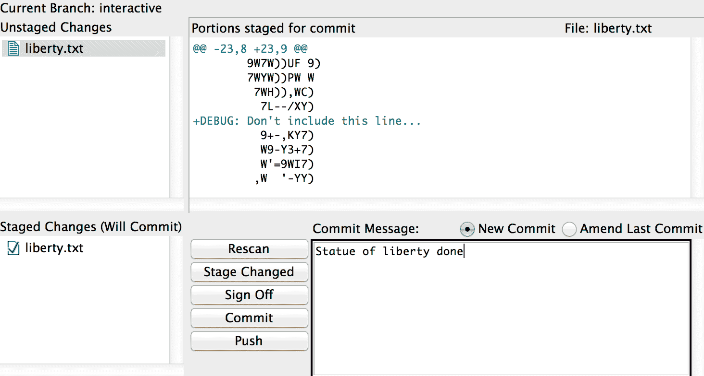

# 第十一章：提示与技巧

本章中，我们将介绍以下内容：

+   使用 git stash

+   保存和应用存储的更改

+   使用 git bisect 进行调试

+   使用 blame 命令

+   在提示符中为 UI 着色

+   自动补全

+   带有状态信息的 Bash 提示符

+   更多别名

+   交互式添加

+   使用 Git gui 进行交互式添加

+   忽略文件

+   显示和清理被忽略的文件

# 介绍

在本章中，你会发现一些在日常 Git 工作中非常有用的提示和技巧；从在重要任务被打断时存储更改，到通过 `bisect` 和 `blame` 高效调试，再到在提示符中查看颜色和状态信息。我们还将了解别名，如何选择要包含在提交中的行，从而创建干净的提交，最后，我们将介绍如何忽略文件。

# 使用 git stash

在这个例子中，我们将探索 `git stash` 命令，并学习如何使用它快速将未提交的更改存储起来，并在需要时重新获取。这在你被紧急任务打断时很有用，而此时你还不准备提交当前工作目录中的工作。使用 `git stash` 命令，你可以保存当前工作目录（有或没有暂存区）的状态，并将工作树恢复到干净的状态。

# 准备工作

在这个例子中，我们将使用 `Git-Version-Control-Cookbook-Second-Edition_tips_and_tricks` 仓库。我们将使用 `master` 分支，但在尝试 `stash` 命令之前，我们需要在工作目录和暂存区中创建一些更改，方法如下：

```
$ git clone https://github.com/PacktPublishing/Git-Version-Control-Cookbook-Second-Edition_tips_and_tricks.git
$ cd Git-Version-Control-Cookbook-Second-Edition_tips_and_tricks $ git checkout master
```

对 `foo` 进行一些更改并将它们添加到暂存区，方法如下：

```
$ echo "Just another unfinished line" >> foo
$ git add foo
```

对 `bar` 进行一些更改并创建一个新文件：

```
$ echo "Another line" >> bar
$ echo "Some content" > new_file
$ git status
On branch master
Your branch is up-to-date with 'origin/master'.

  Changes to be committed:
    (use "git reset HEAD <file>..." to unstage)

      modified:   foo

  Changes not staged for commit:
    (use "git add <file>..." to update what will be committed)
    (use "git checkout -- <file>..." to discard changes in working directory)

      modified:   bar

  Untracked files:
    (use "git add <file>..." to include in what will be committed)

     new_file

```

我们可以看到有一个文件被添加到暂存区，`foo`，一个文件被修改，`bar`，以及一个未跟踪的文件在工作区中，`new_file`。

# 如何操作…

在我们仓库的前述状态下，我们可以将更改存储起来，以便去处理其他事务。基本命令会将暂存区的更改和对已跟踪文件的更改存储起来。它会将未跟踪的文件留在工作目录中：

```
$ git stash
Saved working directory and index state WIP on master: d611f06 Update foo and bar
$ git status
On branch master
Your branch is up-to-date with 'origin/master'.

  Untracked files:
    (use "git add <file>..." to include in what will be committed)

      new_file

nothing added to commit but untracked files present (use "git add" to track)  
```

现在我们可以处理其他事务，创建并提交这些更改。我们将更改 `foo` 文件的第一行，并创建一个包含此更改的提交：

```
# MacOS (BSD sed):
$ sed -i '' 's/First line/This is the very first line of the foo file/' foo
# Linux (GNU sed):
$ sed 's/First line/This is the very first line of the foo file/' foo $ git add foo $ git commit -m "Update foo" [master fa4b595] Update foo 1 file changed, 1 insertion(+), 1 deletion(-)
```

我们可以使用 `git stash list` 命令查看当前存储的更改：

```
$ git stash list
stash@{0}: WIP on master: b6dabd7 Update foo and bar
```

要获取我们之前存储的更改，可以从 `stash` 栈中弹出它们，方法如下：

```
$ git status
On branch master
Your branch is ahead of 'origin/master' by 1 commit.
  (use "git push" to publish your local commits)

  Untracked files:
    (use "git add <file>..." to include in what will be committed)

     new_file
  nothing added to commit but untracked files present (use "git add" to track)
$ git stash pop
Auto-merging foo
On branch master
Your branch is ahead of 'origin/master' by 1 commit.
  (use "git push" to publish your local commits)

  Changes not staged for commit:
    (use "git add <file>..." to update what will be committed)
    (use "git checkout -- <file>..." to discard changes in working directory)

      modified:   bar
      modified:   foo

  Untracked files:
    (use "git add <file>..." to include in what will be committed)

    new_file
no changes added to commit (use "git add" and/or "git commit -a")
Dropped refs/stash@{0} (733703568b7dcf2a0d5e4db5957d351417bcd793)
```

现在，存储的更改可以在工作仓库中再次使用，并且 `stash` 条目已被删除。请注意，这些更改仅应用于工作目录，尽管在我们创建 `stash` 时其中一个文件已被暂存。

# 它是如何工作的…

我们已创建了两个提交：一个是索引提交，一个是工作区提交。在 `gitk` 中，我们可以看到 `stash` 创建的提交，以将更改存储起来（`gitk stash`），如下图所示：


我们还可以查看我们创建提交后的分支状态（`gitk --reflog`），如下图所示：


Git 实际上会在`refs/stash`命名空间下创建两个提交。一个提交包含暂存区的内容，这个提交被称为`index on master`。另一个提交是工作目录中的进行中的工作，`WIP on master`。当 Git 通过创建提交来暂存更改时，它可以使用正常的解析方法将暂存的更改应用回工作目录。这意味着如果在应用 stash 时出现冲突，你需要以常规方式解决冲突。

# 还有更多内容...

在前面的示例中，我们只看到了`stash`命令的基本用法，保存了对未追踪文件和添加到暂存区的更改。也可以在`stash`命令中包含未追踪的文件。可以通过`--include-untracked`选项来实现。我们可以将`foo`添加到暂存区；首先，使它与我们之前创建`stash`时的状态相同，然后创建一个包含未追踪文件的`stash`：

```
$ git add foo
$ git stash --include-untracked
Saved working directory and index state WIP on master: 691808e Update foo
$ git status
On branch master
Your branch is ahead of 'origin/master' by 1 commit.
  (use "git push" to publish your local commits)

nothing to commit, working directory clean
```

现在，我们可以看到`new_file`已从工作目录中消失。它已包含在 stash 中，我们可以通过 Gitk 来检查这一点。它会显示为另一个未追踪文件的提交：

```
$ gitk master stash 
```

Gitk 显示包含未追踪文件的 stash：


我们还可以确保，在应用`stash`后，暂存区中添加的更改会重新添加回暂存区，这样我们就能恢复到暂存更改前的完全相同状态：

```
$ git stash pop --index
On branch master
Your branch is ahead of 'origin/master' by 1 commit.
  (use "git push" to publish your local commits)

  Changes to be committed:
    (use "git reset HEAD <file>..." to unstage)

    modified:   foo

  Changes not staged for commit:
    (use "git add <file>..." to update what will be committed)
    (use "git checkout -- <file>..." to discard changes in working directory)

      modified:   bar

  Untracked files:
    (use "git add <file>..." to include in what will be committed)

     new_file

Dropped refs/stash@{0} (ff331af57406948619b0671dab8b4f39da1e8fa2)
```

也可以只保存工作目录中的更改，同时保留暂存区中的更改。我们可以仅为已追踪的文件执行此操作，或通过暂存未追踪文件（`--include-untracked`）来实现，方法如下：

```
$ git stash --keep-index --include-untracked
Saved working directory and index state WIP on master: 00dd8f8 Update foo
HEAD is now at 00dd8f8 Update foo
$ git status
On branch master
Your branch is ahead of 'origin/master' by 1 commit.
 (use "git push" to publish your local commits)

  Changes to be committed:
    (use "git reset HEAD <file>..." to unstage)

      modified:   foo
```

# 保存和应用暂存

在保存工作时，我们可以轻松地将多个状态暂存。但是，默认的暂存名称并不总是很有帮助。在这个示例中，我们将看到如何保存 stash 并为其命名，以便在列出 stash 内容时容易识别。我们还将学习如何应用 stash，而不将其从 stash 列表中删除。

# 准备开始

我们将使用与前面示例相同的仓库，继续从我们离开时的状态：

```
$ cd Git-Version-Control-Cookbook-Second-Edition_tips_and_tricks
$ git status
On branch master
Your branch is ahead of 'origin/master' by 1 commit.
 (use "git push" to publish your local commits)

  Changes to be committed:
    (use "git reset HEAD <file>..." to unstage)

      modified:   foo

$ git stash list
stash@{0}: WIP on master: 4447f69 Update foo
```

# 如何操作...

要将当前状态保存到一个带有描述的暂存区，以便我们在稍后的时间能够记住，可以使用以下命令：

```
$ git stash save 'Updates to foo'
Saved working directory and index state On master: Updates to foo
```

我们的`stash`列表现在如下所示：

```
$ git stash list
stash@{0}: On master: Updates to foo
stash@{1}: WIP on master: 2302181 Update foo
```

我们可以更改`bar`并创建一个新的`stash`：

```
$ echo "Another change" >> bar
$ git stash save 'Made another change to bar'
Saved working directory and index state On master: Made another change to bar
$ git stash list
stash@{0}: On master: Made another change to bar
stash@{1}: On master: Updates to foo
stash@{2}: WIP on master: 2302181 Update foo
```

我们可以将 stash 应用回工作树（并通过`--index`选项应用到暂存区），而不将其从`stash`列表中删除：

```
$ git stash apply 'stash@{1}'
  On branch master
  Your branch is ahead of 'origin/master' by 1 commit.
    (use "git push" to publish your local commits)

  Changes not staged for commit:
    (use "git add <file>..." to update what will be committed)
    (use "git checkout -- <file>..." to discard changes in working directory)

      modified:   foo

no changes added to commit (use "git add" and/or "git commit -a")
$ git stash apply --quiet 'stash@{0}'
$ git stash list
stash@{0}: On master: Made another change to bar
stash@{1}: On master: Updates to foo
stash@{2}: WIP on master: 2302181 Update foo
```

存储仍然保留在`stash`列表中，可以按任何顺序应用，并通过`stash@{stash-no}`语法进行引用。`--quiet`选项在应用存储后会抑制状态输出。

# 还有更多内容...

对于使用`git stash apply`应用的存储，`stash`需要通过`git stash drop`删除：

```
$ git stash drop 'stash@{1}'
Dropped stash@{1} (e634b347d04c13fc0a0d155a3c5893a1d3841fcd)
$ git stash list
stash@{0}: On master: Made another change to bar
stash@{1}: WIP on master: 1676cdb Update foo
```

通过使用`stash apply`将存储保持在`stash`列表中，并通过`git stash drop`明确删除它们，相比直接使用`stash pop`有一些优势。当使用`pop`选项时，如果存储能够成功应用，它会自动从列表中删除。但是如果应用失败并进入冲突解决模式，应用的存储不会从列表中删除，而是仍然保留在`stash`堆栈中。这样可能会导致后续错误地使用未被删除的存储，因为它被误认为已被移除。通过始终使用`git stash apply`和`git stash drop`，你可以避免这种情况。

`git stash`命令也可以用来将调试信息应用到一个应用程序中。假设你正在进行 bug 寻找，并且在代码中添加了很多调试语句以追踪 bug。与其删除所有这些调试语句，不如将它们保存为 Git 的`stash`：

`$ git stash save "调试信息存储"`

然后，如果以后需要调试语句，你只需应用存储，你就可以准备好进行调试了。

# 使用 git bisect 进行调试

`git bisect`命令是一个极好的工具，用于找出哪个提交导致了仓库中的 bug。这个工具特别有用，尤其是在你查看包含 bug 的长提交列表时。`bisect`命令通过执行二分查找来查找引入 bug 的提交，从而尽可能快速地找到这个提交。二分查找法，也叫做折半查找法，是一种搜索方法，算法通过比较给定的关键字与已排序数组的中间值来定位该关键字。在每一步中，如果它们匹配，则返回该位置。否则，算法会根据中间值是否大于或小于关键字，选择继续在中间值左侧或右侧的子数组中查找。在 Git 上下文中，提交历史中的提交列表相当于要测试的数组，而关键字则是测试某个提交时代码是否能成功编译。二分查找算法的时间复杂度为 *O(log n)*。

# 准备工作

我们将使用与上一个示例中相同的仓库，但从一个干净的状态开始：

```
$ git clone https://github.com/PacktPublishing/Git-Version-Control-Cookbook-Second-Edition_tips_and_tricks.git
$ cd Git-Version-Control-Cookbook-Second-Edition_tips_and_tricks
$ git checkout bug_hunting
```

`bug_hunting`分支自`master`分支分出后包含了 23 次提交。我们知道`bug_hunting`分支的最新提交包含了这个 bug，并且它是在某个提交中引入的，因为它是从`master`分支分出的。这个 bug 是在以下提交中引入的：

```
commit 83c22a39955ec10ac1a2a5e7e69fe7ca354129af
Author: HAL 9000 <John.Doe@example.com>
Date:   Tue May 13 09:53:45 2014 +0200

Bugs...
```

在`map.txt`文件中，位于澳大利亚中部的地方清楚地显示了这个 bug。以下是文件中的片段，展示了这个 bug：


现在，我们只需要某种方式来重现/检测这个错误，以便我们能够测试不同的提交。例如，可以是编译代码、运行测试等。

在这个示例中，我们将创建一个测试脚本来检查代码中的错误（在这个示例中，简单的`grep`命令查找`oo`应该可以；你可以自己试试看，是否能在`map.txt`文件中找到错误）：

```
$ echo "! grep -q oo map.txt" > ../test.sh
$ chmod +x ../test.sh
```

最好在仓库外创建这个测试脚本，以防止在仓库中的检出、编译等操作之间的相互作用。

# 如何操作...

要开始二分查找，我们只需输入以下命令：

```
$ git bisect start
```

要将当前提交（`HEAD -> bug_hunting`）标记为坏，我们输入以下命令：

```
$ git bisect bad
```

我们还想将最后一个已知的好提交（`master`）标记为好：

```
$ git bisect good master
Bisecting: 11 revisions left to test after this (roughly 4 steps)
[9d2cd13d4574429dd0dcfeeb90c47a2d43a9b6ef] Build map part 11
```

这次，发生了点事情。Git 检出了`9d2cd13`，它希望我们测试并将其标记为好或坏。它还告诉我们，在此之后还有 11 个修订需要测试，大约需要四个步骤才能完成。这就是二分查找算法的工作原理：每次标记一个提交为好或坏时，Git 会`checkout`介于刚标记的提交和当前提交之间的那个相反值的提交。通过这种方式，Git 会快速缩小需要检查的提交数量。它还知道大约需要四步，这很合理，因为剩下 11 个修订，最多需要 *log2
[c45cb51752a4fe41f52d40e0b2873350b95a9d7c] Build map part 16 
```

测试将提交标记为好，然后 Git 会检查下一个需要标记的提交，直到我们找到引入错误的提交：

```
$ ../test.sh; test $? -eq 0 && git bisect good || git bisect bad 
# git bisect bad
Bisecting: 2 revisions left to test after this (roughly 2 steps)
[83c22a39955ec10ac1a2a5e7e69fe7ca354129af] Bugs...
$ ../test.sh; test $? -eq 0 && git bisect good || git bisect bad 
# git bisect bad
Bisecting: 0 revisions left to test after this (roughly 1 step)
[670ab8c42a6cb1c730c7c4aa0cc26e5cc31c9254] Build map part 13
$ ../test.sh; test $? -eq 0 && git bisect good || git bisect bad
# git bisect good
83c22a39955ec10ac1a2a5e7e69fe7ca354129afis the first bad commit
commit 83c22a39955ec10ac1a2a5e7e69fe7ca354129af
Author: HAL 9000 <aske.olsson@switch-gears.dk>
Date:   Tue May 13 09:53:45 2014 +0200

 Bugs...

:100644 100644 8a13f6bd858aefb70ea0a7d8f601701339c28bb0 1afeaaa370a2e4656551a6d44053ee0ce5c3a237 M map.txt
```

四步之后，Git 已经确认`83c22a3`提交是第一个坏提交。我们可以结束`bisect`会话并仔细查看该提交：

```
$ git bisect reset
Previous HEAD position was 670ab8c... Build map part 13
Switched to branch 'bug_hunting'
Your branch is up-to-date with 'origin/bug_hunting'.
$ git show 83c22a39955ec10ac1a2a5e7e69fe7ca354129af
commit 83c22a39955ec10ac1a2a5e7e69fe7ca354129af
Author: HAL 9000 <john.doe@example.com>
Date:   Tue May 13 09:53:45 2014 +0200

 Bugs...

diff --git a/map.txt b/map.txt
index 8a13f6b..1afeaaa 100644
--- a/map.txt
+++ b/map.txt
@@ -34,6 +34,6 @@ Australia:
                    .-./     |.     :  :,
                   /           '-._/     _
    /                ' 
    -           .'                         *: Brisbane
    -        .-'                             ;
    -        |                               |
    +           .'        __/             *: Brisbane
    +        .-'          (oo)               ;
    +        |           //||\              |

```

很明显，这个提交引入了错误。

以下注释截图展示了`bisect`会话中所采取的步骤：


请注意，二分查找算法实际上在第三步就找到了错误的提交，但它需要进一步检查，以确保这个提交不仅仅是错误提交的子提交，确实是引入错误的提交。

# 还有更多...

不需要手动执行所有二分查找步骤，可以通过将一个脚本、makefile 或测试传递给 Git 来自动执行这些步骤。脚本需要在每次提交时退出时返回**零状态**来标记提交为好提交，返回**非零状态**来标记提交为坏提交。我们可以使用在本章开头创建的`test.sh`脚本来实现这一点。首先，我们设置好好提交和坏提交：

```
$ git bisect start HEAD master
Bisecting: 11 revisions left to test after this (roughly 4 steps)
[9d2cd13d4574429dd0dcfeeb90c47a2d43a9b6ef] Build map part 11
```

然后，我们告诉 Git 运行`test.sh`脚本，并自动标记提交：

```
$ git bisect run ../test.sh running ../test.sh Bisecting: 5 revisions left to test after this (roughly 3 steps) [c45cb51752a4fe41f52d40e0b2873350b95a9d7c] Build map part 16 running ../test.sh Bisecting: 2 revisions left to test after this (roughly 2 steps) [83c22a39955ec10ac1a2a5e7e69fe7ca354129af] Bugs... running ../test.sh Bisecting: 0 revisions left to test after this (roughly 1 step) [670ab8c42a6cb1c730c7c4aa0cc26e5cc31c9254] Build map part 13 running ../test.sh 83c22a39955ec10ac1a2a5e7e69fe7ca354129afis the first bad commit commit 83c22a39955ec10ac1a2a5e7e69fe7ca354129af Author: HAL 9000 <john.doe@example.com> Date: Tue May 13 09:53:45 2014 +0200  Bugs... :100644 100644 8a13f6bd858aefb70ea0a7d8f601701339c28bb0 1afeaaa370a2e4656551a6d44053ee0ce5c3a237 M map.txt bisect run success
```

Git 找到了相同的提交，我们现在可以退出二分查找会话：

```
$ git bisect reset
Previous HEAD position was 670ab8c... Build map part 13
Switched to branch 'bug_hunting'
```

# 使用`blame`命令

`bisect`命令在你不知道代码中哪个地方有 bug，但可以测试它并因此找到引入 bug 的提交时非常有用。如果你已经知道 bug 出现在代码的哪个地方，但想找到引入 bug 的提交，你可以使用`git blame`。`blame`命令会在文件中的每一行旁边标注最近修改该行的提交，帮助你轻松找到提交 ID，并查看提交的完整上下文。

# 准备工作

我们将使用与 bisect 示例中相同的仓库和分支：

```
$ git clone https://github.com/PacktPublishing/Git-Version-Control-Cookbook-Second-Edition_tips_and_tricks.git
$ cd Git-Version-Control-Cookbook-Second-Edition_tips_and_tricks $ git checkout bug_hunting
```

# 如何操作...

我们知道 bug 出现在`map.txt`的第 37 到第 39 行。为了标注文件中每一行的提交 ID 和作者，我们将对该文件运行`git blame`。我们还可以使用`-L <from>,<to>`选项将搜索限制在特定行，如下图所示：


从输出中可以清楚地看到，由`HAL 9000`提交的 ID 为`83c22a39`的提交引入了这个 bug。

# 还有更多...

即使文件已经重构且代码已被移动，`blame`命令仍然可以使用。通过`-M`选项，`blame`命令可以检测文件中已被移动的行；而使用`-C`选项，Git 可以检测在同一提交中从其他文件移动或复制过来的行。如果使用`-C`选项三次`-CCC`，`blame`命令将能够找到在任何提交中从其他文件复制的行。

# 在提示符中为 UI 着色

默认情况下，Git 在终端中显示信息时没有颜色。然而，显示颜色是 Git 的一项功能，只需配置一下即可启用。

# 准备工作

我们将使用`Git-Version-Control-Cookbook-Second-Edition_tips_and_tricks`仓库：

```
$ git clone https://github.com/PacktPublishing/Git-Version-Control-Cookbook-Second-Edition_tips_and_tricks.git
$ cd Git-Version-Control-Cookbook-Second-Edition_tips_and_tricks
```

# 如何操作...

首先，我们将编辑并添加`foo`：

```
$ echo "And another line" >> foo
$ git add foo
```

继续更改`foo`，但不要将其添加到暂存区：

```
$ echo "Last line ...so far" >> foo
```

创建一个名为`test`的新文件：

```
$ touch test
```

`git status`命令将显示我们的状态：

```
$ git status
On branch master
Your branch is up-to-date with 'origin/master'.

  Changes to be committed:
    (use "git reset HEAD <file>..." to unstage)

      modified:   foo

  Changes not staged for commit:
    (use "git add <file>..." to update what will be committed)
    (use "git checkout -- <file>..." to discard changes in working directory)

      modified:   foo

  Untracked files:
    (use "git add <file>..." to include in what will be committed)

      test
```

我们可以将`color.ui`配置设置为`auto`或`true`，这样在需要时，UI 会显示颜色：

```
$ git config --global color.ui true
$ git status
On branch master
Your branch is up-to-date with 'origin/master'.

Changes to be committed:
  (use "git reset HEAD <file>..." to unstage)

    modified:   foo

Changes not staged for commit:
  (use "git add <file>..." to update what will be committed)
   (use "git checkout -- <file>..." to discard changes in working directory)

     modified:   foo

Untracked files:
  (use "git add <file>..." to include in what will be committed)

  test
```

# 还有更多...

`color.ui`配置适用于广泛的 Git 命令，包括`diff`、`log`和`branch`。以下是将`color.ui`设置为`true`时的`git log`示例：

```
$ git log --oneline --decorate --graph
* c111003 (HEAD -> master, origin/master, origin/HEAD) Update foo and bar
* 270e97b Add bar
* 43fd490 Initial commit, adds foo
```

# 自动补全

Git 内置支持`bash`和`zsh` Shell 的 Git 命令自动补全功能。如果你使用这两种 Shell 中的任何一种，你可以启用自动补全功能，并使用`<tab>`选项来帮助你完成命令。

# 准备工作

通常，自动补全功能会随 Git 安装包一起分发，但在某些平台或发行版上并未默认启用。要启用该功能，我们需要找到与 Git 安装一起分发/安装的`git-completion.bash`文件。

# Linux

对于 Linux 用户，位置可能会根据发行版的不同而有所不同。通常，该文件可以在`/etc/bash_completion.d/git-completion.bash`找到。

# Mac

对于 Mac 用户，通常可以在 `/Library/Developer/CommandLineTools/usr/share/git-core/git-completion.bash` 找到。

如果你是通过 Homebrew 安装的 Git，它可以在 `/usr/local/Cellar/git/2.15.0/etc/bash_completion.d/git-completion.bash` 找到。

# Windows

使用 **Msysgit** 在 Windows 上安装时，Git Bash Shell 已经启用了补全功能。

如果你在系统中找不到该文件，可以从 [`github.com/git/git/blob/master/contrib/completion/git-completion.bash`](https://github.com/git/git/blob/master/contrib/completion/git-completion.bash) 获取最新版本，并将其安装到你的主目录中。

# 如何操作...

要启用补全功能，需要对补全文件运行 `source` 命令，你可以通过将以下几行添加到 `.bashrc` 或 `.zshrc` 文件来实现，具体取决于你的 Shell 和 Git 补全文件的位置：

```
if [ -f /etc/bash_completion.d/git-completion.bash ]; then
 source /etc/bash_completion.d/git-completion.bash
fi  
```

# 工作原理...

现在你已经准备好尝试这个了。切换到一个现有的 Git 仓库，例如 `cookbook-tips-tricks`，然后输入以下命令：

```
$ git che<tab><tab>
checkout      cherry        cherry-pick
```

你可以再输入一次 `c<tab>`，命令会自动补全为 `checkout`。但是补全功能不仅仅补全命令，它也能帮助你补全分支名等等。这意味着你可以继续执行 checkout 并输入 `mas<tab>`。你应该能看到输出自动补全为 `master` 分支，除非你在一个有多个以 `mas` 开头的分支的仓库中。

# 还有更多...

补全功能也适用于选项。这在你记不清确切选项，但记得一些内容时非常有用，例如在使用 `git branch` 时：

```
git branch --<tab><tab>
--abbrev=            --merged             --set-upstream-to=
--color              --no-abbrev          --track
--contains           --no-color           --unset-upstream
--edit-description   --no-merged          --verbose
--list               --no-track
```

# 带有状态信息的 Bash 提示符

Git 提供的另一个酷炫功能是，如果当前工作目录是一个 Git 仓库，提示符会显示状态信息。

# 准备工作

为了使状态信息提示符正常工作，我们还需要加载另一个文件，`git-prompt.sh`，该文件通常与 Git 安装一起分发，并位于与完成文件相同的目录中。

# 如何操作...

在你的 `.bashrc` 或 `.zshrc` 文件中，添加以下代码片段，具体取决于你的 Shell 和 `git-prompt.sh` 文件的位置：

```
if [ -f /etc/bash_completion.d/git-prompt.sh ]; then
 source /etc/bash_completion.d/git-prompt.sh
fi
```

# 工作原理...

为了使用命令提示符，我们必须修改 `PS1` 变量；通常它设置为类似以下内容：

```
PS1='u@h:w$ '
```

上述命令会显示当前用户、一个 `@` 符号、主机名、相对于用户主目录的当前工作目录，最后是 `$` 字符：

```
john.doe@yggdrasil:~/cookbook-tips-tricks$
```

我们可以通过将 `$(__git_ps1 " (%s)")` 添加到 `PS1` 变量中，来修改它，使其在工作目录后面添加分支名：

```
PS1='u@h:w$(__git_ps1 " (%s)") $ ' 
```

现在我们的提示符看起来是这样的：

```
john.doe@yggdrasil:~/cookbook-tips-tricks (master) $
```

也可以显示工作树、索引等的状态。我们可以通过在 `.bashrc` 文件中导出一些环境变量来启用这些功能，`git-prompt.sh` 会自动获取这些变量。

可以设置以下环境变量：

| **变量** | **值** | **效果** |
| --- | --- | --- |
| `GIT_PS1_SHOWDIRTYSTATE` | 非空 | 显示 `*` 代表未暂存的更改，显示 `+` 代表已暂存的更改。 |
| `GIT_PS1_SHOWSTASHSTATE` | 非空 | 如果有暂存内容，则显示`$`字符。 |
| `GIT_PS1_SHOWUNTRACKEDFILES` | 非空 | 如果仓库中有未跟踪的文件，则显示 `%` 字符。 |
| `GIT_PS1_SHOWUPSTREAM` | autoverbosenamelegacyGitsvn | 自动显示是否落后于（`<`）或领先于（`>`）上游分支。如果分支已经分歧，将显示 `<>`，如果是最新的，则显示 `=`。Verbose 显示落后/领先的提交数量。Name 显示上游的名称。Legacy 是旧版本 Git 的详细信息。Git 比较 `HEAD` 和 `@{upstream}`。SVN 比较 `HEAD` 和 `svn upstream`。 |
| `GIT_PS1_DESCRIBE_STYLE` | containsbranchdescribedefault | 当处于分离的 `HEAD` 状态时，显示额外的信息。Contains 表示相对于更新的注释标签（`v1.6.3.2~35`）。Branch 表示相对于更新的标签或分支（`master~4`）。Describe 表示相对于较旧的注释标签（`v1.6.3.1-13-gdd42c2f`）。Default 是完全匹配的标签。 |

让我们尝试在 `~/.bashrc` 文件中设置一些变量：

```
export GIT_PS1_SHOWUPSTREAM=auto
export GIT_PS1_SHOWDIRTYSTATE=enabled
PS1='u@h:w$(__git_ps1 " (%s)") $ ' 
```

让我们看看 `~/.bashrc` 文件的实际应用：

```
john.doe@yggdrasil:~ $ cd tips_and_tricks/
john.doe@yggdrasil:~/tips_and_tricks (master=) $ touch test
john.doe@yggdrasil:~/tips_and_tricks (master=) $ git add test
john.doe@yggdrasil:~/tips_and_tricks (master +=) $ echo "Testing" > test
john.doe@yggdrasil:~/tips_and_tricks (master *+=) $ git commit -m "test"
[master 5c66d65] test
  1 file changed, 0 insertions(+), 0 deletions(-)
 create mode 100644 test
 john.doe@yggdrasil:~/tips_and_tricks (master *>) $
```

使用 `__git_ps1` 选项时，Git 还会在合并、变基、二分搜索等操作时显示信息。这非常有用，很多 `git status` 命令突然变得不再必要，因为您可以直接在提示符中看到这些信息。

# 还有更多内容…

现在的终端没有一些颜色怎么行？`git-prompt.sh` 脚本也支持这个功能。我们需要做的就是将 `GIT_PS1_SHOWCOLORHINTS` 变量设置为非空值，并且不再使用 `PS1`，而是使用 `PROMPT_COMMAND`。让我们修改 `~/.bashrc`：

```
export GIT_PS1_SHOWUPSTREAM=auto
export GIT_PS1_SHOWDIRTYSTATE=enabled
export GIT_PS1_SHOWCOLORHINTS=enabled
PROMPT_COMMAND='__git_ps1 "\u@\h:\w" "\$ "'
```

如果我们重新执行与之前相同的场景，结果如下：


# 另见

如果您使用的是 `zsh`，或者想尝试一些具有许多功能的新东西，比如自动补全、Git 支持等，您应该看看 `oh-my-zsh` 框架，可以在 `zsh` 上使用，网址：[`github.com/robbyrussell/oh-my-zsh`](https://github.com/robbyrussell/oh-my-zsh)。

# 更多别名

在第二章《配置》中，我们看到了如何创建别名，并且查看了一些例子。在本节中，我们将查看更多有用的别名示例。

# 准备开始

我们将克隆 `cookbook-tips-tricks` 仓库并检出 `aliases` 分支：

```
$ git clone https://github.com/PacktPublishing/Git-Version-Control-Cookbook-Second-Edition_tips_and_tricks.git
$ cd Git-Version-Control-Cookbook-Second-Edition_tips_and_tricks
$ git checkout aliases
```

# 如何实现...

在这里，我们将看到一些别名的示例，每个别名都附带简短的描述和使用示例。这些别名仅适用于本地仓库；使用 `--global` 可以将它们应用于所有仓库。

1.  让我们从一个别名开始，它只显示当前分支：

```
$ git config alias.b "rev-parse --abbrev-ref HEAD"
$ git b
aliases
```

1.  要显示带有颜色的紧凑型图形历史视图，以下别名将为您节省许多按键：

```
$ git config alias.graph "log --graph --pretty=format:'%Cred%h%Creset -%C(yellow)%d%Creset %s %Cgreen(%cr) %C(bold blue)<%an>%Creset' --abbrev-commit --date=relative"
$ git graph origin/conflict aliases
```

以下截图显示了一个典型的输出，其中提交记录以红色显示，提交者以蓝色显示，等等：


1.  在解决冲突合并时，获取冲突/未合并文件的列表是很有用的：

```
$ git config alias.unmerged '!git ls-files --unmerged | cut -f2 | sort -u'
```

1.  我们可以通过合并`origin/conflict`分支来看到之前别名的实际效果：

```
$ git merge origin/conflict
Auto-merging spaceship.txt
CONFLICT (content): Merge conflict in spaceship.txt
Automatic merge failed; fix conflicts and then commit the result.

```

1.  首先，检查`git status`的输出：

```
$ git status
On branch aliases
Your branch is up-to-date with 'origin/aliases'.

You have unmerged paths.
  (fix conflicts and run "git commit")

  Unmerged paths:
    (use "git add <file>..." to mark resolution)

      both modified:      spaceship.txt

no changes added to commit (use "git add" and/or "git commit -a")
```

1.  我们在输出中看到了未合并的路径。让我们使用`unmerged`别名来获取一个简单的未合并文件列表：

```
$ git unmerged
spaceship.txt
```

1.  你可以按如下方式中止合并：

```
$ git merge --abort
```

1.  在工作日中，你会多次输入`git status`。添加一个简短的状态命令会非常有帮助：

```
$ git config alias.st "status"
$ git st
On branch aliases
Your branch is up-to-date with 'origin/aliases'.

nothing to commit, working directory clean
```

1.  甚至可以定义一个更短的状态命令，显示分支和文件信息：

```
$ git config alias.s 'status -sb'
```

1.  要尝试它，首先修改`foo`并创建一个未跟踪的`test`文件：

```
$ touch test
$ echo testing >> foo
```

1.  接下来，试试你新的`s`别名：

```
$ git s
## aliases...origin/aliases
M foo
?? test 
```

1.  通常，你只想显示最新的提交及一些统计信息：

```
$ git config alias.l1 "log -1 --shortstat"
$ git l1
 commit a43eaa9b461e811eeb0f18cce67e4465888da333
  Author: John Doe <john.doe@example.com>
  Date:   Wed May 14 22:46:32 2014 +0200

    Better spaceship design

 1 file changed, 9 insertions(+), 9 deletions(-)
```

1.  但有时，你可能需要更多的上下文。以下别名与之前的相同，但会显示五个最新提交的情况（输出未显示）：

```
$ git config alias.l5 "log -5 --decorate --shortstat"
```

1.  使用以下别名可以显示更改文件的统计信息和颜色化的提交列表：

```
$ git config alias.ll 'log --pretty=format:"%C(yellow)%h%Creset %s %Cgreen(%cr) %C(bold blue)<%an>%Creset %Cred%d%Creset" --numstat'
$ git ll -5
```

正如下一张截图所示，提交者用蓝色显示，他们的提交时间用绿色显示，等等：


1.  如果你在多个仓库中工作，记住`upstream/tracking`分支可能会让你感到困惑。以下别名是显示该分支的简写：

```
$ git config alias.upstream "rev-parse --symbolic-full-name --abbrev-ref=strict HEAD@{u}"
$ git upstream
origin/aliases 
```

1.  你可以使用`details`别名查看 ID/SHA-1（提交、标签、树、blob）的详细信息。虽然你节省了很多按键，但`details`更容易记住：

```
$ git config alias.details "cat-file -p"
$ git details HEAD
tree bdfdaacbb29934b239db814e599342159c4390dd
parent 8fc1819f157f2c3c25eb973c2a2a412ef3d5517a
author John Doe <john.doe@example.com> 1400100392 +0200
committer John Doe <john.doe@example.com> 1400100392 +0200

Better spaceship design
```

1.  仓库会不断增长，目录树也会变得庞大。你可以使用以下别名显示到达仓库根目录所需的`cd-ups`和`../`的数量，这在 shell 脚本中非常有用：

```
$ git config alias.root "rev-parse --show-cdup"
$ cd sub/directory/example
$ pwd
/path/to/cookbook-tips-tricks/sub/directory/example
$ git root
../../../
$ cd $(git root)
$ pwd
/path/to/cookbook-tips-tricks
```

1.  可以使用以下别名轻松查看文件系统中仓库的路径：

```
$ git config alias.path "rev-parse --show-toplevel"
$ git path
/path/to/cookbook-tips-tricks
```

1.  如果我们需要放弃索引、工作区中的所有更改，并且可能还需要放弃提交记录，然后将工作区重置为已知状态（提交 ID），但我们不想触及未跟踪的文件，我们只需要一个仓库状态的`ref`，例如`HEAD`：

```
$ git config alias.abandon "reset --hard"
$ echo "new stuff" >> foo
$ git add foo
$ echo "other stuff" >> bar
$ git s
## aliases...origin/aliases
M bar
M  foo
?? test
$ git abandon HEAD
$ git s
## aliases...origin/aliases
?? test
```

# 交互式添加

Git 提供的暴露暂存区有时会导致困惑，尤其是在添加一个文件、稍微更改它，然后再添加该文件以便提交第一次添加后的更改时。尽管每次进行小改动后添加文件看起来有点麻烦，但你可以暂存和取消暂存更改，这是一个很大的优势。使用`git add`命令，你甚至可以仅将文件的部分更改添加到暂存区。这在你对文件做了很多修改时尤其方便，例如，你可能希望将更改拆分成修复 bug、重构和功能开发等部分。这个例子将展示你如何轻松做到这一点。

# 准备就绪

再次，我们将使用`Git-Version-Control-Cookbook-Second-Edition_tips_and_tricks` 仓库。克隆它并查看交互式分支：

```
$ git clone https://github.com/PacktPublishing/Git-Version-Control-Cookbook-Second-Edition_tips_and_tricks.git
$ cd Git-Version-Control-Cookbook-Second-Edition_tips_and_tricks
$ git checkout interactive
```

# 如何操作...

首先，我们需要添加一些更改；我们通过重置最新的提交来做到这一点：

```
$ git reset 'HEAD^'
Unstaged changes after reset:
M    liberty.txt
```

现在我们有一个已修改的文件。要开始交互式添加，我们可以运行`git add -i`或`git add -p`文件名。`-i`选项会显示一个界面，可以逐个交互式地添加处于修改状态的不同文件。`add -p/--patch`选项更简单，直接让你选择要添加的文件的部分内容：

```
$ git add -p liberty.txt
diff --git a/liberty.txt b/liberty.txt
index 8350a2c..9638930 100644
--- a/liberty.txt
+++ b/liberty.txt
@@ -8,6 +8,13 @@
      WW) ,WWW)
      7W),WWWW'
      'WWWWWW'
+          9---W)
+      ,,--WPL=YXW===
+     (P),CY:,I/X'F9P
+     WUT===---/===9)
+     -HP+----Y(C=9W)
+      '9Y3'-'-OWPT-
+       'WWLUIECW
      (:7L7C7'
       ,P--=YWFL
       Y-=:9)UW:L
Stage this hunk [y,n,q,a,d,/,j,J,g,e,?]?
```

Git 会询问你是否想要暂存之前的更改（hunk），同时还会显示很多选项，如果你输入`?`，这些选项可以展开一些：

```
Stage this hunk [y,n,q,a,d,/,j,J,g,e,?]? 
y - stage this hunk
n - do not stage this hunk
q - quit; do not stage this hunk nor any of the remaining ones
a - stage this hunk and all later hunks in the file
d - do not stage this hunk nor any of the later hunks in the file
g - select a hunk to go to
/ - search for a hunk matching the given regex
j - leave this hunk undecided, see next undecided hunk
J - leave this hunk undecided, see next hunk
k - leave this hunk undecided, see previous undecided hunk
K - leave this hunk undecided, see previous hunk
s - split the current hunk into smaller hunks
e - manually edit the current hunk
? - print help
```

有很多选项，但借助帮助文本，它们非常易于理解。让我们添加当前的 hunk，按`y`，然后查看下一个：

```
Stage this hunk [y,n,q,a,d,/,j,J,g,e,?]? y
@@ -17,16 +24,17 @@
       7WYW))PW W
       7WH)),WC)
       7L--/XY)
+DEBUG: Don't include this line...
          9+-,KY7)
          W9-Y3+7)
          W'=9WI7)
          ,W  '-YY)
-         W    ::W
-        ,T     :X)
-        ()     '9W  'L.                    ,-
-        (C     =:9   '9L                  ,T
-        ()    ,,-7)    7WL              ,F'
-        ()    , T9)     '9WL          ,YF
+         W    ::W                ,
+        ,T     :X)              ()
+        ()     '9W  'L.         ()         ,-
+        (C     =:9   '9L        ()        ,T
+        ()    ,,-7)    7WL      WW      ,F'
+        ()    , T9)     '9WL    --    ,YF
         ()    '-/(W       -==+PE9P7===O)          -,
         'W, ,  T+/WX=L-. ,WP+()+3L3,),=WL  --==-T-
          7)    -,YW '-=9WPL+PT-- ':--L/=9WP=-'
Stage this hunk [y,n,q,a,d,/,K,j,J,g,s,e,?]?
```

哇！看起来那里有一行调试代码，我们不应该添加它。让我们拆分这个 hunk，按`s`：

```
Stage this hunk [y,n,q,a,d,/,K,j,J,g,s,e,?]? s
Split into 2 hunks.
@@ -17,7 +24,8 @@
        7WYW))PW W
        7WH)),WC)
        7L--/XY)
+DEBUG: Don't include this line...
         9+-,KY7)
         W9-Y3+7)
         W'=9WI7)
         ,W  '-YY)
Stage this hunk [y,n,q,a,d,/,K,j,J,g,e,?]?  
```

我们不希望将输出暂存，使用`n`，但我们会暂存接下来的 hunk 和稍后的所有 hunk，在`a`文件中：

```
Stage this hunk [y,n,q,a,d,/,K,j,J,g,e,?]? n
@@ -20,13 +28,13 @@
         9+-,KY7)
         W9-Y3+7)
         W'=9WI7)
         ,W  '-YY)
-         W    ::W
-        ,T     :X)
-        ()     '9W  'L.                    ,-
-        (C     =:9   '9L                  ,T
-        ()    ,,-7)    7WL              ,F'
-        ()    , T9)     '9WL          ,YF
+         W    ::W                ,
+        ,T     :X)              ()
+        ()     '9W  'L.         ()         ,-
+        (C     =:9   '9L        ()        ,T
+        ()    ,,-7)    7WL      WW      ,F'
+        ()    , T9)     '9WL    --    ,YF
         ()    '-/(W       -==+PE9P7===O)          -,
         'W, ,  T+/WX=L-. ,WP+()+3L3,),=WL  --==-T-
         7)    -,YW '-=9WPL+PT-- ':--L/=9WP=-'
Stage this hunk [y,n,q,a,d,/,K,j,J,g,e,?]? a
```

让我们查看当前状态以及工作目录和暂存区之间的差异：

```
$ git status
On branch interactive
Your branch is behind 'origin/interactive' by 1 commit, and can be fast-forwarded.
  (use "git pull" to update your local branch)

Changes to be committed:
  (use "git reset HEAD <file>..." to unstage)

     modified:   liberty.txt

Changes not staged for commit:
  (use "git add <file>..." to update what will be committed)
  (use "git checkout -- <file>..." to discard changes in working directory)

     modified:   liberty.txt
$ git diff
diff --git a/liberty.txt b/liberty.txt
index 035083e..9638930 100644
--- a/liberty.txt
+++ b/liberty.txt
@@ -24,6 +24,7 @@
       7WYW))PW W
       7WH)),WC)
       7L--/XY)
+DEBUG: Don't include this line...
          9+-,KY7)
          W9-Y3+7)
          W'=9WI7)
```

完美！我们已经暂存了所有更改，除了调试行，因此结果可以提交：

```
$ git commit -m 'Statue of liberty completed'
[interactive 1ccb885] Statue of liberty completed
1 file changed, 36 insertions(+), 29 deletions(-)
```

# 还有更多内容...

如前所述，我们也可以使用`git add -i`来交互式地添加文件。如果我们在重置分支后执行此操作，我们将得到以下菜单：

```
$ git add -i
     staged     unstaged path
1:    unchanged      +37/-29 liberty.txt

*** Commands ***
1: status    2: update    3: revert    4: add untracked
5: patch     6: diff      7: quit      8: help
What now>
```

这八个选项几乎都能做它们所说的事。我们可以选择补丁选项进入补丁菜单，正如我们之前看到的那样，但首先我们必须选择要添加补丁的文件：

```
What now> p
          staged     unstaged path
1:    unchanged      +37/-29 liberty.txt
Patch update>> 1
         staged     unstaged path
* 1:    unchanged      +37/-29 liberty.txt
Patch update>>
diff --git a/liberty.txt b/liberty.txt
index 8350a2c..9638930 100644
--- a/liberty.txt
+++ b/liberty.txt
...
```

一旦我们选择了要添加补丁的文件，它们会在菜单中显示`*`符号。开始打补丁时，只需点击`<return>`。完成后，你将返回菜单，可以退出、审查、恢复等。

# 使用 Git gui 的交互式添加

`git add`的交互式功能非常强大，可以创建仅包含单个逻辑更改的干净提交，即使这些更改最初是作为功能添加和错误修复的混合体编写的。交互式`git add`功能的缺点是，每次只显示一个 hunk，难以全面了解文件中所有的更改。为了更好地了解更改内容，并且仍然能够仅添加选定的 hunks（甚至单行），我们可以使用`git gui`。Git GUI 通常随 Git 安装包一起提供（Windows 上为 MsysGit），可以通过命令行启动：`git gui`。如果你的发行版没有提供 Git GUI，你可能可以通过包管理器安装它，名为`git-gui`。

# 正在准备中

我们将使用与上一个示例相同的仓库，并将其重置为相同的状态，这样我们就可以使用 Git GUI 执行相同的添加操作：

```
$ git clone https://github.com/PacktPublishing/Git-Version-Control-Cookbook-Second-Edition_tips_and_tricks.git
$ cd Git-Version-Control-Cookbook-Second-Edition_tips_and_tricks
$ git checkout interactive
$ git reset HEAD^
```

# 如何操作...

在 `Git-Version-Control-Cookbook-Second-Edition_tips_and_tricks` 仓库中加载 Git GUI。这里，你可以看到左上方是未暂存的更改（文件），下方是已暂存的更改（文件）。主窗口将显示当前标记文件中的未暂存更改。你可以右键点击某个块，看到一个上下文菜单，其中包含暂存等选项。Git GUI 显示的第一个块比我们之前用 `git add -p` 看到的要大。选择“显示更少上下文”以拆分该块，如下图所示：


现在，我们像之前一样获得一个较小的块，如下图所示：


对于第一个块，我们选择添加“为提交暂存块”，接下来的块会移到屏幕顶部，如下图所示：


在这里，我们可以选择要添加的行，而不是执行另一次拆分，并暂存这些行：为提交暂存行。我们可以添加除包含调试行的块外的其他所有块。现在，我们准备好创建一个提交了，可以通过 Git GUI 完成。我们只需要在屏幕底部的字段中写入提交信息，然后点击提交，如下图所示：



# 忽略文件

对于每个仓库，通常有一些类型的文件你不希望被跟踪。这些文件可能是配置文件、构建输出文件，或者是编辑器在编辑文件时生成的备份文件。为了避免这些文件出现在 `git status` 输出中的未跟踪文件部分，可以将它们添加到名为 `.gitignore` 的文件中。这个文件中与工作目录中文件匹配的条目将不会被 `git status` 考虑。

# 准备就绪

克隆 `Git-Version-Control-Cookbook-Second-Edition_tips_and_tricks` 仓库并检出 `ignore` 分支：

```
$ git clone https://github.com/PacktPublishing/Git-Version-Control-Cookbook-Second-Edition_tips_and_tricks.git
$ cd Git-Version-Control-Cookbook-Second-Edition_tips_and_tricks
$ git checkout ignore
```

# 如何操作...

1.  首先，我们将创建一些文件和目录：

```
$ echo "Testing" > test.txt
$ echo "Testing" > test.txt.bak
$ mkdir bin
$ touch bin/foobar
$ touch bin/frotz
```

1.  让我们查看 `git status` 的输出：

```
$ git status
On branch ignore
Your branch is up-to-date with 'origin/ignore'.

 Untracked files:
   (use "git add <file>..." to include in what will be committed)

     test.txt

nothing added to commit but untracked files present (use "git add" to track)
```

1.  只有 `test.txt` 文件出现在输出中。这是因为其余的文件都被 Git 忽略了。我们可以检查 `.gitignore` 的内容，看看是如何发生的：

```
$ cat .gitignore
*.config
*.bak

# Java files
*.class

bin/
```

这意味着 `*.bak`、`*.class`、`*.config` 以及 `bin` 目录中的所有内容都被 Git 忽略。

1.  如果我们尝试在 Git 忽略的路径中添加文件，例如 `bin`，它会报错：

```
$ git add bin/frotz
The following paths are ignored by one of your .gitignore files:
bin/frotz
Use -f if you really want to add them.
```

但是，它也给了我们使用 `-f` 的选项，如果我们真的想要添加它，那就是 `-f`：

```
$ git add -f bin/frotz
$ git status
On branch ignore
  Your branch is up-to-date with 'origin/ignore'.

    Changes to be committed:
      (use "git reset HEAD <file>..." to unstage)

        new file:   bin/frotz

Untracked files:
  (use "git add <file>..." to include in what will be committed)

test.txt
```

1.  如果我们忽略了已经被跟踪的 `foo` 文件，并对其进行了修改，它仍然会出现在状态中，因为已跟踪的文件不会被忽略：

```
$ echo "foo" >> .gitignore
$ echo "more testing" >> foo
$ git status
On branch ignore
Your branch is up-to-date with 'origin/ignore'.

  Changes to be committed:
    (use "git reset HEAD <file>..." to unstage)

      new file:   bin/frotz

  Changes not staged for commit:
    (use "git add <file>..." to update what will be committed)
    (use "git checkout -- <file>..." to discard changes in working directory)

      modified:   .gitignore
      modified:   foo

  Untracked files:
    (use "git add <file>..." to include in what will be committed)

 test.txt
```

1.  现在我们可以添加并提交 `foo`、`.gitignore` 以及当前暂存区的内容：

```
$ git add foo .gitignore
$ git commit -m 'Add bin/frotz with force, foo & .gitignore'
[ignore fc60b44] Add bin/frotz with force, foo & .gitignore
3 files changed, 2 insertions(+)
create mode 100644 bin/frotz
```

# 还有更多...

也可以在没有`.gitignore`文件的情况下忽略仓库中的文件。你可以将被忽略的文件放在一个全局忽略文件中，例如`~/.gitignore_global`，并全局配置 Git，使其也考虑该文件中的条目作为被忽略的文件：

```
$ git config --global core.excludesfile ~/.gitignore_global
```

你也可以在`.git/info/exclude`文件中为每个仓库配置忽略文件。如果使用这些选项之一，你将无法轻松共享被忽略的文件；因为它们存储在仓库外部，无法被添加到仓库中。共享`.gitignore`文件则要简单得多；你只需将它们添加并提交到 Git。但让我们看看其他选项是如何工作的：

```
$ echo "*.test" > .git/info/exclude
$ touch test.test
$ git status
On branch ignore
  Your branch is ahead of 'origin/ignore' by 1 commit.
    (use "git push" to publish your local commits)

  Untracked files:
    (use "git add <file>..." to include in what will be committed)

      test.txt

nothing added to commit but untracked files present (use "git add" to track)
$ ls
bar        bin       foo
test.test  test.txt  test.txt.bak
```

我们可以看到`.test`文件没有出现在`status`输出中，并且被忽略的文件依然存在于工作目录中。

# 另见

通常会忽略许多文件，例如，为了避免意外添加文本编辑器的备份文件，`*.swp`、`*~.`和`*.bak`文件通常会被忽略。如果你在做 Java 项目，可能会将`*.class`、`*.jar`和`*.war`添加到`.gitignore`文件中；如果你在做 C 语言项目，可能会添加`*.o`、`*.elf`和`*.lib`。GitHub 有一个专门的仓库，用于收集不同编程语言和编辑器/IDE 的 Git 忽略文件。你可以在[`github.com/github/gitignore`](https://github.com/github/gitignore)找到它。

# 显示和清理被忽略的文件

忽略文件对于过滤`git status`输出中的噪声非常有用。但有时，需要检查哪些文件被忽略了。这个例子将展示如何做到这一点。

# 准备工作

我们将从上一个例子中的仓库继续操作。

# 如何执行...

要显示我们忽略的文件，可以使用`clean`命令。通常，`clean`命令会从工作目录中移除未跟踪的文件，但也可以在干运行模式`-n`下执行，它仅显示将会发生的情况：

```
$ git clean -Xnd
Would remove bin/foobar
Would remove test.test
Would remove test.txt.bak
```

上述命令中使用的选项指定了以下内容：

+   `-n`，`--dry-run`：仅列出将被移除的文件

+   `-X`：仅移除 Git 忽略的文件

+   `-d`：除了未跟踪的文件，还会移除未跟踪的目录

被忽略的文件也可以通过`ls-files`命令列出：

```
$ git ls-files -o -i --exclude-standard
bin/foobar
test.test
test.txt.bak
```

其中`-o`选项，`--others`，显示未跟踪的文件；`-i`选项，`--ignored`，仅显示被忽略的文件；`--exclude-standard`使用标准的排除文件`.git/info/exclude`和`.gitignore`（每个目录中）以及用户的全局排除文件。

# 还有更多...

如果需要移除被忽略的文件，当然可以使用`git clean`来执行此操作；与干运行选项不同，我们传递强制选项`-f`：

```
$ git clean -Xfd
Removing bin/foobar
Removing test.test
Removing test.txt.bak
```

要移除所有未跟踪的文件，而不仅仅是被忽略的文件，可以使用`git clean -xfd`。小写的`x`表示我们不使用忽略规则，而是直接移除所有没有被 Git 跟踪的文件。
