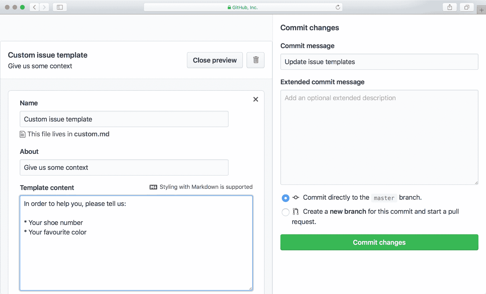
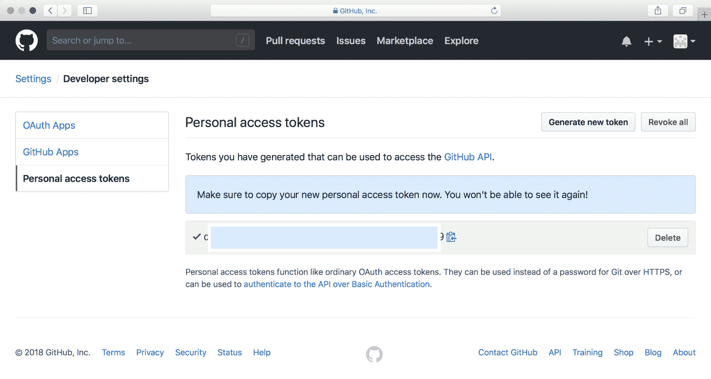

# 第十二章：Git 提供商、集成和客户端

在本章中，我们将介绍以下内容：

+   在 GitHub 上设置组织

+   在 GitHub 上创建一个仓库

+   为问题和拉取请求添加模板

+   创建 GitHub API 密钥

+   使用 GitHub 在 Jenkins 上进行身份验证

+   触发 Jenkins 构建

+   使用 Jenkins 文件

# 简介

你可以托管自己的 Git 安装并维护一个中央服务器来为你的组织提供服务。如果你是一个小公司或开源项目，维护这样的基础设施可能是一种负担。但今天，已经有许多 Git 提供商可以减轻这种负担。

GitHub 是最知名的 Git 提供商，拥有 4000 万用户。许多知名的开源项目都托管在 GitHub 上。一旦你创建了 GitHub 账户，就可以浏览当前托管的 8500 万个 Git 仓库。

在现代软件开发中，**持续集成**（**CI**）是很流行的。其理念是开发者的更改应该尽快地合并到代码库中。Git 的**拉取请求**（**PRs**）就是一种实现方式。当然，GitHub 提供了创建 PR 的界面，并让协作者进行代码审查。CI 策略的一部分也是自动运行所有测试。像 Jenkins 这样的软件可以配置为每次提交时进行构建和测试。

# 在 GitHub 上设置组织

无论你是商业产品还是开源项目，都可能有公司或一群人在背后支持。GitHub 通过允许用户创建组织来支持这种结构。

一个组织可以关联多个仓库，并且有成员。使用组织的好处在于，成员可以随时加入或离开（开发人员可能换工作，离开），但仓库将与组织关联，因此无需转移仓库的所有权。

作为用户，你可以是多个组织的成员。通常，你是雇主组织的成员，同时也是多个开源项目背后组织的成员。

# 准备工作

你需要一个 GitHub 的用户账户。对于本教程，我们将使用 GitHub 用户`johndoepackt`。任何用户都可以创建一个组织。

如果你还没有 GitHub 账户，现在是时候创建一个了。一旦创建并登录你的账户，你就可以开始使用了。

# 如何操作...

1.  创建组织是设置中的一个功能。因此，你需要在 GitHub 账户中找到设置，如下图所示：


1.  设置中的一个菜单项是组织。你可以通过两种方式创建一个组织。你可以将你的用户账户转为组织，或者创建一个独立的组织。我们将创建一个组织，而不是将用户账户转为组织，如下图所示：


1.  创建组织后，您可以邀请用户成为成员。也可以添加外部或外部协作者。

# 它是如何工作的...

GitHub 上的组织是在 Git 之上的一层。可以将它们视为提供与关联仓库的访问控制的方式。

当 GitHub 用户浏览与您的组织相关的仓库时，他们将受到您设置的权限限制。这意味着您可以控制允许他人查看的内容。

如果您是 GitHub 的付费用户，您的组织可以拥有私有仓库。私有仓库仅限组织成员访问。公司可以拥有开源项目或示例作为公共仓库。但是，通过使用私有仓库，可以保护一些公司机密。

# 还有更多...

每个组织都有一些设置可以调整。为了提高组织的安全性，您可以要求成员启用双因素认证。

您还可以访问组织的审计日志。在许多情况下，您需要确保谁做了什么。审计日志还可以揭示是否有人访问了您的组织并试图篡改它。

# 另请参见

GitHub 组织是 GitHub 上的一个文档化特性。相关文档可以在 [`help.github.com/categories/setting-up-and-managing-organizations-and-teams/`](https://help.github.com/categories/setting-up-and-managing-organizations-and-teams/) 找到。

# 在 GitHub 上创建仓库

使用 Git 的核心是仓库。GitHub 提供了一个创建仓库的 UI 界面，使新的 Git 用户更容易入门。出于显而易见的原因，GitHub 不直接向您提供对其服务器的访问权限。

在上一个教程中，我们在 GitHub 上创建了一个组织。在本教程中，我们将在该组织中创建一个仓库。作为个人用户（而非组织），您也可以创建仓库。

# 准备中

首先登录 GitHub。在创建仓库之前，您需要做出两个决策。首先，仓库的名称应该是什么？其次，仓库应该是公开的还是私有的？

私有仓库仅对组织成员可见。但要创建私有仓库，您必须是付费客户。

# 如何操作...

1.  由于我们要为组织创建仓库，因此您需要从普通用户切换到您的组织。这是一个名为“切换仪表板上下文”的下拉菜单。切换上下文后，您的屏幕将如下所示：


1.  现在，你准备好创建代码库了。你需要设置名称、描述（可选），并决定代码库是公开的还是私有的。此外，GitHub 可以为你创建 `.gitignore`、`LICENSE` 和一个简单的 `README.md` 文件。通常，你会知道主要的编程语言，并可以生成一个基于最佳实践的 `.gitignore` 文件。在下图中，你可以看到所有填写的字段：


1.  一旦创建了代码库，你可以按照以下步骤将其克隆到你的计算机上：

```
$ git clone https://github.com/JohnDoePacktOrg/nomen-nescio.git
$ cd nomen-nescio
$ ls -a
.          ..         .git       .gitignore LICENSE    README.md
```

# 它是如何工作的…

你在本教程中经过的步骤是 *在 GitHub 上创建代码库*。本质上，这只是创建一个目录并运行 `git init`。

添加额外的文件（`.gitignore`、`LICENSE` 和 `README.md`）也非常简单。设置一个好的 `.gitignore` 需要时间，但你可以从生成的 `.gitignore` 文件中得到一个很好的起点。

GitHub 还为你的代码库设置了访问控制。只有组织成员才具有写权限；也就是说，他们有提交代码的权利。在代码库的设置中，你可以在菜单项“Collaborators & teams”下定义更精确的访问控制。一个团队是由一起工作的 GitHub 用户组成的。在你的公司中，可能有 iOS、Android 和 DevOps 团队。

# 还有更多…

在 GitHub 上使用代码库时，代码审查是拉取请求的一个重要组成部分。让我们更新 `README.md` 并在 GitHub 上进行代码审查：

```
$ git checkout -b update-readme
Switched to a new branch 'update-readme' $ echo "\nSoon a better name will be decided." >> README.md $ git add README.md $ git commit -m "Updating README.md"
[update-readme 6829c33] Updating README.md 1 file changed, 1 insertion(+) $ git push origin update-readme Counting objects: 3, done.
Delta compression using up to 4 threads.
Compressing objects: 100% (3/3), done.
Writing objects: 100% (3/3), 330 bytes | 330.00 KiB/s, done.
Total 3 (delta 1), reused 0 (delta 0)
remote: Resolving deltas: 100% (1/1), completed with 1 local object.
To https://github.com/JohnDoePacktOrg/nomen-nescio.git
 * [new branch] update-readme -> update-readme
```

现在，你可以去 GitHub，找到你的代码库并创建一个拉取请求。你可以邀请你的合作者在合并之前审查你的更改，如下图所示：


当我们创建代码库时，我们有选择将其创建为私有代码库的选项。私有代码库仅对付费用户开放。从 Git 的角度来看，公共代码库和私有代码库没有区别。主要的区别在于谁可以查看代码库。正如你想象的那样，公共代码库可以被任何人查看。你甚至不需要登录 GitHub 就可以查看公共代码库。这些代码库非常适合开源项目——如果你仔细阅读 GitHub 的条款，你会发现公共代码库是为了开源而设计的。

私有代码库只能被你授予访问权限的用户查看。通常情况下，你的组织中的每个成员都可以查看私有代码库。换句话说，私有代码库非常适合内部项目或专有软件。如今，许多公司将公共代码库和私有代码库结合使用，他们的软件开发人员可以在这些代码库之间流畅地切换。

# 为问题和拉取请求添加模板

在第七章，*通过 Git Hooks、别名和脚本提升你的日常工作*，我们展示了如何为提交添加模板。提交模板帮助开发者在提交信息中包含相关的内容。在 GitHub 上，用户会创建问题和拉取请求。问题或拉取请求的创建者负责写出有意义的描述。

本教程将向你解释如何为问题和拉取请求添加模板。目的是帮助人们记得提供足够的上下文，帮助你快速理解问题或拉取请求的内容。

# 准备工作

我们将继续使用我们在之前的教程中创建的`nomen-rescio`仓库。GitHub 在各个地方都使用**Markdown**作为标记语言。Markdown 对开发者友好，因为它是纯文本，并且具有一些特殊的转换功能，用于排版粗体、项目符号列表等内容。深入学习 Markdown 可能本身就足够写成一本书。

# 如何操作...

1.  首先，你需要找到你仓库的设置。在设置中有一个大大的“设置模板”按钮，这就是你要找的按钮。你可以选择使用其中一个现成的模板，但我们将创建一个自定义模板，如下图所示：



1.  你通过点击“提交更改”来保存模板。当用户创建问题时，你的模板将被显示。用户可以选择删除你写的所有文本，但大多数用户会在删除前阅读它；请参考以下截图：


# 工作原理...

你的模板会保存在仓库本身。实际上，你会在目录 `.github` 中找到它们。如果你愿意，你可以在你喜欢的编辑器中编辑模板，并像其他文件一样提交更改。

目录 `ISSUE_TEMPLATE` 包含问题的模板文件。类似地，如果你在 `PULL_REQUEST_TEMPLATE` 目录下创建一个文件，你将得到一个拉取请求的模板。通过多个模板，用户将被要求选择适合的模板。

# 创建一个 GitHub API 密钥

到目前为止，我们在 GitHub 上所做的工作都是手动的。程序员喜欢自动化流程，执行 GitHub 工作也不例外。在下一个教程中，我们将向你展示如何自动化这些任务。

# 准备工作

为了自动化 GitHub 任务，你需要能够访问 GitHub。你可以选择使用 API 密钥或个人访问令牌，而不是通过用户名和密码登录。这样的令牌不应该与他人共享，并且你需要始终保密。

所以，本教程从生成访问令牌开始，并展示一个简单的 Python 脚本。这个 Python 脚本会查找你所有的仓库，并为每个仓库查找所有的拉取请求。

# 如何操作...

1.  首先，我们需要生成个人访问令牌。你需要在菜单系统中逐步深入：设置，开发者设置，最后是个人访问令牌。我们会给我们的令牌命名为`basic-query`，因为我们仅打算执行这个操作。你可以指定令牌的访问权限。我们的令牌只需要访问仓库操作，如以下截图所示：


1.  一旦你生成了令牌，它将被显示出来。在 GitHub 上你只会看到一次令牌，因此重要的是将其复制到你的电脑。在以下截图中，你可以看到生成的令牌页面（除了我们添加了一个矩形框，因为我们需要保密）：



1.  如前所述，我们将使用 Python。你需要安装一个小型库 PyGitHub。使用 Pip 安装非常简单：

```
$ pip install pygithub 
```

1.  现在，我们准备运行一个 Python 脚本来获取仓库和拉取请求。这个脚本仅仅是遍历仓库和拉取请求：

```
from github import Github
import datetime

g = Github("YOUR_PERSONAL_ACCESS_TOKEN")
for repo in g.get_user().get_repos():
  print(repo.name)
  for pr in repo.get_pulls():
    print(" " + pr.created_at.isoformat() + " : " + pr.title)
```

# 它是如何工作的……

令牌可以让你访问 GitHub，但仅限于创建令牌时指定的部分。后台，PyGitHub 的方法是通过 HTTP 请求调用 GitHub 的 API 实现的。

例如，调用`get_repos`就是对`/user/repos`进行 HTTP GET 请求。HTTP 请求将以 JSON 格式返回结果。PyGitHub 解析 JSON 结果并填充 Python 对象，使得结果对 Python 开发者来说更加自然。

Python 并不是唯一的编程语言。你几乎可以为任何已知的语言找到库。

当然，你可以超越简单的脚本，开发一个完整的 GitHub 客户端。我们将把这个作为一个练习留给你。

# 另见

PyGitHub 的完整 API 文档可以在 [`pygithub.readthedocs.io/en/latest/reference.html`](http://pygithub.readthedocs.io/en/latest/reference.html) 查找。

# 使用 GitHub 在 Jenkins 中进行身份验证

Jenkins 是最受欢迎的持续集成软件，它允许用户持续构建、测试和发布任何类型的软件。它在各个方面都非常灵活和可配置，包括用户能够登录和授权的方式。GitHub 能够作为 OAuth 提供者，这非常方便，因为它非常符合将参与项目的用户与 CI 系统中的相应区域进行映射的需求。

# 准备工作

为了演示过程，我们需要一个 Jenkins 实例。每个公司都会有不同的配置，因此，为了使事情更加可预测，我们将使用 Jenkins 的本地版本。

Jenkins 是一个 Java 应用，但对于我们的示例，最简单的方式是使用 Docker 来获取一个临时的 Jenkins 实例。只要在你的机器上安装并运行 Docker，简单执行以下命令：

```
$ docker run --rm -p 8080:8080 jenkinsci/blueocean
```

这个 Jenkins 实例在停止 Docker 容器后不会留下任何痕迹。

日志将开始显示在控制台上，并包含首次登录的密码。请查找以下内容：

```
*************************************************************
*************************************************************
*************************************************************
​
Jenkins initial setup is required. An admin user has been created and a password generated.
Please use the following password to proceed to installation:
​
YOUR_PASSWORD_HERE
​
This may also be found at: /Users/emanuelez/.jenkins/secrets/initialAdminPassword
​
*************************************************************
*************************************************************
*************************************************************
```

此时，你可以将浏览器指向`http://localhost:8080/`，并将会提示你输入密码，如下图所示：


此时，你将被要求安装插件。对于本示例，我们只需安装建议的插件，如下图所示：


接下来，你将被要求创建一个管理员用户，但由于这是一个临时镜像，你可以直接点击“继续作为管理员”继续操作：


接下来，你将被要求设置实例配置。只需保持默认值并点击“保存并完成”。

此时，Jenkins 已经准备好使用了。只需点击“开始使用 Jenkins”，如下面的截图所示：


你现在将看到欢迎来到 Jenkins！首页，如下所示：


# 如何操作...

1.  为了使用 GitHub 验证 Jenkins，你需要安装 GitHub 身份验证插件。为此，请点击左侧面板中的“管理 Jenkins”，然后在新页面中点击“管理插件”，如下图所示：


1.  现在，你可以切换到“可用”标签，并在搜索框中输入 `github auth`，如下图所示：


1.  你可以通过勾选左侧的框并点击“无需重启安装”来安装插件。

1.  插件安装完成后，你可以通过点击左上角的 Jenkins 徽标返回到 Jenkins 首页，并再次点击“管理 Jenkins”。

1.  这次我们将点击“配置全局安全性”，如下图所示：


1.  现在，前往 GitHub，并按照下图所示，访问 [`github.com/settings/applications/new`](https://github.com/settings/applications/new) 注册一个新应用：


在此处，你需要填写一个任意的应用名称和授权回调 URL，如下所示。注册应用后，你将能够看到你的客户端 ID 和客户端密钥。它们将在 Jenkins 中用于填写全局安全设置中的相关字段。

1.  提交表单后，你将能够使用 GitHub 凭证登录 Jenkins。

# 它是如何工作的...

身份验证需要解决的问题是，谁是试图访问服务的人？有许多方式可以做到这一点：登录和密码、令牌等等。OAuth 是回答这个问题的另一种方式。OAuth 代表开放身份验证，它是一个开放的访问授权标准。它允许用户访问网站（如我们的 Jenkins 实例），而无需提供密码，因此也无需信任这些网站。

GitHub 有作为 OAuth 提供者的能力，这意味着其他网站可以配置为接受 GitHub 提供的凭据，从而允许用户访问他们的服务。

这意味着每当用户尝试访问配置为接受 GitHub OAuth 的 Jenkins 实例时，他将被重定向到 GitHub 本身进行身份验证，随后 GitHub 会将用户重定向回 Jenkins 实例，并附带身份令牌。

# 还有更多内容...

身份验证只是问题的一半。识别用户当然很重要，但我们如何利用这些信息同样至关重要。此时，授权发挥作用，它旨在回答这个问题：假设试图访问服务的人是 X，那么他被允许做什么、不能做什么？

我们配置的 Jenkins 实例是，任何能够登录的人都可以做任何事情。这可能不是我们期望的行为，这也引出了 Jenkins 的 Global Security 页面中的另一个部分。

你会看到一个名为授权的部分，其中提供了许多选项。其中一个是 **GitHub Committer 授权策略**，它决定用户是否被允许查看某个特定的 Jenkins 作业——但前提是他被允许访问相应的 GitHub 仓库。

# 另请参见

GitHub OAuth 插件的文档可以在 [`wiki.jenkins.io/display/JENKINS/GitHub+OAuth+Plugin`](https://wiki.jenkins.io/display/JENKINS/GitHub+OAuth+Plugin) 查阅。

# 触发 Jenkins 构建

当你创建一个 Jenkins 作业时，Jenkins 如何知道何时构建特定的分支或拉取请求？Jenkins 提供了许多方法来实现这一点，从基于计时器的持续构建到轮询 Git 仓库查看是否有变化。尽管这两种选项都不是非常高效，但幸运的是 GitHub 提供了更好的解决方案。

GitHub 有 Webhooks 的概念，这意味着它可以配置为在发生重要事件时联系一个服务器，例如我们的 Jenkins 实例。

达到目标的方式有很多，但在这个配方中，我们将专注于一种方法，这种方法在企业环境中尤其有用，特别是当使用 GitHub 组织，包含多个仓库时。每个仓库管理一个或多个作业会迅速变成一项重复的工作，而这时 **GitHub Branch Source** 插件便派上了用场。

# 准备工作

我们将需要一个 Jenkins 实例，因此需要与之前配方相同的准备步骤。

此外，如果 Jenkins 实例无法从互联网访问，那么需要一个反向代理，以便 GitHub 能够向 Jenkins 实例发送通知。

# 如何做...

步骤如下：

1.  GitHub Branch Source 插件在默认安装中预先安装，但如果你的环境中尚未安装该插件，你可以像在前面的配方中一样轻松安装它。前往 Jenkins 首页，进入“管理 Jenkins”，点击“管理插件”，然后选择“可用”标签，搜索 GitHub Branch Source 并安装插件。

1.  现在，返回 Jenkins 首页，点击“创建新作业”：


1.  选择一个作业名称，并在点击“确定”之前选择 GitHub 组织。以下配置页面可能看起来有点令人望而却步，所以让我们分解它：


1.  唯一需要特别注意的部分是项目。首先需要设置的是 GitHub 凭证。这将允许 Jenkins 自动为我们设置 Webhook。在 Jenkins 中，凭证是以安全为前提进行处理并正确加密的，因此不必担心在这里保存它们。

1.  接下来，我们需要指定所有者，它只是我们想要控制的 GitHub 组织的名称。以下部分描述了这些行为，默认情况下它们完全正常。它们将允许构建：

    +   分支

    +   来自本仓库的 PR

    +   来自 Fork 的 PR，但来自受信任的用户

就这样！现在 Jenkins 将能够自动构建任何分支或 PR，只要代码中包含 Jenkinsfile。Jenkinsfile 的使用将在下一个配方中介绍，请继续关注！

# 它是如何工作的...

GitHub Branch Source 插件将允许 Jenkins 定期扫描指定的 GitHub 组织，并检查每个仓库中的所有分支和 PR，如果其中包含一个名为 `Jenkinsfile` 的文件，它们将会自动构建，并遵循 Jenkinsfile 中的指令。

这是一个非常强大的模式，它不仅可以将项目的代码纳入版本控制，还可以将如何构建、测试甚至发布项目的指令也纳入同一个代码库中。

# 还有更多...

该作业配置页面允许更改许多不同的行为。例如，如果我们不想构建所有的分支，而只构建那些名称与正则表达式匹配的分支怎么办？解决方案只需要几个点击！有很多可能性，Jenkins 的开发者不断增加新的功能，所以定期查看可用的选项是值得的。

# 另见

GitHub Branch Source 插件的文档可以在 [`go.cloudbees.com/docs/cloudbees-documentation/cje-user-guide/index.html#github-branch-source`](https://go.cloudbees.com/docs/cloudbees-documentation/cje-user-guide/index.html#github-branch-source) 查阅。

# 使用 Jenkinsfile

Jenkinsfile 是 Jenkins 世界中的相对较新功能，它有两种不同的类型和语法：

+   声明式

+   Groovy DSL

Groovy DSL 非常灵活且强大，但它也容易导致一些反模式，因此在这个食谱中，我们将专注于声明式风格的 Jenkinsfile。

# 准备就绪

你将需要一个包含可以构建和测试的代码库的 GitHub 仓库。鉴于可用的编程语言和构建系统种类繁多，我们将选择一个任意的 Java 项目，并使用流行的 Maven 构建系统。

# 如何实现...

只需要添加一个名为 `Jenkinsfile` 的文件，并包含以下内容：

```
pipeline {
  agent any
  tools {
    maven 'Maven 3.3.9'
    jdk 'jdk8'
  }
  stages {
    stage ('Initialize') {
      steps {
        sh '''
          echo "PATH = ${PATH}"
          echo "M2_HOME = ${M2_HOME}"
        '''
      }
    }

    stage ('Build') {
      steps {
        sh 'mvn -Dmaven.test.failure.ignore=true install' 
      }
      post {
        success {
          junit 'target/surefire-reports/**/*.xml' 
        }
      }
    }
  }
}
```

# 它是如何工作的...

Jenkinsfile 描述了如何构建和测试软件以及运行这些操作的环境。

让我们来看一下不同的部分：

+   `agent any` 指定此构建可以在任何可用的执行器上运行。

+   `tools {}` 部分指定了运行构建所需的程序。在这种情况下，需要 Maven 和 **Java 开发工具包** (**JDK**)，并且也指定了版本。

+   `stages {}` 和 `stage() {}` 允许将运行过程分为明确的阶段，从而使构建结果的分析更加清晰。

+   每个阶段需要包含一个 `steps {}` 部分，该部分将精确描述要执行的操作。在这种情况下，在 *初始化* 阶段，我们仅仅运行一个 shell 脚本，回显一些环境变量。

+   构建阶段实际上会运行 Maven，如果构建成功，它将分析包含在 XML 文件中的单元测试结果。

# 还有更多...

Jenkinsfile 是一个庞大的话题，足以填满一本书，因此提供的示例仅仅触及了可能性的表面。举几个例子，你将能够：

+   在不同的机器上并行运行步骤以节省构建时间

+   保存并部署构建工件

+   运行完整的发布版本

+   等待一些用户输入

+   以及更多更多

# 参见其他

声明式 Jenkinsfile 的语法可以在 [`jenkins.io/doc/book/pipeline/syntax/`](https://jenkins.io/doc/book/pipeline/syntax/) 中找到。

请注意，插件可以贡献各种步骤和工具，因此请务必查看你打算使用的插件的文档！
