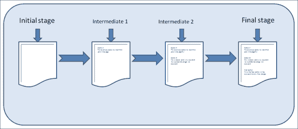

# 第一章：轻松呼吸——版本控制系统简介

*我们或许曾无数次地想，是否有办法回到过去改变曾经发生过的事情。虽然听起来像是虚构的，但你将会学到一种方法，当涉及到数字化文件时，可以实现这种“穿越”！没错，你没有看错；本章将向你介绍一个让这一切成为可能的系统。我们将从为你提供关于 Git 版本控制的坚实概念理解开始。*

本章将回答以下问题：

+   什么是版本控制系统？

+   你在哪里需要它？

+   它们是如何发展的？

+   为什么 Git 是你的最佳选择？

到本章结束时，你将能够清楚地了解如何更好地处理在数字化文件的不同部分频繁变动的情况。那我们就马上开始吧！

# 你需要帮助吗？

我在学会打开或关闭计算机之前就学会了玩电脑游戏，那时我需要寻求成年人的帮助。早期的电脑游戏即使在当时也让我们惊叹，但也有一些让人沮丧的时刻，它们不允许我们保存进度。即使它们有保存选项，也只是一次只能保存一个档位，这意味着你只能用新的进度覆盖掉旧的进度。这样很遗憾，因为你之前的存档可能是在游戏中特别有趣的部分，你现在希望保存并在以后某个时候重新访问，或者更糟糕的是，你当前的存档可能是在一个无法通关的情境中，你希望撤销这一点。

计算机游戏从这一状态进化而来，而我们处理数字化文件的方式却依然保持不变。像 *撤销* 和 *重做* 这样的选项在文件仍然打开时能短暂地帮助我们，但无法超越这个限制。你不能仅仅打开一个文件，然后开始撤销在上次保存之前所做的更改，以回到较早的状态。

还有一些情况，我们希望维护同一个文件的多个版本。即使是最常用的通过按顺序命名新文件的方式来维护多个版本，比如 `Inventory_product_2011-09-21.doc`、`System_requirement_specification_v6.xls` 等等，随着版本数量的增加，这种方式也会变得令人头疼，因为必须维护的文件数量巨大。

如果你曾经历过或思考过这些情况，并想知道是否有更好的方法来处理，你将在本章结束时感到欣喜。这就是 **版本控制系统**（**VCS**）发挥作用的地方。

# 什么是版本控制系统

一个能够记录文件或一组文件在一段时间内所做更改的系统，以便它允许我们从未来回到过去，回溯某个特定版本的文件，这种系统被称为版本控制系统。

为了给您更正式的解释，版本控制系统是一个软件包，当启动时，它会监控您的文件变化，并允许您在不同级别上标记这些变化，以便您在需要时可以随时回访这些标记的阶段。

安装并启动后，版本控制系统会在您的文件所在位置创建一个本地目录，用于管理您文件所有更改的历史记录。

# 为什么您需要一个版本控制系统

请尝试回答以下与您当前系统设置相关的问题：

+   您是否可以在同一个文件名下保持多个版本，从而避免因文件名中提及版本而导致文件冗余？

+   您是否有任何方法在更改文件/文件内容之前，标记出未来可能需要的特定部分？

+   您是否满意现有的情况，即唯一的备份方案是将文件或一组文件复制并粘贴到一个包含“备份”字样的单独文件夹中，并定期更新它？

如果您对这些问题的回答是个大*不*，那么这正是您可能需要版本控制系统和本书的原因。

如果您对这些问题的回答是*是*，这意味着您可能已经找到了变通的方法来解决这些问题。简单的措施包括在最新版本的 Windows 中创建还原点，该还原点会在当时存储您所有文档的版本，如您的 Word、Excel 或 PowerPoint 文件。

解决方案可能会有很多种，但请允许我告诉您，版本控制系统将以其强大、简单和易用的特点让您感到惊讶。它们将使您在比现在的解决方案所需时间和精力少一半的情况下，获得更好的结果。

通过使用版本控制系统，您可以掌控文档变更的流程。每当您需要对现有内容做出大量修改时，您可以将这些更改标记为一个阶段（带有标签），以便稍后回访；这就像一个安全机制，以防事情没有按计划进行，您希望将文档内容恢复到某个较早的状态。

下图展示了有无版本控制系统的内容创作流程：

上一图展示了在不同时间点跨会话传播的内容创作矩阵的流程。如你所见，在常规的建设性环境中，流程是从*左到右*的，这意味着在不同时间段的内容创作过程中，你是单向前进的。在这个流程中，你不能回到一个早期阶段，从那里你可以选择一个完全不同的方向，而不是你已经采取的方向。

通过我们流程图的说明，你无法从最终阶段回到任何中间阶段去写一个完全不同的第三段内容以服务于新的目的，而不会丢失任何数据。（你不能使用撤销功能，因为内容是在不同的时间段中构建的，而且一旦你保存并关闭文件后，不能撤销任何操作。）

目前，我们通过使用“另存为”选项，给文件起一个不同的名字，删除第三段，并开始写新的一段来实现这一点。

相比之下，当你使用版本控制系统时，它是一个**多方向自由流动的环境**。你标记下每一个你认为重要的更改作为一个新的阶段，并继续进行内容创作。这使你可以在没有任何数据丢失的情况下，回到你创建的任何早期阶段。

最棒的部分是，你不受以下限制：

+   跳跃的次数

+   跳跃之间的阶段数

+   跳跃的方向

这意味着我们可以毫无顾虑地在任何方向上自由地在不同阶段之间跳来跳去而不会丢失任何数据。现在听起来是不是正是这个时代所需要的？

# 版本控制系统的类型

有三种类型的版本控制系统可用。这些是根据它们的**操作模式**进行分类的：

+   本地版本控制系统

+   集中式版本控制系统

+   分布式版本控制系统

让我们简要回顾一下历史。

## 本地版本控制系统

在认识到仅通过遵循文件命名规则来维护多个版本的文件是高度容易出错后，**本地版本控制系统**是第一个成功解决此问题的尝试。

**修订控制系统**（**RCS**）曾是这一领域最流行的版本控制系统之一。

这个工具基本上通过在版本跟踪器中使用一种特殊格式来保持补丁集（即文件在不同阶段内容之间的差异），并将其存储在本地硬盘上。

它可以通过按顺序添加所有相关补丁并“签出”（将内容复制到用户的工作区），精确地在任何给定的时间点重建文件的内容。

### 小贴士

版本跟踪器实际上是一个拥有自己文件格式的文件，通过该格式可以存储结构化内容，并执行其功能。

当文件被放入 RCS 时，它会创建一个版本跟踪条目，其中包含该文件特定的 RCS 配置，版本号、日期、时间、作者、状态、分支以及指向下一个阶段的链接，接着是文件内容，格式化方式特别。完成此过程后，你的文件会被删除！

如前所述，文件的检索是通过修补程序的重建来完成的。

## 集中式版本控制系统

与其他任何软件包或概念一样，随着需求不断发展，用户觉得本地版本控制系统限制了他们的活动。

人们无法在同一个项目上进行协作工作，因为带有版本的文件存储在某个人的本地计算机上，其他在同一文件上工作的人无法访问这些文件。

那么你该如何解决这个问题呢？

通过将文件保存在一个大家都能从本地计算机（客户端）访问的公共位置（服务器）来解决问题。因此，**集中式版本控制系统**应运而生。

每当人们想编辑单个或多个文件时，只会检索文件的最后一个版本。

这种设置不仅为需要文件的人提供访问权限，还提供了对其他人工作进展的可见性。

由于文件存储在一个统一位置，所有人都需要共享这些文件，因此对文件所做的任何更改会自动与其他人共享。

## 分布式版本控制系统

每当你将大量资源押注于一个单一单位时，失败的概率也会很高。是的，使用集中式版本控制系统确实存在很高的风险，因为用户只能在系统中获得文件的最后一个版本用于工作；如果服务器发生故障，而且没有实施故障保护程序，你最终可能会丢失文件的全部历史记录。

现在人们感到困惑。当你使用集中式版本控制概念将整个历史存储在一个地方时，你将面临巨大的风险；相反，当你使用本地版本控制时，你失去了协作工作的能力。

那么你该怎么做呢？

没错！你将两者的优点结合起来，构建一个**混合系统**。这也是**分布式版本控制系统**进入视野的关键原因之一。

分布式版本控制系统具备本地版本控制系统的优点，例如以下几点：

+   在不担心与服务器持续连接的情况下进行本地更改

+   不依赖存储在服务器中的单一文件副本

这些与集中式版本控制系统的优点结合起来，例如以下几点：

+   工作的可重用性

+   协作工作，不依赖存储在个人机器上的历史记录

分布式版本控制系统设计成双向工作。它在每台机器上本地存储文件/文件的整个历史记录，并且在需要时将用户所做的本地更改同步回服务器，以便将更改与其他人共享，提供一个协作的工作环境。

在性能、易用性和管理方面，还有其他一些优势。一般来说有一句话说：“你列举任何一个集中式版本控制系统能做的事情；分布式版本控制系统都能做，并且做得更好。”

# 信赖 Git

在前一节中我们接触到了不同类型的版本控制系统，从中我们清楚地了解到，分布式版本控制系统能让我们的工作变得更加轻松、安全和可靠。

现在，市场上有很多分布式系统，那么该选择哪个呢？

Git 是一个相对较新的软件包（2005 年 4 月 7 日发布第一个原型），它从零开始设计，避免了许多其他版本控制系统存在的缺陷。

Linus Torvalds，Linux 内核的创造者，也是这个项目的骄傲发起人。Git 的架构本身就为更好的速度、性能、灵活性和可用性量身定制。当我第一次听到这句话时，我脑海中和你现在的想法是一样的：“它说得很好；它真的能做到吗？”

事实上，有多个实际案例研究；我在看到 Git 如何优雅地处理复杂的 Linux 内核源代码时，深受震撼。

对于那些不了解 Linux 内核或为什么它被称为复杂的人，可以想象大约 900 万行内容分布在 25000 个文件中，内容经常被不同的开发人员操作，每天多次往返。即使如此，Git 的操作响应时间仍然仅为几秒钟。

为什么他们信任 Git 来完成如此具有挑战性的任务，以及 Git 如何满足他们的期望，可以通过以下几点来解释：

+   原子性

+   性能

+   安全性

## 原子性

原子性只不过是一个操作的特性，它在调用和响应之间看似在一个瞬间发生。

以银行系统为例。当你从你的账户向另一个账户转账时，操作要么完全成功，要么被拒绝，这意味着要么钱从你的账户中扣除并存入收款人的账户，要么整个操作被取消，钱根本不会从你的账户中扣除。

这些系统避免了部分完成的情况，比如钱已经从你的账户扣除，但没有存入收款人的账户。

另一个例子是座位预定系统，其中可能有以下几种状态：

+   同时付款并预定座位

+   既不付款也不预定座位

Git 的创建者理解我们数据的价值，并在处理 Git 内容时实现了这一点。它确保了由于部分操作导致的数据丢失或版本不匹配的情况不会发生，从而提高了可靠性。

## 性能

无论一辆车的内部如何豪华，如果它不够快，就无法与时间赛跑。Git 被证明比它的竞争者快得多。

即使处理数百万个文件，使用 Git 执行的操作也只需几秒钟即可完成。这其中的一个主要原因在于 Git 处理文件的方式。大多数其他系统（如 CVS、Subversion、Perforce、Bazaar 等）概念上将数据视为一组文件，并把每个文件的变更看作版本更新的一部分。

以下是其他系统如何处理文件及其版本的图示：

相比之下，Git 将文件之间的关系看作是其操作的核心。它对整个文件集进行 **快照**，而不是存储每个文件版本之间的差异；这有助于 Git 在某些操作（如将文件内容恢复到先前版本）中的快速性（稍后的章节我们会讨论到）。每次创建版本时，Git 都会进行快照。这并不意味着 Git 存储多个文件副本；如果 Git 发现某个文件内容没有变化，它只会存储指向先前快照的引用，而不是存储文件本身，如下图所示：

最好的部分是，Git 尽可能占用最少的空间（与其他版本控制系统相比，空间占用少了几倍）来维护文件的版本历史。在凯斯·P.（[`keithp.com/blogs/Repository_Formats_Matter/`](http://keithp.com/blogs/Repository_Formats_Matter/)）发布的关于 Mozilla Firefox 源代码管理的案例研究中，展示了版本控制系统在维护文件历史记录时是如何高效利用空间的。

Mozilla 的 CVS 仓库大小为 2.7 GB；导入到 Subversion 后大小增至 8.2 GB，而在 Git 中，大小压缩到了 450 MB。对于一个 350 MB 的源代码项目，能够拥有自 1998 年以来的全部项目历史，只需要额外 100 MB 的空间，真是相当不错。

## 安全性

当你使用 Git 时，你可以放心，没有人会篡改你的文件内容。所有提交到 Git 的内容都会先通过 SHA-1 哈希进行校验，确保内容的完整性，之后使用该校验和来引用文件。

这意味着，在没有 Git 知道的情况下，任何文件或目录的内容都无法更改。这里使用的 SHA-1 哈希是由 40 个十六进制字符（a-f 和 0-9）组成，基于文件或目录结构的内容生成。以下是一个哈希示例：

9e79e3e9dd9672b37ac9412e9a926714306551fe

对于那些希望进一步了解的人，你可以听听版本控制系统的创始人——Linus Torvalds 在谷歌技术讲座上的演讲。

# 总结

本章讨论了我们日常生活中遇到的与数字化文件相关的问题，接着针对这些问题提供了具体的解决方案，并通过版本控制系统确保能够解决这些具有挑战性的问题。

我们还简要回顾了版本控制系统的发展历程，并深入理解了分布式版本控制系统如何使我们的生活更加便捷。

接着我们介绍了行业领先的分布式版本控制系统 Git，并通过一些有趣的统计数据和案例研究讨论了这一声明背后的几个理由。随后，我们还探讨了它的一些内部机制，如原子性、性能和安全性。

在完成了足够的准备工作之后，我们已经准备好安装 Git 并在系统中运行它，这也是下章的主题。
