# 第二章 欢迎加入 – 安装 Git

*在上一章中，我们了解了版本控制系统如何改变我们面对数字化文件时的日常处理方式，并探讨了版本控制系统的演变。*

*我们还了解了为什么 Git 被认为是同类中最好的工具，以及它如何满足我们的需求。*

在本章中，我们将了解如何安装和配置 Git。我们将涵盖以下内容：

+   选择适合你环境的 Git 类型

+   安装 Git

# 选择你的类型 – 下载适合你操作系统的安装包

像许多其他工具一样，Git 可以从互联网下载，最棒的是，它是免费的，这要感谢开源社区。Git 可以安装在各种操作系统上，如 Mac OS X、Windows、Linux 和 Solaris。在讨论我们的概念时，我们将考虑用户群体最多的前三大操作系统：

+   Windows

+   Linux

+   Mac OS X

首先，你需要下载适合你操作系统的 Git 安装包；我们可以从 [`git-scm.com/downloads`](http://git-scm.com/downloads) 获取下载包列表。继续下载与你的操作系统相关的最新稳定版本，可以在网站上找到该版本，如下图所示（在编写本章时，版本 1.8.0.2 是最新的稳定版本）：

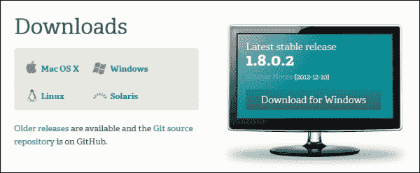

### 注意

对于那些喜欢使用**命令行界面**（**CLI**）模式的 Linux 和 Mac 用户来说，完全不需要通过图形界面（GUI）下载和安装。你可以使用操作系统特定的安装程序来完成安装。例如，如果你使用的是基于 Debian 的 Linux 操作系统，`apt-get install git-core` 就足够在系统上安装 Git，而如果你使用的是 Mac，可以使用 Apple 的 Xcode IDE，这是一种 Apple 批准的方法来安装工具，或者使用 Macports 或 Fink 来安装 Git。

## Windows

如果你从 Windows 机器下载，网站会自动识别并提供**为 Windows 下载**按钮。点击该按钮后，你将被提示保存安装文件。选择你希望保存文件的位置，之后你就可以开始安装了。

## Linux

在 Unix 操作系统中，总是有多种方式来完成任务。我们将选择最简单的方式，确保每个人都可以跟上。所以，除非你是那种喜欢通过编译安装包的人，否则无需从该网站下载，你可以直接跳到*安装*部分。

### 注意

对于想要通过获取源代码并编译安装 Git 的用户，执行以下步骤：

+   点击**Git 源代码库**链接，你将进入一个列出源代码包内容的页面。点击名为**Zip**的按钮，系统会提示你下载文件。保存文件到你选择的位置。

+   然后，你可以按照常规的`unzip, configure`，`make`和`make install`命令进行操作，我们在此不作详细讨论。

## Mac

如果你是从 Mac 设备下载，网站会自动检测并提供**Mac 版下载**按钮。点击该按钮后，会提示你保存安装文件。选择你希望保存文件的位置，然后就可以继续了。

下载文件通常遵循类似于 Git-latest.stable_release_version_here-min-required-os-info.dmg 的命名规范，例如，**git-1.8.0.2-3-intel-universal-snow-leopard.dmg**。

你可以使用相同的 1.8.0.2 安装程序安装在 Snow Leopard 及以上版本的 Mac OS 上。对于 Leopard 用户，Git 提供了较低版本，你可以从 [`code.google.com/p/git-osx-installer/downloads/list`](http://code.google.com/p/git-osx-installer/downloads/list) 下载。

## 安装

现在你已经拥有了自己的 Git 副本，接下来让我们进入安装阶段。我们将逐一讲解不同操作系统的安装过程。

### 注意

和其他任何软件安装一样，安装该软件需要管理员权限。

# 操作时间 – 在 Windows 上安装 Git

执行以下步骤：

1.  双击下载的安装文件即可开始安装。

1.  安装过程的第一步和第二步是显而易见的。它首先通过欢迎信息问候你，并告知你一些安装前的“安全遵循”程序，即在继续之前关闭所有其他打开的应用程序（以避免任何共享的 dll/exe 被覆盖，或者系统内存不足等问题，安装过程中会消耗大量内存）。然后，它会展示关于 GNU 公共许可证第 2 版的信息，Git 就是依照此许可证来管理的。

    ### 注意

    若要了解更多关于软件包可以和不能做的事情，继续阅读相关内容。

1.  点击屏幕上的**下一步**按钮，将进入下一个屏幕，选择你希望安装的路径：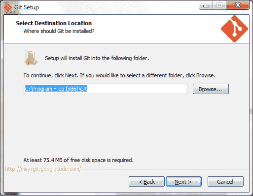

    默认安装位置是 Windows 安装中的**Program Files**目录。如果你将所有自定义软件安装在单独的分区中，以防操作系统崩溃时保护数据，可以点击**浏览...**按钮选择你希望的路径。

1.  点击**下一步**后，你将看到一个组件配置屏幕，在其中你需要在**上下文菜单项**部分选择**Git Bash Here**和**Git GUI Here**选项，如下图所示：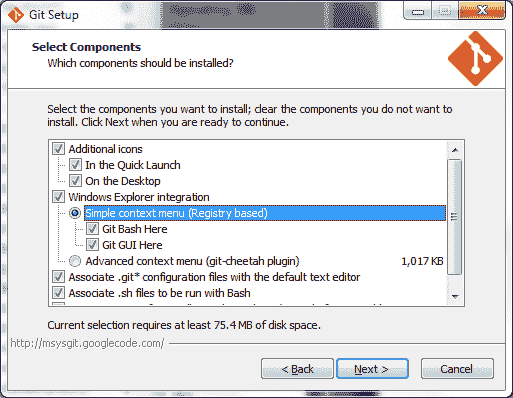

    这些选项将为我们提供快速访问 Git 命令界面的方式。我们将在接下来的章节中详细介绍。

1.  接下来，我们需要选择一个组名，在此组名下将快捷方式放置在开始菜单中，方便快捷地访问。我们保持默认值`Git`并点击**下一步**。

1.  这将带我们进入下一个屏幕，在该屏幕中我们选择第二个选项，即**从 Windows 命令提示符运行 Git**：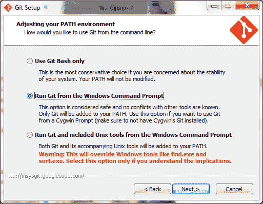

    这个设置主要是为那些将使用命令行控制 Git 及其活动的人准备的。此选项将允许我们通过 Windows 原生命令行接口 DOS 进一步控制 Git。

    选择完成后，点击**下一步**按钮。

1.  剩下的两个主要步骤是我们在远程工作和/或跨操作系统协作时需要的配置。

    只有在你的注册表中有任何 SSH 会话时，安装文件才会检测到并提示你以下屏幕：

    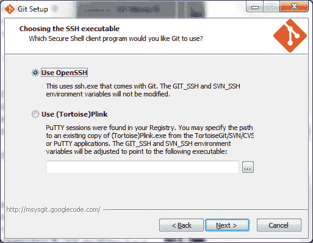

    如果你是一个对 SSH 这个术语感到陌生的用户，但通过其他方式在系统中拥有 SSH 会话，或者是一个想要切换到 OpenSSH 的有经验的用户，可以选择**使用 OpenSSH**选项。

    如果你习惯使用其他 SSH 应用程序连接到远程系统，选择**使用(Tortoise)Plink**选项。在**选择 SSH 可执行文件**屏幕上做出选择并点击**下一步**。

    ### 注意

    OpenSSH 密钥通过 ssh-keygen 创建，并使用 ssh-agent 进行缓存。而使用 putty 套件时，密钥通过图形程序 puttygen 创建，并通过 pageant 加载/缓存，SSH 则通过 putty 完成。

1.  任何在不同操作系统上处理文件的人都一定知道不同风格的行尾符号所带来的问题。

1.  现在你需要告诉 Git 如何处理这些行尾符号。在接下来的屏幕中，选择**结帐 Windows 风格，提交 Unix 风格行尾符号**，以确保在跨平台工作时**回车换行符**（**CRLF**）和**换行符**（**LF**）之间不会发生冲突：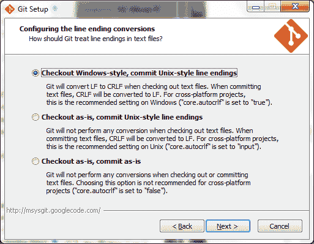

就是这样。你的安装程序现在应该完成安装了。

## *刚刚发生了什么？*

恭喜！你的 Windows 机器现在已经准备好使用 Git 控制任何内容的版本。

# 行动时刻 – 在 Mac 上安装 Git

执行以下步骤：

1.  双击`.dmg`文件以开始安装。接下来的屏幕应该会出现：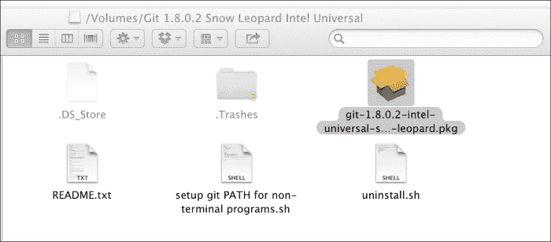

1.  双击`.pkg`文件以启动安装过程。出现在你面前的窗口欢迎你并提供有关接下来将要发生的情况的信息。

1.  点击**继续**按钮后，您将获得关于软件将占用多少磁盘空间的信息，并显示此软件在您计算机上其他用户的访问权限，如下图所示：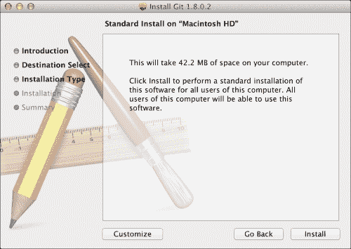

1.  您可以根据需要自定义此设置，但目前我们继续使用默认设置，并通过点击**安装**按钮为所有用户进行安装。

1.  安装过程中，系统会要求您提供管理员密码以继续安装。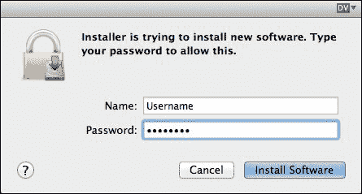

1.  如果身份验证成功，您的安装将完成，系统会显示一个成功消息，如下图所示：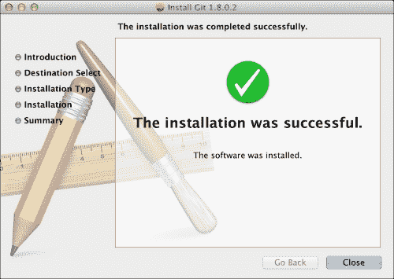

## *刚刚发生了什么？*

恭喜！您的 Mac 机器现在已经准备好通过 Git 来控制任何内容的版本。

# 操作时间 – 在 Linux 上安装 Git

正如我们之前讨论的，我们将通过使用您的发行版内建的**图形软件管理系统**在 Linux 操作系统上进行 Git 安装。在本教程中，我使用的是名为 Ubuntu 的发行版，它是基于（下游）著名的 Debian 操作系统。

在这里，软件管理系统称为 synaptic。请执行以下步骤：

1.  通过按下*Alt* + *F2* 打开**运行实用工具**提示框，并输入`synaptic`。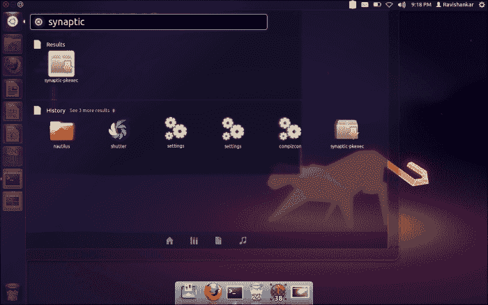

1.  匹配的工具会自动显示在下方；让我们点击第一个，它显示为**synaptic-pkexec**。这时会弹出一个身份验证对话框，因为安装需要提升权限，正如之前所说的那样。所以请提供您的管理员密码并点击**认证**。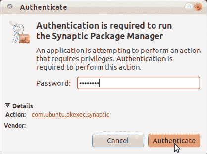

1.  这将打开**Synaptic 包管理器**窗口，您将在中间窗格中看到可用的软件包，并在左侧看到可用的仓库源。现在我们在**快速筛选**文本框中输入要安装的软件包名称`git`。它会自动在下方的内容窗格中填充匹配的软件包。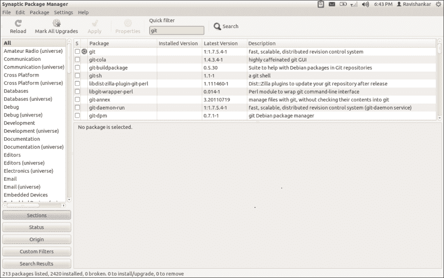

1.  现在我们可以看到一个名为**git**的软件包，其默认版本是**1.7.5.4**（不用担心版本不匹配；我们接下来要学习的概念对于所有版本都是一样的），其描述为**快速、可扩展的分布式版本控制系统**。这是我们要安装的软件包，所以让我们右击它并选择**标记为安装**。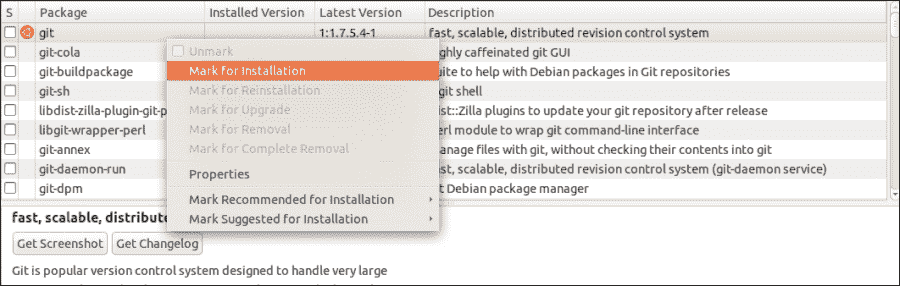

1.  现在，包名称旁边的复选框将显示一个勾选选项，表示你已选择该包进行安装。为了更方便操作，我们需要再安装两个与 Git 相关的包，分别是**Git GUI**和**Gitk**。所以我们再次右击同一个包，选择**Mark Suggested for Installation**选项，并从中选择**git-gui**。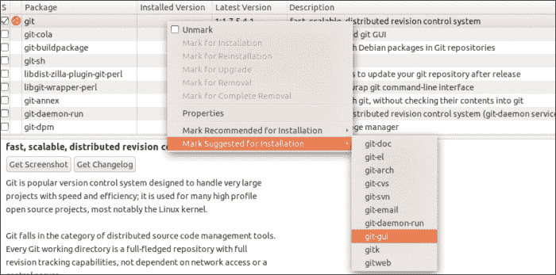

1.  包管理器会提示你有关所需的包更改，也就是将**gitk**添加到可安装列表中；所以点击**Mark**。现在你已经标记了将要安装的包，我们继续吧！等等，我们并没有选择我们说需要的 gitk 包！没错，我们没有选择。但它会自动安装，因为它是一个依赖包。你将在接下来的步骤中看到这一点。

1.  现在继续，点击菜单栏下方快捷栏上的绿色**Apply**按钮。系统会弹出如下确认对话框：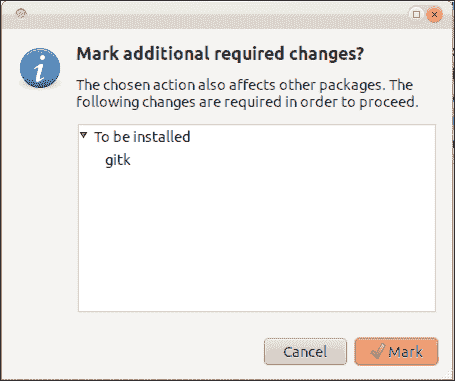

1.  点击**Mark**后，系统会为你提供即将安装的包的摘要，并要求确认。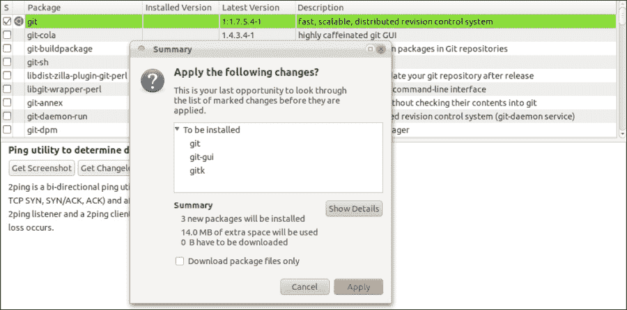

1.  在确认后，安装将开始，完成后你将看到如下的成功页面：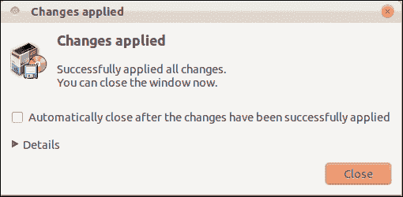

## *刚才发生了什么？*

恭喜！你的 Linux 机器现在已经可以借助 Git 控制任何内容的版本。

# 总结

在前一章节中了解了 Git 的强大功能后，本章节我们成功地获取了 Git 并将其变成了你自己的工具。

然后，我们成功地在你的操作系统上安装了 Git，使其可以使用。

现在我们已经安装了 Git，接下来的步骤是个性化设置它，之后我们将看到一些神奇的命令，这些命令会帮助我们提高生产力。这是下一章节的主题。
