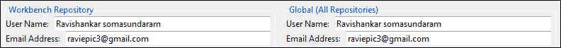
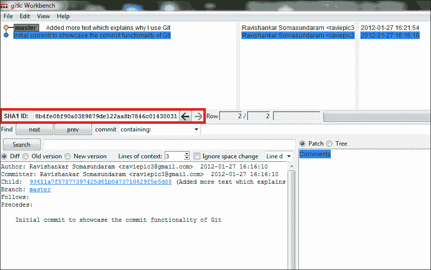
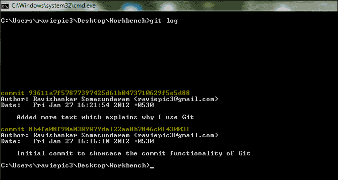

# 第三章：打磨你的工作流程 – 如何提高每日生产力

*我们只触及了版本控制系统概念的表面，以理解 Git 如何让我们在工作中更加高效。毫不拖延地，我们也迅速获取了它，并在我们的系统中成功运行起来。*

*我听见你激动地喊道：“让我们深入了解吧！”*

好的，船长，出发了。在这一章中，你将学习五个重要概念，这些概念通常是你在工作中所需的全部：

+   启动过程

+   将你的文件添加到仓库（目录）中

+   提交已添加的文件

+   检出

+   重置

没错，仅仅五个概念就足以让你产生变化。当然，如果你在操作过程中迷失了方向，我们还将学习如何借助 Git 内建的帮助功能重新回到正轨。

# 装备好 - 为你的 Git 做好准备

假设你有一根魔杖，它将完美地执行你给它的命令！没错，就是这样，你现在拥有了 Git。你需要命令 Git 执行它必须为你完成的任务。

听起来很有趣，对吧？

我们已经了解到，要保持多个文件的版本，它们必须保存在一个目录（文件夹）中，因此我们将在桌面上创建一个名为`Workbench`的目录，来学习本章实践中解释的概念。

说到操作计算机，有些人希望通过以下任何一种方式完成任务：

+   GUI 模式（图形用户界面）

+   CLI 模式（命令行接口）

也可以同时使用两者的组合。为了满足多样化的受众，我们将尝试涵盖这两种实现模式。

# 初始化

初始化其实就是指向那个目录，让 Git 知道从那时起它需要监控该目录的内容，以便捕捉变化。

如前所述，我们将涵盖执行这些操作的两种方式（GUI 和 CLI）。

# 操作时间 - 图形用户界面模式中的初始化

要创建/初始化一个仓库，请执行以下步骤：

1.  从桌面或应用程序菜单中打开**Git Gui**，并选择**创建新仓库**选项，如下图所示：

1.  Git 会向你展示一个新屏幕，要求你提供你想要创建仓库的目录位置。所以点击**浏览**按钮，从桌面上选择我们的**工作台**目录，然后点击**创建**按钮。

1.  你应该看到如下的屏幕：

    现在别关闭这个窗口；我们将继续从这个屏幕开始，继续讲解接下来的概念。

## *刚才发生了什么？*

你已经成功指示 Git 监控你的`Workbench`目录及其内容。

上一张图片展示了主页面，我们将经常与之交互。它由四个窗格组成，我们可以将它们称为：

+   **未暂存更改**窗格（左上角）

+   **暂存更改**窗格（左下角）

+   **差异内容**窗格（右上角）

+   **操作**窗格（右下角）

在我们的例子中，我们创建了一个名为`Workbench`的新目录并将其初始化为一个仓库。您也可以按照相同的步骤将一个已有的包含文件的目录转换为仓库，以便 Git 进行监控。当您这么做时，仓库内的文件将初步出现在**未暂存更改**窗格中。

# 行动时间 – 在 CLI 模式下初始化

对于那些喜欢听按键声音而不是点击鼠标的人，总有**命令行界面**（**CLI**）模式可用。

使用键盘按键的速度越来越快的人比例不断增加，在可能的情况下，更多地优先使用按键而非鼠标点击操作。这也是**Gmail**为几乎所有功能引入快捷键的主要原因之一。

若要通过命令行界面模式创建或初始化仓库，您需要执行以下操作：

1.  打开您的**shell**（Windows 中的命令提示符或 Mac/Linux 中的终端/控制台）。

1.  使用`cd`（更改目录）命令前往桌面上的`Workbench`目录。

1.  一旦进入`Workbench`目录，输入`git init`并按*Enter*键完成初始化过程。

1.  您应该会收到 Git 的状态信息，显示**已初始化空的 Git 仓库，在您的/路径/到/Workbench/目录/这里**。

啊！按键的声音，真好听。

## *刚刚发生了什么？*

您已成功命令 Git 监视我们的`Workbench`目录及其内容。`Init`是初始化仓库的操作关键字。

## 屏幕背后

这个初始化过程将在我们的`Workbench`目录中创建一个名为`.git`的目录。Git 通常会将这个目录设置为**只读**且**隐藏**，以防止用户意外删除或篡改它。它是 Git 存储有关您文件及其更改历史的地方。

所以要小心那个目录；删除它将*抹去*该目录下所有文件的历史记录。

## 配置 Git

为了使您的 Git 安装准备好使用，必须正确配置它。配置 Git 之前有几个原因，但现在讨论所有这些理由还为时过早，我们将在实际需要时了解它们。对于现在，为了最基本的配置并开始使用，我们将告诉 Git 我们的名字和电子邮件地址，以便它能够以我们的身份记录更改。

# 行动时间 – 在 GUI 模式下配置 Git

要通过 GUI 模式向 Git 传达我们的名字和电子邮件地址，请按照以下步骤操作：

1.  从初始化过程后留下的屏幕的**编辑**菜单中选择**选项**。

    配置屏幕被分为两部分。

    +   本地配置（左侧 – 特别是我们的 Workbench 仓库）

    +   全局配置（右侧 – 适用于使用此安装创建的所有仓库）

1.  不要让大屏幕上众多的选项让你感到不知所措。现在让我们先专注于屏幕的上半部分，按照之前的图示，输入我们的姓名和电子邮件地址在本地和全局配置中，然后点击**保存**按钮。

## *刚刚发生了什么？*

通过提供我们的用户名和电子邮件地址，无论是本地还是全局，我们已经为 Git 提供了识别和分组更改文件的方法，这些文件存在于任何仓库中。

### 脱离流程

万一你在初始化过程后关闭了屏幕，想知道如何重新进入相同的屏幕，不用担心。有两种方法可以回到之前的界面。

1.  打开**Git Gui**，你会看到一个新添加的选项叫做**Open Recent Repository**，在这里你可以找到我们的**Workbench**仓库。

1.  在桌面上找到`Workbench`目录，并右键点击该文件夹。在菜单中选择**Git GUI here**。需要从命令行模式切换到图形界面模式的人也可以使用此选项。

# 行动时间 – 在 CLI 模式下配置 Git

要使用 CLI 配置 Git，你可以使用以下命令：

```
git config --global user.name "your full name"
git config --local user.name "your full name"
git config --global user.email "your email id"
git config --local user.email "your email id"
git config -l

```


## *刚刚发生了什么？*

通过提供我们的用户名和电子邮件地址，无论是本地还是全局，我们已经为 Git 提供了识别和分组更改文件的方法，这些文件存在于任何仓库中。

`config`是需要与`git`命令一起使用的操作关键字，用于设置 Git 的配置。要设置全局值，我们在命令中添加`--global`参数，而要设置本地值，则添加`--local`参数。

如其名称所示，全局配置仅仅是为系统中由该用户创建的所有仓库提供的全局值，而本地配置则正好相反。正如你现在所猜到的，`user.name`和`user.email`这两个参数分别用来记录用户的姓名和电子邮件地址。

要获取迄今为止设置的配置列表，你可以使用上一个命令，其中包含`–l`参数。它会列出所有配置变量。

# 将你的文件添加到你的目录

现在你已经为操作打下了完美的基础，让我们通过将文件添加到你创建的仓库中迈出一步。

等等！那个我们之前常常遇到的术语是什么？**仓库**？

接下来，我们将介绍一个目录/文件夹，这个目录已经被 Git 指示作为仓库来监控。

是的，宝贝，学习 Git 术语，给你的约会留下深刻印象！添加文件的过程就像复制粘贴，或者在我们的仓库中创建你的文件，并要求 Git 监控它们。

# 行动时间 – 将文件添加到你的目录（GUI 和 CLI 模式）

让我们创建一个名为 **content.docx** 的 Word 文档，文档中包含文本 "I love working with Git. It's a simple, fast, and superb version control system`"`，以便学习和实践我们在本章开头提到的功能（无法创建 `.docx` 文件的人可以使用任何其他文档格式，如 `.odt`、`.txt` 等）。


Git 会向你报告已添加到我们仓库中的文件，并等待你的指示继续操作。现在，我们可以继续并告诉 Git 监视这些文件的变化，按照接下来我们将讨论的步骤进行操作。

如果你使用的是 GUI 模式，请执行以下步骤：

1.  点击 **重新扫描** 按钮（或按键盘上的 *F5* 键）来刷新 **操作** 面板中的内容。

1.  点击文件名旁边像页面一样的图标，将文件推送到 **已暂存更改** 面板。

如果你使用的是 CLI 模式，请使用以下命令：

```
git status
git add content.docx

```

## *刚刚发生了什么？*

我们已经成功地将文件添加到仓库中了。

通过点击 **重新扫描** 按钮或输入 `git status` 命令，我们命令 Git 列出自上次状态以来对仓库所做的更改。这些更改称为未暂存的更改，意味着自上次确认仓库状态以来发生的更改。

用户必须通过将它们移至已暂存更改状态来确认这些更改，可以通过点击文件名旁边的文件图标或使用 `git add` 命令来完成此操作。

## 忽略它们

我们刚刚看到了一些将文件放入 Git 监视范围的方法，但也有许多情况下，人们可能希望避免将某些文件添加到工作仓库中。作为实际案例，在向 `content.docx` 文件中添加一些内容，并尝试像前一步骤中一样将文件添加到仓库时，一些人可能遇到 Git 报告（当然，刷新 Git GUI 或在 CLI 中使用 `git status` 命令之后）显示两个文件 **content.docx** 和 **~$ontent.docx** 的更改，如下图所示：


只有在打开的 `content.docx` Word 文档在刷新或执行 `git status` 命令之前没有关闭，才会发生这种情况。


这是因为 Microsoft 的 Word 应用程序有定期保存当前工作区（可以配置的）到临时文件中的习惯，用于灾难恢复。

正是因为这个机制，当你没有在文档突然关闭之前妥善保存时，Word 会提示你一个文件恢复对话框，从中你可以恢复最近的更改。


不仅是 Microsoft Word，所有智能应用程序和编辑器都会遵循这样的程序，以便让最终用户感到舒适。这些文件会在相应的源文件保存并正确关闭后自动删除。控制这些临时文件的版本没有任何意义。

因此，在将文件添加到仓库时，重要的是在进行提交操作之前排除这些临时文件，否则撤销这个操作将是一个痛苦的过程。

这种将文件添加到 Git 的方式适用于少量文件，但当涉及到处理存储库中的多个文件时，每次点击文件旁边的图标或对每个文件执行 `git add` 将是一个耗时且繁琐的操作。

## 批量操作

当你想将多个文件从 **未暂存的更改** 区域移动到 **暂存的更改** 区域时，可以使用以下方法：

+   **GUI**：按 *Ctrl* + *I*，如果有提示要求添加未知文件，选择 **是**，而不是点击每个文件旁边的图标。

+   **CLI**：命令 `git add .` 相当于在使用 GUI 模式时按 *Ctrl* + *I*。它会一次性将所有更改添加到暂存区。**通配符字符**（如 `*.docx`）的使用也是允许的。

    ```
    git add .
    git add *.docx

    ```

使用这些选项，我们可以消除每次添加单个文件的繁琐过程，但这违背了排除临时文件不被添加到仓库的目标。那么，如何将批量操作的强大功能与排除某些文件或文件类型的控制结合起来呢？

### .gitignore 来拯救我们

为了智能地处理这个问题，Git 提供了一个解决方案。通过在仓库中创建一个名为 `.gitignore` 的文件，并输入文件名或文件名模式，我们可以让 Git 忽略它们。

# 行动时刻 - 使用 .gitignore

1.  打开文本编辑器并输入以下内容：

    ```
    ~*.*
    ```

1.  将文件保存为 `.gitignore`，并将其放在我们的 **Workbench** 仓库中，如下图所示：

    保存文件时，确保从 **保存类型** 下拉框中选择 **所有文件** 选项。

## *刚才发生了什么？*

我们已经成功地指示 Git 忽略 Word 应用程序创建的临时文件。现在，可以刷新你的 GUI 或在 CLI 中获取状态。你在 **未暂存的更改** 区域中唯一看到的添加将是 `.gitignore` 文件，而不是临时文件。

每当 Git 想要检查仓库中是否有新的文件（未跟踪的更改）时，它会检查 `.gitignore` 文件以排除文件。通过观察临时文件的名称（`~$ontent.docx`），我们可以猜测，Word 创建的任何临时文件都会以特殊字符 **~** 开头，因此我们在 `.gitignore` 文件中加入一条规则，匹配所有以该字符开头的文件。`.gitignore` 文件中的条目 `~*.*` 表示排除任何以字符 ~ 开头的文件，且无论其扩展名是什么。

### 注意

尽管`.gitignore`文件的添加本身是一次性操作，但该文件中的排除规则必须根据仓库中添加的文件的性质和内容类型进行更新。

## 撤销添加

在提交之前的任何时刻，如果你想将文件从**暂存区更改**移动到**未暂存区更改**，你可以执行以下操作：

+   **图形用户界面（GUI）**：点击位于**暂存区更改**面板中相应文件名旁边的勾选图标

+   **命令行界面（CLI）**：使用以下命令：

    ```
    git reset filename.extension

    ```

# 提交已添加的文件

直到现在，我们已经初始化了仓库，将文件添加到仓库，并通过暂存它们来确认这些更改（将它们推送到暂存区更改阶段），但在提交之前，这些文件还不算是处于版本控制之下。（这是因为只有在你提交时，Git 才会记录文件的内容，并将其保存为该文件的一个新阶段，这样下次它就能通过比较现有版本与最后保存的版本来识别文件是否有任何内容更改）。

这是 Git 术语中的一个新概念：这个过程叫做**提交**。

所以让我们先进行一次文件的初始提交。当你第一次将文件添加到仓库并进行提交时，Git 会注册这个新文件。之后对这些文件进行的任何提交，都将基于仓库中相同文件的前一个版本进行更改提交。

尽管 Git 执行你的命令，它有一个健康的习惯，就是在每次提交时都加上评论，这样它就能根据各种文件类型的行为和情绪建立一个基于观察模式的人工智能系统，从而自动化你的日常操作。

基本上，你在每次提交时提供的评论仅仅是为了帮助你自己或其他阅读你仓库历史的人理解文件的目的和/或变更。

最好写一个评论，内容可以是任何有用的信息。在了解了背后的理论后，我们来看一下实际操作。

# 行动时间 – 在 GUI 模式下提交文件

1.  让我们在**操作**面板下的**初始提交信息**标签提供的空白处输入本次提交的理由。 

1.  点击**提交**按钮。提交完成后，Git 会在底部显示状态消息，格式为**状态提交 ID: 你的提交评论**。 

    提交 ID 只是一个唯一标识符，Git 用它来在未来回忆起你的提交。我们将在后续功能中看到评论和 Git 提交 ID 的其他用途。

# 行动时间 – 在 CLI 模式下提交文件

假设你已经按照初始化过程中的步骤打开了命令提示符，给 Git 输入以下命令：

```
git commit –m "your comments for the commit"

```


如果你看到一个类似之前提到的状态消息，那是确认的标志。

## *刚刚发生了什么？*

你已经成功将文件提交到仓库。以后对这些文件的任何更改都会是相对的。

让我们看看当你更改仓库中文件的内容时会发生什么。

我突然觉得我需要传达 Git 如何影响我的工作，而不仅仅是在我们的`content.docx`文件中说“它是一个简单、快速且出色的版本控制系统”。所以我将其替换为文本“在处理频繁更改的文件时，Git 大大提高了我的工作效率。”

Git 会跟踪变化，并在我们询问状态更新时向我们展示。

# 行动时间——在 GUI 模式下重新扫描

如果你已经打开了**Git Gui**，那么只需点击**重新扫描**按钮，就能从 Git 获取最新的状态更新。如果你还没有打开该工具，我想你知道如何打开它。

如你所见，它显示了在**未暂存的变更**区域中，从早期状态变更的文件。


你刚刚学会了如何暂存文件的更改并提交它，所以剩下的交给你了。只是让你知道，我这次提交的消息是“添加了更多解释为什么使用 Git 的文本”。

### 注意

**内容**面板显示了你在文件中所做的更改。与文件的先前版本相比，绿色文本表示新增，红色文本表示删除。我们将在后续章节中更详细地探讨这一点。

对于命令行爱好者，我们从添加文件开始就一直在使用`status`命令来检查仓库的状态，这里也不例外。使用`git status`命令来了解仓库中的变更。

# 检出

目前为止，我们一直在通过向 Git 发出命令，使用我们学到的概念来前进版本管理。不管你到目前为止学到的是什么，这只是一个单向的过程！

为了更清楚——*如果你不知道如何使用 Word 应用程序中的撤销和重做功能，你会有什么感受？*

所以，让我们学习如何使用 Git 根据内容回到过去。

检出是一个过程，它帮助你在你做出的任何单个文件或仓库中一组文件的更改之间来回切换。

你可以回到之前做过的提交，查看单个文件或一组文件的内容，并在瞬间返回到该文件的最新版本及其最新变更。

这有多好呢？

除了查看早期提交中的文件内容外，还有许多其他操作，我们将在后续章节中讨论，主题是分支。

学习了背后的理论之后，让我们付诸实践。

# 行动时间——在 GUI 模式下进行检出

1.  选择**Repository**菜单，然后在打开的**Git Gui**屏幕中选择**Visualize All Branch History**选项以打开**gitk**；你将看到如下屏幕：

    Gitk 是一个强大的图形化仓库浏览器，允许我们执行各种操作，如可视化仓库、标签、重置等。

    再次提醒，不要担心屏幕上大量的信息；我们将一步步地进行。

    现在让我们聚焦在左上角的窗格，这里显示了路径，其中彩色圆圈代表你所做的提交；圆圈旁边是你的注释。

    紧接其下的是一个名为**SHA1 ID**的字段，它显示了你所选择的提交的提交 ID。如我们之前所讨论的，我们将使用此提交 ID 来标识某个特定的提交，回到过去。

1.  选择我们的第一个提交，内容为**Initial commit to showcase the commit functionality of Git**，即可在**SHA1 ID**字段中显示其提交 ID，并复制该 ID（通过双击选中整行内容并按*Ctrl* + *C*复制它）。

1.  切换到**Git Gui**并选择**Branch | Checkout**打开检出操作窗口（或者你可以按*Ctrl* + *O*）。将你复制的 SHA1 ID 粘贴到**Revision Expression**文本框中，并点击**Checkout**按钮，如下截图所示：

1.  点击弹出窗口中的**OK**按钮（我们将在后面的章节中讨论“分离检出”一词，属于分支相关内容）。

## *刚刚发生了什么？*

你已经成功回到了过去。如果现在打开我们的文档，你可以看到我们最初创建的内容。

在任何时候，你都可以通过选择**Branch** | **Checkout** | **Localbranch**来恢复到最新的更改；确保选择了**master**，然后点击**Checkout**按钮。


如你所见，你已经跳回到了带有最新更改的内容。

是的，厉害吧，怎么样？

# 该是行动的时候了——使用 CLI 模式进行检出

1.  让我们再学习两个 Git 命令，丰富一下你的 Git 术语。

    ```
    Git log
    Git checkout ___commit_id___

    ```

    `Git log` 用于显示仓库的历史记录；它为我们提供如提交 ID、作者、日期以及我们给出的提交注释等信息。

    我们需要这个提交 ID 以便稍后使用。

    

    不用担心记住 40 个字符的序列。我们的魔法棒 Git 会为你完成剩下的工作，只要你提供前五个字符，它就能帮你识别某个提交。

1.  让我们看看实际操作。

    现在你已经回到了先前的提交，文件将包含该提交的内容。你现在可以查看文件的内容。

    ### 注意

    当你回到先前的提交时，你就处于悬空状态；现在对文件所做的任何更改，一旦回到主分支将会丢失。稍后我们将通过一个叫做分支的概念来处理这种情况。

1.  要返回到最新的更改，运行`git checkout master`；这将带你回到最新的更改。

    如果你看到与前图类似的消息，那么你已经回到了最新的更改。你可以再次查看文件内容。

# 重置

与我们之前学习的 checkout 功能不同，重置是针对内容的永久回溯。重置有三种类型。

+   软重置

+   硬重置

+   混合重置

我们忽略所有在特定提交后所做的更改的目标只能通过执行**硬重置**来实现，因此我们将在本章中仅学习硬重置类型。

# 该行动了——使用 GUI 模式重置

1.  选择**仓库**菜单，然后在打开的**Git Gui**界面中选择**可视化所有分支历史**选项以打开 Gitk。

1.  在左上方的面板中，你可以看到你的仓库历史是如何演变的。目前它是线性的，包含两个提交。现在右键点击第一个提交，该提交信息为**最初提交以展示 Git 的提交功能**，然后选择**重置主分支至此**选项，如下图所示：

1.  你将看到一个确认对话框，其中有三种重置选项，如前所述；选择**硬重置**并点击**确定**按钮，如下图所示：

1.  Gitk 应会自动重新加载，以显示我们仓库的更改历史。如果它没有自动重新加载，我们可以手动执行，通过选择**文件**|**重新加载**选项或按*Ctrl* + *F5*。

# 该行动了——使用 CLI 模式重置

重置可以通过在 CLI 模式下使用以下命令来完成：

```
git log
git reset --hard 8b4fe

```


`Git log`用于查看特定提交的提交 ID，命令`git reset --hard your_commitid`则告诉 Git 你希望重置自该提交 ID 之后发生的所有更改。

## *刚刚发生了什么？*

恭喜！我们已经成功地将仓库永久重置到早期状态。你可以通过检查文件内容和仓库日志来验证这一点。

## Git 帮助

Git 是一个持续学习的平台。无论你已经多么熟练，每次使用时，你都有可能学到新东西，因为总有多种方式可以完成同一件事。你需要用 Git CLI 执行基本操作的任何命令总是遵循以下模式：`git operation_keyword 参数和/或值`

当我们说几乎所有的操作在 Git 中都是本地/离线时，我们是认真的！

Git 内置了帮助模块，可以帮助你在不确定如何使用某个命令或命令本身时查阅相关内容。你可以使用以下命令立即参考内置文档：

+   `git help` 获取命令行参数列表以及最常用的操作关键字和描述

+   `git help operation_keyword` 获取该特定操作关键字的完整参考表，并在你的默认浏览器中打开

## 尝试一下英雄 – 使用帮助模块

尝试列出常用的 Git 命令，挑选一个命令，尝试打开它的帮助页面

# 总结

我们已经学会了如何在 GUI 和 CLI 模式下做以下操作：

+   初始化仓库

+   配置 Git

+   将文件添加到我们的仓库中

+   忽略添加到我们仓库中的不需要的文件

+   提交新文件/修改现有文件

+   检查之前的提交，以防我们需要引用旧数据

+   重置仓库以永久返回到早期记录的状态

+   使用内置帮助模块

很快你将学会如何做以下事情，以及更多内容：

+   维护多个环境，并在它们之间切换，就像它们是多个用户账户一样

+   从先前的提交继续修改，从而保持多个路线（在技术上称为分支）来源一致
