# 第四章：分担负载——使用 Git 进行分布式工作

*到目前为止，我们一直在使用单个本地仓库。现在是时候更进一步，探索 Git 在前几章中提到的最重要功能之一：使用 Git 进行分布式工作。*

本章你将学习协作开发的基本要点：

+   如何通过互联网和内联网共享你的文件/项目

+   各种概念包括：

    +   Git clone

    +   Git fetch

    +   Git merge

    +   Git pull

    +   Git push

    +   Git remote

这些概念涉及在互联网和内联网中逐步且持续地共享你的文件。

# 为什么要共享你的文件

让我们继续使用之前帮助我们理解 Git 基础的计算机游戏类比。

## 场景 1：单人游戏

想象一下你最喜欢的游戏，它允许你在任何时候将游戏状态保存到你的系统中，并在之后继续游戏。现在假设你身处远程地点，能够访问一台电脑，但无法继续游戏，因为保存的游戏文件无法从那台电脑访问。

将这种情况应用到你的数据文件上。平均来说，我们大部分时间都待在两个到三个不同的地方；想一想，如果能够在不同系统之间*继续工作*，而不必在每次切换到新系统时重新开始工作，会有多么高效。

## 场景 2：多人游戏——一次一个

想象一下你最喜欢的冒险游戏，它有多个关卡。假设你在某个关卡卡住了，不知道该如何前进。经过无数次徒劳的尝试后，你突然意识到你的朋友在那个关卡是专家，你希望借助朋友的帮助。于是，你快速将游戏的最后保存状态文件分享给他，让他帮你完成那个关卡，保存进度，并将文件推送回给你，这样你就可以继续游戏了。

当你与数据文件一起工作时，尤其是在团队合作的情况下，不同的人负责完成较大任务的不同部分，以最终产生单一结果时，同样的情况也可能适用。另一种可能性是，你希望领域专家处理工作的特定部分，等等。

当涉及通过网络共享文件时，只有两种模式可供选择。

+   互联网

+   内联网

基于接近程度选择合适的方法。

### 孩子的游戏——为远程源进行推送和拉取

在深入探讨**分布式文件系统**（如场景 1）或**协作开发**（如场景 2）之前，是时候将五个新的术语加入到我们的 Git 词汇中，分别是：

+   Git clone

+   Git fetch

+   Git merge

+   Git push

+   Git remote

让我们快速理解这些术语的含义，并看看它们可以在哪里应用。

#### 在这里，克隆并不是被禁止的

是的，我们现在谈论的是 Git 的**clone**功能。Git clone 用于当我们需要现有仓库的精确副本或复制品时，并且需要包括其历史记录。

因此，可能会产生一个问题：所有克隆的仓库是如何保持同步的。

好吧，答案就在剩下的四个 Git 命令中，它们在`git clone`之后列出，即`git fetch`、`git merge`、`git push`和`git remote`。

+   **Git fetch**：此命令用于从源获取更改到目标。

+   **Git merge**：合并用于将两个工作区（技术上称为分支）合并为一个。它通常用于将当前用户的工作区与远程用户的工作区合并，在从远程源获取更改之后。

    ### 注意

    **Git pull**：执行 `git pull` 将内部执行 `git fetch`，然后是 `git merge`。因此，它作为 `fetch` 和 `merge` 的替代方案使用。

+   **Git push**：此命令用于将我们的内容从源推送到目标。

+   **Git remote**：此命令用于管理源和目标。它指定了你可以如何与他人共享你的工作，反之亦然。

任何使数据共享成为可能的操作，都需要通过 `git remote` 建立远程连接。在这里，`git fetch`、`git push` 和 `git pull` 都利用了 `git remote` 建立的远程连接。

现在我们已经了解了一些概念，让我们看看如何将它们付诸实践。

## 场景 1：解决方案

我们将学习如何在前面提到的*场景 1*中利用 Git 为你提供服务。

### 公有化——通过互联网共享

有几个在线 Git 托管服务提供商可供使用，且定价模式各不相同。大致来说，有些提供有限功能的免费服务，并要求你为额外使用支付费用；另一些提供完整功能的免费使用期限，之后要求你选择支付计划继续使用；还有一些则结合了上述两种模式。

从现在起，我将选择 Bitbucket，一个可靠的第三类服务提供商，带你了解与互联网共享相关的概念。

Bitbucket 是 Atlassian 的一款产品，目前提供免费的无限公共和私有仓库，唯一的限制是你与哪些人共享私有仓库的数量。这意味着我们可以与五个具有读写权限的人免费共享我们的私有仓库。

### 注意

还有一些其他竞争产品，如 GitHub、Codaset 等。我们选择 Bitbucket 是因为它提供免费的私有仓库。

#### 一点关于 Bitbucket

让我们快速注册他们的服务；打开浏览器，访问 [`bitbucket.org`](http://bitbucket.org)，点击**定价与注册**按钮，然后点击**免费**配额下的第一个**注册**按钮。接下来，你会进入注册页面，选择一个个人账户类型（也可以让整个团队使用一个账户），然后分别在**用户名**和**密码**字段中输入你的用户名和密码，再在**电子邮件地址**字段中输入你的有效邮箱地址，而**名字**和**姓氏**是可选字段，如下图所示：

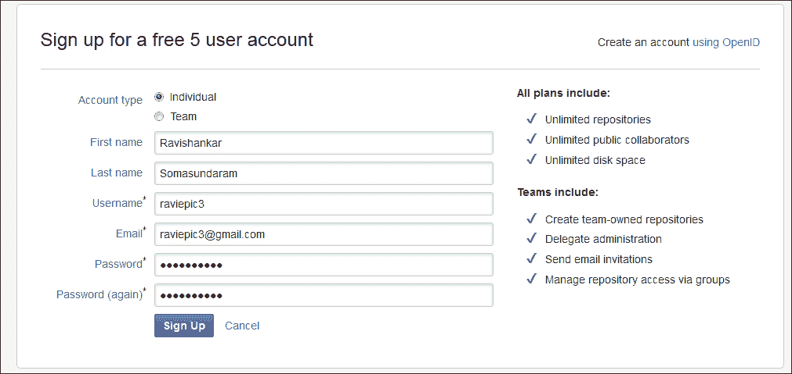

完成相关程序后，你可以期待收到来自 Bitbucket 的确认邮件，以验证你的电子邮件地址。

### 注意

作为完成整个注册流程的替代方法，如果你有 OpenID 账户，可以使用它进行登录。

Bitbucket 的一个亮点是它几乎对所有操作都提供了键盘快捷键，像 Gmail 一样。类似 Gmail，你可以按 *Shift* + *?* 查看可用的快捷键列表。以下是一些常用快捷键的汇总，供你参考：

| 键盘快捷键组合 | 操作 |
| --- | --- |
| *?* | 显示键盘快捷键帮助。 |
| *c* + *r* | 创建仓库。 |
| *i* + *r* | 导入仓库。 |
| *g* + *d* | 进入仪表盘。 |
| *g* + *a* | 进入账户设置。 |
| *g* + *i* | 进入收件箱。 |
| */* | 聚焦到站点搜索框。将光标定位到搜索框中。 |
| *Esc* | 关闭帮助对话框或移除表单字段的焦点。 |
| *u* | 返回到你刚刚通过快捷键浏览过的页面，就像浏览器的返回按钮一样，它将带你回到你在 Bitbucket 中浏览过的页面。 |

让我们通过在你的账户中创建一个新的仓库来开始我们的旅程。你可以按 *c* + *r*，或者点击顶部菜单中的**创建仓库**选项，或者直接点击右侧仓库块中的**创建仓库**链接，这将带你到一个页面，指导你创建新的仓库（repo 是仓库的常用简写）。

| 字段名称 | 值 | 原因 |
| --- | --- | --- |
| **名称** | `online_workbench` | 我们将把桌面上的`Workbench`仓库导入到这个在线平台。 |
| **描述** | `一个在线 Git 仓库，用于展示 Git 的协作功能` | 这是你仓库的简短描述。你可以在这里写下一个描述，最好能够表达仓库的用途。 |
| **访问级别** | `已勾选` | 私有仓库仅对你和你授权的人可见（稍后会详细讲解）。如果此框未勾选，所有人都可以看到你的仓库。 |
| **仓库类型** | `Git` | Bitbucket 支持 Git 和 Mercurial 版本控制系统。由于我们要导入一个 Git 仓库，所以选择 Git。 |

输入字段中的值，如下图所示：

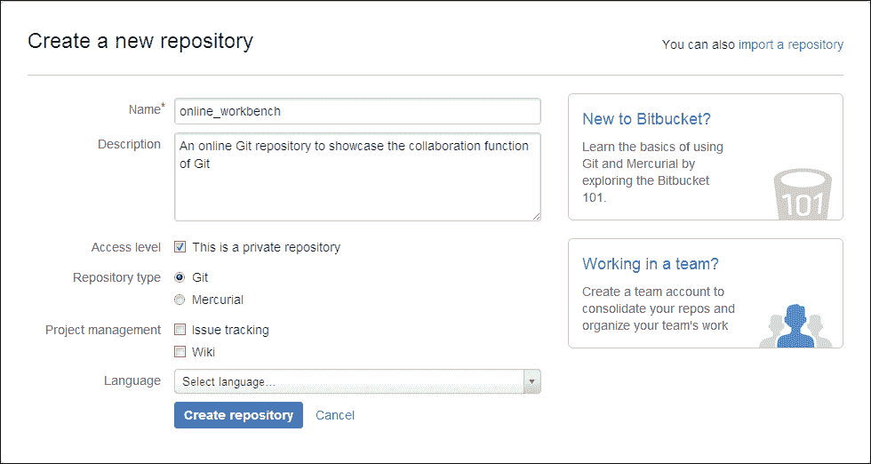

点击**创建仓库**按钮以完成仓库创建过程。现在你已经拥有一个空仓库，Bitbucket 会提示你立即采取行动，如下图所示：

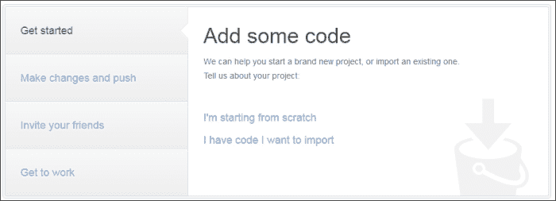

这里有两种不同的启动选项。

+   在我们的机器上创建一个新目录，将其初始化为仓库，并将其链接到我们刚刚创建的远程 Bitbucket 仓库，通过**我从头开始**链接来表示。

+   跳到后面的部分，即将我们现有的仓库链接到远程 Bitbucket 仓库并推送内容，这通过**我有代码要导入**链接来表示。

由于我们已经创建了仓库，让我们选择第二个选项，它将引导我们到如下屏幕：

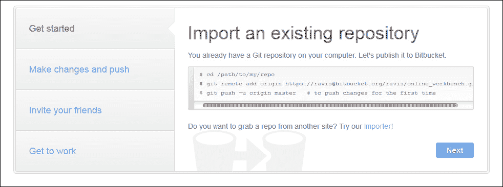

我们现在进入了核心部分。屏幕上显示了 CLI 用户链接`Workbench`仓库从桌面到 Bitbucket 中的`online_workbench`仓库的说明。

# 操作时间 – 使用 CLI 模式添加远程源

将远程源链接或添加到你的仓库（又一个 Git 术语）是一个简单的过程。启动命令行界面并输入以下命令：

```
cd /path/to/your/Workbench/repo
git remote add origin https://your_bitbucket_repo_identity_here/online_workbench.git
git push -u origin master

```

执行`git push`命令后，系统会提示你输入 Bitbucket 账户密码以完成该过程，如下所示：

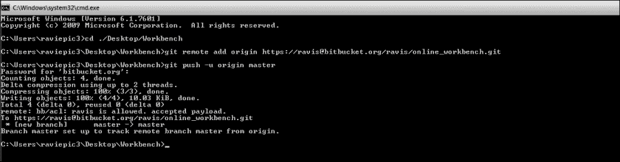

如果你在窗口中看到类似的消息，则表示链接和传输成功。

## *刚才发生了什么？*

我们刚刚为`Workbench`仓库创建了一个远程链接，并将我们的文件推送到`online_workbench`仓库，使它们在线可用，从而开启了分布式文件系统的大门，使用 CLI 模式。

`git remote add`是用来将通过路径识别的 Git 仓库添加到当前仓库配置文件中的命令，以便在一个仓库中的更改可以在另一个仓库中被追踪。可以说，**origin**不过是远程仓库路径的别名。

参数`–u origin master`，与`git pull`一起使用，用于将仓库的推送和拉取操作默认指向指定的远程分支。

### 提示

如果没有使用`–u`，那么每次执行拉取或推送请求时，我们都需要在请求中指定`origin master`。现在，我们只需要输入`git push`进行推送，输入`git pull`进行拉取。

这意味着只要你可以访问安装了 Git 和应用程序软件的计算机，你就可以随时随地继续工作（在这种情况下我们处理的是 Word 文档，应用软件是 Microsoft Word）。

# 操作时间 – 使用 CLI 模式从任何地方恢复工作

现在，让我们进入第二阶段，我们想要从远程机器恢复工作。

这里只涉及三个阶段。

1.  从服务器克隆仓库。

    ```
    git clone https://raviepic3@bitbucket.org/raviepic3/online_workbench.git /path/where/you/would/like/the/clone_to_be

    ```

1.  对需要修改的文件进行更改。

1.  添加/暂存文件中的修改，提交并推送。

    ```
    git add *
    git commit –m 'Your commit message'
    git pull
    git push

    ```

    ### 提示

    作为`git pull`的替代方法，我们也可以使用`git fetch`，然后再执行`git merge @{u}`。

## *刚刚发生了什么？*

我们刚刚实践了通过有效处理如*场景 1*中所述情况来最大化生产力的解决方案。

`Git add *`会暂存/添加你所有的更改，这些更改通过`git commit`命令被确认并记录。`git pull`用来检查服务器上是否有未同步的更新；如果有，系统会将它们同步，然后再执行`git push`，该命令将你在本地仓库中所做并提交的更改推送到服务器，更新服务器上的文件。

### 注意

你可能会想，为什么在我们唯一的目的是将更新的文件推送到服务器时，要先执行`git pull`再执行`git push`。这个问题非常好——请保持这个思考，等到我们讨论分支概念时，你会更清楚地理解。

# 行动时间——使用 GUI 模式添加远程源

通过 Git GUI 将远程源链接或添加到我们桌面上的`Workbench`仓库并同步内容，步骤如下：

1.  打开你桌面上的 Git GUI 窗口，查看我们的`Workbench`仓库。

1.  在你的 GUI 窗口中，点击**远程**菜单中的**添加**选项。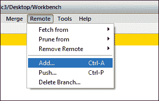

1.  这会打开**添加新远程**窗口，在其中输入以下信息：

    | 字段名称 | 值 |
    | --- | --- |
    | **名称** | `origin` |
    | **位置** | [`your_bitbucket_repo_identity_here/online_workbench.git`](https://your_bitbucket_repo_identity_here/online_workbench.git) |
    | **进一步操作** | **现在不做其他操作** |

1.  如下图所示，点击**添加**按钮：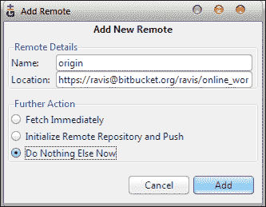

1.  我们现在已经成功地将远程源添加到`Workbench`仓库。

1.  要将我们的代码推送到`online_workbench`仓库，打开相同的**远程**菜单并选择**推送**选项，这会将你引导到**推送分支**窗口，如下图所示：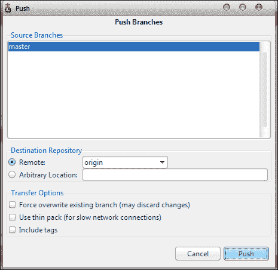

1.  默认情况下，**master**会被选中为**源分支**，而在**目标仓库**下的**远程**选项列表框中，**origin**会被选中。保持默认设置，点击**推送**按钮，等待片刻，系统会提示你输入 Bitbucket 账户密码，如下图所示：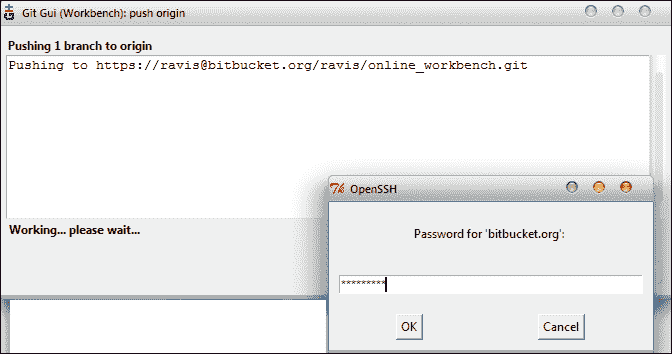

1.  通过身份验证成功后，你的内容将与 `online_workbench` 仓库同步，以下截图可以证明这一点：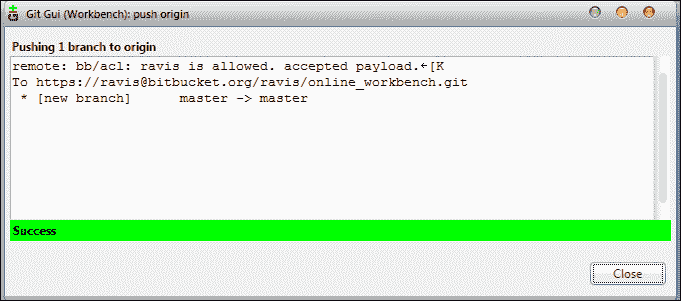

    这表示你的本地 `Workbench` 仓库的主分支与 `online_workbench` 仓库的主分支已同步（更多关于分支的内容将在后续章节讲解）。

## *发生了什么？*

我们刚刚为我们的 `Workbench` 仓库创建了一个与 `online_workbench` 仓库的远程连接，并将我们的文件推送到它，使其在线可用，从而为分布式文件系统打开了大门，使用的是 GUI 模式。

现在，如果你在浏览器中打开你的 Bitbucket 账户，你会看到如以下截图所示，你的历史记录已经更新：

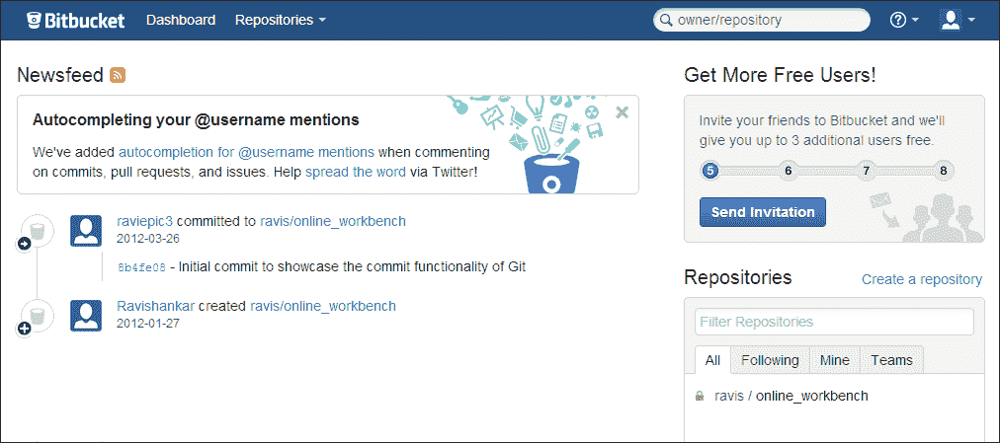

这意味着，如果你能访问安装了 Git 和应用软件的计算机，你可以从任何地方继续工作（在这个例子中是 Microsoft Word，因为我们处理的是 Word 文档）。

继续浏览可用的不同标签页，使自己熟悉它。一旦你完成了这部分，我们就可以进入下一部分，看看如何从分布式位置恢复我们的工作。

# 行动时间 – 使用 GUI 模式从任何地方恢复你的工作

在这里，我们通过创建在线仓库、远程连接并同步本地文件到在线仓库，获得了之前所做的工作的好处。从任何你能接触到的机器上恢复工作是一个简单的三阶段过程。

1.  从服务器克隆仓库。

    1.  打开 Git GUI 并选择**克隆现有仓库**选项，如下图所示：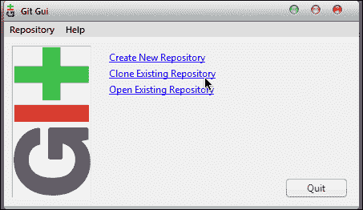

    1.  这将引导你到相应的窗口，在那里你将被提示输入**源位置**和**目标目录**，并按以下方式输入相应的值：

        | 字段名称 | 值 |
        | --- | --- |
        | **源位置** | [`your_name@bitbucket.org/username/online_workbench.git`](https://your_name@bitbucket.org/username/online_workbench.git) |
        | **目标目录** | `/Path/where/you/want/to/have/the_cloned_repository_for_ease_of_work` |

        如下图所示；点击**克隆**按钮：

        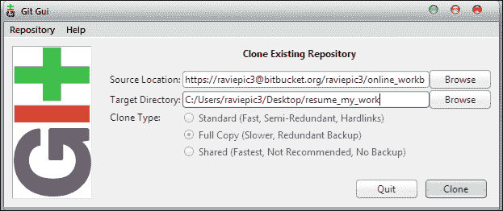

    1.  一旦克隆过程开始，你将被提示输入你的 Bitbucket 账户密码。通过身份验证后，你将获得一个克隆的仓库，里面包含你可以继续工作的文件。

1.  根据需要对文件进行修改。

1.  添加/暂存文件中所做的修改，提交、获取、合并并推送。

    1.  我们已经知道如何将修改添加/暂存到文件并提交到仓库。那么，现在让我们从 fetch 开始。要执行 fetch 操作，请进入**远程** | **从** | **Origin**菜单选项。这将弹出远程 fetch 窗口，提示你输入 Bitbucket 账户密码，如下截图所示：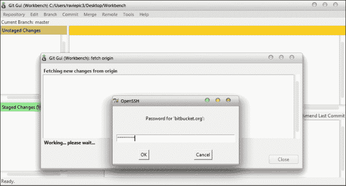

        输入正确的密码并成功认证后，如果服务器中有任何文件的更新尚未同步到本地仓库，这些更改将会被同步。

        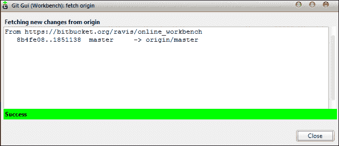

        上一张截图展示了同步过程和同步状态。同步成功后，我们可以关闭窗口并继续合并这两个工作空间。

    1.  合并两个工作空间，即本地主分支（你的本地工作空间，已用来做更改）和远程主分支（服务器上的工作空间），可以通过选择**合并** | **本地合并**菜单选项来执行。这将打开一个本地合并窗口，如下截图所示：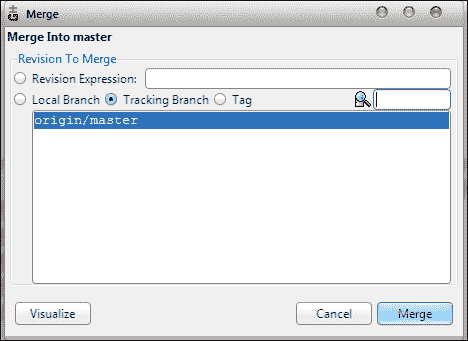

        默认选中的选项是**origin/master**；保持默认，点击**合并**按钮。

    1.  如果在合并时没有冲突，你应该会看到如下截图中显示的成功消息：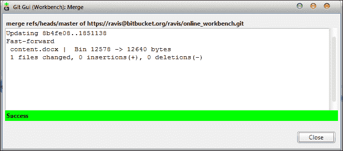

        这标志着你已经成功将服务器中的内容与本地内容同步。现在，让我们使用`git push`功能，将你的内容上传到服务器中，这个功能可以通过**远程** | **推送**菜单选项访问。

## *刚才发生了什么？*

我们刚刚实践了一个有效的解决方案，通过使用 Git GUI 来有效处理*场景 1*中描述的情况，从而最大化生产力。

## 场景 2：解决方案

处理*场景 2*现在变得非常简单，因为我们已经知道如何处理*场景 1*。与前者相比，*场景 2*的唯一新增内容是多个用户参与同一个仓库。

### 邀请用户访问你的 Bitbucket 仓库

邀请你的朋友访问你的游戏文件，让他帮你完成那个关卡，这是一个非常简单的两步操作，具体如下：

1.  从你的仓库主页，点击**分享**图标或**邀请**按钮，如下截图所示：

1.  这时你需要输入你想要邀请或共享你的仓库的用户的详细信息。如果是现有用户，你可以输入他/她的用户名；如果是新用户，你可以输入他/她的电子邮件地址，并点击如以下截图所示的**添加**按钮：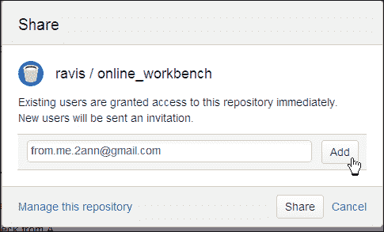

1.  现在，用户名/电子邮件地址已添加到列表中，你将被提示指定你所添加用户的访问权限。点击**写入**按钮，然后点击**共享**按钮，如以下截图所示：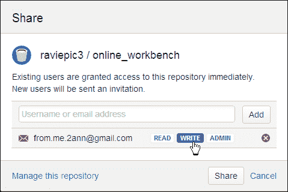

1.  就是这样！你将在页面顶部看到一个成功消息，如以下截图所示，以确认共享：

    而你添加的用户将收到一封电子邮件，告知他/她你希望与他/她共享你的仓库，如以下截图所示：

    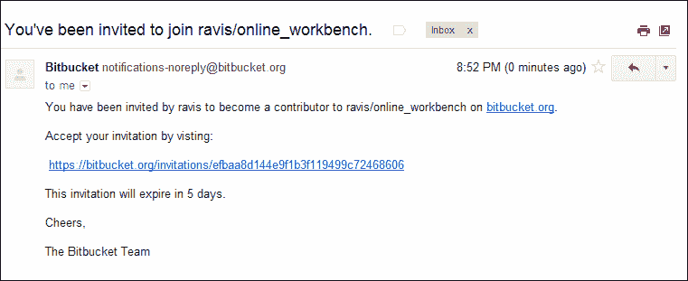

1.  点击链接后，你将有两个选项。

    +   **注册**：如果你的朋友是 Bitbucket 的新用户，他/她需要按照本章前面讨论的注册流程进行注册。注册后，你将被引导到仪表盘。

    +   **使用现有用户名登录**：如果你的朋友已经有 Bitbucket 账户，登录凭据后，他/她将被提示接受共享仓库，如以下截图所示：

    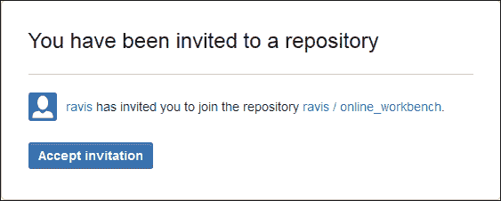

    当点击**接受邀请**按钮时，用户将被带到他/她的仪表盘。

    仪表盘将包含一条屏幕通知的确认信息，如以下截图所示，同时，你注册的电子邮件地址也会收到一封电子邮件，邮件中包含你被授予访问权限的仓库的详细信息：

    

    同时，这个用户会收到一封电子邮件，邮件中包含他/她可以访问的仓库的详细信息。

## *刚才发生了什么？*

完美！我们已经成功地实践了一个有效的解决方案来处理*情景 2*的案例。

这意味着你可以将一个较大的任务拆分成更小的任务，并与其他人共享这些任务和相关文件，以便他们能够填补各自的部分，最终产生一个共同的结果。

### 保持本地 – 通过内联网共享

有些情况下，你可能在局域网内工作，比如在同一栋楼的不同楼层，而因为各种原因（例如成本、上传下载带宽消耗、安全性等），你不想将文件上传到网上。

在这种情况下，有几种方法可以处理这种情况，最常用的几种方法是：

+   Gitolite 服务器

+   公共共享目录与裸仓库

我们将查看在共享目录中创建裸仓库的过程，这样它就可以在你的网络内共享。

#### 裸仓库的概念

一旦说到你需要一个裸仓库来与他人共享文件时，你可能会心中有一些基本问题：

+   什么是裸仓库？

+   为什么我们需要这样一个东西来与他人共享我们的仓库文件？

让我们逐一查看它们。

+   **裸仓库**：裸仓库是没有工作目录的仓库。

+   **工作目录**：这只是一个包含源文件的目录，例如，`content.docx` 位于 `Workbench` 目录中。

    `.git` 目录的内容将是整个目录的内容，如果它是一个裸仓库的话。

+   **为什么是裸仓库**：想象一下一个场景，多个用户同时在同一个文件上工作。那么，当你在从仓库中更改某些内容时，另一个正在处理同一文件的人做了他自己的更改并推送到你的仓库时会发生什么？

    你的文件内容可能会被更改，或者文件本身可能会根据另一端执行的操作而不存在，而你则会打开该文件进行操作。

    处理这种情况时会引起很多混乱，因此创建 Git 的人采取了聪明的做法，通过实现裸仓库概念来避免这种情况。这个裸仓库充当所有这些克隆和包含工作目录的源仓库之间的中介。所以你不能仅仅从一个克隆推送到克隆的源，如果源包含工作目录的话。

    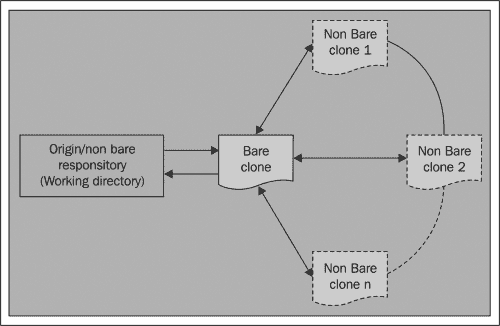

让我们创建一个裸仓库，并快速查看它以便更好地理解。

# 行动时间 – 在 CLI 模式下创建裸仓库

创建裸仓库的命令与克隆仓库时使用的命令相同，唯一的区别是 `--bare` 参数，它是关键。

```
git clone --bare C:\Users\raviepic3\Desktop\Workbench C:\generic_share\Bare_Workbench

```

在控制台中执行上述代码应该会在你的公共共享文件夹 `generic_share` 中创建一个 `Workbench` 仓库的裸克隆。

# 行动时间 – 在 GUI 模式下创建裸仓库

使用 GUI 从已经存在的仓库创建裸克隆是一个简单的过程。你需要做的只是：

1.  复制现有仓库中的 `.git` 目录，并将其粘贴为 `different_name.git`（你想给新裸仓库取的任何名称）到仓库外部。

    在我们的例子中，我们有一个非裸仓库，名为 `Workbench`，路径是 `C:\Users\raviepic3\Desktop\`，其中包含 `content.docx`。现在，我想使用 GUI 从这个仓库创建一个新的裸仓库。我将复制 `C:\Users\raviepic3\Desktop\Workbench\.git` 并将其粘贴为 `C:\generic_share\Bare_Workbench.git`。

1.  使用文本编辑器打开 `Bare_Workbench.git` 中的 `config` 文件，找到 `bare = false` 这一行，并将 `false` 字符串替换为 `true`。

1.  保存并退出。

## *发生了什么？*

通过 CLI 或 GUI 执行之前的操作后，我们已经从 `Workbench` 仓库创建了一个裸仓库，并将其存放在名为 `generic_share` 的目录下，仓库名称为 `Bare_Workbench`，其内容如下图所示：

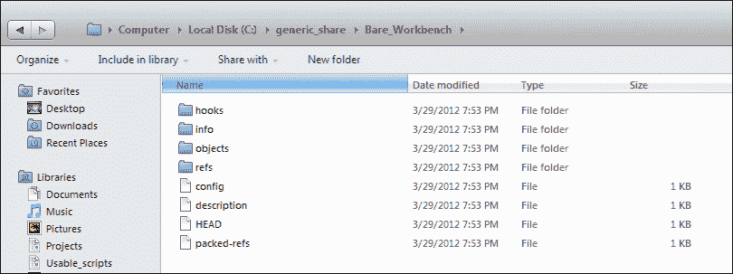

为了更好理解，下面的图示展示了两个仓库之间的内容对比：

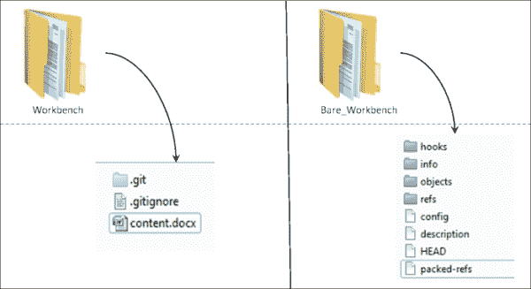

如果你处在本地网络中，可以通过控制共享文件夹 `generic_share` 的可见性来控制谁能访问仓库，方法和你控制网络中其他共享文件夹的可见性一样。

# 总结

我们已经学习了什么是以及如何：

+   克隆一个仓库

    +   区分裸仓库和非裸仓库，了解它们的使用和实现方式

+   将远程仓库添加到本地仓库

+   获取、合并并推送内容到添加的远程仓库或克隆的仓库

    +   拉取操作及其替代方法

此外，你还学会了如何：

+   通过以下方式在互联网和内联网中共享你的仓库：

    +   Git 命令行界面（CLI）

    +   Git 图形用户界面（GUI）

+   你也已经准备好开始使用从第一天开始所学的概念， 因为你已经拥有一个 Bitbucket 账户， 通过这个账户你可以创建和管理无限量的公共和私有仓库，并与最多五个用户共享这些仓库，完全不需要花费一分钱。
