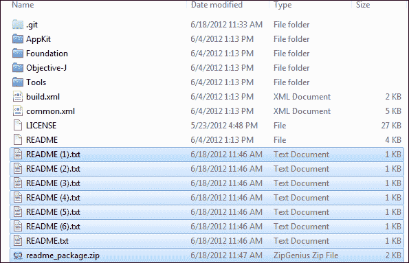
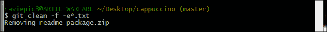

# 第五章。成为木偶大师 – 学习 Git 功能控制的高级特性

*在通过学习、练习和验证目前所学概念打下坚实的基础后，我们已准备好学习一些高级特性，这些特性将基于我们的基础知识，扩展功能使用。*

在本章中，你将学习一些概念，帮助你完成以下任务，涉及到你仓库中的内容：

+   Shortlog

+   日志搜索

+   清理

+   标签

# 为什么要学习这些高级特性

为什么你在*Contra*中需要 "S" 这样的能力，或者在*Counter-Strike*中需要 M4 步枪，明明你已经有了默认武器？

虽然你可以仅凭给定的基本工具达成最终目标——击败对手，但使用那些专业工具可以更轻松地实现这一目标，这就是原因所在。

同样，这些我们即将学习的功能将为我们提供简单的控制 Git 的方法，根据不同的情况提供相应的数据，你可以根据自己的工作角色决定在何时使用这些方法。而且，随身携带一些现成的技巧，也能让你在需要时轻松应对，使你成为这个工作的合适人选。

## 前提条件

为了更好地学习这些概念，我们需要一个包含多个提交和多人参与开发的仓库。因此，我们将从著名的 Git 托管网站（如 GitHub 或 Bitbucket）下载一个仓库。

在这里，我下载了一个名为 cappuccino 的项目，并对仓库进行了简化，以适应我们的目的。

### 提示

**下载示例代码**

你可以从你在 [`www.PacktPub.com`](http://www.PacktPub.com) 的账户中下载所有购买的 Packt 书籍的示例代码文件。如果你是在其他地方购买本书，可以访问 [`www.PacktPub.com/support`](http://www.PacktPub.com/support)，并注册以便直接将文件通过电子邮件发送给你。

你也可以从之前指定的 Git 托管网站下载你自己的项目文件来进行学习。

## Shortlog

尽管信息就是财富，但有时过多的信息会失去它的实际用途。想想电子表格应用中与**筛选选项**相关的价值。Shortlog 就是 Git 中的一个功能，可以限制查看日志时显示的信息量。它按字母顺序排列所有参与构建仓库数据的用户，并显示他们提交的次数以及每次提交的描述。

# 行动时间 – 熟悉 shortlog

现在，让我们快速打开你从 `cappuccino` 仓库中的 CLI 窗口，试试以下命令：

```
git shortlog

```

这应该会给出如下截图中的输出：


## *刚才发生了什么？*

我们刚刚列出了由不同作者负责的 24 次提交的评论；这些作者按字母顺序排列，一次性显示。听起来简洁又易于展示，对吧？

这还没结束！短日志有一些已定义的参数，可以用来重新排序或缩小你的搜索范围，从日志中提取特定的信息。

# 行动时间 - 参数化短日志

只需在之前的命令中添加参数`–n`。

```
git shortlog –n

```

你应该会看到如下所示的输出：


## *发生了什么？*

通过添加`–n`（编号）参数，得到的输出将根据提交次数进行加权，而不是按字母顺序排序。

现在我们有了基本概念，让我们快速过一遍剩下的可以使用的参数。要获取附加到现有输出中的作者电子邮件等元数据，我们将使用`–e`参数。

```
git shortlog -e

```

你可以期待如下所示的输出：


想知道如何快速获取仓库从不同用户处经历的阶段/提交数吗？让我来介绍一下`-s`参数，它可以为我们提供每个用户的提交计数历史。

```
git shortlog –s

```


总结一下这些参数及其功能，请参考以下表格：

| 参数 | 操作描述 |
| --- | --- |
| 简写形式 | 完整形式 |   |
| --- | --- | --- |
| `-n` | `--numbered` | 根据每个作者的提交次数而非字母顺序对输出进行排序 |
| `-s` | `--summary` | 提供每个用户的提交计数历史 |
| `-e` | `--email` | 获取每个提交到我们仓库的作者的电子邮件地址 |
| `-h` | `--help` | 打印简短的使用信息 |

## 日志搜索 - git log

继续短日志的内容，给你的工具箱增加一些能根据需要提取数据的利器。你可能知道从前面的章节中了解到 Git log 命令仅用于查看提交 ID 和相关元数据。但你将在这里学到的是日志命令本身的灵活性，以及它所包含的功能。

# 行动时间 - 跳过提交日志

让我们快速在之前从`cappuccino`仓库打开的 CLI 窗口中尝试以下操作：

```
git log --skip=2

```

这应该会生成如下所示的输出：


## *发生了什么？*

尽管输出一开始可能看起来与通常的`git log`输出类似，但当你进行对比时会发现，你已经跳过了列出的最后两次提交。


`--skip=number`使这一切成为可能。`number`参数可以接受任何整数值，用来跳过相应数量的提交。

有很多情况，你可能希望基于日期过滤内容。这可以通过`git log`中的`since`/`after`和`until`/`before`操作符实现。

# 行动时间 – 按日期范围过滤日志

执行`git log`后，选择两个日期，我们将使用这两个日期来过滤接下来的命令：

```
git log --since=2008-09-08 --until=2008-09-09

```

这应该会产生如下输出：


## *刚才发生了什么？*

使用`--since=date`操作符可以过滤从指定日期开始的日志，并通过`–until`参数限制在指定日期之前的日志。

### 注意

请注意，你还可以指定相对日期，比如`–since=2.days`或`--since=3.months`来过滤输出。

如果你在想是否有一种方法可以根据关键词在提交中进行搜索——是的，可以，使用`git log`的`–grep`参数。

# 行动时间 – 搜索单词/字符匹配

在 CLI 窗口中输入以下命令：

```
git log --grep="Merge"

```

这应该会产生如下输出：


## *刚才发生了什么？*

我们使用与`git log`关联的`grep`工具，搜索给定的关键词，在不同提交的提交信息中查找"Merge"。

### 注意

要执行不区分大小写的搜索，可以在之前的命令后添加`-i`选项。

为了总结各参数及其功能，请参考以下表格：

| 参数 | 操作描述 |
| --- | --- |
| `--skip=number` | 跳过指定数量的提交，在显示日志输出时 |
| `--since,after=<date>` | 显示自给定日期以来的提交 |
| `--until,before=<date>` | 显示直到给定日期的提交 |
| `--grep=<pattern>` | 限制日志输出，匹配提交信息中给定的模式 |

## 清理

在处理文件时，我们可能需要*Ctrl* + *Z*撤销一些错误。有一个经典的例子是在工作过程中，你在一个已经包含文件的目录中解压 ZIP 包，结果发现 ZIP 包直接将文件放入该目录，而没有为解压的文件创建一个单独的目录。我看到你点头了，我知道你在微笑。

好吧，像这样的情况如果你解压的 ZIP 包所在的目录被 Git 监视（即是一个 Git 仓库），就可以轻松处理了。让我们再现这个场景，看看如何在几秒钟内处理它。

# 行动时间 – 模拟混乱

执行以下步骤：

1.  从[`www.packtpub.com/support`](http://www.packtpub.com/support)下载名为`readme_package.zip`的 ZIP 包，并将其放置在我们一直在使用的`cappuccino`仓库中，以便学习这些命令。

1.  将 ZIP 内容解压到 `cappuccino` 目录内，确保看到如下截图中所示的七个 README 文件：

1.  现在打开你的 CLI 窗口，输入以下命令：

    ```
    git status

    ```

    这将显示如下的当前状态：

    

## *刚才发生了什么？*

我们已经成功模拟了之前讨论的意外解压的场景。

但在 Git 中，你解压的文件会被列为未跟踪的文件。这意味着，无论解压的文件和原始文件混合的数量如何，Git 都能轻松识别它们并提醒你。

我们可以通过指定模式来删除所有或部分文件，当匹配该模式时，clean 命令将跳过这些文件的删除。我们将在接下来的 *行动时间* 中了解更多关于这一点的信息。

# 行动时间 – 使用模式匹配清理你的杂乱

让我们跳过那些 README 文件的删除，首先删除我们复制并粘贴到仓库中的 ZIP 包。在终端中输入以下命令：

```
git clean –f –e*.txt

```

这将给你如下所示的输出：



## *刚才发生了什么？*

`Git clean` 需要指定一个 `force`（`–f`）操作符，才能删除那些 Git 没有监控的文件，而 `–e` 操作符则跟随一个模式，并排除匹配该模式的文件。

在我们的例子中，`*.txt` 是匹配模式，它匹配了由于解压而在仓库中创建的所有 `.txt` 文件，因此唯一未被删除的文件是 `readme_package.zip`，它已被删除。

### 注意

如果我们将 `clean.requireForce` 配置变量设置为 `false`，则每次运行 `git clean` 命令时，可以避免指定 `–f` 参数。

# 行动时间 – 完全清除你的杂乱，无一例外

要删除这些不小心添加到仓库中的文件，你只需要对它们发起一场“火力打击”！没错，从之前的命令中，只需去掉排除部分。

```
git clean –f

```

这将给你如下所示的输出：


## *刚才发生了什么？*

`clean` 命令会删除当前仓库中所有未跟踪的文件。`–f` 参数强制 `git clean` 删除那些未跟踪的文件。

以下是你可以在 `git clean` 中使用的参数列表：

| 参数 | 操作说明 |
| --- | --- |
| 简写形式 | 全写形式 |   |
| --- | --- | --- |
| `-f` | `--force` | 删除未跟踪的文件 |
| `-d` |   | 删除未跟踪的目录和文件 |
| `-n` | `--dry-run` | 不删除任何内容，只显示将要执行的操作 |
| `-q` | `--quiet` | 保持安静，只报告错误，不报告成功删除的文件 |
| `-e<pattern>` | `--exclude=<pattern>` | 排除与指定模式匹配的文件，以及在 `.gitignore` 中指定的文件（按目录） |

## 标签

标签在你想要在历史中标记一个特定点并附加一些元数据时非常有用，此后你可以使用相同的标签进行引用。在 Git 中有两种类型的标签。

+   **轻量级标签**：这种标签方法仅跟踪标签名，不关心标签是由谁或何时创建的。当你只有一个人在仓库中工作，或者你创建的标签仅用于简单参考项目文件经历的不同阶段时，这种方法可能会很有用。

+   **注释标签**：这种标签方法会记录作者的姓名、标签创建时间和标签名（如果提供的话，还包括描述）。当你想要回溯已达成的里程碑，或者当多个开发者共同参与同一个仓库的工作时，这种方法可能会很有用。

### 注意

当你使用注释标签时，项目拥有者可以在标签过程中保持授权访问权限；在高级设置中，甚至可以控制谁进行标签操作，何时操作，并标记他们的授权身份以供日后参考。

说了这么多，让我们通过实际操作更好地理解它。

# 行动时间 – 轻量级/无注释标签

1.  首先，让我们通过在 CLI 窗口中执行 `git tag` 命令来列出 `cappuccino` 仓库中现有的标签。这应该会产生如下输出：

    提供的 `git tag` 命令已检索了仓库中所有可用的标签，并按字母顺序列出它们。

1.  现在，让我们通过执行以下操作在 `cappuccino` 仓库中创建一个轻量级标签：

    ```
    git tag edge_v1.1

    ```

    如果没有返回错误，说明你的标签应该已经创建。你可以通过进行标签列出操作来验证，正如我们在前一步中学习的那样。

    

1.  或者你可以通过打开 gitk 来查看它，这样你会看到如下效果：

    ### 注意

    你可以通过 Git Gui 的仓库菜单或直接在 CLI 窗口中输入 `gitk` 来打开 gitk。

    

1.  如果你想浏览某个已打标签提交的文件更改，可以查看 gitk 窗口左下角，或者使用 `git show <tagname>`，如以下命令所示：

    ```
    git show edge_v1.1

    ```

    这将显示如下截图所示的输出：

    

## *刚刚发生了什么？*

我们已经成功地创建并附加了一个轻量/未注解标签到一个特定的提交。我们还学习了列出所有在仓库中可用的标签，如果需要，可以查看与任何给定标签相关的详细变化。

我们学习了如何通过标签名来引用提交，而不是使用提交的 SHA1 ID。让我们从实际操作中理解这意味着什么。

# 执行动作 – 引用标签

我们已经学习了 `git checkout` 作为返回历史的一个功能。正如你所知道的，这个过程需要你想要访问的提交的 SHA1 ID。现在让我们看看在处理标签时，如何做到这一点。在你的命令行窗口输入以下命令：

```
git checkout 2e361b44
git checkout edge_v1.1

```

这应该会给你如下图所示的输出：


## *刚刚发生了什么？*

我们使用通常的 `git checkout SHA1 ID` 方法检出了一个较早日期的提交，但通过使用与提交关联的标签名称（`edge_v1.1`）回到了最新的提交。

# 执行动作 – 注解标签

在学习了如何创建未注解/轻量标签后，创建注解标签的过程和它一样简单，只需要在命令中添加 `–a` 参数。让我们在命令行窗口输入以下命令：

```
git tag –a ann_v1.1 –m 'Annotated tag v1.1'

```

## *刚刚发生了什么？*

如果命令执行后没有返回任何错误，这意味着你的注解标签已经成功创建。我们创建了一个名为 `Ann_v1.1` 的注解标签。在这里，`–a` 表示注解标签名称，`–m` 用于设置创建标签时的描述字符串。

### 注意

请注意，我们为同一个提交创建了注解标签和未注解标签，以便后续进行比较。

### 简单练习

1.  为了验证创建过程，进行标签列表操作，验证你创建的标签是否存在。

1.  检查与创建的注解标签关联的提交内容变化。

为了理解轻量标签和注解标签之间的区别，它们的输出将并排显示。


尽管创建过程略有不同，但删除注解标签和未注解标签的过程是相同的。你只需将 `–d` 参数与标签名一起使用，如下所示：

```
git tag –d edge_v1.1
git tag –d Ann_v1.1

```

这应该会产生一个确认信息，如下图所示：


## *刚刚发生了什么？*

我们刚刚删除了 `edge_v1.1` 和 `Ann_v1.1` 标签，这两个标签是在学习标签过程中的 `cappuccino` 仓库中创建的。

`–d` 参数将删除传递给它的标签名，无论它是注解标签还是未注解标签。你可以执行标签列表命令，验证删除后的状态，如前图所示。

# 总结

我们已经了解了什么是以及如何：

+   使用短日志：

    +   按作者对提交进行排序和量化

    +   总结提交日志

    +   获取每个提交者的元数据，例如电子邮件地址

+   使用不同的`git log`参数，这使我们能够：

    +   在显示日志条目时跳过指定数量的提交

    +   从提交日志中提取日期范围内的数据

    +   在提交消息中搜索字符串值以识别提交

此外，我们还学习了如何清理我们的仓库，以防我们或其他人通过将不属于该仓库的文件注入其中而弄乱它。

不仅如此，我们还实际操作了如何使用注释标签和轻量标签标记仓库内容的里程碑。
