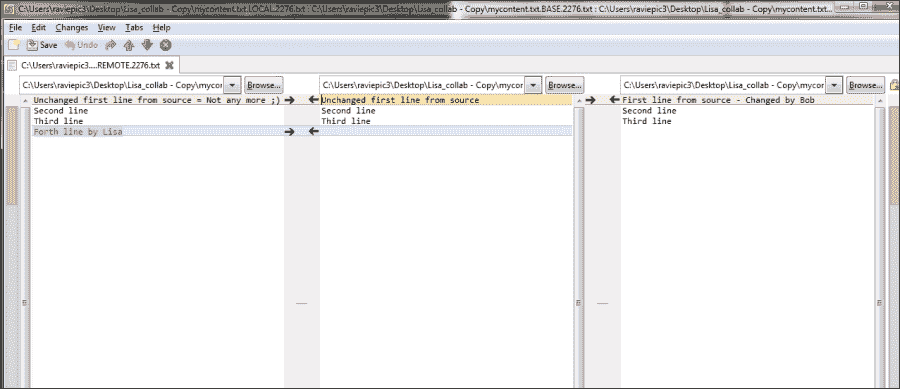

# 第六章：释放野兽 - Git 与基于文本的文件

*我们在之前的章节中看到了两种不同的与 Git 管理内容的工作模式，用游戏类比分别称为单人模式和多人模式。*

*请系好安全带。本章将解答你长久以来的疑问：多人模式是如何工作的，几个人可以并行玩耍？换句话说，就是让多人同时在同一内容上工作。*

本章将学习的概念如下：

+   合并与

+   解决冲突，按你或团队的方式处理内容

# Git 用于基于文本的文件 - 介绍

Git 在处理文本文件时配备了多种功能。从更高层次理解，我们可以通过以下栈来了解不同的文件类型及其含义：


从上到下，它是一种分层的方法，从用户看到文件的方式，到计算机如何看到文件，直到文件在最底层的存储。

### 注意

**二进制数据**：任何只能通过特定程序（如 Microsoft Word 用于文档、图片查看器用于图片）读取内容的文件，称为二进制数据/值。

**文本数据**：任何文件，不论其扩展名或性质如何，只要内容是纯文本，可以用普通文本编辑器如记事本或 WordPad 打开的文件，都被认为是包含文本数据的文件。

为了更清楚地说明问题，打开项目中的`.git`目录，你将看到如下面截图所示的文件结构：


这里名为**index**的文件被认为包含二进制数据，而**COMMIT_EDITMSG**、**config**、**description**和**HEAD**这些文件被认为包含文本数据。用文本编辑器打开它们，你就会明白为什么。

### 注意

确保你不要更改这些文件的任何内容，否则你可能会弄乱仓库的版本，修复这些问题可能需要一些操作，但目前我们不感兴趣。

另一个例子是，你可以尝试用文本编辑器打开一个图像文件，以查看它的原始内容。

这就是我们之前提到的基本区别。在我们理解了**分支**和**合并**的概念后，接下来我们可以进一步讨论这个问题。

# 多人模式 – 多个玩家同时在线

让我们继续延续之前章节中的游戏类比，以便更好地理解目前所学到的多人模式概念。

## 多个玩家 – 一次一个

想象一下你最喜欢的冒险游戏，它有多个关卡。设想一个情景，你在某一关卡卡住了，不知道如何继续。经过一番徒劳的尝试后，你突然意识到你的朋友是这个关卡的专家，你想寻求朋友的帮助。于是你迅速将最后保存的游戏文件状态分享给他，让他帮你完成这一关，保存状态后再把文件推送回给你，这样你就能继续进行游戏。

同样的情况也适用于你处理数据文件时，特别是在团队协作中，大家分工不同，共同完成更大任务以得出最终结果。另一种可能性是你希望领域专家处理特定的工作部分，等等。

这也意味着，当多人在同一文件上处理同一话题时，文件按照顺序传递给其他人逐一完成工作，可能会顺利进行，但当多个不同的人在同一个文件上处理同一话题时，尤其是对于包含二进制数据的文件，可能会变得混乱。

## 多个玩家 – 众志成城（同时多人）

我是**第一人称射击**（**FPS**）游戏的忠实粉丝。即便今天，*反恐精英*仍然排在我的游戏榜单的顶端。我们在这里以*反恐精英*或其他任何团队游戏为例。每个队员不仅精通一种武器，还会精通两三种武器，以适应不同的情况。当需要时，他们会协同作战，共同击败对手并完成目标。

同样，当你处理文件中的文本数据时，多个不同的人可以协作编辑同一个文件、同一个话题、同一行内容，并利用 Git 管理最终产出。让我们学习如何更好地利用这一特性。

### 分享你的仓库

有两种常用的方式可以与他人分享你的仓库。

+   内联网

+   互联网

已经习惯通过 Bitbucket 在互联网上进行分享的你，这次让我们模仿使用我们在第四章中学到的裸仓库概念，通过内联网进行分享，*分担负载 – 使用 Git 进行分布式协作*。

### 注意

如果你无法回忆起相关内容，我建议你阅读第四章中的*保持本地 – 通过内联网分享*部分，以了解什么是裸仓库，我们为什么需要它，以及它是如何操作的。

# 行动时间 – 准备分享

为了保持清晰和简洁，我们将从一个最小数据的新实例开始，这样变化会更加显著。

1.  让我们创建一个新的目录并命名为`collab_source`。

1.  在目录中创建一个新的文本文件，命名为`mycontent.txt`。

1.  打开你刚创建的文本文件，并输入以下内容：

    ```
    Unchanged first line from source
    Second line
    Third line

    ```

1.  保存并关闭文件。

1.  现在，将 `collab_source` 目录变成 Git 仓库；然后添加文件 `mycontent.txt` 并提交，提交信息为 "从源仓库的基础提交"。

1.  现在，这个副本将存放在您的机器上，以便您进行操作。让我们从您的副本中创建一个裸仓库，并将其放置在一个公共位置，您的团队成员可以从这个位置克隆，以获取他们自己的文件副本。

1.  若要创建现有仓库的裸克隆，请使用以下命令：

    ```
    git clone --bare /your/path/to/collab_source /your/path/to/bare_collab

    ```

### 注意

在这个例子中，为了传达概念，我已经将 `bare_collab` 仓库克隆到我本地系统，而不是公共网络共享目录。但操作流程是一样的。

本主题的主要目的是传达多用户概念，因此我只选择了执行模式（CLI）。通常情况下，您应该已经知道这些命令的图形界面（GUI）对应操作。如果有例外情况，我会提供一个简要说明。

## *刚刚发生了什么？*

我们创建了一个源仓库并添加了内容，然后从源仓库克隆了一个裸仓库，这样就为我们的团队成员提供了克隆选项。如果您按照前面的步骤操作，您应该会看到如下图所示的结构：


# 行动时间 - 分布式工作团队

现在，Bob 和 Lisa（我们的虚拟团队成员）可以执行常规的 `git clone` 命令，其中源是 `bare_collab` 仓库，目标是他们选择的本地位置，以获取文件的副本。

```
git clone /path/to/repository/bare_collab /path/of/local/copy/Bob_collab
git clone /path/to/repository/bare_collab /path/of/local/copy/Lisa_collab

```

## *刚刚发生了什么？*

除非 Git 报告了错误，否则 Bob 和 Lisa 已经从我们名为 `bare_collab` 的裸仓库克隆了文件。现在，这些仓库的演变结构如下图所示：


如下图所示，提交树的结构是这样的：


# 行动时间 - Bob 的更改

1.  现在，Bob 觉得需要修改文件内容。因此，他打开文件并将第一行的文本更改为 "源文件的第一行 - Bob 更改"，这样文件内容如下所示：

    ```
    First line from source - Changed by Bob
    Second line
    Third line

    ```

1.  然后他添加了更改并提交，如下图所示：

1.  为了与团队成员共享更改，他希望将自己的更改推送到公共的裸仓库，但根据经验法则，在与多人合作时，使用 Git 时，推送前先拉取，以便将他人的更改合并进来，防止别人先于你推送更改。Bob 先执行了 `git pull`，然后再执行了 `git push`，如下图所示：

## *刚刚发生了什么？*

由于这次推送操作，裸仓库已更新，并包含了 Bob 的更改，而我们机器上的仓库（`collab_source`）以及 Lisa 的仓库仍然落后。现在，提交树的结构如下：


# 行动时刻 – 莉莎的更改

1.  在鲍勃进行所有这些操作时，莉莎也做了自己的更改。恰巧她修改了文件的第一行，并在其后追加了一行，这使得文件内容变成了如下所示：

    ```
    Unchanged first line from source = Not any more ;)  - Lisa
    Second line
    Third line
    Fourth line by Lisa

    ```

1.  然后她添加更改并提交，正如以下截图所示：

1.  为了与团队成员共享更改，莉莎想将她的更改推送到公共裸仓库，但根据经验法则，在多人合作时，推送之前需要先拉取，以便在别人已经推送之前先整合对方的更改。她首先执行了`git pull`，然后收到了以下错误信息：

## *刚刚发生了什么？*

莉莎进行了更改、添加并提交，当她尝试从中央`bare_collab`仓库拉取时，遇到了合并冲突。

如果你专注于最后三行，就能清楚地看出为什么拉取操作被阻止。Git 自动尝试将莉莎所做的更改与鲍勃已经推送的更改合并，因为两人都修改了第一行，Git 巧妙地停止了合并，并要求我们解决冲突。

# 行动时刻 – 莉莎检查合并冲突

莉莎打开文件查看导致她无法继续的冲突，并发现了如下的模式：

```
<<<<<<< HEAD
Unchanged first line from source = Not any more ;)  - Lisa
=======
First line from source - Changed by Bob
>>>>>>> 9bab0336e6c9ab984b538f1f7724bf8a9703f55e
Second line
Third line
Fourth line by Lisa

```

## *刚刚发生了什么？*

第一行上显示的连续左箭头和`HEAD`字样只是莉莎当前在仓库中的位置。下一行显示了她对文件所做的更改。

之后是连续的`=`符号，标志着莉莎内容的结束和鲍勃内容的开始。它是一个分隔符，紧接着下一行显示的是鲍勃的内容，然后是鲍勃进行该更改时生成的提交 ID。

# 行动时刻 – 莉莎解决合并冲突

执行以下步骤：

1.  解决冲突是一个非常简单的过程。你有四个选择。

    +   指定顺序并合并两者的更改（在我们这个例子中是莉莎和鲍勃的更改）

    +   删除现有更改并应用你的更改

    +   删除你的更改并应用拉取的更改

    +   删除两者

    然而，第四个选项不太可能发生。

    ### 注意

    要执行这些操作，可以使用常见的文本编辑器或交互式合并工具，它会为你提供三种视图（本地、基础和远程），你需要利用这些视图来解决提交的冲突。

    **本地视图** 是当前修改版本，**基础** 是我们在修改之前的早期版本，由 Git 自动决定，并且**远程** 是修改的远程版本，我们正在尝试获取和合并。您需要使用可用的箭头和指示器移动和排序您的更改以及远程版本。互动合并工具的屏幕截图（我展示了基于 Python 的**meld**实用工具）如下所示：

    

    ### 注意

    现在，我们将使用普通文本编辑器来解决这种情况，以便理解其中的概念。

    Lisa 将选择第一种选项来排序和整合这两种更改；让我们看看她是如何做到的。

1.  Lisa 觉得将 Bob 的更改放在前面更好。在决定顺序之后，她使用普通文本编辑器打开文件，并按以下方式更改内容：

    ```
    First line from source - Changed by Bob
    Unchanged first line from source = Not any more ;)  - Lisa
    Second line
    Third line
    Fourth line by Lisa

    ```

    在进行了上述更改之后，她*添加*了更改，并将其提交，并附带消息“合并 - 先放置 Bob 的更改，然后是我的”，如下截图所示：

    

1.  在此之后，Lisa 使用常规的`push`命令将她的提交推送到我们的中央裸仓库（`bare_collab`），如下截图所示：

## *刚才发生了什么？*

Lisa 已成功解决冲突，并通过将更改推送到中央裸仓库使其可用于团队的其他成员。

这应该给出一个如下流程图所示的提交树结构：


正如图中所示，C3（由 Lisa 提交的本地提交）和 C2（由 Bob 提交并共享的提交）正在合并以形成一个称为合并提交 C4 的新提交。

在任何给定时间点，您都可以从 GUI 模式和 CLI 模式获取这些图形表示。

### GUI 模式 - 获取仓库的历史图表

从 Git Gui 的 **Repository** 菜单中选择**Visualize all branch history**。一旦 Gitk 打开，左上角即可看到您的仓库历史可视化。Lisa 的可视化如下截图所示：


### CLI 模式 - 获取仓库的历史图表

在您的终端/控制台中，切换到 Git 仓库的位置，然后使用以下命令获取其历史的树形表示：

```
git log --graph

```

您将看到如下截图所示的表示：


# 行动时间 - 团队成员与中央裸仓库同步

1.  Bob 觉得已经有一段时间没有从裸仓库接收到更新了，于是他执行 pull 操作来获取最新的更改，结果如下所示：

1.  好的，最后别忘了源仓库，所有这些仓库的母仓库，用于更新。在从那里执行 `git pull` 之前，我们应当将 origin 指向裸仓库，然后执行 pull 操作。命令如下：

    ```
    git remote add origin /path/to/bare_collab
    git pull –u origin master

    ```

    这给我们提供了如下所示的输出：

    

正如我们在 第四章的 *行动时间 – 添加远程源* 中学到的，*分担负载 – 使用 Git 的分布式工作*，添加远程仓库是一次性的操作。

我们可以手动打开文件或执行 `git log` 来查看更改在不同仓库中的生效情况。

## *刚刚发生了什么？*

我们成功地将不同人员在同一个文件、同一行上同时所做的更改同步到了不同的仓库，从而实现了预期的协作工作环境。

# 总结

我们已经学到了：

+   文件内容的差异

+   Git 在文本文件上的强大功能

此外，我们还学会了如何在合并时处理和管理冲突。

不仅如此，我们还进行了一次角色扮演，实践学习了如何建立一个协作工作环境，多个成员可以在同一个文件、同一个主题，甚至同一行上进行工作。我们还学会了如何将不同人员的工作整合在一起，形成一个最终的输出。
