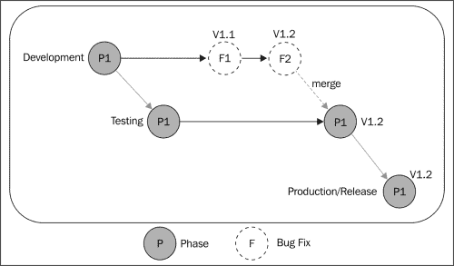
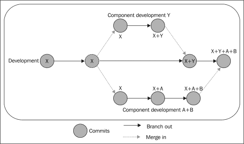
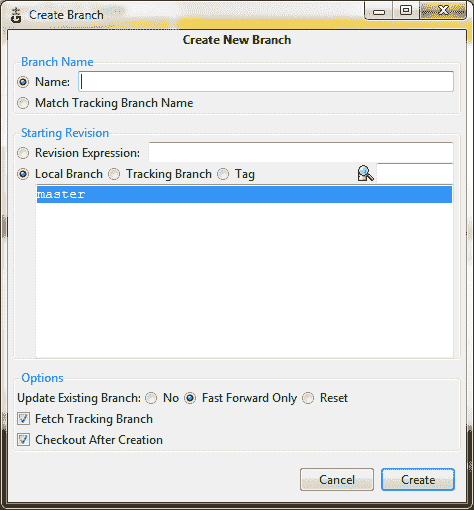
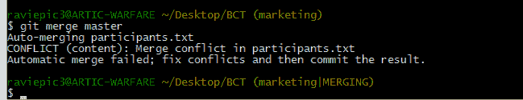
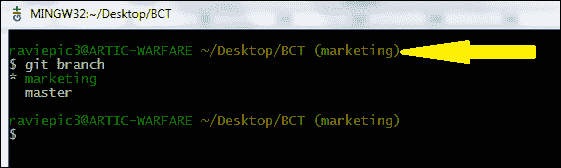
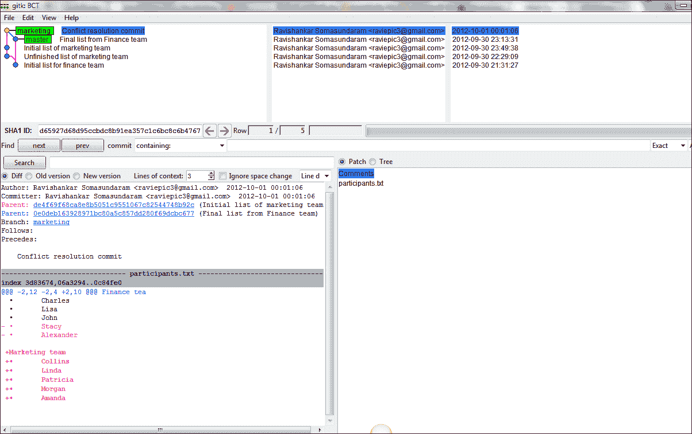
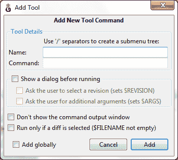
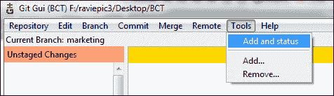

# 第七章. 平行维度——使用 Git 进行分支

*Git 最著名并且广受赞誉的两个特点就是廉价的分支和合并。在本章中，我们将了解什么是分支，为什么你需要分支，以及何时需要分支。既然我们已经尝试过合并，曾在第六章《释放猛兽——Git 与文本文件》里使用合并解决过一个合并冲突，我们接下来将更进一步，了解如何在需要时合并分支。*

所有这些内容都是从组织的角度进行探索的。我们还将学习并实践一些方法，通过以下方式简化我们的工作：

+   为常用的长命令创建简单的别名

+   将多个命令链式连接，以适应常用工作流程

# 什么是分支

Git 中的分支是一个功能，用于为不同的使用需求启动一个独立的、类似当前工作区的副本。换句话说，分支意味着从你当前的工作中分岔出来，进入一条新的道路，在不打扰主线工作的情况下，你可以继续做其他事情。

让我们通过以下示例更好地理解这一点。

假设你正在为公司某部门维护一个流程检查表，并且对其结构的高效性印象深刻，您的上司要求您在做出一些特定于该部门的小修改后，将该检查表分享给另一个部门。你会如何处理这种情况？

如果没有版本控制系统，一种明显的方法是保存文件的另一份副本，并对新文件进行修改，以适应其他部门的需求。使用版本控制系统，并结合你当前的知识水平，也许你会克隆仓库并对克隆的副本进行修改，对吧？

展望未来，可能会有需要/情况，要求你将已对某一副本所做的更改，合并到另一副本中。例如，如果你在一个副本中发现了拼写错误，它很可能也会出现在另一个副本中，因为两者共享相同的源代码。另一个想法是——随着你们部门的不断发展，你可能会意识到，你为其他部门创建的定制版检查表比你以前使用的版本更适合你们部门，因此你想将为其他部门做的所有更改合并到你的检查表中，并拥有一个统一的版本。

这就是分支的基本概念——一条独立于其他开发线的开发线，它们共享一个共同的历史/源代码，必要时可以合并。是的，分支总是以某些内容的副本开始，然后从那里开始独立发展。

几乎所有的版本控制系统都有某种形式的支持，以适应这种分歧的工作流程。但正是 Git 的速度和执行简便性让它领先于所有其他系统。这也是人们将 Git 的分支称为其杀手级特性的主要原因（我们将在下一章深入探讨 Git 分支的细节）。

# 为什么需要分支

为了理解为什么需要分支，我们来考虑另一种情况：你在一个团队中工作，团队中的不同成员为项目中的不同部分做出贡献。

你的整个团队最近发布了项目的第一阶段，并正在朝第二阶段努力。不幸的是，一个在早期测试阶段没有被质量控制部门发现的错误，在第一阶段发布后出现了（是的，我也经历过！）。

突然间，你的优先事项转向了首先修复错误，因此放下了你在第二阶段所做的工作，快速修复了第一阶段中识别出的错误。但是，切换上下文会破坏你的工作流程；这样的想法有时可能会非常昂贵。为了处理这些情况，你可以使用分支概念（参见下一部分的图示），它允许你在不互相干扰的情况下同时处理多个任务。

### 注意

仓库中可能有多个分支，但只有一个活动分支，也称为当前分支。

默认情况下，自从代码库创建之初，名为**master**的分支是活动分支，除非显式更改，否则它是唯一的分支。

## 命名规范

Git 对分支名称有一系列命名规则，以下是一些常见的命名错误：

+   分支名称不能包含以下内容：

    +   空格或空白字符

    +   特殊字符，如冒号（:）、问号（?）、波浪号（~）、插入符号（^）、星号（*）和左括号（）

+   斜杠（/）可用于表示层级名称，但分支名称不能以斜杠结尾

    例如，my/name 是允许的，但 myname/是不允许的，而 myname\ 将等待输入进行拼接

    +   以斜杠（/）结尾的字符串不能以点（.）开头

        例如，my/.name 是无效的

    +   名称不能包含连续的两个点（..）

# 何时需要创建分支

使用 Git 时，关于何时可以/需要创建分支并没有硬性规定。你可以根据自己的技术、管理甚至组织原因来决定创建分支。以下是一些给你提供参考的情况：

+   在软件应用开发中，分支通常用于自学/实验目的，开发人员需要在不影响已发布版本的应用程序的情况下尝试在代码上进行逻辑测试

+   一些情况，比如为每个客户创建一个单独的源代码分支，每个客户需要对你当前的包进行一组独立的改进

+   经典的情况是——团队中的某些人可能在修复已发布版本的错误，而其他人可能在开发下一个阶段/版本

+   对于一些工作流，你甚至可以为每个提供输入的人创建独立的分支，最后将这些分支合并，生成一个发布候选版本

以下是一些工作流的流程图，帮助我们理解如何使用分支：

+   进行 bug 修复时的分支结构可以如下图所示：

    这解释了如何在不同的阶段/推广中管理相同的一组文件。在这里，来自开发的 P1 已被发送到测试团队（测试团队将获得一个名为“测试”的分支），并且发现的 bug 会在开发分支（v1.1 和 v1.2）中报告并修复，最后与测试分支合并。之后，这将被分支为生产或发布版本，最终用户可以访问。

+   每个组件开发的分支结构如下图所示：

    在这里，每个开发任务/组件构建都是一个独立的新分支，完成后会合并到主开发分支中。

# 实践出真知：使用 Git 进行分支操作

我相信你已经对在处理 Git 仓库时，何时、为什么以及如何使用分支有了较好的理解。让我们通过创建一些用例来加深这一理解。

## 场景

假设你是你所在组织的培训组织者，负责在需要时进行培训。你正在准备一份人员名单，这些人基于之前的记录，可能需要接受商务沟通技巧的培训。

第一件事，你需要向被提名者发送电子邮件，确认他们在指定日期的可用性，然后从他们的经理处获得批准，分配资源。通过以往的经验，你知道从记录中选出的培训人员名单可能会因团队内的情况而发生最后时刻的变化。因此，你希望先发送初步名单给每个团队，然后在名单最终确定的同时继续工作。

# 行动时刻——在 GUI 模式下创建分支

每当你想使用 Git Gui 创建一个新分支时，按照以下步骤操作：

1.  打开指定仓库的 Git Gui。

1.  从**分支**菜单中选择**创建**选项（或使用快捷键*Ctrl* + *N*），这时会弹出如下对话框：

1.  在**名称**字段中输入分支名称，暂时保留其余字段为默认值，然后点击**创建**按钮。

## *刚才发生了什么？*

我们已经学习了如何使用 Git Gui 创建分支。现在，让我们通过 CLI 模式中提到的过程，并在 Git Gui 中执行相应的操作。

# 行动时刻——在 CLI 模式下创建分支

1.  在桌面上创建一个名为`BCT`的目录。BCT 是“商务沟通培训”的缩写。

1.  在`BCT`目录下创建一个文本文件，并命名为`participants`。

1.  现在打开 `participants.txt` 文件并粘贴以下内容：

    `财务团队`

    +   `查尔斯`

    +   `丽莎`

    +   `约翰`

    +   `斯泰西`

    +   `亚历山大`

1.  保存并关闭文件。

1.  将其初始化为 Git 仓库，添加所有文件，并进行如下提交：

    ```
    git init
    git add .
    git commit –m 'Initial list for finance team'

    ```

1.  现在，给这些人发邮件，然后给他们的经理发邮件，并等待最终确认的名单。

1.  当他们花时间回复时，你应该继续处理下一个名单，比如营销部门。使用以下语法创建一个名为 `marketing` 的 *新分支*：

    ```
    git checkout –b marketing

    ```

1.  现在打开 `participants.txt` 文件并开始在财务团队名单下方输入营销部门的名字，如下所示：

    `营销团队`

    +   `科林斯`

    +   `琳达`

    +   `帕特里夏`

    +   `摩根`

    在你找到营销团队第五个成员之前，你收到财务部门经理的最终名单，他表示只能为培训提供三个人，因为剩下的（亚历山大和斯泰西）需要处理其他关键任务。现在你需要更改财务名单并填入营销部门的最后一个成员。

1.  在返回财务名单并进行修改之前，让我们先添加并提交为营销部门所做的更改。

    ```
    git add .
    git commit –m 'Unfinished list of marketing team'
    git checkout master

    ```

1.  打开文件，删除亚历山大和斯泰西的名字，保存并关闭，添加更改并提交，提交信息为 `财务团队的最终名单`。

    ```
    git add .
    git commit –m "Final list from Finance team"
    git checkout marketing

    ```

1.  打开文件，添加营销团队的第五个名字，阿曼达，保存、添加并提交。

    ```
    git add .
    git commit –m "Initial list of marketing team"

    ```

1.  假设为营销团队输入的相同名字已经确认；现在我们需要合并这两个名单，可以通过以下命令完成：

    ```
    git merge master

    ```

1.  你将遇到如下截图所示的合并冲突：

1.  打开 `participants.txt` 文件并解决合并冲突，如在第六章 *解锁怪兽 – 在文本文件上使用 Git* 中所学，然后添加更改，最后提交。

## *刚才发生了什么？*

在没有任何思维或数据丢失的情况下，我们已经成功地在处理第二个名单时采用了第一个名单的更改，借助分支的概念——两个列表相互独立，互不干扰。

正如讨论过的，分支的生命周期开始时是另一个事物的副本，然后它会有自己的生命。

在这里，通过执行 `git checkout` `–b branch_name` 我们从当前的位置创建了一个新分支。

### 注意

从技术角度来说，所谓的“现有位置”指的是 HEAD 所在的位置，这种我们本地创建的轻量级分支叫做主题分支（topic branches）。另一种分支类型是远程分支或远程跟踪分支（remote-tracking branch），它跟踪其他仓库中的工作。当我们学习克隆的概念时，已经接触过这一点。

命令 `git checkout –b branch_name` 等同于执行以下两个命令：

+   `git branch branch_name`：在指定位置创建一个新的分支，但仍然停留在当前分支

+   `git checkout branch_name`：从当前/活跃分支切换到指定的分支

当使用 Git Gui 创建分支时，切换过程会自动处理，这样你就会进入刚创建的分支。

`git merge` `branch_name`命令将当前/激活的分支与指定的分支合并，以包含相关内容。请注意，即使在合并之后，分支仍然存在，直到使用命令`git branch –d branch_name`删除它。

### 注意

如果你创建并操作了一个分支，但不想将该分支的内容与其他任何分支合并，并且希望删除整个分支，请在之前提到的命令中使用`–D`代替`–d`。

要查看系统中可用分支的列表，可以使用命令`git branch`，如下面的截图所示：



如截图所示，我们的`BCT`仓库当前可用的分支是**marketing**和**master**，其中**master**是创建仓库时的*默认分支*。带有星号的分支是当前活跃的分支。为了便于识别当前分支，Git 会在括号中显示活跃分支（`branch_name`），如箭头所示。

通过这个练习，我们已经学会了创建、添加内容和在需要时合并分支。现在，为了直观地查看历史记录的变化，打开 gitk（在命令行界面中输入`gitk`，或通过 Git Gui 的**Repository**菜单选择**Visualize All Branch History**），然后查看左上角。它将显示如下截图中的历史记录：



### 小贴士

**作业**

尝试根据*何时需要分支*一节中最后一个流程图的说明，建立一个仓库。创建一个名为“development”的主分支和五个组件开发分支，在进行定制后将这些分支合并。

# .config 文件 – 使用快捷方式

正如名称所示，这个文本文件位于`.git`目录内，是我们项目/仓库的特定配置文件。它还可以包含你经常使用的命令别名。以下部分将展示如何添加一个别名的示例。

# 行动时刻 – 使用 CLI 添加简单别名

在命令行窗口中，输入以下内容：

```
git config --local alias.ad add
git config --local alias.st status

```

现在，打开仓库中的`.config`文件，用你喜欢的文本编辑器查看，并且在底部会看到以下几行：

```
[alias]
   ad = add
   st = status
```

## *发生了什么？*

我们已经成功地为 Git 命令`add`和`status`创建了别名。为了验证这一点，切换回命令行窗口，输入`git st`并观察输出，它将完全匹配你的`git status`命令。类似地，我们可以使用`git ad`作为`git add`命令的替代。

我们还可以将两个或更多命令链式连接在一个单一的别名下。让我们学习如何做到这一点。

# 该操作的时间到了——使用 CLI 链式命令与单一别名

如前所述，`.config`文件是一个纯文本文件，让我们通过直接打开并编辑它来熟悉这个文件，而不是通过命令行进行操作。

1.  打开你喜欢的文本编辑器，并用它打开`.config`文件（如果你还没有这样做的话）。

1.  由于前面章节中命令的执行，将会在文件底部创建一个名为`[alias]`的部分，在该部分下我们会有`ad`和`st`的条目。之后再添加一行并粘贴以下字符：

    ```
    ast = !git add . && git st
    bco = "!f(){ git branch ${1} && git checkout ${1}; };f"
    ct = "!f(){ git commit -m \"${1}\";};f"
    ```

    它应该如下所示：

    ```
    [alias]
    ad = add
    st = status
    ast = !git add . && git st
    bco = "!f(){ git branch ${1} && git checkout ${1}; };f"
    ct = "!f(){ git commit -m \"${1}\";};f"
    ```

1.  切换回命令行并执行以下命令：

    ```
    Git bco check_branch

    ```

1.  现在向你的版本库中添加一个名为`testfile.txt`的新文件并添加一些内容，然后执行以下命令：

    ```
    Git ast
    Git ct "Created test branch, file to practice alias functionality"

    ```

## *刚才发生了什么？*

我们已经成功地将多个命令链式连接在一个别名下。

从现在开始，每当我们需要在这个版本库中创建分支时，可以使用`Git bco`命令。

同样，每当你需要添加所有更改并查看版本库状态时，我们可以使用以下命令：

```
Git ast

```

每当你需要在版本库中提交时，不需要使用`git commit –m "your_commit_message_here"`，我们可以使用以下命令：

```
Git ct "your_commit_message_here"

```

注意通过命令行添加别名和我们最近直接修改文件之间的区别。我们添加的命令是直接的 Shell 命令，当它们插入到`.config`文件中时，必须以感叹号（!）作为前缀。

`git add .`会将所有更改的文件添加到你的版本库中，而`&&`符号则用来连接另一个命令，即`git st`与前一个命令连接。`git st`显示的是版本库的状态。因为我们已经为`status`创建了一个别名`st`，所以在这里我们可以方便地使用它。

不要害怕看到接下来的两行代码中那些大括号；你需要知道的是，我们已经写了一个 Shell 脚本，其中有一个函数`f()`，在这个函数内部，我们已经将命令链式连接以供执行。正如之前讨论的，任何 Shell 命令都必须以感叹号（!）作为前缀。

`${1}`是一个技术上称为变量的神奇对象，它的作用是获取用户输入的值（`check_branch`）并动态地将其插入到命令旁边，因此无论你在哪里使用`${1}`，它都会填充为用户提供的值。

### 注意

请注意，我们所做的所有配置更改仅适用于某个特定仓库的 `.config` 文件，因此这些自定义设置将保持本地化。如果要使其全局生效，需要在你的全局 `.gitconfig` 文件中进行更改。如果你使用的是 Windows 系统，这个文件通常位于 `C:\Users\your_username` 目录下，而在 Mac 或 Linux 系统中则通常位于 `~/` 目录下。

# 执行动作时间 – 使用 GUI 添加复杂的别名

Git Gui 已经为你通常需要的几乎所有功能提供了快捷键，我们在学习过程中已经接触到这些内容，因此让我们来了解如何使用 Git Gui 链接命令。

1.  打开 Git Gui 并从**工具**菜单中选择**添加**选项，这将弹出一个**添加工具**窗口，如下所示：

1.  在相应的字段中输入以下值：

    | 字段名称 | 字段值 |
    | --- | --- |
    | **名称** | `添加并查看状态` |
    | **命令** | `git add . && git status` |

1.  点击**添加**按钮。

    现在你会看到新创建的别名作为菜单项出现在**工具**菜单中，如下图所示：

    

## *刚刚发生了什么？*

我们已经实践了如何为我们经常使用的长命令创建便捷的别名。我们还学习并实践了如何将多个命令结合起来并按顺序执行，使用命令行和图形界面模式。

### 提示

**作业**

为 `git log` 创建一个简单的别名。

然后，创建一个由两个命令组成的链，并将其命名为 `clog`（`git commit` 和 `git log`），使得当你输入 `git clog "my_commit_message_here"` 时，你的更改将从**待提交更改**状态变为**没有要提交的内容**状态（这意味着已添加但未提交的更改现在已提交，且提交信息为提供的信息），然后列出所有提交及其相关详细信息（这些通常是使用命令 `git log` 时显示的内容）。

# 总结

我们学到了：

+   分支是什么

+   如何以及何时在不同的工作流中使用

我们还实践了如何在同一个仓库中操作不同部分而不相互干扰，并在需要时合并这些部分以整合内容。

此外，我们还探索了别名的使用，并实际演示了如何为常用的长命令创建简单的别名，以及如何将多个命令链在一起，适用于常用的工作流程。
