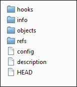
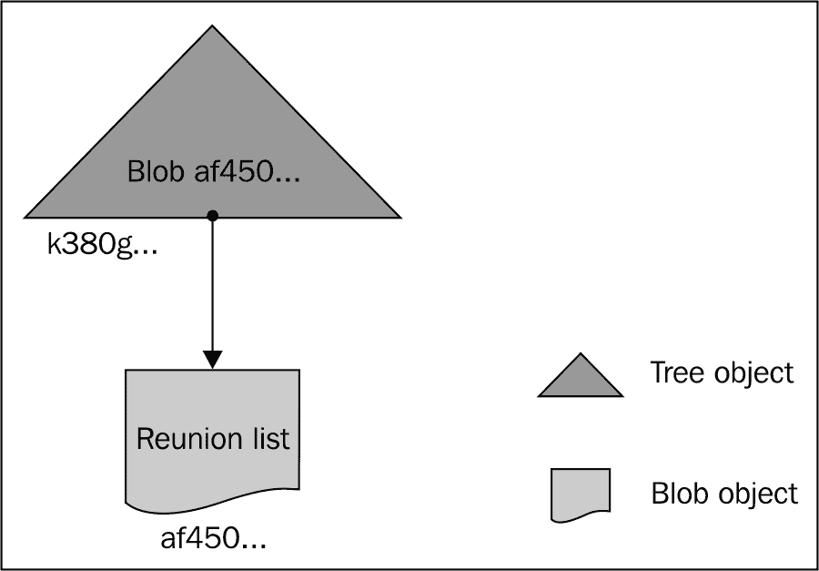
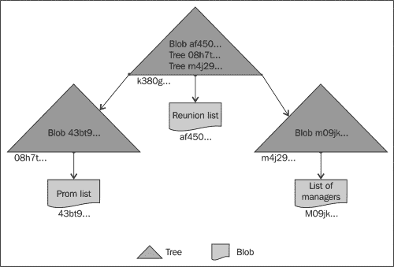
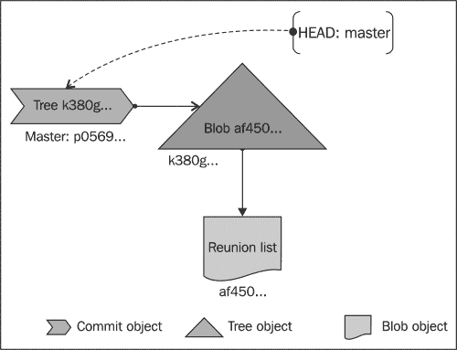
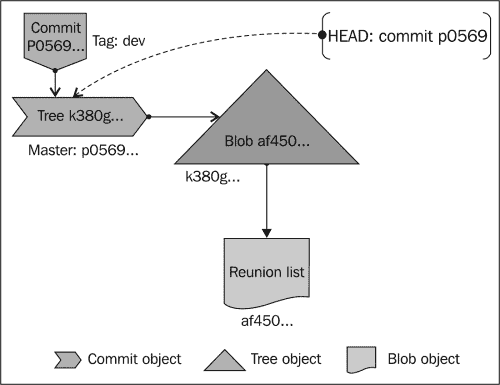

# 第八章：幕后 – Git 基础知识的基础

*那些在体验 Git 的强大功能后脸上露出惊叹表情的人，可能会对这背后的机制感到好奇。*

本章专门为那些希望深入了解以下操作细节的用户而写：

+   init

+   add

+   commit

+   status

+   clone

+   fetch

+   merge

+   remote

+   pull

+   push

+   tag

+   branch

+   checkout

我们首先了解 Git 仓库的组成，然后分析 Git 如何智能地管理内容，最后概述 Git 如何通过关系之间的关系来存储和传输内容。

# Git 的两个方面：管道（plumbing）和外壳（porcelain）

无论你的新车宣传册中有多少突出显示的特点，它都必须拥有一个用户友好的界面，让你真正能欣赏并享受它所提供的精致功能。虽然核心工作在内部完成，但外部界面起到了启用作用。

类似地，Git 在内层和外层都使用以下命令：

+   **管道命令**：这些命令负责低级操作，这些操作构成了 Git 的基础。

+   **外壳命令**：这些命令以易于理解且吸引终端用户的名称，在高层次上涵盖了底层管道操作。

我们在前面的章节中学到的命令属于外壳命令类型。让我们深入了解它们的幕后工作。

# Git init

你知道这个命令会创建一个名为 `.git` 的新子目录，这是版本控制的源头。我们进一步探讨 `.git` 目录的内容，应该有如下截图所示的目录结构：



## Hooks

Hooks 是可以注入到各种 Git 命令和操作中的自定义脚本。我们可以编写自己的钩子，钩子必须放在这个目录中。

在这个目录中，有一些在执行 `git init` 时自动创建的示例钩子，但在我们手动将 `hook_name.sample` 重命名为 `hook_name` 之前，它们不会被激活。要了解目录中各种钩子的详细信息，请在命令行中输入 `git help hooks` 查看帮助文档。

## Info

仓库的附加信息记录在此目录中。目前，唯一的文件是名为 `exclude` 的文件。这个文件作为一个主清单，列出了要从 Git 跟踪中排除的文件。

听起来很熟悉，对吧？的确，`.gitignore` 文件执行的操作与此相同，不同之处在于，排除模式写入排除文件时，仅反映在本地仓库中，而不会出现在后续的克隆中；而当写入 `.gitignore` 时，它成为历史的一部分，可以接受其他 Git 操作，如 add、commit、merge、clone、pull、push 等。

## Config

这个名字说明了一切；这个文本文件是我们项目/仓库特定的配置文件。我们在前面的章节中已经讨论了该文件的更细节的工作原理，但我们需要涵盖的内容超出了本书的范围。

这里是 Git 用来维护远程部分条目的地方，无论是从哪里克隆仓库，还是数据交换的来源。它还包含一些核心设置，比如仓库是否为裸仓库等。

## 描述

有一个名为 gitweb 的软件包，它随 Git 安装包一起提供，允许我们为 Git 仓库设置 Web 界面。这意味着可以通过任何网页浏览器访问仓库。

这个描述文件包含了仓库的用户定义描述，供 gitweb 程序使用，以显示给请求仓库列表的客户端。

## 对象

正如你正确理解的那样，像任何其他版本控制系统（VCS）仓库一样，Git 仓库实际上是一个数据库，包含了所有必要的数据，用于保留、再现和管理文件的修订历史，但 Git 处理这些操作的方式使其与其他版本控制系统有所不同。

这之所以可能，是因为 Git 以对象的方式处理其所有内容。Git 中有四种类型的对象，分别是 blobs、trees、commits 和 tags，正是通过这些对象，它才能实现这种操作。

### Blob

我相信你对积木游戏一定很熟悉；我们在生活中的某个时刻都玩过。当你回想起来，你会记得不管你搭建的是哪种结构，它基本上都是由几个独立的积木块拼接而成的。当你完成玩耍或者希望保存尚未完成的结构，以便以后继续时，我们会把它放进一个盒子或封装内，安全存储。

类似地，当涉及到计算机上的数据处理时，无论是图像、音频或视频剪辑，还是 PDF 文档，它们本质上都是由多个二进制数据位构成的。**二进制大对象**（**blob**）实际上就是一组二进制数据，这些数据被存储在一个盒子/封装内，作为一个整体供以后使用。

在这里，blob 存储任何类型的数据，无论其结构如何。它们只关注内容，而不关注内容的元数据——甚至不关注文件的位置或名称。

### 树

树对象是 Git 对目录及其内容结构的内部表示。它们类似于文件系统中的目录，指向文件和/或其他目录。在这里，Git 树对象可以指向 Git blob 或/和其他 Git 树对象。

### 提交

提交对象保存了所有对仓库内容进行更改时的元数据。元数据包括更改的作者、更改的提交者（是的，可能是两个人不同）以及他们的电子邮件地址、日期和时间。

### 标签

标签对象携带一个人类可读的名称，可以附加到其他对象上，通常是一个提交对象，以便于检索以及我们在之前章节中讨论的标签相关其他原因。

## HEAD

HEAD 就像一个指针，指向 Git 引擎当前所在的活动分支（我们正在工作的分支）以进行进一步操作。如果使用文本编辑器打开它，并且你当前在主分支（master）上，你将看到如下内容：

```
ref: refs/heads/master
```

如果你当前正在`test_release`分支上工作，你将会看到以下内容，依此类推：

```
ref: refs/heads/test_release
```

## 引用

如果你曾经好奇过，为什么从浏览器访问[google.com](http://google.com)和[173.194.35.39](http://173.194.35.39)都能得到相同的 Google 搜索页面，你会意识到应该有某个地方有一个映射关系连接这两者。另一个简单的例子：想象一下你的考勤登记簿，每个人的名字都与一个独特的员工/学生 ID 绑定，这个 ID 可以用来在有相同名字的人中识别出某个人，反之亦然。

类似地，`refs`目录的作用是为 Git 在某些操作中提供引用。它存储仓库中重要节点的 SHA-1 ID，如标签和分支。标签的元数据存储在位于`refs/tags`的另一个目录中，而分支的元数据存储在位于`refs/heads`的不同目录中。

每个分支名称都是`heads`目录中的一个文件，这些文件的内容包含该分支创建时的提交的 SHA-1 ID（在 Git 术语中是父提交）。标签也是如此——每个标签名称都是`tags`目录中的一个文件，文件中包含一个 SHA-1 ID 作为引用。

### 警告 – 目录位于`heads`和`tags`中的结构

我们讨论过`tags`和`heads`目录中的文件，它们代表你在仓库中创建的标签和分支名称。如果你在`heads`和`tags`目录中看到一个或多个目录结构，不要感到困惑。

这只是分支或标签所赋予的层次结构名称的表示方式。通过查看以下示例，重点关注分支概念，标签也适用，事情会变得更清楚。

创建一个名为`mybranch`的分支（`git branch mybranch`）。这将会在`heads/mybranch`创建一个名为`mybranch`的文件，而创建一个具有层次结构名称的分支，如`kamia/kashin`（`git branch kamia/kashin`），将会在`heads/kamia/kashin`创建一个名为`kashin`的文件。

到目前为止，我们探讨了一个新初始化的 Git 仓库的重要部分，这个仓库尚未进行任何提交。然而，还有一个关键角色叫做索引，当你向仓库添加内容时，它会被创建。

## 索引

索引文件是 Git 存储暂存区信息的地方，待提交。简而言之，索引文件的内容将成为你下次提交的内容。换句话说，这就是你保存希望提交到仓库的文件的地方。

# Git——一个内容跟踪系统

我们理解 Git 如何看待数据非常重要；它不是通过文件名或文件在目录结构中的位置来识别文件，而是强调文件的内容。这意味着，当两个或多个文件的内容相同，不论它们位于仓库中的哪个位置，Git 会通过它们的哈希值来识别它们之间的关系。

### 注意

计算哈希是 Git 在永久存储任何数据之前的第一步。给定内容的哈希值在全球范围内是唯一的。这意味着，包含“Hello world”的文件在你我的计算机中的哈希值是相同的，甚至在任何其他人的计算机中也是如此。

通过找出相似性，Git 将内容放入一个单独的 blob 对象并进行存储。请注意，后台只存储一份内容副本，从而最大程度地减少硬件使用，并且在需要重现时，Git 可以利用存储在树对象中的元数据还原出精确的存储模式。

这种哈希计算会在需要时发生，在多个阶段中进行，因此，即使其中某个文件发生微小变化，也会生成一个新的哈希值，Git 会将其单独存储。由于这些过程（尤其强调）围绕内容进行，而不考虑文件的名称或位置，Git 通常被称为内容跟踪系统。

# Git 添加

当执行`add`命令时，Git 会使用工作树中的当前内容更新索引（暂存你的更改），并为下次提交准备暂存的内容，涉及以下步骤：

1.  计算内容的哈希值。

1.  决定是创建新的内容，还是链接到现有的 blob 对象。

1.  blob 的实际创建或链接发生在此时。

1.  创建树对象以追踪内容的位置。

此时，索引被认为持有工作树中内容的快照，准备进行下次提交。

如你所知，此命令可以在提交前多次执行。它仅在`add`命令运行时添加指定文件的内容；如果你希望将后续更改包含在下次提交中，必须再次运行`git add`以将新的内容添加到索引中。

### 注意

更重要的是，在以下图示中，blob 和树对象如何创建并通过各自的哈希 ID 进行链接的过程。



正如之前讨论的，树对象不仅可以指向一个 blob，还可以指向另一个树对象，从而形成一个层级网络，如下图所示：



# Git 提交

当执行`commit`命令时，会创建一个提交对象，包含之前通过`git add`命令添加的内容/更改的元数据。元数据包括以下内容：

+   提交更改的人名、相关的日期和时间以及时区设置

+   提交更改的人名、相关的日期和时间以及时区设置

然后，创建的提交对象会与已经链接到 blob 的 tree 对象进行连接，从而完成版本控制过程，如下图所示：



请注意，HEAD 包含的是分支名称，而不是它指向的提交的 SHA-1 ID。这是因为当分支中的提交数量和位置不断变化时，很难通过提交 ID 来识别一个分支，因此才有“分支移动”的说法。

### 注意

不必担心 blob 和 tree 对象，这些对象是在未提交时作为`add`操作的一部分创建的；它们会在几个月后作为垃圾回收过程的一部分被销毁。

现在，如果你执行`git status`，你会看到你已经暂存的更改不再处于暂存状态。

# Git 状态

当执行`status`命令时，Git 会检查文件的路径和大小。如果没有差异，它将保持原样，但如果发现差异，它会继续计算哈希值，并检查与其他哈希值的关系，就像我们之前看到的那样。

文件路径比较会在以下阶段进行：

| 阶段编号 | 比较 | 相关状态信息 |
| --- | --- | --- |
| 1 | 索引中的文件路径与最近的提交（HEAD 提交）相比 | 待提交的更改 |
| 2 | 索引中的文件路径与工作区相比 | 更改未暂存以供提交 |
| 3 | 工作区中未被 Git 跟踪的路径（且未被`gitignore`或排除文件忽略） | 更改未暂存以供提交 |

第一个状态表示已经添加（暂存）但未提交的更改。因此，执行`git commit`将完成版本控制过程。

第二和第三种状态表示更改尚未添加（暂存）以供提交。因此，要完成版本控制过程，我们需要首先使用`git add`添加它们，然后使用`git commit`提交。

# Git 克隆

当执行`clone`命令时，内部过程的顺序如下：

1.  如果目标目录不存在，则创建它，并在其上执行`git init`。

1.  在目标仓库中为源仓库中的每个分支设置远程追踪分支（`git remote`）。

1.  获取对象，引用（位于`.git`目录中）。

1.  最后执行检出（checkout）。

# Git 远程

当执行`remote`命令时，Git 会通过读取本地配置文件`.git/config`中的远程部分，列出添加到仓库的所有远程仓库。配置文件内容的示例如下：

```
[remote "capsource"]
url = https://github.com/cappuccino/cappuccino
fetch = +refs/heads/*:refs/remotes/capsource/*
```

`capsource` 是我们在向仓库添加新远程时给 URL 起的别名。在这一部分，有两个引用参数被捕获：

| 引用参数 | 描述 |
| --- | --- |
| `url` | 这是你想要在本地仓库中追踪、共享和获取内容的远程仓库的 URL。 |
| `Fetch` | 这是用来将远程的 refs（分支和标签）传递给 Git 以便进行追踪。默认情况下，它会追踪远程仓库中 `refs/heads/*` 下的所有 refs。这些内容被放置在本地仓库目录 `capsource` 下，路径为 `refs/remotes/capsource/*`。 |

# Git 分支

当执行 `branch` 命令时，Git 会执行以下步骤：

1.  收集 `.git/refs/heads/` 中的所有分支名称。

1.  利用位于 `.git/HEAD` 中的条目找到当前活跃的工作分支。

1.  以升序显示所有分支，并在活动分支旁边标记一个星号（*）。

请注意，这种列出的分支仅为本地仓库中的分支。当你想列出所有分支，包括存储在 `.git/refs/remotes/` 中的远程追踪分支时，可以使用 `git branch –a`。

# Git 标签

当执行 `tag` 命令时，Git 会执行以下步骤：

1.  获取引用的提交的 SHA-1 ID。

1.  验证给定的标签名称与现有标签名称的重复性。

1.  如果是新名称，它会根据命名规则验证名称。

1.  如果名称符合规则，Git 会创建一个标签对象，并将给定名称映射到获取的 SHA-1 ID，存放在 `.git/refs/tags/` 中。

下图展示了标签对象与其他对象的关联：



# Git 拉取

当执行 `fetch` 命令时，Git 会执行以下步骤：

1.  检查 URL 或远程名称，确保它指向在命令 `git fetch remote_name`（或）`url` 中指定的有效 Git 仓库。

1.  如果没有指定，它会读取配置文件，查看是否有默认的远程库。

1.  如果找到，它会从远程仓库获取命名的 refs（分支和标签）以及它们相关的对象。

1.  检索到的 ref 名称会存储在 `.git/FETCH_HEAD` 中，以便将来可能的合并操作。

# Git 合并

在执行 `merge` 命令时，Git 会执行以下步骤：

1.  根据指定的参数，从 `heads` 目录中识别两个合并候选分支。

1.  查找两个头部的公共祖先，并将它们的所有对象加载到内存中。

1.  对公共祖先与头部一进行差异对比（diff）。

1.  应用与头部二的差异。

1.  如果在公共区域（分支之间）有变化，Git 会用标记显示冲突并提醒用户解决冲突（期望用户解决冲突，添加更改并提交）。

1.  如果没有冲突，合并这些内容，并进行一次合并提交，附上元数据说明。

# Git 拉取

执行 `pull` 命令时，Git 会内部执行以下操作：

1.  使用给定参数执行`Git fetch`。

1.  调用`git merge`将获取的分支头合并到当前分支。

# Git push

执行`push`命令时，Git 将执行以下操作：

1.  确定当前分支。

1.  在配置文件中查找默认远程仓库的存在（如果没有找到，它会提示你在执行`git push`时提供远程仓库的名称或 URL 作为参数）。

1.  了解远程仓库的 URL 及其跟踪的分支（heads）。

1.  检查自上次从远程仓库获取更新以来，远程仓库是否发生了变化。

    +   获取远程仓库的引用列表（使用`git ls-remote`）。

    +   检查本地历史记录中是否有该列表中的条目。如果远程的引用是本地仓库历史的一部分，说明自上次从远程仓库获取/拉取更新以来没有其他变化。因此，Git 会允许你直接将更改推送到远程仓库。如果它不是本地仓库历史的一部分，Git 会理解自上次从远程仓库获取/拉取更新以来，远程仓库已有所变化。因此，它会要求你先执行`git fetch`或`git pull`，然后再进行推送。

# Git checkout

当执行`checkout`命令时没有任何参数，Git 会执行以下步骤：

1.  获取工作区中命名路径的内容。

1.  从索引中获取相关对象。

1.  使用索引中的内容更新工作区的内容。

然而，行为会根据所使用的参数有所变化。

| 参数 | 描述 |
| --- | --- |
| `-b` | 用于从指定的提交 ID 位置创建一个新分支。`git checkout –b <your_branch_name>`是`git checkout branch`后接`git checkout <branch_name>`的简写。这条命令会在`.git/refs/heads/`中创建一个新的引用，指向特定的提交 ID。 |

| `--track` | 该参数用于设置上游配置，通常在使用`–b`参数创建新分支时使用。执行时，`.git`目录中的`.config`文件会新增一部分内容，内容如下： |

```
[branch "master"]
        remote = origin
        merge = refs/heads/master
```

当执行类似`git checkout --track -b master origin/master`的命令时，会发生这种情况。 |

# 关系之间的关系——Git 打包文件

我们看到了 Git 如何通过内容识别文件之间的关系，并智能地选择是为内容创建一个新 blob，还是引用现有的 blob。我们还理解到，即使内容有一点点变化，也会导致 Git 存储一个独立的 blob，因为 SHA-1 ID 会发生变化。

假设你有两个文本文件，每个文件 5MB，内容相同但存储位置不同。Git 会根据情况创建一个单独的 blob，因为相同的内容会生成相同的 SHA-1 ID，从而节省空间。

现在，向其中一个文件的内容添加一行。Git 将为已更改的第二个文件创建一个新的 blob（大小为 5+ MB）。观察到两个几乎相同的 5 MB 的 blobs，可能会引发一些问题。

+   为什么 Git 为整个内容创建一个新的 blob？

+   为什么不保留两个文件之间共享的旧的 blob，并为仅在第二个文件中引入的差异创建一个新的 blob，从而减少存储并提高效率呢？

好的，这些是很好的问题；Git 通过一种叫做**packfiles**的方式提供了答案。我们刚刚讨论的场景中创建的对象被称为松散对象（loose objects），Git 会自动地、偶尔地将这些松散对象打包成一个单一的二进制文件，称为 packfile。

## 传输 packfiles

Git 不仅支持在操作如 clone、fetch、push 和 pull 中传输 refs 及其相关的普通 blob、tree、commit 和 tag 对象，还支持传输 packfiles。从更高层次来看，Git 为在远程之间传输数据提供了两套协议。

+   一个用于从客户端向服务器推送数据

+   另一个用于从服务器获取数据到客户端

    | 实现方 | 进程调用 | 描述 |
    | --- | --- | --- |
    | 服务器端 | Upload-pack | 由`git fetch-pack`调用，它了解对方缺少哪些对象，并在打包后发送它们。 |
    | 客户端 | Fetch-pack | 负责从另一个仓库接收缺失的包。这个命令通常不是由最终用户直接调用，而是通过一个更高级的封装命令`git fetch`执行。 |
    | 服务器端 | Receive-pack | 由`git send-pack`调用，接收推送到仓库中的内容。 |
    | 客户端 | Send-pack | 负责通过 Git 协议将对象推送到另一个仓库。这个命令通常不是由最终用户直接调用，而是通过一个更高级的封装命令`git push`执行。 |

# 总结

我们学习了以下内容：

+   Git 仓库的结构以及每个对象在版本控制过程中所扮演的角色

+   不同的对象以及 Git 如何智能地使用这些对象管理内容

此外，我们还详细了解了像 `init`、`add`、`commit`、`status`、`clone`、`fetch`、`merge`、`remote`、`pull`、`push`、`tag`、`branch` 和 `checkout` 等命令的内部实现，这些命令我们在前面的章节中使用过，帮助我们掌握了版本控制的概念。

不仅如此，我们还从更高层次上看到了 Git 如何不仅基于文件的完整内容理解文件之间的关系，还通过 packfiles 以部分内容的形式进行理解。
